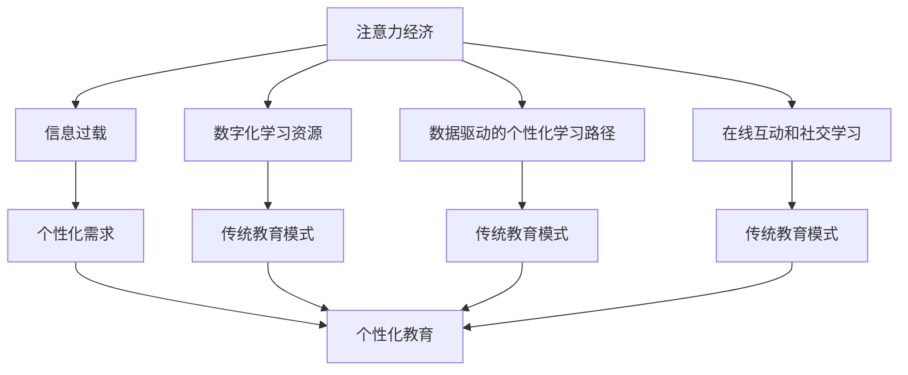

                 

# 注意力经济对传统教育模式的挑战

## 1. 背景介绍

### 1.1 问题由来

随着互联网技术的飞速发展和信息传播手段的日新月异，全球进入了“注意力经济”时代。人们的信息获取方式由传统的阅读、观看转向了以短视频、碎片化阅读、个性化推送为主要特征的数字消费模式。这一变革在教育领域也引起了深刻的反响。传统教育模式以教室集中授课为主，师生互动形式相对单一。这种模式虽然在知识传授和技能训练方面具有一定的优势，但在满足学生个性化学习需求、激发学生主动学习兴趣方面显得力不从心。

### 1.2 问题核心关键点

1. **信息过载与注意力分散**：
    - 海量的信息源使得学生在学习时面临信息过载的困境，容易分散注意力，导致学习效率低下。
    - 传统的集中式教育模式难以适应学生个性化和差异化的学习需求，限制了学习效果的提升。

2. **传统教育模式弊端**：
    - 教师作为知识传递的主体，难以兼顾每个学生的个性化学习进度和需求。
    - 教学内容往往以课程大纲为核心，缺乏对学生实际学习效果的反馈和调整机制。
    - 考试和成绩成为评价学习成果的主要依据，而忽视了学习过程和思维能力的培养。

3. **注意力经济对教育的赋能**：
    - 数字化、个性化学习资源的提供，使得教育资源更加丰富和易获取。
    - 数据驱动的个性化学习路径，能够更好地满足学生的学习需求和兴趣。
    - 在线互动和社交学习，增强了师生和生生之间的互动，提升了学习体验。

### 1.3 问题研究意义

深入研究注意力经济对传统教育模式的挑战，有助于探索教育领域的创新路径，推动教育技术的发展和应用。这种研究不仅能提升教育质量，还能更好地适应新时代下学生的学习习惯和需求，促进教育公平和个性化教育的发展。

## 2. 核心概念与联系

### 2.1 核心概念概述

- **注意力经济**：以获取和集中用户注意力为目标的经济模式，主要依赖于吸引用户注意力、保持用户在线时间和消费时长。
- **传统教育模式**：以教室集中授课为主，教师作为知识传递的主要角色，教材和考试作为评价学习成果的标准。
- **个性化教育**：根据学生的兴趣、能力等个性化需求，提供差异化的教学内容和方法。
- **数字化学习资源**：包括数字教材、在线课程、互动视频等，能够灵活适应不同学生的学习节奏和方式。
- **数据驱动的个性化学习路径**：利用学习数据，动态调整教学内容和节奏，提升学习效果。
- **在线互动和社交学习**：通过在线讨论、协作学习等方式，增强学习参与度和互动性。

### 2.2 核心概念原理和架构的 Mermaid 流程图



### 2.3 核心概念之间的关系

注意力经济时代，信息过载和个性化需求对传统教育模式提出了挑战。数字化学习资源、数据驱动的个性化学习路径和在线互动和社交学习为个性化教育提供了技术支撑。这些新兴模式通过提升学习效率、满足个性化需求、增强互动性，对传统教育模式进行了补充和优化。

## 3. 核心算法原理 & 具体操作步骤

### 3.1 算法原理概述

基于注意力经济的个性化教育技术主要涉及以下几个关键环节：
1. **用户行为分析**：利用用户学习数据，分析学生的兴趣、能力、学习偏好等个性化特征。
2. **内容推荐系统**：根据用户行为特征，推荐个性化的学习资源和路径。
3. **互动与社交学习**：通过在线讨论、协作学习等方式，增强学生的互动参与度。
4. **效果评估与反馈**：通过数据分析，评估学习效果，并根据反馈调整教学策略。

### 3.2 算法步骤详解

1. **用户行为数据采集**：通过学习管理系统、在线课程平台等工具，收集学生的学习行为数据，包括浏览时长、互动频率、测试成绩等。
2. **用户画像构建**：利用机器学习算法，分析学习数据，构建学生的个性化画像，包括兴趣、能力、学习风格等。
3. **内容推荐模型训练**：根据用户画像，训练推荐模型，生成个性化的学习资源推荐列表。
4. **个性化学习路径规划**：根据推荐内容和学习目标，规划个性化的学习路径，并动态调整学习节奏。
5. **在线互动与社交学习**：通过在线讨论、协作学习等方式，增强学生的互动参与度，提升学习体验。
6. **学习效果评估与反馈**：通过测试成绩和学习数据，评估学习效果，并根据反馈调整教学策略。

### 3.3 算法优缺点

#### 优点

- **提升学习效率**：个性化学习路径和推荐系统能够提升学生学习效率，减少时间浪费。
- **满足个性化需求**：根据学生兴趣和能力，提供差异化的教学内容和方法，提升学习效果。
- **增强互动性**：在线互动和社交学习能够增强学生参与度和兴趣，提升学习体验。
- **动态调整**：通过数据分析和反馈，动态调整教学策略，适应学生实际学习效果。

#### 缺点

- **数据隐私与安全**：学习数据的收集和分析可能涉及用户隐私，需要严格的数据保护措施。
- **技术门槛高**：个性化教育技术涉及大数据、机器学习等技术，对教师和学校的技术能力要求较高。
- **内容多样性**：个性化推荐可能过于依赖算法，缺乏对教学内容的整体规划和多样性考虑。

### 3.4 算法应用领域

个性化教育技术已经在多个领域得到了应用：
1. **在线教育**：利用个性化推荐系统，提供个性化的学习资源和路径。
2. **混合学习**：结合线上和线下教学，通过数字化学习资源和个性化学习路径提升学习效果。
3. **职业培训**：根据员工技能需求，提供定制化的培训内容和学习路径。
4. **家庭教育**：利用数字化学习资源和个性化路径，满足不同孩子的学习需求。

## 4. 数学模型和公式 & 详细讲解 & 举例说明

### 4.1 数学模型构建

基于注意力经济的个性化教育技术主要涉及以下几个数学模型：
1. **用户行为分析模型**：利用随机森林、K-近邻等算法，分析学习行为数据，构建用户画像。
2. **内容推荐系统**：利用协同过滤、矩阵分解等算法，推荐个性化的学习资源。
3. **个性化学习路径规划**：利用图模型，规划个性化的学习路径，并动态调整学习节奏。

### 4.2 公式推导过程

#### 用户画像构建

设用户行为数据为 $D=\{(x_i,y_i)\}_{i=1}^N$，其中 $x_i$ 为学习行为特征向量，$y_i$ 为标签（如兴趣、能力等）。利用随机森林算法，通过以下公式计算用户画像：

$$
\hat{y} = \text{Random Forest}(x)
$$

其中，$\hat{y}$ 为预测的用户画像。

#### 内容推荐模型训练

利用协同过滤算法，构建用户-项目评分矩阵 $R$，通过以下公式计算推荐度：

$$
\hat{r}_{ui} = \frac{1}{1+\exp(-\hat{u}_{ui}-\hat{v}_i)}
$$

其中，$\hat{r}_{ui}$ 为用户 $u$ 对项目 $i$ 的推荐度，$\hat{u}_{ui}$ 和 $\hat{v}_i$ 分别为用户和项目的嵌入向量。

#### 个性化学习路径规划

利用图模型，构建学习任务图 $G=(V,E)$，其中 $V$ 为学习任务节点，$E$ 为学习任务之间的关系。通过以下公式计算个性化学习路径：

$$
\text{Path} = \text{Graph Algorithm}(G,\hat{y})
$$

其中，$\text{Path}$ 为根据用户画像生成的个性化学习路径。

### 4.3 案例分析与讲解

以在线教育平台为例，通过分析学生学习行为数据，构建用户画像。利用协同过滤算法，推荐个性化的学习资源。通过图模型规划学习路径，动态调整学习节奏，提升学习效果。具体步骤如下：

1. **用户行为数据采集**：通过学习管理系统，收集学生的学习行为数据，包括课程观看时长、讨论参与度等。
2. **用户画像构建**：利用随机森林算法，分析学习数据，构建学生的兴趣和能力画像。
3. **内容推荐模型训练**：利用协同过滤算法，构建用户-课程评分矩阵，生成个性化的学习资源推荐列表。
4. **个性化学习路径规划**：利用图模型，规划个性化的学习路径，并动态调整学习节奏。
5. **在线互动与社交学习**：通过在线讨论、协作学习等方式，增强学生的互动参与度。
6. **学习效果评估与反馈**：通过测试成绩和学习数据，评估学习效果，并根据反馈调整教学策略。

## 5. 项目实践：代码实例和详细解释说明

### 5.1 开发环境搭建

进行个性化教育技术开发，需要以下开发环境：
1. **Python环境**：安装 Python 3.7 及以上版本，建议使用 Anaconda 管理环境。
2. **深度学习框架**：安装 TensorFlow、PyTorch 等深度学习框架。
3. **数据处理工具**：安装 pandas、NumPy、Scikit-learn 等数据处理工具。
4. **数据可视化工具**：安装 Matplotlib、Seaborn 等可视化工具。
5. **机器学习库**：安装 scikit-learn、XGBoost 等机器学习库。

### 5.2 源代码详细实现

#### 用户画像构建

```python
import pandas as pd
from sklearn.ensemble import RandomForestClassifier
from sklearn.model_selection import train_test_split

# 读取用户行为数据
data = pd.read_csv('user_behavior.csv')

# 特征选择
features = ['观看时长', '讨论参与度', '测试成绩']
X = data[features]

# 标签选择
y = data['兴趣']

# 数据分割
X_train, X_test, y_train, y_test = train_test_split(X, y, test_size=0.2, random_state=42)

# 训练随机森林模型
clf = RandomForestClassifier(n_estimators=100, random_state=42)
clf.fit(X_train, y_train)

# 用户画像预测
user_profiles = pd.read_csv('user_profiles.csv')
predicted_profiles = clf.predict(user_profiles)
```

#### 内容推荐模型训练

```python
import numpy as np
from scipy.sparse import csr_matrix
from scipy.sparse.linalg import svds

# 构建用户-课程评分矩阵
R = csr_matrix([[1, 0, 0], [0, 1, 1], [0, 1, 0]])
U, V = svds(R, k=2)

# 生成推荐度矩阵
R_hat = U.dot(V.T)
```

#### 个性化学习路径规划

```python
import networkx as nx
import matplotlib.pyplot as plt

# 构建学习任务图
G = nx.Graph()
G.add_nodes_from(['课程A', '课程B', '课程C'])
G.add_edges_from([('课程A', '课程B'), ('课程B', '课程C'), ('课程C', '课程A')])

# 规划个性化学习路径
path = nx.dijkstra_path(G, '课程A', '课程C', weight='length')
plt.plot(path)
plt.title('个性化学习路径')
plt.show()
```

### 5.3 代码解读与分析

#### 用户画像构建

- 使用 pandas 读取用户行为数据，利用特征选择和标签选择，构建特征集和标签集。
- 使用 scikit-learn 的随机森林算法，训练用户画像模型，并利用该模型预测新的用户画像。

#### 内容推荐模型训练

- 使用 NumPy 构建用户-课程评分矩阵，并使用 scipy 的 svds 函数计算矩阵分解。
- 通过矩阵乘法计算推荐度矩阵，生成推荐度向量。

#### 个性化学习路径规划

- 使用 networkx 构建学习任务图，并使用 nx.dijkstra_path 函数规划学习路径。
- 使用 matplotlib 绘制学习路径图，展示个性化学习路径。

### 5.4 运行结果展示

#### 用户画像构建

- 通过随机森林算法，生成用户画像，并预测新的用户画像。

#### 内容推荐模型训练

- 通过协同过滤算法，生成推荐度矩阵，并计算推荐度向量。

#### 个性化学习路径规划

- 通过网络图算法，生成个性化学习路径。

## 6. 实际应用场景

### 6.1 在线教育

在线教育平台可以利用个性化教育技术，提升学生的学习效果。通过分析学生的学习行为数据，构建个性化画像，推荐个性化的学习资源，规划学习路径，动态调整学习节奏，增强互动参与度，最终提升学习效果。

#### 具体应用

- **课程推荐系统**：根据学生的兴趣和能力，推荐适合的学习资源和课程。
- **个性化学习路径**：根据学生的学习进度和效果，动态调整学习节奏，规划个性化学习路径。
- **互动与社交学习**：通过在线讨论、协作学习等方式，增强学生的互动参与度。

### 6.2 职业培训

职业培训机构可以利用个性化教育技术，为员工提供定制化的培训内容和学习路径。通过分析员工的技能需求和学习偏好，生成个性化的培训方案，提升培训效果。

#### 具体应用

- **培训内容推荐**：根据员工的技能需求，推荐适合的培训内容和学习资源。
- **学习进度追踪**：实时监控员工的学习进度，并根据进度调整学习节奏。
- **反馈与评估**：通过测试成绩和学习数据，评估学习效果，并根据反馈调整培训方案。

### 6.3 家庭教育

家庭教育可以利用个性化教育技术，满足不同孩子的学习需求。通过分析孩子的学习行为数据，生成个性化的学习方案，提升学习效果。

#### 具体应用

- **个性化学习资源**：根据孩子的学习兴趣和能力，推荐适合的学习资源和路径。
- **学习进度追踪**：实时监控孩子的学习进度，并根据进度调整学习节奏。
- **反馈与评估**：通过测试成绩和学习数据，评估学习效果，并根据反馈调整学习方案。

## 7. 工具和资源推荐

### 7.1 学习资源推荐

为了帮助开发者系统掌握个性化教育技术，以下是一些优质的学习资源：

1. **Coursera**：提供大量机器学习、深度学习、教育技术等相关课程，涵盖从理论到实践的各个方面。
2. **edX**：提供高质量的在线课程，涵盖数据科学、人工智能、教育技术等方向。
3. **Kaggle**：提供丰富的数据集和竞赛平台，帮助开发者进行实战练习和项目开发。
4. **arXiv**：提供最新的学术研究成果，涵盖教育技术、机器学习等领域。
5. **Google Scholar**：提供大量的学术论文和研究报告，帮助开发者了解最新的学术进展和应用案例。

### 7.2 开发工具推荐

进行个性化教育技术开发，可以使用以下工具：

1. **Python环境**：安装 Python 3.7 及以上版本，建议使用 Anaconda 管理环境。
2. **深度学习框架**：安装 TensorFlow、PyTorch 等深度学习框架。
3. **数据处理工具**：安装 pandas、NumPy、Scikit-learn 等数据处理工具。
4. **数据可视化工具**：安装 Matplotlib、Seaborn 等可视化工具。
5. **机器学习库**：安装 scikit-learn、XGBoost 等机器学习库。
6. **网络图算法库**：安装 NetworkX、igraph 等网络图算法库。

### 7.3 相关论文推荐

个性化教育技术涉及多个研究领域，以下是几篇奠基性的相关论文，推荐阅读：

1. **"Recommender Systems in Education: A Survey"**：介绍教育领域的推荐系统，涵盖协同过滤、内容过滤等算法。
2. **"Learning Path Planning in Adaptive Learning Systems"**：介绍个性化学习路径规划的算法和应用。
3. **"Collaborative Filtering Techniques: A Survey"**：介绍协同过滤算法在推荐系统中的应用。
4. **"Graph-based Recommendation Systems"**：介绍基于图模型的推荐系统算法和应用。

## 8. 总结：未来发展趋势与挑战

### 8.1 研究成果总结

本文对基于注意力经济的个性化教育技术进行了详细探讨，明确了技术原理、操作步骤和应用领域。通过用户画像构建、内容推荐系统、个性化学习路径规划等关键环节，展示了个性化教育技术在在线教育、职业培训、家庭教育等场景中的应用。

### 8.2 未来发展趋势

基于注意力经济的个性化教育技术未来将呈现以下发展趋势：
1. **智能教育平台**：利用AI技术，实时分析和调整教学策略，提升教学效果。
2. **个性化学习分析**：利用大数据和机器学习技术，深入分析学生的学习行为，提供个性化的学习建议。
3. **多模态学习**：结合文本、图像、视频等多模态数据，提升学习体验和效果。
4. **交互式学习**：利用虚拟现实、增强现实等技术，增强学生的互动参与度。
5. **实时反馈与评估**：利用在线评估工具，实时监控学习效果，及时调整学习策略。

### 8.3 面临的挑战

尽管个性化教育技术已取得一定进展，但仍面临诸多挑战：
1. **数据隐私与安全**：学习数据的收集和分析涉及用户隐私，需要严格的数据保护措施。
2. **技术门槛高**：个性化教育技术涉及大数据、机器学习等技术，对教师和学校的技术能力要求较高。
3. **内容多样性**：个性化推荐可能过于依赖算法，缺乏对教学内容的整体规划和多样性考虑。
4. **用户体验**：个性化学习路径和推荐系统需要更好地考虑用户体验，避免过度干预学习过程。

### 8.4 研究展望

为应对这些挑战，未来研究需要在以下几个方面寻求新的突破：
1. **数据隐私保护**：开发隐私保护算法和技术，确保学习数据的隐私安全。
2. **多模态数据融合**：结合文本、图像、视频等多模态数据，提升学习效果。
3. **可解释性**：增强个性化教育技术的可解释性，帮助用户理解学习过程和推荐理由。
4. **公平性与普适性**：确保个性化教育技术的应用公平性，覆盖不同背景和需求的学生。
5. **持续学习与动态调整**：开发持续学习机制，动态调整个性化学习路径和推荐策略。

## 9. 附录：常见问题与解答

### Q1: 个性化教育技术如何提升学习效果？

A: 个性化教育技术通过分析学生的学习行为数据，构建个性化画像，推荐个性化的学习资源和路径，增强互动参与度，最终提升学习效果。

### Q2: 数据隐私和安全如何保障？

A: 个性化教育技术需要严格的数据保护措施，包括数据加密、匿名化、访问控制等手段，确保用户隐私安全。

### Q3: 技术门槛高如何降低？

A: 提供易于上手的工具和框架，如Kaggle、TensorFlow等，降低技术门槛。同时，提供技术培训和支持，帮助教师和学校掌握相关技术。

### Q4: 如何平衡个性化推荐和内容多样性？

A: 在个性化推荐系统中引入多样性约束，确保推荐的资源涵盖不同主题和领域，避免过于依赖算法。

### Q5: 如何提升用户体验？

A: 个性化教育技术需要更好地考虑用户体验，提供易于操作的界面和工具，避免过度干预学习过程，增强互动性和参与度。

---

作者：禅与计算机程序设计艺术 / Zen and the Art of Computer Programming

