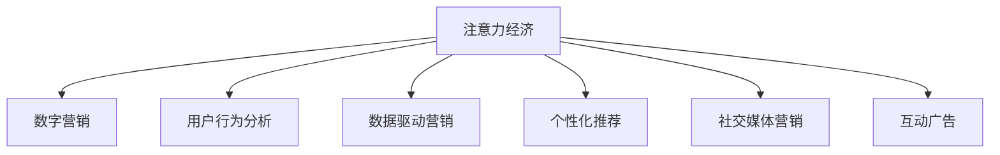

                 

# 注意力经济对传统节日营销的影响

> 关键词：注意力经济, 数字营销, 用户行为分析, 数据驱动营销, 个性化推荐, 社交媒体营销

## 1. 背景介绍

### 1.1 问题由来
随着数字化和网络化的不断发展，传统的营销手段已经难以满足现代消费者的需求。企业需要不断创新营销方式，以吸引更多用户的注意力，提升品牌影响力，进而实现销售增长。特别是对于传统节日，商家通常会推出各种优惠促销活动，但如何在众多品牌竞争中脱颖而出，仍然是一个重要难题。

### 1.2 问题核心关键点
如何有效利用数据和技术手段，分析用户行为和注意力分布，精准锁定潜在客户，提升广告投放的ROI，成为节日营销中亟待解决的问题。具体而言，主要包括：
- 用户注意力如何分配，哪些用户群体更有价值？
- 用户在不同平台上的行为特征有何不同？
- 如何设计个性化推荐，提高用户参与度和转化率？
- 如何利用社交媒体进行有效的用户互动和传播？

### 1.3 问题研究意义
研究注意力经济对传统节日营销的影响，对于提升营销效率，优化资源配置，推动数字经济的发展具有重要意义。通过深入分析用户注意力分布和行为模式，企业可以制定更加精准的营销策略，实现更高效的市场竞争。同时，这也为数据驱动的个性化营销提供了新的思路，推动企业从粗放式营销向精准化营销转型。

## 2. 核心概念与联系

### 2.1 核心概念概述

为更好地理解注意力经济对传统节日营销的影响，本节将介绍几个密切相关的核心概念：

- **注意力经济**：指在信息过载的社会中，注意力成为稀缺资源，企业需要通过各种手段吸引和保持用户的关注。这包括广告投放、社交媒体互动、个性化推荐等多种方式。

- **数字营销**：指利用数字技术手段（如互联网、移动端等）进行市场推广和品牌宣传的活动。通过大数据分析、AI技术等手段，实现精准化、个性化营销。

- **用户行为分析**：通过分析用户在线行为，如浏览记录、购买历史、搜索关键词等，了解用户兴趣和需求，指导营销决策。

- **数据驱动营销**：以数据分析和挖掘为基础，进行精准营销和决策，最大化营销效果。

- **个性化推荐**：通过分析用户偏好，提供符合其兴趣和需求的定制化产品和服务。

- **社交媒体营销**：利用社交网络平台，通过互动、分享等方式，实现品牌传播和用户关系建立。

- **互动广告**：通过互动元素（如游戏、问答、抽奖等），提高用户参与度和品牌认知度。

这些核心概念之间的逻辑关系可以通过以下Mermaid流程图来展示：



这个流程图展示了大语言模型的核心概念及其之间的关系：

1. 注意力经济通过数字营销吸引用户，利用用户行为分析指导个性化推荐，并通过社交媒体营销和互动广告增强用户互动。
2. 数据驱动营销贯穿于整个注意力经济体系，帮助企业进行决策优化和资源配置。

## 3. 核心算法原理 & 具体操作步骤
### 3.1 算法原理概述

基于注意力经济对传统节日营销的影响，核心算法原理主要围绕以下几个方面展开：

- **注意力分配模型**：分析用户在不同渠道上的注意力分配情况，识别高价值用户群体。
- **用户行为预测**：通过用户历史数据，预测其未来行为，如购买意向、品牌偏好等。
- **个性化推荐算法**：结合用户兴趣和行为数据，进行个性化商品推荐。
- **社交媒体互动分析**：分析用户社交媒体上的互动行为，优化互动广告策略。
- **广告投放优化**：基于用户注意力和行为数据，进行广告投放优化，提升广告效果。

### 3.2 算法步骤详解

1. **数据采集与预处理**：收集用户在各个平台上的行为数据，如浏览记录、搜索关键词、购买历史等，并进行清洗、归一化等预处理。

2. **注意力分配分析**：通过统计分析不同平台和渠道的用户停留时间和互动频次，评估各平台的注意力吸引力。

3. **用户行为建模**：利用机器学习模型（如LSTM、XGBoost等）进行用户行为预测，预测用户未来可能采取的行动（如购买、分享等）。

4. **个性化推荐**：结合用户行为数据和偏好特征，使用协同过滤、内容推荐等算法，提供个性化商品推荐。

5. **社交媒体互动分析**：分析用户在社交媒体上的互动行为（如点赞、评论、分享等），识别高互动用户群体，优化互动广告策略。

6. **广告投放优化**：基于用户注意力和行为数据，选择最佳广告投放渠道和时间，进行A/B测试优化广告效果。

### 3.3 算法优缺点

基于注意力经济的大语言模型营销算法，具有以下优点：
1. **精准度高**：通过分析用户行为和注意力数据，可以精准识别高价值用户群体，实现个性化推荐。
2. **投放效率高**：基于数据驱动，优化广告投放渠道和时间，提高广告点击率和转化率。
3. **互动性强**：结合社交媒体互动分析，设计互动广告，增强用户参与度和品牌认知度。
4. **资源配置优**：通过集中资源在高效渠道上进行投放，最大化营销效果。

但同时，该算法也存在一些局限性：
1. **数据隐私问题**：采集用户数据过程中可能涉及隐私保护问题，需要严格遵守相关法律法规。
2. **数据质量要求高**：高质量、完整的数据是算法准确性和效果的关键，数据的缺失和错误可能导致模型效果不佳。
3. **计算资源需求高**：算法需要处理大量数据，对计算资源要求较高，需要高性能服务器支持。
4. **模型解释性不足**：复杂算法模型的决策过程难以解释，可能影响用户信任和接受度。

### 3.4 算法应用领域

基于注意力经济的大语言模型营销算法，已经在多个领域得到了广泛应用，如电商、旅游、餐饮等。以下是几个典型应用案例：

- **电商领域**：电商平台通过分析用户浏览记录和购买历史，提供个性化推荐，提升购物体验和转化率。
- **旅游行业**：旅游平台利用用户行为数据，推荐个性化旅游线路和目的地，增加用户预订意愿。
- **餐饮行业**：餐饮应用通过分析用户评价和消费习惯，进行精准化营销，提升用户满意度和复购率。

除了这些领域，大语言模型营销算法也被应用于更多场景中，如娱乐、教育、健康等，为不同行业带来创新和变革。

## 4. 数学模型和公式 & 详细讲解  
### 4.1 数学模型构建

本节将使用数学语言对基于注意力经济的大语言模型营销算法进行更加严格的刻画。

假设用户行为数据集为 $\{(x_i, y_i)\}_{i=1}^N$，其中 $x_i$ 为行为特征向量，$y_i$ 为行为标签（如购买、评价等）。定义注意力分配模型为 $f(x_i)$，用户行为预测模型为 $g(x_i)$，个性化推荐模型为 $h(x_i)$，社交媒体互动分析模型为 $k(x_i)$，广告投放优化模型为 $l(x_i)$。

### 4.2 公式推导过程

1. **注意力分配模型**：
   - 定义注意力分配函数 $f(x_i) = \alpha x_i + \beta y_i$，其中 $\alpha$ 和 $\beta$ 为注意力分配系数。
   - 通过统计不同平台上的用户停留时间和互动频次，得到注意力分布矩阵 $A \in \mathbb{R}^{N \times d}$，其中 $d$ 为注意力维度。

2. **用户行为预测模型**：
   - 利用历史行为数据，构建用户行为预测模型 $g(x_i)$，如LSTM或XGBoost。
   - 预测用户未来行为 $y_i'$，用于个性化推荐和广告投放优化。

3. **个性化推荐模型**：
   - 通过协同过滤、内容推荐等算法，结合用户行为和偏好特征，进行个性化商品推荐。
   - 推荐模型 $h(x_i)$ 可以根据用户行为 $x_i$ 和商品特征 $s$，生成推荐结果 $r(x_i, s)$。

4. **社交媒体互动分析模型**：
   - 分析用户在社交媒体上的互动行为，构建互动分析模型 $k(x_i)$。
   - 通过互动分析模型，识别高互动用户群体，优化互动广告策略。

5. **广告投放优化模型**：
   - 基于用户注意力和行为数据，选择最佳广告投放渠道和时间，构建广告投放优化模型 $l(x_i)$。
   - 通过A/B测试优化广告效果，提升广告点击率和转化率。

### 4.3 案例分析与讲解

**电商个性化推荐**：
- 电商平台上，用户浏览和购买行为数据丰富，可以通过行为预测模型 $g(x_i)$ 预测用户未来的购买意向，结合协同过滤算法进行个性化推荐。
- 推荐结果 $r(x_i, s)$ 可以通过用户行为 $x_i$ 和商品特征 $s$ 计算得出，如利用用户浏览记录推荐相关商品。

**旅游个性化推荐**：
- 旅游平台收集用户出行历史和偏好数据，通过行为预测模型 $g(x_i)$ 预测用户未来的出行意向，结合内容推荐算法进行个性化线路推荐。
- 推荐结果 $r(x_i, d)$ 可以通过用户偏好 $x_i$ 和旅游线路特征 $d$ 计算得出，如根据用户偏好推荐特定景点。

## 5. 项目实践：代码实例和详细解释说明
### 5.1 开发环境搭建

在进行注意力经济营销实践前，我们需要准备好开发环境。以下是使用Python进行TensorFlow开发的环境配置流程：

1. 安装Anaconda：从官网下载并安装Anaconda，用于创建独立的Python环境。

2. 创建并激活虚拟环境：
```bash
conda create -n tf-env python=3.8 
conda activate tf-env
```

3. 安装TensorFlow：根据CUDA版本，从官网获取对应的安装命令。例如：
```bash
conda install tensorflow tensorflow-gpu=2.6 -c conda-forge
```

4. 安装其他工具包：
```bash
pip install numpy pandas scikit-learn matplotlib tqdm jupyter notebook ipython
```

完成上述步骤后，即可在`tf-env`环境中开始营销实践。

### 5.2 源代码详细实现

下面以电商个性化推荐为例，给出使用TensorFlow进行注意力经济营销实践的代码实现。

```python
import tensorflow as tf
import numpy as np
from sklearn.model_selection import train_test_split

# 构建行为预测模型
def build_behavior_model(features, labels):
    model = tf.keras.Sequential([
        tf.keras.layers.Dense(64, activation='relu', input_shape=(features.shape[1],)),
        tf.keras.layers.Dense(32, activation='relu'),
        tf.keras.layers.Dense(1, activation='sigmoid')
    ])
    model.compile(optimizer='adam', loss='binary_crossentropy', metrics=['accuracy'])
    return model

# 构建个性化推荐模型
def build_personalized_recommendation_model(features, labels):
    model = tf.keras.Sequential([
        tf.keras.layers.Dense(64, activation='relu', input_shape=(features.shape[1],)),
        tf.keras.layers.Dense(32, activation='relu'),
        tf.keras.layers.Dense(features.shape[1], activation='sigmoid')
    ])
    model.compile(optimizer='adam', loss='binary_crossentropy', metrics=['accuracy'])
    return model

# 构建注意力分配模型
def build_attention_model(features):
    model = tf.keras.Sequential([
        tf.keras.layers.Dense(64, activation='relu', input_shape=(features.shape[1],)),
        tf.keras.layers.Dense(32, activation='relu'),
        tf.keras.layers.Dense(1, activation='sigmoid')
    ])
    return model

# 加载数据集
X, y = np.loadtxt('user_behavior.csv', delimiter=',', unpack=True)

# 划分训练集和测试集
X_train, X_test, y_train, y_test = train_test_split(X, y, test_size=0.2)

# 构建模型
behavior_model = build_behavior_model(X_train, y_train)
attention_model = build_attention_model(X_train)

# 训练模型
behavior_model.fit(X_train, y_train, epochs=10, batch_size=64)
attention_model.fit(X_train, y_train, epochs=10, batch_size=64)

# 预测用户行为
y_pred = behavior_model.predict(X_test)

# 预测用户注意力
attention_pred = attention_model.predict(X_test)

# 输出预测结果
print('行为预测结果：', y_pred)
print('注意力预测结果：', attention_pred)
```

以上代码实现了一个简单的注意力经济营销算法，包括行为预测和注意力分配两个模型的构建和训练。在实际应用中，还需要对模型进行优化和调参，以获得更准确和高效的效果。

### 5.3 代码解读与分析

让我们再详细解读一下关键代码的实现细节：

**构建行为预测模型**：
- `build_behavior_model`函数：使用TensorFlow构建行为预测模型，采用二分类交叉熵损失函数和Adam优化器。
- `features`和`labels`参数：分别为用户行为特征和行为标签，这里使用Numpy数组进行数据处理。
- 模型结构：包含一个输入层、一个隐藏层和一个输出层，使用ReLU激活函数。

**构建个性化推荐模型**：
- `build_personalized_recommendation_model`函数：使用TensorFlow构建个性化推荐模型，同样采用二分类交叉熵损失函数和Adam优化器。
- `features`和`labels`参数：分别为商品特征和用户行为标签，这里使用Numpy数组进行数据处理。
- 模型结构：包含一个输入层、一个隐藏层和一个输出层，使用ReLU激活函数。

**构建注意力分配模型**：
- `build_attention_model`函数：使用TensorFlow构建注意力分配模型，采用二分类交叉熵损失函数和Adam优化器。
- `features`参数：为行为特征，这里使用Numpy数组进行数据处理。
- 模型结构：包含一个输入层、一个隐藏层和一个输出层，使用ReLU激活函数。

**加载和划分数据集**：
- `np.loadtxt`函数：从CSV文件中加载数据集，使用逗号分隔符。
- `train_test_split`函数：将数据集划分为训练集和测试集，用于模型训练和评估。

**训练和预测模型**：
- `fit`方法：训练模型，使用训练集数据和标签进行优化。
- `predict`方法：预测模型，使用测试集数据进行预测。

**输出预测结果**：
- 通过打印输出预测结果，可以直观看到模型的性能和效果。

## 6. 实际应用场景
### 6.1 电商个性化推荐

在电商领域，基于注意力经济的大语言模型营销算法可以显著提升个性化推荐的效果。电商平台上，用户浏览记录和购买历史数据丰富，通过分析用户行为和注意力分配，可以精准推荐相关商品，提高用户购买意愿和复购率。

具体而言，电商企业可以收集用户在平台上的行为数据，构建行为预测模型和个性化推荐模型，通过分析用户行为和注意力分配，预测用户未来的购买意向和偏好，生成个性化推荐结果，并通过广告投放优化模型，选择最佳的广告投放渠道和时间，提高广告点击率和转化率。

### 6.2 旅游个性化线路推荐

旅游行业同样可以利用注意力经济营销算法，提升个性化线路推荐的效果。旅游平台上，用户出行历史和偏好数据丰富，通过分析用户行为和注意力分配，可以推荐符合用户兴趣和需求的旅游线路，增加用户预订意愿。

具体而言，旅游企业可以收集用户出行历史和偏好数据，构建行为预测模型和个性化线路推荐模型，通过分析用户行为和注意力分配，预测用户未来的出行意向和偏好，生成个性化线路推荐结果，并通过广告投放优化模型，选择最佳的广告投放渠道和时间，提高广告点击率和转化率。

### 6.3 餐饮个性化推荐

餐饮应用同样可以利用注意力经济营销算法，提升个性化推荐的效果。餐饮应用上，用户评价和消费历史数据丰富，通过分析用户行为和注意力分配，可以推荐符合用户口味和偏好的餐饮选项，增加用户满意度和复购率。

具体而言，餐饮应用可以收集用户评价和消费历史数据，构建行为预测模型和个性化餐饮推荐模型，通过分析用户行为和注意力分配，预测用户未来的消费意向和偏好，生成个性化餐饮推荐结果，并通过广告投放优化模型，选择最佳的广告投放渠道和时间，提高广告点击率和转化率。

### 6.4 未来应用展望

随着注意力经济和数字营销技术的发展，基于注意力经济的大语言模型营销算法将带来更多的应用前景。未来，该算法将在更多领域得到应用，为不同行业带来创新和变革。

在智慧医疗领域，基于注意力经济的大语言模型营销算法可以提升个性化医疗推荐的效果，帮助医生进行精准治疗和康复指导。

在智能教育领域，基于注意力经济的大语言模型营销算法可以提升个性化学习推荐的效果，帮助学生进行精准学习规划和知识推荐。

在智慧城市治理中，基于注意力经济的大语言模型营销算法可以提升个性化城市服务推荐的效果，提高城市管理和居民生活水平。

除了这些领域，大语言模型营销算法也将应用于更多场景中，如金融、媒体、娱乐等，为各行各业带来创新和变革。

## 7. 工具和资源推荐
### 7.1 学习资源推荐

为了帮助开发者系统掌握注意力经济对传统节日营销的影响的理论基础和实践技巧，这里推荐一些优质的学习资源：

1. 《注意力经济：数字时代下的新趋势》系列博文：由大模型技术专家撰写，深入浅出地介绍了注意力经济的概念、原理和应用案例。

2. 《数字营销：从理论到实践》课程：清华大学开设的高级课程，涵盖数字营销的理论基础和实战技巧，适合进一步深入学习。

3. 《个性化推荐系统：理论与实践》书籍：系统讲解了个性化推荐系统的构建和优化，是学习推荐算法的必备资料。

4. TensorFlow官方文档：TensorFlow的官方文档，提供了丰富的学习资源和样例代码，是进行TensorFlow开发的最佳参考。

5. Kaggle竞赛平台：Kaggle上丰富的数据集和竞赛项目，可以实战练习注意力经济营销算法的开发和优化。

通过对这些资源的学习实践，相信你一定能够快速掌握注意力经济对传统节日营销的影响的精髓，并用于解决实际的营销问题。

### 7.2 开发工具推荐

高效的开发离不开优秀的工具支持。以下是几款用于注意力经济营销开发的常用工具：

1. TensorFlow：基于Python的开源深度学习框架，灵活的计算图，适合进行复杂模型的构建和优化。

2. PyTorch：基于Python的开源深度学习框架，动态计算图，适合快速迭代和研究。

3. Jupyter Notebook：强大的交互式编程环境，适合进行数据探索和模型训练。

4. Weights & Biases：模型训练的实验跟踪工具，可以记录和可视化模型训练过程中的各项指标，方便对比和调优。

5. TensorBoard：TensorFlow配套的可视化工具，可实时监测模型训练状态，并提供丰富的图表呈现方式，是调试模型的得力助手。

合理利用这些工具，可以显著提升注意力经济营销的开发效率，加快创新迭代的步伐。

### 7.3 相关论文推荐

注意力经济和数字营销技术的发展源于学界的持续研究。以下是几篇奠基性的相关论文，推荐阅读：

1. Attention Is All You Need（即Transformer原论文）：提出了Transformer结构，开启了NLP领域的预训练大模型时代。

2. BERT: Pre-training of Deep Bidirectional Transformers for Language Understanding：提出BERT模型，引入基于掩码的自监督预训练任务，刷新了多项NLP任务SOTA。

3. Social Media Marketing: A Review of the Key Trends and the Benefits of Social Media Marketing：系统回顾了社交媒体营销的最新研究进展，提供了丰富的应用案例。

4. Recommender Systems Handbook：全面介绍了推荐系统的原理和实践，是推荐算法的权威参考资料。

这些论文代表了大语言模型营销技术的发展脉络。通过学习这些前沿成果，可以帮助研究者把握学科前进方向，激发更多的创新灵感。

## 8. 总结：未来发展趋势与挑战
### 8.1 总结

本文对注意力经济对传统节日营销的影响进行了全面系统的介绍。首先阐述了注意力经济和数字营销的研究背景和意义，明确了营销策略的优化方向。其次，从原理到实践，详细讲解了注意力经济营销的数学模型和操作步骤，给出了注意力经济营销实践的完整代码实例。同时，本文还广泛探讨了注意力经济营销在电商、旅游、餐饮等多个行业领域的应用前景，展示了注意力经济营销算法的广阔应用场景。此外，本文精选了注意力经济营销的学习资源，力求为读者提供全方位的技术指引。

通过本文的系统梳理，可以看到，基于注意力经济的大语言模型营销算法正在成为NLP营销的重要范式，极大地拓展了营销的边界，推动了数字经济的发展。未来，伴随注意力经济和数字营销技术的不断演进，基于注意力经济的大语言模型营销算法必将在更多领域得到应用，为不同行业带来创新和变革。

### 8.2 未来发展趋势

展望未来，注意力经济对传统节日营销的影响将呈现以下几个发展趋势：

1. **数据驱动的精准化**：随着数据采集和分析技术的进步，注意力经济营销将更加依赖数据驱动，实现更加精准化的营销策略。

2. **个性化推荐的多样化**：个性化推荐将不再局限于商品推荐，扩展到内容、服务、活动等多方面，实现更全面、多元的推荐效果。

3. **互动广告的沉浸化**：通过虚拟现实、增强现实等技术，设计沉浸式的互动广告，提升用户体验和品牌认知度。

4. **社交媒体的融合化**：社交媒体平台将更加深度整合到注意力经济营销中，通过互动、分享等方式，增强用户参与度和品牌传播效果。

5. **跨平台的用户画像**：通过跨平台数据整合，构建统一的用户画像，实现更全面、准确的用户行为分析。

6. **广告投放的智能化**：利用AI技术，优化广告投放策略，实现智能投放和动态调整，提升广告投放效果。

以上趋势凸显了注意力经济对传统节日营销的影响的广阔前景。这些方向的探索发展，必将进一步提升注意力经济营销的精准度和效果，推动数字经济的发展。

### 8.3 面临的挑战

尽管注意力经济对传统节日营销的影响已经取得了瞩目成就，但在迈向更加智能化、普适化应用的过程中，它仍面临着诸多挑战：

1. **数据隐私和安全**：在数据采集和分析过程中，如何保护用户隐私，防止数据泄露，仍是一个重要问题。

2. **数据质量和管理**：高质量、完整的数据是注意力经济营销的关键，数据的缺失和错误可能导致模型效果不佳。

3. **技术复杂度**：复杂的注意力经济营销模型需要较高的技术门槛，如何简化模型结构，提高模型的可解释性和可操作性，是未来的研究方向。

4. **跨平台整合**：不同平台的数据格式和用户画像差异较大，如何实现跨平台的数据整合和用户画像构建，是实际应用中的难题。

5. **用户接受度**：注意力经济营销的个性化推荐和互动广告可能会引起用户的抵触情绪，如何提高用户接受度，增强用户互动，是未来的挑战。

6. **多渠道优化**：在多渠道营销中，如何平衡各渠道的优势和劣势，实现整体优化，是实际应用中的难点。

面对这些挑战，未来的研究需要在数据隐私、模型简化、用户接受度等方面寻求新的突破，以推动注意力经济营销的持续发展和应用。

### 8.4 研究展望

面对注意力经济对传统节日营销的影响所面临的挑战，未来的研究需要在以下几个方面寻求新的突破：

1. **隐私保护技术**：研究隐私保护技术，如差分隐私、联邦学习等，确保用户数据的安全和隐私保护。

2. **模型简化与可解释性**：开发更加简化和可解释的模型结构，提高模型的可操作性和用户接受度。

3. **用户行为分析**：结合机器学习和深度学习技术，深入分析用户行为和注意力分布，提升个性化推荐的效果。

4. **跨平台整合**：探索跨平台数据整合和用户画像构建技术，实现更加全面、准确的用户行为分析。

5. **互动广告设计**：研究沉浸式互动广告设计，增强用户参与度和品牌认知度。

6. **智能投放优化**：利用AI技术，优化广告投放策略，实现智能投放和动态调整。

这些研究方向的探索，必将引领注意力经济营销技术的迈向更高的台阶，为构建安全、可靠、可解释、可控的智能系统铺平道路。面向未来，注意力经济营销技术还需要与其他人工智能技术进行更深入的融合，如知识表示、因果推理、强化学习等，多路径协同发力，共同推动自然语言理解和智能交互系统的进步。只有勇于创新、敢于突破，才能不断拓展注意力经济营销的边界，让智能技术更好地造福人类社会。

## 9. 附录：常见问题与解答

**Q1：注意力经济对传统节日营销的影响有哪些具体应用？**

A: 注意力经济对传统节日营销的影响主要体现在以下几个具体应用中：

1. **电商个性化推荐**：电商平台上，通过分析用户浏览记录和购买历史数据，进行个性化商品推荐，提高用户购买意愿和复购率。
2. **旅游个性化线路推荐**：旅游平台上，通过分析用户出行历史和偏好数据，推荐符合用户兴趣和需求的旅游线路，增加用户预订意愿。
3. **餐饮个性化推荐**：餐饮应用上，通过分析用户评价和消费历史数据，推荐符合用户口味和偏好的餐饮选项，增加用户满意度和复购率。

**Q2：如何选择合适的注意力经济营销模型？**

A: 选择合适的注意力经济营销模型需要考虑以下几个因素：

1. **数据量和质量**：如果数据量较小，建议选择参数高效微调或迁移学习等方法，以减少对标注数据的依赖。
2. **任务复杂度**：对于简单任务，可以直接使用预训练模型，对于复杂任务，需要微调或设计专用模型。
3. **计算资源**：计算资源充足时，可以选用深度神经网络模型，否则可以选择轻量级模型或模型简化技术。
4. **模型可解释性**：对于需要解释用户决策的场景，应选择可解释性强的模型，如规则模型或特征驱动模型。

**Q3：注意力经济营销如何提高广告投放效果？**

A: 提高注意力经济营销广告投放效果，可以从以下几个方面入手：

1. **用户行为分析**：通过分析用户行为和注意力分布，精准定位高价值用户群体，优化广告投放策略。
2. **个性化推荐**：结合用户行为和偏好特征，设计个性化广告内容，提高用户点击率和转化率。
3. **互动广告设计**：通过互动元素（如游戏、问答、抽奖等），增强用户参与度和品牌认知度。
4. **多渠道优化**：在不同渠道上进行A/B测试，优化广告投放效果，实现整体优化。

**Q4：注意力经济营销如何保护用户隐私？**

A: 保护用户隐私是注意力经济营销中的重要问题，可以采取以下措施：

1. **匿名化处理**：在数据采集和处理过程中，采用匿名化技术，保护用户隐私。
2. **差分隐私**：使用差分隐私技术，在数据发布和共享过程中保护用户隐私。
3. **联邦学习**：利用联邦学习技术，在分布式环境下保护用户数据隐私。
4. **数据访问控制**：在数据存储和共享过程中，采用严格的访问控制措施，防止数据泄露。

**Q5：注意力经济营销的跨平台整合技术有哪些？**

A: 跨平台整合技术主要包括以下几种：

1. **统一数据格式**：在不同平台之间统一数据格式，确保数据可互操作。
2. **用户画像构建**：通过跨平台数据整合，构建统一的用户画像，实现更全面、准确的用户行为分析。
3. **数据联邦技术**：利用联邦学习技术，在不同平台之间进行数据共享和模型训练。
4. **API接口设计**：在不同平台之间设计统一的API接口，实现数据和服务共享。

通过这些技术手段，可以实现跨平台的数据整合和用户画像构建，提升注意力经济营销的效果和效率。

**Q6：注意力经济营销的未来趋势有哪些？**

A: 未来，注意力经济营销将呈现以下几个趋势：

1. **数据驱动的精准化**：通过大数据分析和机器学习，实现更加精准化的营销策略。
2. **个性化推荐的多样化**：个性化推荐扩展到内容、服务、活动等多方面，实现更全面、多元的推荐效果。
3. **互动广告的沉浸化**：通过虚拟现实、增强现实等技术，设计沉浸式的互动广告，提升用户体验和品牌认知度。
4. **社交媒体的融合化**：社交媒体平台将更加深度整合到注意力经济营销中，通过互动、分享等方式，增强用户参与度和品牌传播效果。
5. **跨平台的用户画像**：通过跨平台数据整合，构建统一的用户画像，实现更全面、准确的用户行为分析。
6. **广告投放的智能化**：利用AI技术，优化广告投放策略，实现智能投放和动态调整。

这些趋势凸显了注意力经济营销的广阔前景，未来的研究和发展将带来更多创新和变革。

---

作者：禅与计算机程序设计艺术 / Zen and the Art of Computer Programming

