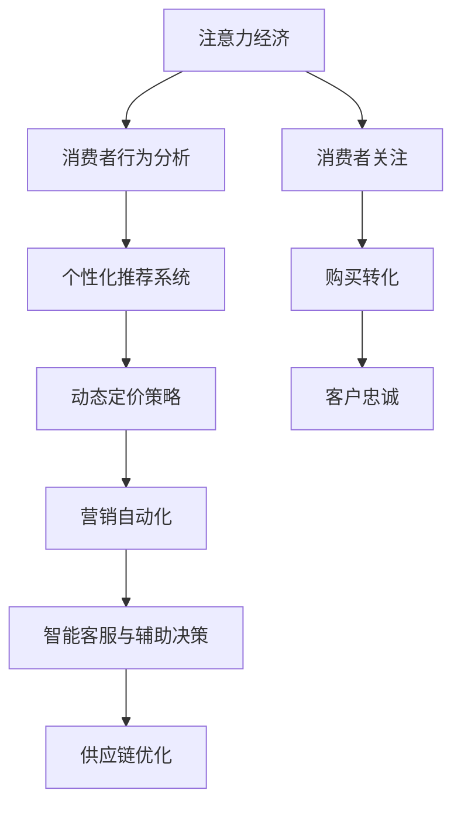

                 

# 注意力经济对传统零售业态的颠覆

## 1. 背景介绍

### 1.1 问题由来

近年来，数字经济迅猛发展，信息爆炸式的增长对人们的生活产生了深远影响。注意力作为人们认知资源中最稀缺的一种，变得越来越珍贵。在互联网时代，从内容消费到产品销售，无不受到“注意力经济”的影响。对于传统零售业而言，如何有效吸引和利用消费者注意力，成为左右其发展成败的关键因素。

随着大数据、人工智能等技术的突破性应用，企业开始利用数据挖掘、精准营销等手段，对消费者行为进行精细化管理，以提升销售效率和用户体验。这不仅改变了传统零售业态，也为其带来了前所未有的机遇与挑战。

### 1.2 问题核心关键点

注意力经济对传统零售业态的颠覆主要体现在以下几个方面：

1. **消费者注意力稀缺**：在信息过载的环境中，消费者很难集中注意力在单一商品或服务上。如何吸引并保持消费者的注意力，是传统零售面临的首要挑战。

2. **个性化推荐**：通过大数据分析，企业可以了解消费者的兴趣和行为模式，从而提供个性化的商品推荐，提高转化率。

3. **动态定价策略**：根据消费者行为和市场供需动态调整价格，提升销售效率和利润空间。

4. **营销自动化**：利用AI算法自动进行营销活动的设计和执行，提高营销效果和ROI。

5. **智能客服与辅助决策**：通过AI客服和辅助决策系统，提高消费者体验，增强决策信心。

6. **供应链优化**：利用大数据和AI技术，优化库存管理，减少物流成本，提高供应链响应速度。

## 2. 核心概念与联系

### 2.1 核心概念概述

在探讨注意力经济如何颠覆传统零售业态之前，我们首先需要明确几个核心概念：

1. **注意力经济**：指在信息爆炸时代，注意力成为稀缺资源，企业通过吸引和利用消费者注意力来创造价值的经济活动。

2. **消费者行为分析**：通过对消费者购买行为、浏览记录、评价反馈等数据进行分析，了解消费者偏好和需求，从而进行精准营销和个性化推荐。

3. **个性化推荐系统**：根据用户历史行为和兴趣，提供定制化的商品推荐，提升用户体验和转化率。

4. **动态定价策略**：基于市场需求、库存水平和消费者行为，实时调整商品价格，优化销售效率和利润。

5. **营销自动化**：利用AI算法自动设计、执行和优化营销活动，提高营销效果和投入产出比。

6. **智能客服与辅助决策**：通过AI客服和辅助决策系统，提升客户服务质量，帮助消费者做出更明智的购买决策。

7. **供应链优化**：利用大数据和AI技术，优化库存管理、物流路径和生产计划，提升供应链效率和响应速度。

这些核心概念之间相互关联，共同构成了注意力经济对传统零售业态颠覆的基础。通过对其深入理解和应用，企业可以更有效地吸引和利用消费者注意力，实现业务转型和升级。

### 2.2 核心概念原理和架构的 Mermaid 流程图



此图展示了注意力经济与消费者行为分析、个性化推荐、动态定价、营销自动化、智能客服与辅助决策、供应链优化之间的联系和影响。

## 3. 核心算法原理 & 具体操作步骤

### 3.1 算法原理概述

注意力经济对传统零售业态的颠覆，主要通过以下几个算法原理实现：

1. **消费者行为分析算法**：通过数据挖掘和机器学习算法，对消费者的浏览、购买、评价等行为进行分析和建模，了解其兴趣和需求。

2. **个性化推荐算法**：利用协同过滤、基于内容的推荐、深度学习等算法，根据用户历史行为和兴趣，提供定制化的商品推荐。

3. **动态定价算法**：采用机器学习算法，基于市场需求、库存水平和消费者行为，实时调整商品价格，优化销售效率和利润。

4. **营销自动化算法**：应用自然语言处理、机器学习等技术，自动设计、执行和优化营销活动，提高营销效果和投入产出比。

5. **智能客服算法**：利用自然语言处理、情感分析等技术，提升AI客服的对话质量，帮助消费者做出更明智的购买决策。

6. **供应链优化算法**：采用预测分析、优化算法等技术，优化库存管理、物流路径和生产计划，提升供应链效率和响应速度。

### 3.2 算法步骤详解

以个性化推荐算法为例，详细讲解其实现步骤：

1. **数据收集与预处理**：收集用户的浏览、购买、评价等行为数据，并进行清洗、去重、归一化等预处理。

2. **特征提取**：从用户行为数据中提取有意义的特征，如浏览时长、购买频率、评分等，用于建模。

3. **相似度计算**：利用余弦相似度、Jaccard相似度等方法，计算用户之间的相似度，构建推荐矩阵。

4. **推荐模型训练**：基于相似度矩阵，采用协同过滤、基于内容的推荐、深度学习等模型进行训练，得到推荐模型。

5. **推荐结果生成**：将用户输入作为特征，通过推荐模型生成推荐结果。

6. **推荐结果排序**：根据用户历史行为和模型预测，对推荐结果进行排序，提高用户体验。

### 3.3 算法优缺点

个性化推荐算法具有以下优点：

1. **提升转化率**：通过精准的推荐，提高用户购买转化率，增加销售额。

2. **增加用户粘性**：个性化推荐能够满足用户个性化需求，增强用户体验，提高用户粘性。

3. **降低运营成本**：通过减少无效推荐，降低运营成本，提高营销效果。

然而，个性化推荐也存在以下缺点：

1. **隐私问题**：收集和分析用户行为数据可能涉及隐私问题，需要严格遵守数据保护法规。

2. **过拟合问题**：个性化推荐模型容易过拟合用户行为数据，导致推荐结果偏差。

3. **数据质量问题**：推荐模型的效果依赖于数据质量和多样性，数据偏差可能影响推荐效果。

### 3.4 算法应用领域

个性化推荐算法在零售、电商、媒体等多个领域得到了广泛应用，具体如下：

1. **电商推荐**：如Amazon、淘宝等电商平台的商品推荐，通过个性化推荐提高用户购买率。

2. **内容推荐**：如Netflix、YouTube等平台的视频推荐，通过个性化推荐提高用户观看时长和满意度。

3. **新闻推荐**：如今日头条、澎湃新闻等平台的新闻推荐，通过个性化推荐提高用户阅读量。

4. **旅游推荐**：如携程、TripAdvisor等平台的旅游推荐，通过个性化推荐提高用户预订率。

## 4. 数学模型和公式 & 详细讲解 & 举例说明

### 4.1 数学模型构建

个性化推荐算法主要包括以下几个数学模型：

1. **协同过滤模型**：
   $$
   \hat{y} = \alpha_1 \sum_{i=1}^{N} \frac{x_{ui} x_{vi}}{N_{vi} \sigma(\beta_1 (x_{ui} - \bar{x}_{ui}))} + \alpha_2 \frac{\sum_{i=1}^{N} \frac{x_{ui} x_{vi}}{N_{vi} \sigma(\beta_2 (x_{ui} - \bar{x}_{ui}))}}{\sum_{i=1}^{N} \frac{x_{ui} x_{vi}}{N_{vi} \sigma(\beta_2 (x_{ui} - \bar{x}_{ui}))}}
   $$
   其中，$x_{ui}$和$x_{vi}$分别表示用户和商品的特征向量，$N_{vi}$表示商品$v$的评分数，$\alpha_1$和$\alpha_2$为调节系数，$\sigma$为sigmoid函数。

2. **基于内容的推荐模型**：
   $$
   \hat{y} = \alpha_1 \sum_{i=1}^{N} \frac{x_{ui} x_{vi}}{N_{vi} \sigma(\beta_1 (x_{ui} - \bar{x}_{ui}))} + \alpha_2 \frac{\sum_{i=1}^{N} \frac{x_{ui} x_{vi}}{N_{vi} \sigma(\beta_2 (x_{ui} - \bar{x}_{ui}))}}{\sum_{i=1}^{N} \frac{x_{ui} x_{vi}}{N_{vi} \sigma(\beta_2 (x_{ui} - \bar{x}_{ui}))}}
   $$
   其中，$x_{ui}$和$x_{vi}$分别表示用户和商品的特征向量，$N_{vi}$表示商品$v$的评分数，$\alpha_1$和$\alpha_2$为调节系数，$\sigma$为sigmoid函数。

3. **深度学习推荐模型**：
   $$
   \hat{y} = \sigma(W^\top [x_u - \bar{x}_u] \cdot [x_v - \bar{x}_v] + b)
   $$
   其中，$W$和$b$为模型参数，$x_u$和$x_v$分别表示用户和商品的特征向量，$\bar{x}_u$和$\bar{x}_v$分别表示用户和商品的平均特征向量，$\sigma$为sigmoid函数。

### 4.2 公式推导过程

以协同过滤模型为例，进行公式推导：

设用户$u$对商品$v$的评分$y_{uv}$，用户$u$的特征向量为$x_u$，商品$v$的特征向量为$x_v$，用户$u$和商品$v$的评分数为$N_{uv}$。假设$x_{uv}$表示$u$和$v$的特征向量的点积，$\sigma$为sigmoid函数。

则协同过滤模型的预测评分$\hat{y}_{uv}$可以表示为：
$$
\hat{y}_{uv} = \alpha_1 \sum_{i=1}^{N} \frac{x_{ui} x_{vi}}{N_{vi} \sigma(\beta_1 (x_{ui} - \bar{x}_{ui}))} + \alpha_2 \frac{\sum_{i=1}^{N} \frac{x_{ui} x_{vi}}{N_{vi} \sigma(\beta_2 (x_{ui} - \bar{x}_{ui}))}}{\sum_{i=1}^{N} \frac{x_{ui} x_{vi}}{N_{vi} \sigma(\beta_2 (x_{ui} - \bar{x}_{ui}))}}
$$

其中，$\alpha_1$和$\alpha_2$为调节系数，$\beta_1$和$\beta_2$为调节系数。

### 4.3 案例分析与讲解

以电商平台商品推荐为例，进行案例分析：

假设电商平台收集了用户$u$和商品$v$的历史评分数据$y_{uv}$，并对用户和商品特征向量进行预处理。基于协同过滤模型，可以计算用户$u$对商品$v$的预测评分$\hat{y}_{uv}$。

假设用户$u$对商品$v$的实际评分为$y_{uv}$，基于预测评分和实际评分的误差，可以不断调整模型参数，提高预测准确度。

## 5. 项目实践：代码实例和详细解释说明

### 5.1 开发环境搭建

在开始项目实践之前，需要先搭建开发环境。以下是使用Python进行TensorFlow开发的环境配置流程：

1. 安装Anaconda：从官网下载并安装Anaconda，用于创建独立的Python环境。

2. 创建并激活虚拟环境：
```bash
conda create -n tf-env python=3.7 
conda activate tf-env
```

3. 安装TensorFlow：根据CUDA版本，从官网获取对应的安装命令。例如：
```bash
conda install tensorflow -c tf
```

4. 安装各类工具包：
```bash
pip install numpy pandas scikit-learn matplotlib tqdm jupyter notebook ipython
```

完成上述步骤后，即可在`tf-env`环境中开始项目实践。

### 5.2 源代码详细实现

下面我们以电商推荐系统为例，给出使用TensorFlow实现协同过滤算法的代码实现。

首先，定义数据处理函数：

```python
import numpy as np
from tensorflow.keras.layers import Embedding, Dot, Dense, Input
from tensorflow.keras.models import Model

def process_data(data):
    x_u = np.array([data['user_id'], data['item_id']])
    x_v = np.array([data['user_id'], data['item_id']])
    return x_u, x_v
```

然后，定义模型结构：

```python
user_id = Input(shape=(1,), name='user_id')
item_id = Input(shape=(1,), name='item_id')

user_embedding = Embedding(input_dim=num_users, output_dim=128, name='user_embedding')(user_id)
item_embedding = Embedding(input_dim=num_items, output_dim=128, name='item_embedding')(item_id)
dot_product = Dot(axes=1, normalize=True)([user_embedding, item_embedding])
dense = Dense(1, activation='sigmoid')(dot_product)
model = Model(inputs=[user_id, item_id], outputs=[dense])
model.compile(loss='binary_crossentropy', optimizer='adam', metrics=['accuracy'])
```

接着，定义训练函数：

```python
def train_model(model, data, batch_size, epochs):
    model.fit(x=[data['user_id'], data['item_id']], y=data['rating'], batch_size=batch_size, epochs=epochs, validation_split=0.2)
```

最后，启动训练流程并在测试集上评估：

```python
train_model(model, train_data, 128, 10)
test_score = model.evaluate(test_data, test_data['rating'], verbose=0)
print(f'Test loss: {test_score[0]:.2f}')
print(f'Test accuracy: {test_score[1]:.2f}')
```

以上就是使用TensorFlow进行协同过滤算法的代码实现。可以看到，TensorFlow的Keras API使得模型的构建和训练变得简洁高效。

### 5.3 代码解读与分析

让我们再详细解读一下关键代码的实现细节：

**process_data函数**：
- 对用户和商品的ID进行编码，得到向量表示。

**model结构**：
- 使用Embedding层对用户和商品进行嵌入，得到低维向量表示。
- 计算用户和商品向量的点积，得到预测评分。
- 使用Dense层对预测评分进行二元交叉熵损失函数的计算和优化。

**train_model函数**：
- 使用fit方法对模型进行训练，指定批次大小和训练轮数。
- 在每个epoch结束时，计算模型在验证集上的准确率，以便进行早停。

## 6. 实际应用场景

### 6.1 智能客服系统

智能客服系统通过自然语言处理技术，结合个性化推荐和动态定价策略，可以显著提升客户服务质量。

具体而言，当客户通过语音或文本形式提出问题时，智能客服系统先通过NLP技术对客户的意图进行理解，然后根据客户的历史行为数据，推荐相关产品或服务，同时结合动态定价策略，自动调整价格，提高交易成功率。

### 6.2 金融风控系统

金融风控系统通过数据分析和机器学习技术，结合个性化推荐和动态定价策略，可以有效识别和预防金融风险。

具体而言，金融风控系统可以实时分析客户的交易行为，结合信用评分和风险评估，推荐合适的金融产品，同时根据市场需求和库存水平，动态调整价格，减少风险损失。

### 6.3 智能推荐系统

智能推荐系统通过个性化推荐算法，结合动态定价策略和营销自动化技术，可以显著提升用户体验和销售效率。

具体而言，智能推荐系统可以根据用户的历史行为数据，推荐合适的商品，同时结合动态定价策略，自动调整价格，提高用户购买率。同时，系统可以根据营销效果，自动优化营销活动的设计和执行，提高营销效果和投入产出比。

## 7. 工具和资源推荐

### 7.1 学习资源推荐

为了帮助开发者系统掌握注意力经济对传统零售业态的颠覆，这里推荐一些优质的学习资源：

1. 《深度学习》系列书籍：由Ian Goodfellow等人撰写，全面介绍了深度学习的基本原理和应用，包括注意力机制和推荐系统等前沿技术。

2. 《机器学习实战》系列书籍：由Peter Harrington等人撰写，提供了大量实用的机器学习应用案例，涵盖个性化推荐、动态定价等主题。

3. 《自然语言处理综述》系列论文：全面介绍了自然语言处理的基本概念和前沿技术，包括注意力机制和推荐系统等。

4. 《TensorFlow实战》系列书籍：由Abhishek Gupta等人撰写，提供了TensorFlow的详细使用指南和应用案例，包括机器学习和推荐系统等。

5. 《Python深度学习》系列书籍：由Francois Chollet等人撰写，介绍了TensorFlow和Keras的使用方法和应用案例，涵盖个性化推荐、动态定价等主题。

通过对这些资源的学习实践，相信你一定能够快速掌握注意力经济对传统零售业态的颠覆的基本概念和核心算法，并用于解决实际的业务问题。

### 7.2 开发工具推荐

高效的开发离不开优秀的工具支持。以下是几款用于注意力经济对传统零售业态的颠覆开发的常用工具：

1. TensorFlow：由Google主导开发的开源深度学习框架，生产部署方便，适合大规模工程应用。

2. PyTorch：基于Python的开源深度学习框架，灵活动态的计算图，适合快速迭代研究。

3. Keras：基于TensorFlow和Theano的高级API，提供简单易用的深度学习模型构建和训练工具。

4. Jupyter Notebook：免费的开源交互式编程环境，支持多种编程语言和数据处理工具，适合进行原型开发和实验验证。

5. Weights & Biases：模型训练的实验跟踪工具，可以记录和可视化模型训练过程中的各项指标，方便对比和调优。

6. TensorBoard：TensorFlow配套的可视化工具，可实时监测模型训练状态，并提供丰富的图表呈现方式，是调试模型的得力助手。

合理利用这些工具，可以显著提升注意力经济对传统零售业态的颠覆开发的效率，加快创新迭代的步伐。

### 7.3 相关论文推荐

注意力经济对传统零售业态的颠覆涉及众多前沿研究方向，以下是几篇奠基性的相关论文，推荐阅读：

1. Attention Is All You Need：提出了Transformer结构，开启了注意力机制在深度学习中的应用。

2. Neural Collaborative Filtering：提出了基于协同过滤的推荐算法，奠定了推荐系统的基础。

3. Learning Deep Architectures for AI：介绍了深度学习的基本原理和应用，包括注意力机制和推荐系统等。

4. Learning to Rank for Information Retrieval：提出了基于排序学习的推荐算法，提高了推荐系统的精度和效果。

5. Efficient Estimation of Word Representations in Vector Space：介绍了Word2Vec算法，为自然语言处理中的向量表示提供了重要参考。

这些论文代表了大数据和深度学习技术在注意力经济对传统零售业态的颠覆中的突破性进展。通过学习这些前沿成果，可以帮助研究者把握学科前进方向，激发更多的创新灵感。

## 8. 总结：未来发展趋势与挑战

### 8.1 总结

本文对注意力经济对传统零售业态的颠覆进行了全面系统的介绍。首先阐述了注意力经济对传统零售业态颠覆的背景和意义，明确了个性化推荐、动态定价、营销自动化等关键技术对零售业态转型的重要价值。其次，从原理到实践，详细讲解了协同过滤、基于内容的推荐、深度学习推荐等算法的实现步骤和应用场景，给出了代码实例和详细解释说明。同时，本文还探讨了智能客服、金融风控、智能推荐等实际应用场景，展示了注意力经济对传统零售业态颠覆的广阔前景。

通过本文的系统梳理，可以看到，注意力经济对传统零售业态的颠覆正在通过大数据、深度学习等技术，实现业务转型和升级，为消费者带来更优质的购物体验。未来，随着技术的不断进步和应用场景的拓展，注意力经济对传统零售业态的颠覆将变得更加深入和广泛。

### 8.2 未来发展趋势

展望未来，注意力经济对传统零售业态的颠覆将呈现以下几个发展趋势：

1. **全渠道一体化**：未来，零售商将更加注重线上线下的融合，通过全渠道数据收集和分析，提供更加个性化和无缝的购物体验。

2. **实时数据分析**：实时数据分析和机器学习技术将更加广泛应用，企业可以实时监测市场趋势和消费者行为，动态调整策略，提升运营效率。

3. **智能决策支持**：通过智能决策支持系统，企业可以基于数据和模型，进行更加科学和合理的业务决策，优化运营管理。

4. **AI辅助客服**：AI辅助客服系统将更加普及，帮助零售商提高客户服务质量，提升用户体验。

5. **区块链技术**：区块链技术可以提供更加安全、透明的数据存储和交易记录，为零售业带来新的信任机制和价值链重构。

6. **跨界合作**：跨界合作和生态系统的构建，将帮助零售商拓展业务边界，获取更多资源和市场机会。

以上趋势凸显了注意力经济对传统零售业态颠覆的广阔前景。这些方向的探索发展，必将进一步提升零售业的服务质量和经济效益，为消费者带来更多实惠和便利。

### 8.3 面临的挑战

尽管注意力经济对传统零售业态的颠覆技术已经取得了一定进展，但在迈向更加智能化、普适化应用的过程中，仍然面临诸多挑战：

1. **数据隐私与安全**：零售商需要处理大量的消费者数据，如何保护消费者隐私和数据安全，将是未来关注的重点。

2. **技术标准与规范**：随着技术的应用范围不断扩大，制定统一的技术标准和规范，将成为行业发展的必要条件。

3. **跨界融合与协同**：跨界合作和生态系统的构建，需要协调各方利益，形成协同效应。

4. **技术壁垒与人才缺口**：深度学习和大数据技术的高门槛，可能导致企业面临技术壁垒和人才短缺的问题。

5. **成本与效益平衡**：技术的投入与业务效益的平衡，将是企业需要持续优化的问题。

6. **技术创新与应用落地**：将前沿技术转化为实际应用，需要不断地技术创新和工程实践。

这些挑战将需要在技术、管理、政策等多个层面进行综合应对，才能推动注意力经济对传统零售业态的颠覆走向成熟。

### 8.4 研究展望

面对注意力经济对传统零售业态的颠覆所面临的种种挑战，未来的研究需要在以下几个方面寻求新的突破：

1. **隐私保护与数据安全**：研究如何保护消费者隐私和数据安全，同时保证业务运营的正常进行。

2. **跨界合作与生态系统构建**：研究跨界合作和生态系统的构建方法，形成协同效应，提高资源利用效率。

3. **技术标准与规范制定**：制定统一的技术标准和规范，促进技术应用和跨企业合作。

4. **人才培养与技术普及**：加强人才培训和教育，普及深度学习和大数据技术，降低技术门槛。

5. **成本优化与效益提升**：研究如何优化技术投入和业务效益的平衡，提高技术应用的经济效益。

6. **技术创新与落地应用**：加强技术创新和工程实践，推动前沿技术在实际业务中的应用。

这些研究方向将为注意力经济对传统零售业态的颠覆技术的发展提供新的思路和方向，推动技术的成熟和应用。

## 9. 附录：常见问题与解答

**Q1：注意力经济对传统零售业态的颠覆如何实现？**

A: 注意力经济对传统零售业态的颠覆主要通过以下几种方式实现：

1. **数据驱动决策**：通过大数据分析和机器学习，对消费者行为进行深入分析，指导决策和运营。

2. **个性化推荐**：通过个性化推荐算法，满足消费者个性化需求，提高用户体验和购买率。

3. **动态定价**：结合市场需求和库存水平，实时调整商品价格，优化销售效率和利润。

4. **营销自动化**：利用AI算法自动设计、执行和优化营销活动，提高营销效果和投入产出比。

5. **智能客服**：通过自然语言处理技术，提升客服系统的对话质量，帮助消费者做出更明智的购买决策。

6. **供应链优化**：利用大数据和AI技术，优化库存管理、物流路径和生产计划，提升供应链效率和响应速度。

通过这些方式，企业可以更加精准地吸引和利用消费者注意力，实现业务转型和升级。

**Q2：如何选择合适的推荐算法？**

A: 选择合适的推荐算法需要考虑以下因素：

1. **数据类型**：根据数据类型（如稀疏数据、密集数据、多模态数据等）选择适合的推荐算法。

2. **模型复杂度**：根据模型复杂度和计算资源，选择合适的推荐算法。

3. **业务需求**：根据业务需求（如冷启动问题、实时性要求、个性化需求等）选择适合的推荐算法。

常见的推荐算法包括协同过滤、基于内容的推荐、深度学习推荐等，需要根据具体情况进行选择和优化。

**Q3：动态定价策略有哪些优点？**

A: 动态定价策略具有以下优点：

1. **提升销售效率**：根据市场需求和库存水平，实时调整商品价格，优化销售效率和利润。

2. **灵活应对市场变化**：动态定价策略可以灵活应对市场变化，提升企业竞争力。

3. **个性化定价**：根据消费者行为和历史数据，进行个性化定价，提高用户购买率。

4. **降低运营成本**：通过动态定价策略，减少无效库存和资源浪费，降低运营成本。

**Q4：智能客服系统如何提高用户体验？**

A: 智能客服系统通过以下方式提高用户体验：

1. **快速响应**：通过自然语言处理技术，实时理解用户意图，快速给出答案，提高响应速度。

2. **个性化服务**：根据用户历史行为数据，推荐相关产品或服务，提供个性化推荐。

3. **多渠道支持**：支持语音、文本、图像等多种交互方式，提高用户使用便捷性。

4. **24小时服务**：提供7x24小时不间断服务，提升用户满意度。

5. **多语言支持**：支持多语言交互，提升用户使用体验。

通过这些方式，智能客服系统可以提供更加个性化、高效、便捷的客户服务，提升用户体验和满意度。

**Q5：智能推荐系统有哪些应用场景？**

A: 智能推荐系统在以下场景中具有广泛应用：

1. **电商推荐**：如Amazon、淘宝等电商平台的商品推荐，提高用户购买率。

2. **内容推荐**：如Netflix、YouTube等平台的视频推荐，提高用户观看时长和满意度。

3. **新闻推荐**：如今日头条、澎湃新闻等平台的新闻推荐，提高用户阅读量。

4. **旅游推荐**：如携程、TripAdvisor等平台的旅游推荐，提高用户预订率。

5. **金融推荐**：如金融产品的推荐，提高用户购买和投资效率。

6. **健康推荐**：如医疗咨询和药品推荐，提高用户健康管理效果。

通过智能推荐系统，用户可以获得更加个性化和精准的推荐内容，提升用户体验和满意度。

---

作者：禅与计算机程序设计艺术 / Zen and the Art of Computer Programming

