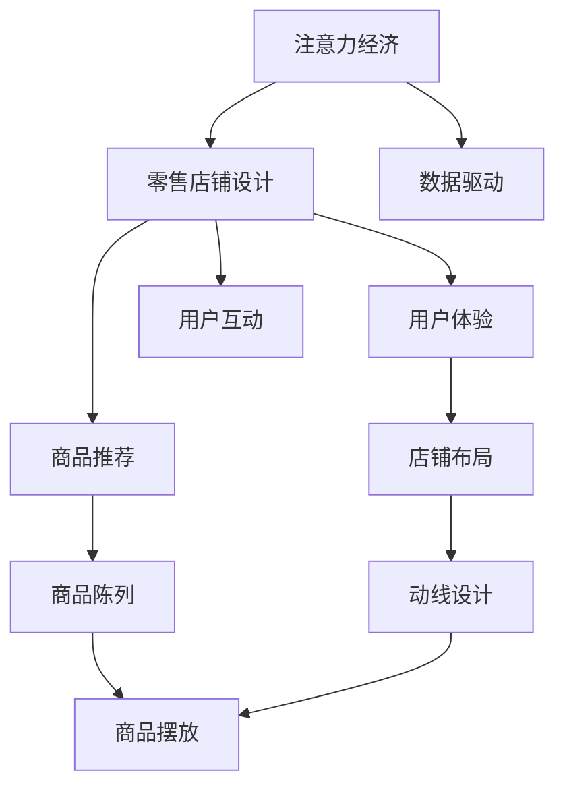

                 

# 注意力经济对传统零售店铺设计的新要求

> 关键词：注意力经济, 零售店铺, 数据驱动, 用户体验, 商品推荐, 店铺布局, 智能客服, 精准营销, 技术创新

## 1. 背景介绍

### 1.1 问题由来

随着互联网和数字技术的发展，零售行业正经历着深刻的变革。传统的零售店铺设计理念已经无法满足现代消费者对个性化、便捷性和互动性的需求。同时，消费者注意力成为一种稀缺资源，传统的零售店铺在吸引和保持消费者注意力方面面临巨大挑战。在此背景下，注意力经济应运而生，成为零售行业的重要发展方向。

注意力经济（Economy of Attention）指的是在信息爆炸的时代，消费者的注意力资源非常有限，谁能更好地吸引和利用消费者的注意力，谁就能在竞争中占据优势。这一概念最早由戴维·温伯格（David Weinberger）在《注意力经济》一书中提出，随后被广泛应用于互联网和零售领域。

注意力经济对传统零售店铺设计提出了新的要求，促使零售商从产品为中心的设计转向以消费者体验为中心的设计。如何通过数据驱动的设计，优化店铺布局，提高用户互动性，提升商品推荐精准度，成为零售商需要解决的重要课题。

### 1.2 问题核心关键点

注意力经济的核心在于如何高效吸引和利用消费者的注意力。零售店铺设计需要考虑以下几个关键点：

- 店铺布局：如何通过合理的空间布局，引导消费者注意力。
- 商品推荐：如何通过智能推荐，提升用户体验和购买转化率。
- 用户互动：如何通过技术手段，增强用户互动和参与感。
- 数据驱动：如何通过数据和算法，优化店铺设计决策。

这些关键点共同构成了注意力经济对传统零售店铺设计的全面要求，零售商需要不断创新，才能在新的市场环境中立足。

### 1.3 问题研究意义

研究注意力经济对传统零售店铺设计的影响，对于提升零售商的市场竞争力，改善消费者购物体验，具有重要意义：

- 提升竞争优势：通过优化店铺设计，吸引和保持消费者注意力，增强零售商的市场竞争力。
- 改善用户体验：合理的店铺布局和智能推荐系统，可以显著提升消费者的购物体验，增加满意度。
- 提高运营效率：通过数据驱动的设计，优化商品陈列和库存管理，提高运营效率和利润率。
- 促进技术创新：注意力经济的发展，推动了零售技术的多样化应用，为技术创新提供了新的动力。

## 2. 核心概念与联系

### 2.1 核心概念概述

为更好地理解注意力经济对零售店铺设计的影响，本节将介绍几个密切相关的核心概念：

- 注意力经济（Economy of Attention）：指在信息爆炸的时代，消费者的注意力资源非常有限，谁能更好地吸引和利用消费者的注意力，谁就能在竞争中占据优势。
- 零售店铺设计（Retail Store Design）：指通过合理布局、装修、商品陈列等方式，创造愉悦的购物环境，提升消费者购物体验。
- 数据驱动（Data-Driven）：指通过数据分析和算法优化，驱动设计决策的过程。
- 用户体验（User Experience, UX）：指消费者在使用产品或服务过程中的主观感受和满意度。
- 商品推荐系统（Recommendation System）：指通过算法，根据消费者的历史行为和偏好，智能推荐商品。
- 用户互动（User Interaction）：指通过技术手段，增强消费者与店铺之间的互动和参与感。

这些核心概念之间的逻辑关系可以通过以下Mermaid流程图来展示：



这个流程图展示了几者之间的联系：

1. 注意力经济是零售店铺设计的驱动力，通过优化店铺设计来吸引和保持消费者注意力。
2. 数据驱动是优化设计决策的基础，通过数据分析和算法优化，提升设计效果。
3. 用户体验是设计的核心目标，合理的店铺布局和商品推荐系统，可以提升消费者的满意度和购物体验。
4. 用户互动是提升用户参与感和忠诚度的重要手段，增强了消费者与店铺的连接。

这些概念共同构成了注意力经济对零售店铺设计的影响框架，零售商需要全面考虑，才能在新的市场环境中获得成功。

## 3. 核心算法原理 & 具体操作步骤
### 3.1 算法原理概述

注意力经济对传统零售店铺设计的优化，主要依赖于数据驱动的设计方法。其核心思想是通过收集和分析消费者行为数据，优化店铺布局、商品推荐和用户互动等方面，以更好地吸引和利用消费者的注意力。

具体而言，数据驱动的设计流程包括：

1. 收集消费者行为数据：通过在线购物数据、进店流量数据、消费记录等，获取消费者在店铺内的行为和偏好。
2. 分析数据并提取洞察：利用数据挖掘和机器学习技术，从大量数据中提取有价值的信息和洞察，如消费者喜欢的商品类型、购物习惯等。
3. 优化设计决策：根据分析结果，调整店铺布局、商品陈列、推荐系统等，以提升消费者体验和满意度。
4. 测试和迭代：对优化后的设计进行测试，收集反馈，不断迭代优化。

### 3.2 算法步骤详解

基于数据驱动的设计方法，以下是一个典型的注意力经济对零售店铺设计的优化流程：

**Step 1: 收集消费者行为数据**

- 使用RFID、WiFi信号、摄像头等技术手段，收集消费者的进店流量、停留时间、商品浏览记录等行为数据。
- 分析消费者的购物行为路径，提取消费者的停留时间、热区位置等关键信息。

**Step 2: 分析数据并提取洞察**

- 利用数据挖掘算法，如聚类、关联规则等，从消费者行为数据中提取有用的信息。
- 使用机器学习算法，如回归、分类、推荐系统等，构建消费者偏好模型。

**Step 3: 优化设计决策**

- 根据消费者偏好模型，优化店铺布局和商品陈列，如调整货架位置、增加商品展示面等。
- 设计智能推荐系统，根据消费者历史行为和实时反馈，动态调整推荐内容，提升购物体验。
- 优化用户互动环节，如增强互动性屏、增设AR体验等，提升消费者参与感。

**Step 4: 测试和迭代**

- 在优化后的小范围内测试设计效果，收集用户反馈。
- 根据测试结果，调整设计方案，进行迭代优化。

### 3.3 算法优缺点

基于数据驱动的设计方法具有以下优点：

1. 提升精准度：通过数据分析和算法优化，能够更精准地理解消费者需求，优化设计决策。
2. 降低成本：减少了试错次数，节省了设计和装修成本。
3. 增强互动性：通过智能推荐和互动环节，提升消费者参与感，增加忠诚度。
4. 灵活调整：数据驱动的设计方法可以动态调整，应对市场变化和消费者需求的变化。

但该方法也存在以下缺点：

1. 数据质量要求高：需要高质量、多样化的数据，否则模型效果可能不理想。
2. 技术门槛高：需要较强的数据科学和机器学习基础。
3. 依赖数据隐私保护：需要在数据采集和存储过程中，充分考虑消费者的隐私保护问题。
4. 持续优化：设计优化是一个持续的过程，需要不断收集数据、迭代优化。

### 3.4 算法应用领域

基于数据驱动的设计方法，已经在多个零售领域得到了广泛应用，如：

- 超市和商场：通过消费者行为数据，优化商品陈列和促销策略，提升销售额。
- 服装店和鞋店：利用用户互动数据，优化试穿体验和个性化推荐，提升顾客满意度。
- 家居店和家具店：通过智能推荐系统，提供定制化家居解决方案，提升消费体验。
- 食品店和餐饮店：通过分析消费者的饮食偏好，优化菜单和餐品推荐，提升用餐体验。

除了这些典型应用外，注意力经济和数据驱动的设计方法还在零售行业的诸多细分领域，如体育用品店、旅游零售等，展现出了强大的潜力。

## 4. 数学模型和公式 & 详细讲解 & 举例说明

### 4.1 数学模型构建

基于数据驱动的设计方法，可以通过构建消费者偏好模型来实现店铺设计的优化。假设消费者在店铺内的行为数据为 $D=\{(x_i, y_i)\}_{i=1}^N$，其中 $x_i$ 为消费者行为特征，$y_i$ 为购买决策。我们希望构建一个消费者偏好模型 $f(x)$，用于预测消费者的购买决策。

假设 $f(x)$ 为线性模型，即：

$$
f(x) = \theta^Tx + b
$$

其中 $\theta$ 为模型参数，$b$ 为截距项。根据梯度下降等优化算法，模型的训练目标为最小化预测误差：

$$
\min_{\theta} \sum_{i=1}^N \left( y_i - f(x_i) \right)^2
$$

通过训练模型，可以获取消费者对不同商品的偏好权重，进而优化商品陈列和推荐系统。

### 4.2 公式推导过程

在线性回归模型的基础上，我们可以引入正则化项和激活函数，进一步优化模型的表现：

$$
\min_{\theta} \frac{1}{2N} \sum_{i=1}^N \left( y_i - f(x_i) \right)^2 + \frac{\lambda}{2} \sum_{j=1}^d \theta_j^2
$$

其中 $\lambda$ 为正则化系数，$||\theta||^2$ 为L2正则化项。

通过求解上述优化问题，可以得到模型参数 $\theta$，进而构建消费者偏好模型。

### 4.3 案例分析与讲解

假设某连锁超市希望通过数据驱动的设计方法，优化其商品陈列和促销策略。超市收集了6个月内的购物数据，包括消费者的停留时间、商品浏览记录、购买记录等。数据预处理后，构建消费者偏好模型 $f(x)$，其中 $x_i$ 为消费者行为特征，如停留时间、商品浏览次数、商品类别等。

首先，对消费者行为数据进行特征工程，提取有用的特征，如商品类别、价格区间、促销活动等。然后，利用数据挖掘算法，对特征进行聚类分析，找出消费者偏好的商品类型和购物习惯。最后，通过机器学习算法，构建消费者偏好模型 $f(x)$，并对商品陈列和促销策略进行优化。

在优化过程中，超市发现某些商品在特定位置销售效果更好，决定调整货架位置。同时，通过智能推荐系统，根据消费者的历史行为和实时反馈，动态调整推荐内容，提升了消费者的购物体验和销售额。

## 5. 项目实践：代码实例和详细解释说明
### 5.1 开发环境搭建

在进行数据驱动的零售店铺设计优化时，我们需要准备好开发环境。以下是使用Python进行数据分析和机器学习开发的环境配置流程：

1. 安装Anaconda：从官网下载并安装Anaconda，用于创建独立的Python环境。

2. 创建并激活虚拟环境：
```bash
conda create -n retail-env python=3.8 
conda activate retail-env
```

3. 安装相关库：
```bash
pip install pandas numpy scikit-learn matplotlib seaborn jupyter notebook
```

4. 安装机器学习框架：
```bash
pip install scikit-learn
```

5. 安装数据可视化工具：
```bash
pip install matplotlib seaborn
```

完成上述步骤后，即可在`retail-env`环境中开始数据分析和机器学习实践。

### 5.2 源代码详细实现

下面是使用Python进行消费者偏好模型构建的示例代码。

```python
import pandas as pd
import numpy as np
from sklearn.model_selection import train_test_split
from sklearn.linear_model import LinearRegression
from sklearn.metrics import mean_squared_error

# 读取消费者行为数据
data = pd.read_csv('consumer_data.csv')

# 特征工程
features = data[['stay_time', 'browse_count', 'price_range', 'promotion_code']]
target = data['purchase_decision']

# 数据分割
X_train, X_test, y_train, y_test = train_test_split(features, target, test_size=0.2, random_state=42)

# 训练模型
model = LinearRegression()
model.fit(X_train, y_train)

# 评估模型
y_pred = model.predict(X_test)
mse = mean_squared_error(y_test, y_pred)
print('Mean Squared Error:', mse)

# 预测消费者偏好
consumer_preference = model.predict([[120, 5, 0, 1]])
print('Consumer Preference:', consumer_preference)
```

上述代码展示了如何使用线性回归模型，从消费者行为数据中构建消费者偏好模型，并进行模型评估和预测。

### 5.3 代码解读与分析

让我们再详细解读一下关键代码的实现细节：

**数据读取**：
- `pd.read_csv()`函数用于读取消费者行为数据，保存为Pandas DataFrame格式。

**特征工程**：
- `features`变量存储了消费者行为特征，如停留时间、商品浏览次数、商品类别、促销活动等。
- `target`变量存储了消费者的购买决策。

**数据分割**：
- 使用`train_test_split()`函数，将数据集分为训练集和测试集，比例为8:2。

**模型训练**：
- 创建线性回归模型，并使用训练集数据拟合模型。

**模型评估**：
- 在测试集上对模型进行评估，计算均方误差（MSE），用于衡量模型的预测精度。

**预测消费者偏好**：
- 使用模型对消费者行为特征进行预测，获取其偏好权重，从而优化店铺设计和商品推荐。

**代码解读**：
- 线性回归模型是构建消费者偏好模型的一种简单有效的方法，可以快速得到模型参数。
- 通过特征工程和模型评估，可以进一步优化模型效果。
- 预测消费者偏好权重，可以用于优化商品陈列和推荐系统。

## 6. 实际应用场景
### 6.1 智能货架布局

基于数据驱动的设计方法，可以优化零售店铺的货架布局。智能货架布局通过数据分析和机器学习技术，优化商品陈列方式，提高商品的可见度和吸引力。

在实践中，可以收集消费者的购物行为数据，分析哪些商品在特定位置销售效果更好，然后根据分析结果，调整货架位置和商品陈列方式。例如，某连锁超市通过数据分析发现，某区域的高利润商品在靠近入口的位置销售效果最佳，便决定将高利润商品放置在靠近入口的位置，从而提高了整体销售额。

### 6.2 智能推荐系统

智能推荐系统是零售店铺设计优化的重要组成部分。通过分析消费者的历史行为和实时反馈，推荐系统可以动态调整推荐内容，提升消费者的购物体验。

在实际应用中，零售店铺可以引入推荐算法，根据消费者的历史购物记录、浏览记录和实时行为，推荐符合其兴趣的商品。例如，某电商平台通过智能推荐系统，根据用户的浏览历史和搜索关键词，动态调整商品推荐列表，提高了用户的购买转化率。

### 6.3 用户互动体验

用户互动体验是提升消费者参与感和忠诚度的重要手段。通过数据驱动的设计方法，可以优化用户互动环节，增强消费者的购物体验。

在实践中，零售店铺可以引入互动性屏、增强现实（AR）体验等技术手段，提升消费者的参与感和沉浸感。例如，某家居店通过在店铺内设置互动性屏，展示家居设计方案，消费者可以通过屏幕与设计师进行实时交流，提升了购物体验和满意度。

### 6.4 未来应用展望

随着数据驱动的设计方法不断成熟，零售店铺设计将呈现以下几个发展趋势：

1. 数据融合：将线上线下数据融合，构建更全面、更准确的消费者画像。
2. 实时调整：通过实时数据监测和分析，动态调整店铺布局和商品推荐。
3. 个性化推荐：利用机器学习算法，提供更精准、更个性化的商品推荐。
4. 增强互动：引入更多技术手段，增强消费者的互动体验和参与感。
5. 多渠道整合：将线下店铺和线上渠道整合，提供无缝的购物体验。

以上趋势凸显了数据驱动的设计方法在零售店铺设计中的重要地位，将助力零售商在新的市场环境中取得成功。

## 7. 工具和资源推荐
### 7.1 学习资源推荐

为了帮助开发者系统掌握数据驱动的零售店铺设计方法，这里推荐一些优质的学习资源：

1. 《Python数据分析与机器学习实战》：详细介绍如何使用Python进行数据处理和机器学习，包含零售领域的数据驱动设计案例。
2. 《数据科学与机器学习：数据驱动的商业决策》：介绍了数据科学与机器学习在商业决策中的应用，包含零售领域的案例和实践。
3. Coursera《商业数据分析》课程：由美国宾夕法尼亚大学开设的在线课程，涵盖数据分析和商业决策的方方面面，适合零售商的系统学习和实践。
4. Kaggle：一个数据科学竞赛平台，提供大量零售领域的数据集和案例，适合学习者和开发者进行实践和竞赛。

通过对这些资源的学习实践，相信你一定能够快速掌握数据驱动的零售店铺设计方法，并用于解决实际的零售问题。

### 7.2 开发工具推荐

高效的开发离不开优秀的工具支持。以下是几款用于数据驱动的零售店铺设计开发的常用工具：

1. Jupyter Notebook：开源的交互式编程环境，支持Python、R等语言，适合数据驱动的设计开发。
2. Microsoft Power BI：商业智能分析工具，适合数据分析和可视化，适合零售商的日常数据处理。
3. Tableau：数据可视化工具，支持多种数据源，适合零售商的业务分析。
4. Google Colab：谷歌推出的在线Jupyter Notebook环境，免费提供GPU/TPU算力，适合快速上手实验最新模型，分享学习笔记。
5. PyTorch和TensorFlow：深度学习框架，支持数据驱动的推荐系统和智能货架布局等复杂计算任务。

合理利用这些工具，可以显著提升数据驱动的零售店铺设计开发的效率，加快创新迭代的步伐。

### 7.3 相关论文推荐

数据驱动的设计方法在零售领域的应用，源于学界的持续研究。以下是几篇奠基性的相关论文，推荐阅读：

1. "Customer Sentiment Analysis Using Twitter Data"（利用Twitter数据分析客户情绪）：展示了如何使用社交媒体数据进行消费者情绪分析，提升零售店铺的设计。
2. "Learning from Clickstream Data: A Case Study in Retail"（从点击流数据学习：零售案例研究）：介绍了如何利用点击流数据进行商品推荐，提升用户购物体验。
3. "Personalization in E-commerce: A Review of Research on Recommendation Systems"（电子商务个性化：推荐系统研究综述）：总结了推荐系统在零售领域的应用和进展，适合零售商的系统学习和实践。
4. "Integrating Online and Offline Data for Retail Customer Segmentation and Targeting"（整合线上线下数据进行零售客户细分和精准营销）：介绍了如何整合多渠道数据进行客户细分和精准营销，提升零售商的营销效果。

这些论文代表了大数据驱动的零售店铺设计方法的发展脉络，通过学习这些前沿成果，可以帮助研究者把握学科前进方向，激发更多的创新灵感。

## 8. 总结：未来发展趋势与挑战

### 8.1 总结

本文对数据驱动的零售店铺设计方法进行了全面系统的介绍。首先阐述了数据驱动设计在注意力经济下的重要性，明确了优化店铺设计以吸引和保持消费者注意力的必要性。其次，从原理到实践，详细讲解了数据驱动的设计流程，给出了消费者偏好模型的完整代码实现。同时，本文还广泛探讨了数据驱动设计在智能货架布局、智能推荐系统、用户互动体验等多个零售领域的应用前景，展示了数据驱动设计的强大潜力。此外，本文精选了数据驱动设计的各类学习资源，力求为读者提供全方位的技术指引。

通过本文的系统梳理，可以看到，数据驱动的设计方法已经成为零售店铺设计的重要范式，极大地提升了零售商的市场竞争力，改善了消费者购物体验，提高了运营效率。未来，伴随数据科学和机器学习技术的不断进步，数据驱动设计必将在更多零售领域大放异彩，深刻影响人类的消费行为和生活方式。

### 8.2 未来发展趋势

展望未来，数据驱动的零售店铺设计将呈现以下几个发展趋势：

1. 数据融合：随着数据采集技术的发展，零售店铺可以获取更多维度的消费者数据，整合线上线下数据，构建更全面、更准确的消费者画像。
2. 实时调整：通过实时数据监测和分析，动态调整店铺布局和商品推荐，实现更高效的店铺运营。
3. 个性化推荐：利用机器学习算法，提供更精准、更个性化的商品推荐，提升用户购物体验和满意度。
4. 增强互动：引入更多技术手段，增强消费者的互动体验和参与感，提升忠诚度和转化率。
5. 多渠道整合：将线下店铺和线上渠道整合，提供无缝的购物体验，拓展零售商的市场范围。

以上趋势凸显了数据驱动的设计方法在零售店铺设计中的重要地位，将助力零售商在新的市场环境中取得成功。

### 8.3 面临的挑战

尽管数据驱动的设计方法已经取得了瞩目成就，但在迈向更加智能化、普适化应用的过程中，它仍面临着诸多挑战：

1. 数据质量瓶颈：需要高质量、多样化的数据，否则模型效果可能不理想。如何确保数据的质量和完整性，将是重要的挑战。
2. 技术门槛高：需要较强的数据科学和机器学习基础。如何降低技术门槛，让更多零售商能够上手应用，是一个待解决的问题。
3. 数据隐私保护：需要在数据采集和存储过程中，充分考虑消费者的隐私保护问题。如何在保护隐私的同时，充分利用数据价值，也是一个重要课题。
4. 持续优化：设计优化是一个持续的过程，需要不断收集数据、迭代优化。如何平衡效率和精度，提高优化速度，是一个挑战。

### 8.4 研究展望

面对数据驱动设计面临的这些挑战，未来的研究需要在以下几个方面寻求新的突破：

1. 探索无监督和半监督学习范式：摆脱对大规模标注数据的依赖，利用自监督学习、主动学习等无监督和半监督范式，最大限度利用非结构化数据，实现更加灵活高效的店铺设计。
2. 研究多模态数据融合：将视觉、听觉、触觉等多种数据源融合，构建更加全面、准确的消费者画像，提升店铺设计的精准度。
3. 引入因果推断和强化学习：通过因果推断和强化学习思想，增强店铺设计的因果关系，提升推荐系统的鲁棒性和可解释性。
4. 结合人工智能和知识图谱：将人工智能和知识图谱技术融合，构建更全面、更智能的推荐系统，提升消费者的购物体验。
5. 纳入伦理道德约束：在模型训练目标中引入伦理导向的评估指标，过滤和惩罚有偏见、有害的输出倾向，确保输出的安全性。

这些研究方向的探索，必将引领数据驱动的零售店铺设计技术迈向更高的台阶，为零售商提供更优质的购物体验和更高的运营效率。

## 9. 附录：常见问题与解答

**Q1：数据驱动的零售店铺设计是否适用于所有零售商？**

A: 数据驱动的设计方法适用于大多数零售商，特别是那些拥有较多数据和技术资源的零售商。但对于小型零售商，由于数据和技术的限制，可能难以实施该方法。

**Q2：如何确保消费者数据的隐私保护？**

A: 在数据采集和存储过程中，需要遵循数据隐私保护的原则，如GDPR等。可以采用数据脱敏、加密等技术手段，保护消费者的隐私。同时，应该明确告知消费者数据的使用方式，获得其同意。

**Q3：数据驱动的设计方法是否需要专业的技术团队？**

A: 数据驱动的设计方法需要较强的数据科学和机器学习基础，因此建议零售商建立专业的技术团队，或与第三方数据科学公司合作。同时，也可以培训现有员工，提升其数据科学和机器学习能力。

**Q4：如何评估数据驱动设计的成功与否？**

A: 数据驱动设计的成功与否，可以通过以下几个指标进行评估：
1. 销售额和利润：店铺销售额和利润的增长，是数据驱动设计的直接目标。
2. 消费者满意度：通过消费者调研和评价，评估消费者对店铺设计的满意度。
3. 购买转化率：衡量消费者从浏览到购买的比例，评估推荐系统的精准度。
4. 停留时间和购物频率：衡量消费者在店铺内的停留时间和购物频率，评估店铺布局和互动体验的效果。

**Q5：数据驱动的设计方法是否适用于线上零售？**

A: 数据驱动的设计方法同样适用于线上零售。通过分析用户的点击流数据、购物记录等，可以优化线上店铺的布局和推荐系统，提升用户体验和转化率。

作者：禅与计算机程序设计艺术 / Zen and the Art of Computer Programming

