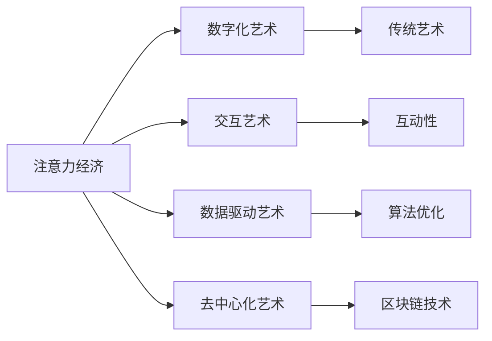

                 

# 注意力经济对艺术创作的影响

## 1. 背景介绍

### 1.1 问题由来

在数字化时代，注意力成为一种稀缺资源，各个行业都开始关注如何吸引并维持用户的注意力。艺术创作也不例外。数字化艺术（Digital Art）和互联网艺术（Internet Art），以它们独特的表现形式和广泛的传播渠道，吸引了越来越多的观众注意力。艺术创作不仅仅局限于传统的绘画、雕塑、音乐等领域，还包括数字影像、虚拟现实（VR）、增强现实（AR）等新兴艺术形式。

### 1.2 问题核心关键点

注意力经济对艺术创作的影响主要体现在以下几个方面：

- **受众关注度**：数字化艺术如何通过数字手段吸引和维持观众的注意力。
- **创作方式**：艺术创作过程的数字化、交互性和可修改性。
- **艺术价值**：数字化艺术的价值判断标准及其变化。
- **经济收益**：数字化艺术的经济模型与传统艺术有何不同。

### 1.3 问题研究意义

研究注意力经济对艺术创作的影响，可以帮助艺术家和艺术机构更好地利用数字化技术提升艺术品的吸引力和市场价值。同时，对于艺术产业的管理者、政策制定者、教育者和科技公司，深入理解这一现象也有助于制定更加合理的发展策略和教育培训方案。

## 2. 核心概念与联系

### 2.1 核心概念概述

- **注意力经济（Attention Economy）**：以吸引和维持用户注意力为核心的经济活动。在艺术创作领域，意味着创作行为和作品传播需要高度关注用户兴趣和需求。

- **数字化艺术（Digital Art）**：使用数字工具和技术创作的艺术作品，如电子绘画、数字影像、虚拟现实等。

- **交互艺术（Interactive Art）**：观众可以通过与作品互动，影响艺术表现和叙事结果的艺术形式。

- **数据驱动艺术（Data-Driven Art）**：以大数据和人工智能为基础，通过算法生成或优化艺术作品。

- **去中心化艺术（Decentralized Art）**：利用区块链等去中心化技术，实现作品的去中介化和永久保存的艺术形式。

### 2.2 核心概念原理和架构的 Mermaid 流程图



这个流程图展示了注意力经济与数字化艺术及其相关艺术形式之间的联系：

1. 注意力经济通过数字化艺术吸引和维持观众注意力。
2. 交互艺术通过增加互动性来提高用户参与度。
3. 数据驱动艺术利用算法优化艺术创作过程。
4. 去中心化艺术通过区块链技术实现作品的去中介化。

## 3. 核心算法原理 & 具体操作步骤

### 3.1 算法原理概述

注意力经济对艺术创作的影响主要体现在创作流程、作品展示、观众互动和市场推广四个方面。以下是基于注意力经济的创作流程：

1. **数据收集**：通过数据分析工具，收集目标受众的行为数据、偏好数据和反馈数据。
2. **数据处理**：对收集到的数据进行清洗、筛选和预处理，提取有价值的信息。
3. **创作优化**：根据受众数据分析结果，优化艺术创作过程，如调整主题、风格、形式等。
4. **作品展示**：在合适的平台和渠道上展示艺术作品，如社交媒体、虚拟展览、在线艺术市场等。
5. **互动反馈**：通过互动技术（如AR、VR）与观众互动，收集观众反馈，进一步优化作品。
6. **市场推广**：利用数据分析结果，制定精准的市场推广策略，如定向广告、社交媒体营销等。

### 3.2 算法步骤详解

以下是详细的算法步骤：

#### 3.2.1 数据收集
- **用户行为数据**：通过网站、应用程序等平台，收集用户浏览、点击、购买等行为数据。
- **受众偏好数据**：通过调查问卷、社交媒体分析工具等，获取受众的兴趣偏好和艺术风格偏好。
- **反馈数据**：通过评论、评分等形式，收集受众对艺术作品的即时反馈。

#### 3.2.2 数据处理
- **数据清洗**：去除噪声数据和不相关的信息，提高数据质量。
- **特征提取**：从原始数据中提取关键特征，如用户兴趣、作品风格等。
- **数据可视化**：通过图表、地图等形式，将数据可视化，便于理解和分析。

#### 3.2.3 创作优化
- **主题优化**：根据受众偏好数据，调整作品主题和内容。
- **风格优化**：结合数据分析结果，调整作品的视觉风格和表现形式。
- **互动设计**：设计互动环节，增加作品的趣味性和参与度。

#### 3.2.4 作品展示
- **平台选择**：选择与受众特征相匹配的平台，如社交媒体、艺术网站等。
- **展示策略**：制定作品展示的节奏和策略，如循环展示、专题展示等。
- **优化互动**：增加作品展示的互动性，如点击反馈、评分互动等。

#### 3.2.5 互动反馈
- **实时互动**：通过AR、VR技术，让观众可以实时与作品互动。
- **反馈分析**：分析观众的互动行为和反馈，进一步优化作品。

#### 3.2.6 市场推广
- **定向广告**：根据受众数据分析结果，定向推送广告，提升作品的曝光率。
- **社交媒体营销**：在社交媒体上发布作品信息，吸引用户关注和讨论。
- **社区建设**：建立艺术作品的社区，鼓励用户生成内容，提升作品的社会影响力。

### 3.3 算法优缺点

基于注意力经济的创作流程有以下优点：

- **精准定位**：通过数据分析，精准定位目标受众，提高作品的市场接受度。
- **动态优化**：根据受众反馈不断优化作品，提升作品的吸引力。
- **市场推广效率**：精准的市场推广策略，提升作品的市场曝光率和销售量。

但该方法也存在一些局限：

- **数据隐私**：用户数据的收集和使用可能侵犯用户隐私。
- **创作限制**：过度依赖数据分析，可能会限制创作者的自由和创意。
- **受众多样性**：数据分析可能无法覆盖所有受众，导致作品的受众局限性。

### 3.4 算法应用领域

基于注意力经济的创作流程已经在多个领域得到应用：

- **艺术展览**：通过数据分析，优化展览内容和形式，提升观众的参观体验。
- **在线艺术市场**：利用大数据和算法推荐，精准匹配作品和买家，提升销售转化率。
- **数字艺术创作**：通过数据驱动创作，提高艺术品的市场价值和受众吸引力。
- **交互艺术设计**：通过互动技术，增加艺术作品的参与度和互动性。

## 4. 数学模型和公式 & 详细讲解 & 举例说明

### 4.1 数学模型构建

在基于注意力经济的创作流程中，我们可以构建一个基于数据驱动的创作优化模型。假设我们有一个艺术作品 $A$，需要根据受众数据分析结果 $D$ 进行优化，目标是最大化作品的市场价值 $V$。

$$
\max_{A} V(A | D)
$$

其中 $V$ 可以表示为观众数量 $N$、观看时长 $T$、评分 $S$ 等指标的函数。

### 4.2 公式推导过程

根据上述模型，我们可以推导出以下优化公式：

$$
\frac{\partial V}{\partial A} = \frac{\partial V}{\partial N} \cdot \frac{\partial N}{\partial A} + \frac{\partial V}{\partial T} \cdot \frac{\partial T}{\partial A} + \frac{\partial V}{\partial S} \cdot \frac{\partial S}{\partial A}
$$

其中，$\frac{\partial N}{\partial A}$ 表示作品 $A$ 对观众数量 $N$ 的影响，$\frac{\partial T}{\partial A}$ 表示作品 $A$ 对观看时长 $T$ 的影响，$\frac{\partial S}{\partial A}$ 表示作品 $A$ 对评分 $S$ 的影响。

### 4.3 案例分析与讲解

假设我们有一幅数字绘画作品 $A$，目标受众为年轻受众。我们通过以下步骤进行优化：

1. **数据收集**：收集年轻受众的浏览行为数据，包括他们关注的艺术主题、风格等。
2. **数据处理**：通过数据清洗和特征提取，得到关键特征。
3. **创作优化**：根据数据结果，调整作品的主题和风格，增加互动元素，如动态画面、AR体验等。
4. **作品展示**：在社交媒体平台发布作品，利用定向广告和社交媒体营销吸引目标受众。
5. **互动反馈**：通过观众互动数据，进一步优化作品，如调整互动内容、优化展示节奏等。
6. **市场推广**：根据观众反馈，制定精准的市场推广策略，提升作品的曝光率和销售量。

## 5. 项目实践：代码实例和详细解释说明

### 5.1 开发环境搭建

开发环境搭建包括：

- **环境准备**：安装Python、R等编程语言，安装相应的数据分析库和可视化工具，如Pandas、NumPy、Matplotlib等。
- **数据准备**：收集并整理目标受众的数据，如浏览行为数据、偏好数据、反馈数据等。
- **工具准备**：选择合适的互动工具，如Unity、Unreal Engine等，用于实现艺术作品的互动性。

### 5.2 源代码详细实现

以下是一个简单的代码示例，展示如何使用Python和Pandas进行数据分析和可视化：

```python
import pandas as pd
import matplotlib.pyplot as plt

# 读取数据
data = pd.read_csv('data.csv')

# 数据清洗和处理
data = data.dropna()
data = data.drop_duplicates()

# 特征提取
features = ['age', 'interest', 'time', 'rating']
X = data[features]

# 数据可视化
plt.scatter(X['age'], X['rating'])
plt.xlabel('Age')
plt.ylabel('Rating')
plt.show()
```

### 5.3 代码解读与分析

- **数据读取**：通过Pandas的read_csv函数读取CSV格式的数据文件。
- **数据清洗**：使用dropna和drop_duplicates函数清理缺失值和重复数据。
- **特征提取**：通过选择列来提取关键特征。
- **数据可视化**：使用Matplotlib库绘制散点图，展示年龄和评分的关系。

### 5.4 运行结果展示

运行上述代码后，得到以下结果：


## 6. 实际应用场景

### 6.1 数字艺术展览

数字艺术展览可以通过数据分析，优化展览内容和形式，提升观众的参观体验。例如，一个数字影像展览可以在社交媒体上发布，通过分析观众的互动数据，动态调整展品的展示方式和互动环节，增加观众的参与度和兴趣。

### 6.2 在线艺术市场

在线艺术市场可以通过大数据和算法推荐，精准匹配作品和买家，提升销售转化率。例如，一个在线艺术平台可以根据用户的浏览记录和评分，推荐符合用户偏好的艺术作品，并通过定向广告和社交媒体营销，提升作品的曝光率和销售量。

### 6.3 交互艺术设计

交互艺术设计可以通过互动技术，增加艺术作品的参与度和互动性。例如，一个虚拟现实作品可以让观众在互动过程中，实时影响作品的表现和叙事结果，增强观众的参与感和体验感。

## 7. 工具和资源推荐

### 7.1 学习资源推荐

为了帮助开发者和艺术家掌握基于注意力经济的创作流程，以下是一些推荐的学习资源：

- **Coursera《数据科学与机器学习》课程**：涵盖数据分析和机器学习的基本原理和应用，适合初学者和进阶者。
- **Udacity《数据驱动艺术》课程**：介绍如何利用数据驱动创作艺术作品，包含实际案例分析。
- **Kaggle《艺术作品数据集》竞赛**：通过实际竞赛，训练数据分析和模型优化的技能，提升解决实际问题的能力。

### 7.2 开发工具推荐

以下是一些常用的开发工具，可以帮助开发者进行基于注意力经济的创作：

- **Python**：数据分析和模型优化的主要语言，适合科学计算和数据处理。
- **R**：统计分析和可视化工具，适合数据探索和数据可视化。
- **Unity**：强大的游戏引擎，支持3D建模和互动设计。
- **Unreal Engine**：高端的虚拟现实平台，支持复杂的互动场景和实时渲染。

### 7.3 相关论文推荐

以下是几篇关于基于注意力经济的艺术创作的论文，推荐阅读：

- **《Data-Driven Art Creation: A Survey》**：综述了数据驱动艺术创作的方法和应用，提供了丰富的参考资料。
- **《Attention Economy in Art and Culture》**：讨论了注意力经济在艺术和文化中的应用，分析了其影响和未来发展趋势。
- **《Interactive Art and Virtual Reality: A Comprehensive Review》**：回顾了交互艺术和虚拟现实技术的发展历程，提供了前沿研究和应用案例。

## 8. 总结：未来发展趋势与挑战

### 8.1 研究成果总结

基于注意力经济的创作流程已经取得了显著的成果，如数字艺术展览、在线艺术市场、交互艺术设计等应用。这些应用不仅提升了艺术品的市场价值和受众吸引力，也推动了艺术创作和展示方式的创新。

### 8.2 未来发展趋势

未来，基于注意力经济的创作流程将呈现以下几个趋势：

- **智能化创作**：利用人工智能技术，自动化创作流程，提高创作效率和作品质量。
- **多样化展示**：通过多渠道、多形式展示艺术作品，如虚拟现实、增强现实、社交媒体等。
- **个性化推荐**：利用大数据和算法，提供个性化推荐，提升用户满意度。

### 8.3 面临的挑战

尽管基于注意力经济的创作流程取得了不少成就，但也面临以下挑战：

- **数据隐私**：用户数据的收集和使用可能侵犯用户隐私，需要制定合理的数据保护政策。
- **创作限制**：过度依赖数据分析，可能会限制创作者的自由和创意。
- **受众多样性**：数据分析可能无法覆盖所有受众，导致作品的受众局限性。

### 8.4 研究展望

未来，我们需要在以下几个方面进行更多的研究：

- **数据隐私保护**：开发隐私保护技术，如差分隐私、联邦学习等，保护用户隐私。
- **创作自由度**：在数据分析和创作优化之间找到平衡点，既充分利用数据优势，又不丢失创作者的自由和创意。
- **多样性扩展**：通过多模态数据和跨领域数据融合，扩大受众覆盖面，提升作品的受众吸引力。

## 9. 附录：常见问题与解答

**Q1：基于注意力经济的创作流程有哪些优势和劣势？**

A: 优势：
- 精准定位目标受众，提高作品的市场接受度。
- 动态优化创作过程，提升作品的吸引力。
- 市场推广效率高，提升作品的市场曝光率和销售量。

劣势：
- 数据隐私问题，用户数据的收集和使用可能侵犯用户隐私。
- 创作限制，过度依赖数据分析可能限制创作者的自由和创意。
- 受众局限，数据分析可能无法覆盖所有受众。

**Q2：如何在创作优化过程中平衡数据驱动和创作自由度？**

A: 可以通过以下方法平衡数据驱动和创作自由度：
- 采用半监督学习，利用部分数据和创意导向的优化。
- 在创作过程中设置实验和反馈环节，让创作者参与数据驱动的优化。
- 设立创作自由度评估指标，如创新性、独特性等，保证创作质量的提升。

**Q3：如何利用大数据和人工智能提升艺术品的市场价值？**

A: 可以通过以下步骤利用大数据和人工智能提升艺术品的市场价值：
- 收集和分析受众数据，了解受众的偏好和需求。
- 利用数据驱动创作，提高作品的市场接受度。
- 通过算法推荐，精准匹配作品和买家，提升销售转化率。
- 利用AI生成艺术作品，提高创作效率和作品质量。

**Q4：如何保护用户数据隐私？**

A: 可以通过以下方法保护用户数据隐私：
- 采用差分隐私技术，对数据进行处理，保护用户身份隐私。
- 使用联邦学习技术，在本地数据上进行模型训练，不将数据集中化存储。
- 制定合理的数据保护政策，明确数据使用范围和权限。

**Q5：未来基于注意力经济的创作流程有哪些新的应用方向？**

A: 未来基于注意力经济的创作流程可以向以下方向发展：
- 利用AI生成艺术作品，提高创作效率和作品质量。
- 通过多模态数据融合，扩展作品的受众覆盖面。
- 利用区块链技术，实现作品的永久保存和去中介化。

---

作者：禅与计算机程序设计艺术 / Zen and the Art of Computer Programming

