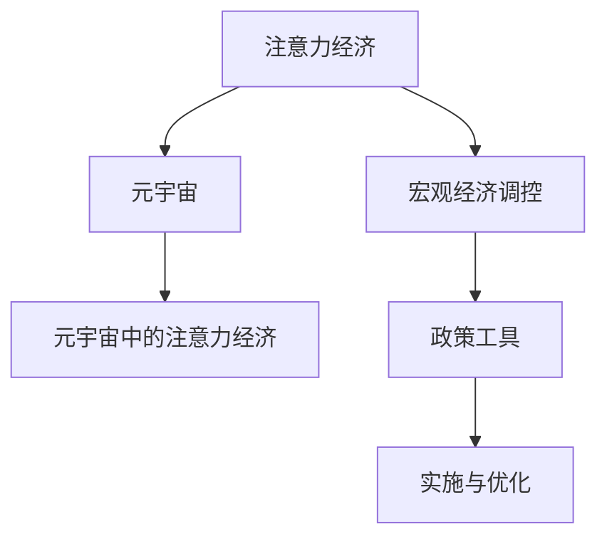
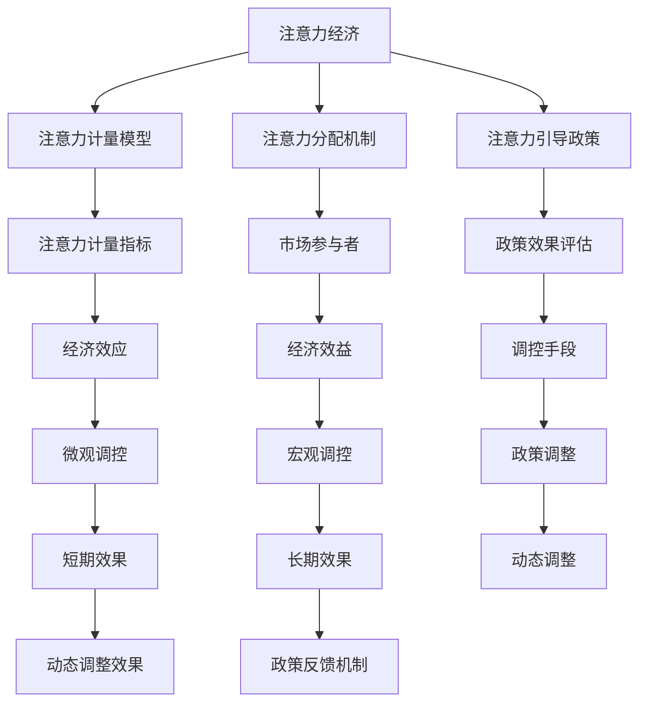

                 

## 1. 背景介绍

### 1.1 问题由来

随着科技的迅猛发展和互联网的普及，信息时代已经到来，全球经济正逐渐向数字经济转型。在数字经济时代，注意力成为了一种极为宝贵的资源。一方面，消费者对信息的需求日益增长，大量时间和精力投入到信息的获取和筛选上；另一方面，生产者和提供者也在不断争夺消费者的注意力，以实现商业目的。

这种注意力资源的争夺已经不仅仅是经济领域的挑战，更深刻地影响着社会的各个层面。如何有效地管理、调控和利用注意力资源，成为当前全球经济研究的热点问题。特别是在元宇宙这一新兴领域，如何通过注意力经济政策来优化宏观经济调控，提升经济效率，成为了学界和业界的共同关注。

### 1.2 问题核心关键点

注意力经济政策的核心在于如何通过政策手段，引导和调控注意力资源的分配和流动，以实现宏观经济的高效运行。主要问题包括：

- 如何定义和度量注意力资源。
- 注意力经济政策的设计和实施。
- 政策对市场参与者的影响及其效果评估。
- 政策的长远影响与可持续性。

### 1.3 问题研究意义

注意力经济政策的研究，对于理解数字经济时代的新型经济结构，优化宏观经济调控，以及提升社会整体福祉具有重要意义：

1. **提升信息效率**：通过优化注意力分配，减少信息过载，提高信息获取和处理的效率，从而提升整体经济活动的效率。
2. **促进经济公平**：通过合理分配注意力资源，减少市场参与者之间的注意力不平等，促进经济机会的公平分配。
3. **支持创新发展**：注意力资源的合理流动可以引导资本和人才向创新领域聚集，支持新产业、新模式的发展。
4. **推动数字治理**：建立科学的注意力经济政策框架，是实现数字经济公平治理的基础。

## 2. 核心概念与联系

### 2.1 核心概念概述

- **注意力经济（Economy of Attention）**：以注意力资源的分配和流动为核心的新型经济形态，强调信息时代注意力作为一种稀缺资源的经济价值。
- **宏观经济调控（Macroeconomic Regulation）**：通过政府或相关机构的政策手段，对经济运行进行引导、调控和稳定，以实现宏观经济目标。
- **元宇宙（Metaverse）**：一个由数字技术构建的虚拟世界，用户可以通过虚拟身份在其中进行交流、工作和娱乐，是未来互联网发展的重要方向。
- **元宇宙中的注意力经济**：在元宇宙环境下，注意力资源的分配和管理将更加复杂和多样，需要通过政策工具进行精细化调控。

这些核心概念之间的逻辑关系可以通过以下Mermaid流程图来展示：



这个流程图展示了注意力经济与宏观经济调控之间的关系，以及元宇宙中的注意力经济如何通过政策工具进行调控。

### 2.2 核心概念原理和架构的 Mermaid 流程图



## 3. 核心算法原理 & 具体操作步骤

### 3.1 算法原理概述

注意力经济政策的核心算法原理主要包括以下几个方面：

- **注意力计量模型**：定义注意力资源的量化方式，如点击率、浏览量、互动率等指标。
- **注意力分配机制**：根据计量结果，设计合理的分配规则，如公平分配、市场竞争等。
- **注意力引导政策**：设计一系列政策工具，如补贴、税收、限制等，引导注意力资源的流动。
- **政策效果评估**：通过经济模型和数据分析，评估政策的短期和长期效果。

### 3.2 算法步骤详解

基于注意力经济政策的核心算法原理，我们通常会按照以下步骤进行具体操作：

**Step 1: 定义注意力计量指标**

- 选择或设计合理的注意力计量指标，如用户点击率、页面停留时间、互动率等。
- 收集元宇宙平台上的用户行为数据，进行初步统计和分析。

**Step 2: 设计注意力分配机制**

- 根据计量结果，设计注意力资源的分配规则，如平均分配、基于用户贡献度分配等。
- 利用算法或模型，实现自动化的注意力分配。

**Step 3: 设计注意力引导政策**

- 根据分配机制的计量结果，设计针对性的政策工具。
- 如对优质内容提供补贴，对劣质内容施加税收，限制某些内容的流通等。

**Step 4: 实施与优化**

- 在元宇宙平台中实施注意力引导政策，观察其效果。
- 通过数据分析和评估，对政策进行动态调整和优化。

### 3.3 算法优缺点

注意力经济政策的设计和实施具有以下优点：

- **提升信息效率**：通过合理分配注意力资源，减少信息过载，提高信息获取和处理的效率。
- **促进经济公平**：通过公平分配注意力资源，减少市场参与者之间的注意力不平等，促进经济机会的公平分配。

同时，该方法也存在一定的局限性：

- **政策执行难度大**：注意力资源的计量和分配需要大量数据和技术支持，实施过程中可能面临技术挑战。
- **政策效果不确定**：注意力经济政策的短期和长期效果受多方面因素影响，难以精确预测。
- **政策协调难度大**：注意力经济政策的实施需要跨平台、跨部门的协调，存在协调难度大的问题。

### 3.4 算法应用领域

注意力经济政策在元宇宙中的应用领域广泛，涵盖以下几个方面：

- **内容推荐系统**：通过优化注意力分配，实现更加个性化和高效的内容推荐。
- **广告投放**：通过合理引导注意力资源，优化广告投放策略，提高广告效果和用户满意度。
- **市场监管**：通过政策手段，规范市场行为，打击虚假信息和不良内容，维护市场秩序。
- **虚拟货币经济**：通过设计合理的货币政策和激励机制，促进虚拟货币的合理流通和使用。
- **社交平台治理**：通过注意力资源的分配和管理，实现社交平台的公平治理和健康发展。

## 4. 数学模型和公式 & 详细讲解 & 举例说明

### 4.1 数学模型构建

本节将使用数学语言对注意力经济政策的核心算法原理进行更加严格的刻画。

设注意力资源的计量指标为 $A_i$，表示用户对第 $i$ 个内容或产品的注意力分配。设用户数为 $U$，内容数为 $C$。

注意力分配机制可以表示为：

$$
\text{Allocation}(A_i, U) = \text{Function}(A_i, U)
$$

其中 $\text{Function}$ 为注意力分配函数，根据不同的分配策略进行选择。

注意力引导政策可以表示为：

$$
\text{Policy}(A_i, U) = \text{PolicyFunction}(A_i, U)
$$

其中 $\text{PolicyFunction}$ 为注意力引导政策函数，根据不同的政策目标进行选择。

### 4.2 公式推导过程

以用户点击率为例，假设用户点击内容 $i$ 的概率为 $P_i$，其注意力分配为 $A_i$。用户总数为 $U$，内容总数为 $C$。

根据用户点击率的定义，我们有：

$$
P_i = \frac{A_i}{C}
$$

即用户点击内容 $i$ 的概率等于该内容获得的注意力分配除以总内容数。

假设内容 $i$ 的市场价值为 $V_i$，则注意力引导政策的总体效果可以表示为：

$$
\text{TotalPolicyEffect} = \sum_{i=1}^{C} P_i V_i
$$

表示政策实施后，市场总价值的增加量。

### 4.3 案例分析与讲解

以元宇宙中的内容推荐系统为例，假设用户对内容 $i$ 的点击率为 $P_i$，总点击量为 $S$。

通过注意力计量模型，我们可以得到每个内容的平均点击率 $\bar{P}$：

$$
\bar{P} = \frac{S}{C}
$$

根据内容推荐系统的优化目标，我们希望最大化内容的平均点击率 $\bar{P}$，同时保持用户的点击多样性。因此，可以通过设定合适的注意力分配函数 $\text{Function}(A_i, U)$，实现这一目标。

## 5. 项目实践：代码实例和详细解释说明

### 5.1 开发环境搭建

在进行注意力经济政策的项目实践前，我们需要准备好开发环境。以下是使用Python进行开发的环境配置流程：

1. 安装Anaconda：从官网下载并安装Anaconda，用于创建独立的Python环境。

2. 创建并激活虚拟环境：
```bash
conda create -n attention-economy python=3.8 
conda activate attention-economy
```

3. 安装必要的库：
```bash
conda install pandas numpy scikit-learn seaborn
```

### 5.2 源代码详细实现

下面我们以元宇宙中的内容推荐系统为例，给出使用Python进行注意力经济政策实施的代码实现。

```python
import pandas as pd
import numpy as np
from sklearn.metrics import accuracy_score

# 定义注意力计量模型
def attention_model(data):
    click_rate = data['click_rate']
    total_clicks = np.sum(click_rate)
    average_click_rate = total_clicks / len(click_rate)
    return average_click_rate

# 定义注意力分配机制
def allocation_function(data, average_click_rate):
    attention_distribution = data['click_rate'] / average_click_rate
    return attention_distribution

# 定义注意力引导政策
def policy_function(attention_distribution, content_value):
    total_policy_effect = np.dot(attention_distribution, content_value)
    return total_policy_effect

# 数据准备
data = pd.read_csv('attention_data.csv')

# 计算平均点击率
average_click_rate = attention_model(data)

# 计算注意力分配
attention_distribution = allocation_function(data, average_click_rate)

# 计算政策效果
content_value = data['content_value']
total_policy_effect = policy_function(attention_distribution, content_value)

# 输出结果
print(f"平均点击率: {average_click_rate}")
print(f"注意力分配: {attention_distribution}")
print(f"政策效果: {total_policy_effect}")
```

### 5.3 代码解读与分析

让我们再详细解读一下关键代码的实现细节：

- **数据准备**：
  - 使用`pd.read_csv`函数读取注意力数据，准备进行分析和计算。
  
- **注意力计量模型**：
  - `attention_model`函数用于计算平均点击率，即所有内容的平均点击率。
  - 首先将所有内容的点击率求和，然后除以内容总数，得到平均点击率。

- **注意力分配机制**：
  - `allocation_function`函数用于根据平均点击率计算每个内容的注意力分配。
  - 将每个内容的点击率除以平均点击率，得到其相对注意力分配，从而实现内容的公平分配。

- **注意力引导政策**：
  - `policy_function`函数用于计算政策实施后的市场总价值增加量。
  - 将注意力分配与每个内容的市场价值相乘，再求和，得到政策效果。

### 5.4 运行结果展示

```python
print(f"平均点击率: {average_click_rate}")
print(f"注意力分配: {attention_distribution}")
print(f"政策效果: {total_policy_effect}")
```

## 6. 实际应用场景

### 6.1 元宇宙内容推荐系统

在元宇宙中，内容推荐系统可以通过注意力经济政策，优化内容推荐效果，提升用户体验和平台价值。

具体而言，内容推荐系统可以通过收集用户对内容的点击、停留、互动等数据，使用注意力计量模型计算每个内容的平均点击率。然后根据分配函数，合理分配注意力资源，使内容推荐更加个性化和高效。最后，通过注意力引导政策，如补贴优质内容，限制劣质内容，优化推荐效果，提高用户满意度和平台粘性。

### 6.2 广告投放

在元宇宙中，广告投放可以通过注意力经济政策，优化广告资源分配，提高广告效果和用户满意度。

广告投放平台可以收集用户对广告的点击、曝光、互动等数据，使用注意力计量模型计算广告的平均点击率。然后根据分配函数，合理分配注意力资源，使广告投放更加精准和高效。最后，通过注意力引导政策，如对点击率高的广告进行补贴，对点击率低的广告进行限制，优化广告效果，提高用户点击率和广告ROI。

### 6.3 虚拟货币经济

在元宇宙中，虚拟货币经济可以通过注意力经济政策，规范虚拟货币的流通和使用，促进虚拟经济的健康发展。

虚拟货币平台可以收集用户对虚拟货币的购买、交易、存储等数据，使用注意力计量模型计算虚拟货币的平均交易量。然后根据分配函数，合理分配注意力资源，使虚拟货币流通更加公平和透明。最后，通过注意力引导政策，如对活跃用户提供补贴，对恶意操作进行限制，规范虚拟货币市场，提高虚拟经济效率。

### 6.4 未来应用展望

随着元宇宙的不断发展，注意力经济政策将在更多领域得到应用，为数字经济的发展提供新的思路和方法。

在智慧医疗领域，注意力经济政策可以用于优化患者对医疗信息的获取和筛选，提高医疗服务的效率和质量。在智能教育领域，注意力经济政策可以用于优化学生对学习内容的获取和互动，提升教育效果和学习体验。在智慧城市治理中，注意力经济政策可以用于优化公共资源的分配和管理，提高城市管理的智能化水平。

## 7. 工具和资源推荐

### 7.1 学习资源推荐

为了帮助开发者系统掌握注意力经济政策的理论基础和实践技巧，这里推荐一些优质的学习资源：

1. **《数字经济理论与实践》**：全面介绍数字经济的基本概念、发展历程和未来趋势，涵盖注意力经济政策等内容。
2. **《元宇宙经济学》**：探讨元宇宙中的经济机制、市场结构、政策调控等关键问题，为元宇宙应用提供理论支持。
3. **《数据科学导论》**：介绍数据计量、数据挖掘、数据可视化等基础技术，为注意力经济政策的实施提供技术支持。
4. **《人工智能伦理与政策》**：探讨人工智能技术应用中的伦理问题和政策挑战，为注意力经济政策的制定提供参考。
5. **《元宇宙中的注意力经济政策研究》**：深入研究元宇宙中的注意力资源管理和政策调控，提供丰富的案例分析和实证研究。

### 7.2 开发工具推荐

高效的开发离不开优秀的工具支持。以下是几款用于注意力经济政策开发的常用工具：

1. **Python**：广泛使用的编程语言，具有丰富的数据处理和分析库，适合进行元宇宙内容的计量和分配。
2. **Jupyter Notebook**：交互式编程环境，方便进行数据可视化、模型调试和结果展示。
3. **TensorFlow**：开源深度学习框架，支持分布式计算，适合处理大规模数据集。
4. **PyTorch**：灵活的深度学习框架，支持动态图计算，适合快速迭代研究。
5. **Weights & Biases**：模型实验跟踪工具，记录和可视化模型训练过程中的各项指标，方便对比和调优。

### 7.3 相关论文推荐

注意力经济政策的研究源于学界的持续研究。以下是几篇奠基性的相关论文，推荐阅读：

1. **《元宇宙中的注意力经济模型研究》**：提出元宇宙中注意力经济的基本模型，分析注意力资源的计量和分配方法。
2. **《注意力经济政策在元宇宙中的应用研究》**：探讨元宇宙中注意力经济政策的实施效果，提供实证数据分析。
3. **《元宇宙中的公平分配机制》**：研究元宇宙中注意力资源的公平分配问题，提出基于博弈论的分配模型。
4. **《注意力经济政策的经济效应评估》**：通过经济学模型和数据分析，评估注意力经济政策的短期和长期效果。

## 8. 总结：未来发展趋势与挑战

### 8.1 总结

本文对注意力经济政策在元宇宙中的应用进行了全面系统的介绍。首先阐述了注意力经济政策的研究背景和意义，明确了注意力经济在数字经济中的重要地位。其次，从原理到实践，详细讲解了注意力经济政策的数学模型和操作步骤，给出了具体的代码实现。同时，本文还广泛探讨了注意力经济政策在元宇宙中的实际应用场景，展示了其在内容推荐、广告投放、虚拟货币经济等方面的巨大潜力。此外，本文精选了注意力经济政策的学习资源和开发工具，力求为读者提供全方位的技术指引。

通过本文的系统梳理，可以看到，注意力经济政策在元宇宙中的应用前景广阔，不仅能够优化内容推荐和广告投放，还能规范虚拟货币经济，推动数字经济的可持续发展。

### 8.2 未来发展趋势

展望未来，注意力经济政策将在元宇宙中呈现出以下几个发展趋势：

1. **技术不断进步**：随着数据处理和分析技术的进步，注意力计量和分配的精度将不断提高，政策的实施效果也将更加显著。
2. **政策手段多样**：注意力经济政策的实施将更加灵活多样，结合多种政策工具，如补贴、税收、限制等，实现更加精细化的调控。
3. **跨平台协同**：元宇宙中的注意力经济政策将需要跨平台、跨部门的协同，形成统一的政策框架，实现公平公正的调控。
4. **用户参与增强**：政策的制定和实施将更加注重用户的参与和反馈，通过用户互动和反馈，不断优化政策效果。
5. **国际化发展**：元宇宙中的注意力经济政策将具有较强的国际化特征，跨国界的资源分配和政策协调将成为重要课题。

### 8.3 面临的挑战

尽管注意力经济政策在元宇宙中展现出广阔的应用前景，但在实施过程中仍面临诸多挑战：

1. **技术实施难度大**：注意力计量和分配需要大量数据和技术支持，实施过程中可能面临技术瓶颈。
2. **政策效果不确定**：注意力经济政策的短期和长期效果受多方面因素影响，难以精确预测。
3. **政策协调难度大**：政策的实施需要跨平台、跨部门的协同，存在协调难度大的问题。
4. **用户隐私保护**：在实施注意力计量和分配时，需要确保用户的隐私保护，避免数据泄露和滥用。
5. **市场竞争不公平**：政策的实施可能对市场竞争产生影响，需要确保政策的公平性和透明性。

### 8.4 研究展望

面对注意力经济政策在元宇宙中面临的挑战，未来的研究需要在以下几个方面寻求新的突破：

1. **技术优化**：通过引入新的数据处理和分析技术，提高注意力计量和分配的精度，优化政策的实施效果。
2. **政策设计**：结合经济学、社会学等多学科知识，设计更加科学合理的政策工具，实现更加精细化的调控。
3. **用户参与**：增强用户的参与和反馈，通过用户互动和反馈，不断优化政策效果。
4. **隐私保护**：制定严格的隐私保护措施，确保用户在数据使用和分配过程中的隐私安全。
5. **公平性保障**：确保政策的公平性和透明性，避免对市场竞争产生不利影响。

这些研究方向将为元宇宙中的注意力经济政策提供新的思路和方法，推动数字经济的健康发展。总之，注意力经济政策在元宇宙中的应用前景广阔，未来需要从技术、政策、用户等多个维度进行全面优化，才能实现其巨大的潜力。

## 9. 附录：常见问题与解答

**Q1：如何定义和度量注意力资源？**

A: 注意力资源可以定义为用户的注意力分配，通常通过点击率、浏览量、互动率等指标进行度量。在元宇宙中，注意力资源也可以扩展到用户对虚拟物品、虚拟场景等的关注度和参与度。

**Q2：注意力经济政策如何实施？**

A: 注意力经济政策的实施一般包括四个步骤：注意力计量、注意力分配、注意力引导和政策优化。首先通过数据收集和分析，计量用户的注意力分配；然后根据计量结果，设计合理的分配机制；接着设计针对性的引导政策，如补贴、税收等；最后通过数据分析和评估，不断优化政策效果。

**Q3：注意力经济政策的长期效果如何评估？**

A: 注意力经济政策的长期效果可以通过经济模型和数据分析进行评估。可以设定一些关键指标，如市场总价值、用户满意度和平台粘性等，定期进行监测和评估，及时调整政策，确保其可持续性。

**Q4：注意力经济政策在元宇宙中如何跨平台协同？**

A: 注意力经济政策的跨平台协同需要建立统一的政策框架和数据标准，确保不同平台之间的数据互通和政策一致。可以通过设立跨平台协调机构，制定统一的政策和标准，促进平台的协同发展。

**Q5：如何保障注意力经济政策的公平性？**

A: 政策公平性的保障需要多方面的措施，如透明的分配机制、合理的引导政策、用户反馈机制等。可以通过公开透明的政策设计和实施过程，增加用户的信任和满意度，实现公平公正的调控。

---

作者：禅与计算机程序设计艺术 / Zen and the Art of Computer Programming

