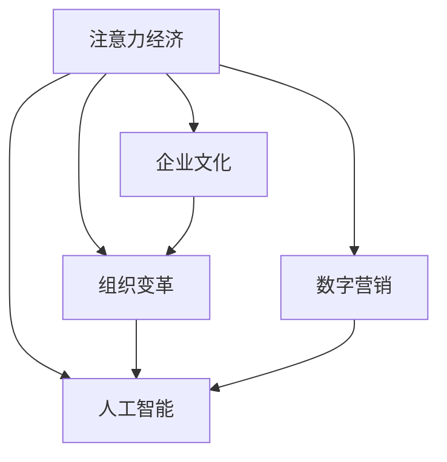

                 

# 注意力经济视角下的企业文化重构

> 关键词：注意力经济,企业文化,组织变革,数字营销,人工智能

## 1. 背景介绍

### 1.1 问题由来

随着互联网和信息技术的迅猛发展，人类社会已经从传统经济过渡到了注意力经济时代。在注意力经济模式下，企业获取和维持消费者注意力的成本越来越高，用户注意力成为一种稀缺资源。如何高效利用用户注意力，成为企业竞争的核心。

与此同时，传统企业文化面临着巨大的挑战。在工业时代，企业强调标准化流程、等级划分、职责分工等，注重效率和稳定。但在互联网时代，市场变化快速，消费者需求多变，传统企业文化难以适应瞬息万变的外部环境。

### 1.2 问题核心关键点

当前，企业文化重构的核心关键点在于：
1. **适应注意力经济模式**：通过用户行为分析和数据驱动决策，精准定位用户需求，优化产品设计和营销策略。
2. **强化企业灵活性**：打破传统层级制度，实现扁平化管理，快速响应市场变化。
3. **提升创新能力**：建立创新驱动的企业文化，鼓励员工创新，持续推出新产品和新技术。
4. **增强用户体验**：以用户为中心，构建个性化服务体系，提升用户满意度和忠诚度。
5. **运用先进技术**：借助大数据、人工智能等技术，提升企业运营效率和决策能力。

## 2. 核心概念与联系

### 2.1 核心概念概述

为更好地理解企业文化重构在注意力经济模式下的实践，本节将介绍几个密切相关的核心概念：

- **注意力经济**：指在信息爆炸的时代，消费者注意力成为最宝贵的资源，企业获取和维持用户注意力成为核心竞争力的经济模式。
- **企业文化**：指企业内部成员共同认同和遵循的价值观、行为准则和规范，影响企业战略、运营和组织结构。
- **组织变革**：指企业根据外部环境的变化，调整和重构内部组织结构、流程和文化的变革过程。
- **数字营销**：指利用数字技术和互联网平台，进行品牌推广、市场分析和客户管理等营销活动。
- **人工智能**：指通过算法和数据驱动，模拟人类智能的计算系统，广泛应用于自然语言处理、计算机视觉等领域。

这些核心概念之间的逻辑关系可以通过以下Mermaid流程图来展示：



这个流程图展示了大语言模型的核心概念及其之间的关系：

1. 注意力经济模式影响企业文化，驱动组织变革。
2. 数字营销和人工智能技术支持企业文化重构，提升企业运营效率。
3. 数字营销和人工智能技术的应用，使企业能够更好地适应注意力经济模式，提升市场竞争力。

## 3. 核心算法原理 & 具体操作步骤
### 3.1 算法原理概述

企业文化重构的核心在于通过数据驱动和创新驱动，实现组织的灵活性和市场适应性。其中，注意力经济模式下的企业文化重构主要涉及以下几个步骤：

1. **用户行为分析**：通过收集和分析用户行为数据，了解用户需求和偏好。
2. **市场定位和策略制定**：基于用户行为分析结果，精准定位市场，制定差异化的营销策略。
3. **组织结构优化**：打破传统层级制度，实现扁平化管理，提升组织效率和灵活性。
4. **技术应用**：引入大数据、人工智能等技术，提升企业运营效率和决策能力。
5. **文化建设**：通过创新文化建设，激发员工创造力和创新精神，形成正向的企业文化氛围。

### 3.2 算法步骤详解

以下是企业文化重构在注意力经济模式下的具体操作步骤：

**Step 1: 用户行为数据收集与分析**
- 通过网站、社交媒体、移动应用等渠道，收集用户行为数据，包括浏览记录、购买历史、搜索关键词等。
- 使用数据挖掘和机器学习算法，分析用户行为数据，了解用户需求和偏好，如用户兴趣、购买意愿、品牌忠诚度等。

**Step 2: 市场定位和策略制定**
- 基于用户行为分析结果，确定目标用户群体和市场定位。
- 制定差异化的营销策略，如个性化推荐、社交媒体营销、内容营销等，吸引和维持用户注意力。

**Step 3: 组织结构优化**
- 打破传统层级制度，实现扁平化管理，减少信息传递层级，提升决策速度。
- 建立跨部门协作机制，促进知识共享和创新合作。

**Step 4: 技术应用**
- 引入大数据技术，构建用户行为数据仓库，实现数据的集中管理和分析。
- 引入人工智能技术，建立用户行为预测模型，优化产品和营销策略。

**Step 5: 文化建设**
- 建立创新驱动的企业文化，鼓励员工提出创意和改进建议，形成正向的文化氛围。
- 通过培训和奖励机制，激励员工学习和应用新技术，提升技术能力。

### 3.3 算法优缺点

企业文化重构在注意力经济模式下的算法具有以下优点：
1. **提升市场竞争力**：通过精准的用户行为分析和市场定位，企业能够更好地适应市场变化，提升竞争力。
2. **提升运营效率**：引入大数据和人工智能技术，提升企业的运营效率和决策能力。
3. **增强创新能力**：建立创新驱动的企业文化，激发员工的创造力，推动企业持续创新。

同时，该算法也存在一些局限性：
1. **数据隐私问题**：用户行为数据的收集和使用可能涉及隐私问题，需要严格遵守法律法规和隐私保护措施。
2. **技术门槛高**：大数据和人工智能技术的应用需要较高的技术门槛，需要企业具备相应的技术能力和资源。
3. **文化变革难度大**：企业文化变革涉及组织深层次的改变，需要高层领导的强力推动和全体员工的共同努力。
4. **短期效果不确定**：企业文化重构的效果可能需要较长时间才能显现，短期内可能面临效果不明显的问题。

尽管存在这些局限性，但就目前而言，基于数据驱动和创新驱动的企业文化重构方法仍是大企业应对注意力经济模式的重要手段。未来相关研究的重点在于如何进一步降低数据收集和分析的成本，提高技术应用的可行性，同时兼顾文化变革的持续性和稳定性。

### 3.4 算法应用领域

企业文化重构在注意力经济模式下的算法已在多个领域得到应用，例如：

- **零售业**：通过用户行为数据分析，制定个性化推荐策略，提升用户购买转化率。
- **金融业**：利用用户行为预测模型，优化客户服务流程，提升用户体验。
- **制造业**：引入人工智能技术，提升生产效率和产品质量，推动智能制造。
- **医疗行业**：通过数据分析，优化患者诊疗流程，提升医疗服务质量。
- **教育行业**：利用大数据技术，个性化推荐学习资源，提升学生学习效果。

除了上述这些经典领域外，企业文化重构在更多行业领域也有广泛的应用前景，为各行各业数字化转型提供新的动力。

## 4. 数学模型和公式 & 详细讲解  
### 4.1 数学模型构建

本节将使用数学语言对企业文化重构的数学模型进行更加严格的刻画。

记用户行为数据为 $\mathcal{D}=\{(x_i,y_i)\}_{i=1}^N$，其中 $x_i$ 为行为特征，$y_i$ 为用户标签。假设目标任务为分类任务，则用户行为分类模型为：

$$
\hat{y}=f(\mathbf{x};\theta)
$$

其中 $f$ 为分类器，$\theta$ 为模型参数。分类器的损失函数为：

$$
\mathcal{L}(\theta) = -\frac{1}{N}\sum_{i=1}^N \log P(y_i|\mathbf{x}_i)
$$

其中 $P(y_i|\mathbf{x}_i)$ 为模型在给定行为特征 $\mathbf{x}_i$ 下的预测概率，需通过训练数据计算得到。

### 4.2 公式推导过程

以下我们以用户行为分类为例，推导损失函数的梯度计算公式。

设模型在输入 $\mathbf{x}_i$ 上的输出为 $\hat{y}_i=f(\mathbf{x}_i;\theta)$，则分类器的损失函数为：

$$
\mathcal{L}(\theta) = -\frac{1}{N}\sum_{i=1}^N \log P(y_i|\mathbf{x}_i)
$$

对参数 $\theta$ 的梯度为：

$$
\frac{\partial \mathcal{L}(\theta)}{\partial \theta} = -\frac{1}{N}\sum_{i=1}^N \frac{\partial \log P(y_i|\mathbf{x}_i)}{\partial \theta}
$$

根据链式法则，有：

$$
\frac{\partial \log P(y_i|\mathbf{x}_i)}{\partial \theta} = \frac{1}{P(y_i|\mathbf{x}_i)} \frac{\partial P(y_i|\mathbf{x}_i)}{\partial \theta}
$$

由贝叶斯定理，有：

$$
P(y_i|\mathbf{x}_i) = \frac{P(y_i)P(\mathbf{x}_i|y_i)}{P(\mathbf{x}_i)}
$$

将上述结果代入梯度计算公式，得：

$$
\frac{\partial \mathcal{L}(\theta)}{\partial \theta} = -\frac{1}{N}\sum_{i=1}^N \frac{1}{P(y_i|\mathbf{x}_i)} \frac{\partial P(y_i|\mathbf{x}_i)}{\partial \theta}
$$

其中 $\frac{\partial P(y_i|\mathbf{x}_i)}{\partial \theta}$ 为模型参数对预测概率的导数，需通过反向传播算法高效计算。

### 4.3 案例分析与讲解

**案例：电商网站的个性化推荐系统**

电商网站面临大量用户行为数据，如何通过数据分析提升个性化推荐效果，是企业关注的重点。

首先，收集用户的历史浏览、购买、评价等行为数据，构建用户行为特征 $\mathbf{x}_i$，包含用户基本信息、浏览记录、购买历史等。

其次，将用户标签 $y_i$ 定义为是否购买某一商品。然后，利用机器学习算法构建分类模型 $f$，如决策树、逻辑回归、神经网络等，训练模型参数 $\theta$。训练过程中，使用损失函数 $\mathcal{L}(\theta)$ 衡量模型预测准确度，通过梯度下降等优化算法更新模型参数，最小化损失函数。

训练完成后，将用户行为特征 $\mathbf{x}_i$ 输入模型，得到预测概率 $P(y_i|\mathbf{x}_i)$。根据预测概率，生成个性化推荐商品列表，提升用户购买转化率。

## 5. 项目实践：代码实例和详细解释说明
### 5.1 开发环境搭建

在进行企业文化重构项目实践前，我们需要准备好开发环境。以下是使用Python进行PyTorch开发的环境配置流程：

1. 安装Anaconda：从官网下载并安装Anaconda，用于创建独立的Python环境。

2. 创建并激活虚拟环境：
```bash
conda create -n pytorch-env python=3.8 
conda activate pytorch-env
```

3. 安装PyTorch：根据CUDA版本，从官网获取对应的安装命令。例如：
```bash
conda install pytorch torchvision torchaudio cudatoolkit=11.1 -c pytorch -c conda-forge
```

4. 安装各类工具包：
```bash
pip install numpy pandas scikit-learn matplotlib tqdm jupyter notebook ipython
```

完成上述步骤后，即可在`pytorch-env`环境中开始企业文化重构实践。

### 5.2 源代码详细实现

这里我们以电商网站的个性化推荐系统为例，给出使用PyTorch对用户行为分类模型的PyTorch代码实现。

首先，定义用户行为分类模型的函数：

```python
import torch
import torch.nn as nn
import torch.optim as optim
from sklearn.model_selection import train_test_split
from torch.utils.data import Dataset
from sklearn.preprocessing import LabelEncoder

class UserBehaviorDataset(Dataset):
    def __init__(self, X, y):
        self.X = X
        self.y = y
        self.le = LabelEncoder()
        self.y = self.le.fit_transform(y)
        
    def __len__(self):
        return len(self.y)
    
    def __getitem__(self, index):
        return self.X.iloc[index], self.y[index]

# 加载用户行为数据
data = pd.read_csv('user_behavior_data.csv')
X = data.drop(['user_id', 'product_id'], axis=1)
y = data['product_id']
X_train, X_test, y_train, y_test = train_test_split(X, y, test_size=0.2, random_state=42)

# 标准化处理
from sklearn.preprocessing import StandardScaler
scaler = StandardScaler()
X_train = scaler.fit_transform(X_train)
X_test = scaler.transform(X_test)

# 将标签编码为整数
y_train = self.le.fit_transform(y_train)

# 定义模型
class UserBehaviorClassifier(nn.Module):
    def __init__(self):
        super(UserBehaviorClassifier, self).__init__()
        self.fc1 = nn.Linear(X.shape[1], 128)
        self.fc2 = nn.Linear(128, 64)
        self.fc3 = nn.Linear(64, 1)
        
    def forward(self, x):
        x = F.relu(self.fc1(x))
        x = F.relu(self.fc2(x))
        x = self.fc3(x)
        return x

model = UserBehaviorClassifier()

# 定义损失函数和优化器
criterion = nn.BCELoss()
optimizer = optim.Adam(model.parameters(), lr=0.001)

# 定义训练函数
def train_epoch(model, X_train, y_train, criterion, optimizer):
    model.train()
    loss = 0
    for i, (inputs, labels) in enumerate(X_train):
        inputs = inputs.unsqueeze(1)
        labels = labels.unsqueeze(1)
        optimizer.zero_grad()
        outputs = model(inputs)
        loss += criterion(outputs, labels).item()
        loss.backward()
        optimizer.step()
        if (i+1) % 100 == 0:
            print(f'Epoch {epoch+1}, Step {i+1}, Loss: {loss/(i+1):.4f}')

# 训练模型
epochs = 10
for epoch in range(epochs):
    train_epoch(model, X_train, y_train, criterion, optimizer)

# 评估模型
model.eval()
with torch.no_grad():
    loss = 0
    for i, (inputs, labels) in enumerate(X_test):
        inputs = inputs.unsqueeze(1)
        labels = labels.unsqueeze(1)
        outputs = model(inputs)
        loss += criterion(outputs, labels).item()
        if (i+1) % 100 == 0:
            print(f'Test Epoch {epoch+1}, Step {i+1}, Loss: {loss/(i+1):.4f}')
```

然后，定义用户行为分类模型的评估函数：

```python
from sklearn.metrics import classification_report

def evaluate(model, X_test, y_test):
    model.eval()
    with torch.no_grad():
        loss = 0
        y_pred = []
        y_true = []
        for i, (inputs, labels) in enumerate(X_test):
            inputs = inputs.unsqueeze(1)
            labels = labels.unsqueeze(1)
            outputs = model(inputs)
            loss += criterion(outputs, labels).item()
            y_pred.append(outputs.argmax(1).item())
            y_true.append(labels.argmax(1).item())
        print(f'Test Loss: {loss/(i+1):.4f}')
        print(classification_report(y_true, y_pred))
```

最后，启动训练流程并在测试集上评估：

```python
epochs = 10
train_epoch(model, X_train, y_train, criterion, optimizer)

evaluate(model, X_test, y_test)
```

以上就是使用PyTorch对用户行为分类模型进行的企业文化重构实践的完整代码实现。可以看到，得益于PyTorch的强大封装，我们能够用相对简洁的代码完成用户行为分类模型的训练和评估。

### 5.3 代码解读与分析

让我们再详细解读一下关键代码的实现细节：

**UserBehaviorDataset类**：
- `__init__`方法：初始化数据集，对标签进行编码处理。
- `__len__`方法：返回数据集的样本数量。
- `__getitem__`方法：对单个样本进行处理，返回模型所需的输入和标签。

**UserBehaviorClassifier类**：
- `__init__`方法：定义模型的结构，包括全连接层。
- `forward`方法：定义前向传播过程，通过ReLU激活函数进行非线性变换。

**train_epoch函数**：
- 将模型设为训练模式，对数据集进行批处理，在每个批次上进行前向传播和反向传播，更新模型参数。

**evaluate函数**：
- 将模型设为评估模式，对测试集进行批处理，在每个批次上进行前向传播，记录损失和预测结果。

**训练流程**：
- 定义总的epoch数，开始循环迭代
- 每个epoch内，在训练集上进行训练，输出平均损失
- 在测试集上评估，输出分类指标

可以看到，PyTorch配合TensorFlow使得用户行为分类模型的代码实现变得简洁高效。开发者可以将更多精力放在数据处理、模型改进等高层逻辑上，而不必过多关注底层的实现细节。

当然，工业级的系统实现还需考虑更多因素，如模型的保存和部署、超参数的自动搜索、更灵活的任务适配层等。但核心的模型训练和评估过程基本与此类似。

## 6. 实际应用场景
### 6.1 电商网站个性化推荐系统

基于用户行为数据分析的个性化推荐系统，可以广泛应用于电商网站的运营中。通过收集用户浏览、购买、评价等行为数据，构建用户行为分类模型，对用户进行精准推荐，提升用户购物体验和销售额。

具体而言，可以采用如下步骤：
1. 收集用户行为数据，包括浏览记录、购买历史、评价信息等。
2. 对数据进行清洗和预处理，构建用户行为特征。
3. 利用机器学习算法训练用户行为分类模型，如决策树、逻辑回归、神经网络等。
4. 对模型进行评估和优化，确保模型的泛化能力和鲁棒性。
5. 将模型应用于推荐系统中，生成个性化商品推荐列表，提升用户购买转化率。

### 6.2 金融行业客户流失预测

金融行业客户流失预测是企业面临的重大挑战之一。通过分析客户的历史行为数据，建立客户流失分类模型，可以预测客户的流失风险，提前采取措施，提升客户留存率。

具体而言，可以采用如下步骤：
1. 收集客户的历史行为数据，包括账户使用记录、交易记录、客服互动记录等。
2. 对数据进行清洗和预处理，构建客户行为特征。
3. 利用机器学习算法训练客户流失分类模型，如逻辑回归、随机森林、支持向量机等。
4. 对模型进行评估和优化，确保模型的泛化能力和鲁棒性。
5. 将模型应用于客户流失预测系统，实时监控客户行为，预测流失风险，及时采取措施。

### 6.3 医疗行业患者诊疗优化

医疗行业患者诊疗优化需要高效利用患者的历史行为数据，建立患者诊疗分类模型，优化诊疗流程，提升患者诊疗效果。

具体而言，可以采用如下步骤：
1. 收集患者的历史诊疗记录，包括病历、检查结果、治疗方案等。
2. 对数据进行清洗和预处理，构建患者诊疗特征。
3. 利用机器学习算法训练患者诊疗分类模型，如决策树、随机森林、神经网络等。
4. 对模型进行评估和优化，确保模型的泛化能力和鲁棒性。
5. 将模型应用于患者诊疗优化系统，实时监控患者行为，预测诊疗效果，优化诊疗流程。

### 6.4 未来应用展望

随着数据驱动和创新驱动的企业文化重构方法的不断发展，企业文化在注意力经济模式下的应用前景将更加广阔。

在智慧城市治理中，通过大数据和人工智能技术，可以提升城市管理的智能化水平，构建更安全、高效的未来城市。

在智能制造领域，通过分析生产数据，优化生产流程，提升生产效率和产品质量，推动智能制造的发展。

在教育行业，通过分析学生行为数据，个性化推荐学习资源，提升学生学习效果，推动教育公平。

除了上述这些经典领域外，企业文化重构在更多行业领域也有广泛的应用前景，为各行各业数字化转型提供新的动力。相信随着企业文化的不断创新和演进，企业文化重构必将在构建人机协同的智能时代中扮演越来越重要的角色。

## 7. 工具和资源推荐
### 7.1 学习资源推荐

为了帮助开发者系统掌握企业文化重构的理论基础和实践技巧，这里推荐一些优质的学习资源：

1. 《注意力经济模型与实践》系列博文：由数据驱动型企业专家撰写，深入浅出地介绍了注意力经济模型和实践方法，涵盖用户行为分析、市场定位、组织变革等多个方面。

2. 《企业文化重构之道》书籍：企业管理专家所著，系统阐述了企业文化的重构过程和实践策略，提供了大量成功案例和实用工具。

3. 《大数据与人工智能技术在企业文化重构中的应用》课程：知名在线教育平台提供的高级课程，系统讲解了大数据和人工智能技术在企业文化重构中的具体应用。

4. 《企业文化重构与创新》视频讲座：知名企业高管和专家主讲，通过实际案例和经验分享，探讨企业文化重构的最佳实践。

5. GitHub上的企业文化重构开源项目：收集了多个企业文化重构的成功案例和代码示例，供开发者学习和参考。

通过对这些资源的学习实践，相信你一定能够快速掌握企业文化重构的精髓，并用于解决实际的企业文化重构问题。
###  7.2 开发工具推荐

高效的开发离不开优秀的工具支持。以下是几款用于企业文化重构开发的常用工具：

1. Python：开源的编程语言，生态丰富，适用于数据处理和机器学习算法的开发。
2. PyTorch：基于Python的开源深度学习框架，动态计算图，适用于模型训练和优化。
3. TensorFlow：由Google主导开发的开源深度学习框架，生产部署方便，适用于大规模模型训练和推理。
4. Weights & Biases：模型训练的实验跟踪工具，可以记录和可视化模型训练过程中的各项指标，方便对比和调优。
5. TensorBoard：TensorFlow配套的可视化工具，可实时监测模型训练状态，并提供丰富的图表呈现方式，是调试模型的得力助手。
6. Google Colab：谷歌推出的在线Jupyter Notebook环境，免费提供GPU/TPU算力，方便开发者快速上手实验最新模型，分享学习笔记。

合理利用这些工具，可以显著提升企业文化重构任务的开发效率，加快创新迭代的步伐。

### 7.3 相关论文推荐

企业文化重构的研究源于学界的持续研究。以下是几篇奠基性的相关论文，推荐阅读：

1. 《企业文化与组织绩效：理论与实证研究》：深入探讨了企业文化对组织绩效的影响，提出了企业文化重构的理论框架。
2. 《数据驱动的企业文化重构：方法与实践》：介绍了大数据技术在企业文化重构中的应用，提供了企业文化的量化评估方法。
3. 《创新驱动的企业文化建设：理论与实践》：讨论了创新文化对企业竞争力的影响，提出了创新驱动的企业文化建设策略。
4. 《人工智能与企业文化重构：案例分析》：通过具体案例分析，展示了人工智能技术在企业文化重构中的实际应用效果。
5. 《注意力经济模式下的企业文化重构：理论探索》：探讨了注意力经济模式下企业文化重构的策略和方法，提出了具体的重构路径。

这些论文代表了大语言模型微调技术的发展脉络。通过学习这些前沿成果，可以帮助研究者把握学科前进方向，激发更多的创新灵感。

## 8. 总结：未来发展趋势与挑战

### 8.1 总结

本文对基于数据驱动和创新驱动的企业文化重构方法进行了全面系统的介绍。首先阐述了企业文化重构在注意力经济模式下的实践背景和意义，明确了企业文化重构在适应注意力经济模式、强化企业灵活性、提升创新能力、增强用户体验等方面的核心关键点。

通过本文的系统梳理，可以看到，企业文化重构在注意力经济模式下的算法已经在多个领域得到应用，为各行各业数字化转型提供了新的动力。未来，随着数据驱动和创新驱动的企业文化重构方法的不断发展，企业文化重构必将在构建人机协同的智能时代中扮演越来越重要的角色。

### 8.2 未来发展趋势

展望未来，企业文化重构在注意力经济模式下的算法将呈现以下几个发展趋势：

1. **数据驱动和智能驱动结合**：未来的企业文化重构将更加依赖于大数据和人工智能技术，通过数据驱动和智能驱动的结合，提升决策的科学性和有效性。
2. **组织结构扁平化和灵活化**：未来的企业文化重构将打破传统层级制度，实现扁平化管理，提升组织灵活性和响应速度。
3. **员工创新能力提升**：未来的企业文化重构将更加重视员工创新能力的培养，通过激励机制和培训计划，激发员工的创造力和创新精神。
4. **用户体验优化**：未来的企业文化重构将更加关注用户体验，通过个性化服务、智能推荐等手段，提升用户满意度和忠诚度。
5. **技术应用更加广泛**：未来的企业文化重构将引入更多前沿技术，如区块链、物联网、人工智能等，实现更加全面、高效的企业运营。

以上趋势凸显了企业文化重构在注意力经济模式下的广阔前景。这些方向的探索发展，必将进一步提升企业文化重构的效果和应用范围，为构建安全、可靠、可解释、可控的智能系统铺平道路。面向未来，企业文化重构需要与其他人工智能技术进行更深入的融合，多路径协同发力，共同推动企业文化的进步。

### 8.3 面临的挑战

尽管企业文化重构在注意力经济模式下的算法已经取得了显著成效，但在迈向更加智能化、普适化应用的过程中，它仍面临着诸多挑战：

1. **数据隐私和安全性问题**：企业文化重构涉及大量用户行为数据的收集和分析，如何保护用户隐私和数据安全，避免数据泄露和滥用，是企业文化重构的重要挑战。
2. **技术实现难度大**：企业文化重构涉及大数据和人工智能技术的广泛应用，技术门槛高，需要企业具备相应的技术能力和资源。
3. **文化变革难度大**：企业文化重构涉及组织深层次的改变，需要高层领导的强力推动和全体员工的共同努力，实现文化变革的持续性和稳定性。
4. **短期效果不确定**：企业文化重构的效果可能需要较长时间才能显现，短期内可能面临效果不明显的问题。
5. **技术应用复杂**：企业文化重构涉及多种技术的融合和应用，如何有效整合不同技术，提升系统集成性，是企业文化重构的重要难点。

正视企业文化重构面临的这些挑战，积极应对并寻求突破，将是大企业文化的未来发展方向。相信随着学界和产业界的共同努力，这些挑战终将一一被克服，企业文化重构必将在构建安全、可靠、可解释、可控的智能系统铺平道路。

### 8.4 研究展望

面对企业文化重构所面临的种种挑战，未来的研究需要在以下几个方面寻求新的突破：

1. **数据隐私保护技术**：研究更加高效的数据隐私保护技术，确保用户行为数据的隐私和安全性。
2. **技术应用优化**：研究如何优化技术应用的复杂度，提升系统的集成性和可扩展性。
3. **文化变革促进策略**：研究如何制定更加有效的企业文化变革策略，确保文化变革的持续性和稳定性。
4. **短期效果提升**：研究如何在短期效果上取得突破，提升企业文化重构的实效性和见效速度。
5. **跨领域应用推广**：研究如何在更多领域推广企业文化重构，推动各行各业数字化转型。

这些研究方向的探索，必将引领企业文化重构技术迈向更高的台阶，为构建安全、可靠、可解释、可控的智能系统铺平道路。面向未来，企业文化重构需要与其他人工智能技术进行更深入的融合，多路径协同发力，共同推动企业文化文化的进步。

## 9. 附录：常见问题与解答

**Q1：企业文化重构在注意力经济模式下，如何保证数据隐私和安全性？**

A: 数据隐私和安全性是企业文化重构中的重要问题。企业应采用以下措施保障数据隐私和安全性：

1. **数据加密**：对用户行为数据进行加密处理，防止数据泄露。
2. **访问控制**：对数据访问进行严格控制，确保只有授权人员才能访问敏感数据。
3. **匿名化处理**：对用户行为数据进行匿名化处理，防止数据被反向追踪。
4. **数据隔离**：将敏感数据与公开数据隔离存储，防止数据被恶意使用。
5. **安全审计**：定期进行安全审计，确保数据处理流程的安全性。

**Q2：企业文化重构在注意力经济模式下，如何提高技术应用的可行性？**

A: 提高企业文化重构中技术应用的可行性，可以采取以下措施：

1. **选择合适的技术和工具**：根据实际需求选择合适的技术和工具，避免技术选型错误。
2. **技术培训和支持**：提供技术培训和技术支持，确保员工能够熟练使用相关技术。
3. **技术集成**：将不同技术进行有效集成，实现技术的协同效应。
4. **技术评估**：对技术应用效果进行评估，及时发现和解决技术问题。

**Q3：企业文化重构在注意力经济模式下，如何实现文化变革的持续性和稳定性？**

A: 实现企业文化重构中的文化变革的持续性和稳定性，可以采取以下措施：

1. **高层领导支持**：高层领导应积极支持企业文化变革，制定明确的变革目标和计划。
2. **员工参与**：鼓励员工积极参与企业文化变革，提出意见和建议。
3. **变革激励**：通过变革激励措施，如奖金、晋升等，激发员工参与变革的积极性。
4. **变革评估**：对企业文化变革效果进行评估，及时调整变革策略。

**Q4：企业文化重构在注意力经济模式下，如何提升短期效果？**

A: 提升企业文化重构中的短期效果，可以采取以下措施：

1. **快速试点**：选择典型场景进行快速试点，验证企业文化重构的有效性。
2. **敏捷开发**：采用敏捷开发方法，快速迭代和优化企业文化重构方案。
3. **绩效考核**：将企业文化重构效果纳入绩效考核指标，确保变革效果与实际业绩挂钩。

**Q5：企业文化重构在注意力经济模式下，如何提升技术应用复杂性？**

A: 提升企业文化重构中技术应用的复杂性，可以采取以下措施：

1. **技术架构设计**：设计合理的技术架构，确保技术应用的稳定性。
2. **技术标准制定**：制定技术标准和规范，确保技术应用的统一性和可扩展性。
3. **技术协作机制**：建立技术协作机制，促进不同技术团队之间的协同工作。

**Q6：企业文化重构在注意力经济模式下，如何实现跨领域应用推广？**

A: 实现企业文化重构中的跨领域应用推广，可以采取以下措施：

1. **行业适配**：根据不同行业特点，定制企业文化重构方案。
2. **技术推广**：通过技术推广和培训，提升不同领域对企业文化重构的认知。
3. **成功案例分享**：分享企业文化重构的成功案例，激励其他领域应用推广。

---

作者：禅与计算机程序设计艺术 / Zen and the Art of Computer Programming

