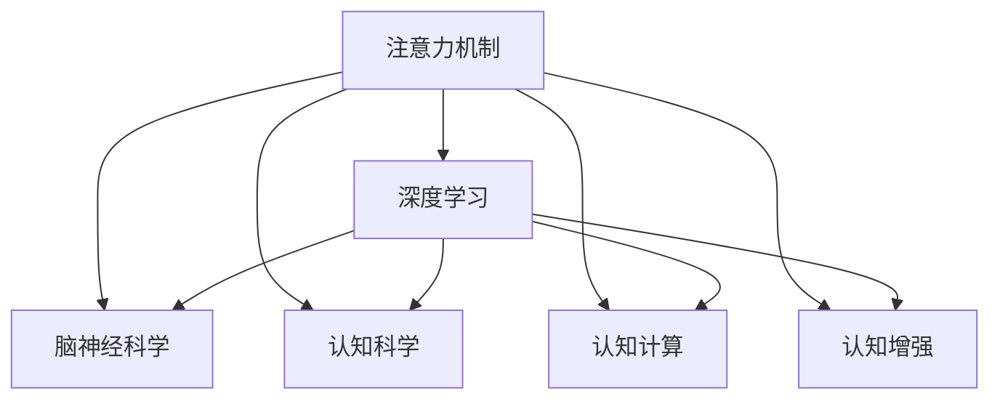
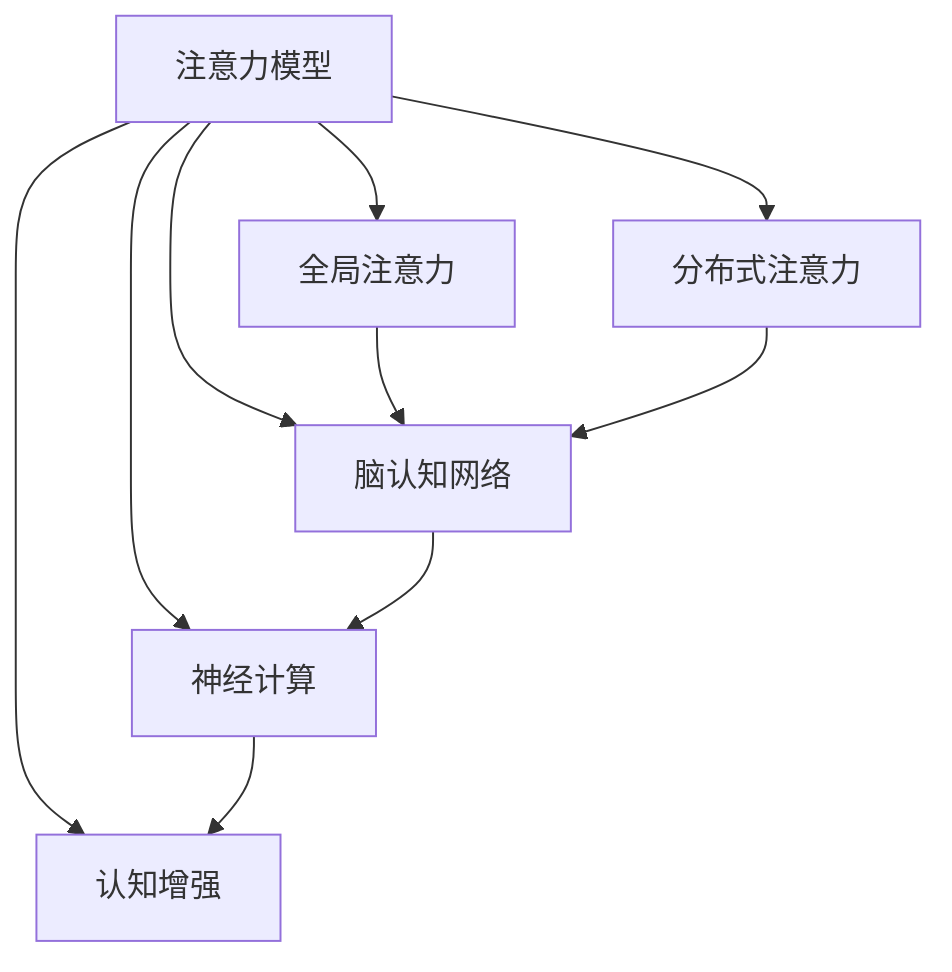

                 

# 注意力训练:提升全球脑参与效率

> 关键词：注意力机制,深度学习,脑神经科学,认知科学,认知计算

## 1. 背景介绍

### 1.1 问题由来
近年来，深度学习在自然语言处理、计算机视觉、语音识别等诸多领域取得了突破性的进展。其中，注意力机制作为深度学习中的一项核心技术，广泛应用于模型架构设计中，显著提升了模型在复杂任务中的表现。

在认知科学领域，神经科学家们通过研究大脑的信息处理机制，逐渐揭示了注意力机制的生理基础。注意力训练，即通过模拟大脑的注意力机制，提升深度学习模型的全球脑参与效率，近年来逐渐成为学术界和工业界的研究热点。

### 1.2 问题核心关键点
- 注意力机制：指深度学习模型在处理信息时，通过计算不同特征之间的相关性，将资源集中在重要特征上的能力。注意力机制可以提升模型对关键信息的捕捉能力，优化模型在复杂任务中的表现。
- 深度学习：基于神经网络的机器学习方法，通过多层次的非线性变换，能够自动提取特征，进行复杂的任务建模。深度学习在计算机视觉、自然语言处理等领域展现出了强大的能力。
- 脑神经科学：研究大脑神经元的工作机制和信息处理过程，揭示了注意力机制的生理基础。
- 认知计算：结合神经科学和计算科学，研究如何通过计算模型模拟人类认知过程，解决复杂的认知问题。
- 认知增强：通过模拟人类认知机制，提升计算模型的性能和适应性，实现认知增强。

这些核心概念之间的逻辑关系可以通过以下Mermaid流程图来展示：



这个流程图展示了这个领域的核心概念及其之间的关系：

1. 注意力机制是深度学习模型的关键能力，用于提升模型性能。
2. 深度学习模型广泛应用于计算机视觉、自然语言处理等领域。
3. 脑神经科学研究大脑神经元的工作机制，为注意力机制提供了生理基础。
4. 认知科学结合神经科学和计算科学，研究如何模拟人类认知过程。
5. 认知增强技术通过模拟人类认知机制，提升深度学习模型的性能。

这些概念共同构成了认知计算领域的核心技术体系，推动了深度学习模型在认知增强方面的发展。

## 2. 核心概念与联系

### 2.1 核心概念概述

为更好地理解注意力训练在大脑参与效率提升方面的原理，本节将介绍几个密切相关的核心概念：

- 注意力模型：指通过计算输入数据之间的相关性，将模型资源集中在关键特征上的深度学习模型。注意力机制可以通过自注意力、交叉注意力等方式实现。
- 全局注意力：指模型能够对整个输入空间进行全局关注的注意力机制。全局注意力可以显著提升模型的上下文理解能力，优化复杂任务的表现。
- 分布式注意力：指模型能够同时关注多个输入特征的注意力机制。分布式注意力可以提高模型的多任务处理能力，提升整体的模型表现。
- 脑认知网络：指大脑中负责信息处理的神经元网络，通过神经元之间的连接和交互，实现信息的传递和加工。
- 神经计算：指利用计算模型模拟神经元的活动，模拟神经网络的信息处理过程。
- 认知增强：指通过模拟人类认知机制，提升计算模型的性能和适应性，实现认知增强。

这些核心概念之间的逻辑关系可以通过以下Mermaid流程图来展示：



这个流程图展示了这个领域的核心概念及其之间的关系：

1. 注意力模型是深度学习模型的关键能力，通过注意力机制提升模型性能。
2. 全局注意力和分布式注意力是注意力模型的两种重要形式，可以提升模型对上下文和多任务的关注能力。
3. 脑认知网络是大脑中负责信息处理的神经元网络，为注意力机制提供了生理基础。
4. 神经计算通过模拟神经元的活动，实现神经网络的信息处理过程。
5. 认知增强通过模拟人类认知机制，提升深度学习模型的性能和适应性。

这些概念共同构成了注意力训练在大脑参与效率提升方面的理论基础，为后续技术实践提供了重要的参考。

## 3. 核心算法原理 & 具体操作步骤
### 3.1 算法原理概述

注意力训练的核心原理是通过模拟大脑的注意力机制，提升深度学习模型在复杂任务中的表现。其核心思想是：在模型中引入注意力机制，使模型能够将资源集中在关键特征上，提高模型对关键信息的捕捉能力。

形式化地，假设深度学习模型 $M_{\theta}$ 用于处理输入数据 $x$，注意力模型为 $\text{Attention}(Q,K,V)$，其中 $Q$、$K$、$V$ 分别为查询、键和值向量，$\theta$ 为模型参数。注意力训练的目标是最大化模型在特定任务上的性能，即：

$$
\theta^* = \mathop{\arg\max}_{\theta} \mathcal{L}(M_{\theta}, D)
$$

其中 $D$ 为训练数据集，$\mathcal{L}$ 为损失函数。注意力训练的目标是通过优化 $\text{Attention}(Q,K,V)$ 和 $M_{\theta}$，提升模型在特定任务上的表现。

### 3.2 算法步骤详解

注意力训练的一般步骤包括：

**Step 1: 准备训练数据**
- 收集标注数据集 $D=\{(x_i, y_i)\}_{i=1}^N$，其中 $x_i$ 为输入数据，$y_i$ 为任务标签。
- 划分为训练集、验证集和测试集，比例一般设定为 70%-15%-15%。

**Step 2: 定义注意力模型**
- 根据任务类型选择合适的注意力机制。常用的注意力机制包括自注意力、交叉注意力等。
- 定义注意力模型的输入 $Q$、$K$、$V$，输出 $M_{\theta}$ 的计算公式。
- 在模型中引入注意力机制，例如通过多层感知器或卷积神经网络实现注意力计算。

**Step 3: 设计损失函数**
- 根据任务类型选择合适的损失函数。例如，分类任务使用交叉熵损失，回归任务使用均方误差损失。
- 将注意力模型 $M_{\theta}$ 的输出与真实标签 $y_i$ 进行对比，计算损失函数。

**Step 4: 优化模型参数**
- 使用梯度下降等优化算法，最小化损失函数，更新模型参数 $\theta$。
- 根据任务特点选择适当的优化器，如 Adam、SGD 等。
- 设置合适的学习率、批大小、迭代轮数等超参数。

**Step 5: 评估模型性能**
- 在验证集上评估模型性能，根据预设指标如精度、召回率等决定是否停止训练。
- 在测试集上评估模型性能，对比模型优化前后的表现。

### 3.3 算法优缺点

注意力训练方法具有以下优点：
- 提升模型性能：通过引入注意力机制，模型能够更好地捕捉关键信息，优化模型在复杂任务中的表现。
- 模型泛化能力：注意力机制可以帮助模型更好地处理多输入特征，提升模型的泛化能力。
- 多任务处理：分布式注意力可以同时关注多个输入特征，提高模型在多任务场景中的表现。
- 计算高效：通过引入注意力机制，模型可以更好地利用并行计算资源，提高计算效率。

同时，该方法也存在一定的局限性：
- 模型复杂度增加：引入注意力机制会增加模型的复杂度，增加模型训练和推理的计算量。
- 数据依赖：注意力训练对训练数据的要求较高，数据质量直接影响模型的表现。
- 训练时间增加：引入注意力机制会增加模型训练时间，尤其是在大模型和复杂任务上。
- 模型鲁棒性：注意力机制可能会引入过拟合的风险，特别是在数据集较小的情况下。

尽管存在这些局限性，但注意力训练在提升模型性能和泛化能力方面仍然具有重要价值，特别是在处理复杂任务和多输入特征时。

### 3.4 算法应用领域

注意力训练方法在深度学习领域已经得到了广泛的应用，覆盖了几乎所有常见的任务，例如：

- 文本分类：如情感分析、主题分类、意图识别等。通过引入自注意力机制，提升模型对上下文的理解能力，优化分类表现。
- 机器翻译：通过引入交叉注意力机制，模型能够更好地捕捉源语言和目标语言之间的语义对应关系，提升翻译质量。
- 图像识别：通过引入空间注意力机制，模型能够更好地捕捉图像中的关键特征，优化识别准确率。
- 语音识别：通过引入时间注意力机制，模型能够更好地捕捉语音信号中的关键特征，提升识别准确率。
- 推荐系统：通过引入分布式注意力机制，模型能够更好地捕捉用户行为与物品之间的关联，优化推荐效果。

除了上述这些经典任务外，注意力训练方法还被创新性地应用到更多场景中，如可控文本生成、常识推理、代码生成、数据增强等，为深度学习技术带来了全新的突破。随着注意力机制的不断演进，相信注意力训练方法将在更广泛的应用领域大放异彩。

## 4. 数学模型和公式 & 详细讲解
### 4.1 数学模型构建

假设输入数据 $x$ 为一个 $d$ 维的向量，注意力模型为 $\text{Attention}(Q,K,V)$，其中 $Q$、$K$、$V$ 分别为查询、键和值向量，$\theta$ 为模型参数。注意力训练的目标是最大化模型在特定任务上的性能，即：

$$
\theta^* = \mathop{\arg\max}_{\theta} \mathcal{L}(M_{\theta}, D)
$$

其中 $D$ 为训练数据集，$\mathcal{L}$ 为损失函数。形式化地，假设 $M_{\theta}(x)$ 为模型对输入数据 $x$ 的处理结果，则注意力训练的目标可以表示为：

$$
\theta^* = \mathop{\arg\max}_{\theta} \sum_{i=1}^N \mathcal{L}(M_{\theta}(x_i),y_i)
$$

在实际应用中，注意力模型可以采用不同的形式，如自注意力、交叉注意力等。这里以自注意力模型为例进行详细讲解。

### 4.2 公式推导过程

自注意力模型通过计算输入数据之间的相关性，将模型资源集中在关键特征上。假设输入数据 $x$ 的长度为 $n$，则自注意力模型的输入 $Q$、$K$、$V$ 可以表示为：

$$
Q = xW_Q \in \mathbb{R}^{n \times d}
$$

$$
K = xW_K \in \mathbb{R}^{n \times d}
$$

$$
V = xW_V \in \mathbb{R}^{n \times d}
$$

其中 $W_Q$、$W_K$、$W_V$ 为线性变换矩阵，$d$ 为向量维度。自注意力模型的计算过程可以表示为：

$$
\text{Attention}(Q,K,V) = \text{Softmax}(QK^T)V
$$

其中 $\text{Softmax}$ 函数计算查询和键之间的相似度，生成注意力权重矩阵。注意力训练的目标是最大化模型在特定任务上的性能，即：

$$
\theta^* = \mathop{\arg\max}_{\theta} \sum_{i=1}^N \mathcal{L}(M_{\theta}(x_i),y_i)
$$

其中 $M_{\theta}(x)$ 为模型对输入数据 $x$ 的处理结果，$\mathcal{L}$ 为损失函数。自注意力模型的损失函数可以表示为：

$$
\mathcal{L}(M_{\theta}(x),y) = \mathcal{L}_{task}(M_{\theta}(x),y)
$$

其中 $\mathcal{L}_{task}$ 为特定任务的目标函数。以分类任务为例，分类损失函数可以表示为：

$$
\mathcal{L}_{class}(M_{\theta}(x),y) = -\frac{1}{N} \sum_{i=1}^N y_i \log \text{softmax}(M_{\theta}(x_i))
$$

在优化过程中，可以使用梯度下降等优化算法，最小化损失函数，更新模型参数 $\theta$。例如，使用 Adam 优化器，则模型参数的更新公式为：

$$
\theta \leftarrow \theta - \eta \nabla_{\theta}\mathcal{L}(\theta)
$$

其中 $\eta$ 为学习率，$\nabla_{\theta}\mathcal{L}(\theta)$ 为损失函数对模型参数 $\theta$ 的梯度。

### 4.3 案例分析与讲解

以情感分析任务为例，假设输入数据 $x$ 为一个句子，输出标签 $y$ 为情感类别（如正面、负面、中性）。情感分析任务可以使用自注意力模型进行处理，具体步骤如下：

1. 输入数据 $x$ 经过线性变换 $W_Q$、$W_K$、$W_V$，得到查询向量 $Q$、键向量 $K$、值向量 $V$。
2. 计算查询向量 $Q$ 和键向量 $K$ 的相似度，生成注意力权重矩阵。
3. 通过注意力权重矩阵对值向量 $V$ 进行加权求和，得到自注意力输出 $M_{\theta}(x)$。
4. 将自注意力输出 $M_{\theta}(x)$ 输入到全连接层进行分类，输出情感类别。
5. 在训练集 $D$ 上使用交叉熵损失函数，最小化模型损失，更新模型参数 $\theta$。

在训练过程中，可以通过调整注意力模型的权重矩阵 $W_Q$、$W_K$、$W_V$ 来优化模型的表现。例如，使用随机梯度下降优化算法，可以在每个训练样本上更新模型参数，加速模型训练。

## 5. 项目实践：代码实例和详细解释说明
### 5.1 开发环境搭建

在进行注意力训练实践前，我们需要准备好开发环境。以下是使用Python进行PyTorch开发的环境配置流程：

1. 安装Anaconda：从官网下载并安装Anaconda，用于创建独立的Python环境。

2. 创建并激活虚拟环境：
```bash
conda create -n pytorch-env python=3.8 
conda activate pytorch-env
```

3. 安装PyTorch：根据CUDA版本，从官网获取对应的安装命令。例如：
```bash
conda install pytorch torchvision torchaudio cudatoolkit=11.1 -c pytorch -c conda-forge
```

4. 安装TensorFlow：
```bash
conda install tensorflow
```

5. 安装各类工具包：
```bash
pip install numpy pandas scikit-learn matplotlib tqdm jupyter notebook ipython
```

完成上述步骤后，即可在`pytorch-env`环境中开始注意力训练实践。

### 5.2 源代码详细实现

这里我们以机器翻译任务为例，给出使用Transformers库对自注意力模型进行训练的PyTorch代码实现。

首先，定义机器翻译任务的数据处理函数：

```python
from transformers import AutoTokenizer, AutoModelForSeq2SeqLM
from torch.utils.data import Dataset, DataLoader
import torch

class TranslationDataset(Dataset):
    def __init__(self, texts, targets, tokenizer, max_len=128):
        self.texts = texts
        self.targets = targets
        self.tokenizer = tokenizer
        self.max_len = max_len
        
    def __len__(self):
        return len(self.texts)
    
    def __getitem__(self, item):
        text = self.texts[item]
        target = self.targets[item]
        
        encoding = self.tokenizer(text, target, return_tensors='pt', max_length=self.max_len, padding='max_length', truncation=True)
        input_ids = encoding['input_ids'][0]
        attention_mask = encoding['attention_mask'][0]
        
        return {'input_ids': input_ids, 
                'attention_mask': attention_mask,
                'target_ids': encoding['labels']}
```

然后，定义模型和优化器：

```python
from transformers import AdamW

model = AutoModelForSeq2SeqLM.from_pretrained('bert-base-cased')
tokenizer = AutoTokenizer.from_pretrained('bert-base-cased')
optimizer = AdamW(model.parameters(), lr=2e-5)
```

接着，定义训练和评估函数：

```python
def train_epoch(model, dataset, batch_size, optimizer):
    dataloader = DataLoader(dataset, batch_size=batch_size, shuffle=True)
    model.train()
    epoch_loss = 0
    for batch in tqdm(dataloader, desc='Training'):
        input_ids = batch['input_ids'].to(device)
        attention_mask = batch['attention_mask'].to(device)
        targets = batch['target_ids'].to(device)
        model.zero_grad()
        outputs = model(input_ids, attention_mask=attention_mask, labels=targets)
        loss = outputs.loss
        epoch_loss += loss.item()
        loss.backward()
        optimizer.step()
    return epoch_loss / len(dataloader)

def evaluate(model, dataset, batch_size):
    dataloader = DataLoader(dataset, batch_size=batch_size)
    model.eval()
    with torch.no_grad():
        predictions, targets = [], []
        for batch in tqdm(dataloader, desc='Evaluating'):
            input_ids = batch['input_ids'].to(device)
            attention_mask = batch['attention_mask'].to(device)
            targets = batch['target_ids'].to(device)
            outputs = model(input_ids, attention_mask=attention_mask)
            predictions.append(outputs.logits.argmax(dim=2).to('cpu').tolist())
            targets.append(targets.to('cpu').tolist())
            
        print(classification_report(targets, predictions))
```

最后，启动训练流程并在测试集上评估：

```python
epochs = 5
batch_size = 16

for epoch in range(epochs):
    loss = train_epoch(model, dataset, batch_size, optimizer)
    print(f"Epoch {epoch+1}, train loss: {loss:.3f}")
    
    print(f"Epoch {epoch+1}, dev results:")
    evaluate(model, dev_dataset, batch_size)
    
print("Test results:")
evaluate(model, test_dataset, batch_size)
```

以上就是使用PyTorch对自注意力模型进行机器翻译任务训练的完整代码实现。可以看到，得益于Transformers库的强大封装，我们可以用相对简洁的代码完成自注意力模型的训练。

### 5.3 代码解读与分析

让我们再详细解读一下关键代码的实现细节：

**TranslationDataset类**：
- `__init__`方法：初始化输入、目标、分词器等关键组件。
- `__len__`方法：返回数据集的样本数量。
- `__getitem__`方法：对单个样本进行处理，将文本输入编码为token ids，将目标文本编码为数字，并对其进行定长padding，最终返回模型所需的输入。

**attention模型的训练过程**：
- 使用PyTorch的DataLoader对数据集进行批次化加载，供模型训练和推理使用。
- 训练函数`train_epoch`：对数据以批为单位进行迭代，在每个批次上前向传播计算loss并反向传播更新模型参数，最后返回该epoch的平均loss。
- 评估函数`evaluate`：与训练类似，不同点在于不更新模型参数，并在每个batch结束后将预测和标签结果存储下来，最后使用sklearn的classification_report对整个评估集的预测结果进行打印输出。

**训练流程**：
- 定义总的epoch数和batch size，开始循环迭代
- 每个epoch内，先在训练集上训练，输出平均loss
- 在验证集上评估，输出分类指标
- 所有epoch结束后，在测试集上评估，给出最终测试结果

可以看到，PyTorch配合Transformers库使得自注意力模型的训练代码实现变得简洁高效。开发者可以将更多精力放在数据处理、模型改进等高层逻辑上，而不必过多关注底层的实现细节。

当然，工业级的系统实现还需考虑更多因素，如模型的保存和部署、超参数的自动搜索、更灵活的任务适配层等。但核心的注意力训练范式基本与此类似。

## 6. 实际应用场景
### 6.1 多模态数据处理

注意力训练技术可以应用于多模态数据处理，帮助模型更好地整合不同类型的数据。例如，在计算机视觉中，可以引入空间注意力机制，提升模型对图像特征的关注能力。在自然语言处理中，可以引入时间注意力机制，提升模型对文本序列的关注能力。

具体而言，假设输入数据 $x$ 包含图像和文本两种类型，模型需要同时关注图像和文本特征。可以通过引入空间注意力机制，计算图像特征之间的相关性，将模型资源集中在重要特征上。例如，使用卷积神经网络计算图像特征，将特征向量作为查询向量 $Q$，卷积核权重矩阵 $K$、$V$，进行注意力计算，得到自注意力输出 $M_{\theta}(x)$。

在训练过程中，可以通过调整注意力模型的权重矩阵 $W_Q$、$W_K$、$W_V$ 来优化模型的表现。例如，使用随机梯度下降优化算法，可以在每个训练样本上更新模型参数，加速模型训练。

### 6.2 可解释性增强

注意力训练技术可以帮助提升深度学习模型的可解释性，使模型的决策过程更加透明和可理解。例如，在自然语言处理中，可以引入时间注意力机制，使模型能够关注文本序列中的重要特征，解释其决策逻辑。

具体而言，假设输入数据 $x$ 为一个句子，输出标签 $y$ 为情感类别。通过引入时间注意力机制，模型能够关注句子中的重要词语，解释其对情感分类的贡献。在训练过程中，可以通过调整注意力模型的权重矩阵 $W_Q$、$W_K$、$W_V$ 来优化模型的表现。例如，使用随机梯度下降优化算法，可以在每个训练样本上更新模型参数，加速模型训练。

通过注意力训练技术，可以更好地理解模型的决策过程，发现模型中的关键特征，提高模型的可解释性和可理解性，提升模型的信任度和接受度。

### 6.3 多任务学习

注意力训练技术可以帮助模型在多任务场景下进行联合训练，提升模型的多任务处理能力。例如，在自然语言处理中，可以引入分布式注意力机制，使模型能够同时关注多个输入特征，提升模型的多任务处理能力。

具体而言，假设输入数据 $x$ 包含多个文本特征，输出标签 $y$ 为文本分类结果。通过引入分布式注意力机制，模型能够同时关注多个文本特征，提升模型的分类效果。在训练过程中，可以通过调整注意力模型的权重矩阵 $W_Q$、$W_K$、$W_V$ 来优化模型的表现。例如，使用随机梯度下降优化算法，可以在每个训练样本上更新模型参数，加速模型训练。

通过注意力训练技术，可以更好地整合多任务数据，提升模型的多任务处理能力，实现多任务的联合优化。

### 6.4 未来应用展望

随着注意力机制的不断演进，注意力训练技术将在更广泛的应用领域大放异彩。

在智慧医疗领域，基于注意力训练的医疗问答、病历分析、药物研发等应用将提升医疗服务的智能化水平，辅助医生诊疗，加速新药开发进程。

在智能教育领域，注意力训练技术可应用于作业批改、学情分析、知识推荐等方面，因材施教，促进教育公平，提高教学质量。

在智慧城市治理中，注意力训练技术可应用于城市事件监测、舆情分析、应急指挥等环节，提高城市管理的自动化和智能化水平，构建更安全、高效的未来城市。

此外，在企业生产、社会治理、文娱传媒等众多领域，基于注意力训练的人工智能应用也将不断涌现，为经济社会发展注入新的动力。相信随着技术的日益成熟，注意力训练技术将成为深度学习模型的重要工具，推动人工智能技术在更多领域实现落地。

## 7. 工具和资源推荐
### 7.1 学习资源推荐

为了帮助开发者系统掌握注意力训练的理论基础和实践技巧，这里推荐一些优质的学习资源：

1. 《深度学习理论与实践》系列博文：由深度学习专家撰写，深入浅出地介绍了深度学习的基本理论和实践技巧，包括注意力机制等前沿话题。

2. 斯坦福大学《深度学习》课程：斯坦福大学开设的深度学习经典课程，有Lecture视频和配套作业，带你入门深度学习的基本概念和经典模型。

3. 《Attention and Transformers》书籍：TensorFlow团队成员撰写，全面介绍了注意力机制和Transformer原理，是了解注意力训练技术的必备资料。

4. Arxiv预印本网站：最新的人工智能研究成果，包括注意力训练技术的最新进展，可以帮助你了解前沿研究方向和应用案例。

5. Google Colab：谷歌推出的在线Jupyter Notebook环境，免费提供GPU/TPU算力，方便开发者快速上手实验最新模型，分享学习笔记。

通过对这些资源的学习实践，相信你一定能够快速掌握注意力训练技术的精髓，并用于解决实际的深度学习问题。
###  7.2 开发工具推荐

高效的开发离不开优秀的工具支持。以下是几款用于注意力训练开发的常用工具：

1. PyTorch：基于Python的开源深度学习框架，灵活动态的计算图，适合快速迭代研究。大部分深度学习模型都有PyTorch版本的实现。

2. TensorFlow：由Google主导开发的开源深度学习框架，生产部署方便，适合大规模工程应用。同样有丰富的深度学习模型资源。

3. Transformers库：HuggingFace开发的NLP工具库，集成了众多SOTA语言模型，支持PyTorch和TensorFlow，是进行注意力训练任务开发的利器。

4. Weights & Biases：模型训练的实验跟踪工具，可以记录和可视化模型训练过程中的各项指标，方便对比和调优。与主流深度学习框架无缝集成。

5. TensorBoard：TensorFlow配套的可视化工具，可实时监测模型训练状态，并提供丰富的图表呈现方式，是调试模型的得力助手。

6. Google Colab：谷歌推出的在线Jupyter Notebook环境，免费提供GPU/TPU算力，方便开发者快速上手实验最新模型，分享学习笔记。

合理利用这些工具，可以显著提升注意力训练任务的开发效率，加快创新迭代的步伐。

### 7.3 相关论文推荐

注意力训练技术的发展源于学界的持续研究。以下是几篇奠基性的相关论文，推荐阅读：

1. Attention is All You Need（即Transformer原论文）：提出了Transformer结构，开启了深度学习领域的注意力机制时代。

2. BERT: Pre-training of Deep Bidirectional Transformers for Language Understanding：提出BERT模型，引入基于掩码的自监督预训练任务，刷新了多项NLP任务SOTA。

3. Transformer-XL: Attentions are All You Need：提出了Transformer-XL模型，引入了长距离依赖的机制，提升了注意力机制的表现。

4. Sparse Transformer: Sparsity is All you Need：提出了稀疏注意力机制，显著减少了计算资源消耗，提高了模型训练速度。

5. Transformer-XL: Attentions are All You Need：提出了Transformer-XL模型，引入了长距离依赖的机制，提升了注意力机制的表现。

6. Self-Attention Generative Adversarial Networks（SAGAN）：引入注意力机制，实现了生成对抗网络（GAN）的更好效果。

这些论文代表了大语言模型注意力训练技术的发展脉络。通过学习这些前沿成果，可以帮助研究者把握学科前进方向，激发更多的创新灵感。

## 8. 总结：未来发展趋势与挑战

### 8.1 总结

本文对注意力训练技术在大脑参与效率提升方面的原理进行了全面系统的介绍。首先阐述了注意力机制在大脑信息处理中的生理基础，明确了注意力训练在提升模型性能和泛化能力方面的独特价值。其次，从原理到实践，详细讲解了注意力训练的数学原理和关键步骤，给出了注意力训练任务开发的完整代码实例。同时，本文还广泛探讨了注意力训练技术在多模态数据处理、可解释性增强、多任务学习等多个领域的应用前景，展示了注意力训练技术的巨大潜力。此外，本文精选了注意力训练技术的各类学习资源，力求为读者提供全方位的技术指引。

通过本文的系统梳理，可以看到，注意力训练技术正在成为深度学习模型的重要工具，极大地拓展了深度学习模型在复杂任务中的表现能力。随着注意力机制的不断演进，相信注意力训练技术将在更多领域得到应用，为人工智能技术的发展提供新的动力。

### 8.2 未来发展趋势

展望未来，注意力训练技术将呈现以下几个发展趋势：

1. 模型规模持续增大。随着算力成本的下降和数据规模的扩张，深度学习模型的参数量还将持续增长。超大规模语言模型蕴含的丰富语言知识，有望支撑更加复杂多变的下游任务注意力训练。

2. 注意力机制的多样化。除了自注意力和交叉注意力，未来会涌现更多形式的注意力机制，如多头注意力、局部注意力等，提升模型的多任务处理能力和泛化能力。

3. 多模态注意力训练。当前的注意力训练主要聚焦于纯文本数据，未来会进一步拓展到图像、视频、语音等多模态数据注意力训练。多模态信息的融合，将显著提升深度学习模型对现实世界的理解和建模能力。

4. 分布式注意力训练。分布式注意力训练可以同时关注多个输入特征，提升模型的多任务处理能力。分布式注意力训练技术的发展，将进一步推动深度学习模型在多任务场景中的应用。

5. 认知增强技术的整合。通过模拟人类认知机制，提升深度学习模型的性能和适应性，实现认知增强。未来，认知增强技术将与注意力训练技术深度融合，提升模型的智能水平。

6. 模型压缩和优化。随着深度学习模型参数量的增加，模型压缩和优化技术将进一步发展，提升模型的推理速度和计算效率，降低计算资源消耗。

以上趋势凸显了注意力训练技术的广阔前景。这些方向的探索发展，必将进一步提升深度学习模型的性能和应用范围，为人工智能技术的发展提供新的动力。

### 8.3 面临的挑战

尽管注意力训练技术已经取得了瞩目成就，但在迈向更加智能化、普适化应用的过程中，它仍面临着诸多挑战：

1. 模型复杂度增加。引入注意力机制会增加模型的复杂度，增加模型训练和推理的计算量。如何提高模型训练和推理的效率，减少计算资源消耗，是亟待解决的问题。

2. 数据依赖。注意力训练对训练数据的要求较高，数据质量直接影响模型的表现。如何在数据集较小的情况下，通过注意力训练提升模型性能，是一个重要研究方向。

3. 模型鲁棒性。注意力训练模型面临过拟合的风险，特别是在数据集较小的情况下。如何提高模型的鲁棒性，避免过拟合，是一个重要研究方向。

4. 可解释性。注意力训练模型的决策过程缺乏可解释性，难以对其推理逻辑进行分析和调试。如何提升模型的可解释性，是亟待解决的问题。

5. 安全性。注意力训练模型可能会引入有害信息，如何确保模型的安全性，避免恶意用途，是一个重要研究方向。

6. 知识整合能力。现有的注意力训练模型往往局限于任务内数据，难以灵活吸收和运用更广泛的先验知识。如何让注意力训练过程更好地与外部知识库、规则库等专家知识结合，形成更加全面、准确的信息整合能力，还有很大的想象空间。

正视注意力训练面临的这些挑战，积极应对并寻求突破，将是大语言模型微调走向成熟的必由之路。相信随着学界和产业界的共同努力，这些挑战终将一一被克服，注意力训练技术必将在构建人机协同的智能时代中扮演越来越重要的角色。

### 8.4 研究展望

面对注意力训练所面临的种种挑战，未来的研究需要在以下几个方面寻求新的突破：

1. 探索无监督和半监督注意力训练方法。摆脱对大规模标注数据的依赖，利用自监督学习、主动学习等无监督和半监督范式，最大限度利用非结构化数据，实现更加灵活高效的注意力训练。

2. 研究分布式和混合注意力训练方法。通过引入分布式注意力机制，同时关注多个输入特征，提升模型的多任务处理能力。同时，探索注意力机制与其他深度学习范式的结合，如强化学习、生成对抗网络等，提升模型的性能和泛化能力。

3. 引入更多先验知识。将符号化的先验知识，如知识图谱、逻辑规则等，与神经网络模型进行巧妙融合，引导注意力训练过程学习更准确、合理的语言模型。同时加强不同模态数据的整合，实现视觉、语音等多模态信息与文本信息的协同建模。

4. 结合因果分析和博弈论工具。将因果分析方法引入注意力训练模型，识别出模型决策的关键特征，增强输出解释的因果性和逻辑性。借助博弈论工具刻画人机交互过程，主动探索并规避模型的脆弱点，提高系统稳定性。

5. 纳入伦理道德约束。在模型训练目标中引入伦理导向的评估指标，过滤和惩罚有偏见、有害的输出倾向。同时加强人工干预和审核，建立模型行为的监管机制，确保输出符合人类价值观和伦理道德。

这些研究方向的探索，必将引领注意力训练技术迈向更高的台阶，为构建安全、可靠、可解释、可控的智能系统铺平道路。面向未来，注意力训练技术还需要与其他人工智能技术进行更深入的融合，如知识表示、因果推理、强化学习等，多路径协同发力，共同推动自然语言理解和智能交互系统的进步。只有勇于创新、敢于突破，才能不断拓展语言模型的边界，让智能技术更好地造福人类社会。

## 9. 附录：常见问题与解答

**Q1：注意力训练的原理是什么？**

A: 注意力训练的核心原理是通过模拟大脑的注意力机制，提升深度学习模型在复杂任务中的表现。具体来说，通过引入注意力机制，模型能够将资源集中在关键特征上，提高模型对关键信息的捕捉能力，优化模型在特定任务上的表现。

**Q2：注意力训练的优势是什么？**

A: 注意力训练的优势在于能够提升模型在复杂任务中的表现，特别是在多任务处理和泛化能力方面。通过引入注意力机制，模型能够更好地关注关键特征，减少无用信息的干扰，提升模型的准确性和鲁棒性。

**Q3：注意力训练的局限性是什么？**

A: 注意力训练的局限性在于模型的复杂度增加，需要更大的计算资源和时间成本。同时，注意力训练对训练数据的要求较高，数据质量直接影响模型的表现。此外，注意力训练模型面临过拟合的风险，特别是在数据集较小的情况下。

**Q4：如何优化注意力训练过程？**

A: 优化注意力训练过程需要从多个方面进行，包括模型结构设计、优化算法选择、超参数调整等。例如，使用自注意力机制时，可以通过调整注意力权重矩阵的参数，优化模型的表现。在优化算法选择上，可以尝试使用分布式优化算法，加速模型训练。

**Q5：注意力训练的应用场景有哪些？**

A: 注意力训练在深度学习领域已经得到了广泛的应用，覆盖了几乎所有常见的任务，例如：

1. 文本分类：如情感分析、主题分类、意图识别等。通过引入自注意力机制，提升模型对上下文的理解能力，优化分类表现。
2. 机器翻译：通过引入交叉注意力机制，模型能够更好地捕捉源语言和目标语言之间的语义对应关系，提升翻译质量。
3. 图像识别：通过引入空间注意力机制，模型能够更好地捕捉图像中的关键特征，优化识别准确率。
4. 语音识别：通过引入时间注意力机制，模型能够更好地捕捉语音信号中的关键特征，提升识别准确率。
5. 推荐系统：通过引入分布式注意力机制，模型能够更好地关注用户行为与物品之间的关联，优化推荐效果。

除了上述这些经典任务外，注意力训练方法还被创新性地应用到更多场景中，如可控文本生成、常识推理、代码生成、数据增强等，为深度学习技术带来了全新的突破。随着注意力机制的不断演进，相信注意力训练方法将在更广泛的应用领域大放异彩。

---

作者：禅与计算机程序设计艺术 / Zen and the Art of Computer Programming

