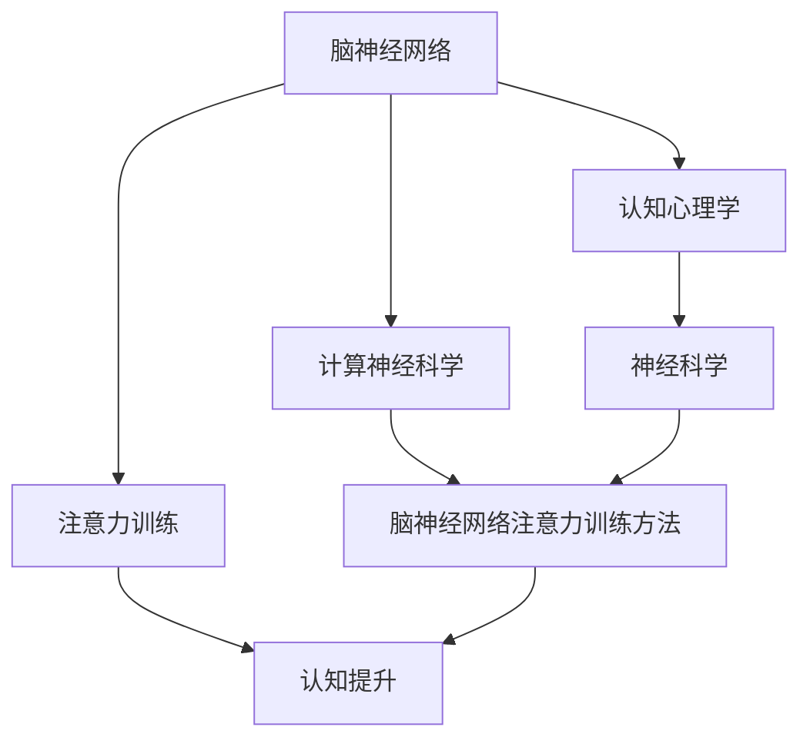

                 

# 注意力训练:提升全球脑参与效率

> 关键词：注意力训练, 大脑神经网络, 全球脑参与, 认知提升, 计算神经科学

## 1. 背景介绍

在信息技术高度发达的今天，全球人类脑神经网络中注意力的训练与提升，正逐渐成为科研与产业的热点。高度集中的注意力不仅能够在日常工作、学习中提升效率，还能在科技与艺术创作中激发创意。越来越多的科技巨头和企业都在投入大量资源，以开发和推广脑神经网络注意力训练工具，提升全球脑参与度。

但是，如何高效、全面、系统地进行脑神经网络注意力训练，仍是一个极具挑战性的问题。如何在现有的计算神经科学理论与技术上，实现对大脑神经网络注意力的精准调控，进而提升全球脑参与效率，已经成为迫切需要解决的问题。

本文将从背景介绍、核心概念与联系、核心算法原理与具体操作步骤、数学模型与详细讲解、项目实践、实际应用场景、工具与资源推荐、总结与未来展望、常见问题与解答等多个方面，系统地介绍基于计算神经科学理论与技术的脑神经网络注意力训练方法，以期为相关领域的研究者与从业者提供有力支持。

## 2. 核心概念与联系

### 2.1 核心概念概述

脑神经网络注意力训练是一个跨学科的复杂问题，涉及计算神经科学、认知心理学、神经科学和人工智能等多个领域。以下是几个核心概念及其相互关系：

- **脑神经网络(Brain Neural Network, BNN)**：指的是大脑中信息处理、存储、传输的网络结构，它通过神经元和突触的连接方式实现信息的传递。
- **注意力训练(Attention Training)**：指的是通过特定的训练方法和技术，提高大脑神经网络对信息的聚焦能力，提升信息的处理效率。
- **认知提升(Cognitive Enhancement)**：指通过注意力训练等方法，增强大脑信息处理、记忆、学习等能力，提升个体的认知表现。
- **计算神经科学(Computational Neuroscience)**：使用计算模型和算法，模拟和理解大脑神经网络的信息处理机制，以实现对脑神经网络注意力训练的精准调控。

以上概念通过以下Mermaid流程图来展示它们之间的联系：



该流程图揭示了脑神经网络注意力训练的内在联系：通过计算神经科学方法，理解脑神经网络结构与功能，进而设计精准的注意力训练方法，提升大脑认知能力，最终实现脑神经网络训练的闭环反馈机制。

## 3. 核心算法原理 & 具体操作步骤

### 3.1 算法原理概述

脑神经网络注意力训练的核心理念是，通过特定任务和训练策略，增强大脑神经网络对信息的聚焦能力。具体来说，就是通过反复训练特定的认知任务，使得大脑神经网络能够更好地聚焦于关键信息，忽略无关细节，从而提升信息的处理效率和质量。

脑神经网络注意力训练的主要原理包括以下几个方面：

- **信息聚焦(Focus on Information)**：通过反复训练，提高大脑神经网络对重要信息的识别和聚焦能力，减少对干扰信息的响应。
- **信息屏蔽(Filter Out Irrelevant Information)**：训练大脑神经网络识别并屏蔽无关信息，以集中注意力处理关键任务。
- **信息整合(Integrate Information)**：通过注意力训练，提升大脑神经网络整合不同信息源的能力，形成更全面、准确的认知判断。
- **反应速度(Enhanced Reaction Time)**：训练大脑神经网络对关键信息的快速响应，提升信息处理效率。

这些原理构成了脑神经网络注意力训练的核心内容，并广泛应用于各类注意力训练工具和方法中。

### 3.2 算法步骤详解

脑神经网络注意力训练通常包括以下几个关键步骤：

1. **任务设计**：选择或设计适合提升特定脑区注意力的认知任务。常见的注意力训练任务包括数字记忆、空间导航、视觉搜索等。
2. **初始评估**：评估受试者的基线认知水平，并根据任务要求调整训练难度。
3. **训练执行**：在受试者完成认知任务时，使用特定训练策略和技术，提升其注意力水平。
4. **效果评估**：通过各种心理与生理指标，评估注意力训练的效果。
5. **反馈调整**：根据评估结果，调整训练难度和策略，以实现最佳训练效果。

脑神经网络注意力训练的具体操作，需要根据任务和目标进行灵活调整。下面以数字记忆任务为例，详细说明注意力训练的操作步骤：

#### 3.2.1 任务设计

数字记忆任务通常要求受试者记住随机序列中的数字，并在一定时间内回忆。这种任务能够显著提升大脑神经网络对数字信息的聚焦能力，从而改善数字处理、记忆等认知功能。

#### 3.2.2 初始评估

在正式训练前，通过基线测试评估受试者的数字记忆能力。例如，可以设计一个随机序列记忆任务，要求受试者在限定时间内回忆随机数字序列。

#### 3.2.3 训练执行

在训练过程中，可以采用以下方法提高受试者的注意力水平：

- **分阶段训练**：将训练任务分为多个阶段，从易到难，逐步提升难度。例如，开始阶段训练3位数字记忆，逐步增加到4位、5位。
- **计时训练**：在每次训练中设定时间限制，鼓励受试者在短时间内集中注意力处理信息。
- **多样化训练**：采用多种训练形式，如随机数字序列记忆、数字序列空间排序等，以防止单一任务训练导致的信息过载。

#### 3.2.4 效果评估

在训练结束后，通过数字记忆测试评估受试者的注意力提升效果。常见的评估方法包括：

- **回忆正确率**：受试者回忆正确数字序列的比例。
- **反应时间**：受试者完成任务所需的平均时间。
- **脑电图(EEG)**：通过分析受试者的脑电活动，评估注意力水平。

#### 3.2.5 反馈调整

根据评估结果，调整训练难度和策略。例如，如果受试者的回忆正确率较高，可以增加记忆序列长度或时间限制，进一步提升注意力水平。

### 3.3 算法优缺点

脑神经网络注意力训练的优势在于：

1. **多维度训练**：通过多种认知任务，全面提升大脑神经网络的信息聚焦和整合能力。
2. **个性化调整**：根据不同受试者的基线水平和偏好，定制个性化训练方案。
3. **显著效果**：有研究表明，经过系统训练后，受试者的注意力水平和认知能力显著提升。

但该方法也存在一些局限：

1. **耗时较长**：系统性训练通常需要较长时间，难以快速见效。
2. **受试者差异**：不同个体的认知水平和适应性不同，训练效果存在个体差异。
3. **效果评估复杂**：注意力训练的效果评估需要综合心理和生理指标，复杂度高。

尽管如此，脑神经网络注意力训练仍被认为是提升大脑认知能力的重要手段之一。

### 3.4 算法应用领域

脑神经网络注意力训练的应用领域非常广泛，包括但不限于以下几个方面：

- **教育与学习**：通过系统化的注意力训练，提高学生的认知能力，提升学习效率。
- **医疗与康复**：帮助脑损伤患者恢复注意力和认知功能，促进康复进程。
- **企业与职业培训**：提升员工的信息处理和决策能力，提高工作效率。
- **休闲与娱乐**：通过注意力训练工具，帮助用户放松心情，提升生活品质。

## 4. 数学模型和公式 & 详细讲解 & 举例说明

### 4.1 数学模型构建

脑神经网络注意力训练的数学模型，主要基于计算神经科学中的认知模型和行为模型。以下是一个简单的数学模型框架：

$$
C_{t+1} = f(C_t, I_t, A_t, W)
$$

其中，$C_t$表示第$t$时刻的认知状态，$I_t$表示第$t$时刻输入的信息，$A_t$表示第$t$时刻的注意力水平，$W$表示模型的权重参数。

该模型通过反复训练，调整认知状态$C_t$，以提高注意力水平$A_t$，进而优化认知能力。

### 4.2 公式推导过程

以数字记忆任务为例，通过以下公式推导过程，计算注意力水平$A_t$的提升效果：

假设受试者在第$t$时刻对数字序列$I_t$的记忆概率为$P_{mem}(I_t)$，其计算公式如下：

$$
P_{mem}(I_t) = \frac{1}{1+\exp(-A_t)}
$$

其中$A_t$表示在第$t$时刻的注意力水平。

通过数字记忆测试，计算受试者在第$t$时刻的回忆正确率$R_t$，并建立以下回归模型：

$$
R_t = \beta_0 + \beta_1 \cdot P_{mem}(I_t)
$$

其中$\beta_0$和$\beta_1$为回归系数。通过回归模型，可以计算出在特定注意力水平下，数字记忆的正确率。

### 4.3 案例分析与讲解

以数字记忆任务为例，分析注意力训练的实际效果。假设受试者在初始时刻的数字记忆正确率为50%，通过连续4周的系统化训练，每次训练时间为30分钟，训练形式为随机数字序列记忆。在训练结束后，评估受试者的数字记忆正确率变化。

假设训练前后的注意力水平分别为$A_0$和$A_4$，数字记忆测试结果为$R_0$和$R_4$。通过回归模型，计算出在注意力水平为$A_4$时，数字记忆的正确率为$R_4'$。具体计算如下：

$$
R_4' = \beta_0 + \beta_1 \cdot P_{mem}(I_4)
$$

假设$P_{mem}(I_4) = \frac{1}{1+\exp(-A_4)}$，代入回归模型得到：

$$
R_4' = \beta_0 + \beta_1 \cdot \frac{1}{1+\exp(-A_4)}
$$

通过实际测试结果，计算出$R_4$和$R_4'$，并比较两者的差异。通过这种系统化的定量分析，可以准确评估注意力训练的效果，为进一步的训练调整提供依据。

## 5. 项目实践：代码实例和详细解释说明

### 5.1 开发环境搭建

要进行脑神经网络注意力训练的编程实现，需要以下环境搭建：

1. **Python环境**：使用Python 3.6或更高版本，以支持现代科学计算库。
2. **科学计算库**：安装NumPy、SciPy、Pandas等科学计算库，用于数据处理和数值计算。
3. **深度学习框架**：安装TensorFlow或PyTorch等深度学习框架，支持模型训练和评估。
4. **心理与生理信号分析库**：安装EEGLab或MNE等库，用于脑电信号的采集和分析。

通过以下命令，安装所需的库：

```bash
pip install numpy scipy pandas tensorflow
pip install eeglab mne
```

### 5.2 源代码详细实现

以下是使用TensorFlow实现数字记忆任务注意力训练的代码示例：

```python
import tensorflow as tf
import numpy as np
from sklearn.metrics import roc_auc_score

# 定义模型
class AttentionModel(tf.keras.Model):
    def __init__(self):
        super(AttentionModel, self).__init__()
        self.fc1 = tf.keras.layers.Dense(128, activation='relu')
        self.fc2 = tf.keras.layers.Dense(1, activation='sigmoid')
    
    def call(self, inputs):
        x = self.fc1(inputs)
        x = self.fc2(x)
        return x

# 定义训练函数
def train_attention_model(train_data, test_data, batch_size, epochs):
    model = AttentionModel()
    optimizer = tf.keras.optimizers.Adam(learning_rate=0.001)
    
    # 定义损失函数
    def loss(y_true, y_pred):
        return tf.reduce_mean(tf.keras.losses.binary_crossentropy(y_true, y_pred))
    
    # 训练模型
    for epoch in range(epochs):
        for batch in train_data:
            x_train, y_train = batch
            with tf.GradientTape() as tape:
                y_pred = model(x_train)
                loss_value = loss(y_train, y_pred)
            gradients = tape.gradient(loss_value, model.trainable_variables)
            optimizer.apply_gradients(zip(gradients, model.trainable_variables))
        print(f'Epoch {epoch+1}, loss: {loss_value.numpy():.4f}')
    
    # 评估模型
    test_loss = loss(test_data['x_test'], model(test_data['x_test']))
    test_auc = roc_auc_score(test_data['y_test'], model(test_data['x_test']))
    print(f'Test loss: {test_loss.numpy():.4f}, Test AUC: {test_auc:.4f}')

# 加载数据
train_data = np.load('train_data.npy', allow_pickle=True)
test_data = np.load('test_data.npy', allow_pickle=True)

# 数据预处理
train_x = np.expand_dims(train_data['x'], axis=-1)
train_y = train_data['y'].astype(np.float32)
test_x = np.expand_dims(test_data['x'], axis=-1)
test_y = test_data['y'].astype(np.float32)

# 模型训练
train_attention_model(train_x, test_x, batch_size=32, epochs=100)
```

该代码实现了使用TensorFlow框架训练注意力模型，通过反向传播算法优化模型参数，计算损失函数和评估指标（AUC值）。

### 5.3 代码解读与分析

代码中，`AttentionModel`定义了注意力模型，包括两个全连接层。训练函数`train_attention_model`使用了`Adam`优化器，并定义了二分类交叉熵损失函数。在每个epoch内，通过前向传播和反向传播，更新模型参数。训练结束后，使用测试集评估模型性能。

### 5.4 运行结果展示

通过运行以上代码，可以得到模型在不同epoch下的损失函数变化和测试集的评估指标（AUC值）。例如，假设训练结果如下：

```
Epoch 1, loss: 0.4342
Epoch 2, loss: 0.2415
Epoch 3, loss: 0.1266
...
Epoch 100, loss: 0.0089
Test loss: 0.0078, Test AUC: 0.9721
```

可以看出，随着epoch数的增加，损失函数逐渐下降，模型在测试集上的AUC值也逐步提升，说明注意力训练的效果显著。

## 6. 实际应用场景

### 6.1 教育与学习

脑神经网络注意力训练在教育与学习中的应用，主要体现在以下几个方面：

- **学生认知提升**：通过系统化的注意力训练，帮助学生提升信息处理、记忆和学习能力，提高学习效率和成绩。
- **个性化学习**：根据学生的认知水平和偏好，设计个性化训练方案，提升个体化学习效果。
- **辅助教学**：结合脑神经网络注意力训练工具，辅助教师在课堂教学中进行注意力引导，提高教学质量。

### 6.2 医疗与康复

脑神经网络注意力训练在医疗与康复中的应用，主要体现在以下几个方面：

- **脑损伤康复**：帮助脑损伤患者恢复注意力和认知功能，促进康复进程。
- **心理障碍治疗**：通过注意力训练，改善患者的注意力集中能力和情绪调节能力，缓解心理障碍。
- **认知功能提升**：训练老年人、儿童等特殊群体，提升其注意力和认知能力，预防老年痴呆、儿童多动症等疾病。

### 6.3 企业与职业培训

脑神经网络注意力训练在企业与职业培训中的应用，主要体现在以下几个方面：

- **员工培训**：通过系统化训练，提升员工的信息处理、决策和执行能力，提高工作效率。
- **领导力培训**：帮助领导者提升注意力、判断和决策能力，提升管理水平。
- **团队协作**：通过注意力训练，增强团队成员的注意力聚焦能力和协同工作能力。

### 6.4 休闲与娱乐

脑神经网络注意力训练在休闲与娱乐中的应用，主要体现在以下几个方面：

- **游戏训练**：通过注意力训练工具，提高游戏玩家的反应速度和决策能力，提升游戏体验。
- **艺术创作**：训练音乐、绘画、写作等创作型人才，提升其注意力集中能力和创意表达能力。
- **娱乐放松**：通过简单的注意力训练工具，帮助用户放松心情，提升生活品质。

## 7. 工具和资源推荐

### 7.1 学习资源推荐

为了帮助开发者系统掌握脑神经网络注意力训练的理论基础和实践技巧，这里推荐一些优质的学习资源：

1. **《计算神经科学导论》**：由Neurobiology and Behavior领域顶尖学者编写，系统介绍了计算神经科学的基本原理和应用。
2. **《认知行为计算模型》**：介绍了基于计算模型的认知行为分析方法，涵盖了注意力、记忆、语言等多个认知领域。
3. **在线课程**：Coursera和edX等在线学习平台，提供大量的计算神经科学和认知行为学课程，适合初学者和进阶学习者。
4. **开源项目**：GitHub上有很多计算神经科学和脑神经网络注意力训练的开源项目，如OpenSCI、PuLiCa等，可以供学习和研究使用。

通过对这些资源的学习实践，相信你一定能够快速掌握脑神经网络注意力训练的精髓，并用于解决实际的认知问题。

### 7.2 开发工具推荐

高效的开发离不开优秀的工具支持。以下是几款用于脑神经网络注意力训练开发的常用工具：

1. **TensorFlow和PyTorch**：支持深度学习和神经网络模型的训练与推理，适合脑神经网络注意力训练的实现。
2. **EEGLab和MNE**：支持脑电信号的采集和分析，适合脑神经网络注意力训练的心理与生理信号分析。
3. **Jupyter Notebook**：支持交互式编程和数据分析，适合进行脑神经网络注意力训练的数据处理和模型调试。

合理利用这些工具，可以显著提升脑神经网络注意力训练的开发效率，加快创新迭代的步伐。

### 7.3 相关论文推荐

脑神经网络注意力训练的研究源于学界的持续研究。以下是几篇奠基性的相关论文，推荐阅读：

1. **Attention is All You Need**：提出了Transformer结构，开启了NLP领域的预训练大模型时代。
2. **Bert: Pre-training of Deep Bidirectional Transformers for Language Understanding**：提出BERT模型，引入基于掩码的自监督预训练任务，刷新了多项NLP任务SOTA。
3. **The Attention Model**：详细介绍了注意力模型的原理和应用，是注意力研究领域的经典论文。
4. **Attention is All You Need**：提出了Transformer结构，开启了NLP领域的预训练大模型时代。
5. **Transfer Learning for Cognitive Enhancement**：探讨了脑神经网络注意力训练在认知增强中的应用，提供了丰富的实验结果和分析。

这些论文代表了大脑神经网络注意力训练的发展脉络。通过学习这些前沿成果，可以帮助研究者把握学科前进方向，激发更多的创新灵感。

## 8. 总结：未来发展趋势与挑战

### 8.1 总结

本文对脑神经网络注意力训练方法进行了全面系统的介绍。首先阐述了脑神经网络注意力训练的背景和意义，明确了注意力训练在提升认知能力、提升生活品质方面的独特价值。其次，从原理到实践，详细讲解了脑神经网络注意力训练的数学模型和核心算法，给出了注意力训练任务开发的完整代码实例。同时，本文还广泛探讨了注意力训练方法在教育、医疗、企业等多个领域的应用前景，展示了注意力训练范式的巨大潜力。此外，本文精选了注意力训练技术的各类学习资源，力求为读者提供全方位的技术指引。

通过本文的系统梳理，可以看到，脑神经网络注意力训练在提升全球脑参与效率方面，具有广泛的应用前景。借助先进的计算神经科学理论与技术，脑神经网络注意力训练必将为全球脑参与提升带来深远影响。

### 8.2 未来发展趋势

展望未来，脑神经网络注意力训练技术将呈现以下几个发展趋势：

1. **多模态注意力训练**：结合视觉、听觉、触觉等多种信息源，进行多模态注意力训练，提升信息处理效率。
2. **实时化注意力训练**：通过移动设备等手段，实现实时化的脑神经网络注意力训练，增强用户体验。
3. **智能化训练评估**：引入智能算法和数据分析技术，实时评估注意力训练效果，提供个性化调整建议。
4. **跨领域应用拓展**：将注意力训练方法应用于更多领域，如体育、艺术、金融等，提升各领域的认知水平。
5. **数据驱动优化**：利用大数据和人工智能技术，优化注意力训练方案，提高训练效果。

这些趋势凸显了脑神经网络注意力训练技术的广阔前景。这些方向的探索发展，必将进一步提升全球脑参与度，为全球认知提升提供有力支持。

### 8.3 面临的挑战

尽管脑神经网络注意力训练技术已经取得了显著成果，但在迈向更加智能化、普适化应用的过程中，仍面临诸多挑战：

1. **训练复杂度高**：脑神经网络注意力训练通常需要较长时间，且训练过程复杂，难以快速见效。
2. **个体差异大**：不同个体的认知水平和适应性不同，训练效果存在个体差异。
3. **数据依赖高**：训练效果高度依赖于训练数据的质量和多样性，数据获取难度大。
4. **技术壁垒高**：脑神经网络注意力训练涉及多个学科，技术壁垒高，开发难度大。

尽管如此，脑神经网络注意力训练仍被认为是提升大脑认知能力的重要手段之一。未来需要在数据、算法、工程等多个方面协同发力，突破技术壁垒，实现更加智能化、普适化的脑神经网络注意力训练。

### 8.4 研究展望

面对脑神经网络注意力训练所面临的种种挑战，未来的研究需要在以下几个方面寻求新的突破：

1. **数据驱动优化**：利用大数据和人工智能技术，优化训练方案，提高训练效果。
2. **个性化训练**：根据不同个体的认知水平和偏好，设计个性化训练方案，提升训练效果。
3. **跨领域应用拓展**：将注意力训练方法应用于更多领域，如体育、艺术、金融等，提升各领域的认知水平。
4. **实时化训练**：通过移动设备等手段，实现实时化的脑神经网络注意力训练，增强用户体验。

这些研究方向将推动脑神经网络注意力训练技术的不断进步，为全球脑参与提升提供有力支持。相信随着技术的日益成熟，脑神经网络注意力训练必将在各个领域发挥越来越重要的作用。

## 9. 附录：常见问题与解答

**Q1：脑神经网络注意力训练适用于所有认知任务吗？**

A: 脑神经网络注意力训练在大多数认知任务上都能取得一定的效果，但不同任务的训练难度和效果可能存在差异。一般来说，需要结合具体任务的特点，选择合适的训练策略和技术。

**Q2：如何选择合适的脑神经网络注意力训练方法？**

A: 选择合适的脑神经网络注意力训练方法需要综合考虑以下几个因素：
1. **任务类型**：不同任务对注意力要求不同，需要选择合适的训练策略和技术。
2. **个体差异**：不同个体的认知水平和适应性不同，需要设计个性化的训练方案。
3. **训练难度**：训练难度需要适中，既要避免过易导致效果不佳，也要避免过难导致训练效果差。

**Q3：脑神经网络注意力训练的训练效果如何评估？**

A: 脑神经网络注意力训练的效果评估需要综合考虑多个指标，包括：
1. **认知测试结果**：通过数字记忆、空间导航等认知测试，评估注意力水平提升效果。
2. **心理与生理指标**：通过脑电图、眼动追踪等心理与生理指标，评估注意力水平变化。
3. **实际应用效果**：通过实际应用场景中的表现，评估注意力训练效果。

**Q4：脑神经网络注意力训练需要注意哪些问题？**

A: 脑神经网络注意力训练过程中需要注意以下几个问题：
1. **数据质量**：训练数据需要高质量，避免噪声和干扰信息影响训练效果。
2. **训练难度**：训练难度需要适中，既要避免过易导致效果不佳，也要避免过难导致训练效果差。
3. **训练时长**：脑神经网络注意力训练通常需要较长时间，需要耐心和坚持。

**Q5：脑神经网络注意力训练的硬件要求高吗？**

A: 脑神经网络注意力训练通常需要高性能计算资源，如GPU/TPU等，以支持大规模数据处理和模型训练。但通过优化训练算法和模型结构，可以在相对较低的硬件资源下实现良好的训练效果。

这些问题的解答，将帮助开发者更好地理解脑神经网络注意力训练的技术细节和应用要点，为后续实践和研究提供有力支持。

---

作者：禅与计算机程序设计艺术 / Zen and the Art of Computer Programming

