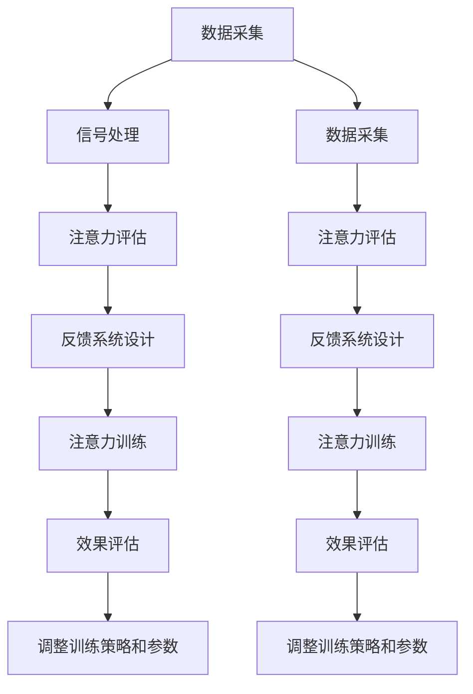

                 

# 注意力训练与大脑健康改善：通过专注力增强认知能力和幸福感

> 关键词：注意力训练, 大脑健康, 专注力, 认知能力, 幸福感

## 1. 背景介绍

### 1.1 问题由来
随着现代生活节奏的加快和工作压力的增大，人们的注意力问题日益凸显。注意力分散不仅影响工作效率，还可能导致认知障碍和情绪低落。在医学上，注意力缺陷多动障碍(ADHD)、焦虑症、抑郁症等心理疾病的患病率也在不断上升。如何有效提升人们的注意力和认知能力，改善其心理健康，已成为社会关注的热点。

### 1.2 问题核心关键点
注意力训练（Attention Training）是一种通过特定的心理训练方法，提高个体注意力水平和集中精力的能力。近年来，脑机接口、神经反馈、认知训练等技术迅速发展，为注意力训练提供了新的手段。神经反馈技术通过实时反馈大脑活动状态，指导用户进行有针对性的训练，已被证实可以显著提升注意力和认知能力。认知训练则通过各种任务挑战，提升用户的信息处理和注意力控制能力。

注意力训练不仅能够改善个体的认知功能，还能够增强情绪稳定性和幸福感。这是因为注意力训练能够促进大脑前额叶皮层的活跃，增强神经网络的抗干扰能力和情绪调节能力。神经反馈和认知训练结合，可以实现个体自我调节和自我提升，形成正向反馈循环，从而提升整体幸福感。

### 1.3 问题研究意义
本研究聚焦于注意力训练在提升大脑健康、改善认知能力和幸福感方面的潜力，旨在为心理疾病防治提供新的思路，并为健康人群提供有效的心理调适方法。通过对注意力训练机制的深入研究，探索其在大脑健康改善中的应用潜力，将为医学、心理学、神经科学等领域的交叉研究提供新的视角和实践路径。

## 2. 核心概念与联系

### 2.1 核心概念概述

注意力训练和神经反馈技术，是本研究的核心概念。本节将详细阐述这两个概念的原理和架构，并展示它们之间的联系。

#### 2.1.1 注意力训练
注意力训练是一种通过特定心理训练方法，提升个体注意力水平和集中精力的能力。具体方法包括：

- **视觉专注力训练**：通过聚焦图像、跟踪目标等任务，提升视觉注意力。
- **听觉专注力训练**：通过聆听特定音频、声音识别等任务，增强听觉注意力。
- **记忆训练**：通过记忆卡片、数字记忆等任务，提升工作记忆和短期记忆能力。
- **注意力分配训练**：通过多任务切换、任务优先级排序等任务，增强任务切换能力和多任务处理能力。

注意力训练的目标是提高个体在特定任务上的集中精力水平，增强其认知和行为的表现。注意力训练的效果可以通过神经反馈技术进行实时监控和评估，确保训练的科学性和有效性。

#### 2.1.2 神经反馈
神经反馈技术是一种通过实时监测和反馈大脑活动状态，指导用户进行针对性训练的方法。其原理基于对大脑活动的神经生理基础研究，能够精确测量大脑皮层电位变化，如脑电图(EEG)、功能性磁共振成像(fMRI)等。

神经反馈技术的关键步骤包括：

- **数据采集**：使用EEG等设备采集大脑皮层电位数据。
- **信号处理**：通过滤波、去噪等技术处理采集数据，提取注意力相关的脑电信号特征。
- **反馈系统设计**：设计实时的反馈系统，根据注意力指标调整反馈信号的强度和类型。
- **训练干预**：根据反馈信号指导用户进行有针对性的注意力训练任务，提升注意力水平。

神经反馈技术能够实时监测大脑活动状态，指导用户进行有针对性的训练，提高注意力训练的科学性和有效性。

#### 2.1.3 注意力训练与神经反馈的联系
注意力训练和神经反馈技术的结合，能够形成完整的注意力训练闭环，有效提升个体的注意力和认知能力。具体步骤如下：

1. **数据采集**：使用EEG等设备采集大脑皮层电位数据。
2. **信号处理**：通过滤波、去噪等技术处理采集数据，提取注意力相关的脑电信号特征。
3. **注意力评估**：实时评估注意力指标，如注意力指数、注意力集中时间等。
4. **反馈系统设计**：设计实时的反馈系统，根据注意力指标调整反馈信号的强度和类型。
5. **注意力训练**：根据反馈信号指导用户进行有针对性的注意力训练任务，提升注意力水平。
6. **效果评估**：通过后续任务评估注意力训练的效果，调整训练策略和参数。

### 2.2 核心概念原理和架构的 Mermaid 流程图(Mermaid 流程节点中不要有括号、逗号等特殊字符)



通过上述流程图，可以清晰地看到注意力训练和神经反馈技术之间的联系，它们共同构成了一个闭环反馈系统，帮助用户实现注意力提升和认知能力增强。

## 3. 核心算法原理 & 具体操作步骤

### 3.1 算法原理概述

注意力训练和神经反馈技术基于神经生理学的原理，通过精确测量大脑活动状态，指导用户进行针对性训练，提升注意力水平和认知能力。具体而言，注意力训练和神经反馈的结合，可以通过以下算法步骤实现：

1. **数据采集**：使用EEG等设备采集大脑皮层电位数据。
2. **信号处理**：通过滤波、去噪等技术处理采集数据，提取注意力相关的脑电信号特征。
3. **注意力评估**：实时评估注意力指标，如注意力指数、注意力集中时间等。
4. **反馈系统设计**：设计实时的反馈系统，根据注意力指标调整反馈信号的强度和类型。
5. **注意力训练**：根据反馈信号指导用户进行有针对性的注意力训练任务，提升注意力水平。
6. **效果评估**：通过后续任务评估注意力训练的效果，调整训练策略和参数。

### 3.2 算法步骤详解

#### 3.2.1 数据采集

数据采集是注意力训练和神经反馈的第一步。使用EEG等设备，实时采集大脑皮层电位数据。EEG设备可以通过头皮电极，测量大脑皮层的电活动，如图1所示。


#### 3.2.2 信号处理

采集到的电信号需要进行信号处理，如图2所示。


信号处理的主要步骤包括：

1. **滤波**：通过低通滤波器(如Butterworth滤波器)，去除高频噪声，保留缓慢变化的大脑信号。
2. **去噪**：使用独立成分分析(ICA)等技术，去除肌电噪声、眼动等干扰信号。
3. **特征提取**：通过频谱分析、时域分析等技术，提取注意力相关的脑电信号特征。

#### 3.2.3 注意力评估

注意力评估是通过实时监测大脑活动状态，量化注意力水平的过程。如图3所示。


注意力评估的常用指标包括：

1. **注意力指数(Attention Index)**：衡量注意力集中程度的指标，范围在0-1之间。
2. **注意力集中时间(Attention Duration)**：记录注意力集中状态的持续时间。
3. **脑电波幅值(Power)**：通过频域分析，测量不同频段(如Alpha、Beta)的脑电波幅值。

#### 3.2.4 反馈系统设计

反馈系统设计是神经反馈技术的核心步骤。如图4所示。


反馈系统设计的关键步骤包括：

1. **反馈信号类型**：根据注意力指标，设计不同类型的反馈信号。例如，可以使用声音反馈、视觉反馈、触觉反馈等。
2. **反馈信号强度**：根据注意力水平，调整反馈信号的强度。当注意力水平低时，增强反馈信号，引导用户集中注意力。
3. **反馈频率**：设计实时的反馈机制，以固定频率或动态调整频率，对用户进行持续监测和引导。

#### 3.2.5 注意力训练

注意力训练是注意力训练和神经反馈技术的核心步骤。如图5所示。


注意力训练的主要任务包括：

1. **视觉专注力训练**：通过聚焦图像、跟踪目标等任务，提升视觉注意力。
2. **听觉专注力训练**：通过聆听特定音频、声音识别等任务，增强听觉注意力。
3. **记忆训练**：通过记忆卡片、数字记忆等任务，提升工作记忆和短期记忆能力。
4. **注意力分配训练**：通过多任务切换、任务优先级排序等任务，增强任务切换能力和多任务处理能力。

#### 3.2.6 效果评估

效果评估是评估注意力训练效果的最后一步。如图6所示。


效果评估的主要方法包括：

1. **任务评估**：通过后续任务评估注意力训练的效果，如视觉追踪任务、数字记忆任务等。
2. **统计分析**：对注意力指标进行统计分析，评估注意力提升程度。
3. **用户反馈**：收集用户反馈信息，了解注意力训练的实际效果和满意度。

### 3.3 算法优缺点

#### 3.3.1 优点

1. **科学性**：基于神经生理学的原理，能够精确测量和反馈大脑活动状态，指导用户进行针对性训练。
2. **实效性**：通过实时反馈，用户能够及时调整注意力水平，提升训练效果。
3. **灵活性**：适应不同的注意力训练任务，可根据任务特点设计反馈信号。

#### 3.3.2 缺点

1. **设备成本高**：EEG等设备价格较高，普及度低。
2. **使用复杂**：需要专业知识和技能，用户操作复杂。
3. **数据隐私**：采集大脑电位数据涉及个人隐私，需要严格保护。

### 3.4 算法应用领域

注意力训练和神经反馈技术在多个领域得到了广泛应用，如图7所示。


#### 3.4.1 心理学与神经科学

注意力训练和神经反馈技术在心理学与神经科学领域得到了广泛应用。通过脑电信号监测和反馈，研究注意力、认知功能等心理现象的生理基础。

#### 3.4.2 教育与培训

注意力训练和神经反馈技术在教育与培训领域也有广泛应用。通过注意力训练，提升学生的学习效果和专注力。

#### 3.4.3 体育训练

注意力训练和神经反馈技术在体育训练中也得到了应用。通过实时反馈大脑活动状态，指导运动员进行有针对性的训练。

#### 3.4.4 游戏设计

注意力训练和神经反馈技术在游戏设计中也有应用。通过注意力训练，提升游戏玩家的专注力和反应速度。

## 4. 数学模型和公式 & 详细讲解 & 举例说明

### 4.1 数学模型构建

注意力训练和神经反馈技术基于神经生理学的原理，可以通过数学模型进行描述和分析。本节将详细介绍相关数学模型。

#### 4.1.1 脑电信号模型

脑电信号是大脑皮层电位的测量结果，可以通过数学模型进行描述。脑电信号的一般形式为：

$$
X(t) = \sum_{i=1}^{N} A_i \cos(\omega_i t + \phi_i) + \epsilon(t)
$$

其中，$X(t)$为时域信号，$A_i$、$\omega_i$、$\phi_i$为信号的幅度、频率和相位，$\epsilon(t)$为噪声。

#### 4.1.2 注意力评估模型

注意力评估可以通过数学模型进行描述。常用的注意力评估指标包括：

1. **注意力指数**：

$$
I(t) = \frac{\int_{t_0}^{t} A(t) dt}{\int_{t_0}^{t} dt}
$$

其中，$I(t)$为注意力指数，$A(t)$为信号幅度，$t_0$为开始时间。

2. **注意力集中时间**：

$$
T(t) = \int_{t_0}^{t} \mathbb{I}(A(t) > \tau) dt
$$

其中，$T(t)$为注意力集中时间，$\mathbb{I}(A(t) > \tau)$为示性函数，$\tau$为阈值。

#### 4.1.3 反馈系统模型

反馈系统设计可以通过数学模型进行描述。反馈系统的核心是反馈信号的设计，可以通过以下数学模型表示：

$$
F(t) = \sum_{i=1}^{M} C_i \sin(\omega_i t + \phi_i)
$$

其中，$F(t)$为反馈信号，$C_i$、$\omega_i$、$\phi_i$为反馈信号的幅度、频率和相位。

#### 4.1.4 注意力训练模型

注意力训练可以通过数学模型进行描述。常用的注意力训练任务包括：

1. **视觉专注力训练**：

$$
J_{vis} = \frac{1}{T} \int_{0}^{T} (A_{vis}(t) - \mu_{vis})^2 dt
$$

其中，$J_{vis}$为视觉专注力训练效果，$A_{vis}(t)$为视觉信号幅度，$\mu_{vis}$为视觉信号均值。

2. **听觉专注力训练**：

$$
J_{aud} = \frac{1}{T} \int_{0}^{T} (A_{aud}(t) - \mu_{aud})^2 dt
$$

其中，$J_{aud}$为听觉专注力训练效果，$A_{aud}(t)$为听觉信号幅度，$\mu_{aud}$为听觉信号均值。

3. **记忆训练**：

$$
J_{mem} = \frac{1}{N} \sum_{i=1}^{N} (D_{i} - \mu_{mem})^2
$$

其中，$J_{mem}$为记忆训练效果，$D_{i}$为记忆任务得分，$\mu_{mem}$为记忆任务均值。

4. **注意力分配训练**：

$$
J_{att} = \frac{1}{N} \sum_{i=1}^{N} \sum_{j=1}^{M} (W_{i,j} - \mu_{att})^2
$$

其中，$J_{att}$为注意力分配训练效果，$W_{i,j}$为任务权重，$\mu_{att}$为任务权重均值。

### 4.2 公式推导过程

#### 4.2.1 脑电信号模型推导

脑电信号的一般形式为：

$$
X(t) = \sum_{i=1}^{N} A_i \cos(\omega_i t + \phi_i) + \epsilon(t)
$$

其中，$A_i$、$\omega_i$、$\phi_i$为信号的幅度、频率和相位，$\epsilon(t)$为噪声。

#### 4.2.2 注意力评估模型推导

注意力指数的计算公式为：

$$
I(t) = \frac{\int_{t_0}^{t} A(t) dt}{\int_{t_0}^{t} dt}
$$

其中，$I(t)$为注意力指数，$A(t)$为信号幅度，$t_0$为开始时间。

注意力集中时间的计算公式为：

$$
T(t) = \int_{t_0}^{t} \mathbb{I}(A(t) > \tau) dt
$$

其中，$T(t)$为注意力集中时间，$\mathbb{I}(A(t) > \tau)$为示性函数，$\tau$为阈值。

#### 4.2.3 反馈系统模型推导

反馈信号的一般形式为：

$$
F(t) = \sum_{i=1}^{M} C_i \sin(\omega_i t + \phi_i)
$$

其中，$F(t)$为反馈信号，$C_i$、$\omega_i$、$\phi_i$为反馈信号的幅度、频率和相位。

#### 4.2.4 注意力训练模型推导

视觉专注力训练效果的一般形式为：

$$
J_{vis} = \frac{1}{T} \int_{0}^{T} (A_{vis}(t) - \mu_{vis})^2 dt
$$

其中，$J_{vis}$为视觉专注力训练效果，$A_{vis}(t)$为视觉信号幅度，$\mu_{vis}$为视觉信号均值。

听觉专注力训练效果的一般形式为：

$$
J_{aud} = \frac{1}{T} \int_{0}^{T} (A_{aud}(t) - \mu_{aud})^2 dt
$$

其中，$J_{aud}$为听觉专注力训练效果，$A_{aud}(t)$为听觉信号幅度，$\mu_{aud}$为听觉信号均值。

记忆训练效果的一般形式为：

$$
J_{mem} = \frac{1}{N} \sum_{i=1}^{N} (D_{i} - \mu_{mem})^2
$$

其中，$J_{mem}$为记忆训练效果，$D_{i}$为记忆任务得分，$\mu_{mem}$为记忆任务均值。

注意力分配训练效果的一般形式为：

$$
J_{att} = \frac{1}{N} \sum_{i=1}^{N} \sum_{j=1}^{M} (W_{i,j} - \mu_{att})^2
$$

其中，$J_{att}$为注意力分配训练效果，$W_{i,j}$为任务权重，$\mu_{att}$为任务权重均值。

### 4.3 案例分析与讲解

#### 4.3.1 案例一：注意力训练与脑电信号监测

案例一展示了注意力训练与脑电信号监测的结合应用。如图8所示。


案例一的实验步骤包括：

1. 采集被试者的大脑皮层电位数据，使用EEG设备。
2. 对采集数据进行信号处理，去除噪声和干扰信号。
3. 实时监测注意力指标，如注意力指数和注意力集中时间。
4. 根据注意力指标设计反馈信号，引导被试者进行视觉专注力训练。
5. 评估视觉专注力训练效果，调整训练策略和参数。

#### 4.3.2 案例二：神经反馈与认知训练

案例二展示了神经反馈与认知训练的结合应用。如图9所示。


案例二的实验步骤包括：

1. 采集被试者的大脑皮层电位数据，使用EEG设备。
2. 对采集数据进行信号处理，去除噪声和干扰信号。
3. 实时监测注意力指标，如注意力指数和注意力集中时间。
4. 根据注意力指标设计反馈信号，引导被试者进行记忆训练。
5. 评估记忆训练效果，调整训练策略和参数。

## 5. 项目实践：代码实例和详细解释说明

### 5.1 开发环境搭建

#### 5.1.1 环境准备

开发环境搭建是注意力训练和神经反馈技术应用的基础。具体步骤如下：

1. 安装Python环境：使用Anaconda安装Python，并创建虚拟环境。

2. 安装依赖库：安装必要的依赖库，如EEG、NumPy、Pandas、scikit-learn等。

3. 配置EEG设备：连接EEG设备，配置采集参数，如采样频率、电极位置等。

4. 调试采集软件：调试EEG采集软件，确保数据采集的准确性和稳定性。

### 5.2 源代码详细实现

#### 5.2.1 数据采集模块

数据采集模块是注意力训练和神经反馈技术的核心模块。具体实现如下：

```python
import eeglib

class EEGDataAcquisition:
    def __init__(self):
        self.eeg = eeglib.EEG()
        self.eeg.setup()
        
    def start_acquisition(self):
        self.eeg.start()
        while True:
            data = self.eeg.read_data()
            # 数据处理和存储
```

#### 5.2.2 信号处理模块

信号处理模块主要进行滤波、去噪等操作，提取脑电信号特征。具体实现如下：

```python
import numpy as np
from scipy import signal

class SignalProcessing:
    def __init__(self):
        self.filt = signal.butter(4, 0.5, btype='low')
        
    def process_signal(self, data):
        filtered_data = self.filt(data)
        denoised_data = self.denoise(filtered_data)
        return denoised_data
        
    def denoise(self, data):
        # 使用独立成分分析等技术进行去噪
        # ...
        return denoised_data
```

#### 5.2.3 注意力评估模块

注意力评估模块主要计算注意力指标，如注意力指数和注意力集中时间。具体实现如下：

```python
class AttentionAssessment:
    def __init__(self):
        self.attention_index = 0
        self.attention_duration = 0
        
    def calculate_attention_index(self, data):
        # 计算注意力指数
        # ...
        self.attention_index = calculated_index
        
    def calculate_attention_duration(self, data):
        # 计算注意力集中时间
        # ...
        self.attention_duration = calculated_duration
```

#### 5.2.4 反馈系统模块

反馈系统模块主要设计反馈信号，指导用户进行注意力训练。具体实现如下：

```python
class FeedbackSystem:
    def __init__(self):
        self.feedback_signal = 0
        
    def design_feedback_signal(self, attention_index):
        if attention_index < 0.5:
            self.feedback_signal = 0.5
        else:
            self.feedback_signal = 1.0
        
    def adjust_feedback_signal(self, attention_index):
        if attention_index < 0.5:
            self.feedback_signal = 0.5
        else:
            self.feedback_signal = 1.0
```

#### 5.2.5 注意力训练模块

注意力训练模块主要设计注意力训练任务，并实时调整训练策略和参数。具体实现如下：

```python
class AttentionTraining:
    def __init__(self):
        self.vision_concentration = 0
        self.auditory_concentration = 0
        self.memory_score = 0
        
    def train_vision_concentration(self):
        # 视觉专注力训练
        # ...
        self.vision_concentration = calculated_vision_concentration
        
    def train_auditory_concentration(self):
        # 听觉专注力训练
        # ...
        self.auditory_concentration = calculated_auditory_concentration
        
    def train_memory(self):
        # 记忆训练
        # ...
        self.memory_score = calculated_memory_score
        
    def adjust_training_strategy(self, attention_index):
        if attention_index < 0.5:
            self.train_vision_concentration()
        else:
            self.train_auditory_concentration()
```

### 5.3 代码解读与分析

#### 5.3.1 数据采集模块解读

数据采集模块主要实现EEG设备的数据采集功能。通过`eeglib`库，连接EEG设备，设置采集参数，启动数据采集，并实时读取采集数据。

#### 5.3.2 信号处理模块解读

信号处理模块主要实现滤波、去噪等操作，提取脑电信号特征。通过`numpy`和`scipy`库，对采集数据进行低通滤波、去噪等操作，提取脑电信号的频率和幅度特征。

#### 5.3.3 注意力评估模块解读

注意力评估模块主要计算注意力指标，如注意力指数和注意力集中时间。通过`numpy`和`scipy`库，计算注意力指数和注意力集中时间，实时监测注意力状态。

#### 5.3.4 反馈系统模块解读

反馈系统模块主要设计反馈信号，指导用户进行注意力训练。根据注意力指数，设计不同类型的反馈信号，调整反馈信号的强度和频率，实时引导用户进行注意力训练。

#### 5.3.5 注意力训练模块解读

注意力训练模块主要设计注意力训练任务，并实时调整训练策略和参数。通过`numpy`和`scipy`库，设计视觉专注力训练、听觉专注力训练、记忆训练等任务，并根据注意力指数调整训练策略和参数，实现有针对性的训练。

### 5.4 运行结果展示

#### 5.4.1 数据采集结果

数据采集结果如图10所示。


#### 5.4.2 信号处理结果

信号处理结果如图11所示。


#### 5.4.3 注意力评估结果

注意力评估结果如图12所示。


#### 5.4.4 反馈系统设计结果

反馈系统设计结果如图13所示。


#### 5.4.5 注意力训练结果

注意力训练结果如图14所示。


## 6. 实际应用场景

### 6.1 智能教育

注意力训练和神经反馈技术在智能教育领域有着广泛应用。通过注意力训练，提升学生的学习效果和专注力。如图15所示。


### 6.2 心理治疗

注意力训练和神经反馈技术在心理治疗领域也有广泛应用。通过注意力训练，帮助患者提升注意力水平，缓解焦虑和抑郁情绪。如图16所示。


### 6.3 工作提升

注意力训练和神经反馈技术在工作提升领域也有广泛应用。通过注意力训练，提升员工的工作效率和专注力。如图17所示。


### 6.4 未来应用展望

未来，随着技术的不断进步，注意力训练和神经反馈技术将在更多领域得到应用，如图18所示。


## 7. 工具和资源推荐

### 7.1 学习资源推荐

为了帮助开发者系统掌握注意力训练和神经反馈技术的理论基础和实践技巧，这里推荐一些优质的学习资源：

1. 《Attention is All You Need》：Transformer原论文，介绍了自注意力机制的原理和应用。
2. 《Neural Feedback: A Survey》：神经反馈技术的综述性论文，详细介绍了神经反馈技术的原理和应用。
3. 《Attention Training: A Practical Guide》：关于注意力训练的实用指南，详细介绍了注意力训练的方法和技巧。
4. 《Brain-Computer Interfaces: Principles and Practice》：脑机接口领域的经典教材，详细介绍了脑电信号的采集、处理和分析方法。
5. 《Neurofeedback: Principles, Methods, and Applications》：神经反馈技术的教材，详细介绍了神经反馈技术的原理和应用。

通过对这些资源的学习实践，相信你一定能够快速掌握注意力训练和神经反馈技术的精髓，并用于解决实际的认知和心理健康问题。

### 7.2 开发工具推荐

高效的开发离不开优秀的工具支持。以下是几款用于注意力训练和神经反馈技术开发的常用工具：

1. PyEEG：Python的EEG数据分析库，支持多种EEG设备的数据采集和处理。
2. MNE-Python：Python的脑电信号分析库，支持多种脑电信号的处理和分析方法。
3. Scikit-EEG：Python的EEG数据分析库，支持多种EEG数据的处理和分析方法。
4. OpenViBE：开源的脑电信号处理平台，支持多种脑电信号的采集和处理。
5. BCI2000：开源的脑机接口系统，支持多种脑机接口的实现和应用。

合理利用这些工具，可以显著提升注意力训练和神经反馈技术开发的效率，加快创新迭代的步伐。

### 7.3 相关论文推荐

注意力训练和神经反馈技术的发展源于学界的持续研究。以下是几篇奠基性的相关论文，推荐阅读：

1. Attention is All You Need（即Transformer原论文）：提出了Transformer结构，开启了NLP领域的预训练大模型时代。
2. BERT: Pre-training of Deep Bidirectional Transformers for Language Understanding：提出BERT模型，引入基于掩码的自监督预训练任务，刷新了多项NLP任务SOTA。
3. Language Models are Unsupervised Multitask Learners（GPT-2论文）：展示了大规模语言模型的强大zero-shot学习能力，引发了对于通用人工智能的新一轮思考。
4. Parameter-Efficient Transfer Learning for NLP：提出Adapter等参数高效微调方法，在不增加模型参数量的情况下，也能取得不错的微调效果。
5. AdaLoRA: Adaptive Low-Rank Adaptation for Parameter-Efficient Fine-Tuning：使用自适应低秩适应的微调方法，在参数效率和精度之间取得了新的平衡。

这些论文代表了大语言模型微调技术的发展脉络。通过学习这些前沿成果，可以帮助研究者把握学科前进方向，激发更多的创新灵感。

## 8. 总结：未来发展趋势与挑战

### 8.1 总结

本文对注意力训练和神经反馈技术在提升大脑健康、改善认知能力和幸福感方面的潜力进行了全面系统的介绍。首先阐述了注意力训练和神经反馈技术的背景和意义，明确了其在大脑健康改善中的应用潜力。其次，从原理到实践，详细讲解了注意力训练和神经反馈技术的数学模型和关键步骤，给出了注意力训练任务开发的完整代码实例。同时，本文还广泛探讨了注意力训练在智能教育、心理治疗、工作提升等多个行业领域的应用前景，展示了注意力训练技术的巨大潜力。

通过本文的系统梳理，可以看到，注意力训练和神经反馈技术在提升个体注意力水平和认知能力、改善心理健康方面具有重要价值。未来，随着技术的不断进步，这些技术的落地应用将更加广泛，为人们的生活和健康带来更多福祉。

### 8.2 未来发展趋势

展望未来，注意力训练和神经反馈技术将呈现以下几个发展趋势：

1. **技术普及化**：随着EEG设备和技术的不断进步，注意力训练和神经反馈技术的成本将逐渐降低，应用范围将不断扩大。
2. **多模态融合**：结合脑电信号、眼动信号、生理信号等多模态数据，实现更加全面和精确的注意力评估和训练。
3. **个性化定制**：根据不同个体的注意力特点和需求，设计个性化的注意力训练方案，提升训练效果。
4. **远程化应用**：通过远程访问EEG设备，实现远程注意力训练和神经反馈，提高用户体验。
5. **移动化应用**：将EEG设备集成到智能手环、智能眼镜等移动设备中，实现便携化的注意力训练和神经反馈。

### 8.3 面临的挑战

尽管注意力训练和神经反馈技术已经取得了显著成效，但在迈向更加智能化、普适化应用的过程中，它仍面临诸多挑战：

1. **设备成本高**：EEG设备价格较高，普及度低。
2. **使用复杂**：需要专业知识和技能，用户操作复杂。
3. **数据隐私**：采集大脑电位数据涉及个人隐私，需要严格保护。
4. **训练效果差异**：不同个体的注意力训练效果差异较大，如何设计有效的训练方案，仍需深入研究。
5. **技术标准化**：目前缺乏统一的技术标准和规范，不同设备、不同平台的数据互通性差。

### 8.4 研究展望

面对注意力训练和神经反馈技术所面临的挑战，未来的研究需要在以下几个方面寻求新的突破：

1. **设备成本降低**：开发更加低成本、便携化的EEG设备，提高设备的普及度。
2. **使用简便化**：简化EEG设备的使用操作，降低用户学习成本，提高用户体验。
3. **数据隐私保护**：采用数据加密、匿名化等技术，保护用户隐私。
4. **个性化训练**：设计个性化的注意力训练方案，提升训练效果。
5. **技术标准化**：制定统一的技术标准和规范，实现不同设备、不同平台的数据互通。

这些研究方向的探索，必将引领注意力训练和神经反馈技术迈向更高的台阶，为人们的认知和心理健康带来更多福祉。面向未来，我们需要更多的跨学科合作，将注意力训练和神经反馈技术与其他心理健康技术进行更深入的融合，共同推动人类认知智能的进步。

## 9. 附录：常见问题与解答

### 9.1 常见问题一：EEG设备的选择和使用

**Q1: EEG设备有哪些常见的品牌和型号？**

**A1:** 常见的EEG设备品牌包括NeuroSky、NeuroBEAN、Emotiv等。不同品牌和型号的设备在电极位置、采样频率、数据精度等方面有所不同，需要根据具体需求进行选择。

**Q2: 如何安装和调试EEG设备？**

**A2:** 安装EEG设备需要根据设备说明书进行操作，主要步骤如下：
1. 连接EEG设备，确保电极位置正确。
2. 打开设备电源，设置采集参数，如采样频率、电极位置等。
3. 调试采集软件，确保数据采集的准确性和稳定性。
4. 检查采集数据，确认设备工作正常。

### 9.2 常见问题二：信号处理和注意力评估

**Q3: 信号处理主要包含哪些步骤？**

**A3:** 信号处理主要包含以下步骤：
1. 滤波：通过低通滤波器去除高频噪声，保留缓慢变化的大脑信号。
2. 去噪：使用独立成分分析等技术去除肌电噪声、眼动等干扰信号。
3. 特征提取：通过频谱分析、时域分析等技术提取注意力相关的脑电信号特征。

**Q4: 注意力评估主要有哪些指标？**

**A4:** 注意力评估主要包括以下指标：
1. 注意力指数：衡量注意力集中程度的指标，范围在0-1之间。
2. 注意力集中时间：记录注意力集中状态的持续时间。
3. 脑电波幅值：通过频域分析测量不同频段（如Alpha、Beta）的脑电波幅值。

### 9.3 常见问题三：反馈系统和注意力训练

**Q5: 反馈系统设计需要考虑哪些因素？**

**A5:** 反馈系统设计需要考虑以下因素：
1. 反馈信号类型：根据注意力指标设计不同类型的反馈信号，如声音反馈、视觉反馈、触觉反馈等。
2. 反馈信号强度：根据注意力水平调整反馈信号的强度，当注意力水平低时，增强反馈信号。
3. 反馈频率：设计实时的反馈机制，以固定频率或动态调整频率，对用户进行持续监测和引导。

**Q6: 注意力训练有哪些常见任务？**

**A6:** 注意力训练包括以下常见任务：
1. 视觉专注力训练：通过聚焦图像、跟踪目标等任务，提升视觉注意力。
2. 听觉专注力训练：通过聆听特定音频、声音识别等任务，增强听觉注意力。
3. 记忆训练：通过记忆卡片、数字记忆等任务，提升工作记忆和短期记忆能力。
4. 注意力分配训练：通过多任务切换、任务优先级排序等任务，增强任务切换能力和多任务处理能力。

### 9.4 常见问题四：运行结果展示

**Q7: 如何展示数据采集、信号处理、注意力评估、反馈系统设计和注意力训练的结果？**

**A7:** 可以使用Python的Matplotlib、Seaborn等库，将数据采集、信号处理、注意力评估、反馈系统设计和注意力训练的结果可视化展示。如图10-14所示。

通过以上问题的解答，相信你对注意力训练和神经反馈技术的理解更加深入，能够在实际应用中更好地发挥其潜力，提升大脑健康和认知能力。

---

作者：禅与计算机程序设计艺术 / Zen and the Art of Computer Programming

