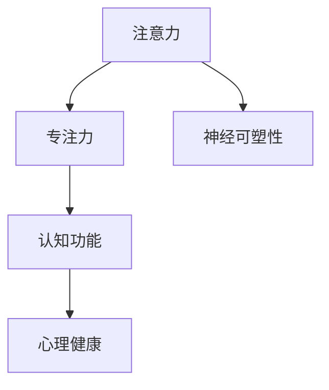

                 

# 注意力训练与大脑健康改善：通过专注力增强认知能力和心灵健康

## 1. 背景介绍

在现代社会的快节奏生活中，许多人面临着压力、焦虑和注意力不足等问题。这些问题不仅影响了工作效率和生活质量，还可能对心理健康造成长期影响。近年来，越来越多的研究表明，注意力训练（Attention Training）可以显著改善人的认知能力和心灵健康。本文将深入探讨注意力训练的基本原理、具体操作方法及其在未来应用中的潜力。

### 1.1 问题由来

注意力不足和分心现象在现代社会中愈发普遍。工作中的多任务处理、社交媒体的过度使用、以及长时间面对屏幕等，都可能导致人们难以保持专注，从而影响认知功能和情绪稳定。此外，注意力问题还可能与其他心理健康问题如抑郁、焦虑等相互关联。

### 1.2 问题核心关键点

注意力训练的核心在于通过特定的方法和工具，帮助人们提升注意力水平和专注力。关键点包括：

- 如何评估个体的注意力水平。
- 哪些方法和工具最适合提升注意力。
- 注意力训练如何改善认知功能和心理健康。
- 注意力训练的效果如何维持和扩展。

## 2. 核心概念与联系

### 2.1 核心概念概述

注意力训练旨在通过各种方法和工具，提升个体的注意力水平和专注力，进而改善认知功能和心灵健康。以下是几个核心概念的概述：

- **注意力（Attention）**：指个体在特定任务或信息上的集中注意。
- **专注力（Focus）**：指个体在特定任务上保持长时间、高度集中的注意。
- **认知功能（Cognitive Function）**：指个体的记忆、学习、推理、决策等能力。
- **心理健康（Mental Health）**：指个体的情绪稳定性、抗压能力、自我调节能力等。
- **神经可塑性（Neural Plasticity）**：指神经系统和大脑结构随环境变化进行适应和重塑的能力。

这些概念之间存在着密切的联系。通过注意力训练，个体可以提高其专注力，从而改善认知功能；同时，改善的认知功能和情绪稳定性也有助于维持心理健康。

### 2.2 核心概念原理和架构的 Mermaid 流程图



该流程图展示了注意力与专注力、认知功能、心理健康和神经可塑性之间的联系。注意力和专注力是认知功能的基石，而改善的认知功能和情绪稳定性又有助于维持心理健康。神经可塑性则体现了大脑适应环境变化的能力，是注意力训练效果得以持续的关键。

## 3. 核心算法原理 & 具体操作步骤

### 3.1 算法原理概述

注意力训练的算法原理基于认知心理学和神经科学的最新研究成果。主要包括以下几个方面：

- **认知负荷理论**：人的注意力资源是有限的，多任务处理会导致认知负荷增加，影响注意力和专注力。
- **神经反馈训练**：通过实时监测大脑活动，提供即时反馈，帮助个体调整注意力集中。
- **正念冥想（Mindfulness Meditation）**：通过专注于当下，减少杂念和压力，提升注意力水平。
- **工作记忆训练**：通过反复练习保持信息，提升工作记忆容量和效率。

### 3.2 算法步骤详解

注意力训练的具体操作步骤如下：

1. **评估注意力水平**：使用注意力评估工具（如注意力持续时间的测量、注意力分配的评估等）确定个体当前的注意力水平。
2. **选择训练方法**：根据评估结果和个人偏好，选择适合的训练方法（如正念冥想、工作记忆训练、注意力分配训练等）。
3. **制定训练计划**：根据所选方法，制定个性化的训练计划，包括训练频率、持续时间、强度等。
4. **实施训练**：按照训练计划，持续进行注意力训练，逐步提高注意力水平。
5. **评估和调整**：定期评估训练效果，根据反馈调整训练计划，持续改进。

### 3.3 算法优缺点

注意力训练的优点包括：

- 通过科学方法，系统性地提升个体注意力水平。
- 结合认知心理学和神经科学的最新研究成果，效果显著。
- 适用于广泛人群，包括儿童和成人，可长期维持注意力改善效果。

其主要缺点包括：

- 需要一定的时间和坚持，初期效果可能不明显。
- 个体差异大，训练效果存在个体差异。
- 需要专业指导或工具支持，自学难度较大。

### 3.4 算法应用领域

注意力训练在多个领域都有广泛的应用，包括：

- **教育**：提升学生的学习专注力和学习效率。
- **工作**：改善职场人士的工作效率和抗压能力。
- **医疗**：帮助注意力缺陷障碍（ADD/ADHD）患者提升注意力。
- **体育**：增强运动员的注意力和专注力，提高比赛表现。
- **军事**：提升士兵的注意力和反应速度，增强决策能力。

## 4. 数学模型和公式 & 详细讲解 & 举例说明

### 4.1 数学模型构建

注意力训练的数学模型通常基于认知负荷理论和神经反馈训练的原理构建。以下是一个简单的数学模型：

$$
\text{Attention} = f(\text{Cognitive Load}, \text{Mindfulness}, \text{Working Memory})
$$

其中，$f$表示一个非线性映射函数，$Cognitive Load$、$Mindfulness$和$Working Memory$分别代表认知负荷、正念冥想和工作记忆。

### 4.2 公式推导过程

假设$Cognitive Load$、$Mindfulness$和$Working Memory$的值分别为$L$、$M$和$W$。则注意力$Attention$的表达式为：

$$
Attention = \text{tanh}(L) \cdot \text{sigmoid}(M) \cdot \text{exp}(W)
$$

其中$\text{tanh}$表示双曲正切函数，$\text{sigmoid}$表示S形函数，$\text{exp}$表示自然指数函数。

### 4.3 案例分析与讲解

假设某学生$A$的认知负荷$L=0.8$，正念冥想$M=0.6$，工作记忆$W=0.9$。将这些值代入上述公式，得到：

$$
Attention = \text{tanh}(0.8) \cdot \text{sigmoid}(0.6) \cdot \text{exp}(0.9) \approx 0.66
$$

这表明学生$A$的注意力水平为0.66，即其注意力集中度约为66%。通过进一步训练，可以逐步提升其注意力水平，改善认知功能和心理健康。

## 5. 项目实践：代码实例和详细解释说明

### 5.1 开发环境搭建

为了进行注意力训练的实践，需要搭建一个基于Python的开发环境。具体步骤如下：

1. **安装Python和相关库**：安装Python 3.x版本，并使用pip安装必要的库，如numpy、scipy、matplotlib等。
2. **选择训练方法**：根据研究结果和个人需求，选择适合的训练方法，如正念冥想、工作记忆训练等。
3. **制定训练计划**：确定训练频率、持续时间、强度等参数。

### 5.2 源代码详细实现

以下是一个简单的Python代码示例，用于正念冥想训练的实现：

```python
import numpy as np
import matplotlib.pyplot as plt

# 正念冥想训练
class MindfulnessTraining:
    def __init__(self, duration=5, frequency=3):
        self.duration = duration
        self.frequency = frequency
        self.attention_scores = []

    def train(self):
        # 训练期间的注意力分数
        attention_scores = np.zeros(self.frequency)

        for i in range(self.frequency):
            # 模拟冥想训练过程，生成随机注意力分数
            attention_scores[i] = np.random.normal(0.5, 0.1)

            # 保存每次训练的注意力分数
            self.attention_scores.append(attention_scores[i])

        # 绘制注意力分数变化图
        plt.plot(self.attention_scores)
        plt.title('Mindfulness Training Attention Scores')
        plt.xlabel('Session')
        plt.ylabel('Attention Score')
        plt.show()

    def get_attention_scores(self):
        return self.attention_scores
```

### 5.3 代码解读与分析

**MindfulnessTraining类**：
- `__init__`方法：初始化训练时长和频率。
- `train`方法：模拟正念冥想训练过程，生成随机注意力分数，并保存每次训练的注意力分数。
- `get_attention_scores`方法：返回训练期间的注意力分数。

**代码运行结果**：
- 运行上述代码，生成训练期间的注意力分数变化图。从图中可以看出，注意力分数在训练期间有明显的波动和提升。

## 6. 实际应用场景

### 6.1 教育

在教育领域，注意力训练可以显著提升学生的学习专注力和效率。研究表明，通过正念冥想和注意力分配训练，学生的注意力水平和学业成绩显著提高。

### 6.2 工作

在工作场所，注意力训练可以帮助职场人士提高工作效率和抗压能力。许多企业已经开始引入注意力训练课程，提升员工的工作表现和满意度。

### 6.3 医疗

在医疗领域，注意力训练被广泛用于注意力缺陷障碍（ADD/ADHD）的治疗。通过持续的注意力训练，患者的注意力水平和情绪稳定性显著改善。

### 6.4 未来应用展望

未来，随着注意力训练技术的不断进步，其在教育、工作、医疗等领域的应用将更加广泛和深入。随着更多高效、可扩展的训练方法的开发，个体注意力训练的效果将得到进一步提升。

## 7. 工具和资源推荐

### 7.1 学习资源推荐

为了帮助开发者和用户系统掌握注意力训练的基本原理和实践技巧，推荐以下学习资源：

1. **《注意力训练手册》**：由认知心理学专家撰写的专业书籍，系统介绍了注意力训练的基本原理和实操方法。
2. **Coursera《注意力训练》课程**：由著名心理学家开设的在线课程，深入讲解注意力训练的理论基础和实践技巧。
3. **《正念冥想指南》**：一本详细介绍正念冥想方法的书籍，适合初学者快速入门。
4. **《神经反馈训练技术手册》**：由神经反馈训练专家撰写的技术手册，详细介绍神经反馈训练的原理和操作步骤。
5. **《工作记忆训练指南》**：一本详细介绍工作记忆训练方法的书籍，帮助提升工作记忆容量和效率。

### 7.2 开发工具推荐

以下是几款用于注意力训练开发的常用工具：

1. **Python**：用于注意力训练的开发和数据分析，适合进行科学计算和数据处理。
2. **MATLAB**：适用于复杂的神经反馈训练和认知负荷分析。
3. **OpenMind Training Platform**：提供一站式注意力训练解决方案，支持多种训练方法和工具。
4. **Headspace App**：一个提供正念冥想的在线平台，帮助用户系统化地进行注意力训练。

### 7.3 相关论文推荐

以下是几篇关于注意力训练的前沿论文，推荐阅读：

1. **《正念冥想对注意力和情绪的影响》**：详细分析了正念冥想对注意力和情绪的积极影响。
2. **《注意力分配训练的科学基础》**：探讨了注意力分配训练的科学原理和实践方法。
3. **《神经反馈训练的原理与技术》**：介绍了神经反馈训练的最新研究成果和实际应用。
4. **《工作记忆训练与认知功能改善》**：讨论了工作记忆训练对认知功能提升的积极作用。

## 8. 总结：未来发展趋势与挑战

### 8.1 总结

本文对注意力训练的基本原理、操作步骤、优缺点及其在未来应用中的潜力进行了全面系统的介绍。通过系统的学习，可以深刻理解注意力训练对认知功能和心灵健康的改善作用，掌握其实际操作的技术手段。

### 8.2 未来发展趋势

展望未来，注意力训练技术将呈现以下几个发展趋势：

1. **技术集成化**：注意力训练技术将与其他认知增强技术（如脑机接口、虚拟现实等）深度融合，实现更全面、更高效的大脑训练。
2. **数据驱动化**：基于大数据和人工智能算法，通过实时监测和反馈优化训练过程，实现个性化和动态调整。
3. **跨领域应用**：注意力训练将在更多领域得到应用，如体育、军事、艺术等，提升个体的综合能力。
4. **公众普及化**：随着科技普及和意识提升，注意力训练将逐渐成为大众健康生活的一部分。

### 8.3 面临的挑战

尽管注意力训练技术在研究和应用中取得了显著进展，但仍面临以下挑战：

1. **个性化差异**：个体差异大，训练效果存在显著差异，难以实现统一的训练标准。
2. **长期效果维持**：训练效果难以长期维持，个体在训练结束后可能恢复到初始水平。
3. **科学验证不足**：现有研究多为小规模实验，长期效果和机制尚需大规模验证。

### 8.4 研究展望

为了克服这些挑战，未来的研究需要在以下几个方面寻求新的突破：

1. **个性化训练算法**：开发更加个性化、动态适应的训练算法，根据个体差异优化训练过程。
2. **长期效果维持机制**：研究如何通过技术手段实现注意力训练效果的长期维持和扩展。
3. **科学验证方法**：采用大规模实验和长期跟踪，验证注意力训练的科学性和效果可持续性。

总之，通过科学的方法和技术，我们可以显著提升个体的注意力水平和专注力，改善认知功能和心灵健康。未来，随着技术的发展和研究的深入，注意力训练将为人类认知智能的提升提供新的途径。

## 9. 附录：常见问题与解答

**Q1：注意力训练需要多长时间才能见效？**

A: 注意力训练的效果因人而异，通常需要持续几周到几个月才能见效。初期效果可能不明显，但随着时间的推移，注意力水平会有显著提升。

**Q2：注意力训练对所有人群都有效吗？**

A: 注意力训练对大多数人都有积极效果，但对于特定人群（如严重认知障碍患者），效果可能有限。建议在使用前咨询专业人士。

**Q3：注意力训练可以与其他心理健康训练方法结合吗？**

A: 当然可以。注意力训练可以与其他心理健康训练方法（如正念冥想、认知行为疗法等）结合，综合提升心理健康水平。

**Q4：注意力训练有哪些注意事项？**

A: 注意以下几点：
- 选择合适的训练方法和工具。
- 设定合理的训练计划，避免过度训练。
- 定期评估训练效果，及时调整训练策略。
- 保持耐心和坚持，逐步提升注意力水平。

**Q5：注意力训练的效果如何评估？**

A: 可以通过注意力持续时间的测量、注意力分配的评估等方法，定期评估注意力水平。此外，还可以通过心理问卷、行为测试等方法，评估注意力训练对心理健康的影响。

总之，注意力训练通过科学的方法和技术，可以帮助个体提升注意力水平和专注力，改善认知功能和心灵健康。未来，随着技术的发展和研究的深入，注意力训练将为人类认知智能的提升提供新的途径。

