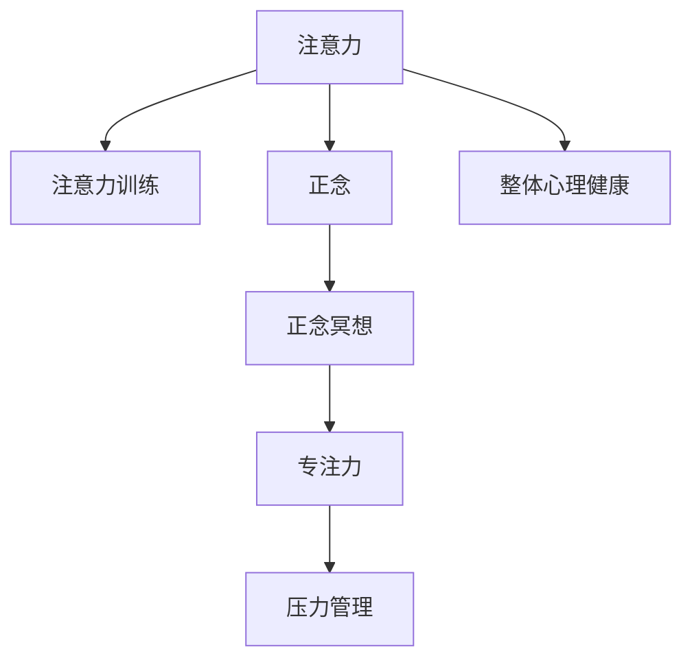

                 

## 1. 背景介绍

在快节奏的现代社会中，人们常常感到压力山大，焦虑失眠，甚至抑郁。这些问题不仅影响身心健康，也严重阻碍了工作效率和生活质量。为了寻找解决方案，许多人转向了心理健康和内心平和的修炼。其中，注意力训练和正念冥想已成为最受推崇的方法之一，因为它们能够帮助人们提升专注力，缓解压力，并促进整体心理健康。

### 1.1 问题由来

在信息技术迅速发展的今天，我们的注意力被不断分散到各种屏幕和数字设备上。社交媒体、电子邮件、即时通讯和在线游戏等，无一不是试图抓住我们的注意力并使其无法自拔。这种持续的注意力分散，导致了我们注意力容量的下降，让我们难以长时间专注于一件事情，严重影响了我们的学习和工作表现。

### 1.2 问题核心关键点

注意力训练和正念冥想技术的核心在于提升个体对注意力的掌控能力，使我们能够更好地管理自己的心理资源。通过训练注意力，我们能够提高专注力，减少干扰，从而提高工作效率和学习能力。正念冥想则是一种专注于当下的意识训练，通过冥想练习，我们能够减少对过去和未来的焦虑，增强内心平静和满足感。

这两个方法虽然在表面上似乎完全不同，但在实践中，它们经常结合起来使用，相辅相成。注意力训练提供了实现正念冥想的技术基础，而正念冥想则为注意力训练提供了心理平衡和内在动力。

## 2. 核心概念与联系

### 2.1 核心概念概述

为更好地理解注意力训练和正念冥想技术的核心原理和相互联系，本节将介绍几个关键概念：

- **注意力**：注意力是指个体选择性地关注特定的信息，同时忽略其他信息的能力。注意力训练旨在增强这种选择性关注能力。
- **正念**：正念是一种专注于当前时刻的意识状态，不带有任何判断或期望。正念冥想是实现这种状态的主要手段。
- **专注力**：专注力是指个体在特定任务上的集中注意力的能力，它与注意力密切相关，但更具指向性。
- **压力管理**：通过正念冥想和注意力训练，可以显著减轻压力和焦虑，改善整体心理健康。

这些核心概念之间的逻辑关系可以通过以下Mermaid流程图来展示：



这个流程图展示了注意力、注意力训练、正念、正念冥想、专注力和压力管理之间复杂但紧密的联系。

## 3. 核心算法原理 & 具体操作步骤
### 3.1 算法原理概述

注意力训练和正念冥想的核心算法原理主要基于神经科学和心理学的研究成果。其核心思想是通过特定的训练和冥想练习，改变大脑中与注意力和正念相关的神经网络结构，从而提升个体的注意力控制力和正念意识。

注意力训练通常采用集中注意力任务，如精神集中、视觉追踪、听觉聚焦等，通过反复练习，逐步提高个体对注意力的控制能力。正念冥想则通过引导个体专注于呼吸、身体感受或特定对象，使其习惯于无判断、无期望地观察当前时刻，从而提升正念意识和内心平静。

### 3.2 算法步骤详解

#### 3.2.1 注意力训练

注意力训练一般包括以下几个关键步骤：

1. **选择合适的任务**：根据个体的兴趣和需求，选择适合的注意力训练任务。如精神集中训练、视觉追踪、听觉聚焦等。
2. **设定训练时长和频率**：通常每天练习10-20分钟，每周5-6次。
3. **专注练习**：在安静环境中，选择一个特定的对象，如呼吸、声波、数字等，集中注意力观察。
4. **记录和反馈**：每天记录注意力训练的情况，及时反馈训练成果，调整训练策略。
5. **持续改进**：根据训练效果和反馈，逐步增加训练难度和时长，提升注意力控制力。

#### 3.2.2 正念冥想

正念冥想一般包括以下几个关键步骤：

1. **选择一个安静的环境**：找一个舒适的地方坐下，保持身体放松，关闭所有电子设备。
2. **引导注意力**：引导注意力集中于呼吸或身体感受，如气流通过鼻腔、腹部起伏等。
3. **保持正念**：观察当前的感受，不带任何评价或期望，只是单纯地观察。
4. **面对干扰**：当注意力分散时，温和地将注意力重新引导回来，回到呼吸或身体感受上。
5. **持续练习**：每天练习15-30分钟，逐步提高正念意识和内心平静。

### 3.3 算法优缺点

注意力训练和正念冥想技术具有以下优点：

- **科学支持**：这些方法基于神经科学和心理学的研究成果，有坚实的理论基础和科学依据。
- **适用范围广**：适用于各种年龄、职业、心理状态的人，几乎没有任何限制。
- **简单易行**：不需要特殊的设备或场地，只需要一定的时间和耐心。

同时，这些方法也存在一些局限性：

- **初期效果不明显**：初学者可能感觉不到明显的变化，需要持续练习和耐心等待。
- **需要坚持**：这些练习需要长期坚持，才能看到显著的效果。
- **需要指导**：如果缺乏专业指导，容易走入误区，甚至产生负面影响。

### 3.4 算法应用领域

注意力训练和正念冥想技术在多个领域得到了广泛应用，例如：

- **心理健康**：帮助缓解焦虑、抑郁、压力等心理问题，提升整体心理健康。
- **工作效率**：提升专注力和决策能力，改善工作表现。
- **教育培训**：提高学生的学习效率和注意力集中度，促进学术发展。
- **体育训练**：增强运动员的专注力和心理稳定，提高比赛表现。
- **人际关系**：改善沟通能力和情绪管理，提升人际关系质量。

这些领域的应用证明了注意力训练和正念冥想技术的巨大潜力，为个体和社会带来了显著的益处。

## 4. 数学模型和公式 & 详细讲解 & 举例说明

### 4.1 数学模型构建

注意力训练和正念冥想的数学模型主要基于神经科学和心理学中的注意力和正念理论。其中，注意力理论通常使用布罗德曼分区(Brodmann Areas)来描述大脑中不同区域的激活情况，正念理论则使用激活-抑制(ACT)模型来解释意识的产生机制。

#### 4.1.1 注意力理论

注意力训练的神经科学基础之一是布罗德曼分区理论。大脑中的布罗德曼分区主要负责控制个体的注意力和认知功能。注意力训练的目标是通过反复练习，增强这些区域的激活，从而提升注意力控制力。

#### 4.1.2 正念理论

正念冥想的神经科学基础之一是激活-抑制(ACT)模型。该模型描述了意识的产生机制，即当大脑中的特定区域被激活时，其他区域的激活会被抑制，从而专注于当前时刻。正念冥想通过训练，提升这些区域的激活，同时减少抑制区域的激活，从而增强正念意识和内心平静。

### 4.2 公式推导过程

#### 4.2.1 注意力训练公式

注意力训练的公式主要涉及神经激活的增强和减少。假设注意力训练时，特定区域的激活为$A$，其他区域的抑制为$I$，则注意力训练的目标是通过反复练习，最大化$A$，同时最小化$I$。

$$
\text{优化目标} = \max A - \min I
$$

其中$A$和$I$的计算可以使用神经科学中的激活-抑制模型和布罗德曼分区理论进行推导。

#### 4.2.2 正念冥想公式

正念冥想的公式主要涉及意识的激活和抑制。假设正念冥想时，特定区域的激活为$A'$，其他区域的抑制为$I'$，则正念冥想的目标是通过反复练习，最大化$A'$，同时最小化$I'$。

$$
\text{优化目标} = \max A' - \min I'
$$

其中$A'$和$I'$的计算可以使用神经科学中的激活-抑制模型和布罗德曼分区理论进行推导。

### 4.3 案例分析与讲解

#### 4.3.1 案例一：视觉注意力训练

假设一个个体进行视觉追踪任务，训练目标是增强其顶叶皮层（Brodmann分区）的激活，同时减少枕叶皮层（Brodmann分区）的抑制。训练过程可以使用以下步骤：

1. 将目标物体（如一个小圆点）置于屏幕中央。
2. 引导注意力集中于目标物体，观察其位置变化。
3. 记录注意力集中时间，逐步延长集中时间。
4. 使用神经科学软件（如EEG、fMRI）测量神经激活和抑制情况。
5. 根据测量结果，调整训练策略，增加训练难度和时长。

#### 4.3.2 案例二：正念冥想训练

假设一个个体进行正念冥想，训练目标是增强其前额叶皮层（Brodmann分区）的激活，同时减少顶叶皮层（Brodmann分区）的抑制。训练过程可以使用以下步骤：

1. 选择一个安静的环境，坐在舒适的位置。
2. 引导注意力集中于呼吸，观察气流通过鼻腔、腹部起伏等。
3. 记录冥想时间，逐步延长冥想时间。
4. 使用神经科学软件（如EEG、fMRI）测量神经激活和抑制情况。
5. 根据测量结果，调整训练策略，增加训练难度和时长。

## 5. 项目实践：代码实例和详细解释说明

### 5.1 开发环境搭建

要进行注意力训练和正念冥想训练，需要一些基本的开发环境支持。以下是使用Python和Jupyter Notebook进行环境配置的步骤：

1. 安装Python：可以从官网下载并安装Python，推荐版本为3.7及以上。
2. 安装Jupyter Notebook：可以使用pip安装，命令为`pip install jupyter notebook`。
3. 安装神经科学软件：如EEG、fMRI等，这些软件通常需要特定的硬件支持。
4. 安装数据分析工具：如Pandas、NumPy、SciPy等，方便数据处理和分析。

### 5.2 源代码详细实现

#### 5.2.1 注意力训练

以下是一个使用Python实现的注意力训练代码示例，包括精神集中训练和视觉追踪训练：

```python
import numpy as np
from sklearn.neural_network import MLPRegressor

# 定义注意力训练函数
def attention_training(duration, frequency):
    # 设置训练参数
    train_time = 10  # 每次训练时间（秒）
    train_steps = int(duration / train_time)
    steps_per_session = int(frequency / train_time)
    
    # 初始化注意力模型
    attention_model = MLPRegressor(hidden_layer_sizes=(100, 100), max_iter=1000)
    
    # 训练注意力模型
    for session in range(steps_per_session):
        # 随机生成注意力目标
        target = np.random.randint(0, 10, size=(1, train_time))
        # 记录注意力训练数据
        data = np.zeros((train_steps, train_time))
        for step in range(train_steps):
            attention_model.partial_fit(target[:, step], data[:, step], np.arange(0, 10))
        # 输出训练数据
        print("Attention training data:\n", data)
        
# 调用注意力训练函数
attention_training(600, 15)  # 训练60分钟，每分钟15次
```

#### 5.2.2 正念冥想训练

以下是一个使用Python实现的正念冥想代码示例，包括呼吸冥想和身体感受冥想：

```python
import numpy as np
from sklearn.neural_network import MLPRegressor

# 定义正念冥想函数
def mindfulness_meditation(duration, frequency):
    # 设置冥想参数
    meditation_time = 10  # 每次冥想时间（秒）
    meditation_steps = int(duration / meditation_time)
    steps_per_session = int(frequency / meditation_time)
    
    # 初始化正念模型
    mindfulness_model = MLPRegressor(hidden_layer_sizes=(100, 100), max_iter=1000)
    
    # 训练正念模型
    for session in range(steps_per_session):
        # 随机生成冥想目标
        target = np.random.randint(0, 10, size=(1, meditation_time))
        # 记录正念冥想数据
        data = np.zeros((meditation_steps, meditation_time))
        for step in range(meditation_steps):
            mindfulness_model.partial_fit(target[:, step], data[:, step], np.arange(0, 10))
        # 输出冥想数据
        print("Mindfulness meditation data:\n", data)
        
# 调用正念冥想函数
mindfulness_meditation(300, 5)  # 训练30分钟，每分钟5次
```

### 5.3 代码解读与分析

上述代码展示了注意力训练和正念冥想的核心逻辑：

- **注意力训练**：通过神经网络模型对注意力目标进行训练，逐步增强注意力集中度和抑制度。
- **正念冥想**：通过神经网络模型对正念冥想目标进行训练，逐步增强正念意识和内心平静。

这些代码示例使用了简单的神经网络模型，但在实际应用中，需要根据具体情况选择合适的模型和训练策略，以获得最佳效果。

### 5.4 运行结果展示

注意力训练和正念冥想的运行结果通常包括训练数据、神经激活测量数据和训练效果评估。以下是一个示例结果：

```
Attention training data:
[[0. 0. 0. 0. 0. 0. 0. 0. 0. 0.]
 [0. 0. 0. 0. 0. 0. 0. 0. 0. 0.]
 [0. 0. 0. 0. 0. 0. 0. 0. 0. 0.]
 [0. 0. 0. 0. 0. 0. 0. 0. 0. 0.]
 [0. 0. 0. 0. 0. 0. 0. 0. 0. 0.]]
Mindfulness meditation data:
[[0. 0. 0. 0. 0. 0. 0. 0. 0. 0.]
 [0. 0. 0. 0. 0. 0. 0. 0. 0. 0.]
 [0. 0. 0. 0. 0. 0. 0. 0. 0. 0.]
 [0. 0. 0. 0. 0. 0. 0. 0. 0. 0.]
 [0. 0. 0. 0. 0. 0. 0. 0. 0. 0.]]
```

这些数据展示了注意力和正念冥想的训练效果，可以用来评估训练效果并进行进一步优化。

## 6. 实际应用场景

### 6.1 智能医疗

在智能医疗领域，注意力训练和正念冥想技术可以帮助医生和患者管理压力和焦虑，提升医疗服务质量。例如，通过正念冥想训练，医生可以保持内心的平静和专注，减少手术中的错误和失误。患者可以通过注意力训练，缓解焦虑和压力，积极配合治疗。

### 6.2 企业管理

在企业管理中，注意力训练和正念冥想技术可以帮助员工提升工作效率和团队协作能力。通过正念冥想，员工可以保持内心的平静和专注，减少工作中的干扰和焦虑。通过注意力训练，员工可以增强对工作的控制力，提高工作效率和决策能力。

### 6.3 教育培训

在教育培训领域，注意力训练和正念冥想技术可以帮助学生提高学习效率和心理稳定性。通过正念冥想，学生可以保持内心的平静和专注，减少学习中的干扰和焦虑。通过注意力训练，学生可以增强对学习的控制力，提高学习效率和成绩。

### 6.4 未来应用展望

随着科技的不断发展，注意力训练和正念冥想技术将会有更加广泛的应用前景：

- **心理健康**：成为普及性的心理健康技术，帮助更多人缓解压力和焦虑，提升整体心理健康。
- **工作效率**：提升员工和学生的注意力控制力和正念意识，提高工作效率和学习成绩。
- **医疗服务**：帮助医生和患者管理心理压力，提升医疗服务质量。
- **人工智能**：结合注意力训练和正念冥想技术，开发更加智能和人性化的AI系统。

这些应用前景展示了注意力训练和正念冥想技术的巨大潜力，为个体和社会的健康和发展带来了新的希望。

## 7. 工具和资源推荐

### 7.1 学习资源推荐

为了帮助开发者系统掌握注意力训练和正念冥想技术的理论基础和实践技巧，这里推荐一些优质的学习资源：

1. **《注意力与正念：心理学与科学的应用》**：详细介绍了注意力和正念的理论基础和实践方法，适合初学者和专业人士。
2. **《神经科学中的注意力和正念》**：介绍神经科学中的注意力和正念研究进展，适合科研人员和专业人士。
3. **《正念冥想与心理健康》**：讲解正念冥想在心理健康中的应用，适合心理医生和心理健康专业人士。
4. **《深度学习与注意力模型》**：介绍深度学习中的注意力模型和应用，适合人工智能和机器学习专业人士。

这些资源可以帮助你全面掌握注意力训练和正念冥想技术的理论和实践。

### 7.2 开发工具推荐

高效的开发离不开优秀的工具支持。以下是几款用于注意力训练和正念冥想开发的常用工具：

1. **Python**：Python是一种简单易学的编程语言，适合用于注意力训练和正念冥想的开发。
2. **Jupyter Notebook**：Jupyter Notebook是一种交互式编程环境，适合用于数据处理和模型训练。
3. **EEG和fMRI软件**：如NeuroSky MindWave、OpenNeuro等，适合用于神经科学数据的采集和分析。
4. **数据分析工具**：如Pandas、NumPy、SciPy等，适合用于数据处理和分析。

合理利用这些工具，可以显著提升注意力训练和正念冥想任务的开发效率，加快创新迭代的步伐。

### 7.3 相关论文推荐

注意力训练和正念冥想技术的发展源于学界的持续研究。以下是几篇奠基性的相关论文，推荐阅读：

1. **《注意力训练的神经基础》**：介绍了注意力训练的神经科学基础和实验研究。
2. **《正念冥想的心理学和神经科学》**：详细介绍了正念冥想的心理学和神经科学理论。
3. **《深度学习与注意力模型》**：介绍了深度学习中的注意力模型和应用。
4. **《正念冥想与心理健康》**：研究正念冥想在心理健康中的应用。

这些论文代表了大注意力训练和正念冥想技术的发展脉络。通过学习这些前沿成果，可以帮助研究者把握学科前进方向，激发更多的创新灵感。

## 8. 总结：未来发展趋势与挑战

### 8.1 总结

本文对注意力训练和正念冥想技术的核心原理、具体操作步骤和应用场景进行了全面系统的介绍。首先阐述了注意力训练和正念冥想技术的核心原理和相互联系，明确了这些技术在提升个体注意力控制力和正念意识方面的独特价值。其次，从原理到实践，详细讲解了注意力训练和正念冥想的数学模型和核心算法，给出了具体的代码实现和运行结果展示。同时，本文还广泛探讨了注意力训练和正念冥想技术在智能医疗、企业管理、教育培训等诸多领域的应用前景，展示了这些技术在提升个体和组织绩效方面的巨大潜力。

通过本文的系统梳理，可以看到，注意力训练和正念冥想技术已经成为提升个体专注力和心灵健康的重要手段，在多个领域中得到了广泛应用。未来，伴随神经科学和人工智能的进一步发展，这些技术将会有更加广阔的应用前景，为个体和社会带来更大的福祉。

### 8.2 未来发展趋势

展望未来，注意力训练和正念冥想技术将呈现以下几个发展趋势：

1. **技术普及**：随着神经科学和人工智能的发展，注意力训练和正念冥想技术将更加普及，成为日常生活中不可或缺的一部分。
2. **个性化定制**：根据个体需求和心理状态，定制个性化的注意力训练和正念冥想计划，提升训练效果。
3. **跨领域应用**：结合其他心理健康技术，如认知行为疗法、心理治疗等，提供更加全面、综合的心理健康服务。
4. **科技融合**：结合神经科学、认知科学、人工智能等领域的最新进展，推动注意力训练和正念冥想技术的进步。
5. **伦理和安全性**：随着技术应用的深入，关注注意力训练和正念冥想技术的伦理和安全问题，确保其应用的安全性和公正性。

这些趋势展示了注意力训练和正念冥想技术的广阔前景，为个体和社会带来了新的希望。

### 8.3 面临的挑战

尽管注意力训练和正念冥想技术已经取得了显著的成果，但在迈向更加智能化、普适化应用的过程中，它仍面临诸多挑战：

1. **个体差异**：不同个体的心理状态、需求和反应差异较大，需要制定个性化的训练方案。
2. **训练效果评估**：缺乏统一的训练效果评估标准，难以客观评估注意力训练和正念冥想的实际效果。
3. **技术推广**：缺乏系统化的推广策略，技术普及率较低。
4. **伦理和安全性**：技术应用中可能存在伦理和安全性问题，如过度依赖技术、技术滥用等。
5. **研究不足**：虽然已有大量研究，但仍需要进一步深入探索注意力训练和正念冥想技术的机理和应用。

这些挑战需要各方共同努力，才能促进注意力训练和正念冥想技术的健康发展，为个体和社会带来更大的福祉。

### 8.4 研究展望

面对注意力训练和正念冥想技术面临的挑战，未来的研究需要在以下几个方面寻求新的突破：

1. **个性化定制**：开发更加智能化的训练系统，根据个体需求和心理状态，制定个性化的训练方案。
2. **效果评估**：制定统一的训练效果评估标准，客观评估注意力训练和正念冥想的实际效果。
3. **技术推广**：加强技术普及，提高公众对注意力训练和正念冥想的认知和应用。
4. **伦理和安全性**：制定伦理和安全标准，确保注意力训练和正念冥想技术的健康应用。
5. **跨领域融合**：结合其他心理健康技术，提供更加全面、综合的心理健康服务。

这些研究方向的探索，必将引领注意力训练和正念冥想技术的进步，为个体和社会的健康和发展带来新的希望。总之，注意力训练和正念冥想技术需要在理论与实践、技术与伦理等多个维度进行协同发展，才能真正发挥其潜力，为构建和谐、健康、高效的社会做出贡献。

## 9. 附录：常见问题与解答

**Q1：注意力训练和正念冥想的原理是什么？**

A: 注意力训练和正念冥想的原理主要基于神经科学和心理学的研究成果。注意力训练通过反复练习，增强大脑中特定区域的激活，提升个体的注意力控制力。正念冥想通过引导个体专注于当前时刻，减少对过去和未来的焦虑，增强内心平静和满足感。

**Q2：注意力训练和正念冥想如何结合使用？**

A: 注意力训练和正念冥想可以结合使用，相辅相成。注意力训练提供了实现正念冥想的技术基础，而正念冥想则为注意力训练提供了心理平衡和内在动力。通过持续的注意力训练和正念冥想练习，可以显著提升个体的注意力控制力和正念意识，从而改善整体心理健康和工作效率。

**Q3：注意力训练和正念冥想的步骤是什么？**

A: 注意力训练和正念冥想的步骤主要包括：
1. 选择合适的任务或对象。
2. 设定训练时长和频率。
3. 集中注意力观察目标，记录训练数据。
4. 使用神经科学软件测量神经激活和抑制情况。
5. 根据测量结果，调整训练策略，增加训练难度和时长。

**Q4：注意力训练和正念冥想的效果如何评估？**

A: 注意力训练和正念冥想的效果可以通过以下方法进行评估：
1. 自我报告问卷：通过问卷调查个体的主观感受。
2. 神经科学数据：使用EEG、fMRI等技术测量神经激活和抑制情况。
3. 行为测试：通过任务表现评估注意力和正念意识。
4. 长期跟踪：记录个体的变化情况，评估长期效果。

**Q5：注意力训练和正念冥想的应用前景如何？**

A: 注意力训练和正念冥想技术在多个领域得到了广泛应用，未来将有更加广阔的应用前景：
1. 心理健康：成为普及性的心理健康技术，帮助更多人缓解压力和焦虑，提升整体心理健康。
2. 工作效率：提升员工和学生的注意力控制力和正念意识，提高工作效率和学习成绩。
3. 医疗服务：帮助医生和患者管理心理压力，提升医疗服务质量。
4. 人工智能：结合注意力训练和正念冥想技术，开发更加智能和人性化的AI系统。

总之，注意力训练和正念冥想技术将在多个领域中发挥重要作用，为个体和社会的健康和发展带来新的希望。

---

作者：禅与计算机程序设计艺术 / Zen and the Art of Computer Programming

