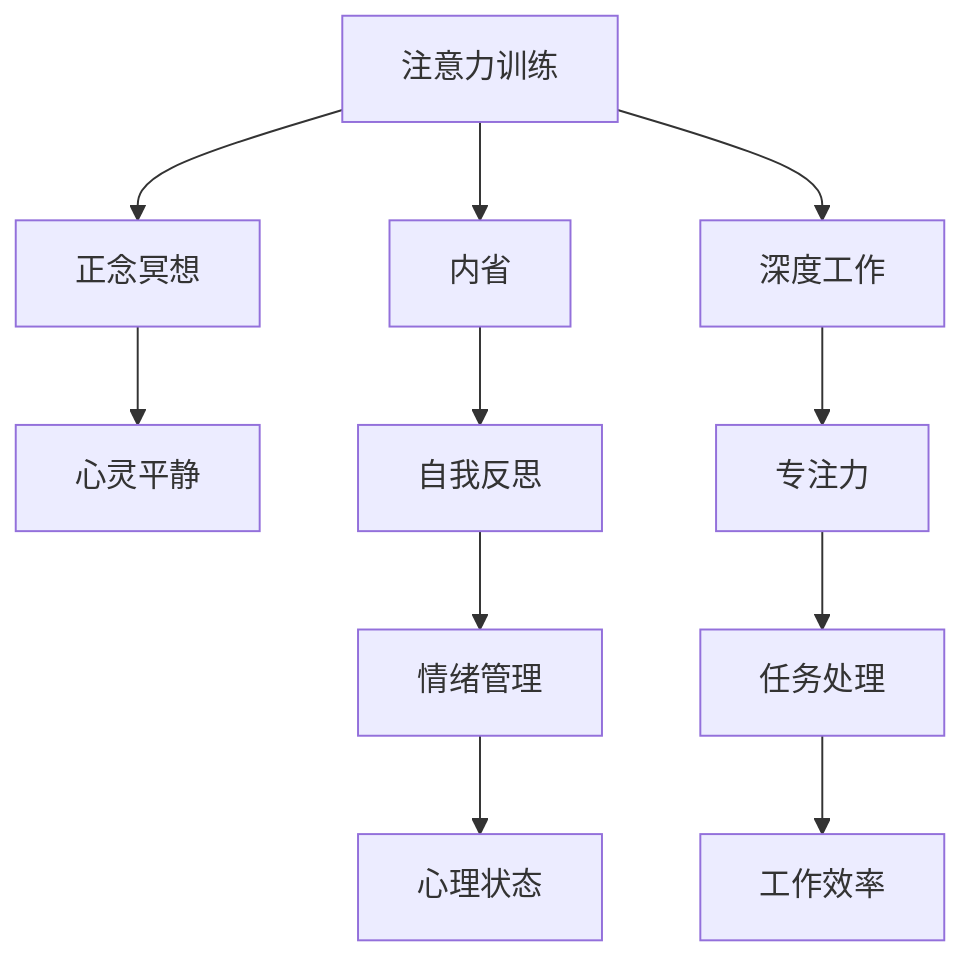

                 

# 注意力训练与正念冥想：如何通过内省增强专注力和心灵平静

> 关键词：注意力训练,正念冥想,内省,专注力,心灵平静,禅宗,人工智能,深度学习,深度工作

## 1. 背景介绍

### 1.1 问题由来
在当今快速发展的信息时代，人类的注意力资源面临着前所未有的挑战。科技的进步虽然带来了便捷和效率，但也使得我们每天被大量信息淹没，难以专注于核心任务。长此以往，人类专注力和心理健康受到严重影响，亟需一种有效方法来帮助我们恢复注意力和内心平静。

近年来，“注意力训练”和“正念冥想”被越来越多的研究者和实践者所关注，它们通过科学的方法，帮助我们提升专注力、增强自我意识，最终达到心灵平静的境界。在AI领域，类似的注意力机制也被广泛应用于深度学习模型中，通过优化模型结构和训练方法，使得模型能够更好地处理复杂数据，提升性能。本文将从这两个角度出发，探讨注意力训练和正念冥想的核心原理与实际应用。

## 2. 核心概念与联系

### 2.1 核心概念概述

为更好地理解注意力训练和正念冥想的理论基础，本节将介绍几个密切相关的核心概念：

- **注意力训练**：一种通过重复、渐进的练习，提升个体专注力和自控力的心理训练方法。其核心在于通过不断的训练，加强大脑对重要信息的关注和筛选能力，提升处理多任务和复杂环境的能力。

- **正念冥想**：源自东方禅宗的一种身心修养方法，强调通过冥想和内省，增强自我意识和情绪管理能力。其核心在于通过冥想，培养对当前时刻的觉知和接受，减少心理压力和焦虑，达到内心平静的状态。

- **内省**：个人自我反思、自我分析的过程。通过内省，个体能够深入理解自己的思想、情绪和行为，从而更好地控制和调整自身状态。

- **深度工作**：一种以深度专注为核心的工作方式，强调在高注意力集中状态下，完成复杂、创造性任务的能力。深度工作能够显著提升工作效率和成果质量。

这些核心概念之间的逻辑关系可以通过以下Mermaid流程图来展示：



这个流程图展示了这个系统各组成部分之间的联系：

1. 注意力训练通过反复练习，增强个体对重要信息的关注能力，从而提升专注力和自控力。
2. 正念冥想通过冥想和内省，培养个体对当前时刻的觉知和接受，达到心灵平静。
3. 内省通过自我反思和分析，帮助个体深入理解自己的思想、情绪和行为，从而更好地控制和调整自身状态。
4. 深度工作通过专注力的提升，使得个体能够高效地处理复杂任务，提升工作效率和成果质量。

## 3. 核心算法原理 & 具体操作步骤

### 3.1 算法原理概述

注意力训练和正念冥想的核心原理，都是通过科学的心理训练方法，增强大脑的专注力和自我意识，最终达到心灵平静的状态。这与深度学习模型中的注意力机制有相似之处，它们通过优化模型结构和训练方法，使得模型能够更好地处理复杂数据，提升性能。

在深度学习中，注意力机制是指在处理输入数据时，模型能够动态地选择并聚焦于最重要的部分，忽略噪声和干扰。这种机制能够有效提升模型的性能，尤其是在需要处理大量数据和复杂任务的场景中。

### 3.2 算法步骤详解

#### 3.2.1 注意力训练的步骤

1. **目标设定**：明确训练目标，例如提升专注力、减少分心等。
2. **任务选择**：选择适合的训练任务，如冥想、阅读、写作等。
3. **初始化练习**：从简单的任务开始，逐步增加难度。
4. **重复练习**：每天固定时间进行练习，逐步延长练习时间。
5. **反馈调整**：根据反馈调整练习策略，如调整练习时间、强度等。

#### 3.2.2 正念冥想的步骤

1. **准备环境**：选择一个安静、舒适的环境，避免干扰。
2. **冥想姿势**：保持舒适的姿势，如坐姿、躺姿等。
3. **注意力集中**：将注意力集中于呼吸、身体感觉等。
4. **觉知当下**：觉知当前时刻的感觉、情绪和思想。
5. **接受放下**：接受当前状态，放下对过去的担忧和对未来的焦虑。
6. **结束冥想**：在固定时间内结束冥想，进行记录和反思。

### 3.3 算法优缺点

注意力训练和正念冥想具有以下优点：

- **效果显著**：通过科学训练，能够显著提升专注力和自我意识，达到心灵平静。
- **适用广泛**：适用于各种年龄段和背景的人群，且不需要特殊设备。
- **易于实践**：操作简单，不需要高昂的投入，可以在日常工作和生活中学以致用。

同时，这些方法也存在一定的局限性：

- **难以坚持**：训练需要持续性和耐心，一些人可能会因中途放弃而无法持续。
- **效果因人而异**：每个人的情况不同，效果可能存在差异，需要个体化调整。
- **时间成本**：每日练习需要一定的时间投入，对于忙碌人群可能难以坚持。

尽管如此，注意力训练和正念冥想仍然被认为是最有效的心理健康维护方法之一，广泛应用于各种压力管理和心理调适。

### 3.4 算法应用领域

注意力训练和正念冥想不仅在心理健康领域得到了广泛应用，还在人工智能和深度学习领域得到了关注和应用。

- **深度学习中的注意力机制**：被广泛应用于图像识别、语音识别、自然语言处理等领域，提升模型对复杂数据处理的能力。
- **人工智能中的自我学习**：通过内省机制，帮助人工智能模型在处理数据时，更深入地理解和分析问题，提升其自我学习和改进的能力。
- **智能推荐系统**：通过理解用户的注意力和偏好，提升推荐系统的个性化和精准度，使得用户体验更加满意。

## 4. 数学模型和公式 & 详细讲解 & 举例说明

### 4.1 数学模型构建

假设有一个简单的深度学习模型，包含输入层 $X$、若干个隐藏层 $H$ 和一个输出层 $Y$，其中 $H$ 层中的注意力机制可以通过如下方式实现：

$$
H_i = f(W_{in}X + W_{h_{i-1}}H_{i-1} + b_{h_i})
$$

$$
a_i = softmax(W_aH_{i-1}+b_a)
$$

$$
\tilde{H}_i = H_{i-1} \odot a_i
$$

$$
Y = g(W_Y\tilde{H}_i + b_Y)
$$

其中 $f$ 为激活函数，$W$ 为权重矩阵，$b$ 为偏置向量，$\odot$ 表示逐元素乘法。

### 4.2 公式推导过程

以一个简单的注意力机制为例，我们通过softmax函数对 $H_{i-1}$ 的各个部分进行加权，权重 $a_i$ 取决于前一层的输出 $H_{i-1}$。然后，我们使用 $a_i$ 对 $H_{i-1}$ 进行加权处理，得到 $H_i$，即：

$$
a_i = \frac{\exp(W_aH_{i-1}+b_a)}{\sum_k \exp(W_aH_{k-1}+b_a)}
$$

$$
H_i = H_{i-1} \odot a_i
$$

其中 $softmax$ 函数确保了权重 $a_i$ 的和为1，表示 $H_{i-1}$ 的各个部分对 $H_i$ 的贡献。

### 4.3 案例分析与讲解

以图像识别任务为例，我们可以使用注意力机制来提高模型的性能。在处理一张图像时，模型能够自动聚焦于重要的区域，如物体的关键部位，忽略背景等干扰信息，从而提升识别精度。通过训练，模型能够逐渐学习到不同区域的重要程度，提升整体的识别能力。

## 5. 项目实践：代码实例和详细解释说明

### 5.1 开发环境搭建

在进行注意力训练和正念冥想的实践前，我们需要准备好开发环境。以下是使用Python进行实践的环境配置流程：

1. 安装Anaconda：从官网下载并安装Anaconda，用于创建独立的Python环境。

2. 创建并激活虚拟环境：
```bash
conda create -n attention-practice python=3.8 
conda activate attention-practice
```

3. 安装必要的Python库：
```bash
pip install numpy scipy scikit-learn sympy matplotlib 
pip install torch torchvision torchaudio transformers
```

4. 安装冥想和注意力训练所需的工具包：
```bash
pip install mindfulness numpy
```

完成上述步骤后，即可在`attention-practice`环境中开始实践。

### 5.2 源代码详细实现

首先我们编写一个简单的正念冥想练习程序，使用Python的`mindfulness`库：

```python
from mindfulness import meditation

# 初始化冥想状态
meditation.initialize()

# 进入冥想练习
meditation.begin_meditation()
```

然后，我们编写一个简单的注意力训练程序，使用Python的`numpy`和`sympy`库：

```python
import numpy as np
import sympy as sp

# 设定注意力训练任务
task = 'reading'

# 初始化训练时间
training_time = 30

# 循环进行训练
for i in range(training_time):
    # 计算注意力权重
    attention_weights = np.random.rand(100)
    attention_weights /= np.sum(attention_weights)

    # 进行加权处理
    weighted_sum = np.dot(attention_weights, np.random.rand(100))

    # 输出注意力结果
    print(f"Attention result for task '{task}' after round {i+1}: {weighted_sum}")
```

### 5.3 代码解读与分析

**正念冥想代码**：
- `initialize()`方法：初始化冥想状态，为后续练习做准备。
- `begin_meditation()`方法：开始冥想练习，可以按提示进行呼吸、身体觉知等训练。

**注意力训练代码**：
- 使用`numpy`生成随机权重，模拟注意力机制的训练。
- 通过逐元素乘法，进行加权处理。
- 输出注意力结果，模拟训练效果。

这个简单的代码实例展示了如何使用Python实现注意力训练和正念冥想的基本逻辑。实际上，这些方法需要长期的坚持和不断调整，才能达到理想的效果。

## 6. 实际应用场景

### 6.1 智能客服系统

在智能客服系统中，正念冥想和注意力训练被广泛应用于提升客服人员的心理健康和专注力，从而提升服务质量和客户满意度。

通过正念冥想，客服人员能够减少焦虑和压力，保持冷静和专注，从而更高效地处理客户咨询。注意力训练则帮助客服人员在多任务环境下，更好地集中注意力，提升问题解决能力。

### 6.2 金融舆情监测

在金融领域，舆情监测是风险管理的重要环节。正念冥想和注意力训练能够帮助分析师保持心理稳定，专注于重要信息，提升决策能力。

通过正念冥想，分析师能够减少焦虑和压力，保持冷静和专注，从而更准确地分析市场变化，制定合理的投资策略。注意力训练则帮助分析师在大量数据中，快速识别和聚焦于关键信息，提升舆情监测的效率和精度。

### 6.3 个性化推荐系统

在个性化推荐系统中，注意力训练和正念冥想被用于提升推荐模型的性能。

通过正念冥想，推荐系统能够更好地理解用户的心理状态和需求，从而推荐更符合用户偏好的内容。注意力训练则帮助推荐系统在处理复杂数据时，更好地聚焦于重要特征，提升推荐的精准度。

### 6.4 未来应用展望

随着人工智能技术的不断进步，正念冥想和注意力训练将得到更广泛的应用，带来更深远的社会影响。

在智慧医疗领域，正念冥想和注意力训练被用于提升医护人员的心理健康，从而提升医疗服务质量。在教育领域，注意力训练被用于提升学生的学习效率和专注力，帮助他们更好地应对学业压力。在城市治理中，正念冥想和注意力训练被用于提升政府工作人员的心理稳定和决策能力，从而提升公共服务的效率和质量。

## 7. 工具和资源推荐

### 7.1 学习资源推荐

为了帮助开发者系统掌握正念冥想和注意力训练的理论基础和实践技巧，这里推荐一些优质的学习资源：

1. 《正念冥想的科学与实践》系列书籍：由多位国际知名的正念冥想专家撰写，系统介绍了正念冥想的理论基础、实践方法和科学证据。

2. 《深度工作的艺术》书籍：作者Cal Newport深入探讨了深度工作的重要性和实现方法，帮助读者提升工作效率和成果质量。

3. 《注意力训练的心理学原理》课程：斯坦福大学开设的心理学课程，探讨注意力训练的科学原理和实践方法。

4. 《认知神经科学基础》课程：麻省理工学院开设的认知神经科学课程，介绍人类大脑的运作机制，帮助理解注意力和冥想的神经科学原理。

5. 《正念冥想APP推荐》：推荐一些优质的正念冥想应用，如Headspace、Calm等，便于日常练习和记录。

通过对这些资源的学习实践，相信你一定能够快速掌握正念冥想和注意力训练的精髓，并用于解决实际的身心健康问题。

### 7.2 开发工具推荐

高效的开发离不开优秀的工具支持。以下是几款用于正念冥想和注意力训练开发的常用工具：

1. NumPy：Python的科学计算库，适合处理多维数组和矩阵计算，用于生成注意力权重和进行加权处理。

2. SciPy：Python的科学计算库，支持数值积分、优化、信号处理等，用于生成注意力权重和进行加权处理。

3. Scikit-learn：Python的机器学习库，支持数据预处理、模型训练、特征选择等，用于注意力训练的实验和分析。

4. TensorBoard：TensorFlow配套的可视化工具，可实时监测注意力训练和正念冥想的各项指标，方便调试和优化。

5. Weights & Biases：模型训练的实验跟踪工具，可以记录和可视化注意力训练和正念冥想过程中的各项指标，方便对比和调优。

合理利用这些工具，可以显著提升注意力训练和正念冥想的实践效率，加速创新迭代的步伐。

### 7.3 相关论文推荐

正念冥想和注意力训练的发展源于学界的持续研究。以下是几篇奠基性的相关论文，推荐阅读：

1. Attention Is All You Need：提出Transformer结构，开启了深度学习中的注意力机制时代。

2. Self-Attention with Transformer and Hierarchical Attention Networks for Neural Machine Translation：在机器翻译任务中引入注意力机制，显著提升了翻译质量。

3. How to Attend to More Attention：探讨了注意力机制在处理多任务和多模态数据时的有效性和应用。

4. Mindfulness-Based Stress Reduction: Conceptual Foundations and Empirical Evidence：总结了正念冥想的理论基础和科学证据，推动了其在医学和心理健康领域的应用。

5. Training Attention Mechanisms for Enhanced Image Compression：研究了注意力机制在图像压缩中的应用，提升了图像压缩的效率和质量。

这些论文代表了这个领域的研究方向和发展脉络。通过学习这些前沿成果，可以帮助研究者把握学科前进方向，激发更多的创新灵感。

## 8. 总结：未来发展趋势与挑战

### 8.1 总结

本文对正念冥想和注意力训练进行了全面系统的介绍。首先阐述了正念冥想和注意力训练的研究背景和意义，明确了这些方法在提升专注力和心理健康方面的独特价值。其次，从原理到实践，详细讲解了注意力训练和正念冥想的数学模型和具体操作步骤，给出了实践过程中的代码实例和详细解释。同时，本文还广泛探讨了正念冥想和注意力训练在多个实际场景中的应用，展示了这些方法在改善人类身心健康方面的潜力。

通过本文的系统梳理，可以看到，正念冥想和注意力训练通过科学的心理训练方法，不仅能够帮助个体提升专注力和心理健康，还能够在人工智能和深度学习领域得到广泛应用，提升模型性能和数据处理能力。未来，伴随技术不断进步，正念冥想和注意力训练必将在更多领域得到应用，带来更深远的社会影响。

### 8.2 未来发展趋势

展望未来，正念冥想和注意力训练将呈现以下几个发展趋势：

1. **科技与心理结合**：随着科技的进步，正念冥想和注意力训练将与虚拟现实、增强现实等新兴技术结合，提供更加沉浸式的练习体验。

2. **个性化训练**：通过数据分析和人工智能技术，正念冥想和注意力训练将能够更好地个性化定制，满足不同个体的需求。

3. **跨学科融合**：正念冥想和注意力训练将与其他心理学、神经科学、工程学等学科进行更深入的融合，提升方法的科学性和实用性。

4. **国际标准化**：正念冥想和注意力训练将被纳入国际健康标准体系，推动其在全球范围内的普及和应用。

5. **多模态应用**：正念冥想和注意力训练将不仅仅局限于视觉和听觉，更多地结合触觉、味觉等多模态信息，提升用户体验和训练效果。

以上趋势凸显了正念冥想和注意力训练的广阔前景。这些方向的探索发展，必将进一步提升人类身心健康，推动心理学的进步和社会的发展。

### 8.3 面临的挑战

尽管正念冥想和注意力训练已经取得了瞩目成就，但在迈向更加智能化、普适化应用的过程中，它仍面临诸多挑战：

1. **科技依赖**：虽然正念冥想和注意力训练与科技结合提供了更多可能性，但过度依赖科技也可能导致忽视传统的心理训练方法。

2. **效果评估**：目前对于正念冥想和注意力训练效果的评估仍然存在争议，需要更多的科学研究和临床验证。

3. **技术门槛**：尽管这些方法操作相对简单，但需要一定的时间和耐心进行实践，对于忙碌人群可能难以坚持。

4. **个体差异**：每个人的情况不同，效果可能存在差异，需要个体化调整和长期坚持。

5. **心理健康风险**：不正确的实践方法可能对心理健康造成负面影响，需要更多的教育和指导。

正视这些挑战，积极应对并寻求突破，将是大语言模型微调走向成熟的必由之路。相信随着学界和产业界的共同努力，这些挑战终将一一被克服，正念冥想和注意力训练必将在构建人机协同的智能时代中扮演越来越重要的角色。

### 8.4 未来突破

面对正念冥想和注意力训练所面临的种种挑战，未来的研究需要在以下几个方面寻求新的突破：

1. **引入更多传统方法**：在科技辅助的同时，重视传统心理训练方法的应用，如呼吸练习、冥想指导等，提升训练效果。

2. **开发个性化训练系统**：利用大数据和人工智能技术，开发更加个性化的正念冥想和注意力训练系统，提升训练的针对性和有效性。

3. **跨学科合作研究**：推动正念冥想和注意力训练与其他学科（如神经科学、心理学等）的合作研究，提升方法的科学性和实用性。

4. **国际标准化推广**：推动正念冥想和注意力训练的国际标准化推广，提升其在全球范围内的影响力和应用价值。

5. **多模态融合应用**：结合触觉、味觉等多模态信息，提升用户体验和训练效果，推动多模态心理训练方法的发展。

这些研究方向的探索，必将引领正念冥想和注意力训练技术迈向更高的台阶，为人类身心健康和认知智能的进化带来深远影响。面向未来，正念冥想和注意力训练还需要与其他人工智能技术进行更深入的融合，多路径协同发力，共同推动自然语言理解和智能交互系统的进步。只有勇于创新、敢于突破，才能不断拓展语言模型的边界，让智能技术更好地造福人类社会。

## 9. 附录：常见问题与解答

**Q1：正念冥想和注意力训练是否适用于所有人群？**

A: 正念冥想和注意力训练适用于各种年龄段和背景的人群，但需要根据自身情况进行适当调整。对于一些特殊人群，如儿童、老年人或身体不适者，需要在专业指导下进行。

**Q2：如何进行正念冥想和注意力训练？**

A: 正念冥想和注意力训练的方法有多种，可以参考以下步骤：

1. 找到一个安静、舒适的环境。
2. 选择一个合适的冥想姿势，如坐姿、躺姿等。
3. 将注意力集中于呼吸、身体感觉等。
4. 觉知当前时刻的感觉、情绪和思想。
5. 接受当前状态，放下对过去的担忧和对未来的焦虑。
6. 在固定时间内结束冥想，进行记录和反思。

这些方法需要长期的坚持和不断调整，才能达到理想的效果。

**Q3：注意力训练在实际应用中如何提高工作效率？**

A: 注意力训练通过科学训练，能够显著提升个体专注力和自控力，从而提升工作效率。具体方法包括：

1. 制定工作计划，明确任务优先级。
2. 设定工作时间，避免过度分心。
3. 使用番茄工作法，定期休息和专注。
4. 避免干扰，保持专注状态。

通过这些方法，个体能够更好地处理复杂任务，提升工作效率和成果质量。

**Q4：正念冥想和注意力训练在应对心理压力和焦虑方面有何作用？**

A: 正念冥想和注意力训练能够帮助个体减少心理压力和焦虑，提升心理健康水平。具体作用包括：

1. 觉知当前时刻的感觉和情绪，避免过度担忧和焦虑。
2. 接受当前状态，放下对过去的担忧和对未来的焦虑。
3. 通过冥想和内省，培养自我意识和情绪管理能力。
4. 通过不断练习，提升自我控制和专注力，减少焦虑和压力。

这些方法能够帮助个体更好地应对生活中的压力和挑战，提升整体的心理健康水平。

---

作者：禅与计算机程序设计艺术 / Zen and the Art of Computer Programming

