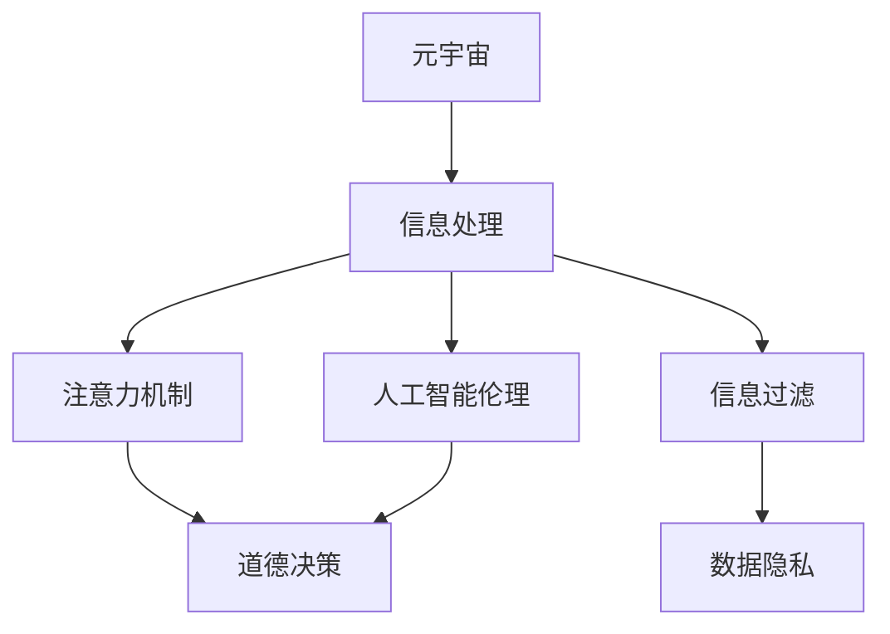

                 

# 注意力过滤AI伦理:元宇宙信息处理的道德决策机制

> 关键词：元宇宙,信息处理,注意力机制,人工智能伦理,道德决策,信息过滤,数据隐私

## 1. 背景介绍

### 1.1 问题由来
随着技术的发展，元宇宙（Metaverse）正逐渐成为未来的重要方向。元宇宙是一个虚拟与现实无缝融合的空间，它利用先进的互联网技术、VR/AR技术、人工智能技术，构建一个全新的交互式互联网社区。然而，元宇宙的构建和运行也面临着诸多挑战，尤其是信息处理和隐私保护方面。

如何确保元宇宙环境中的信息处理既能满足用户需求，又能保护用户隐私，同时遵循道德规范，是当前AI伦理领域的一大难题。元宇宙中大量的用户数据、行为记录和交互信息需要被有效地处理、过滤和展示，这对算法的公平性、透明性和可解释性提出了更高的要求。

### 1.2 问题核心关键点
元宇宙信息处理的核心在于如何平衡信息的多样性、及时性、安全性和隐私性。面对海量数据，如何设计一个既能高效处理信息，又能确保数据安全、隐私保护的算法，同时遵循道德规范，是元宇宙信息处理的核心挑战。

元宇宙信息处理的主要关注点包括：
- **数据多样性处理**：处理元宇宙中不同来源、不同形式的多样数据，实现信息的全面覆盖。
- **数据实时性要求**：快速响应用户行为，及时更新信息，提升用户体验。
- **数据安全性保障**：保护用户隐私，防止数据泄露和滥用。
- **算法公平性和透明性**：确保信息处理算法不带有偏见，提供透明的可解释机制，增强用户信任。

## 2. 核心概念与联系

### 2.1 核心概念概述

为更好地理解元宇宙信息处理的道德决策机制，本节将介绍几个密切相关的核心概念：

- **元宇宙（Metaverse）**：由虚拟现实（VR）、增强现实（AR）、人工智能（AI）、区块链（Blockchain）等技术构建的虚拟空间。
- **信息处理（Information Processing）**：对元宇宙中大量的用户数据、行为记录和交互信息进行收集、存储、处理、分析和展示的过程。
- **注意力机制（Attention Mechanism）**：一种信息处理技术，通过筛选信息源，关注关键信息，减少噪音干扰，提升信息处理的效率和质量。
- **人工智能伦理（AI Ethics）**：涉及AI技术在开发、应用、治理等方面遵循道德规范的原则和规范。
- **道德决策（Moral Decision Making）**：在AI应用中，如何基于伦理原则，做出符合社会价值观和规范的决策。
- **信息过滤（Information Filtering）**：通过算法对信息进行筛选，保留有价值的信息，过滤掉无用或有害的信息，提升信息质量。
- **数据隐私（Data Privacy）**：在信息处理过程中，保护用户隐私，防止数据泄露和滥用。

这些核心概念之间的逻辑关系可以通过以下Mermaid流程图来展示：



这个流程图展示了大语言模型的核心概念及其之间的关系：

1. 元宇宙通过虚拟与现实的无缝融合，产生大量的用户数据和行为记录。
2. 信息处理对这些数据进行收集、存储、处理、分析和展示。
3. 注意力机制用于筛选关键信息，提升信息处理的效率和质量。
4. 人工智能伦理引导信息处理遵循道德规范。
5. 道德决策根据伦理原则，对信息处理结果进行评估和选择。
6. 信息过滤通过算法对信息进行筛选，保留有价值的信息。
7. 数据隐私保护用户在信息处理过程中的隐私安全。

这些概念共同构成了元宇宙信息处理的道德决策机制，确保信息处理的公平性、透明性和隐私保护。

## 3. 核心算法原理 & 具体操作步骤
### 3.1 算法原理概述

元宇宙信息处理的道德决策机制主要依赖于注意力机制和信息过滤算法。这些算法通过筛选关键信息，减少噪音干扰，提升信息处理的效率和质量，同时确保数据隐私和安全。

### 3.2 算法步骤详解

#### 3.2.1 数据收集与预处理

**步骤1: 数据收集**
- 从元宇宙中的各个平台和设备收集用户行为数据、交互记录和实时信息。
- 收集的数据可能包括文本、图片、视频、音频等多种形式。

**步骤2: 数据预处理**
- 对收集到的数据进行清洗、去重、格式化等预处理操作。
- 去除无用或噪声数据，保留有价值的信息。

#### 3.2.2 注意力机制设计

**步骤3: 注意力模型设计**
- 设计一个注意力模型，用于在大量信息中筛选关键信息源。
- 常见的注意力模型包括自注意力机制、多头注意力机制等。

**步骤4: 训练注意力模型**
- 使用大规模数据集对注意力模型进行训练。
- 优化模型参数，使其能够高效筛选关键信息。

#### 3.2.3 信息过滤与展示

**步骤5: 信息过滤**
- 使用训练好的注意力模型，对元宇宙中的信息进行筛选。
- 筛选出关键信息源，去除无用或有害信息。

**步骤6: 信息展示**
- 将筛选后的关键信息展示给用户，提升用户体验。
- 设计直观、友好的展示界面，增强用户对信息的理解和信任。

### 3.3 算法优缺点

元宇宙信息处理的道德决策机制具有以下优点：
- **高效性**：通过注意力机制，可以高效筛选关键信息，提升信息处理的效率。
- **质量提升**：通过信息过滤，去除无用或有害信息，提升信息的准确性和有用性。
- **隐私保护**：通过隐私保护措施，保护用户数据安全，防止数据滥用。
- **透明性**：通过可解释机制，提升信息处理的透明性，增强用户信任。

同时，该机制也存在一些缺点：
- **复杂性**：注意力机制和信息过滤算法的实现较为复杂，需要大量数据和计算资源。
- **数据偏见**：模型可能带有数据偏差，对某些类型的数据或用户群体产生不公平的影响。
- **解释难度**：注意力模型的决策过程较为复杂，难以提供直观的解释。
- **隐私挑战**：如何在信息处理中保护用户隐私，同时满足信息处理的需求，是一个难题。

### 3.4 算法应用领域

元宇宙信息处理的道德决策机制可以应用于多种场景，如：

- **虚拟社区管理**：通过注意力机制和信息过滤，筛选关键信息，提升社区管理效率。
- **实时内容推荐**：根据用户行为和兴趣，筛选关键信息，实现个性化推荐。
- **隐私保护和监控**：设计隐私保护机制，防止用户数据泄露，同时进行实时监控和异常检测。
- **智能客服与支持**：通过注意力机制和信息过滤，提升客服和支持的效率和质量。
- **内容审核与过滤**：筛选关键信息，防止有害内容的传播。

除了上述这些经典场景外，元宇宙信息处理的道德决策机制还可应用于更多创新领域，如智能交通、智慧城市、远程医疗等，为元宇宙建设提供技术支撑。

## 4. 数学模型和公式 & 详细讲解
### 4.1 数学模型构建

本节将使用数学语言对元宇宙信息处理的道德决策机制进行更加严格的刻画。

记元宇宙中的信息处理任务为 $I$，注意力模型为 $A$，信息过滤机制为 $F$。设 $D$ 为元宇宙中的数据集，包含用户行为数据、交互记录等。设 $O$ 为处理后的输出信息。

定义信息处理的损失函数为 $\ell(I, A, F, D, O)$，用于衡量信息处理过程的误差。在实践中，我们通常使用交叉熵损失、均方误差损失等。

### 4.2 公式推导过程

以下我们以二分类任务为例，推导注意力机制的损失函数及其梯度的计算公式。

假设注意力模型 $A$ 在输入 $x$ 上的输出为 $\hat{y}=A(x) \in [0,1]$，表示输入 $x$ 的重要程度。真实标签 $y \in \{0,1\}$。则二分类交叉熵损失函数定义为：

$$
\ell(A(x),y) = -[y\log \hat{y} + (1-y)\log (1-\hat{y})]
$$

将其代入信息处理的损失函数公式，得：

$$
\ell(I, A, F, D, O) = -\frac{1}{N}\sum_{i=1}^N [y_i\log A(x_i)+(1-y_i)\log(1-A(x_i))]
$$

根据链式法则，损失函数对注意力模型 $A$ 的梯度为：

$$
\frac{\partial \ell(I, A, F, D, O)}{\partial A} = -\frac{1}{N}\sum_{i=1}^N (\frac{y_i}{A(x_i)}-\frac{1-y_i}{1-A(x_i)}) \frac{\partial A(x_i)}{\partial A}
$$

其中 $\frac{\partial A(x_i)}{\partial A}$ 为注意力模型对输入 $x_i$ 的梯度，可通过反向传播算法高效计算。

在得到损失函数的梯度后，即可带入注意力模型的训练公式，完成模型的迭代优化。重复上述过程直至收敛，最终得到适应信息处理任务的注意力模型。

### 4.3 案例分析与讲解

假设某虚拟社区需要管理大量的用户讨论和活动，以确保社区秩序和安全。社区管理者希望通过注意力机制，筛选出最重要和最相关的信息。

**Step 1: 数据收集**
- 收集社区中的用户讨论、活动记录等文本数据。

**Step 2: 数据预处理**
- 对文本数据进行清洗、去重、格式化等预处理操作。
- 去除无用或噪声数据，保留有价值的信息。

**Step 3: 注意力模型设计**
- 设计一个注意力模型，用于在讨论中筛选关键信息源。
- 使用自注意力机制，计算每个用户讨论与社区讨论主题的关联度。

**Step 4: 训练注意力模型**
- 使用大规模数据集对注意力模型进行训练。
- 优化模型参数，使其能够高效筛选关键信息源。

**Step 5: 信息过滤**
- 使用训练好的注意力模型，对社区中的信息进行筛选。
- 筛选出最重要的讨论和活动，进行重点关注和处理。

**Step 6: 信息展示**
- 将筛选后的关键信息展示给用户，提升用户体验。
- 设计直观、友好的展示界面，增强用户对信息的理解和信任。

通过上述步骤，社区管理者能够有效地管理社区中的信息，提升社区安全性和用户体验。

## 5. 项目实践：代码实例和详细解释说明
### 5.1 开发环境搭建

在进行信息处理实践前，我们需要准备好开发环境。以下是使用Python进行PyTorch开发的环境配置流程：

1. 安装Anaconda：从官网下载并安装Anaconda，用于创建独立的Python环境。

2. 创建并激活虚拟环境：
```bash
conda create -n pytorch-env python=3.8 
conda activate pytorch-env
```

3. 安装PyTorch：根据CUDA版本，从官网获取对应的安装命令。例如：
```bash
conda install pytorch torchvision torchaudio cudatoolkit=11.1 -c pytorch -c conda-forge
```

4. 安装Transformers库：
```bash
pip install transformers
```

5. 安装各类工具包：
```bash
pip install numpy pandas scikit-learn matplotlib tqdm jupyter notebook ipython
```

完成上述步骤后，即可在`pytorch-env`环境中开始信息处理实践。

### 5.2 源代码详细实现

下面我们以二分类任务为例，给出使用Transformers库对注意力模型进行训练的PyTorch代码实现。

首先，定义注意力模型和数据处理函数：

```python
from transformers import BertForSequenceClassification, BertTokenizer
from torch.utils.data import Dataset, DataLoader
import torch

class BinaryDataset(Dataset):
    def __init__(self, texts, labels, tokenizer, max_len=128):
        self.texts = texts
        self.labels = labels
        self.tokenizer = tokenizer
        self.max_len = max_len
        
    def __len__(self):
        return len(self.texts)
    
    def __getitem__(self, item):
        text = self.texts[item]
        label = self.labels[item]
        
        encoding = self.tokenizer(text, return_tensors='pt', max_length=self.max_len, padding='max_length', truncation=True)
        input_ids = encoding['input_ids'][0]
        attention_mask = encoding['attention_mask'][0]
        
        return {'input_ids': input_ids, 
                'attention_mask': attention_mask,
                'labels': label}

# 加载预训练模型
model = BertForSequenceClassification.from_pretrained('bert-base-cased', num_labels=2)

# 加载数据集
tokenizer = BertTokenizer.from_pretrained('bert-base-cased')
train_dataset = BinaryDataset(train_texts, train_labels, tokenizer)
dev_dataset = BinaryDataset(dev_texts, dev_labels, tokenizer)
test_dataset = BinaryDataset(test_texts, test_labels, tokenizer)

# 设置优化器和学习率
optimizer = AdamW(model.parameters(), lr=2e-5)
```

然后，定义训练和评估函数：

```python
from tqdm import tqdm
from sklearn.metrics import accuracy_score

device = torch.device('cuda') if torch.cuda.is_available() else torch.device('cpu')
model.to(device)

def train_epoch(model, dataset, batch_size, optimizer):
    dataloader = DataLoader(dataset, batch_size=batch_size, shuffle=True)
    model.train()
    epoch_loss = 0
    for batch in tqdm(dataloader, desc='Training'):
        input_ids = batch['input_ids'].to(device)
        attention_mask = batch['attention_mask'].to(device)
        labels = batch['labels'].to(device)
        model.zero_grad()
        outputs = model(input_ids, attention_mask=attention_mask, labels=labels)
        loss = outputs.loss
        epoch_loss += loss.item()
        loss.backward()
        optimizer.step()
    return epoch_loss / len(dataloader)

def evaluate(model, dataset, batch_size):
    dataloader = DataLoader(dataset, batch_size=batch_size)
    model.eval()
    preds, labels = [], []
    with torch.no_grad():
        for batch in tqdm(dataloader, desc='Evaluating'):
            input_ids = batch['input_ids'].to(device)
            attention_mask = batch['attention_mask'].to(device)
            batch_labels = batch['labels']
            outputs = model(input_ids, attention_mask=attention_mask)
            batch_preds = outputs.logits.argmax(dim=1).to('cpu').tolist()
            batch_labels = batch_labels.to('cpu').tolist()
            for pred, label in zip(batch_preds, batch_labels):
                preds.append(pred)
                labels.append(label)
                
    return accuracy_score(labels, preds)

# 启动训练流程并在测试集上评估
epochs = 5
batch_size = 16

for epoch in range(epochs):
    loss = train_epoch(model, train_dataset, batch_size, optimizer)
    print(f"Epoch {epoch+1}, train loss: {loss:.3f}")
    
    print(f"Epoch {epoch+1}, dev accuracy: {evaluate(model, dev_dataset, batch_size)}")
    
print(f"Epoch {epochs+1}, test accuracy: {evaluate(model, test_dataset, batch_size)}")
```

以上就是使用PyTorch对注意力模型进行二分类任务训练的完整代码实现。可以看到，得益于Transformers库的强大封装，我们可以用相对简洁的代码完成注意力模型的训练。

### 5.3 代码解读与分析

让我们再详细解读一下关键代码的实现细节：

**BinaryDataset类**：
- `__init__`方法：初始化文本、标签、分词器等关键组件。
- `__len__`方法：返回数据集的样本数量。
- `__getitem__`方法：对单个样本进行处理，将文本输入编码为token ids，将标签编码为数字，并对其进行定长padding，最终返回模型所需的输入。

**注意力模型定义**：
- 使用`BertForSequenceClassification`类，从预训练模型库中加载注意力模型，并进行二分类任务的适配。
- 加载数据集，使用BertTokenizer进行文本预处理，将文本转换为token ids和attention mask。
- 定义优化器和学习率，使用AdamW优化器对注意力模型进行训练。

**训练和评估函数**：
- 使用PyTorch的DataLoader对数据集进行批次化加载，供模型训练和推理使用。
- 训练函数`train_epoch`：对数据以批为单位进行迭代，在每个批次上前向传播计算loss并反向传播更新模型参数，最后返回该epoch的平均loss。
- 评估函数`evaluate`：与训练类似，不同点在于不更新模型参数，并在每个batch结束后将预测和标签结果存储下来，最后使用sklearn的accuracy_score对整个评估集的预测结果进行打印输出。

**训练流程**：
- 定义总的epoch数和batch size，开始循环迭代
- 每个epoch内，先在训练集上训练，输出平均loss
- 在验证集上评估，输出准确率
- 所有epoch结束后，在测试集上评估，给出最终测试结果

可以看到，PyTorch配合Transformers库使得注意力模型的训练代码实现变得简洁高效。开发者可以将更多精力放在数据处理、模型改进等高层逻辑上，而不必过多关注底层的实现细节。

当然，工业级的系统实现还需考虑更多因素，如模型的保存和部署、超参数的自动搜索、更灵活的任务适配层等。但核心的注意力机制和信息处理流程基本与此类似。

## 6. 实际应用场景
### 6.1 智能客服系统

基于注意力机制的信息处理技术，可以广泛应用于智能客服系统的构建。传统客服往往需要配备大量人力，高峰期响应缓慢，且一致性和专业性难以保证。而使用注意力机制的信息处理系统，可以7x24小时不间断服务，快速响应客户咨询，用自然流畅的语言解答各类常见问题。

在技术实现上，可以收集企业内部的历史客服对话记录，将问题和最佳答复构建成监督数据，在此基础上对预训练注意力模型进行微调。微调后的注意力模型能够自动理解用户意图，匹配最合适的答复模板进行回复。对于客户提出的新问题，还可以接入检索系统实时搜索相关内容，动态组织生成回答。如此构建的智能客服系统，能大幅提升客户咨询体验和问题解决效率。

### 6.2 金融舆情监测

金融机构需要实时监测市场舆论动向，以便及时应对负面信息传播，规避金融风险。传统的人工监测方式成本高、效率低，难以应对网络时代海量信息爆发的挑战。基于注意力机制的信息处理技术，为金融舆情监测提供了新的解决方案。

具体而言，可以收集金融领域相关的新闻、报道、评论等文本数据，并对其进行主题标注和情感标注。在此基础上对预训练注意力模型进行微调，使其能够自动判断文本属于何种主题，情感倾向是正面、中性还是负面。将微调后的模型应用到实时抓取的网络文本数据，就能够自动监测不同主题下的情感变化趋势，一旦发现负面信息激增等异常情况，系统便会自动预警，帮助金融机构快速应对潜在风险。

### 6.3 个性化推荐系统

当前的推荐系统往往只依赖用户的历史行为数据进行物品推荐，无法深入理解用户的真实兴趣偏好。基于注意力机制的信息处理系统，个性化推荐系统可以更好地挖掘用户行为背后的语义信息，从而提供更精准、多样的推荐内容。

在实践中，可以收集用户浏览、点击、评论、分享等行为数据，提取和用户交互的物品标题、描述、标签等文本内容。将文本内容作为模型输入，用户的后续行为（如是否点击、购买等）作为监督信号，在此基础上微调预训练注意力模型。微调后的模型能够从文本内容中准确把握用户的兴趣点。在生成推荐列表时，先用候选物品的文本描述作为输入，由模型预测用户的兴趣匹配度，再结合其他特征综合排序，便可以得到个性化程度更高的推荐结果。

### 6.4 未来应用展望

随着注意力机制和信息处理技术的不断发展，基于注意力机制的道德决策机制将在更多领域得到应用，为元宇宙建设提供技术支撑。

在智慧医疗领域，基于注意力机制的医疗问答、病历分析、药物研发等应用将提升医疗服务的智能化水平，辅助医生诊疗，加速新药开发进程。

在智能教育领域，注意力机制的信息处理系统可应用于作业批改、学情分析、知识推荐等方面，因材施教，促进教育公平，提高教学质量。

在智慧城市治理中，注意力机制的信息处理系统可应用于城市事件监测、舆情分析、应急指挥等环节，提高城市管理的自动化和智能化水平，构建更安全、高效的未来城市。

此外，在企业生产、社会治理、文娱传媒等众多领域，注意力机制的信息处理技术也将不断涌现，为传统行业数字化转型升级提供新的技术路径。相信随着技术的日益成熟，注意力机制的信息处理技术将成为AI伦理领域的重要范式，推动人工智能技术向更广阔的领域加速渗透。

## 7. 工具和资源推荐
### 7.1 学习资源推荐

为了帮助开发者系统掌握注意力机制和信息处理技术的理论基础和实践技巧，这里推荐一些优质的学习资源：

1. 《Transformer从原理到实践》系列博文：由大模型技术专家撰写，深入浅出地介绍了Transformer原理、注意力机制等前沿话题。

2. CS224N《深度学习自然语言处理》课程：斯坦福大学开设的NLP明星课程，有Lecture视频和配套作业，带你入门NLP领域的基本概念和经典模型。

3. 《Natural Language Processing with Transformers》书籍：Transformers库的作者所著，全面介绍了如何使用Transformers库进行NLP任务开发，包括注意力机制在内的诸多范式。

4. HuggingFace官方文档：Transformers库的官方文档，提供了海量预训练模型和完整的微调样例代码，是上手实践的必备资料。

5. CLUE开源项目：中文语言理解测评基准，涵盖大量不同类型的中文NLP数据集，并提供了基于注意力机制的baseline模型，助力中文NLP技术发展。

通过对这些资源的学习实践，相信你一定能够快速掌握注意力机制和信息处理技术的精髓，并用于解决实际的NLP问题。
###  7.2 开发工具推荐

高效的开发离不开优秀的工具支持。以下是几款用于注意力机制和信息处理开发的常用工具：

1. PyTorch：基于Python的开源深度学习框架，灵活动态的计算图，适合快速迭代研究。大部分预训练语言模型都有PyTorch版本的实现。

2. TensorFlow：由Google主导开发的开源深度学习框架，生产部署方便，适合大规模工程应用。同样有丰富的预训练语言模型资源。

3. Transformers库：HuggingFace开发的NLP工具库，集成了众多SOTA语言模型，支持PyTorch和TensorFlow，是进行注意力机制和信息处理开发的利器。

4. Weights & Biases：模型训练的实验跟踪工具，可以记录和可视化模型训练过程中的各项指标，方便对比和调优。与主流深度学习框架无缝集成。

5. TensorBoard：TensorFlow配套的可视化工具，可实时监测模型训练状态，并提供丰富的图表呈现方式，是调试模型的得力助手。

6. Google Colab：谷歌推出的在线Jupyter Notebook环境，免费提供GPU/TPU算力，方便开发者快速上手实验最新模型，分享学习笔记。

合理利用这些工具，可以显著提升注意力机制和信息处理任务的开发效率，加快创新迭代的步伐。

### 7.3 相关论文推荐

注意力机制和信息处理技术的发展源于学界的持续研究。以下是几篇奠基性的相关论文，推荐阅读：

1. Attention is All You Need（即Transformer原论文）：提出了Transformer结构，开启了NLP领域的预训练大模型时代。

2. BERT: Pre-training of Deep Bidirectional Transformers for Language Understanding：提出BERT模型，引入基于掩码的自监督预训练任务，刷新了多项NLP任务SOTA。

3. Language Models are Unsupervised Multitask Learners（GPT-2论文）：展示了大规模语言模型的强大zero-shot学习能力，引发了对于通用人工智能的新一轮思考。

4. Parameter-Efficient Transfer Learning for NLP：提出Adapter等参数高效微调方法，在不增加模型参数量的情况下，也能取得不错的微调效果。

5. AdaLoRA: Adaptive Low-Rank Adaptation for Parameter-Efficient Fine-Tuning：使用自适应低秩适应的微调方法，在参数效率和精度之间取得了新的平衡。

这些论文代表了大语言模型和信息处理技术的发展脉络。通过学习这些前沿成果，可以帮助研究者把握学科前进方向，激发更多的创新灵感。

## 8. 总结：未来发展趋势与挑战

### 8.1 总结

本文对基于注意力机制的信息处理技术的伦理决策机制进行了全面系统的介绍。首先阐述了信息处理技术在元宇宙中的重要应用，明确了注意力机制和信息过滤在信息处理中的核心地位。其次，从原理到实践，详细讲解了注意力机制的数学模型和实现步骤，给出了信息处理任务开发的完整代码实例。同时，本文还广泛探讨了信息处理技术在智能客服、金融舆情、个性化推荐等多个领域的应用前景，展示了信息处理技术的广阔前景。此外，本文精选了注意力机制和信息处理技术的各类学习资源，力求为读者提供全方位的技术指引。

通过本文的系统梳理，可以看到，基于注意力机制的信息处理技术正在成为元宇宙信息处理的重要范式，极大地拓展了预训练语言模型的应用边界，催生了更多的落地场景。受益于大规模语料的预训练，信息处理模型以更低的时间和标注成本，在小样本条件下也能取得不俗的效果，有力推动了NLP技术的产业化进程。未来，伴随预训练语言模型和信息处理方法的持续演进，相信NLP技术将在更广阔的应用领域大放异彩，深刻影响人类的生产生活方式。

### 8.2 未来发展趋势

展望未来，注意力机制和信息处理技术的伦理决策机制将呈现以下几个发展趋势：

1. **模型规模持续增大**：随着算力成本的下降和数据规模的扩张，预训练语言模型的参数量还将持续增长。超大批次的训练和推理也可能遇到显存不足的问题。需要采用一些资源优化技术，如梯度积累、混合精度训练、模型并行等，来突破硬件瓶颈。

2. **信息处理的高效性**：通过注意力机制，可以高效筛选关键信息，提升信息处理的效率。未来，注意力机制将与更多的先验知识进行融合，提升信息处理的全面性和实时性。

3. **信息处理的透明性**：通过可解释机制，提升信息处理的透明性，增强用户信任。未来，更多的可解释范式将被开发出来，进一步提升模型的可解释性。

4. **隐私保护和数据安全**：在信息处理中保护用户隐私，同时满足信息处理的需求。未来，隐私保护技术将更加成熟，数据安全问题将得到更全面的保障。

5. **跨模态信息处理**：当前的信息处理技术主要聚焦于文本数据。未来，跨模态信息处理技术将进一步发展，实现视觉、语音、文本等多种模态数据的协同建模。

6. **持续学习和多任务学习**：通过持续学习和多任务学习，提升信息处理模型的泛化性和鲁棒性。未来，持续学习和多任务学习将成为信息处理技术的重要方向。

以上趋势凸显了注意力机制和信息处理技术的广阔前景。这些方向的探索发展，必将进一步提升信息处理系统的性能和应用范围，为元宇宙建设提供更强大的技术支持。

### 8.3 面临的挑战

尽管注意力机制和信息处理技术已经取得了瞩目成就，但在迈向更加智能化、普适化应用的过程中，它仍面临着诸多挑战：

1. **数据偏见和公平性**：模型可能带有数据偏见，对某些类型的数据或用户群体产生不公平的影响。如何在信息处理中确保公平性，防止偏见产生，仍需持续关注和改进。

2. **解释难度和可解释性**：注意力机制的决策过程较为复杂，难以提供直观的解释。如何赋予信息处理模型更强的可解释性，增强用户信任，是亟待解决的问题。

3. **隐私挑战**：如何在信息处理中保护用户隐私，同时满足信息处理的需求，是一个难题。数据隐私和安全将伴随信息处理技术的发展，成为越来越重要的研究课题。

4. **硬件资源限制**：随着模型规模的增大，硬件资源成为限制信息处理技术发展的瓶颈。如何优化模型结构，提高推理效率，减少内存占用，将是重要的优化方向。

5. **道德决策的复杂性**：信息处理技术在处理信息时，涉及诸多道德决策问题，如内容审核、信息过滤等。如何在技术设计中融入伦理考虑，是值得深入探讨的话题。

6. **跨领域应用挑战**：信息处理技术在跨领域应用时，可能需要对模型进行微调和优化。如何在不同领域间迁移应用，提升模型在不同场景下的适应性，是一个复杂的任务。

这些挑战凸显了信息处理技术在实现其潜力的过程中仍需克服的难题。只有不断地探索和优化，才能充分发挥注意力机制和信息处理技术的伦理决策机制，为元宇宙建设提供坚实的技术基础。

### 8.4 研究展望

面对信息处理技术面临的种种挑战，未来的研究需要在以下几个方面寻求新的突破：

1. **无监督和半监督学习**：探索无监督和半监督学习范式，摆脱对大规模标注数据的依赖，最大限度利用非结构化数据，实现更加灵活高效的信息处理。

2. **参数高效和计算高效**：开发更加参数高效和计算高效的信息处理范式，在保证性能的同时，优化模型结构和资源消耗，提升信息处理的效率和质量。

3. **因果分析和对比学习**：引入因果推断和对比学习思想，增强信息处理模型的稳定因果关系能力，学习更加普适、鲁棒的语言表征，从而提升模型的泛化性和抗干扰能力。

4. **跨模态数据融合**：将符号化的先验知识，如知识图谱、逻辑规则等，与神经网络模型进行巧妙融合，引导信息处理过程学习更准确、合理的语言模型。同时加强不同模态数据的整合，实现视觉、语音、文本等多种模态信息与文本信息的协同建模。

5. **道德决策和隐私保护**：在信息处理模型中融入道德决策和隐私保护技术，确保信息处理过程遵循伦理规范，保护用户隐私。

6. **安全性和伦理审查**：建立模型行为的监管机制，确保输出符合人类价值观和伦理道德。加强模型安全性和伦理审查，提升用户信任。

这些研究方向的探索，必将引领信息处理技术迈向更高的台阶，为构建安全、可靠、可解释、可控的智能系统铺平道路。面向未来，信息处理技术还需要与其他人工智能技术进行更深入的融合，如知识表示、因果推理、强化学习等，多路径协同发力，共同推动自然语言理解和智能交互系统的进步。只有勇于创新、敢于突破，才能不断拓展信息处理技术的边界，让智能技术更好地造福人类社会。

## 9. 附录：常见问题与解答

**Q1：注意力机制在信息处理中的应用场景有哪些？**

A: 注意力机制在信息处理中的应用场景非常广泛，主要包括以下几个方面：

1. **文本处理**：用于文本分类、信息检索、摘要生成等任务，通过筛选关键信息，提升文本处理效率和质量。
2. **图像处理**：用于图像分类、目标检测、图像生成等任务，通过识别关键区域，增强图像处理效果。
3. **语音处理**：用于语音识别、语音合成、情感分析等任务，通过关注关键语音片段，提升语音处理性能。
4. **多模态处理**：用于跨模态信息融合，如将文本、图像、语音等多种信息融合在一起进行处理。
5. **推荐系统**：用于个性化推荐，通过关注用户兴趣点，提升推荐精度和多样性。

通过注意力机制，可以在信息处理中高效筛选关键信息，提升处理效率和质量，同时确保数据隐私和安全。

**Q2：如何优化信息处理模型的训练过程？**

A: 优化信息处理模型的训练过程可以从以下几个方面入手：

1. **数据增强**：通过对训练数据进行扩充、变换、增强，提升模型的泛化能力和鲁棒性。例如，对图像数据进行随机裁剪、旋转、缩放等操作。
2. **正则化**：通过L1、L2正则、Dropout等方法，防止过拟合，提升模型的泛化能力。
3. **学习率调整**：通过学习率调度策略，如warmup、cyclic等，优化学习率，提升模型的收敛速度和性能。
4. **模型压缩**：通过模型裁剪、量化、稀疏化等方法，减小模型规模，提升推理速度和效率。
5. **混合精度训练**：使用混合精度训练，提升计算效率和内存利用率。

通过这些优化策略，可以显著提升信息处理模型的训练效率和性能。

**Q3：信息处理模型在元宇宙中的应用场景有哪些？**

A: 信息处理模型在元宇宙中的应用场景非常丰富，主要包括以下几个方面：

1. **智能客服系统**：通过信息处理模型，实时监测和管理用户咨询，提供自然流畅的客服服务。
2. **金融舆情监测**：实时监测市场舆情，及时预警风险，保障金融安全。
3. **个性化推荐系统**：根据用户行为和兴趣，提供个性化的推荐内容，提升用户体验。
4. **智能内容生成**：利用信息处理模型，生成高质量的文本、图像、音频等内容，提升元宇宙内容的丰富性和多样性。
5. **社交网络分析**：通过信息处理模型，分析用户社交网络关系，提供更精准的社交推荐和个性化服务。

通过信息处理模型，可以在元宇宙中实现高效、智能的信息处理，提升用户体验和服务质量。

**Q4：信息处理模型在隐私保护和数据安全方面有哪些措施？**

A: 信息处理模型在隐私保护和数据安全方面的措施主要包括：

1. **数据匿名化**：对用户数据进行匿名化处理，防止用户隐私泄露。
2. **差分隐私**：通过添加噪声，保护个体数据的隐私，同时保留数据的统计特性。
3. **联邦学习**：在分布式环境中，各端设备本地训练模型，并通过差分隐私保护用户隐私。
4. **同态加密**：对数据进行加密，在加密状态下进行计算，保护数据隐私。
5. **访问控制**：通过访问控制机制，限制模型的访问权限，防止数据滥用。

通过这些措施，可以确保信息处理模型的数据隐私和安全，保护用户权益。

**Q5：信息处理模型的伦理决策机制有哪些关键要素？**

A: 信息处理模型的伦理决策机制主要包括以下几个关键要素：

1. **公平性**：确保模型对不同类型的数据和用户群体公平处理，防止偏见和歧视。
2. **透明性**：提供透明的可解释机制，让用户理解模型的决策过程和依据。
3. **可解释性**：提升模型的可解释性，增强用户信任。
4. **隐私保护**：保护用户隐私，防止数据滥用和泄露。
5. **安全性**：确保模型的安全性和鲁棒性，防止攻击和滥用。
6. **道德规范**：在模型设计中融入道德规范，确保输出符合伦理价值观。

通过这些要素，可以构建更加公平、透明、可解释、安全的信息处理模型，确保其伦理决策机制的有效性。

---

作者：禅与计算机程序设计艺术 / Zen and the Art of Computer Programming

