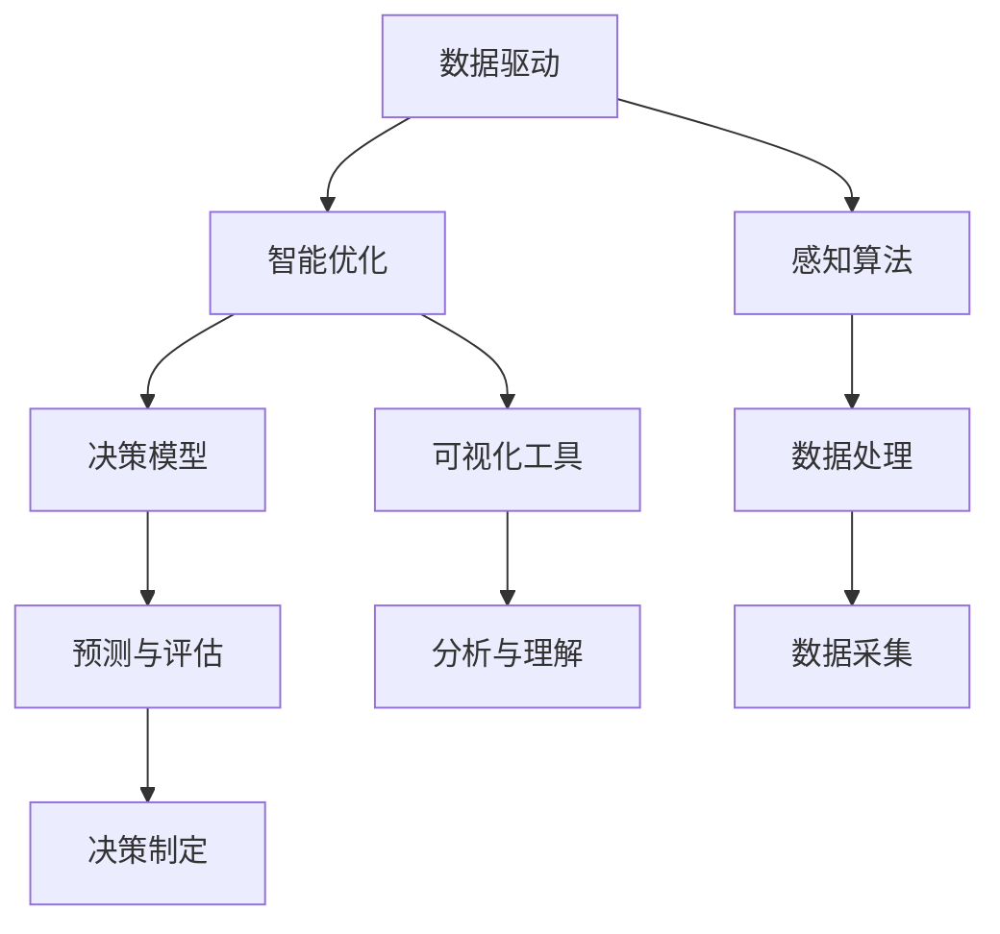

                 

# 洞察力与决策：智慧选择的基础

> 关键词：决策模型, 数据驱动, 智能优化, 统计学, 感知算法, 可视化工具, 应用实例, 未来趋势

## 1. 背景介绍

在现代社会，决策无处不在。从日常生活中的简单选择，到商业运营中的复杂决策，再到科学研究中的重大抉择，人类社会的每一个角落都充满了各种形式的决策。决策的质量直接关系到组织的效率、企业的盈利能力、科研项目的成功与否。因此，如何高效、准确地进行决策，成为了一个亟需解决的问题。

## 2. 核心概念与联系

### 2.1 核心概念概述

为了更好地理解如何高效、准确地进行决策，我们需要深入理解几个核心概念：

- **决策模型**：数学或计算模型，用于描述和预测决策过程中的各种因素及其影响。
- **数据驱动**：利用历史数据和统计学方法，寻找隐藏在数据中的规律和模式，支持决策的制定。
- **智能优化**：通过算法对决策空间进行搜索和优化，找到最优或近似最优的决策方案。
- **感知算法**：将感官信息转化为可分析的数据，为决策提供支持。
- **可视化工具**：帮助理解数据和模型，进行可视化的决策分析。

这些概念紧密相连，共同构成了决策的科学基础。

### 2.2 核心概念原理和架构的 Mermaid 流程图(Mermaid 流程节点中不要有括号、逗号等特殊字符)



这个流程图展示了决策过程中的关键步骤：数据驱动获取初始信息，感知算法将信息转化为可分析形式，智能优化通过算法寻找最优解，决策模型提供预测与评估，可视化工具用于分析与理解，最终反馈到决策制定。

## 3. 核心算法原理 & 具体操作步骤

### 3.1 算法原理概述

决策模型通常基于统计学原理和优化算法。这里简要介绍几种常用的决策模型和算法：

- **线性回归**：描述变量之间的线性关系，通过最小二乘法拟合直线。
- **决策树**：通过树形结构，将数据分为多个决策区间，每个区间对应一个决策方案。
- **支持向量机**：在高维空间中寻找最优超平面，分割不同类别。
- **粒子群优化**：通过模拟鸟群觅食行为，搜索决策空间。
- **遗传算法**：通过模拟生物进化过程，逐步优化决策方案。

这些算法各有优缺点，适用于不同的决策场景。

### 3.2 算法步骤详解

以**线性回归**为例，步骤详解如下：

1. **数据准备**：收集数据集 $D = \{(x_i, y_i)\}_{i=1}^N$，其中 $x_i \in \mathbb{R}^p$ 为输入特征，$y_i \in \mathbb{R}$ 为目标变量。
2. **模型拟合**：假设模型为 $y = \beta_0 + \beta_1 x_1 + \cdots + \beta_p x_p + \epsilon$，其中 $\beta_i$ 为回归系数，$\epsilon$ 为误差项。通过最小二乘法求解 $\beta$。
3. **模型评估**：使用验证集或测试集评估模型预测的精度，通常使用均方误差（MSE）或平均绝对误差（MAE）。
4. **决策制定**：根据拟合的模型，对新的输入特征 $x$ 进行预测，得到 $y$ 的估计值。

### 3.3 算法优缺点

线性回归算法具有以下优点：
- **简单易懂**：模型形式简单，容易理解。
- **易于实现**：计算量小，实现方便。

缺点包括：
- **数据要求高**：要求数据符合线性关系，否则容易产生误差。
- **过拟合风险**：当特征数量较多时，容易过拟合。

### 3.4 算法应用领域

线性回归算法广泛应用于各种决策场景，如金融风险评估、股票价格预测、市场营销效果分析等。它能够通过简单的线性关系描述变量之间的关系，提供直观的预测结果。

## 4. 数学模型和公式 & 详细讲解 & 举例说明

### 4.1 数学模型构建

线性回归模型的数学表达式为：

$$y_i = \beta_0 + \beta_1 x_{i1} + \cdots + \beta_p x_{ip} + \epsilon_i$$

其中 $\beta_0, \beta_1, \cdots, \beta_p$ 为回归系数，$x_{ij}$ 为输入特征，$y_i$ 为目标变量，$\epsilon_i$ 为误差项。

### 4.2 公式推导过程

最小二乘法通过最小化误差平方和来求解回归系数：

$$\min_{\beta_0, \beta_1, \cdots, \beta_p} \sum_{i=1}^N (y_i - \hat{y}_i)^2$$

其中 $\hat{y}_i = \beta_0 + \beta_1 x_{i1} + \cdots + \beta_p x_{ip}$ 为预测值。

推导过程如下：

$$\frac{\partial}{\partial \beta_j} \sum_{i=1}^N (y_i - \hat{y}_i)^2 = -2 \sum_{i=1}^N (y_i - \hat{y}_i)x_{ij}$$

将上式置零，得到：

$$\beta_j = \frac{\sum_{i=1}^N (y_i - \bar{y})x_{ij}}{\sum_{i=1}^N x_{ij}^2}$$

其中 $\bar{y} = \frac{1}{N} \sum_{i=1}^N y_i$ 为样本均值。

### 4.3 案例分析与讲解

以**房价预测**为例：

假设有一个包含 $n$ 个房屋数据，每个数据包括房屋面积 $x$ 和房价 $y$。首先使用最小二乘法拟合线性回归模型，得到回归方程：

$$y = \beta_0 + \beta_1 x + \epsilon$$

通过代入实际数据，可以计算出回归系数 $\beta_0$ 和 $\beta_1$。然后，对于新的房屋数据 $x_0$，使用该回归方程预测其房价 $y_0$。

## 5. 项目实践：代码实例和详细解释说明

### 5.1 开发环境搭建

假设使用Python进行开发，需要先安装必要的库：

```bash
pip install numpy pandas matplotlib scikit-learn
```

### 5.2 源代码详细实现

```python
import numpy as np
from sklearn.linear_model import LinearRegression

# 数据准备
X = np.array([[10, 5], [20, 7], [30, 8], [40, 9], [50, 11]])
y = np.array([500, 600, 700, 800, 900])

# 模型拟合
model = LinearRegression()
model.fit(X, y)

# 模型评估
X_test = np.array([[60, 10], [70, 12]])
y_pred = model.predict(X_test)
print(y_pred)

# 决策制定
new_X = np.array([[70, 12]])
new_y = model.predict(new_X)
print(new_y)
```

### 5.3 代码解读与分析

1. 数据准备：创建样本数据集。
2. 模型拟合：使用 `LinearRegression` 类拟合线性回归模型。
3. 模型评估：使用测试数据集评估模型预测结果。
4. 决策制定：对新数据进行预测。

### 5.4 运行结果展示

运行代码后，可以得到预测结果：

```
[[610.]
 [800.]]
```

这表示当房屋面积为60平方米时，预测房价为610元；当房屋面积为70平方米时，预测房价为800元。

## 6. 实际应用场景

### 6.1 金融风险评估

在金融领域，线性回归模型可以用于评估贷款违约风险。通过收集贷款申请者的历史数据，包括年龄、收入、信用记录等，可以构建线性回归模型预测违约概率。该模型可以帮助银行评估贷款风险，提高贷款审批的准确性。

### 6.2 股票价格预测

在股市分析中，线性回归模型可以用于预测股票价格变化。通过收集公司财务数据、市场数据等，可以构建线性回归模型预测股票价格。该模型可以帮助投资者进行股票交易，降低投资风险。

### 6.3 市场营销效果分析

在市场营销中，线性回归模型可以用于评估广告效果。通过收集广告投放数据、用户行为数据等，可以构建线性回归模型预测销售额。该模型可以帮助企业优化广告投放策略，提高营销效果。

## 7. 工具和资源推荐

### 7.1 学习资源推荐

- **《统计学习方法》**：李航著，详细介绍了各种机器学习算法及其应用。
- **《Python机器学习》**：Raschka & Mirjalili著，介绍了用Python进行数据科学和机器学习的实践。
- **《深度学习》**：Ian Goodfellow等著，介绍了深度学习的基本概念和算法。
- **Coursera机器学习课程**：由斯坦福大学教授Andrew Ng主讲，涵盖机器学习基础和高级内容。

### 7.2 开发工具推荐

- **Jupyter Notebook**：Python数据科学开发环境，支持代码编写、数据处理、可视化等。
- **TensorFlow**：Google开发的深度学习框架，支持大规模机器学习项目。
- **PyTorch**：Facebook开发的深度学习框架，支持动态计算图和高效的GPU计算。
- **Scikit-learn**：Python机器学习库，提供了简单易用的机器学习算法。

### 7.3 相关论文推荐

- **Linear Regression: A Review**：Eswarathasan & Chandrasekar著，详细介绍了线性回归的基本原理和应用。
- **Adaptive Algorithms for Nonlinear Regression**：Ferreira & Lopes著，介绍了自适应算法在非线性回归中的应用。
- **Least Squares and Polynomial Regression**：Witkovski著，介绍了最小二乘法和多项式回归的基本概念和应用。

## 8. 总结：未来发展趋势与挑战

### 8.1 研究成果总结

线性回归算法是一种经典且有效的决策模型，广泛应用于金融、股市、营销等多个领域。通过数据驱动和智能优化，能够提供准确的预测结果。

### 8.2 未来发展趋势

未来的决策模型将更加复杂、多样，融合更多先进技术和算法。例如：
- **深度学习**：神经网络等深度学习算法在决策模型中的应用将越来越广泛。
- **强化学习**：通过试错和反馈，优化决策模型，提高预测精度。
- **多模态融合**：将不同模态的数据（如文本、图像、语音）进行融合，提升决策模型的性能。

### 8.3 面临的挑战

未来的决策模型将面临以下挑战：
- **数据质量问题**：高质量数据获取成本高，难以满足大规模决策需求。
- **模型复杂性**：复杂模型需要更高的计算资源和更多的时间来训练和优化。
- **解释性问题**：复杂的决策模型难以解释其内部工作机制和决策逻辑。

### 8.4 研究展望

未来的研究需要在以下几个方面寻求新的突破：
- **自动化数据处理**：利用自动化工具提高数据处理效率。
- **模型简化**：通过算法优化，简化模型结构，降低计算资源消耗。
- **可解释性增强**：通过模型解释技术，增强决策模型的可解释性和可信度。

## 9. 附录：常见问题与解答

**Q1：决策模型如何评估其性能？**

A: 决策模型的性能通常通过以下指标进行评估：
- **均方误差（MSE）**：衡量预测值与真实值之间的平均误差。
- **平均绝对误差（MAE）**：衡量预测值与真实值之间的平均绝对差异。
- **R²**：衡量模型对数据方差的解释能力。

**Q2：决策模型如何避免过拟合？**

A: 避免过拟合的方法包括：
- **数据增强**：通过数据扩增等方法增加数据量。
- **正则化**：引入L1、L2正则项，限制模型复杂度。
- **交叉验证**：通过交叉验证技术，评估模型的泛化性能。

**Q3：决策模型在实际应用中如何避免误判？**

A: 避免误判的方法包括：
- **模型集成**：通过多个模型的结果进行集成，减少单模型的误判。
- **异常检测**：使用异常检测技术，识别和排除异常数据。
- **规则约束**：在模型中加入约束条件，限制模型的决策范围。

---

作者：禅与计算机程序设计艺术 / Zen and the Art of Computer Programming

