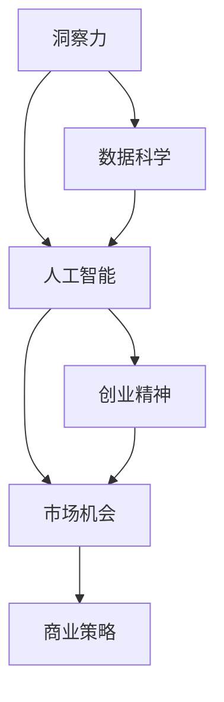

                 

# 洞察力与创业精神：发现市场机会的能力

> 关键词：洞察力, 创业精神, 市场机会, 人工智能, 数据科学, 商业策略

## 1. 背景介绍

### 1.1 问题由来
在当今瞬息万变的商业环境中，企业要想在激烈的市场竞争中脱颖而出，不仅需要强大的技术实力，更需要敏锐的洞察力和卓越的创业精神。如何在纷繁复杂的数据海洋中发现潜在的市场机会，成为企业持续增长的关键。人工智能和大数据技术的兴起，为这一问题提供了新的解决方案。通过洞察力与创业精神的结合，企业能够更有效地把握市场脉搏，发现并实现新的商业模式。

### 1.2 问题核心关键点
- 洞察力：指通过数据挖掘和分析，发现隐藏在数据背后的规律和趋势，预测未来市场变化的能力。
- 创业精神：指敢于冒险、追求创新、快速响应市场变化的企业文化和管理理念。
- 市场机会：指企业基于洞察力发现并把握的市场需求，通过创新产品和服务的提供，实现商业增长。
- 人工智能：指通过机器学习和深度学习等技术，从海量数据中自动提取知识，辅助企业决策。
- 数据科学：指利用数据采集、存储、分析和可视化等技术，揭示数据背后的商业价值。
- 商业策略：指基于洞察力和创业精神，制定和实施的商业计划，以实现企业目标。

## 2. 核心概念与联系

### 2.1 核心概念概述

为更好地理解洞察力与创业精神在发现市场机会中的应用，本节将介绍几个密切相关的核心概念：

- 洞察力：指通过数据挖掘和分析，发现隐藏在数据背后的规律和趋势，预测未来市场变化的能力。
- 创业精神：指敢于冒险、追求创新、快速响应市场变化的企业文化和管理理念。
- 市场机会：指企业基于洞察力发现并把握的市场需求，通过创新产品和服务的提供，实现商业增长。
- 人工智能：指通过机器学习和深度学习等技术，从海量数据中自动提取知识，辅助企业决策。
- 数据科学：指利用数据采集、存储、分析和可视化等技术，揭示数据背后的商业价值。
- 商业策略：指基于洞察力和创业精神，制定和实施的商业计划，以实现企业目标。

这些核心概念之间的逻辑关系可以通过以下Mermaid流程图来展示：



这个流程图展示了一系列核心概念及其之间的关系：

1. 洞察力通过数据科学和人工智能获取数据，自动提取知识。
2. 人工智能与数据科学合作，从海量数据中发现市场趋势。
3. 创业精神引导企业快速响应市场变化，抓住机会。
4. 市场机会基于洞察力和创业精神，驱动商业策略的制定和实施。
5. 商业策略又反过来促进洞察力的提升和创业精神的实践。

这些概念共同构成了企业发现市场机会的整体框架，帮助企业在瞬息万变的市场环境中持续增长。通过理解这些核心概念，我们可以更好地把握洞察力与创业精神在商业决策中的作用。

## 3. 核心算法原理 & 具体操作步骤
### 3.1 算法原理概述

洞察力与创业精神在发现市场机会中的应用，本质上是一个基于数据分析和模型预测的决策过程。其核心思想是：通过数据分析和模型训练，识别出市场变化规律和趋势，快速响应市场变化，制定和实施创新策略。

形式化地，假设企业面临的市场变化数据集为 $D=\{(x_i,y_i)\}_{i=1}^N, x_i \in \mathcal{X}, y_i \in \mathcal{Y}$，其中 $\mathcal{X}$ 为特征空间，$\mathcal{Y}$ 为标签空间。市场机会的发现过程可以描述为：

1. **数据采集**：收集市场相关数据，包括销售数据、用户反馈、竞争对手信息等。
2. **数据预处理**：对采集到的数据进行清洗、归一化、特征工程等处理。
3. **模型训练**：选择适当的算法和模型，在数据集 $D$ 上进行训练，学习市场变化规律。
4. **结果分析**：对模型预测结果进行分析，识别出市场趋势和机会。
5. **策略制定**：基于市场机会，制定和实施创新策略。

### 3.2 算法步骤详解

洞察力与创业精神在发现市场机会的实际操作过程中，主要包括以下几个关键步骤：

**Step 1: 数据采集**

- 选择合适的数据源，包括历史销售数据、用户反馈、社交媒体、市场报告等。
- 确保数据的质量和时效性，采集的数据需覆盖市场变化的多个维度。

**Step 2: 数据预处理**

- 对采集到的数据进行清洗，去除异常值和噪声。
- 对数据进行归一化，统一特征的尺度和分布。
- 通过特征工程，生成新的特征，提高模型的表达能力。

**Step 3: 模型选择与训练**

- 选择合适的算法，如回归、分类、聚类、时序预测等。
- 使用机器学习或深度学习技术，训练模型，提取数据中的模式和规律。
- 对模型进行评估和调优，选择最优模型进行后续分析。

**Step 4: 结果分析**

- 对模型预测结果进行分析，识别市场趋势和异常。
- 使用可视化工具，展示数据分布和模型预测结果。
- 结合领域知识，解读模型结果，发现市场机会。

**Step 5: 策略制定与实施**

- 基于市场机会，制定创新策略，如新产品开发、市场进入、价格调整等。
- 实施策略，并监控效果，根据反馈不断调整和优化。

### 3.3 算法优缺点

洞察力与创业精神在发现市场机会的应用中，具有以下优点：

- **数据驱动**：通过数据分析，能够客观地发现市场机会，避免主观偏见。
- **快速响应**：模型训练和结果分析过程高效，能快速响应市场变化。
- **创新驱动**：基于市场机会，能制定和实施创新策略，推动企业增长。

同时，该方法也存在一定的局限性：

- **数据依赖**：需要高质量和完备的数据，数据获取和处理成本较高。
- **模型复杂**：复杂模型训练和优化需要较强的计算资源。
- **结果解释**：模型结果需要结合领域知识进行解读，具有一定的复杂性。

尽管存在这些局限性，但就目前而言，基于数据分析和模型预测的方法仍是发现市场机会的主流范式。未来相关研究的方向是进一步降低数据获取成本，提高模型训练效率，同时增强结果的可解释性。

### 3.4 算法应用领域

洞察力与创业精神在发现市场机会的应用，已经在多个领域得到了广泛的应用，例如：

- **零售业**：通过分析销售数据和用户反馈，发现新产品的市场需求，优化库存管理和价格策略。
- **金融业**：利用金融市场数据和用户行为数据，发现投资机会和风险点，优化投资组合和风险管理。
- **科技业**：通过分析用户行为和市场趋势，发现新兴技术方向，引导产品研发和市场布局。
- **医疗健康**：利用患者数据和医疗资源数据，发现疾病预防和诊断的新方法，提升医疗服务质量。
- **能源行业**：通过分析能源消耗和市场变化，发现节能减排的机会，优化能源使用策略。

除了上述这些经典应用外，基于洞察力和创业精神的市场机会发现方法也在更多领域得到创新应用，如智慧城市、农业科技、环保产业等，为各行各业带来了新的增长动力。

## 4. 数学模型和公式 & 详细讲解 & 举例说明

### 4.1 数学模型构建

本节将使用数学语言对洞察力与创业精神在发现市场机会中的应用进行更加严格的刻画。

假设市场变化数据集为 $D=\{(x_i,y_i)\}_{i=1}^N, x_i \in \mathcal{X}, y_i \in \mathcal{Y}$，其中 $\mathcal{X}$ 为特征空间，$\mathcal{Y}$ 为标签空间。定义市场变化规律为 $f(x)$，其中 $x$ 为特征向量，$f(x)$ 为模型预测结果。则发现市场机会的过程可以描述为：

$$
\hat{y} = f(x)
$$

其中 $\hat{y}$ 为市场变化预测结果，$x$ 为特征向量。

### 4.2 公式推导过程

以下我们以预测市场需求为例，推导回归模型的计算公式。

假设市场变化规律为线性回归模型，即：

$$
\hat{y} = \theta_0 + \theta_1x_1 + \theta_2x_2 + \cdots + \theta_nx_n
$$

其中 $\theta_0, \theta_1, \theta_2, \cdots, \theta_n$ 为模型参数。则回归模型的损失函数为：

$$
\mathcal{L}(\theta) = \frac{1}{N}\sum_{i=1}^N (y_i - \hat{y}_i)^2
$$

其中 $y_i$ 为真实市场需求，$\hat{y}_i$ 为模型预测结果。根据梯度下降算法，模型参数的更新公式为：

$$
\theta_k \leftarrow \theta_k - \eta \frac{\partial \mathcal{L}(\theta)}{\partial \theta_k}, \quad k=0,1,\cdots,n
$$

其中 $\eta$ 为学习率。

### 4.3 案例分析与讲解

假设某电商企业希望通过洞察力与创业精神，发现新的市场需求，以便优化商品策略。具体步骤如下：

1. **数据采集**：收集过去一年的销售数据和用户反馈数据。
2. **数据预处理**：对数据进行清洗和归一化处理。
3. **模型选择**：选择线性回归模型进行市场变化规律训练。
4. **模型训练**：使用收集到的数据，训练线性回归模型，获取市场变化预测结果。
5. **结果分析**：分析模型预测结果，发现市场需求变化规律。
6. **策略制定**：基于市场需求变化规律，制定新产品开发和库存管理策略。

例如，在分析某季节性产品的销售数据后，模型发现其销量在每年的6-8月有显著提升，这表明消费者对该产品在夏季有较高的需求。企业据此决定在夏季增加该产品的库存，并推出限时优惠活动，以抓住市场需求。

## 5. 项目实践：代码实例和详细解释说明
### 5.1 开发环境搭建

在进行洞察力与创业精神的市场机会发现实践前，我们需要准备好开发环境。以下是使用Python进行Scikit-Learn开发的环境配置流程：

1. 安装Anaconda：从官网下载并安装Anaconda，用于创建独立的Python环境。

2. 创建并激活虚拟环境：
```bash
conda create -n insight_env python=3.8 
conda activate insight_env
```

3. 安装Scikit-Learn：
```bash
pip install scikit-learn
```

4. 安装各类工具包：
```bash
pip install numpy pandas matplotlib seaborn
```

完成上述步骤后，即可在`insight_env`环境中开始市场机会发现的实践。

### 5.2 源代码详细实现

这里我们以预测市场需求为例，给出使用Scikit-Learn库对线性回归模型进行训练和预测的PyTorch代码实现。

```python
from sklearn.linear_model import LinearRegression
import pandas as pd
import numpy as np
from sklearn.model_selection import train_test_split

# 加载数据
data = pd.read_csv('sales_data.csv')
X = data[['season', 'temperature', 'humidity', 'sales']]
y = data['sales']

# 划分训练集和测试集
X_train, X_test, y_train, y_test = train_test_split(X, y, test_size=0.2, random_state=42)

# 创建线性回归模型
model = LinearRegression()

# 训练模型
model.fit(X_train, y_train)

# 预测市场变化
y_pred = model.predict(X_test)

# 评估模型性能
print('R^2:', model.score(X_test, y_test))
```

以上就是使用Scikit-Learn对市场需求进行预测的完整代码实现。可以看到，通过Scikit-Learn库，市场机会发现任务变得简洁高效。

### 5.3 代码解读与分析

让我们再详细解读一下关键代码的实现细节：

**数据加载与处理**：
- `pd.read_csv('sales_data.csv')`：使用pandas库加载销售数据。
- `X = data[['season', 'temperature', 'humidity', 'sales']]`：选择特征变量，包括季节、温度、湿度和销售数据。
- `y = data['sales']`：选择目标变量，即销售数据。

**模型训练与预测**：
- `model = LinearRegression()`：创建线性回归模型。
- `model.fit(X_train, y_train)`：使用训练集数据训练模型。
- `y_pred = model.predict(X_test)`：使用测试集数据预测市场需求。

**模型评估**：
- `model.score(X_test, y_test)`：计算模型在测试集上的R^2值，评估模型性能。

可以看出，通过Scikit-Learn，市场机会发现任务的数据处理、模型训练和评估过程变得异常简洁高效。开发者可以将更多精力放在特征工程和策略制定上，而不必过多关注底层的实现细节。

当然，工业级的系统实现还需考虑更多因素，如模型参数调优、超参数搜索、结果可视化等。但核心的洞察力与创业精神应用流程基本与此类似。

## 6. 实际应用场景
### 6.1 电商平台

基于洞察力与创业精神的市场机会发现，可以广泛应用于电商平台的商品策略优化。传统电商的库存管理和商品定价策略往往依赖经验，难以把握市场变化。而使用洞察力和创业精神的方法，可以实时监测市场需求变化，及时调整库存和价格，提升销售效率和利润率。

具体而言，可以通过分析历史销售数据和用户行为数据，发现不同季节、节日、促销活动等对销售额的影响，据此制定和实施动态库存管理和促销策略。例如，在分析某类商品在夏季的销量激增后，电商平台可以预增该商品在夏季的库存，并推出限时优惠活动，吸引消费者购买。

### 6.2 金融投资

金融领域的信息不对称和市场波动，使得传统投资策略面临较大风险。通过洞察力与创业精神的方法，投资者可以更全面地分析市场变化，制定更有效的投资策略。

例如，金融机构可以利用财经新闻、市场报告和社交媒体数据，预测市场走势和投资机会。通过对历史数据和市场变化规律的建模，制定科学的投资组合和风险管理策略，提高投资回报率，降低风险。

### 6.3 医疗健康

医疗健康领域的数据复杂多样，传统的医疗决策往往依赖医生经验和临床试验，难以快速响应市场需求。基于洞察力和创业精神的方法，医疗机构可以更准确地预测疾病流行趋势，优化诊疗方案，提升医疗服务质量。

例如，医院可以收集和分析患者就诊数据、流行病学数据和公共卫生信息，预测疾病爆发和流行趋势，提前采取防控措施。同时，根据市场需求，开发和推广新型诊疗技术，提升患者满意度和治疗效果。

### 6.4 未来应用展望

随着洞察力与创业精神的方法不断发展，其在更多领域的应用前景值得期待：

- **智能制造**：通过分析生产数据和市场需求，实时调整生产计划和供应链策略，提升生产效率和产品质量。
- **智慧城市**：利用城市运行数据和市场变化规律，优化城市管理和服务，提升居民生活质量。
- **农业科技**：通过分析气象数据和市场需求，优化农作物的种植和销售策略，提高农业生产效益。
- **环保产业**：利用环境数据和市场需求，制定和实施节能减排和资源循环利用策略，推动绿色发展。

这些领域的应用将进一步提升洞察力与创业精神的市场机会发现能力，为各行各业带来新的增长动力。

## 7. 工具和资源推荐
### 7.1 学习资源推荐

为了帮助开发者系统掌握洞察力与创业精神的市场机会发现方法，这里推荐一些优质的学习资源：

1. **机器学习课程**：如Coursera上的《Machine Learning by Stanford University》，涵盖机器学习的基础概念和实践技巧。
2. **数据分析课程**：如Kaggle上的《Data Science in Python》，提供从数据清洗到结果可视化的全套课程。
3. **商业策略书籍**：如《蓝海战略》《竞争战略》，涵盖商业战略的理论和实践。
4. **商业案例分析**：如哈佛商学院的《哈佛商业评论》，提供丰富的商业案例分析资源。
5. **开源数据集**：如Kaggle、UCI机器学习库，提供海量高质量数据集，助力市场机会发现。

通过对这些资源的学习实践，相信你一定能够快速掌握洞察力与创业精神的市场机会发现精髓，并用于解决实际的商业问题。

### 7.2 开发工具推荐

高效的开发离不开优秀的工具支持。以下是几款用于市场机会发现开发的常用工具：

1. **Python**：作为数据科学和机器学习的主流编程语言，Python的强大库支持和高可读性使其成为市场机会发现的首选工具。
2. **Scikit-Learn**：Python中最流行的机器学习库，提供了丰富的回归、分类、聚类等算法，适合快速迭代研究。
3. **Pandas**：数据处理和分析的首选库，支持高效的数据清洗、特征工程和可视化。
4. **Matplotlib**：数据可视化的重要工具，支持丰富的图表类型和自定义设置。
5. **Jupyter Notebook**：交互式编程环境，支持代码块、笔记本、Markdown等多种格式，便于快速迭代和共享。

合理利用这些工具，可以显著提升市场机会发现任务的开发效率，加快创新迭代的步伐。

### 7.3 相关论文推荐

洞察力与创业精神的市场机会发现源于学界的持续研究。以下是几篇奠基性的相关论文，推荐阅读：

1. **《机器学习：模型、算法与应用》**：Tom Mitchell著，全面介绍了机器学习的基础理论和应用场景。
2. **《大数据时代：信息搜索与知识发现》**：James H. Friedman著，探讨了大数据时代的数据搜索和知识发现技术。
3. **《数据驱动：决策与创新的数据科学》**：John Paul expendable著，提供了数据驱动决策的实用案例和方法。
4. **《数据挖掘：概念与技术》**：Michael Steinbach、Tibor Sejda、Dharmarajan Kariat著，系统介绍了数据挖掘的基本概念和技术。
5. **《创业精神：理论与实践》**：Tomas Jensen、Tormod Lundh著，介绍了创业精神的理论与实践，提供了丰富的案例分析。

这些论文代表了大数据和机器学习在市场机会发现中的研究脉络。通过学习这些前沿成果，可以帮助研究者把握学科前进方向，激发更多的创新灵感。

## 8. 总结：未来发展趋势与挑战
### 8.1 总结

本文对洞察力与创业精神在发现市场机会中的应用进行了全面系统的介绍。首先阐述了洞察力与创业精神的研究背景和意义，明确了其在市场机会发现中的重要作用。其次，从原理到实践，详细讲解了市场机会发现方法的数学模型和操作流程，给出了市场机会发现的完整代码实例。同时，本文还广泛探讨了市场机会发现方法在电商、金融、医疗等多个领域的应用前景，展示了其巨大的潜力。此外，本文精选了市场机会发现的各类学习资源，力求为读者提供全方位的技术指引。

通过本文的系统梳理，可以看到，洞察力与创业精神的市场机会发现方法正在成为商业决策的重要工具，极大地拓展了企业发现和利用市场机会的途径。得益于大数据和机器学习技术的不断发展，企业能够更快速、更精准地把握市场变化，推动商业增长。未来，伴随洞察力与创业精神的持续演进，相信市场机会发现方法将在更多领域大放异彩，为企业的持续增长提供新的动力。

### 8.2 未来发展趋势

展望未来，洞察力与创业精神在市场机会发现的应用将呈现以下几个发展趋势：

1. **数据融合与跨领域分析**：结合多源数据和多领域知识，提升市场机会发现的全面性和准确性。
2. **深度学习与强化学习结合**：通过深度学习和强化学习的结合，提升市场预测的精度和响应速度。
3. **实时数据处理与流计算**：利用实时数据处理和流计算技术，实现对市场变化的实时监测和快速响应。
4. **自动化决策系统**：开发自动化决策系统，利用洞察力和创业精神，实现对市场机会的自动发现和实施。
5. **智能推荐系统**：结合市场变化规律和用户行为数据，实现个性化推荐，提升用户体验和满意度。

这些趋势将进一步提升市场机会发现的效率和准确性，为企业带来更广阔的发展空间。

### 8.3 面临的挑战

尽管洞察力与创业精神在市场机会发现的应用已经取得了一定进展，但在迈向更加智能化、普适化应用的过程中，仍面临诸多挑战：

1. **数据获取成本**：高质量市场数据的获取和处理成本较高，特别是在小微企业和传统行业，数据资源有限。
2. **模型复杂度**：复杂模型的训练和优化需要较强的计算资源，对算力要求较高。
3. **结果可解释性**：市场预测结果需要结合领域知识进行解读，模型决策过程的透明性不足。
4. **跨领域应用**：市场机会发现方法在不同领域的应用效果差异较大，需要针对特定领域进行优化。
5. **动态变化**：市场环境不断变化，模型需要及时更新和调整，以适应新的市场趋势。

尽管存在这些挑战，但通过不断的技术进步和实践积累，相信洞察力与创业精神的市场机会发现方法将逐步克服这些难题，迎来更广泛的应用前景。

### 8.4 研究展望

面对洞察力与创业精神在市场机会发现所面临的挑战，未来的研究需要在以下几个方面寻求新的突破：

1. **自动化数据采集与预处理**：开发自动化数据采集和预处理工具，降低数据获取和处理的成本。
2. **轻量级模型设计**：开发轻量级模型，降低计算资源需求，提升模型训练和推理效率。
3. **可解释性增强**：通过解释性模型和可视化工具，提升市场预测结果的可解释性和透明性。
4. **跨领域模型迁移**：通过迁移学习和知识图谱等技术，提升模型在不同领域的应用效果。
5. **实时动态更新**：利用在线学习和增量学习技术，实现模型的实时动态更新和优化。

这些研究方向的探索，将进一步提升洞察力与创业精神的市场机会发现能力，为各行各业带来新的增长动力。面向未来，洞察力与创业精神的应用将在更多领域大放异彩，推动企业创新发展。

## 9. 附录：常见问题与解答

**Q1：市场机会发现是否适用于所有行业？**

A: 市场机会发现方法在大多数行业上都能取得不错的效果，特别是对于数据驱动型行业，如电商、金融、医疗等。但对于一些非数据驱动型行业，如制造业、农业等，市场机会发现方法的应用效果可能相对有限。需要根据行业特点，结合其他因素进行综合考虑。

**Q2：如何选择最适合的市场预测模型？**

A: 选择市场预测模型需要考虑多个因素，如数据类型、预测目标、模型复杂度等。一般来说，回归模型适用于连续型预测目标，分类模型适用于离散型预测目标。此外，还可以结合领域知识和经验，选择最适合的模型进行应用。

**Q3：市场预测模型如何结合领域知识进行优化？**

A: 结合领域知识进行模型优化通常包括以下几个步骤：
1. 收集领域知识，如行业标准、专家经验、用户反馈等。
2. 对数据进行特征工程，生成更具表达能力的特征。
3. 结合领域知识，调整模型参数和算法，提高模型精度和泛化能力。
4. 通过实验对比，选择最优模型进行应用。

**Q4：市场预测结果如何解释和应用？**

A: 市场预测结果的解释通常需要结合领域知识和业务场景进行。具体来说，可以采用以下方法：
1. 可视化分析：通过图表和可视化工具，展示数据分布和模型预测结果，帮助理解市场变化趋势。
2. 案例分析：结合具体案例，解释市场预测结果的实际意义和应用价值。
3. 专家评审：邀请领域专家对市场预测结果进行评审，提供专业意见。

**Q5：市场预测模型如何应对动态变化？**

A: 应对市场动态变化通常需要以下几个步骤：
1. 持续监测市场变化：定期收集和分析市场数据，及时发现变化趋势。
2. 模型动态更新：利用在线学习和增量学习技术，实时更新模型参数，适应新的市场变化。
3. 反馈机制：建立市场预测结果的反馈机制，根据实际效果调整模型参数和算法。

这些步骤能够帮助市场预测模型更好地应对动态变化，保持其准确性和时效性。

---

作者：禅与计算机程序设计艺术 / Zen and the Art of Computer Programming

