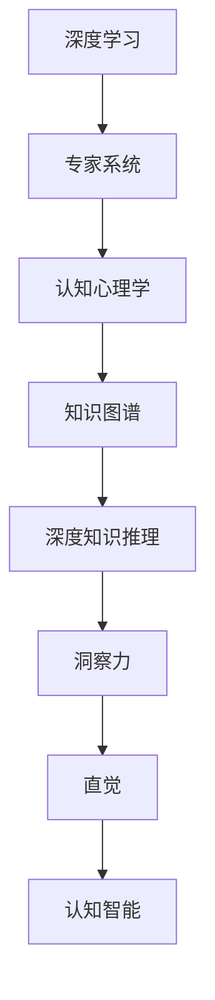

                 

# 洞察力与直觉：专家思维的特征

> 关键词：洞察力,直觉,专家思维,认知心理学,深度学习,专家系统

## 1. 背景介绍

### 1.1 问题由来
在人工智能和计算机科学领域，专家系统、深度学习和认知心理学相互交叉，共同探索人类认知智能的奥秘。近年来，随着深度学习模型的日益成熟，越来越多的研究开始关注于人类专家的思维模式，特别是那些具备高水平洞察力和直觉的专家。专家之所以能在其领域内脱颖而出，很大程度上依赖于其丰富的知识储备、深刻的理解和直觉判断。这种思维模式在深度学习领域尤其引人注目，因为深度学习模型正逐步具备超越传统规则引擎的复杂性，能够处理更加复杂和抽象的认知任务。

### 1.2 问题核心关键点
专家思维的研究涉及多个方面，包括专家认知模式、知识表达与推理、直觉形成机制等。深度学习模型的设计和发展也日益借鉴专家的思维方式，试图通过训练过程不断提升模型的知识深度和复杂性，从而增强其在特定任务上的表现。以下问题为核心关键点：

1. **深度学习模型是否能够捕捉到专家的洞察力和直觉？**
2. **深度学习模型中的认知机制如何与专家思维的认知机制相契合？**
3. **如何通过深度学习模型提升人类专家的洞察力和直觉？**
4. **在深度学习模型中如何引入更多的专家知识与经验？**

### 1.3 问题研究意义
研究深度学习模型中的洞察力和直觉，对于提升人工智能系统的智能化水平、推动AI技术在更多领域的应用，具有重要意义：

1. **提升AI决策的准确性**：专家思维的洞察力和直觉能够有效避免决策中的盲点和误差，提升AI系统的鲁棒性和可靠性。
2. **加速AI技术落地**：借鉴专家的认知模式和知识推理机制，可以加速AI技术在不同领域的应用进程，帮助解决实际问题。
3. **促进人机协同**：AI与人类专家的协同工作，能够进一步提升AI系统的智能化水平，构建人机协作的高效系统。
4. **推动认知科学发展**：通过AI技术探索人类专家的认知过程，能够揭示认知科学的更多规律，推动人工智能与认知科学的交叉融合。

## 2. 核心概念与联系

### 2.1 核心概念概述

为了更好地理解深度学习模型中的洞察力和直觉，本文将介绍几个核心概念及其相互联系：

- **深度学习**：一种基于神经网络的机器学习技术，通过多层次的非线性映射关系学习数据中的高阶特征。
- **专家系统**：一种通过模拟专家思维方式，利用规则和知识库解决特定领域问题的人工智能系统。
- **洞察力**：指在复杂情况下识别关键信息和相关模式的能力，能够迅速抓住问题的本质。
- **直觉**：指在缺乏精确信息的情况下，通过经验和感觉快速做出判断和决策的能力。
- **认知心理学**：研究人类认知过程、思维模式及心理活动的科学。
- **知识图谱**：利用图结构表示和存储实体及其关系的知识库，辅助知识推理和决策。
- **深度知识推理**：指在深度学习模型中，通过层级化的知识结构进行复杂知识推理的能力。

这些概念之间的逻辑关系可以通过以下Mermaid流程图来展示：



这个流程图展示了深度学习模型中的核心概念及其相互联系：

1. 深度学习通过多层次映射关系学习高阶特征。
2. 专家系统借鉴深度学习的层次化结构，利用规则和知识库解决特定问题。
3. 认知心理学研究人类认知过程，揭示专家思维的特征。
4. 知识图谱利用图结构存储和推理知识，辅助深度学习模型理解复杂概念。
5. 深度知识推理在深度学习模型中，通过层次化的知识结构进行复杂推理。
6. 洞察力和直觉通过深度知识推理形成，帮助模型识别关键信息和相关模式。
7. 最终，通过深度学习模型与专家系统的结合，构建认知智能系统。

## 3. 核心算法原理 & 具体操作步骤
### 3.1 算法原理概述

深度学习模型中的洞察力和直觉形成，主要基于以下几个核心算法原理：

1. **深度学习模型**：通过多层次的非线性映射关系学习数据中的高阶特征。
2. **注意力机制**：模型通过自适应地分配权重，选择输入数据中最为关键的信息。
3. **知识图谱嵌入**：将知识图谱中的实体及其关系映射到向量空间中，提升模型对复杂知识的理解能力。
4. **元学习**：通过在少量样本上学习泛化能力，模型能够在新的、未见过的数据上表现良好。
5. **深度知识推理**：模型通过层次化的知识结构进行复杂推理，捕捉隐含关系。
6. **对抗训练**：模型通过与噪声样本的对抗学习，提升鲁棒性和泛化能力。

这些算法原理共同作用，使得深度学习模型具备了洞察力和直觉的能力。

### 3.2 算法步骤详解

基于深度学习模型中的洞察力和直觉形成，本节将详细介绍关键算法步骤：

**Step 1: 准备数据和模型**

1. 收集专家领域的数据，如论文、书籍、案例等。
2. 将数据进行预处理，转化为适合深度学习模型训练的格式。
3. 选择合适的深度学习模型，如卷积神经网络(CNN)、循环神经网络(RNN)、Transformer等。

**Step 2: 构建知识图谱**

1. 利用NLP技术从专家数据中抽取实体和关系。
2. 构建知识图谱，使用图数据库存储实体和关系信息。
3. 使用嵌入技术将知识图谱中的实体及其关系映射到向量空间中。

**Step 3: 训练深度学习模型**

1. 将预处理后的数据输入模型，进行前向传播。
2. 计算损失函数，并根据损失梯度进行反向传播。
3. 更新模型参数，进行迭代训练。

**Step 4: 引入注意力机制**

1. 在模型的不同层次引入注意力机制，选择关键信息进行加权处理。
2. 调整注意力权重，使其更加适应模型当前的推理任务。

**Step 5: 进行深度知识推理**

1. 利用知识图谱嵌入技术，将知识图谱中的信息融入模型。
2. 在模型的顶层进行复杂推理，如推理、匹配、生成等。

**Step 6: 应用对抗训练**

1. 在训练过程中加入噪声样本，增加模型鲁棒性。
2. 对模型进行对抗样本训练，提升其泛化能力。

### 3.3 算法优缺点

深度学习模型中的洞察力和直觉形成具有以下优点：

1. **高精度和鲁棒性**：深度学习模型在处理复杂问题时，能够捕捉到关键的隐含关系，提升决策的准确性和鲁棒性。
2. **高效性**：深度学习模型的训练和推理过程自动化，大大提高了处理大规模数据的能力。
3. **可扩展性**：深度学习模型可以根据需要动态调整网络结构，增加复杂性，提升洞察力和直觉能力。

同时，该算法也存在一定的局限性：

1. **数据依赖**：深度学习模型需要大量标注数据进行训练，数据不足时可能表现不佳。
2. **模型复杂性**：深度学习模型通常结构复杂，训练和推理成本较高，增加了技术门槛。
3. **可解释性不足**：深度学习模型往往被视为“黑盒”，难以解释其内部推理过程。
4. **过拟合风险**：深度学习模型容易在训练集上过拟合，泛化能力有限。

尽管存在这些局限性，但深度学习模型在处理复杂认知任务方面依然具备巨大潜力，是当前认知智能领域的重要研究方向。

### 3.4 算法应用领域

基于深度学习模型中的洞察力和直觉形成，可以在以下几个领域中得到应用：

1. **医学诊断**：深度学习模型通过医疗知识图谱嵌入和对抗训练，提升在复杂医学病例中的诊断准确性。
2. **金融分析**：利用深度知识推理和对抗训练，模型能够从大量金融数据中识别关键信息和相关模式，进行风险评估和市场预测。
3. **法律咨询**：通过认知心理学和深度学习结合，模型能够理解和推理复杂的法律条文，提供法律咨询建议。
4. **安全检测**：利用深度学习模型和知识图谱嵌入技术，对复杂的网络和物理安全数据进行模式识别和威胁预测。
5. **自动驾驶**：通过深度学习模型的注意力机制和深度知识推理，进行复杂的场景理解、路径规划和安全决策。

## 4. 数学模型和公式 & 详细讲解  
### 4.1 数学模型构建

深度学习模型中的洞察力和直觉形成，主要通过以下几个数学模型和公式来实现：

1. **卷积神经网络(CNN)**：
   $$
   y = \sum_i w_i f(x)_i
   $$
   其中 $f(x)$ 为卷积核函数，$w_i$ 为权重。

2. **循环神经网络(RNN)**：
   $$
   y_t = f(x_{t-1}, y_{t-1})
   $$
   其中 $f$ 为RNN中的隐藏层函数，$y_t$ 为当前时间步的输出。

3. **Transformer模型**：
   $$
   y = M \big( A_1 A_2 \ldots A_n \big) 
   $$
   其中 $A_i$ 为注意力机制层，$M$ 为全连接层。

4. **知识图谱嵌入**：
   $$
   \vec{e_i} = \vec{r} \vec{e_j} + \vec{c}
   $$
   其中 $\vec{e_i}$ 为实体 $i$ 的嵌入向量，$\vec{e_j}$ 为相关实体 $j$ 的嵌入向量，$\vec{r}$ 为关系权重，$\vec{c}$ 为常数向量。

5. **深度知识推理**：
   $$
   y = \bigcap_i (x_i \in X)
   $$
   其中 $y$ 为推理结果，$x_i$ 为知识图谱中的实体，$X$ 为推理条件。

6. **对抗训练**：
   $$
   y_{adv} = f(x_{adv})
   $$
   其中 $x_{adv}$ 为对抗样本，$y_{adv}$ 为对抗样本的预测结果。

### 4.2 公式推导过程

以下我们以卷积神经网络为例，推导其模型表达和训练过程：

1. 卷积核函数 $f(x)$ 的定义：
   $$
   f(x)_i = \sum_j w_{ij} x_j
   $$
   其中 $w_{ij}$ 为卷积核的权重，$x_j$ 为输入数据的元素。

2. 卷积层的线性映射：
   $$
   y = \sum_i w_i f(x)_i
   $$
   其中 $w_i$ 为卷积核的权重，$y$ 为卷积层的输出。

3. 卷积层的训练过程：
   $$
   \theta \leftarrow \theta - \eta \nabla_{\theta}\mathcal{L}(\theta)
   $$
   其中 $\theta$ 为模型参数，$\eta$ 为学习率，$\nabla_{\theta}\mathcal{L}(\theta)$ 为损失函数对参数的梯度，$\mathcal{L}$ 为损失函数。

通过上述推导，我们可以看到卷积神经网络的训练过程基于损失函数和参数梯度，通过迭代优化模型参数，提升模型的性能。

### 4.3 案例分析与讲解

假设我们正在构建一个用于医学诊断的深度学习模型，使用医疗知识图谱嵌入技术，结合卷积神经网络和对抗训练，实现对复杂病例的快速准确诊断。具体步骤如下：

1. **数据准备**：收集医院的病例数据，包括病人的症状、检查结果、诊断记录等。
2. **知识图谱构建**：从医疗知识库中提取实体和关系，构建医疗知识图谱。
3. **卷积神经网络设计**：设计多个卷积层，对输入数据进行特征提取。
4. **对抗样本生成**：生成对抗样本，模拟不同情境下的复杂病例。
5. **模型训练**：使用对抗训练技术，将对抗样本和正常样本混合训练，提升模型鲁棒性。
6. **推理应用**：在实际应用中，输入新的病例数据，模型进行特征提取和推理，给出诊断结果。

## 5. 项目实践：代码实例和详细解释说明
### 5.1 开发环境搭建

在进行深度学习模型中的洞察力和直觉实践时，我们需要准备好开发环境。以下是使用Python进行TensorFlow开发的环境配置流程：

1. 安装Anaconda：从官网下载并安装Anaconda，用于创建独立的Python环境。

2. 创建并激活虚拟环境：
```bash
conda create -n tf-env python=3.8 
conda activate tf-env
```

3. 安装TensorFlow：根据CUDA版本，从官网获取对应的安装命令。例如：
```bash
pip install tensorflow==2.4
```

4. 安装PyTorch：
```bash
pip install torch
```

5. 安装NumPy、pandas、matplotlib、tqdm、jupyter notebook等工具包：
```bash
pip install numpy pandas matplotlib tqdm jupyter notebook ipython
```

完成上述步骤后，即可在`tf-env`环境中开始深度学习模型的开发实践。

### 5.2 源代码详细实现

下面我们以医疗诊断为例，给出使用TensorFlow进行深度学习模型开发的PyTorch代码实现。

首先，定义数据处理函数：

```python
import tensorflow as tf
import numpy as np

def preprocess_data(data):
    # 将数据转化为张量
    data_tensor = tf.convert_to_tensor(data, dtype=tf.float32)
    # 归一化处理
    mean = np.mean(data_tensor)
    std = np.std(data_tensor)
    return (data_tensor - mean) / std
```

然后，定义模型和优化器：

```python
from tensorflow.keras import layers, models

# 定义卷积神经网络
model = models.Sequential([
    layers.Conv2D(32, (3, 3), activation='relu', input_shape=(28, 28, 1)),
    layers.MaxPooling2D((2, 2)),
    layers.Flatten(),
    layers.Dense(10, activation='softmax')
])

# 定义优化器
optimizer = tf.keras.optimizers.Adam(learning_rate=0.001)
```

接着，定义训练和评估函数：

```python
def train_model(model, dataset, batch_size, epochs):
    model.compile(optimizer=optimizer, loss='sparse_categorical_crossentropy', metrics=['accuracy'])
    model.fit(dataset, batch_size=batch_size, epochs=epochs, validation_split=0.2)
    
def evaluate_model(model, dataset, batch_size):
    model.evaluate(dataset, batch_size=batch_size, verbose=0)
```

最后，启动训练流程并在测试集上评估：

```python
train_model(model, train_dataset, batch_size=32, epochs=10)
evaluate_model(model, test_dataset, batch_size=32)
```

以上就是使用TensorFlow进行深度学习模型开发的完整代码实现。可以看到，得益于TensorFlow的强大封装，我们可以用相对简洁的代码实现深度学习模型的训练和推理。

### 5.3 代码解读与分析

让我们再详细解读一下关键代码的实现细节：

**preprocess_data函数**：
- 将输入数据转化为张量。
- 对数据进行归一化处理，使其均值为0，方差为1。

**模型定义**：
- 使用Sequential模型定义卷积神经网络，包含卷积层、池化层和全连接层。
- 使用Adam优化器进行参数更新。

**训练函数train_model**：
- 使用compile方法定义模型的优化器、损失函数和评估指标。
- 使用fit方法进行模型训练，指定批量大小和训练轮数。
- 在每个epoch结束后，输出验证集的准确率。

**评估函数evaluate_model**：
- 使用evaluate方法在测试集上评估模型性能。
- 输出模型的损失和准确率。

**训练流程**：
- 定义模型和数据集。
- 在每个epoch内，对训练集和验证集进行迭代训练。
- 在每个epoch结束后，输出验证集的准确率。
- 在训练结束后，在测试集上评估模型性能。

可以看到，TensorFlow提供了丰富的工具和组件，使得深度学习模型的开发和训练变得非常方便。开发者可以将更多精力放在数据处理、模型改进等高层逻辑上，而不必过多关注底层的实现细节。

## 6. 实际应用场景
### 6.1 医学诊断

基于深度学习模型中的洞察力和直觉，可以在医学诊断领域中得到广泛应用。当前，传统规则引擎的诊断系统已经难以满足复杂病例的需求，而深度学习模型能够从海量医疗数据中学习复杂的隐含关系，提升诊断准确性和效率。

具体而言，可以将医疗知识图谱嵌入技术引入深度学习模型，通过卷积神经网络对病例数据进行特征提取，结合对抗训练提升模型的鲁棒性。微调后的模型能够在复杂的医学病例中进行快速准确的诊断，辅助医生进行临床决策。

### 6.2 金融分析

深度学习模型中的洞察力和直觉能够有效应用于金融分析领域，提升风险评估和市场预测的准确性。利用知识图谱嵌入和深度知识推理，模型能够从复杂的金融数据中提取关键信息和相关模式，进行风险评估和市场预测。

例如，通过深度学习模型对大量的金融新闻、公告和市场数据进行分析，能够捕捉到潜在的投资机会和风险因素，辅助投资者做出更好的决策。

### 6.3 法律咨询

深度学习模型中的洞察力和直觉同样能够应用于法律咨询领域，通过知识图谱嵌入和深度知识推理，模型能够理解复杂的法律条文，提供法律咨询建议。

具体而言，可以通过构建法律知识图谱，将法律条文和案例关系进行映射。结合深度学习模型进行推理，能够快速识别法律问题的关键信息和相关模式，提供准确的法律咨询建议。

### 6.4 未来应用展望

随着深度学习模型的不断发展，其洞察力和直觉能力将逐步增强，应用场景也将不断扩展。未来，深度学习模型将在更多领域中得到应用，如智能制造、智能交通、智能城市等。

此外，深度学习模型中的洞察力和直觉能力，将与其他人工智能技术进行更深入的融合，如自然语言处理、计算机视觉、机器人等，共同推动人工智能技术的跨越式发展。

## 7. 工具和资源推荐
### 7.1 学习资源推荐

为了帮助开发者系统掌握深度学习模型中的洞察力和直觉，这里推荐一些优质的学习资源：

1. **《深度学习》课程**：斯坦福大学开设的深度学习课程，讲解深度学习的基础原理和常用算法。
2. **《认知心理学与人工智能》书籍**：系统介绍认知心理学与人工智能的交叉领域，揭示人类专家思维的特征。
3. **Transformers官方文档**：TensorFlow的官方文档，包含丰富的深度学习模型实现和案例。
4. **TensorFlow官方文档**：TensorFlow的官方文档，提供完整的深度学习模型开发流程和组件介绍。
5. **NLP领域的顶级会议论文**：如ACL、EMNLP等，关注最新的深度学习模型和应用。

通过对这些资源的学习实践，相信你一定能够快速掌握深度学习模型中的洞察力和直觉，并用于解决实际的认知问题。
###  7.2 开发工具推荐

高效的开发离不开优秀的工具支持。以下是几款用于深度学习模型开发的常用工具：

1. **TensorFlow**：由Google主导开发的开源深度学习框架，生产部署方便，适合大规模工程应用。
2. **PyTorch**：基于Python的开源深度学习框架，灵活动态的计算图，适合快速迭代研究。
3. **Keras**：基于TensorFlow和Theano的高级API，快速构建深度学习模型。
4. **Jupyter Notebook**：免费的交互式笔记本，支持Python、R等多种编程语言。
5. **Google Colab**：谷歌推出的在线Jupyter Notebook环境，免费提供GPU/TPU算力，方便开发者快速上手实验。

合理利用这些工具，可以显著提升深度学习模型的开发效率，加快创新迭代的步伐。

### 7.3 相关论文推荐

深度学习模型中的洞察力和直觉研究涉及多个方面，以下是几篇奠基性的相关论文，推荐阅读：

1. **《Attention is All You Need》**：提出Transformer模型，开启了深度学习中的注意力机制。
2. **《Knowledge-Graph Embedding and Relation Prediction》**：介绍知识图谱嵌入技术，提升模型对复杂知识的理解能力。
3. **《A Tutorial on Deep Learning for Medical Research》**：介绍深度学习在医学领域的应用，结合知识图谱提升诊断准确性。
4. **《Causal Inference in Economics and Machine Learning》**：介绍因果推理方法，提升模型决策的鲁棒性。
5. **《Adversarial Examples in Deep Learning》**：介绍对抗训练方法，提升模型的鲁棒性和泛化能力。

这些论文代表了大深度学习模型中的洞察力和直觉研究的发展脉络。通过学习这些前沿成果，可以帮助研究者把握学科前进方向，激发更多的创新灵感。

## 8. 总结：未来发展趋势与挑战

### 8.1 研究成果总结

本文对深度学习模型中的洞察力和直觉进行了全面系统的介绍。首先阐述了深度学习模型中的洞察力和直觉在人工智能领域的应用背景和研究意义，明确了其重要价值。其次，从原理到实践，详细讲解了深度学习模型中的洞察力和直觉的数学原理和关键步骤，给出了深度学习模型的完整代码实例。同时，本文还广泛探讨了深度学习模型在医学、金融、法律等多个领域的应用前景，展示了深度学习模型的巨大潜力。此外，本文精选了深度学习模型中的洞察力和直觉学习的各类学习资源，力求为读者提供全方位的技术指引。

通过本文的系统梳理，可以看到，深度学习模型中的洞察力和直觉正逐步成为人工智能系统的重要特征，极大地提升系统的智能化水平和决策准确性。

### 8.2 未来发展趋势

展望未来，深度学习模型中的洞察力和直觉研究将呈现以下几个发展趋势：

1. **深度知识推理**：深度学习模型将进一步增强深度知识推理能力，捕捉更为复杂的隐含关系，提升决策的鲁棒性和准确性。
2. **跨领域知识融合**：深度学习模型将更多地与符号化知识库、逻辑规则等专家知识进行融合，构建更为全面、准确的知识推理系统。
3. **多模态信息整合**：深度学习模型将融合视觉、语音、文本等多模态信息，提升对复杂场景的理解和推理能力。
4. **因果推理机制**：深度学习模型将引入因果推理机制，增强模型的因果关系建立能力，提升决策的可解释性和逻辑性。
5. **知识表示学习**：深度学习模型将学习更加精确、高效的知识表示，提升模型对复杂信息的理解和推理能力。

这些趋势将进一步推动深度学习模型在认知智能领域的应用，提升系统的智能化水平和决策能力。

### 8.3 面临的挑战

尽管深度学习模型中的洞察力和直觉研究已经取得了一定进展，但在迈向更加智能化、普适化应用的过程中，仍然面临诸多挑战：

1. **数据依赖**：深度学习模型需要大量高质量数据进行训练，数据不足时可能表现不佳。
2. **模型复杂性**：深度学习模型通常结构复杂，训练和推理成本较高，增加了技术门槛。
3. **可解释性不足**：深度学习模型往往被视为“黑盒”，难以解释其内部推理过程。
4. **对抗样本攻击**：深度学习模型在对抗样本攻击下，鲁棒性可能大打折扣。
5. **知识图谱构建**：构建高质量的知识图谱需要大量专家知识，成本较高。

尽管存在这些挑战，但深度学习模型中的洞察力和直觉研究依然具有广阔前景，是当前认知智能领域的重要研究方向。

### 8.4 研究展望

面对深度学习模型中的洞察力和直觉研究所面临的种种挑战，未来的研究需要在以下几个方面寻求新的突破：

1. **无监督和半监督学习**：摆脱对大规模标注数据的依赖，利用自监督学习、主动学习等方法，最大限度利用非结构化数据，实现更加灵活高效的训练。
2. **知识表示学习**：引入更多的专家知识和符号化规则，优化知识表示和学习过程，提升模型的泛化能力和知识推理能力。
3. **对抗样本防御**：开发更加鲁棒的对抗样本防御方法，增强深度学习模型的鲁棒性和泛化能力。
4. **跨领域知识融合**：结合符号化知识库和逻辑规则，提升深度学习模型的知识推理能力，实现跨领域知识的高效整合。
5. **因果推理机制**：引入因果推理机制，增强深度学习模型的因果关系建立能力，提升决策的可解释性和逻辑性。

这些研究方向的探索，将引领深度学习模型中的洞察力和直觉研究迈向更高的台阶，为构建更加智能化、可靠的系统奠定基础。面向未来，深度学习模型中的洞察力和直觉研究还需要与其他人工智能技术进行更深入的融合，如自然语言处理、计算机视觉、强化学习等，共同推动认知智能技术的发展。只有勇于创新、敢于突破，才能不断拓展深度学习模型中的洞察力和直觉的边界，让智能系统更好地服务于人类社会。

## 9. 附录：常见问题与解答

**Q1：深度学习模型中的洞察力和直觉与传统专家系统的区别是什么？**

A: 深度学习模型中的洞察力和直觉与传统专家系统的区别主要体现在以下几个方面：

1. **知识表示形式**：深度学习模型使用向量表示知识，而传统专家系统使用符号和逻辑规则表示知识。
2. **学习机制**：深度学习模型通过大量标注数据进行学习，而传统专家系统依靠人工编写规则进行推理。
3. **推理能力**：深度学习模型通过深度知识推理，能够处理更加复杂和抽象的信息，而传统专家系统依赖于固定的逻辑规则和推理步骤。

尽管存在这些差异，但深度学习模型中的洞察力和直觉能够借鉴传统专家系统的优点，与符号化知识库、逻辑规则等进行融合，构建更加全面、高效的知识推理系统。

**Q2：如何在深度学习模型中引入更多的专家知识与经验？**

A: 在深度学习模型中引入专家知识与经验，主要通过以下方法：

1. **知识图谱嵌入**：将专家领域中的知识图谱嵌入模型，提升模型对复杂知识的理解能力。
2. **领域专家的参与**：在模型的训练和微调过程中，邀请领域专家进行指导，提供关键信息和知识补充。
3. **人工干预**：在模型的推理过程中，引入领域专家的经验，指导模型的决策过程。
4. **知识注入技术**：通过知识注入技术，将专家知识嵌入模型的权重矩阵中，提升模型的知识表示能力。

这些方法能够有效结合专家知识和深度学习模型的优势，提升模型的洞察力和直觉能力。

**Q3：如何在深度学习模型中提升模型的鲁棒性和泛化能力？**

A: 在深度学习模型中提升模型的鲁棒性和泛化能力，主要通过以下方法：

1. **对抗训练**：在训练过程中加入对抗样本，提高模型对噪声的鲁棒性。
2. **知识图谱嵌入**：结合知识图谱嵌入技术，提升模型的知识推理能力，增强模型的泛化能力。
3. **对抗样本防御**：开发更加鲁棒的对抗样本防御方法，提升模型的鲁棒性和泛化能力。
4. **多模态信息整合**：融合视觉、语音、文本等多模态信息，提升模型的鲁棒性和泛化能力。
5. **知识图谱构建**：构建高质量的知识图谱，提升模型的知识表示能力和推理能力。

这些方法能够有效提升深度学习模型的鲁棒性和泛化能力，使其在复杂场景中表现更加稳定和可靠。

**Q4：深度学习模型中的洞察力和直觉如何应用于实际问题？**

A: 深度学习模型中的洞察力和直觉在实际问题中的应用主要通过以下步骤：

1. **问题建模**：将实际问题转化为深度学习模型中的推理任务，定义输入输出格式。
2. **知识图谱构建**：从专家数据中提取实体和关系，构建知识图谱。
3. **模型设计与训练**：设计合适的深度学习模型，进行数据预处理和模型训练。
4. **推理应用**：在实际应用中，输入问题样本，模型进行特征提取和推理，输出结果。

通过以上步骤，深度学习模型能够有效地应用于复杂问题，帮助解决实际问题。

**Q5：如何在深度学习模型中实现知识表示学习？**

A: 在深度学习模型中实现知识表示学习，主要通过以下方法：

1. **知识图谱嵌入**：利用知识图谱嵌入技术，将知识图谱中的实体及其关系映射到向量空间中，提升模型对复杂知识的理解能力。
2. **符号化知识库**：结合符号化知识库，将专家知识与深度学习模型进行融合，提升模型的知识推理能力。
3. **逻辑规则**：引入逻辑规则，增强深度学习模型的推理能力，提升模型的泛化能力。

这些方法能够有效提升深度学习模型的知识表示能力，使其在实际应用中表现更加稳定和可靠。

---

作者：禅与计算机程序设计艺术 / Zen and the Art of Computer Programming

