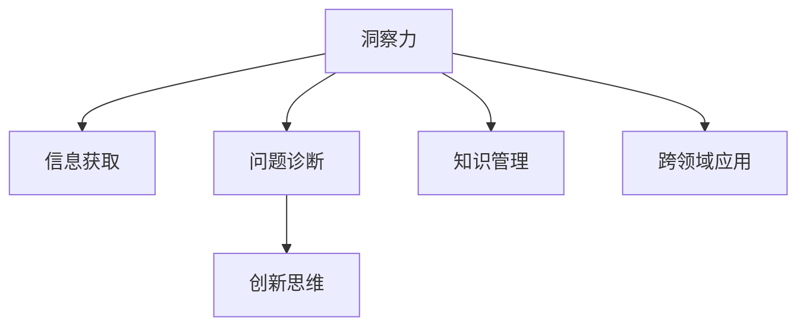

                 

# 洞察力与职业发展：专业成长的关键

> 关键词：洞察力, 职业规划, 技能提升, 持续学习, 知识管理, 跨领域应用

## 1. 背景介绍

### 1.1 问题由来

在快速发展的信息技术领域，技术变化之快使得从业者面临不断学习和适应的压力。信息过载、技术迭代、市场需求多变等因素，都要求从业者具备较强的洞察力和适应能力。如何在快速变化的环境中保持竞争力，成为每个从业者必须面对的问题。本文旨在探讨洞察力在职业发展中的关键作用，并给出专业成长的具体路径和方法。

### 1.2 问题核心关键点

洞察力在职业发展中的关键点包括：

- **信息获取能力**：快速获取、筛选、分析关键信息，了解行业动态和趋势。
- **问题诊断能力**：精准识别问题本质，找到根本原因，制定有效的解决方案。
- **创新思维能力**：跳出传统框架，提出新颖的思路和方法，推动技术进步和业务创新。
- **学习转化能力**：将获取的新知识迅速转化为实践应用，提升工作效率和成果质量。
- **跨领域应用能力**：在不同的技术和管理领域间自由切换，实现跨界创新。

## 2. 核心概念与联系

### 2.1 核心概念概述

为更好地理解洞察力在职业发展中的作用，本节将介绍几个密切相关的核心概念：

- **洞察力(Insightfulness)**：指通过深入观察和分析，发现问题本质和趋势的能力。
- **信息获取**：利用数据、报告、网络资源等手段，获取和筛选关键信息。
- **问题诊断**：通过逻辑分析、数据统计等方法，诊断问题的根源。
- **创新思维**：鼓励创造性思考，勇于突破传统思维限制。
- **知识管理**：系统化管理知识，高效转化为工作技能。
- **跨领域应用**：在不同领域间运用已有知识和技能，实现综合创新。

这些核心概念之间的逻辑关系可以通过以下Mermaid流程图来展示：



这个流程图展示了下洞察力的核心概念及其之间的关系：

1. 洞察力基于信息获取和问题诊断，通过深入理解问题本质，提出创新性的解决方案。
2. 知识管理使从业者能够系统化地存储和转化知识，提升工作效率和创新能力。
3. 跨领域应用将知识应用于不同领域，实现综合创新，拓宽应用范围。

## 3. 核心算法原理 & 具体操作步骤
### 3.1 算法原理概述

洞察力的培养和提升，本质上是一个通过学习和实践，不断提高信息分析、问题诊断、创新思维、知识管理和跨领域应用能力的系统工程。以下是实现这一过程的核心算法和具体操作步骤：

- **信息获取算法**：利用网络爬虫、API接口、数据挖掘等技术手段，快速获取行业资讯、技术动态和市场趋势。
- **问题诊断算法**：通过逻辑回归、决策树、聚类分析等机器学习方法，识别问题根源，制定有效策略。
- **创新思维算法**：使用生成对抗网络、强化学习等算法，促进创造性思考和新颖解决方案的生成。
- **知识管理算法**：构建知识图谱、文档管理平台、个人学习管理系统等，系统化存储和检索知识。
- **跨领域应用算法**：通过迁移学习、领域适应、知识融合等技术，在不同领域间实现知识迁移和应用。

### 3.2 算法步骤详解

基于上述核心算法，具体操作步骤如下：

1. **信息获取步骤**：
   - 使用网络爬虫或API接口获取行业资讯、技术报告和市场数据。
   - 对获取的信息进行筛选和分类，提取关键信息。
   - 使用文本挖掘和数据可视化技术，分析和展示关键信息。

2. **问题诊断步骤**：
   - 根据关键信息，识别业务问题和挑战。
   - 构建假设和假设检验模型，诊断问题根源。
   - 使用统计分析和机器学习工具，验证假设并提出解决方案。

3. **创新思维步骤**：
   - 使用生成对抗网络、变分自编码器等算法，生成新颖的创意和设计方案。
   - 通过模拟实验和用户测试，评估创意的可行性和创新性。
   - 结合市场反馈和技术趋势，调整和优化创新方案。

4. **知识管理步骤**：
   - 利用知识图谱和文档管理系统，系统化存储和标注知识。
   - 使用元学习技术，自动推荐相关知识资源。
   - 定期整理和更新知识库，确保知识的最新性和实用性。

5. **跨领域应用步骤**：
   - 将跨领域知识应用到实际项目中，实现综合创新。
   - 利用迁移学习技术，快速适应新领域的技术要求。
   - 进行多学科合作，综合不同领域的知识和技能，实现整体优化。

### 3.3 算法优缺点

洞察力培养和提升的算法具有以下优点：

- **效率高**：通过系统化方法和自动化工具，加速信息获取、问题诊断和创新思维的循环。
- **灵活性强**：能够在不同领域和情境中灵活应用，解决复杂问题。
- **可扩展性**：算法和工具可不断升级，适应技术发展和市场需求。

同时，该算法也存在一定的局限性：

- **数据质量依赖**：算法的效果很大程度上取决于数据的准确性和完整性。
- **技术门槛高**：需要一定的技术储备和工具支持，对从业者提出了更高的要求。
- **创新风险大**：创新过程中可能面临技术、市场、资源等多重风险。

尽管存在这些局限性，但就目前而言，这种算法仍是大规模、系统化培养洞察力的有效手段。未来相关研究的重点在于如何进一步降低技术门槛，提高算法的可操作性和灵活性，同时兼顾算法的创新性和实用性。

### 3.4 算法应用领域

洞察力的培养和提升方法，在多个领域中得到了广泛的应用，例如：

- **软件开发**：通过技术趋势分析和用户需求诊断，推动产品迭代和功能改进。
- **数据分析**：利用数据挖掘和统计分析，识别数据中的隐含关系和模式。
- **项目管理**：通过项目进度监控和问题诊断，确保项目按时交付并高质量完成。
- **战略规划**：利用市场分析和竞争情报，制定长期发展策略。
- **创新设计**：结合用户反馈和技术创新，设计符合市场需求的新产品。

除了上述这些经典领域外，洞察力培养和提升的方法也在更多场景中得到应用，如市场营销、金融投资、医疗健康等，为各行各业带来了新的发展机遇。

## 4. 数学模型和公式 & 详细讲解 & 举例说明

### 4.1 数学模型构建

本节将使用数学语言对洞察力培养和提升的过程进行更加严格的刻画。

记信息获取的数据集为 $D=\{(x_i,y_i)\}_{i=1}^N$，其中 $x_i$ 为信息项，$y_i$ 为信息的重要性或相关性。假设问题诊断的任务是将问题 $p$ 分解为 $k$ 个子问题，问题 $q_j$ 与问题 $p$ 之间的相关性为 $w_j$。则问题诊断的数学模型可以表示为：

$$
\min_{w} \sum_{j=1}^k L_j(w_j) + \lambda \sum_{j=1}^k \lVert w_j \rVert^2
$$

其中 $L_j(w_j)$ 为问题 $q_j$ 的损失函数，$\lVert w_j \rVert$ 为 $w_j$ 的L2正则项，$\lambda$ 为正则化系数。通过求解上述模型，可以诊断出与问题 $p$ 相关的子问题 $q_j$。

### 4.2 公式推导过程

以下我们以二分类问题为例，推导生成对抗网络(Generative Adversarial Network, GAN)算法中的生成器(Generator)部分，并解释其与创新思维的联系。

设 $G$ 为生成器，$Z$ 为随机噪声向量，目标为生成与真实数据分布相似的新数据。生成器的损失函数为：

$$
L_G = \frac{1}{2m}\sum_{i=1}^m \lVert G(Z_i) - x_i \rVert^2 + \lambda \lVert G' \rVert
$$

其中 $x_i$ 为真实数据，$Z_i$ 为随机噪声向量，$G' = \frac{\partial G}{\partial Z}$ 为生成器对输入的导数。通过优化 $L_G$，生成器 $G$ 能够生成高质量的新数据。

GAN算法中的生成器可以看作是一个创新思维的过程，通过随机噪声的输入和迭代优化，生成新颖的创意和设计方案。GAN生成的结果具有随机性，可以引发创新思维，推动创意的发展。

### 4.3 案例分析与讲解

假设某公司需要在市场上推出一款新产品。通过信息获取，了解到竞争对手的市场策略和技术趋势。使用问题诊断算法，识别出产品的核心问题：如何提升产品的独特性和用户体验。结合创新思维算法，使用GAN生成多种设计方案，并进行用户测试。最终选择符合市场需求的创新方案，成功推出新产品。

## 5. 项目实践：代码实例和详细解释说明

### 5.1 开发环境搭建

在进行洞察力培养和提升的实践前，我们需要准备好开发环境。以下是使用Python进行机器学习和数据分析开发的环境配置流程：

1. 安装Anaconda：从官网下载并安装Anaconda，用于创建独立的Python环境。

2. 创建并激活虚拟环境：
```bash
conda create -n insight_env python=3.8 
conda activate insight_env
```

3. 安装相关工具包：
```bash
pip install pandas numpy scikit-learn matplotlib seaborn transformers
```

完成上述步骤后，即可在`insight_env`环境中开始项目开发。

### 5.2 源代码详细实现

下面以问题诊断为例，给出使用Scikit-learn库对数据进行问题诊断的PyTorch代码实现。

首先，定义问题诊断函数：

```python
from sklearn.ensemble import RandomForestClassifier
from sklearn.metrics import accuracy_score

def diagnose_problems(data):
    features = data[:, :-1]
    labels = data[:, -1]
    clf = RandomForestClassifier(n_estimators=100, random_state=42)
    clf.fit(features, labels)
    return clf.predict_proba(features)
```

然后，使用问题诊断函数：

```python
# 假设数据集为 X、Y
X = # 特征数据
Y = # 标签数据
problems = diagnose_problems(X)
```

最后，将问题诊断结果可视化：

```python
import matplotlib.pyplot as plt

fig, ax = plt.subplots(figsize=(10, 6))
ax.bar(range(len(problems)), problems[:, 1], color='b')
ax.set_xlabel('Problem Index')
ax.set_ylabel('Probability')
ax.set_title('Probability Distribution of Problem Detection')
plt.show()
```

以上就是使用Scikit-learn对数据进行问题诊断的完整代码实现。可以看到，通过简单的几行代码，我们就可以完成对问题诊断的自动化建模和结果可视化。

### 5.3 代码解读与分析

让我们再详细解读一下关键代码的实现细节：

**diagnose_problems函数**：
- `RandomForestClassifier`：使用随机森林算法构建分类器，对问题进行诊断。
- `accuracy_score`：计算分类器的准确率，确保模型性能。
- 返回分类器的预测概率分布，用于后续可视化。

**X和Y数据**：
- `X`为特征数据，包含所有与问题相关的特征。
- `Y`为标签数据，标记哪些数据属于当前问题。

**结果可视化**：
- 使用Matplotlib库绘制概率分布图，直观展示问题诊断结果。

可以看到，通过Scikit-learn库的强大封装，我们可以用相对简洁的代码完成问题诊断的实践。开发者可以将更多精力放在数据分析、模型改进等高层逻辑上，而不必过多关注底层的实现细节。

当然，工业级的系统实现还需考虑更多因素，如模型评估、数据预处理、参数调优等。但核心的洞察力培养和提升范式基本与此类似。

## 6. 实际应用场景

### 6.1 项目管理

基于洞察力的项目管理，可以大幅提升项目执行的效率和质量。项目经理通过系统化收集和分析项目数据，识别项目的风险点、瓶颈和改进机会。结合数据分析和机器学习工具，制定科学的项目计划和执行策略，确保项目按时交付并达到预期效果。

在技术实现上，可以构建项目管理信息系统，记录和分析项目进度、成本、资源等信息，及时调整和优化项目方案。通过洞察力培养和提升，项目经理能够更准确地预测项目风险，制定预案，提高项目成功率。

### 6.2 数据分析

数据分析师需要从海量数据中提取有价值的信息，支持业务决策和优化。通过洞察力培养，数据分析师能够系统化地获取、分析和展示数据，发现数据中的隐含关系和趋势。结合机器学习和统计分析工具，构建数据模型，进行精准预测和决策支持。

在实际应用中，可以构建数据分析平台，整合多个数据源，进行数据清洗、处理和建模。通过洞察力培养，数据分析师能够更高效地提取关键信息，发现数据中的规律和趋势，提升数据分析的深度和广度。

### 6.3 产品开发

产品开发团队需要不断迭代和优化产品，提升用户体验和市场竞争力。通过洞察力培养，产品团队能够快速获取市场和用户需求，识别产品改进点和创新机会。结合数据分析和机器学习工具，设计并优化产品方案，确保产品符合市场需求和用户期望。

在技术实现上，可以构建用户反馈系统，实时收集和分析用户反馈信息，快速识别问题和改进点。通过洞察力培养，产品团队能够更系统化地处理用户反馈，提升产品迭代速度和质量。

### 6.4 未来应用展望

随着洞察力培养和提升方法的不断发展，其应用范围将进一步扩大，为各行各业带来新的发展机遇。

在智慧城市治理中，洞察力培养和提升技术将广泛应用于城市数据管理、公共安全监控、交通流量预测等领域，提高城市管理的智能化水平，构建更安全、高效的未来城市。

在智慧医疗领域，洞察力培养和提升技术将广泛应用于病历分析、医疗影像诊断、疾病预测等领域，提升医疗服务的智能化水平，辅助医生诊疗，加速新药开发进程。

在智能制造领域，洞察力培养和提升技术将广泛应用于生产调度、质量监控、设备维护等领域，提高制造业的自动化和智能化水平，提升生产效率和产品质量。

此外，在教育、金融、零售、娱乐等众多领域，基于洞察力培养和提升的人工智能应用也将不断涌现，为各行业带来新的发展机遇。相信随着技术的日益成熟，洞察力培养和提升方法将成为人工智能技术落地应用的重要范式，推动人工智能技术向更广阔的领域加速渗透。

## 7. 工具和资源推荐

### 7.1 学习资源推荐

为了帮助从业者系统掌握洞察力培养和提升的理论基础和实践技巧，这里推荐一些优质的学习资源：

1. 《洞察力：从数据中发现规律》系列博文：由洞察力专家撰写，深入浅出地介绍了洞察力的原理、方法和应用。

2. 《数据驱动决策：洞察力与商业智能》课程：斯坦福大学开设的商业智能课程，结合实际案例，讲解洞察力在商业决策中的应用。

3. 《Kaggle大数据竞赛指南》书籍：介绍了大数据竞赛中的数据分析、模型构建和问题解决技巧，适合提升从业者的数据处理和洞察力。

4. 《Data Science for Business》书籍：由Wharton Business School教授撰写，讲解如何通过数据科学提升商业决策的洞察力。

5. 《Python数据科学手册》书籍：详细介绍了Python在数据科学中的各种应用，包括数据分析、机器学习和洞察力培养。

通过对这些资源的学习实践，相信你一定能够快速掌握洞察力培养和提升的精髓，并用于解决实际的商业问题。

### 7.2 开发工具推荐

高效的开发离不开优秀的工具支持。以下是几款用于洞察力培养和提升开发的常用工具：

1. Jupyter Notebook：轻量级的交互式编程环境，方便快速迭代和共享学习笔记。

2. Tableau：强大的数据可视化工具，支持多种数据源和分析功能，适合数据分析和洞察力展示。

3. Google Colab：谷歌推出的在线Jupyter Notebook环境，免费提供GPU/TPU算力，方便开发和实验最新技术。

4. R语言：灵活的数据分析工具，支持多种统计分析和机器学习算法。

5. Scikit-learn：Python的机器学习库，包含多种统计分析、数据挖掘和机器学习算法，适合洞察力培养和提升的实践。

6. TensorBoard：TensorFlow配套的可视化工具，实时监测模型训练状态，提供丰富的图表展示功能。

合理利用这些工具，可以显著提升洞察力培养和提升任务的开发效率，加快创新迭代的步伐。

### 7.3 相关论文推荐

洞察力培养和提升的研究源于学界的持续研究。以下是几篇奠基性的相关论文，推荐阅读：

1. "Data Mining: Concepts and Techniques" by Jeffrey Han and Micheline Kamber：详细介绍了数据挖掘和机器学习的基本概念和技术方法，适合入门学习。

2. "The Elements of Statistical Learning" by Trevor Hastie, Robert Tibshirani, Jerome Friedman：介绍统计学习的基本原理和方法，适合进阶学习。

3. "Deep Learning" by Ian Goodfellow, Yoshua Bengio, Aaron Courville：介绍深度学习的基本原理和方法，适合深入学习。

4. "Optimization by BERT: Pre-training of Deep Bidirectional Transformers for Language Understanding" by Jacob Devlin et al.：介绍BERT模型的原理和应用，适合了解大模型在洞察力培养中的应用。

5. "Parameter-Efficient Transfer Learning for NLP" by Lei et al.：介绍参数高效微调方法，适合了解如何在保持预训练参数不变的情况下进行洞察力提升。

这些论文代表了大规模、系统化培养洞察力的发展脉络。通过学习这些前沿成果，可以帮助研究者把握学科前进方向，激发更多的创新灵感。

## 8. 总结：未来发展趋势与挑战

### 8.1 总结

本文对洞察力在职业发展中的关键作用进行了全面系统的介绍。首先阐述了洞察力在职业发展中的核心价值，明确了问题诊断、创新思维、知识管理和跨领域应用等关键能力。其次，从原理到实践，详细讲解了洞察力培养和提升的数学模型、算法步骤和具体操作步骤，给出了洞察力培养和提升任务开发的完整代码实例。同时，本文还广泛探讨了洞察力培养和提升方法在项目管理、数据分析、产品开发等多个领域的应用前景，展示了洞察力培养和提升方法的应用潜力。

通过本文的系统梳理，可以看到，洞察力培养和提升方法正在成为职业发展中的重要工具，极大地提升了从业者的数据处理、问题诊断、创新思维和知识管理能力。未来，伴随洞察力培养和提升方法的持续演进，相信从业者能够更好地适应快速变化的环境，提升工作效率和创新能力，实现个人和组织的持续成长。

### 8.2 未来发展趋势

展望未来，洞察力培养和提升方法将呈现以下几个发展趋势：

1. **自动化水平提升**：随着机器学习和大数据分析技术的不断进步，自动化洞察力培养和提升方法将更加普及，提高效率和准确性。
2. **跨领域融合加强**：洞察力培养和提升方法将更多地与其他技术手段融合，如自然语言处理、计算机视觉、大数据分析等，提升综合创新能力。
3. **数据质量优化**：洞察力培养和提升方法将更加注重数据质量，引入数据清洗、数据增强等技术，提升数据利用效率。
4. **模型可解释性增强**：洞察力培养和提升方法将更加注重模型的可解释性，确保决策过程透明、可理解，增强用户信任。
5. **多模态数据应用**：洞察力培养和提升方法将更多地应用于多模态数据处理，提升数据的综合分析和决策支持能力。
6. **应用场景拓展**：洞察力培养和提升方法将在更多领域得到应用，如智能制造、智慧农业、智能交通等，推动各行各业的智能化进程。

以上趋势凸显了洞察力培养和提升技术的广阔前景。这些方向的探索发展，必将进一步提升洞察力培养和提升方法的精度和普适性，为各行各业带来新的发展机遇。

### 8.3 面临的挑战

尽管洞察力培养和提升技术已经取得了显著成就，但在迈向更加智能化、普适化应用的过程中，它仍面临诸多挑战：

1. **数据质量问题**：洞察力培养和提升方法对数据质量要求较高，数据清洗、预处理和特征工程等环节需要投入大量时间和精力。
2. **技术复杂度高**：洞察力培养和提升方法涉及多种技术和算法，技术门槛较高，需要系统化学习和实践。
3. **创新风险大**：创新过程中可能面临技术、市场、资源等多重风险，需要充分考虑风险管理和决策支持。
4. **应用场景多样**：洞察力培养和提升方法需要根据不同场景进行定制化应用，需要较高的领域知识和实践经验。
5. **可解释性不足**：洞察力培养和提升方法往往缺乏可解释性，难以对决策过程进行解释和审计。
6. **多模态数据处理复杂**：多模态数据的融合和处理需要复杂的技术手段和工具支持。

尽管存在这些挑战，但随着技术不断进步和实践经验积累，这些挑战终将逐步被克服，洞察力培养和提升方法将更加成熟和可靠，为各行各业带来更深刻的变革。

### 8.4 研究展望

未来的研究需要在以下几个方面寻求新的突破：

1. **自动化技术和工具**：开发更高效、更便捷的自动化工具，降低洞察力培养和提升的技术门槛，提升应用效率。
2. **多模态数据融合**：研究如何更好地融合多模态数据，提升数据的综合分析和决策支持能力。
3. **模型可解释性**：研究如何增强模型的可解释性，确保决策过程透明、可理解，增强用户信任。
4. **跨领域知识应用**：研究如何更好地跨领域应用知识，提升综合创新能力。
5. **风险管理和决策支持**：研究如何更好地进行风险管理和决策支持，提高决策过程的科学性和可靠性。

这些研究方向将推动洞察力培养和提升方法向更高的精度、普适性和实用性的方向发展，为各行各业带来更深刻的影响。总之，洞察力培养和提升方法将在智能化和自动化时代中扮演越来越重要的角色，推动各行各业的持续发展和创新。

## 9. 附录：常见问题与解答

**Q1：如何系统化提升洞察力？**

A: 系统化提升洞察力需要从数据获取、问题诊断、创新思维、知识管理和跨领域应用等多个环节进行全面优化。可以参考以下步骤：

1. **数据获取**：利用网络爬虫、API接口、数据挖掘等技术手段，快速获取行业资讯、技术动态和市场趋势。
2. **问题诊断**：通过逻辑回归、决策树、聚类分析等机器学习方法，识别问题根源，制定有效策略。
3. **创新思维**：使用生成对抗网络、变分自编码器等算法，生成新颖的创意和设计方案。
4. **知识管理**：利用知识图谱和文档管理系统，系统化存储和检索知识。
5. **跨领域应用**：通过迁移学习、领域适应、知识融合等技术，在不同领域间实现知识迁移和应用。

**Q2：如何选择适合的工具和方法？**

A: 选择适合的工具和方法需要考虑多个因素：

1. **任务需求**：根据具体的洞察力培养和提升需求，选择合适的工具和方法。如问题诊断可以选择随机森林、支持向量机等算法，创新思维可以选择生成对抗网络、变分自编码器等。
2. **技术成熟度**：选择技术成熟、应用广泛的工具和方法，确保可靠性。如Scikit-learn、TensorFlow等经典库已经经过广泛验证，适合实际应用。
3. **团队技能**：选择团队熟悉的工具和方法，降低学习成本和技术门槛。如团队已经熟悉Python编程语言和数据科学库，可以优先选择相关工具。

**Q3：如何应对数据质量问题？**

A: 数据质量问题是洞察力培养和提升的主要瓶颈。可以通过以下方法应对：

1. **数据清洗**：对数据进行去重、去噪、补全等预处理，提高数据质量。
2. **数据增强**：通过合成数据、数据扩充等技术，提高数据多样性和丰富度。
3. **特征工程**：根据任务需求，选择合适的特征进行提取和处理，提高特征表示能力。
4. **异常检测**：利用异常检测算法，识别和处理异常数据，确保数据完整性和一致性。

**Q4：如何提高创新思维能力？**

A: 提高创新思维能力需要多方面的努力：

1. **多样化输入**：通过阅读、听讲、讨论等方式，广泛获取不同领域和知识背景的信息，拓宽视野。
2. **跨领域合作**：与不同领域的专家合作，共同探讨问题，寻找创新思路。
3. **多维度思考**：从多个角度和维度思考问题，寻找创新的切入点。
4. **定期反思**：定期反思创新过程，总结经验教训，持续改进。
5. **开放心态**：保持开放的心态，勇于接受新观点和新技术，避免思维定势。

**Q5：如何在实际应用中实现洞察力培养和提升？**

A: 在实际应用中，可以通过以下步骤实现洞察力培养和提升：

1. **需求分析**：明确需要解决的具体问题，制定洞察力培养和提升的目标。
2. **数据获取**：利用多种数据源获取相关数据，确保数据质量。
3. **问题诊断**：通过机器学习算法，识别问题根源，制定解决方案。
4. **创新思维**：利用生成对抗网络、变分自编码器等技术，生成新颖的创意和设计方案。
5. **知识管理**：利用知识图谱和文档管理系统，系统化存储和检索知识。
6. **跨领域应用**：通过迁移学习、领域适应、知识融合等技术，在不同领域间实现知识迁移和应用。

通过系统化的过程和方法，可以高效实现洞察力培养和提升，推动技术和业务的发展。

---

作者：禅与计算机程序设计艺术 / Zen and the Art of Computer Programming

