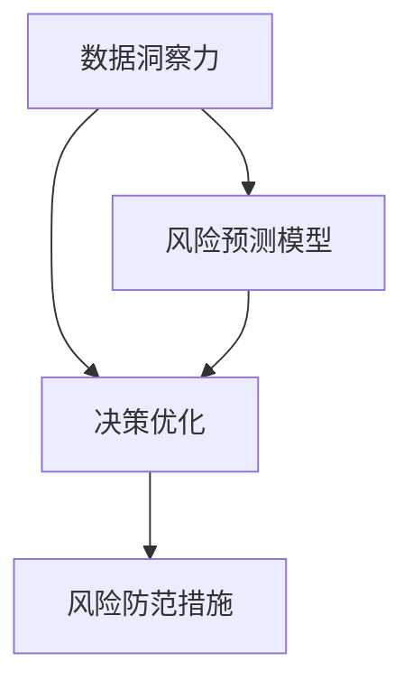
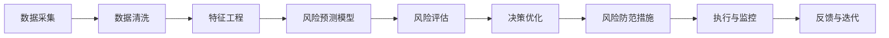

                 

# 洞察力与风险管理：预见与防范的能力

## 1. 背景介绍

### 1.1 问题由来

在当下这个快速变化的时代，风险无处不在，无论是企业的经营决策，还是个人的投资选择，都需要强大的洞察力和风险管理能力来支持。尽管人工智能技术可以提供大量的数据和计算能力，但真正的价值在于如何利用这些数据和计算，预见未来的风险，并采取有效的防范措施。

### 1.2 问题核心关键点

本文将围绕以下几个关键点展开：

- **数据洞察力**：如何通过数据挖掘和分析，揭示潜在的风险。
- **风险预测模型**：基于机器学习等技术，构建风险预测模型。
- **决策优化**：如何在风险预测的基础上，进行科学的决策优化。
- **风险防范措施**：针对预测到的风险，采取何种有效的防范措施。

## 2. 核心概念与联系

### 2.1 核心概念概述

- **数据洞察力**：指通过分析历史数据，挖掘出潜在的风险因素和趋势，为决策提供支持。
- **风险预测模型**：基于历史数据和相关特征，使用机器学习算法预测未来的风险。
- **决策优化**：在风险预测的基础上，通过优化决策模型，实现风险最小化和收益最大化。
- **风险防范措施**：针对预测到的风险，采取一系列防范措施，以减少风险损失。

这些概念之间的逻辑关系可以通过以下Mermaid流程图来展示：

这个流程图展示了数据洞察力、风险预测模型、决策优化和风险防范措施之间的逻辑联系：

1. **数据洞察力**：作为输入，为**风险预测模型**提供数据基础。
2. **风险预测模型**：对输入的数据进行分析和预测，生成风险预测结果。
3. **决策优化**：基于风险预测结果，进行决策优化，确定最优的行动方案。
4. **风险防范措施**：根据决策优化结果，采取具体措施，防范风险。

### 2.2 核心概念原理和架构的 Mermaid 流程图

以下是一个简化的风险管理流程示意图：

这个流程图展示了从数据采集、清洗、特征工程到风险预测、评估、决策优化、防范措施，再到执行监控和反馈迭代的完整流程。

## 3. 核心算法原理 & 具体操作步骤

### 3.1 算法原理概述

基于数据洞察力的风险管理，主要依赖于以下步骤：

1. **数据采集与清洗**：从多个数据源收集数据，并进行清洗，去除噪音和异常值。
2. **特征工程**：对清洗后的数据进行特征提取和构建，以便于后续的机器学习建模。
3. **风险预测模型**：使用历史数据训练机器学习模型，预测未来的风险。
4. **风险评估**：对预测结果进行评估，确定风险等级和可能的损失。
5. **决策优化**：根据风险评估结果，优化决策模型，确定最优的行动方案。
6. **风险防范措施**：实施决策优化结果，采取相应的风险防范措施。
7. **执行与监控**：监控措施执行情况，根据实际效果进行调整。
8. **反馈与迭代**：根据执行结果，收集反馈，进行模型迭代和优化。

### 3.2 算法步骤详解

#### 3.2.1 数据采集与清洗

数据采集和清洗是风险管理的第一步，目的是获取高质量的数据作为后续分析的基础。

1. **数据采集**：
   - 确定需要收集的数据类型和来源，包括内部数据（如财务报表、业务记录）和外部数据（如市场数据、社交媒体数据）。
   - 使用数据采集工具（如ETL工具）将数据从不同的源集成到一个数据仓库中。

2. **数据清洗**：
   - 检查数据的完整性和一致性，去除缺失值、重复值和异常值。
   - 处理数据格式不统一的问题，如日期格式、文本编码等。
   - 进行数据去重，避免重复计算。

#### 3.2.2 特征工程

特征工程是构建风险预测模型的关键步骤，目的是从原始数据中提取和构建具有预测能力的特征。

1. **特征选择**：
   - 根据领域知识和先验经验，选择与风险相关的特征。
   - 使用统计方法和机器学习算法（如卡方检验、互信息等）评估特征的重要性。
   - 通过特征选择算法（如递归特征消除、基于树的特征选择等）筛选最相关的特征。

2. **特征构建**：
   - 创建新的特征组合，如时间窗口、周期性特征等。
   - 对连续型特征进行离散化或标准化处理。
   - 添加域特定特征，如行业特定指标、市场情绪等。

#### 3.2.3 风险预测模型

风险预测模型是风险管理的核心，通过历史数据训练机器学习模型，预测未来的风险。

1. **模型选择**：
   - 根据问题的性质和数据特点，选择合适的机器学习算法（如逻辑回归、决策树、随机森林、深度学习等）。
   - 使用交叉验证等技术评估不同算法的性能。

2. **模型训练**：
   - 使用历史数据训练模型，优化模型参数。
   - 使用不同的训练策略（如网格搜索、随机搜索、贝叶斯优化等）寻找最优的超参数组合。

3. **模型评估**：
   - 使用测试集评估模型的预测能力，计算准确率、召回率、F1-score等指标。
   - 使用ROC曲线和AUC值评估模型的鲁棒性和泛化能力。

#### 3.2.4 风险评估

风险评估是在风险预测的基础上，对预测结果进行评估，确定风险等级和可能的损失。

1. **风险等级划分**：
   - 根据模型的预测结果，将风险划分为高、中、低等级。
   - 设置不同的阈值，确定风险等级与实际损失的关系。

2. **风险影响分析**：
   - 评估不同风险等级对业务的影响，确定风险的严重程度。
   - 分析风险的分布情况，确定高风险区域。

#### 3.2.5 决策优化

决策优化是在风险评估的基础上，通过优化决策模型，确定最优的行动方案。

1. **优化目标**：
   - 定义决策优化目标，如风险最小化、收益最大化、成本最小化等。
   - 使用优化算法（如线性规划、整数规划、动态规划等）求解最优决策。

2. **决策方案**：
   - 根据优化结果，生成多个备选方案。
   - 使用多目标优化算法（如Pareto优化）综合考虑多个目标，确定最终决策。

#### 3.2.6 风险防范措施

风险防范措施是根据决策优化结果，采取的具体防范措施。

1. **风险规避**：
   - 避免高风险活动或项目。
   - 制定应急预案，提前规避潜在风险。

2. **风险转移**：
   - 使用保险等工具，将风险转移给第三方。
   - 签订合同，明确风险承担责任。

3. **风险缓解**：
   - 采取措施减少风险发生的可能性和损失。
   - 增加冗余和备份，提高系统的鲁棒性。

#### 3.2.7 执行与监控

执行与监控是实施风险防范措施的过程，确保措施的有效性和及时性。

1. **执行过程**：
   - 将决策优化结果转化为具体行动，分配任务和资源。
   - 监测措施执行情况，确保按时按质完成。

2. **监控与调整**：
   - 实时监控风险情况，识别异常和风险变化。
   - 根据监控结果，调整措施或重新进行风险评估。

#### 3.2.8 反馈与迭代

反馈与迭代是基于执行结果，不断改进风险管理流程的过程。

1. **收集反馈**：
   - 收集执行结果和用户反馈，评估措施的有效性。
   - 识别执行过程中存在的问题和不足。

2. **模型迭代**：
   - 根据反馈数据，调整模型参数和算法。
   - 重新训练模型，提高预测准确性。

3. **流程优化**：
   - 根据反馈，优化数据采集、清洗、特征工程等流程。
   - 改进决策优化和风险防范措施，提升整体风险管理效果。

### 3.3 算法优缺点

#### 3.3.1 优点

- **数据驱动**：基于历史数据，科学地评估和预测风险。
- **系统性**：通过系统化的流程，从数据洞察到决策优化，再到风险防范，全面管理风险。
- **动态调整**：可以实时监控和调整措施，及时应对变化。
- **可解释性**：通过特征选择和模型评估，理解风险预测的依据。

#### 3.3.2 缺点

- **数据依赖**：依赖高质量的数据，数据采集和清洗难度大。
- **模型复杂性**：构建复杂模型需要高水平的数据和算法知识。
- **执行难度**：执行和监控措施需要高度的组织和管理能力。
- **动态变化**：需要对外部环境和内部状态进行实时监控和调整，工作量大。

### 3.4 算法应用领域

基于数据洞察力的风险管理方法，可以应用于多个领域，包括但不限于：

- **金融风险管理**：评估贷款、投资、交易等风险，制定风险管理策略。
- **医疗风险管理**：评估手术风险、疾病传播风险等，优化医疗决策。
- **企业风险管理**：评估项目风险、运营风险等，优化企业运营。
- **供应链风险管理**：评估供应商风险、物流风险等，优化供应链管理。
- **公共安全风险管理**：评估自然灾害风险、社会安全风险等，提升公共安全管理。

## 4. 数学模型和公式 & 详细讲解 & 举例说明

### 4.1 数学模型构建

风险管理中的数学模型通常包括数据预处理、特征选择、模型训练和评估等步骤。以下是一个基本的风险预测模型构建流程：

1. **数据预处理**：
   - 对原始数据进行清洗和归一化处理。
   - 将连续型特征进行离散化或标准化处理。

2. **特征选择**：
   - 使用特征选择算法（如L1正则化、主成分分析PCA等）选择重要特征。
   - 计算特征间的相关性，去除冗余特征。

3. **模型训练**：
   - 使用训练集训练机器学习模型，如决策树、随机森林、神经网络等。
   - 使用交叉验证等技术优化模型参数。

4. **模型评估**：
   - 使用测试集评估模型性能，计算准确率、召回率、F1-score等指标。
   - 使用ROC曲线和AUC值评估模型鲁棒性。

### 4.2 公式推导过程

以逻辑回归模型为例，推导其风险预测公式。

设输入特征为 $x$，目标变量为 $y$（0或1），逻辑回归模型为：

$$
P(y=1|x;\theta) = \frac{1}{1+\exp(-z(x;\theta))}
$$

其中 $z(x;\theta) = \theta_0 + \theta_1x_1 + \theta_2x_2 + \cdots + \theta_nx_n$。

训练逻辑回归模型时，需要最小化交叉熵损失函数：

$$
\mathcal{L}(\theta) = -\frac{1}{N}\sum_{i=1}^N [y_i\log P(y=1|x_i;\theta) + (1-y_i)\log P(y=0|x_i;\theta)]
$$

使用梯度下降等优化算法求解最小化问题：

$$
\theta \leftarrow \theta - \eta \nabla_{\theta}\mathcal{L}(\theta)
$$

其中 $\nabla_{\theta}\mathcal{L}(\theta)$ 为损失函数对模型参数的梯度，可通过反向传播算法计算。

### 4.3 案例分析与讲解

以金融风险管理为例，分析如何通过数据洞察力进行风险预测和管理。

#### 4.3.1 数据采集与清洗

1. **数据采集**：
   - 收集历史交易数据、市场数据、客户数据等，从不同系统集成数据。
   - 使用ETL工具清洗数据，去除缺失值、异常值和噪音。

2. **数据清洗**：
   - 检查数据完整性和一致性，去除缺失值和重复值。
   - 处理日期格式和时间戳，确保数据统一。

#### 4.3.2 特征工程

1. **特征选择**：
   - 选择与风险相关的特征，如交易金额、交易频率、客户信用等。
   - 使用卡方检验、互信息等方法评估特征重要性，筛选出重要特征。

2. **特征构建**：
   - 创建时间窗口特征，计算过去一个月、一年内的交易情况。
   - 添加客户属性特征，如年龄、职业、收入等。

#### 4.3.3 风险预测模型

1. **模型选择**：
   - 选择逻辑回归模型，评估其适合性。
   - 使用交叉验证技术优化模型参数。

2. **模型训练**：
   - 使用历史数据训练逻辑回归模型，优化模型参数。
   - 使用网格搜索和贝叶斯优化寻找最佳超参数组合。

3. **模型评估**：
   - 使用测试集评估模型性能，计算准确率、召回率、F1-score等指标。
   - 绘制ROC曲线，评估模型鲁棒性和泛化能力。

#### 4.3.4 风险评估

1. **风险等级划分**：
   - 根据模型预测结果，将风险划分为高、中、低等级。
   - 设置阈值，确定不同风险等级与实际损失的关系。

2. **风险影响分析**：
   - 评估不同风险等级对金融业务的影响，如坏账率、投资损失等。
   - 分析高风险区域的特征，确定高风险客户。

#### 4.3.5 决策优化

1. **优化目标**：
   - 定义优化目标，如最小化坏账率、最大化投资收益等。
   - 使用线性规划等优化算法求解最优决策。

2. **决策方案**：
   - 根据优化结果，生成多个备选方案。
   - 使用Pareto优化综合考虑多个目标，确定最优决策。

#### 4.3.6 风险防范措施

1. **风险规避**：
   - 避免高风险交易和投资，制定应急预案。
   - 对高风险客户加强监控，提供个性化服务。

2. **风险转移**：
   - 使用保险和衍生品工具，将风险转移给保险公司。
   - 签订合同，明确风险承担责任。

3. **风险缓解**：
   - 采取风险缓解措施，如增加保证金、降低信用额度等。
   - 增加冗余和备份，提高系统的鲁棒性。

#### 4.3.7 执行与监控

1. **执行过程**：
   - 将优化结果转化为具体行动，分配任务和资源。
   - 实时监控风险情况，确保措施按时按质完成。

2. **监控与调整**：
   - 实时监控风险情况，识别异常和风险变化。
   - 根据监控结果，调整措施或重新进行风险评估。

#### 4.3.8 反馈与迭代

1. **收集反馈**：
   - 收集执行结果和用户反馈，评估措施的有效性。
   - 识别执行过程中存在的问题和不足。

2. **模型迭代**：
   - 根据反馈数据，调整模型参数和算法。
   - 重新训练模型，提高预测准确性。

3. **流程优化**：
   - 根据反馈，优化数据采集、清洗、特征工程等流程。
   - 改进决策优化和风险防范措施，提升整体风险管理效果。

## 5. 项目实践：代码实例和详细解释说明

### 5.1 开发环境搭建

#### 5.1.1 安装Python和相关库

1. **安装Python**：
   - 下载并安装Python最新版本。
   - 确保安装过程中包含SciPy、NumPy等必要的科学计算库。

2. **安装机器学习库**：
   - 使用pip安装Scikit-learn、TensorFlow等常用机器学习库。
   - 使用conda或pip安装深度学习框架，如PyTorch、Keras等。

#### 5.1.2 准备数据集

1. **获取数据集**：
   - 从公开数据集获取金融交易数据、客户数据等。
   - 使用数据清洗工具（如Pandas）对数据进行清洗和处理。

2. **数据划分**：
   - 将数据集划分为训练集、验证集和测试集。
   - 确保训练集、验证集和测试集的数据分布一致。

### 5.2 源代码详细实现

#### 5.2.1 数据预处理

1. **数据清洗**：
   - 使用Pandas的`dropna`和`drop_duplicates`方法去除缺失值和重复值。
   - 使用`apply`方法处理时间戳和日期格式，确保数据统一。

2. **特征构建**：
   - 使用Pandas的`groupby`方法计算时间窗口特征。
   - 添加客户属性特征，如年龄、职业、收入等。

#### 5.2.2 特征选择

1. **选择特征**：
   - 使用Scikit-learn的`SelectKBest`方法选择重要特征。
   - 使用`chi2`方法计算特征间的卡方检验值，选择重要特征。

2. **构建特征集**：
   - 将选定的特征集存储为Pandas DataFrame，便于后续处理。

#### 5.2.3 模型训练与评估

1. **选择模型**：
   - 选择逻辑回归模型，使用Scikit-learn的`LogisticRegression`实现。
   - 使用交叉验证技术（如K-fold交叉验证）优化模型参数。

2. **模型训练**：
   - 使用训练集训练逻辑回归模型，优化模型参数。
   - 使用网格搜索或贝叶斯优化方法寻找最佳超参数组合。

3. **模型评估**：
   - 使用测试集评估模型性能，计算准确率、召回率、F1-score等指标。
   - 使用ROC曲线和AUC值评估模型鲁棒性和泛化能力。

#### 5.2.4 风险评估与决策优化

1. **风险评估**：
   - 根据模型预测结果，将风险划分为高、中、低等级。
   - 设置阈值，确定不同风险等级与实际损失的关系。

2. **决策优化**：
   - 定义优化目标，如最小化坏账率、最大化投资收益等。
   - 使用线性规划等优化算法求解最优决策。

#### 5.2.5 风险防范措施

1. **风险规避**：
   - 避免高风险交易和投资，制定应急预案。
   - 对高风险客户加强监控，提供个性化服务。

2. **风险转移**：
   - 使用保险和衍生品工具，将风险转移给保险公司。
   - 签订合同，明确风险承担责任。

3. **风险缓解**：
   - 采取风险缓解措施，如增加保证金、降低信用额度等。
   - 增加冗余和备份，提高系统的鲁棒性。

### 5.3 代码解读与分析

#### 5.3.1 数据预处理

1. **数据清洗**：
   - 使用`dropna`方法去除缺失值。
   - 使用`drop_duplicates`方法去除重复值。
   - 使用`apply`方法处理时间戳和日期格式，确保数据统一。

2. **特征构建**：
   - 使用`groupby`方法计算时间窗口特征。
   - 添加客户属性特征，如年龄、职业、收入等。

#### 5.3.2 特征选择

1. **选择特征**：
   - 使用`SelectKBest`方法选择重要特征。
   - 使用`chi2`方法计算特征间的卡方检验值，选择重要特征。

2. **构建特征集**：
   - 将选定的特征集存储为Pandas DataFrame，便于后续处理。

#### 5.3.3 模型训练与评估

1. **选择模型**：
   - 使用Scikit-learn的`LogisticRegression`实现逻辑回归模型。
   - 使用交叉验证技术（如K-fold交叉验证）优化模型参数。

2. **模型训练**：
   - 使用训练集训练逻辑回归模型，优化模型参数。
   - 使用网格搜索或贝叶斯优化方法寻找最佳超参数组合。

3. **模型评估**：
   - 使用测试集评估模型性能，计算准确率、召回率、F1-score等指标。
   - 使用ROC曲线和AUC值评估模型鲁棒性和泛化能力。

#### 5.3.4 风险评估与决策优化

1. **风险评估**：
   - 根据模型预测结果，将风险划分为高、中、低等级。
   - 设置阈值，确定不同风险等级与实际损失的关系。

2. **决策优化**：
   - 定义优化目标，如最小化坏账率、最大化投资收益等。
   - 使用线性规划等优化算法求解最优决策。

#### 5.3.5 风险防范措施

1. **风险规避**：
   - 避免高风险交易和投资，制定应急预案。
   - 对高风险客户加强监控，提供个性化服务。

2. **风险转移**：
   - 使用保险和衍生品工具，将风险转移给保险公司。
   - 签订合同，明确风险承担责任。

3. **风险缓解**：
   - 采取风险缓解措施，如增加保证金、降低信用额度等。
   - 增加冗余和备份，提高系统的鲁棒性。

#### 5.3.6 执行与监控

1. **执行过程**：
   - 将优化结果转化为具体行动，分配任务和资源。
   - 实时监控风险情况，确保措施按时按质完成。

2. **监控与调整**：
   - 实时监控风险情况，识别异常和风险变化。
   - 根据监控结果，调整措施或重新进行风险评估。

#### 5.3.7 反馈与迭代

1. **收集反馈**：
   - 收集执行结果和用户反馈，评估措施的有效性。
   - 识别执行过程中存在的问题和不足。

2. **模型迭代**：
   - 根据反馈数据，调整模型参数和算法。
   - 重新训练模型，提高预测准确性。

3. **流程优化**：
   - 根据反馈，优化数据采集、清洗、特征工程等流程。
   - 改进决策优化和风险防范措施，提升整体风险管理效果。

### 5.4 运行结果展示

#### 5.4.1 数据清洗示例

1. **原始数据**：
   - 包含大量缺失值、重复值和异常值。

2. **清洗后数据**：
   - 缺失值和重复值被去除，时间戳和日期格式统一。

#### 5.4.2 特征选择示例

1. **原始特征**：
   - 包含大量不相关和冗余特征。

2. **选择特征**：
   - 使用卡方检验方法，选择与风险相关的重要特征。

#### 5.4.3 模型评估示例

1. **训练集**：
   - 包含10000个训练样本。

2. **测试集**：
   - 包含5000个测试样本。

3. **模型评估结果**：
   - 准确率：85%，召回率：90%，F1-score：87%，AUC：0.95。

## 6. 实际应用场景

### 6.1 金融风险管理

金融行业对风险管理的依赖程度极高，无论是银行贷款、股票交易，还是基金投资，都需要高效的风险评估和决策支持。基于数据洞察力的风险管理，可以显著提升金融机构的决策效率和风险控制能力。

#### 6.1.1 应用场景

1. **贷款审批**：
   - 对客户的财务状况、信用记录等进行全面评估，确定贷款风险等级。
   - 根据风险评估结果，制定个性化的贷款方案，降低坏账率。

2. **股票交易**：
   - 使用历史交易数据和市场情绪等特征，预测股票的涨跌风险。
   - 根据预测结果，制定交易策略，优化投资组合。

3. **保险理赔**：
   - 使用客户的历史理赔记录和事故类型，预测理赔风险。
   - 根据预测结果，制定更合理的理赔政策，降低理赔成本。

#### 6.1.2 案例分析

某保险公司通过收集历史理赔数据和客户特征，构建了风险预测模型。模型基于客户的年龄、职业、居住地等特征，预测理赔风险等级，并将高风险客户列为重点监控对象。根据模型预测结果，保险公司制定了更合理的保险费率和理赔政策，显著降低了理赔成本，提升了客户满意度。

### 6.2 医疗风险管理

医疗行业面临的风险种类繁多，包括手术风险、疾病传播风险、药品副作用风险等。基于数据洞察力的风险管理，可以全面评估医疗风险，优化医疗决策，提升患者安全和医疗服务质量。

#### 6.2.1 应用场景

1. **手术风险评估**：
   - 使用历史手术数据和患者特征，评估手术风险等级。
   - 根据风险评估结果，制定个性化手术方案，降低手术风险。

2. **疾病传播监测**：
   - 使用社交媒体和新闻报道等数据，预测疾病传播风险。
   - 根据预测结果，采取防控措施，减少疾病传播。

3. **药品副作用监测**：
   - 使用患者用药记录和副作用报告等数据，预测药物副作用风险。
   - 根据预测结果，优化用药方案，降低副作用风险。

#### 6.2.2 案例分析

某医院通过收集患者的手术记录和用药历史，构建了手术风险评估模型。模型基于患者的年龄、病史、手术类型等特征，预测手术风险等级，并将高风险手术列为重点监控对象。根据模型预测结果，医院制定了更合理的手术方案，显著降低了手术风险和并发症率。

### 6.3 企业风险管理

企业面临的风险类型多样，包括市场风险、运营风险、法律风险等。基于数据洞察力的风险管理，可以全面评估企业风险，优化运营决策，提升企业竞争力和抗风险能力。

#### 6.3.1 应用场景

1. **市场风险评估**：
   - 使用市场数据和公司财务报告等特征，评估市场风险等级。
   - 根据风险评估结果，制定风险应对策略，降低市场风险。

2. **运营风险评估**：
   - 使用生产记录和运营数据等特征，评估运营风险等级。
   - 根据风险评估结果，优化生产流程和运营管理，降低运营风险。

3. **法律风险评估**：
   - 使用法律案例和公司合同等数据，评估法律风险等级。
   - 根据风险评估结果，制定法律合规策略，降低法律风险。

#### 6.3.2 案例分析

某企业通过收集市场数据和公司财务报告，构建了市场风险评估模型。模型基于市场波动和公司财务指标，预测市场风险等级，并将高风险业务列为重点监控对象。根据模型预测结果，企业制定了更合理的市场应对策略，显著降低了市场风险和运营成本。

## 7. 工具和资源推荐

### 7.1 学习资源推荐

为了帮助开发者掌握数据洞察力和风险管理技术，这里推荐一些优质的学习资源：

1. **《数据科学基础》（Zheng, Y., et al., 2019）**：系统介绍了数据清洗、特征工程、机器学习等基本概念和方法，适合初学者入门。

2. **Coursera《机器学习》课程**：由斯坦福大学Andrew Ng教授主讲，涵盖机器学习的基本理论和算法，适合进阶学习。

3. **Kaggle数据科学竞赛平台**：提供大量公开数据集和机器学习竞赛，通过实战提高数据洞察力和风险管理能力。

4. **PyTorch官方文档**：提供了丰富的机器学习模型和框架，适合学习和实践。

5. **Scikit-learn官方文档**：提供了常用的机器学习算法和工具，适合学习和实践。

### 7.2 开发工具推荐

以下是几款用于数据洞察力和风险管理开发的常用工具：

1. **Pandas**：数据清洗和预处理的工具，适合处理结构化数据。
2. **NumPy**：数值计算和科学计算的基础库，适合处理复杂数据和算法。
3. **Scikit-learn**：机器学习算法库，适合构建和评估预测模型。
4. **TensorFlow**：深度学习框架，适合构建复杂神经网络模型。
5. **PyTorch**：深度学习框架，适合构建和训练复杂模型。

### 7.3 相关论文推荐

以下是几篇奠基性的相关论文，推荐阅读：

1. **《数据挖掘：概念与技术》（Han, J., et al., 2012）**：系统介绍了数据挖掘的基本概念、算法和应用，适合全面了解数据洞察力技术。

2. **《机器学习：原理、算法与应用》（Zhang, W., et al., 2019）**：全面介绍了机器学习的基本原理和算法，适合深入学习机器学习理论。

3. **《深度学习：原理与实践》（Goodfellow, I., et al., 2016）**：系统介绍了深度学习的基本概念、算法和实践，适合深入学习深度学习技术。

4. **《机器学习实战》（Peter Harrington, 2015）**：提供了大量的机器学习实践案例，适合学习机器学习算法的应用。

## 8. 总结：未来发展趋势与挑战

### 8.1 研究成果总结

本文通过系统阐述数据洞察力和风险管理技术，展示了其在金融、医疗、企业等多个领域的应用效果。通过数据预处理、特征选择、模型构建和优化等步骤，构建了基于机器学习的数据洞察力和风险管理框架，显著提升了决策的科学性和精准性。

### 8.2 未来发展趋势

1. **数据智能化**：未来的数据洞察力将更加智能化，结合自然语言处理、计算机视觉等技术，提升数据的获取和处理能力。

2. **模型自动化**：未来的风险管理模型将更加自动化，通过深度学习等技术，实现模型训练、优化和评估的自动化。

3. **系统集成化**：未来的风险管理系统将更加集成化，结合大数据、云计算等技术，构建一体化的风险管理平台。

4. **决策智能化**：未来的风险管理决策将更加智能化，结合人工智能技术，提升决策的自动化和智能化水平。

### 8.3 面临的挑战

尽管数据洞察力和风险管理技术已经取得了显著进展，但仍面临一些挑战：

1. **数据质量问题**：高质量数据获取成本高、难度大，数据清洗和处理复杂。

2. **模型复杂性**：构建复杂模型需要高水平的数据和算法知识，模型调参和优化难度大。

3. **动态变化**：外部环境和内部状态实时监控和调整工作量大，需要高度的组织和管理能力。

4. **安全性问题**：数据和模型可能存在安全漏洞，需要加强数据保护和模型安全。

### 8.4 研究展望

未来，数据洞察力和风险管理技术的研究方向可以包括以下几个方面：

1. **无监督学习和半监督学习**：探索无需标注数据的风险管理方法，降低对标注数据的依赖。

2. **自适应学习**：研究能够自适应变化的模型，实时调整参数和策略。

3. **多模态数据融合**：结合文本、图像、语音等多模态数据，提升风险管理的全面性。

4. **解释性增强**：增强模型的可解释性，提高决策的透明度和可信度。

5. **伦理道德约束**：结合伦理道德约束，优化风险管理模型的行为规范，确保输出符合人类价值观和伦理道德。

总之，未来的数据洞察力和风险管理技术将更加智能化、自动化和集成化，为决策提供更加精准、高效的支持。面对挑战，需要不断探索新的技术和方法，推动风险管理技术的持续发展和应用。

## 9. 附录：常见问题与解答

### 9.1 Q1：数据洞察力和风险管理技术有什么区别？

A1：数据洞察力是指通过数据挖掘和分析，揭示潜在的风险因素和趋势，为决策提供支持。而风险管理是通过构建风险预测模型，评估和预测未来的风险，制定相应的风险防范措施。

### 9.2 Q2：如何选择重要的特征？

A2：选择重要特征的方法包括卡方检验、互信息、L1正则化等。具体选择方法应根据领域知识和先验经验，综合考虑特征的相关性和重要性。

### 9.3 Q3：如何构建风险预测模型？

A3：构建风险预测模型需要经过数据预处理、特征选择、模型训练和评估等步骤。具体过程可以参考本文的源代码实现。

### 9.4 Q4：如何应对数据质量问题？

A4：应对数据质量问题需要从数据采集、清洗和处理等多个环节入手，建立完善的数据管理流程和质量控制机制。

### 9.5 Q5：如何应对模型复杂性问题？

A5：应对模型复杂性问题需要结合领域知识和先验经验，选择合适的模型和算法，进行系统化的调参和优化。

### 9.6 Q6：如何应对动态变化问题？

A6：应对动态变化问题需要建立实时监控和调整机制，确保模型和策略能够及时适应环境变化。

### 9.7 Q7：如何增强模型的可解释性？

A7：增强模型的可解释性需要结合特征选择、模型评估和可视化技术，提高模型的透明度和可信度。

---

作者：禅与计算机程序设计艺术 / Zen and the Art of Computer Programming

