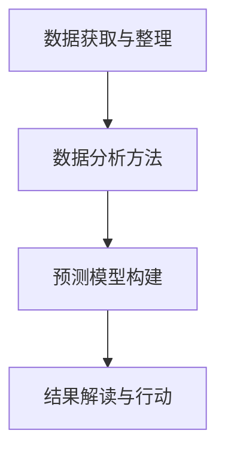

                 

# 洞察力的培养：从观察到预测的能力提升

## 1. 背景介绍

在信息爆炸的时代，数据的获取变得轻而易举，然而，如何从海量数据中提取有价值的洞察力成为了企业决策者面临的挑战。洞察力不仅仅是数据分析的结果，更是一种能力，它要求从观察数据中，识别出背后的模式、趋势和异常，进而进行有效的预测和决策。因此，培养和提升洞察力，不仅是数据科学家的核心技能，也是每位企业决策者的必备素养。

### 1.1 问题由来

随着大数据技术的发展，企业能够收集到前所未有的数据量。然而，数据量越大，数据复杂度越高，从中提取有用的信息也变得越具挑战性。传统的统计方法、手工分析等方式已经无法满足快速、准确提取洞察力的需求。在这样的背景下，数据洞察力培养和提升变得尤为重要。

### 1.2 问题核心关键点

洞察力的培养和提升涉及多个核心关键点，包括但不限于：
- 数据获取与整理：收集与清洗数据，确保数据的质量和完整性。
- 数据分析方法：掌握统计分析、机器学习等数据分析方法，识别数据中的模式和趋势。
- 预测模型构建：利用模型进行数据预测，提升决策的准确性和效率。
- 结果解读与行动：将数据洞察转化为可操作的策略和行动，促进企业发展。

## 2. 核心概念与联系

### 2.1 核心概念概述

洞察力培养和提升涉及多个核心概念，这些概念之间相互联系，构成了一个完整的洞察力培养体系：

- **数据获取与整理**：数据收集、清洗和预处理是洞察力培养的基础。数据的准确性和完整性直接影响洞察力的准确性。
- **数据分析方法**：统计分析、机器学习等数据分析方法，能够从数据中提取有价值的洞察力。
- **预测模型构建**：利用机器学习模型进行预测，能够提升洞察力的准确性和实用性。
- **结果解读与行动**：将洞察力转化为可操作的策略和行动，促进企业发展。

这些概念之间的关系可以通过以下Mermaid流程图来展示：



## 3. 核心算法原理 & 具体操作步骤

### 3.1 算法原理概述

洞察力的培养和提升，本质上是通过数据分析方法，从数据中提取模式和趋势，构建预测模型，最终转化为可操作的策略和行动。其中，数据分析方法和预测模型的构建是核心。

- **数据分析方法**：主要包括统计分析、回归分析、聚类分析、关联规则分析等。这些方法能够从数据中提取统计特征、发现模式和趋势。
- **预测模型构建**：包括线性回归、决策树、随机森林、支持向量机、神经网络等。这些模型能够根据历史数据，构建预测模型，进行未来预测。

### 3.2 算法步骤详解

洞察力培养和提升的算法步骤可以概括为以下几个关键环节：

**Step 1: 数据获取与整理**
- 收集相关数据，包括结构化数据和非结构化数据。
- 清洗数据，去除噪声和异常值，确保数据的质量和完整性。

**Step 2: 数据分析**
- 使用统计分析、回归分析等方法，从数据中提取统计特征。
- 应用聚类分析、关联规则分析等方法，发现数据中的模式和趋势。

**Step 3: 预测模型构建**
- 选择适合的预测模型，如线性回归、决策树等。
- 使用历史数据训练模型，并进行参数调优，提高预测准确性。

**Step 4: 结果解读与行动**
- 根据模型预测结果，分析背后的原因和影响因素。
- 将数据洞察转化为可操作的策略和行动，促进企业发展。

### 3.3 算法优缺点

洞察力培养和提升的算法具有以下优点：
- 数据驱动：洞察力培养基于数据驱动的方法，能够提供客观、准确的分析结果。
- 自动化：现代数据分析工具能够自动完成数据清洗、特征提取等任务，提高效率。
- 可扩展性：算法能够处理大规模数据，适应不同规模的企业需求。

同时，该方法也存在一些局限性：
- 数据质量要求高：数据分析结果的准确性依赖于数据的质量和完整性。
- 算法复杂度高：复杂的算法模型，需要较高的计算资源和时间成本。
- 结果解释性：一些高级预测模型，如深度学习模型，结果的解释性较弱。

### 3.4 算法应用领域

洞察力培养和提升的算法广泛应用于企业决策、市场分析、风险管理等多个领域：

- **企业决策**：利用洞察力进行市场分析、竞争分析、趋势预测，辅助企业决策。
- **市场分析**：从客户数据中提取洞察力，了解市场需求和趋势，制定营销策略。
- **风险管理**：从历史数据中发现风险因素，预测未来风险，制定风险管理策略。

## 4. 数学模型和公式 & 详细讲解 & 举例说明

### 4.1 数学模型构建

洞察力培养和提升的数学模型主要涉及统计分析和机器学习模型。以线性回归模型为例，其数学模型构建如下：

设 $y$ 为因变量，$x_1, x_2, ..., x_n$ 为自变量，模型为：

$$
y = \beta_0 + \beta_1x_1 + \beta_2x_2 + ... + \beta_nx_n + \epsilon
$$

其中，$\beta$ 为回归系数，$\epsilon$ 为随机误差项。

### 4.2 公式推导过程

线性回归模型的最小二乘法估计公式为：

$$
\hat{\beta} = (X^TX)^{-1}X^Ty
$$

其中，$X$ 为自变量矩阵，$y$ 为因变量向量。

### 4.3 案例分析与讲解

以一家零售企业的销售数据为例，分析销售额与促销活动之间的关系。设销售额为 $y$，促销活动次数为 $x_1$，广告支出为 $x_2$，价格为 $x_3$。构建线性回归模型：

$$
y = \beta_0 + \beta_1x_1 + \beta_2x_2 + \beta_3x_3 + \epsilon
$$

使用历史数据训练模型，得到回归系数 $\hat{\beta}$，并使用模型预测未来的销售额。

## 5. 项目实践：代码实例和详细解释说明

### 5.1 开发环境搭建

在进行洞察力培养和提升的实践前，需要先搭建开发环境。以下是使用Python进行Pandas和Scikit-learn开发的环  


境配置流程：

1. 安装Anaconda：从官网下载并安装Anaconda，用于创建独立的Python环境。

2. 创建并激活虚拟环境：
```bash
conda create -n insight-env python=3.8 
conda activate insight-env
```

3. 安装Pandas、Scikit-learn等库：
```bash
conda install pandas scikit-learn numpy matplotlib jupyter notebook ipython
```

4. 安装必要的工具包：
```bash
pip install statsmodels seaborn beautifulsoup4
```

完成上述步骤后，即可在`insight-env`环境中进行洞察力培养和提升的实践。

### 5.2 源代码详细实现

以下是使用Pandas和Scikit-learn进行数据清洗、数据分析和预测模型构建的Python代码实现：

```python
import pandas as pd
from sklearn.model_selection import train_test_split
from sklearn.linear_model import LinearRegression
from sklearn.metrics import mean_squared_error

# 数据获取与整理
data = pd.read_csv('sales_data.csv')
data = data.dropna()  # 去除缺失值

# 数据分析
X = data[['x1', 'x2', 'x3']]  # 自变量
y = data['y']  # 因变量

# 数据分割
X_train, X_test, y_train, y_test = train_test_split(X, y, test_size=0.2)

# 预测模型构建
model = LinearRegression()
model.fit(X_train, y_train)

# 结果解读与行动
y_pred = model.predict(X_test)
mse = mean_squared_error(y_test, y_pred)
print('MSE:', mse)
```

### 5.3 代码解读与分析

让我们再详细解读一下关键代码的实现细节：

**数据获取与整理**：
- `data = pd.read_csv('sales_data.csv')`：读取CSV格式的数据文件。
- `data = data.dropna()`：去除数据中的缺失值，确保数据完整性。

**数据分析**：
- `X = data[['x1', 'x2', 'x3']]`：选择自变量。
- `y = data['y']`：选择因变量。

**预测模型构建**：
- `X_train, X_test, y_train, y_test = train_test_split(X, y, test_size=0.2)`：将数据划分为训练集和测试集。
- `model = LinearRegression()`：初始化线性回归模型。
- `model.fit(X_train, y_train)`：训练模型。

**结果解读与行动**：
- `y_pred = model.predict(X_test)`：使用模型进行预测。
- `mse = mean_squared_error(y_test, y_pred)`：计算预测结果与真实结果的均方误差。
- `print('MSE:', mse)`：输出均方误差。

可以看到，Pandas和Scikit-learn库的使用使得洞察力培养和提升的代码实现变得简洁高效。开发者可以将更多精力放在数据处理、模型改进等高层逻辑上，而不必过多关注底层的实现细节。

## 6. 实际应用场景

### 6.1 智慧零售

利用洞察力培养和提升技术，智慧零售企业能够实时分析销售数据，发现销售趋势和客户偏好，制定精准的促销策略和库存管理方案，提升运营效率和客户满意度。

在技术实现上，可以构建预测模型，分析历史销售数据和促销活动，预测未来的销售趋势和最佳促销策略。同时，通过A/B测试等方法，优化促销活动的效果，实现精细化运营。

### 6.2 金融风险管理

金融行业面临复杂多变的市场环境，利用洞察力培养和提升技术，金融机构能够及时发现风险信号，进行风险预警和应对，降低损失。

具体而言，可以构建预测模型，分析历史交易数据和市场指标，预测未来的市场趋势和风险点。同时，通过异常检测等方法，实时监控市场动态，快速响应风险事件，实现风险管理。

### 6.3 医疗健康

医疗健康行业面临海量患者数据和复杂的多模态数据，利用洞察力培养和提升技术，医疗机构能够深入分析患者数据，提供个性化的诊疗方案，提升医疗服务质量。

具体而言，可以构建预测模型，分析患者病历、生理指标等数据，预测患者的病情发展和治疗效果。同时，通过数据挖掘等方法，发现疾病发展趋势和影响因素，优化诊疗方案。

### 6.4 未来应用展望

随着洞察力培养和提升技术的不断发展，其在更多领域的应用前景广阔：

- **智能制造**：通过分析生产数据，优化生产流程和资源配置，提升制造效率和质量。
- **智能交通**：通过分析交通数据，优化交通管理和出行方案，提升交通效率和安全性。
- **智能营销**：通过分析市场数据，制定精准的营销策略，提升营销效果和客户体验。

## 7. 工具和资源推荐

### 7.1 学习资源推荐

为了帮助开发者系统掌握洞察力培养和提升的理论基础和实践技巧，这里推荐一些优质的学习资源：

1. **《数据分析实战》**：讲述如何使用Python进行数据分析，涵盖数据清洗、特征工程、模型构建等环节。
2. **《机器学习实战》**：介绍机器学习的基础知识和常用算法，包括线性回归、决策树等。
3. **《深度学习入门》**：介绍深度学习的基础知识和常用模型，如神经网络、卷积神经网络等。
4. **Kaggle竞赛平台**：提供丰富的数据分析和机器学习竞赛，实践数据洞察力培养和提升技术。

通过对这些资源的学习实践，相信你一定能够快速掌握洞察力培养和提升的精髓，并用于解决实际的商业问题。

### 7.2 开发工具推荐

高效的开发离不开优秀的工具支持。以下是几款用于洞察力培养和提升开发的常用工具：

1. **Pandas**：Python的第三方数据分析库，提供高效的数据清洗和处理功能。
2. **Scikit-learn**：Python的机器学习库，提供丰富的数据分析和预测模型。
3. **Jupyter Notebook**：交互式的Python开发环境，支持代码编写、数据可视化和结果展示。
4. **Matplotlib**：Python的绘图库，支持绘制各种类型的图表。
5. **BeautifulSoup**：Python的网络数据解析库，支持解析和处理HTML、XML等格式的数据。

合理利用这些工具，可以显著提升洞察力培养和提升的开发效率，加快创新迭代的步伐。

### 7.3 相关论文推荐

洞察力培养和提升技术的发展源于学界的持续研究。以下是几篇奠基性的相关论文，推荐阅读：

1. **《数据挖掘：概念与技术》**：介绍数据挖掘的基本概念和技术方法，涵盖数据清洗、特征选择、模式发现等环节。
2. **《机器学习》**：介绍机器学习的基本原理和常用算法，包括线性回归、决策树等。
3. **《深度学习》**：介绍深度学习的基本原理和常用模型，如神经网络、卷积神经网络等。
4. **《数据分析与应用》**：介绍数据分析的基本方法和实际应用案例，涵盖数据清洗、特征工程、模型构建等环节。

这些论文代表了大数据分析和机器学习技术的发展脉络。通过学习这些前沿成果，可以帮助研究者把握学科前进方向，激发更多的创新灵感。

## 8. 总结：未来发展趋势与挑战

### 8.1 总结

本文对洞察力培养和提升技术进行了全面系统的介绍。首先阐述了洞察力培养和提升的重要性，明确了其在数据分析、市场分析、风险管理等多个场景中的核心价值。其次，从原理到实践，详细讲解了洞察力培养和提升的数学模型和核心算法，给出了洞察力培养和提升任务开发的完整代码实例。同时，本文还广泛探讨了洞察力培养和提升技术在智慧零售、金融风险管理、医疗健康等诸多行业领域的应用前景，展示了其广阔的应用潜力。此外，本文精选了洞察力培养和提升技术的各类学习资源，力求为读者提供全方位的技术指引。

通过本文的系统梳理，可以看到，洞察力培养和提升技术正在成为数据分析和决策支持的重要范式，极大地拓展了数据分析的应用边界，催生了更多的落地场景。受益于大数据和机器学习技术的发展，洞察力培养和提升技术必将在更多领域发挥其巨大作用，成为推动企业发展的重要驱动力。

### 8.2 未来发展趋势

展望未来，洞察力培养和提升技术将呈现以下几个发展趋势：

1. **自动化程度提升**：自动化数据清洗、特征工程、模型构建等环节，提高数据分析效率。
2. **智能化水平提高**：引入自然语言处理、计算机视觉等技术，提升洞察力培养的智能化水平。
3. **跨模态分析普及**：从单一数据类型转向多模态数据融合，提升洞察力的全面性和准确性。
4. **实时性增强**：实现数据的实时分析与处理，提升决策的及时性和准确性。
5. **可解释性增强**：增强数据分析模型的可解释性，提高决策的透明度和可信度。

以上趋势凸显了洞察力培养和提升技术的广阔前景。这些方向的探索发展，必将进一步提升数据分析系统的性能和应用范围，为企业的决策支持提供更强大的技术支撑。

### 8.3 面临的挑战

尽管洞察力培养和提升技术已经取得了显著进展，但在迈向更加智能化、普适化应用的过程中，它仍面临着诸多挑战：

1. **数据质量瓶颈**：高质量数据的获取和处理仍然是洞察力培养的瓶颈。如何提高数据的质量和完整性，需要进一步的技术突破。
2. **模型复杂性高**：复杂的机器学习模型，需要较高的计算资源和时间成本，如何优化模型结构，提高训练和推理效率，仍是一个重要课题。
3. **结果可解释性差**：高级预测模型的结果往往缺乏解释性，如何增强模型的可解释性，需要更多的理论和实践研究。
4. **跨领域适用性不足**：现有的洞察力培养技术，往往局限于特定领域，如何构建更加通用、普适的洞察力培养方法，是未来的研究方向。
5. **伦理与安全问题**：洞察力培养技术可能会涉及隐私和伦理问题，如何确保数据和模型的安全性，保护用户隐私，也是必须关注的重要问题。

这些挑战凸显了洞察力培养和提升技术的复杂性和多样性，需要更多跨学科、跨领域的研究和实践来共同应对。

### 8.4 研究展望

面对洞察力培养和提升技术所面临的挑战，未来的研究需要在以下几个方面寻求新的突破：

1. **自动化数据预处理**：开发更加自动化、智能化的数据预处理工具，提升数据清洗和特征工程的效率。
2. **高效模型结构**：设计更高效、轻量级的模型结构，提高训练和推理效率，优化资源使用。
3. **跨模态融合**：探索多模态数据的融合方法，提升洞察力的全面性和准确性。
4. **可解释性增强**：引入可解释性分析技术，提高模型的透明度和可信度。
5. **伦理与安全保障**：制定数据隐私和安全标准，保护用户隐私，确保模型的公平性和透明性。

这些研究方向的探索，必将引领洞察力培养和提升技术迈向更高的台阶，为构建安全、可靠、可解释、可控的智能系统铺平道路。面向未来，洞察力培养和提升技术还需要与其他人工智能技术进行更深入的融合，如自然语言处理、计算机视觉等，多路径协同发力，共同推动数据分析和决策支持系统的进步。只有勇于创新、敢于突破，才能不断拓展数据分析的边界，让洞察力培养和提升技术更好地服务于企业的决策支持。

## 9. 附录：常见问题与解答

**Q1：数据质量对洞察力培养的影响有哪些？**

A: 数据质量对洞察力培养的影响主要体现在以下几个方面：
1. 数据完整性：缺失、不完整的数据会影响模型训练和预测的准确性。
2. 数据准确性：数据中的错误、噪声会影响模型结果的可靠性。
3. 数据代表性：数据集的代表性和多样性会影响模型泛化能力和预测性能。
4. 数据一致性：数据集中的不一致性会导致模型在不同数据集上的表现不一致。

因此，高质量数据的获取和处理是洞察力培养和提升的基石，需要采取数据清洗、异常检测、数据增强等方法，确保数据的质量和完整性。

**Q2：如何评估预测模型的性能？**

A: 预测模型的性能评估主要通过以下指标：
1. 均方误差（MSE）：评估回归模型的预测准确性。
2. 均方根误差（RMSE）：衡量预测误差的大小。
3. 平均绝对误差（MAE）：衡量预测误差的绝对值。
4. 决定系数（R²）：评估模型对数据的拟合程度。
5. 准确率（Accuracy）：评估分类模型的预测准确率。
6. 召回率（Recall）：衡量模型对正样本的识别能力。
7. F1分数（F1-Score）：综合考虑准确率和召回率。

根据不同的任务需求，选择相应的评估指标，评估模型的预测性能，并进行模型调优和改进。

**Q3：如何在数据洞察中发现异常点？**

A: 在数据洞察中发现异常点，通常通过以下方法：
1. 统计分析：使用均值、标准差等统计指标，识别数据中的异常值。
2. 可视化：通过绘制直方图、散点图等，直观识别数据中的异常点。
3. 时间序列分析：使用时间序列分析方法，识别数据中的异常趋势和波动。
4. 离群值检测算法：使用离群值检测算法，如Z-score、IQR等，自动识别数据中的异常点。

在实际应用中，结合多种方法，综合识别数据中的异常点，提高数据分析的准确性和可靠性。

**Q4：洞察力培养和提升技术在实际应用中有哪些应用场景？**

A: 洞察力培养和提升技术在实际应用中主要包括以下场景：
1. 金融风险管理：分析历史交易数据，预测市场趋势和风险点，进行风险预警和应对。
2. 智能制造：分析生产数据，优化生产流程和资源配置，提升制造效率和质量。
3. 智能零售：分析销售数据，发现销售趋势和客户偏好，制定精准的促销策略和库存管理方案。
4. 医疗健康：分析患者数据，提供个性化的诊疗方案，提升医疗服务质量。
5. 智能交通：分析交通数据，优化交通管理和出行方案，提升交通效率和安全性。
6. 智能营销：分析市场数据，制定精准的营销策略，提升营销效果和客户体验。

这些应用场景展示了洞察力培养和提升技术的广泛应用，为各行业的决策支持提供了强大的技术支撑。

**Q5：洞察力培养和提升技术的未来发展趋势有哪些？**

A: 洞察力培养和提升技术的未来发展趋势主要包括以下方面：
1. 自动化和智能化：通过自动化工具和智能算法，提升数据清洗、特征工程和模型构建的效率和效果。
2. 跨模态融合：实现多模态数据的融合分析，提升洞察力的全面性和准确性。
3. 实时性增强：实现数据的实时分析与处理，提高决策的及时性和准确性。
4. 可解释性增强：通过可解释性分析技术，提高模型的透明度和可信度。
5. 伦理与安全保障：制定数据隐私和安全标准，保护用户隐私，确保模型的公平性和透明性。

这些趋势展示了洞察力培养和提升技术的发展方向，为未来在更广泛领域的应用提供了新的可能。

---

作者：禅与计算机程序设计艺术 / Zen and the Art of Computer Programming

