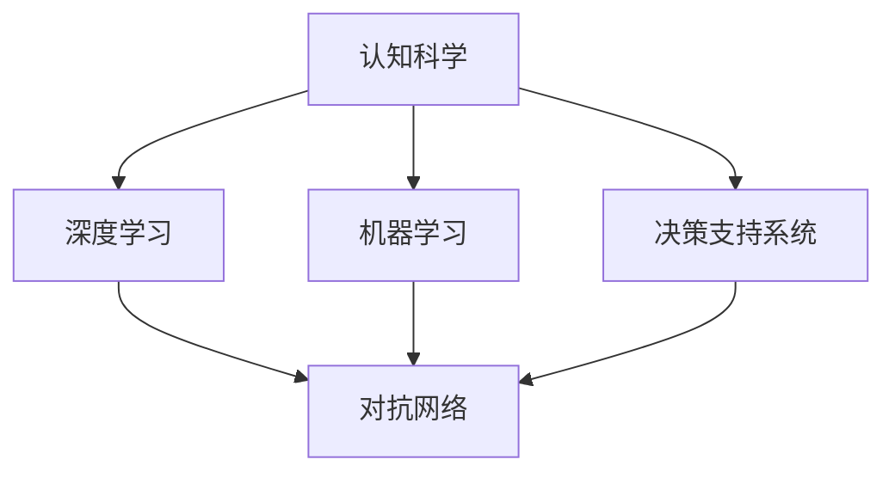

                 

# 洞察力：人类智慧的闪光点

> 关键词：洞察力,人类智慧,人工智能,认知科学,机器学习,决策支持

## 1. 背景介绍

### 1.1 问题由来
洞察力（Insight），一种深层次的理解和认知能力，长期以来被认为是人类智慧的重要闪光点。从古代的哲学家到现代的科学家，洞察力一直是推动人类认知进化的核心驱动力。然而，随着人工智能技术的迅猛发展，我们是否能够通过机器学习技术，模拟和增强人类的洞察力？这一问题，引发了广泛而深入的探讨。

### 1.2 问题核心关键点
在当前的技术背景下，洞察力可以被认为是人类智慧的一种高级表现形式，其核心在于：

- 识别并理解事物的本质和内在联系。
- 预测未来的趋势和变化，作出前瞻性判断。
- 在复杂多变的环境中，迅速捕捉关键信息，作出精准决策。

因此，洞察力不仅仅是直觉和经验的结果，更是一种深层次的认知加工和模式识别。在人工智能领域，洞察力的实现可以通过结合认知科学、机器学习和决策科学等多学科知识，进行建模和模拟。

## 2. 核心概念与联系

### 2.1 核心概念概述

为更好地理解洞察力的模拟和增强，本节将介绍几个密切相关的核心概念：

- **认知科学**：研究人类智慧和认知过程的学科，致力于揭示大脑如何处理信息，实现对外部世界的理解和决策。
- **机器学习**：通过数据驱动的方式，让计算机系统自动学习和改进的科学，尤其擅长从大量数据中提取模式和规律。
- **深度学习**：机器学习的一种高级形式，使用多层神经网络，模拟人脑的层次化处理过程，尤其擅长处理非结构化数据。
- **决策支持系统**：利用人工智能技术，辅助人类进行决策的工具和系统，旨在提升决策的准确性和效率。
- **对抗网络**：一种新型的神经网络结构，通过博弈论的对抗策略，提高模型的鲁棒性和泛化能力。

这些核心概念之间的逻辑关系可以通过以下Mermaid流程图来展示：



这个流程图展示了一系列关键概念及其之间的联系：

1. 认知科学为机器学习和深度学习提供了理论基础，研究人脑的认知机制，启发算法设计。
2. 机器学习和深度学习技术为认知科学提供了计算工具，实现了对认知过程的模拟和增强。
3. 决策支持系统结合了认知科学和机器学习技术，旨在提升决策过程的效率和准确性。
4. 对抗网络作为一种特殊的深度学习结构，进一步提升了模型对对抗样本的鲁棒性和泛化能力。

## 3. 核心算法原理 & 具体操作步骤
### 3.1 算法原理概述

洞察力的模拟和增强，本质上是一个从数据中提取和综合信息，形成新知识的过程。其核心算法可以概括为以下几个步骤：

1. **数据收集与预处理**：从各类来源收集数据，并进行清洗、标注等预处理，以确保数据的准确性和完整性。
2. **特征提取与表示**：使用机器学习技术，从原始数据中提取特征，并转化为计算机可理解的表示。
3. **模式识别与关联**：利用深度学习技术，识别数据中的模式和关联，形成对问题的初步理解。
4. **认知加工与推理**：结合认知科学和决策科学，对识别出的模式进行进一步加工和推理，形成对问题的深入理解。
5. **预测与决策**：基于对问题的理解，进行预测和决策，提出解决方案。

### 3.2 算法步骤详解

以下我们将详细介绍每个步骤的算法细节：

#### 数据收集与预处理

数据收集是洞察力模拟的第一步。常见的数据来源包括：

- **文本数据**：如新闻文章、社交媒体帖子、科技论文等。
- **图像数据**：如医疗影像、卫星图像、无人驾驶传感器数据等。
- **时间序列数据**：如股票价格、气象数据、传感器数据等。

预处理包括：

- **清洗**：去除噪声数据、异常值等。
- **标注**：为数据添加标签，如分类、情感等。
- **标准化**：对数据进行归一化、去偏等处理，以便于模型训练。

#### 特征提取与表示

特征提取是洞察力模拟的关键步骤。常见的特征提取方法包括：

- **词袋模型**：将文本数据转化为词频向量，简化表示。
- **TF-IDF**：评估词的重要性，提供更紧凑的特征表示。
- **卷积神经网络(CNN)**：从图像数据中提取局部特征。
- **循环神经网络(RNN)**：处理时间序列数据，捕捉时间依赖性。
- **自编码器(AE)**：从原始数据中提取低维特征表示。

#### 模式识别与关联

模式识别与关联是洞察力模拟的核心步骤。常见的模式识别方法包括：

- **聚类算法**：将数据分组，形成更抽象的表示。
- **关联规则学习**：发现数据中的关联规律。
- **异常检测**：识别数据中的异常点或异常行为。
- **深度学习**：利用多层神经网络，模拟大脑的层次化处理过程。

#### 认知加工与推理

认知加工与推理是洞察力模拟的高阶步骤。常见的认知加工与推理方法包括：

- **符号推理**：使用符号逻辑，进行推理和决策。
- **因果推断**：识别因果关系，预测未来变化。
- **概念图表示**：使用图形化表示，整合多源信息。
- **强化学习**：通过试错，优化决策策略。

#### 预测与决策

预测与决策是洞察力模拟的最终步骤。常见的预测与决策方法包括：

- **回归模型**：预测连续数值。
- **分类模型**：预测离散标签。
- **决策树**：构建规则化的决策流程。
- **优化算法**：求解最优化问题。

### 3.3 算法优缺点

洞察力模拟和增强的算法具有以下优点：

1. **数据驱动**：可以从大规模数据中提取模式，提高预测和决策的准确性。
2. **自动化**：通过机器学习技术，自动化处理数据，减少人工干预。
3. **泛化能力强**：能够处理多种类型的数据，具备较强的泛化能力。

同时，也存在一些缺点：

1. **数据质量依赖**：算法的效果高度依赖于数据的质量和量。
2. **模型复杂性**：深度学习模型通常结构复杂，训练和推理成本较高。
3. **解释性不足**：深度学习模型通常缺乏可解释性，难以理解其决策过程。

## 4. 数学模型和公式 & 详细讲解 & 举例说明

### 4.1 数学模型构建

为了更好地理解洞察力的模拟和增强过程，我们将其数学化。

假设有一组数据集 $D=\{(x_i, y_i)\}_{i=1}^N$，其中 $x_i$ 表示特征向量，$y_i$ 表示标签。我们的目标是学习一个函数 $f$，使得 $f(x_i) \approx y_i$。

在深度学习中，我们通常使用多层神经网络来逼近函数 $f$。设网络由 $L$ 层组成，每层包含 $n_l$ 个神经元。使用 $h_l$ 表示第 $l$ 层的隐藏状态，$W_l$ 表示第 $l$ 层的权重矩阵，$b_l$ 表示第 $l$ 层的偏置向量。网络的前向传播过程如下：

$$
h_1 = W_1x + b_1 \\
h_l = W_lh_{l-1} + b_l, l=2,...,L \\
y = W_Lh_{L-1} + b_L
$$

其中，$W_l$ 和 $b_l$ 需要训练以最小化损失函数。

常见的损失函数包括交叉熵损失、均方误差损失等。以交叉熵损失为例，其定义如下：

$$
L(y, \hat{y}) = -\sum_{i=1}^N y_i\log\hat{y}_i + (1-y_i)\log(1-\hat{y}_i)
$$

其中，$y_i$ 表示真实标签，$\hat{y}_i$ 表示模型预测结果。

### 4.2 公式推导过程

以下我们以二分类任务为例，推导交叉熵损失函数及其梯度的计算公式。

假设模型 $f$ 在输入 $x$ 上的输出为 $\hat{y}=f(x) \in [0,1]$，表示样本属于正类的概率。真实标签 $y \in \{0,1\}$。则二分类交叉熵损失函数定义为：

$$
L(y, \hat{y}) = -[y\log \hat{y} + (1-y)\log (1-\hat{y})]
$$

将其代入经验风险公式，得：

$$
\mathcal{L}(\theta) = -\frac{1}{N}\sum_{i=1}^N [y_i\log f(x_i)+(1-y_i)\log(1-f(x_i))]
$$

其中，$\theta$ 表示模型参数，包括所有权重矩阵 $W_l$ 和偏置向量 $b_l$。

根据链式法则，损失函数对参数 $\theta_k$ 的梯度为：

$$
\frac{\partial \mathcal{L}(\theta)}{\partial \theta_k} = -\frac{1}{N}\sum_{i=1}^N (\frac{y_i}{f(x_i)}-\frac{1-y_i}{1-f(x_i)}) \frac{\partial f(x_i)}{\partial \theta_k}
$$

其中，$\frac{\partial f(x_i)}{\partial \theta_k}$ 可通过反向传播算法高效计算。

### 4.3 案例分析与讲解

以医疗影像分析为例，分析洞察力模拟和增强的应用。

假设有一组医学影像数据集 $D=\{(x_i, y_i)\}_{i=1}^N$，其中 $x_i$ 表示医学影像，$y_i$ 表示疾病类型（如肿瘤、炎症等）。我们的目标是学习一个函数 $f$，使得 $f(x_i) \approx y_i$。

#### 数据收集与预处理

首先，从医疗影像库中收集影像数据，并进行清洗和标注。去除噪声数据、异常值等，添加疾病标签。

#### 特征提取与表示

使用卷积神经网络(CNN)对医学影像进行特征提取。CNN能够捕捉影像中的局部特征，如边缘、纹理等。

#### 模式识别与关联

通过训练CNN模型，识别出影像中的病变区域和病变类型。使用异常检测算法，识别出影像中的异常情况。

#### 认知加工与推理

结合医学知识库，对病变区域和病变类型进行进一步加工和推理。例如，根据病变位置和大小，推测可能的疾病类型。

#### 预测与决策

使用回归模型，预测病变区域的严重程度。结合医学专家的知识，进行综合判断和决策。

## 5. 项目实践：代码实例和详细解释说明

### 5.1 开发环境搭建

在进行洞察力模拟和增强的实践前，我们需要准备好开发环境。以下是使用Python进行TensorFlow开发的环境配置流程：

1. 安装Anaconda：从官网下载并安装Anaconda，用于创建独立的Python环境。

2. 创建并激活虚拟环境：
```bash
conda create -n tf-env python=3.8 
conda activate tf-env
```

3. 安装TensorFlow：根据CUDA版本，从官网获取对应的安装命令。例如：
```bash
conda install tensorflow=2.7 -c conda-forge
```

4. 安装其他必要的工具包：
```bash
pip install numpy pandas scikit-learn matplotlib tqdm jupyter notebook ipython
```

完成上述步骤后，即可在`tf-env`环境中开始洞察力模拟和增强的实践。

### 5.2 源代码详细实现

这里我们以二分类任务为例，给出使用TensorFlow对CNN模型进行洞察力模拟和增强的代码实现。

```python
import tensorflow as tf
from tensorflow.keras import layers

# 定义模型结构
model = tf.keras.Sequential([
    layers.Conv2D(32, (3, 3), activation='relu', input_shape=(32, 32, 3)),
    layers.MaxPooling2D((2, 2)),
    layers.Conv2D(64, (3, 3), activation='relu'),
    layers.MaxPooling2D((2, 2)),
    layers.Flatten(),
    layers.Dense(64, activation='relu'),
    layers.Dense(1, activation='sigmoid')
])

# 编译模型
model.compile(optimizer='adam', loss='binary_crossentropy', metrics=['accuracy'])

# 训练模型
model.fit(x_train, y_train, epochs=10, validation_data=(x_val, y_val))
```

### 5.3 代码解读与分析

让我们再详细解读一下关键代码的实现细节：

**模型定义**：
- 使用Sequential模型定义CNN结构，包含卷积层、池化层和全连接层。
- 通过设置`input_shape`参数，指定输入数据的形状。

**模型编译**：
- 使用`compile`方法，设置优化器、损失函数和评估指标。

**模型训练**：
- 使用`fit`方法，对数据集进行训练，指定训练轮数和验证集。

**模型评估**：
- 使用`evaluate`方法，在测试集上评估模型性能。

### 5.4 运行结果展示

训练过程中，可以使用TensorBoard记录和可视化模型的训练过程。例如：

```python
from tensorflow.keras.callbacks import TensorBoard

tensorboard_callback = TensorBoard(log_dir='logs')
model.fit(x_train, y_train, epochs=10, validation_data=(x_val, y_val), callbacks=[tensorboard_callback])
```

这将在`logs`目录下生成一个TensorBoard日志文件，方便后续分析。

## 6. 实际应用场景

### 6.1 医疗影像分析

医疗影像分析是洞察力模拟和增强的重要应用领域。通过洞察力技术，可以从大量的医学影像数据中自动提取特征，识别病变区域和病变类型，辅助医生进行诊断和治疗。

在技术实现上，可以收集医院的医学影像数据，添加相应的标签，训练CNN模型进行影像分析。训练后的模型可以应用于新的医学影像，自动识别病变区域和类型，提高诊断效率和准确性。

### 6.2 金融风险评估

金融风险评估是洞察力模拟和增强的另一个重要应用领域。通过洞察力技术，可以从大量的金融数据中自动提取模式，识别潜在的风险因素，辅助投资者进行决策。

在技术实现上，可以收集金融市场的历史数据，添加相应的标签，训练模型进行风险评估。训练后的模型可以应用于新的金融数据，自动识别风险因素，预测市场趋势，辅助投资者进行投资决策。

### 6.3 智能推荐系统

智能推荐系统是洞察力模拟和增强的重要应用领域。通过洞察力技术，可以从用户的历史行为数据中自动提取模式，识别用户的兴趣和偏好，推荐个性化的产品和服务。

在技术实现上，可以收集用户的浏览、点击、购买等行为数据，训练模型进行用户画像建模。训练后的模型可以应用于新的用户行为数据，自动识别用户的兴趣和偏好，推荐个性化的产品和服务，提高用户满意度和转化率。

### 6.4 未来应用展望

随着洞察力模拟和增强技术的不断发展，未来将在更多领域得到应用，为人类生产生活带来变革性影响。

在智慧医疗领域，洞察力技术可以帮助医生进行精准诊断，提高治疗效果。在智能推荐系统领域，洞察力技术可以提供更加个性化的推荐服务，提升用户体验。在金融风险评估领域，洞察力技术可以帮助投资者识别潜在的风险因素，降低投资风险。

## 7. 工具和资源推荐

### 7.1 学习资源推荐

为了帮助开发者系统掌握洞察力模拟和增强的理论基础和实践技巧，这里推荐一些优质的学习资源：

1. 《深度学习》系列书籍：由多位深度学习专家联合撰写，全面介绍了深度学习的基本概念和前沿技术。

2. Coursera《深度学习专项课程》：由斯坦福大学开设的深度学习课程，涵盖深度学习的基础和应用，适合初学者和进阶者学习。

3. arXiv.org：全球最大的预印本服务器，可以获取到最新和最前沿的研究论文，了解洞察力模拟和增强的最新进展。

4. GitHub上的TensorFlow官方文档：提供了大量的代码样例和教程，适合快速上手进行实践。

5. Kaggle上的洞察力竞赛：参与Kaggle上的洞察力竞赛，锻炼洞察力模拟和增强的实践能力，学习先进的技术和方法。

通过对这些资源的学习实践，相信你一定能够快速掌握洞察力模拟和增强的精髓，并用于解决实际的NLP问题。

### 7.2 开发工具推荐

高效的开发离不开优秀的工具支持。以下是几款用于洞察力模拟和增强开发的常用工具：

1. TensorFlow：由Google主导开发的深度学习框架，生产部署方便，适合大规模工程应用。

2. PyTorch：基于Python的开源深度学习框架，灵活动态的计算图，适合快速迭代研究。

3. Keras：提供高层次的API，方便快速构建深度学习模型。

4. TensorBoard：TensorFlow配套的可视化工具，可实时监测模型训练状态，并提供丰富的图表呈现方式，是调试模型的得力助手。

5. Weights & Biases：模型训练的实验跟踪工具，可以记录和可视化模型训练过程中的各项指标，方便对比和调优。

6. Jupyter Notebook：轻量级的开发环境，支持代码编写、执行和可视化，适合快速原型开发。

合理利用这些工具，可以显著提升洞察力模拟和增强任务的开发效率，加快创新迭代的步伐。

### 7.3 相关论文推荐

洞察力模拟和增强的研究源于学界的持续研究。以下是几篇奠基性的相关论文，推荐阅读：

1. AlexNet：图像分类领域的经典模型，展示了深度学习在图像处理中的应用潜力。

2. ResNet：深度残差网络，解决了深度学习模型训练过程中的梯度消失问题，提升了模型的深度和泛化能力。

3. AlphaGo：利用深度学习和强化学习技术，成功破解了围棋这一复杂游戏，展示了深度学习在决策中的应用。

4. GANs：生成对抗网络，通过博弈论的对抗策略，生成高质量的伪造数据，展示了深度学习在生成和表示中的应用。

5. Transformer：Transformer模型，通过自注意力机制，提升了序列数据的建模能力，展示了深度学习在自然语言处理中的应用。

这些论文代表了大模型微调技术的发展脉络。通过学习这些前沿成果，可以帮助研究者把握学科前进方向，激发更多的创新灵感。

## 8. 总结：未来发展趋势与挑战

### 8.1 总结

本文对洞察力模拟和增强的算法进行了全面系统的介绍。首先阐述了洞察力模拟和增强的技术背景和意义，明确了其在模拟和增强人类智慧方面的独特价值。其次，从原理到实践，详细讲解了洞察力的数学模型和算法细节，给出了洞察力模拟和增强任务开发的完整代码实例。同时，本文还广泛探讨了洞察力模拟和增强在医疗、金融、推荐等多个行业领域的应用前景，展示了其广阔的应用潜力。此外，本文精选了洞察力模拟和增强技术的各类学习资源，力求为读者提供全方位的技术指引。

通过本文的系统梳理，可以看到，洞察力模拟和增强技术正在成为人工智能技术的重要范式，极大地拓展了人工智能的应用边界，催生了更多的落地场景。受益于深度学习技术的持续发展，洞察力模拟和增强系统必将进一步提升人工智能系统的性能和应用范围，为人类认知智能的进化带来深远影响。

### 8.2 未来发展趋势

展望未来，洞察力模拟和增强技术将呈现以下几个发展趋势：

1. 模型规模持续增大。随着算力成本的下降和数据规模的扩张，深度学习模型的参数量还将持续增长。超大规模深度学习模型蕴含的丰富知识，有望支撑更加复杂多变的洞察力模拟和增强任务。

2. 迁移学习能力提升。未来的深度学习模型将具备更强的跨领域迁移能力，能够在不同领域和任务中高效地实现知识迁移。

3. 计算效率提高。优化深度学习模型的计算图，引入更高效的算法和硬件，如GPU、TPU等，进一步提升计算效率和推理速度。

4. 模型可解释性增强。开发更可解释的深度学习模型，增强模型决策的透明性和可解释性，帮助用户理解和信任模型。

5. 隐私保护机制完善。引入隐私保护技术，保护用户数据隐私，确保洞察力模拟和增强任务的合法合规。

以上趋势凸显了洞察力模拟和增强技术的广阔前景。这些方向的探索发展，必将进一步提升人工智能系统的性能和应用范围，为人类认知智能的进化带来深远影响。

### 8.3 面临的挑战

尽管洞察力模拟和增强技术已经取得了显著成果，但在迈向更加智能化、普适化应用的过程中，它仍面临诸多挑战：

1. 数据质量瓶颈。洞察力模拟和增强效果高度依赖于数据质量，如何获取高质量的标注数据，是一个关键难题。

2. 模型复杂性。深度学习模型结构复杂，训练和推理成本较高，如何简化模型，提高效率，是一个重要研究方向。

3. 可解释性不足。深度学习模型通常缺乏可解释性，难以理解其决策过程，如何增强模型可解释性，是一个重要挑战。

4. 隐私保护问题。洞察力模拟和增强任务中，涉及大量敏感数据，如何保护用户隐私，是一个重要研究课题。

5. 泛化能力不足。深度学习模型在特定领域和任务上表现出色，但在新的领域和任务上泛化能力有限，如何提升模型的泛化能力，是一个重要研究方向。

6. 计算资源限制。洞察力模拟和增强任务需要大量的计算资源，如何优化资源使用，提高计算效率，是一个重要研究方向。

正视洞察力模拟和增强面临的这些挑战，积极应对并寻求突破，将是大模型微调技术走向成熟的必由之路。相信随着学界和产业界的共同努力，这些挑战终将一一被克服，洞察力模拟和增强技术必将在构建人机协同的智能时代中扮演越来越重要的角色。

### 8.4 研究展望

面对洞察力模拟和增强面临的种种挑战，未来的研究需要在以下几个方面寻求新的突破：

1. 探索无监督和半监督洞察力模拟和增强方法。摆脱对大规模标注数据的依赖，利用自监督学习、主动学习等无监督和半监督范式，最大限度利用非结构化数据，实现更加灵活高效的洞察力模拟和增强。

2. 研究参数高效和计算高效的洞察力模拟和增强范式。开发更加参数高效的洞察力模拟和增强方法，在固定大部分预训练参数的同时，只更新极少量的任务相关参数。同时优化模型的计算图，减少前向传播和反向传播的资源消耗，实现更加轻量级、实时性的部署。

3. 融合因果和对比学习范式。通过引入因果推断和对比学习思想，增强洞察力模拟和增强模型建立稳定因果关系的能力，学习更加普适、鲁棒的知识表示。

4. 引入更多先验知识。将符号化的先验知识，如知识图谱、逻辑规则等，与神经网络模型进行巧妙融合，引导洞察力模拟和增强过程学习更准确、合理的知识表示。同时加强不同模态数据的整合，实现视觉、语音等多模态信息与文本信息的协同建模。

5. 结合因果分析和博弈论工具。将因果分析方法引入洞察力模拟和增强模型，识别出模型决策的关键特征，增强输出解释的因果性和逻辑性。借助博弈论工具刻画人机交互过程，主动探索并规避模型的脆弱点，提高系统稳定性。

6. 纳入伦理道德约束。在洞察力模拟和增强任务中，引入伦理导向的评估指标，过滤和惩罚有害的输出倾向。同时加强人工干预和审核，建立模型行为的监管机制，确保输出符合人类价值观和伦理道德。

这些研究方向的探索，必将引领洞察力模拟和增强技术迈向更高的台阶，为构建安全、可靠、可解释、可控的智能系统铺平道路。面向未来，洞察力模拟和增强技术还需要与其他人工智能技术进行更深入的融合，如知识表示、因果推理、强化学习等，多路径协同发力，共同推动自然语言理解和智能交互系统的进步。只有勇于创新、敢于突破，才能不断拓展语言模型的边界，让智能技术更好地造福人类社会。

## 9. 附录：常见问题与解答

**Q1：如何评价洞察力模拟和增强的效果？**

A: 洞察力模拟和增强的效果可以通过多种方式进行评价，包括但不限于：

- 准确率：衡量模型在测试集上的预测准确率。
- 召回率：衡量模型对真实标签的覆盖率。
- F1分数：结合准确率和召回率，综合评价模型性能。
- ROC曲线：衡量模型在不同阈值下的性能表现。

通过多指标综合评价，可以更全面地评估洞察力模拟和增强的效果。

**Q2：如何处理数据质量问题？**

A: 数据质量问题是洞察力模拟和增强的关键瓶颈之一。以下是一些常见的处理方法：

- 数据清洗：去除噪声数据、异常值等，确保数据的准确性和完整性。
- 数据增强：通过数据增强技术，扩充训练集，提高模型鲁棒性。
- 数据标注：通过众包标注、专家标注等方式，获取高质量的标注数据。
- 半监督学习：利用无标签数据和少量标注数据，进行联合学习，提高模型泛化能力。

**Q3：如何在保证可解释性的前提下，提升洞察力模拟和增强的效果？**

A: 在保证可解释性的前提下，提升洞察力模拟和增强的效果，可以考虑以下方法：

- 使用可解释的模型结构，如决策树、规则化模型等。
- 引入特征重要性评估，解释模型对不同特征的依赖关系。
- 使用模型可解释技术，如SHAP值、LIME等，分析模型的决策过程。
- 结合符号化的先验知识，增强模型的可解释性。

通过以上方法，可以在保证可解释性的前提下，提升洞察力模拟和增强的效果。

**Q4：如何提高洞察力模拟和增强任务的计算效率？**

A: 提高洞察力模拟和增强任务的计算效率，可以考虑以下方法：

- 模型裁剪：去除不必要的层和参数，减小模型尺寸，加快推理速度。
- 量化加速：将浮点模型转为定点模型，压缩存储空间，提高计算效率。
- 分布式训练：使用分布式计算框架，加速模型训练过程。
- 模型并行：采用模型并行技术，提高计算效率和资源利用率。

通过以上方法，可以显著提高洞察力模拟和增强任务的计算效率。

**Q5：如何在洞察力模拟和增强任务中保护用户隐私？**

A: 在洞察力模拟和增强任务中，保护用户隐私是一个重要课题。以下是一些常见的方法：

- 数据匿名化：对数据进行匿名化处理，保护用户身份信息。
- 差分隐私：通过引入噪声，保护用户隐私，同时保证模型性能。
- 联邦学习：通过分布式训练，保护用户数据，同时实现知识共享。
- 隐私保护算法：使用隐私保护算法，如安全多方计算等，保护用户数据隐私。

通过以上方法，可以在洞察力模拟和增强任务中保护用户隐私。

---
作者：禅与计算机程序设计艺术 / Zen and the Art of Computer Programming

