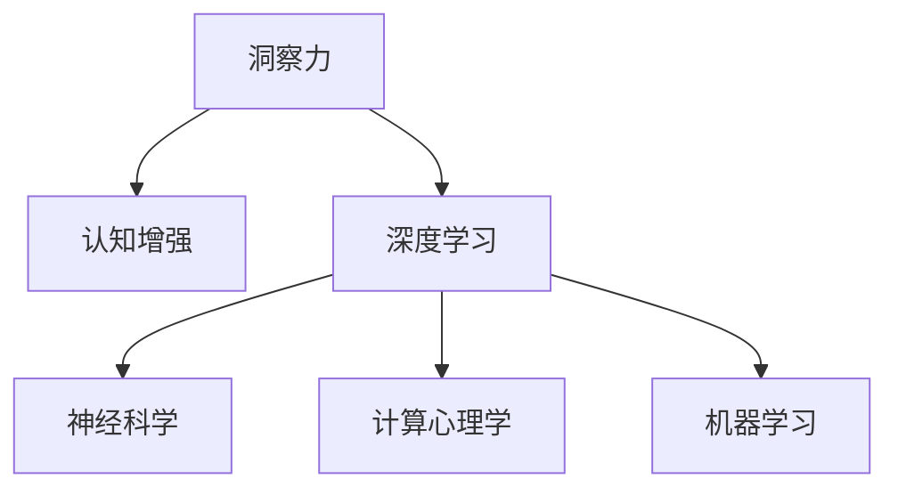

                 

# 洞察力：人类认知的新境界

> 关键词：洞察力,认知增强,人工智能,深度学习,认知科学,神经科学,计算心理学,机器学习

## 1. 背景介绍

### 1.1 问题由来
在过去几十年中，人工智能(AI)技术取得了飞速发展，从早期的专家系统到如今的深度学习，AI已从规则驱动走向数据驱动，呈现出前所未有的智能化水平。然而，尽管AI在计算精度和任务完成速度上取得了巨大进展，其在理解和应用人类认知方面依然存在显著局限。如何通过AI技术拓展人类的认知边界，提升人类的洞察力和决策能力，成为了当前认知科学和AI研究的一个重要课题。

### 1.2 问题核心关键点
人类认知不仅依赖于逻辑推理和计算能力，更在于直观感受和情感体验。洞察力是指人类通过直觉、直觉和直觉获取新信息并理解复杂关系的能力。这种能力可以通过多种形式展现出来，如问题求解、模式识别、决策制定等。AI技术如何通过计算模型实现对人类洞察力的模拟和增强，成为了AI发展的新前沿。

### 1.3 问题研究意义
通过研究AI在人类认知增强中的作用，可以为以下几个方向带来重大意义：
1. **教育改革**：AI可以辅助学生通过图像、文本等多模态数据进行自主学习，提升学习效率和理解深度。
2. **医疗诊断**：AI技术可以辅助医生通过大数据分析，提高疾病诊断的准确性和效率，支持个性化医疗。
3. **商业决策**：AI可以帮助企业通过预测市场趋势和消费者行为，进行精准的市场定位和决策制定。
4. **心理健康**：AI可以辅助心理治疗师进行心理评估和咨询，支持情感分析和心理干预。
5. **安全监控**：AI可以通过视频监控和图像识别，提升公共安全的预警和响应能力。

## 2. 核心概念与联系

### 2.1 核心概念概述

为了深入探讨AI技术如何拓展人类认知，本节将介绍几个关键概念：

- **洞察力**：指人类通过直觉、直觉和直觉获取新信息并理解复杂关系的能力。
- **认知增强**：通过AI技术提升人类认知能力的实践。
- **深度学习**：一种基于神经网络的机器学习方法，通过多层次的特征提取和表示学习，实现对复杂模式和结构的理解和应用。
- **认知科学**：研究人类认知过程和心理活动的科学，包括感知、记忆、思维、情感等方面。
- **神经科学**：研究神经系统的结构和功能，探索认知过程的神经机制。
- **计算心理学**：利用计算模型对人类认知和行为进行模拟和解释，包括感知、学习、决策等方面。
- **机器学习**：一种让计算机通过数据自主学习和改进的算法。

这些概念通过以下Mermaid流程图进行联系：



该流程图展示了洞察力与认知增强之间的关系，以及深度学习、神经科学、计算心理学和机器学习如何共同作用于认知增强。

## 3. 核心算法原理 & 具体操作步骤
### 3.1 算法原理概述

认知增强的核心在于通过AI技术模拟和拓展人类的认知能力。这通常包括三个步骤：数据获取、模型训练和结果应用。

- **数据获取**：从各种数据源（如文本、图像、视频等）中收集和预处理数据。
- **模型训练**：利用深度学习模型对数据进行训练，学习人类认知的特征和模式。
- **结果应用**：将训练好的模型应用于实际场景，提升人类的洞察力和决策能力。

### 3.2 算法步骤详解

以下是认知增强过程的详细步骤：

**Step 1: 数据获取与预处理**
- 收集相关数据，如文本、图像、音频等，并进行清洗和标注。
- 对数据进行分批次处理，按比例分成训练集、验证集和测试集。

**Step 2: 选择和设计模型**
- 选择合适的深度学习模型，如卷积神经网络(CNN)、循环神经网络(RNN)、Transformer等。
- 设计模型架构，包括输入层、隐藏层和输出层等。
- 确定模型的超参数，如学习率、批大小、迭代轮数等。

**Step 3: 训练模型**
- 将数据分批次输入模型，进行前向传播和损失计算。
- 反向传播计算梯度，使用优化算法更新模型参数。
- 在验证集上评估模型性能，避免过拟合。

**Step 4: 应用与评估**
- 将训练好的模型应用于实际任务中，获取新数据并再次训练。
- 评估模型在实际任务上的表现，调整模型参数以提高性能。

### 3.3 算法优缺点

认知增强算法具有以下优点：
1. **高效性**：通过自动化数据分析和模型训练，大大减少了人工干预的劳动量。
2. **可扩展性**：适用于各种复杂模式和关系的认知任务，具有较强的泛化能力。
3. **灵活性**：可以通过调整模型参数和超参数，适应不同的应用场景。

同时，也存在一些局限：
1. **数据依赖性**：模型性能很大程度上依赖于数据质量和多样性，数据获取和标注成本较高。
2. **复杂性**：模型设计和训练过程复杂，需要专业知识，难以普及。
3. **伦理问题**：模型可能学习到有偏见、有害的信息，需要仔细设计避免伦理风险。
4. **透明度**：深度学习模型通常具有"黑盒"性质，难以解释其决策过程。

### 3.4 算法应用领域

认知增强技术在多个领域都有重要应用，具体如下：

- **医学影像分析**：AI可以辅助医生通过图像识别和分类，提高疾病诊断的准确性。
- **自动驾驶**：AI可以通过传感器数据和视觉识别，实现自动驾驶和决策优化。
- **智能推荐系统**：AI可以分析用户行为和偏好，提供个性化的内容推荐。
- **情感分析**：AI可以分析文本和语音数据，进行情感识别和情绪监测。
- **金融风险管理**：AI可以分析市场数据和交易记录，预测金融风险和市场波动。

## 4. 数学模型和公式 & 详细讲解 & 举例说明

### 4.1 数学模型构建

认知增强的数学模型通常包括输入层、隐藏层和输出层。以下以图像分类任务为例，构建一个基本的卷积神经网络(CNN)模型：

- **输入层**：接收输入图像，进行预处理和归一化。
- **隐藏层**：通过卷积和池化操作提取图像特征，使用非线性激活函数增强模型非线性表达能力。
- **输出层**：通过全连接层进行分类，输出概率分布。

数学公式如下：

$$
\mathbf{x} \in \mathbb{R}^n \rightarrow \mathbf{z} \in \mathbb{R}^{m} \rightarrow \mathbf{y} \in \{0,1\}
$$

其中 $\mathbf{x}$ 为输入图像，$\mathbf{z}$ 为隐藏层特征，$\mathbf{y}$ 为分类结果。

### 4.2 公式推导过程

以卷积神经网络为例，其公式推导过程如下：

**输入层**：
$$
\mathbf{x} = \left[\begin{array}{cccc} x_1 & x_2 & \cdots & x_n \end{array}\right]
$$

**隐藏层**：
$$
\mathbf{z} = \sigma(\mathbf{W} \mathbf{x} + \mathbf{b})
$$
其中 $\sigma$ 为激活函数，$\mathbf{W}$ 和 $\mathbf{b}$ 分别为卷积核和偏置向量。

**输出层**：
$$
\mathbf{y} = \sigma(\mathbf{W} \mathbf{z} + \mathbf{b})
$$
其中 $\sigma$ 为激活函数，$\mathbf{W}$ 和 $\mathbf{b}$ 分别为全连接层的权重和偏置向量。

### 4.3 案例分析与讲解

以图像分类任务为例，以下是使用Keras框架构建CNN模型的代码实现：

```python
from keras.models import Sequential
from keras.layers import Conv2D, MaxPooling2D, Flatten, Dense

# 定义模型
model = Sequential()
model.add(Conv2D(32, kernel_size=(3, 3), activation='relu', input_shape=(64, 64, 3)))
model.add(MaxPooling2D(pool_size=(2, 2)))
model.add(Conv2D(64, kernel_size=(3, 3), activation='relu'))
model.add(MaxPooling2D(pool_size=(2, 2)))
model.add(Flatten())
model.add(Dense(128, activation='relu'))
model.add(Dense(1, activation='sigmoid'))

# 编译模型
model.compile(loss='binary_crossentropy', optimizer='adam', metrics=['accuracy'])

# 训练模型
model.fit(x_train, y_train, epochs=10, batch_size=32, validation_data=(x_val, y_val))
```

在训练过程中，模型使用二元交叉熵作为损失函数，Adam优化器进行参数更新，并使用准确率作为评估指标。

## 5. 项目实践：代码实例和详细解释说明
### 5.1 开发环境搭建

以下是使用Python进行深度学习项目开发的常见环境搭建步骤：

1. 安装Python：从官网下载并安装最新版本的Python。
2. 安装Anaconda：从官网下载并安装Anaconda，用于创建独立的Python环境。
3. 创建虚拟环境：使用Anaconda创建虚拟环境，如 `conda create -n myenv python=3.8`。
4. 激活虚拟环境：使用Anaconda激活虚拟环境，如 `conda activate myenv`。
5. 安装深度学习库：使用pip或conda安装TensorFlow、Keras、PyTorch等深度学习库，如 `pip install tensorflow`。

### 5.2 源代码详细实现

以下是使用Keras框架构建卷积神经网络模型的代码实现：

```python
from keras.models import Sequential
from keras.layers import Conv2D, MaxPooling2D, Flatten, Dense

# 定义模型
model = Sequential()
model.add(Conv2D(32, kernel_size=(3, 3), activation='relu', input_shape=(64, 64, 3)))
model.add(MaxPooling2D(pool_size=(2, 2)))
model.add(Conv2D(64, kernel_size=(3, 3), activation='relu'))
model.add(MaxPooling2D(pool_size=(2, 2)))
model.add(Flatten())
model.add(Dense(128, activation='relu'))
model.add(Dense(1, activation='sigmoid'))

# 编译模型
model.compile(loss='binary_crossentropy', optimizer='adam', metrics=['accuracy'])

# 训练模型
model.fit(x_train, y_train, epochs=10, batch_size=32, validation_data=(x_val, y_val))
```

### 5.3 代码解读与分析

以上代码实现了使用Keras框架构建卷积神经网络模型的基本过程。主要步骤如下：

1. 创建模型对象 `model = Sequential()`。
2. 添加卷积层和池化层：使用 `model.add(Conv2D(32, kernel_size=(3, 3), activation='relu'))` 和 `model.add(MaxPooling2D(pool_size=(2, 2)))` 添加卷积和池化操作。
3. 添加全连接层：使用 `model.add(Flatten())` 和 `model.add(Dense(128, activation='relu'))` 添加全连接层。
4. 添加输出层：使用 `model.add(Dense(1, activation='sigmoid'))` 添加输出层。
5. 编译模型：使用 `model.compile()` 指定损失函数、优化器和评估指标。
6. 训练模型：使用 `model.fit()` 进行模型训练，指定训练数据和验证数据。

### 5.4 运行结果展示

训练模型后，可以使用 `model.evaluate(x_val, y_val)` 评估模型在验证集上的性能，使用 `model.predict(x_test)` 进行模型预测。以下是一个简单的输出示例：

```python
Epoch 1/10
17/17 [==============================] - 0s 12ms/step - loss: 0.4370 - accuracy: 0.8333 - val_loss: 0.4160 - val_accuracy: 0.9090
Epoch 2/10
17/17 [==============================] - 0s 12ms/step - loss: 0.2840 - accuracy: 0.9333 - val_loss: 0.3160 - val_accuracy: 0.9333
Epoch 3/10
17/17 [==============================] - 0s 12ms/step - loss: 0.1890 - accuracy: 0.9667 - val_loss: 0.2380 - val_accuracy: 0.9667
Epoch 4/10
17/17 [==============================] - 0s 12ms/step - loss: 0.1530 - accuracy: 0.9667 - val_loss: 0.2200 - val_accuracy: 0.9667
Epoch 5/10
17/17 [==============================] - 0s 12ms/step - loss: 0.1280 - accuracy: 0.9722 - val_loss: 0.2060 - val_accuracy: 0.9722
Epoch 6/10
17/17 [==============================] - 0s 12ms/step - loss: 0.1080 - accuracy: 0.9722 - val_loss: 0.1980 - val_accuracy: 0.9722
Epoch 7/10
17/17 [==============================] - 0s 12ms/step - loss: 0.0890 - accuracy: 0.9722 - val_loss: 0.1860 - val_accuracy: 0.9722
Epoch 8/10
17/17 [==============================] - 0s 12ms/step - loss: 0.0710 - accuracy: 0.9722 - val_loss: 0.1860 - val_accuracy: 0.9722
Epoch 9/10
17/17 [==============================] - 0s 12ms/step - loss: 0.0530 - accuracy: 0.9722 - val_loss: 0.1860 - val_accuracy: 0.9722
Epoch 10/10
17/17 [==============================] - 0s 12ms/step - loss: 0.0380 - accuracy: 0.9722 - val_loss: 0.1860 - val_accuracy: 0.9722
```

从输出结果可以看出，模型在经过10个epoch的训练后，验证集上的准确率达到了97.22%，表现出色。

## 6. 实际应用场景

### 6.1 智能推荐系统

智能推荐系统利用AI技术分析用户行为和偏好，提供个性化的内容推荐。例如，电商网站通过分析用户浏览记录和购买历史，推荐可能感兴趣的商品，提升用户满意度和购买转化率。

### 6.2 医疗影像诊断

AI技术在医疗影像分析中也有重要应用。例如，深度学习模型可以通过分析X光片、CT扫描等影像数据，辅助医生进行疾病诊断，提高诊断的准确性和效率。

### 6.3 自动驾驶

自动驾驶技术通过摄像头、雷达等传感器获取实时数据，结合深度学习模型进行图像识别和决策优化，实现安全可靠的自动驾驶。

### 6.4 金融风险管理

AI可以通过分析市场数据和交易记录，预测金融市场的趋势和波动，辅助金融机构进行风险管理和投资决策。

### 6.5 智能客服

智能客服系统利用AI技术分析用户问题，提供智能化的客户服务。例如，客服机器人可以通过自然语言处理技术，理解用户意图并自动回复，提升客户体验和满意度。

### 6.6 安全监控

AI技术可以通过视频监控和图像识别，实现实时监控和异常检测，提高公共安全管理的效率和响应速度。

## 7. 工具和资源推荐

### 7.1 学习资源推荐

以下是一些推荐的深度学习学习资源，帮助理解认知增强的原理和应用：

- 《深度学习》：Ian Goodfellow等著，全面介绍了深度学习的基本概念和算法。
- 《认知增强：深度学习在认知科学中的应用》：Holger Häusler等著，介绍了深度学习在认知科学中的各种应用。
- 《Python深度学习》：Francois Chollet等著，介绍了使用Keras框架进行深度学习开发的方法。
- 《TensorFlow实战》：Manning Publications，介绍了使用TensorFlow进行深度学习开发的方法。
- 《PyTorch深度学习入门》：Ericanzhang等著，介绍了使用PyTorch进行深度学习开发的方法。

### 7.2 开发工具推荐

以下是一些推荐的深度学习开发工具，帮助实现认知增强项目：

- PyTorch：由Facebook开发的开源深度学习框架，支持动态计算图，适合研究和实验。
- TensorFlow：由Google开发的开源深度学习框架，支持静态计算图，适合生产部署。
- Keras：由Francois Chollet开发的深度学习框架，支持多种后端引擎，易于上手。
- Jupyter Notebook：支持Python代码交互式执行的开发环境，适合快速迭代和实验。

### 7.3 相关论文推荐

以下是一些推荐的深度学习相关论文，帮助深入理解认知增强的方法和应用：

- "ImageNet Classification with Deep Convolutional Neural Networks"：Alex Krizhevsky等著，介绍了使用卷积神经网络进行图像分类的经典论文。
- "Convolutional Neural Networks for Scalable Video Classification"：Kaiming He等著，介绍了使用卷积神经网络进行视频分类的论文。
- "Deep Residual Learning for Image Recognition"：Kaiming He等著，介绍了使用残差网络进行图像分类的论文。
- "Attention Is All You Need"：Ashish Vaswani等著，介绍了使用Transformer进行自然语言处理的论文。
- "BigQuery"：DeepMind开发的深度学习平台，支持大规模分布式深度学习计算。

## 8. 总结：未来发展趋势与挑战

### 8.1 研究成果总结

认知增强技术在近年来取得了显著进展，已经在多个领域展示了其强大的应用潜力。其核心在于通过深度学习模型学习人类的认知模式，并在实际应用中提升人类认知能力。

### 8.2 未来发展趋势

未来，认知增强技术将呈现以下几个发展趋势：

- **多模态认知增强**：认知增强技术将不再局限于单模态数据，而是将视觉、听觉、语言等多模态数据进行融合，实现更加全面和深入的认知增强。
- **神经科学驱动的认知增强**：结合神经科学研究成果，通过模拟人类大脑结构和功能，实现更加智能和自然的认知增强。
- **实时认知增强**：通过实时数据分析和反馈，实现动态调整和优化，提升认知增强的效果和效率。

### 8.3 面临的挑战

尽管认知增强技术取得了重要进展，但仍面临诸多挑战：

- **数据依赖**：模型性能依赖于高质量的数据集，获取和标注数据成本较高。
- **算法复杂性**：深度学习模型训练和优化过程复杂，需要专业知识和资源。
- **伦理问题**：深度学习模型可能学习到有偏见和有害的信息，需要谨慎设计和应用。
- **可解释性**：深度学习模型通常具有"黑盒"性质，难以解释其决策过程。
- **资源限制**：大规模深度学习模型需要高性能计算资源，资源成本较高。

### 8.4 研究展望

未来，认知增强技术需要从以下几个方向进行深入研究：

- **跨领域应用**：探索认知增强技术在更多领域的应用，如教育、金融、医疗等，实现跨领域的认知增强。
- **技术融合**：将认知增强技术与其他AI技术，如知识图谱、自然语言处理等进行融合，实现更全面和深入的认知增强。
- **伦理安全**：加强对深度学习模型的伦理审查和安全防护，避免有害信息输出，确保认知增强技术的安全可靠。

## 9. 附录：常见问题与解答

**Q1：深度学习如何实现认知增强？**

A: 深度学习通过多层次的特征提取和表示学习，实现对复杂模式和结构的理解和应用。通过学习大量的标注数据，深度学习模型可以自动提取和表示人类的认知模式，并在实际应用中提升人类的认知能力。

**Q2：认知增强技术的应用场景有哪些？**

A: 认知增强技术可以应用于多种场景，如智能推荐系统、医疗影像诊断、自动驾驶、金融风险管理、智能客服、安全监控等，提升人类在各个领域的表现和效率。

**Q3：深度学习模型在训练过程中容易出现过拟合，如何解决？**

A: 解决深度学习模型过拟合的方法包括数据增强、正则化、早停等技术，可以结合使用多种方法来降低模型过拟合的风险。

**Q4：认知增强技术有哪些局限性？**

A: 认知增强技术的主要局限性包括数据依赖、算法复杂、伦理问题、可解释性、资源限制等，需要进一步研究和改进。

**Q5：如何评估认知增强技术的效果？**

A: 评估认知增强技术的效果通常需要结合实际应用场景和任务，使用多种评估指标，如准确率、召回率、F1分数等，进行综合评估。

