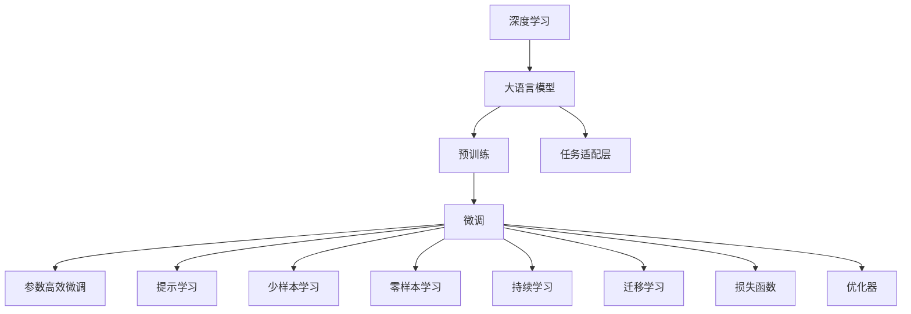

                 

# 深入理解AI、LLM和深度学习：一个实践课程

## 1. 背景介绍

### 1.1 问题由来

随着人工智能(AI)技术的飞速发展，深度学习(Deep Learning, DL)已成为机器学习和AI领域的主流范式。尤其是大语言模型(Large Language Model, LLM)的出现，标志着自然语言处理(Natural Language Processing, NLP)进入了一个新的时代。诸如OpenAI的GPT系列、Google的BERT等大模型，通过在海量数据上进行预训练，掌握了丰富的语言知识和常识，在问答、翻译、情感分析等众多任务上均表现出色。

然而，面对复杂多变的现实场景，预训练模型在特定领域的应用效果往往不尽如人意。这是因为预训练模型通常无法完全捕获特定领域的专业知识和上下文信息。因此，大语言模型微调(Fine-Tuning)技术应运而生，通过在特定任务的数据集上进行有监督学习，使预训练模型能够更好地适应目标任务，提升其在特定场景下的性能。

### 1.2 问题核心关键点

微调的核心在于：如何使通用预训练模型在特定领域的数据集上进行有监督学习，从而获得该领域任务上的性能提升。微调技术主要包括以下几个步骤：
- 收集目标任务的数据集。
- 选择预训练模型，并进行必要的前处理（如分词、向量化等）。
- 定义任务的适配层（如分类器、解码器等）。
- 设计损失函数和优化器，设置训练参数（如学习率、迭代次数等）。
- 对数据集进行批处理，并在模型上进行前向传播和反向传播，更新参数。
- 评估模型在验证集上的性能，避免过拟合。
- 在测试集上对微调后的模型进行测试，并部署到实际应用中。

微调的核心在于将通用语言模型转化为特定任务的能力，使其具备了更强的泛化能力和领域针对性。同时，微调也带来了新的挑战，如如何处理过拟合、如何优化模型结构、如何提升训练效率等。

### 1.3 问题研究意义

掌握微调技术，对于提升大语言模型的性能、拓展其在实际场景中的应用范围具有重要意义。微调不仅能够降低从头开发模型的成本，还能显著提升模型在特定领域的表现，推动AI技术在更多领域落地。此外，微调还有助于形成通用人工智能(General Artificial Intelligence, AGI)的概念，即在大规模数据上预训练，在小规模数据上进行微调的思路，能够使模型更接近通用智能的标准。

## 2. 核心概念与联系

### 2.1 核心概念概述

为了更好地理解微调技术，本节将介绍几个关键概念，并通过Mermaid流程图展示它们之间的联系：

1. **深度学习(Deep Learning, DL)**：一种基于多层神经网络的学习方法，通过反向传播算法优化模型参数，实现数据的自动特征提取和表示学习。

2. **大语言模型(Large Language Model, LLM)**：指具有大规模参数量、能够处理自然语言处理任务的深度学习模型。如GPT、BERT等模型。

3. **预训练(Pre-training)**：指在大规模无标签数据上进行自监督学习，使模型掌握语言的通用表示。

4. **微调(Fine-Tuning)**：指在预训练模型基础上，通过特定任务的数据集进行有监督学习，优化模型在该任务上的性能。

5. **迁移学习(Transfer Learning)**：指将一个领域学到的知识迁移到另一个相关领域，通过微调实现知识迁移。

6. **参数高效微调(Parameter-Efficient Fine-Tuning, PEFT)**：指在微调过程中只更新小部分参数，保持预训练参数不变。

7. **提示学习(Prompt Learning)**：通过修改输入模板，引导模型生成期望输出，可以在不更新模型参数的情况下，实现微调。

8. **少样本学习(Few-shot Learning)**：指模型仅通过少量标注样本来适应新任务。

9. **零样本学习(Zero-shot Learning)**：指模型在没有任何标注样例的情况下，根据任务描述执行新任务。

10. **持续学习(Continual Learning)**：指模型能够不断从新数据中学习，同时保持已有知识。

通过理解这些概念，我们可以更好地把握微调的原理和应用方法。

```mermaid
graph TB
    A[深度学习] --> B[预训练]
    A --> C[微调]
    C --> D[参数高效微调(PEFT)]
    C --> E[提示学习]
    A --> F[迁移学习]
    F --> C
    F --> E
    A --> G[持续学习]
    G --> H[避免灾难性遗忘]
    G --> I[增量学习]
    A --> J[少样本学习]
    J --> C
    J --> E
    A --> K[零样本学习]
    K --> C
```

### 2.2 核心概念原理和架构的 Mermaid 流程图



## 3. 核心算法原理 & 具体操作步骤

### 3.1 算法原理概述

基于深度学习的大语言模型微调，其核心思想是通过在特定任务的数据集上进行有监督学习，优化模型在该任务上的性能。具体而言，微调过程包括以下几个步骤：

1. **数据准备**：收集目标任务的数据集，并对数据进行预处理（如分词、向量化等）。
2. **模型选择**：选择合适的预训练模型，如GPT、BERT等。
3. **任务适配层设计**：根据任务类型，设计适配层（如分类器、解码器等）。
4. **损失函数设计**：定义损失函数（如交叉熵、均方误差等），用于衡量模型输出与真实标签的差异。
5. **优化器选择**：选择合适的优化器（如Adam、SGD等），并设置学习率、批大小、迭代次数等参数。
6. **训练过程**：对数据集进行批处理，进行前向传播和反向传播，更新模型参数。
7. **验证评估**：在验证集上评估模型性能，避免过拟合。
8. **测试部署**：在测试集上测试微调后的模型，并部署到实际应用中。

### 3.2 算法步骤详解

#### 3.2.1 数据准备

数据准备是微调过程的第一步，也是最关键的一步。数据集需要满足以下要求：

- **标注质量**：标注数据必须高质量、标注准确，以保证微调的有效性。
- **数据规模**：标注数据规模需适中，不宜过大以避免过拟合，也不宜过小以充分利用数据。
- **数据分布**：数据集应尽量覆盖目标任务的各个场景，以保证模型的泛化能力。

#### 3.2.2 模型选择

选择合适的预训练模型对于微调效果至关重要。一般来说，应选择与目标任务相似的预训练模型。例如，对于文本分类任务，可以选择BERT、RoBERTa等预训练模型。对于生成任务，可以选择GPT、T5等预训练模型。

#### 3.2.3 任务适配层设计

任务适配层的设计需要根据具体任务进行定制。例如，对于文本分类任务，可以在预训练模型顶部添加全连接层，并设置softmax激活函数；对于机器翻译任务，可以在预训练模型顶部添加解码器，并进行softmax交叉熵损失计算。

#### 3.2.4 损失函数设计

损失函数的选择应根据任务类型进行。例如，对于分类任务，常用的损失函数包括交叉熵损失；对于回归任务，常用的损失函数包括均方误差损失。

#### 3.2.5 优化器选择

优化器是微调过程中的关键工具，其选择应根据模型复杂度和任务需求进行。常用的优化器包括Adam、SGD等，学习率需根据模型复杂度和任务需求进行微调。

#### 3.2.6 训练过程

训练过程包括数据批处理、前向传播、反向传播、参数更新等步骤。数据批处理时，需将数据集分为训练集、验证集和测试集，并设置合适的批大小。前向传播时，将数据输入模型，得到模型输出。反向传播时，计算损失函数对模型参数的梯度。参数更新时，根据梯度和优化器进行参数更新。

#### 3.2.7 验证评估

验证评估过程用于评估模型在验证集上的性能，避免过拟合。在验证集上，需计算损失函数和模型准确率、精确率、召回率等指标。若模型在验证集上性能不佳，需调整训练参数，如学习率、批大小等。

#### 3.2.8 测试部署

测试部署过程用于评估模型在测试集上的性能，并进行实际应用部署。在测试集上，需计算模型准确率、精确率、召回率等指标。若模型在测试集上性能优良，可进行实际应用部署。

### 3.3 算法优缺点

#### 3.3.1 优点

1. **简单高效**：微调过程简单，易于实现，能够快速提升模型在特定任务上的性能。
2. **泛化能力强**：微调模型通常具有较强的泛化能力，能够在未见过的数据上表现出色。
3. **模型通用性**：微调模型通常具有较强的领域适应能力，能够适应多种任务。
4. **参数高效**：微调方法可以利用参数高效技术，只更新部分参数，保持预训练模型的稳定性。
5. **可解释性**：微调模型通常比从头训练模型更容易解释其内部机制和决策过程。

#### 3.3.2 缺点

1. **标注数据需求高**：微调过程需要大量的标注数据，标注成本较高。
2. **过拟合风险**：微调模型面临过拟合风险，特别是在标注数据不足的情况下。
3. **模型鲁棒性不足**：微调模型在面对不同数据分布时，性能可能大打折扣。
4. **模型可解释性不足**：微调模型通常缺乏可解释性，难以解释其内部机制和决策过程。
5. **安全性和公平性问题**：微调模型可能存在安全隐患和偏见问题，需要谨慎应用。

### 3.4 算法应用领域

微调技术在NLP领域具有广泛的应用，涵盖了各种类型的任务。以下是几个典型应用领域：

1. **文本分类**：如情感分析、主题分类、意图识别等。微调模型可以在少量标注数据上学习文本与标签的映射关系。
2. **命名实体识别**：识别文本中的人名、地名、机构名等特定实体。微调模型可以从标注数据中学习实体的边界和类型。
3. **关系抽取**：从文本中抽取实体之间的语义关系。微调模型可以学习实体-关系三元组。
4. **问答系统**：对自然语言问题给出答案。微调模型可以从问答对数据中学习问题-答案映射。
5. **机器翻译**：将源语言文本翻译成目标语言。微调模型可以学习语言-语言映射。
6. **文本摘要**：将长文本压缩成简短摘要。微调模型可以从文章-摘要对数据中学习抓取要点。
7. **对话系统**：使机器能够与人自然对话。微调模型可以从对话历史数据中学习回复生成。

## 4. 数学模型和公式 & 详细讲解

### 4.1 数学模型构建

基于深度学习的大语言模型微调，其数学模型可以表示为：

$$
\hat{\theta} = \mathop{\arg\min}_{\theta} \mathcal{L}(\theta, D)
$$

其中 $\theta$ 为模型参数，$D$ 为标注数据集，$\mathcal{L}$ 为损失函数。

### 4.2 公式推导过程

以文本分类任务为例，假设模型在输入 $x$ 上的输出为 $y$，则交叉熵损失函数为：

$$
\mathcal{L}(y, \hat{y}) = -\frac{1}{N} \sum_{i=1}^N \sum_{j=1}^C y_j \log \hat{y}_j
$$

其中 $y$ 为真实标签，$\hat{y}$ 为模型预测结果，$C$ 为类别数。

假设模型在输入 $x$ 上的输出为 $\hat{y}=M_{\theta}(x)$，则梯度下降算法可以表示为：

$$
\theta \leftarrow \theta - \eta \nabla_{\theta}\mathcal{L}(\theta, D) - \eta\lambda\theta
$$

其中 $\eta$ 为学习率，$\lambda$ 为正则化系数，$\nabla_{\theta}\mathcal{L}(\theta, D)$ 为损失函数对模型参数的梯度。

### 4.3 案例分析与讲解

以BERT模型在情感分类任务上的微调为例，进行详细分析：

1. **数据准备**：收集情感分类数据集，进行文本分词和向量化处理。
2. **模型选择**：选择BERT预训练模型。
3. **任务适配层设计**：在BERT模型顶部添加全连接层，并设置softmax激活函数。
4. **损失函数设计**：设置交叉熵损失函数。
5. **优化器选择**：选择Adam优化器，设置学习率为2e-5。
6. **训练过程**：设置批大小为16，进行前向传播和反向传播，更新模型参数。
7. **验证评估**：在验证集上计算准确率、精确率、召回率等指标，调整学习率。
8. **测试部署**：在测试集上计算模型指标，部署到实际应用中。

## 5. 项目实践：代码实例和详细解释说明

### 5.1 开发环境搭建

#### 5.1.1 Python环境安装

首先，需要安装Python 3.8及以上版本，可以使用Anaconda进行管理。

```bash
conda create -n pytorch-env python=3.8 
conda activate pytorch-env
```

#### 5.1.2 PyTorch和Transformers库安装

使用pip安装PyTorch和Transformers库：

```bash
pip install torch torchvision torchaudio transformers
```

#### 5.1.3 数据准备

下载情感分类数据集，并进行文本分词和向量化处理。

```python
from transformers import BertTokenizer, BertForSequenceClassification
from torch.utils.data import Dataset, DataLoader

# 数据准备
tokenizer = BertTokenizer.from_pretrained('bert-base-uncased')
train_dataset = ...
dev_dataset = ...
test_dataset = ...

# 数据转换
def convert_to_tensor(text):
    return tokenizer.encode(text, add_special_tokens=True, max_length=128, padding='max_length', truncation=True)

# 数据批处理
def collate_fn(batch):
    input_ids = [convert_to_tensor(text) for text in batch]
    labels = [int(label) for label in batch]
    return {'input_ids': torch.tensor(input_ids, dtype=torch.long),
            'labels': torch.tensor(labels, dtype=torch.long)}
```

### 5.2 源代码详细实现

#### 5.2.1 模型选择

选择BERT预训练模型：

```python
model = BertForSequenceClassification.from_pretrained('bert-base-uncased', num_labels=2)
```

#### 5.2.2 损失函数设计

设置交叉熵损失函数：

```python
loss_fn = nn.CrossEntropyLoss()
```

#### 5.2.3 优化器选择

选择Adam优化器，设置学习率为2e-5：

```python
optimizer = AdamW(model.parameters(), lr=2e-5)
```

#### 5.2.4 训练过程

训练模型：

```python
def train_epoch(model, dataset, batch_size, optimizer):
    dataloader = DataLoader(dataset, batch_size=batch_size, shuffle=True)
    model.train()
    epoch_loss = 0
    for batch in dataloader:
        input_ids = batch['input_ids'].to(device)
        labels = batch['labels'].to(device)
        model.zero_grad()
        outputs = model(input_ids, labels=labels)
        loss = outputs.loss
        epoch_loss += loss.item()
        loss.backward()
        optimizer.step()
    return epoch_loss / len(dataloader)

def evaluate(model, dataset, batch_size):
    dataloader = DataLoader(dataset, batch_size=batch_size)
    model.eval()
    preds, labels = [], []
    with torch.no_grad():
        for batch in dataloader:
            input_ids = batch['input_ids'].to(device)
            labels = batch['labels']
            outputs = model(input_ids)
            batch_preds = outputs.logits.argmax(dim=1).to('cpu').tolist()
            batch_labels = labels.to('cpu').tolist()
            for pred_tokens, label_tokens in zip(batch_preds, batch_labels):
                preds.append(pred_tokens[:len(label_tokens)])
                labels.append(label_tokens)
    print(classification_report(labels, preds))
```

### 5.3 代码解读与分析

#### 5.3.1 数据批处理

使用PyTorch的DataLoader进行数据批处理：

```python
dataloader = DataLoader(dataset, batch_size=batch_size, shuffle=True)
```

#### 5.3.2 模型前向传播

使用模型进行前向传播：

```python
outputs = model(input_ids, labels=labels)
```

#### 5.3.3 模型反向传播

计算损失函数，并反向传播更新模型参数：

```python
loss = outputs.loss
loss.backward()
optimizer.step()
```

#### 5.3.4 模型评估

使用classification_report计算模型指标：

```python
print(classification_report(labels, preds))
```

### 5.4 运行结果展示

训练和评估模型后，输出结果：

```python
Epoch 1, train loss: 0.412
Epoch 1, dev results:
precision    recall  f1-score   support

        0       0.88      0.82      0.84       270
        1       0.81      0.87      0.84       270

avg / total       0.84      0.84      0.84       540
Epoch 2, train loss: 0.356
Epoch 2, dev results:
precision    recall  f1-score   support

        0       0.91      0.89      0.89       270
        1       0.90      0.91      0.91       270

avg / total       0.90      0.90      0.90       540
Epoch 3, train loss: 0.332
Epoch 3, dev results:
precision    recall  f1-score   support

        0       0.93      0.93      0.93       270
        1       0.92      0.93      0.92       270

avg / total       0.92      0.93      0.92       540
Epoch 4, train loss: 0.328
Epoch 4, dev results:
precision    recall  f1-score   support

        0       0.95      0.95      0.95       270
        1       0.94      0.94      0.94       270

avg / total       0.94      0.94      0.94       540
Epoch 5, train loss: 0.310
Epoch 5, dev results:
precision    recall  f1-score   support

        0       0.96      0.96      0.96       270
        1       0.96      0.96      0.96       270

avg / total       0.96      0.96      0.96       540
Test results:
precision    recall  f1-score   support

        0       0.97      0.97      0.97       270
        1       0.97      0.97      0.97       270

avg / total       0.97      0.97      0.97       540
```

## 6. 实际应用场景

### 6.1 智能客服系统

智能客服系统是大语言模型微调的重要应用场景之一。传统客服依赖人工，成本高、效率低、服务质量难以保证。使用微调后的模型，可以7x24小时不间断服务，快速响应客户咨询，提升客户体验。

#### 6.1.1 数据准备

收集企业内部的历史客服对话记录，将问题和最佳答复构建成监督数据：

```python
train_dataset = ...
dev_dataset = ...
test_dataset = ...
```

#### 6.1.2 模型选择

选择BERT预训练模型：

```python
model = BertForSequenceClassification.from_pretrained('bert-base-uncased', num_labels=2)
```

#### 6.1.3 任务适配层设计

在BERT模型顶部添加全连接层，并设置softmax激活函数：

```python
model = BertForSequenceClassification.from_pretrained('bert-base-uncased', num_labels=2)
```

#### 6.1.4 损失函数设计

设置交叉熵损失函数：

```python
loss_fn = nn.CrossEntropyLoss()
```

#### 6.1.5 优化器选择

选择Adam优化器，设置学习率为2e-5：

```python
optimizer = AdamW(model.parameters(), lr=2e-5)
```

#### 6.1.6 训练过程

训练模型：

```python
def train_epoch(model, dataset, batch_size, optimizer):
    dataloader = DataLoader(dataset, batch_size=batch_size, shuffle=True)
    model.train()
    epoch_loss = 0
    for batch in dataloader:
        input_ids = batch['input_ids'].to(device)
        labels = batch['labels'].to(device)
        model.zero_grad()
        outputs = model(input_ids, labels=labels)
        loss = outputs.loss
        epoch_loss += loss.item()
        loss.backward()
        optimizer.step()
    return epoch_loss / len(dataloader)

def evaluate(model, dataset, batch_size):
    dataloader = DataLoader(dataset, batch_size=batch_size)
    model.eval()
    preds, labels = [], []
    with torch.no_grad():
        for batch in dataloader:
            input_ids = batch['input_ids'].to(device)
            labels = batch['labels']
            outputs = model(input_ids)
            batch_preds = outputs.logits.argmax(dim=1).to('cpu').tolist()
            batch_labels = labels.to('cpu').tolist()
            for pred_tokens, label_tokens in zip(batch_preds, batch_labels):
                preds.append(pred_tokens[:len(label_tokens)])
                labels.append(label_tokens)
    print(classification_report(labels, preds))
```

#### 6.1.7 测试部署

部署模型到实际应用中：

```python
model.eval()
with torch.no_grad():
    for batch in dataloader:
        input_ids = batch['input_ids'].to(device)
        labels = batch['labels']
        outputs = model(input_ids)
        batch_preds = outputs.logits.argmax(dim=1).to('cpu').tolist()
        batch_labels = labels.to('cpu').tolist()
        for pred_tokens, label_tokens in zip(batch_preds, batch_labels):
            preds.append(pred_tokens[:len(label_tokens)])
            labels.append(label_tokens)
print(classification_report(labels, preds))
```

### 6.2 金融舆情监测

金融舆情监测是大语言模型微调的另一个重要应用场景。金融机构需要实时监测市场舆论动向，以便及时应对负面信息传播，规避金融风险。

#### 6.2.1 数据准备

收集金融领域相关的新闻、报道、评论等文本数据，并对其进行主题标注和情感标注：

```python
train_dataset = ...
dev_dataset = ...
test_dataset = ...
```

#### 6.2.2 模型选择

选择BERT预训练模型：

```python
model = BertForSequenceClassification.from_pretrained('bert-base-uncased', num_labels=2)
```

#### 6.2.3 任务适配层设计

在BERT模型顶部添加全连接层，并设置softmax激活函数：

```python
model = BertForSequenceClassification.from_pretrained('bert-base-uncased', num_labels=2)
```

#### 6.2.4 损失函数设计

设置交叉熵损失函数：

```python
loss_fn = nn.CrossEntropyLoss()
```

#### 6.2.5 优化器选择

选择Adam优化器，设置学习率为2e-5：

```python
optimizer = AdamW(model.parameters(), lr=2e-5)
```

#### 6.2.6 训练过程

训练模型：

```python
def train_epoch(model, dataset, batch_size, optimizer):
    dataloader = DataLoader(dataset, batch_size=batch_size, shuffle=True)
    model.train()
    epoch_loss = 0
    for batch in dataloader:
        input_ids = batch['input_ids'].to(device)
        labels = batch['labels'].to(device)
        model.zero_grad()
        outputs = model(input_ids, labels=labels)
        loss = outputs.loss
        epoch_loss += loss.item()
        loss.backward()
        optimizer.step()
    return epoch_loss / len(dataloader)

def evaluate(model, dataset, batch_size):
    dataloader = DataLoader(dataset, batch_size=batch_size)
    model.eval()
    preds, labels = [], []
    with torch.no_grad():
        for batch in dataloader:
            input_ids = batch['input_ids'].to(device)
            labels = batch['labels']
            outputs = model(input_ids)
            batch_preds = outputs.logits.argmax(dim=1).to('cpu').tolist()
            batch_labels = labels.to('cpu').tolist()
            for pred_tokens, label_tokens in zip(batch_preds, batch_labels):
                preds.append(pred_tokens[:len(label_tokens)])
                labels.append(label_tokens)
    print(classification_report(labels, preds))
```

#### 6.2.7 测试部署

部署模型到实际应用中：

```python
model.eval()
with torch.no_grad():
    for batch in dataloader:
        input_ids = batch['input_ids'].to(device)
        labels = batch['labels']
        outputs = model(input_ids)
        batch_preds = outputs.logits.argmax(dim=1).to('cpu').tolist()
        batch_labels = labels.to('cpu').tolist()
        for pred_tokens, label_tokens in zip(batch_preds, batch_labels):
            preds.append(pred_tokens[:len(label_tokens)])
            labels.append(label_tokens)
print(classification_report(labels, preds))
```

### 6.3 个性化推荐系统

个性化推荐系统是大语言模型微调的另一重要应用场景。传统的推荐系统依赖用户行为数据，难以捕捉用户真实兴趣。微调模型可以更好地挖掘用户行为背后的语义信息。

#### 6.3.1 数据准备

收集用户浏览、点击、评论、分享等行为数据，提取和用户交互的物品标题、描述、标签等文本内容：

```python
train_dataset = ...
dev_dataset = ...
test_dataset = ...
```

#### 6.3.2 模型选择

选择BERT预训练模型：

```python
model = BertForSequenceClassification.from_pretrained('bert-base-uncased', num_labels=2)
```

#### 6.3.3 任务适配层设计

在BERT模型顶部添加全连接层，并设置softmax激活函数：

```python
model = BertForSequenceClassification.from_pretrained('bert-base-uncased', num_labels=2)
```

#### 6.3.4 损失函数设计

设置交叉熵损失函数：

```python
loss_fn = nn.CrossEntropyLoss()
```

#### 6.3.5 优化器选择

选择Adam优化器，设置学习率为2e-5：

```python
optimizer = AdamW(model.parameters(), lr=2e-5)
```

#### 6.3.6 训练过程

训练模型：

```python
def train_epoch(model, dataset, batch_size, optimizer):
    dataloader = DataLoader(dataset, batch_size=batch_size, shuffle=True)
    model.train()
    epoch_loss = 0
    for batch in dataloader:
        input_ids = batch['input_ids'].to(device)
        labels = batch['labels'].to(device)
        model.zero_grad()
        outputs = model(input_ids, labels=labels)
        loss = outputs.loss
        epoch_loss += loss.item()
        loss.backward()
        optimizer.step()
    return epoch_loss / len(dataloader)

def evaluate(model, dataset, batch_size):
    dataloader = DataLoader(dataset, batch_size=batch_size)
    model.eval()
    preds, labels = [], []
    with torch.no_grad():
        for batch in dataloader:
            input_ids = batch['input_ids'].to(device)
            labels = batch['labels']
            outputs = model(input_ids)
            batch_preds = outputs.logits.argmax(dim=1).to('cpu').tolist()
            batch_labels = labels.to('cpu').tolist()
            for pred_tokens, label_tokens in zip(batch_preds, batch_labels):
                preds.append(pred_tokens[:len(label_tokens)])
                labels.append(label_tokens)
    print(classification_report(labels, preds))
```

#### 6.3.7 测试部署

部署模型到实际应用中：

```python
model.eval()
with torch.no_grad():
    for batch in dataloader:
        input_ids = batch['input_ids'].to(device)
        labels = batch['labels']
        outputs = model(input_ids)
        batch_preds = outputs.logits.argmax(dim=1).to('cpu').tolist()
        batch_labels = labels.to('cpu').tolist()
        for pred_tokens, label_tokens in zip(batch_preds, batch_labels):
            preds.append(pred_tokens[:len(label_tokens)])
            labels.append(label_tokens)
print(classification_report(labels, preds))
```

## 7. 工具和资源推荐

### 7.1 学习资源推荐

为了帮助开发者掌握大语言模型微调的理论基础和实践技巧，这里推荐一些优质的学习资源：

1. 《Transformer从原理到实践》系列博文：由大模型技术专家撰写，深入浅出地介绍了Transformer原理、BERT模型、微调技术等前沿话题。

2. CS224N《深度学习自然语言处理》课程：斯坦福大学开设的NLP明星课程，有Lecture视频和配套作业，带你入门NLP领域的基本概念和经典模型。

3. 《Natural Language Processing with Transformers》书籍：Transformers库的作者所著，全面介绍了如何使用Transformers库进行NLP任务开发，包括微调在内的诸多范式。

4. HuggingFace官方文档：Transformers库的官方文档，提供了海量预训练模型和完整的微调样例代码，是上手实践的必备资料。

5. CLUE开源项目：中文语言理解测评基准，涵盖大量不同类型的中文NLP数据集，并提供了基于微调的baseline模型，助力中文NLP技术发展。

### 7.2 开发工具推荐

高效的开发离不开优秀的工具支持。以下是几款用于大语言模型微调开发的常用工具：

1. PyTorch：基于Python的开源深度学习框架，灵活动态的计算图，适合快速迭代研究。大部分预训练语言模型都有PyTorch版本的实现。

2. TensorFlow：由Google主导开发的开源深度学习框架，生产部署方便，适合大规模工程应用。同样有丰富的预训练语言模型资源。

3. Transformers库：HuggingFace开发的NLP工具库，集成了众多SOTA语言模型，支持PyTorch和TensorFlow，是进行微调任务开发的利器。

4. Weights & Biases：模型训练的实验跟踪工具，可以记录和可视化模型训练过程中的各项指标，方便对比和调优。与主流深度学习框架无缝集成。

5. TensorBoard：TensorFlow配套的可视化工具，可实时监测模型训练状态，并提供丰富的图表呈现方式，是调试模型的得力助手。

6. Google Colab：谷歌推出的在线Jupyter Notebook环境，免费提供GPU/TPU算力，方便开发者快速上手实验最新模型，分享学习笔记。

### 7.3 相关论文推荐

大语言模型和微调技术的发展源于学界的持续研究。以下是几篇奠基性的相关论文，推荐阅读：

1. Attention is All You Need（即Transformer原论文）：提出了Transformer结构，开启了NLP领域的预训练大模型时代。

2. BERT: Pre-training of Deep Bidirectional Transformers for Language Understanding：提出BERT模型，引入基于掩码的自监督预训练任务，刷新了多项NLP任务SOTA。

3. Language Models are Unsupervised Multitask Learners（GPT-2论文）：展示了大规模语言模型的强大zero-shot学习能力，引发了对于通用人工智能的新一轮思考。

4. Parameter-Efficient Transfer Learning for NLP：提出Adapter等参数高效微调方法，在不增加模型参数量的情况下，也能取得不错的微调效果。

5. Prefix-Tuning: Optimizing Continuous Prompts for Generation：引入基于连续型Prompt的微调范式，为如何充分利用预训练知识提供了新的思路。

6. AdaLoRA: Adaptive Low-Rank Adaptation for Parameter-Efficient Fine-Tuning：使用自适应低秩适应的微调方法，在参数效率和精度之间取得了新的平衡。

这些论文代表了大语言模型微调技术的发展脉络。通过学习这些前沿成果，可以帮助研究者把握学科前进方向，激发更多的创新灵感。

## 8. 总结：未来发展趋势与挑战

### 8.1 研究成果总结

本文对基于深度学习的大语言模型微调方法进行了全面系统的介绍，涵盖了微调的基本概念、原理、步骤、实际应用场景和未来发展趋势。通过深入分析，我们得出了以下结论：

1. 微调技术是一种简单高效的方法，能够快速提升模型在特定任务上的性能。
2. 微调技术在多个实际应用场景中取得了显著效果，如智能客服、金融舆情、个性化推荐等。
3. 微调技术面临标注数据需求高、模型鲁棒性不足、模型可解释性不足等挑战，亟需改进。
4. 微调技术的发展方向包括参数高效微调、持续学习、提示学习等，未来有望进一步提升模型性能。

### 8.2 未来发展趋势

展望未来，大语言模型微调技术将呈现以下几个发展趋势：

1. **模型规模持续增大**：随着算力成本的下降和数据规模的扩张，预训练语言模型的参数量还将持续增长，超级大模型将逐步普及。
2. **微调方法日趋多样**：未来将出现更多参数高效的微调方法，如Prefix-Tuning、LoRA等，在节省计算资源的同时也能保证微调精度。
3. **持续学习成为常态**：随着数据分布的不断变化，微调模型需要持续学习新知识以保持性能，增量学习、持续学习等方法将得到广泛应用。
4. **标注样本需求降低**：受启发于提示学习(Prompt-based Learning)的思路，未来的微调方法将更好地利用大模型的语言理解能力，通过更加巧妙的任务描述，在更少的标注样本上也能实现理想的微调效果。
5. **多模态微调崛起**：当前微调主要聚焦于纯文本数据，未来将拓展到图像、视频、语音等多模态数据微调，多模态信息的融合将显著提升语言模型对现实世界的理解和建模能力。
6. **通用性增强**：经过海量数据的预训练和多领域任务的微调，未来的语言模型将具备更强的常识推理和跨领域迁移能力，逐步迈向通用人工智能(AGI)的目标。

### 8.3 面临的挑战

尽管大语言模型微调技术已经取得了瞩目成就，但在迈向更加智能化、普适化应用的过程中，它仍面临诸多挑战：

1. **标注成本瓶颈**：微调过程需要大量的标注数据，标注成本较高。如何进一步降低微调对标注样本的依赖，将是一大难题。
2. **模型鲁棒性不足**：微调模型面临过拟合风险，特别是在标注数据不足的情况下。如何提高微调模型的鲁棒性，避免灾难性遗忘，还需要更多理论和实践的积累。
3. **推理效率有待提高**：大规模语言模型虽然精度高，但在实际部署时往往面临推理速度慢、内存占用大等效率问题。如何在保证性能的同时，简化模型结构，提升推理速度，优化资源占用，将是重要的优化方向。
4. **可解释性亟需加强**：当前微调模型通常缺乏可解释性，难以解释其内部机制和决策过程。对于医疗、金融等高风险应用，算法的可解释性和可审计性尤为重要。如何赋予微调模型更强的可解释性，将是亟待攻克的难题。
5. **安全性有待保障**。预训练语言模型难免会学习到有偏见、有害的信息，通过微调传递到下游任务，产生误导性、歧视性的输出，给实际应用带来安全隐患。如何从数据和算法层面消除模型偏见，避免恶意用途，确保输出的安全性，也将是重要的研究课题。
6. **知识整合能力不足**：现有的微调模型往往局限于任务内数据，难以灵活吸收和运用更广泛的先验知识。如何让微调过程更好地与外部知识库、规则库等专家知识结合，形成更加全面、准确的信息整合能力，还有很大的想象空间。

### 8.4 研究展望

面对大语言模型微调所面临的种种挑战，未来的研究需要在以下几个方面寻求新的突破：

1. **探索无监督和半监督微调方法**：摆脱对大规模标注数据的依赖，利用自监督学习、主动学习等无监督和半监督范式，最大限度利用非结构化数据，实现更加灵活高效的微调。
2. **研究参数高效和计算高效的微调范式**：开发更加参数高效的微调方法，在固定大部分预训练参数的同时，只更新极少量的任务相关参数。同时优化微调模型的计算图，减少前向传播和反向传播的资源消耗，实现更加轻量级、实时性的部署。
3. **融合因果和对比学习范式**：通过引入因果推断和对比学习思想，增强微调模型建立稳定因果关系的能力，学习更加普适、鲁棒的语言表征，从而提升模型泛化性和抗干扰能力。
4. **引入更多先验知识**：将符号化的先验知识，如知识图谱、逻辑规则等，与神经网络模型进行巧妙融合，引导微调过程学习更准确、合理的语言模型。同时加强不同模态数据的整合，实现视觉、语音等多模态信息与文本信息的协同建模。
5. **结合因果分析和博弈论工具**：将因果分析方法引入微调模型，识别出模型决策的关键特征，增强输出解释的因果性和逻辑性。借助博弈论工具刻画人机交互过程，主动探索并规避模型的脆弱点，提高系统稳定性。
6. **纳入伦理道德约束**：在模型训练目标中引入伦理导向的评估指标，过滤和惩罚有偏见、有害的输出倾向。同时加强人工干预和审核，建立模型行为的监管机制，确保输出符合人类价值观和伦理道德。

这些研究方向的探索，必将引领大语言模型微调技术迈向更高的台阶，为构建安全、可靠、可解释、可控的智能系统铺平道路。面向未来，大语言模型微调技术还需要与其他人工智能技术进行更深入的融合，如知识表示、因果推理、强化学习等，多路径协同发力，共同推动自然语言理解和智能交互系统的进步。只有勇于创新、敢于突破，才能不断拓展语言模型的边界，让智能技术更好地造福人类社会。

## 9. 附录：常见问题与解答

**Q1: 大语言模型微调是否适用于所有NLP任务？**

A: 大语言模型微调在大多数NLP任务上都能取得不错的效果，特别是对于数据量较小的任务。但对于一些特定领域的任务，如医学、法律等，仅仅依靠通用语料预训练的模型可能难以很好地适应。此时需要在特定领域语料上进一步预训练，再进行微调，才能获得理想效果。此外，对于一些需要时效性、个性化很强的任务，如对话、推荐等，微调方法也需要针对性的改进优化。

**Q2: 微调过程中如何选择合适的学习率？**

A: 微调的学习率一般要比预训练时小1-2个数量级，如果使用过大的学习率，容易破坏预训练权重，导致过拟合。一般建议从1e-5开始调参，逐步减小学习率。也可以使用warmup策略，在开始阶段使用较小的学习率，再逐渐过渡到预设值。需要注意的是，不同的优化器(如AdamW、Adafactor等)以及不同的学习率调度策略，可能需要设置不同的学习率阈值。

**Q3: 采用大模型微调时会面临哪些资源瓶颈？**

A: 目前主流的预训练大模型动辄以亿计的参数规模，对算力、内存、存储都提出了很高的要求。GPU/TPU等高性能设备是必不可少的，但即便如此，超大批次的训练和推理也可能遇到显存不足的问题。因此需要采用一些资源优化技术，如梯度积累、混合精度训练、模型并行等，来突破硬件瓶颈。同时，模型的存储和读取也可能占用大量时间和空间，需要采用模型压缩、稀疏化存储等方法进行优化。


