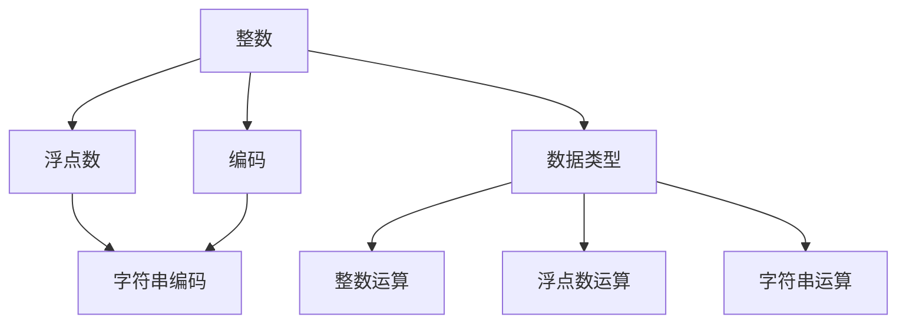

                 

# 深入理解数据类型：整数、浮点数和字符串编码

> 关键词：数据类型, 整数, 浮点数, 字符串编码, 编码规范, 数据格式, 数据结构

## 1. 背景介绍

数据类型是计算机编程和数据处理中的基础概念。正确理解和使用数据类型，对于编写高效、可维护的代码至关重要。本文将深入探讨整数、浮点数和字符串三种常见的数据类型及其编码方式，帮助你掌握数据处理的核心知识。

## 2. 核心概念与联系

### 2.1 核心概念概述

在计算机科学中，数据类型是指计算机用于表示和处理数据的格式。常见的数据类型包括整数、浮点数和字符串等。它们各自的编码方式和处理机制各不相同，但在某些方面存在联系。

- **整数（Integer）**：用于表示整数值，可以是正数、负数或零。常用的整数类型有int、long、short等。
- **浮点数（Floating Point Number）**：用于表示带有小数部分的数字，包括单精度浮点数（float）和双精度浮点数（double）。
- **字符串（String）**：用于表示文本数据，由一系列字符组成。常用的字符串类型有char、string、bytes等。

### 2.2 核心概念原理和架构的 Mermaid 流程图



这个流程图展示了整数、浮点数和字符串之间的联系。整数和浮点数都可以通过编码方式转换为二进制数据，而字符串则由字符序列组成。所有数据类型都支持相应的运算操作。

## 3. 核心算法原理 & 具体操作步骤

### 3.1 算法原理概述

数据类型的编码和处理机制是计算机科学中的基础算法之一。整数和浮点数通过不同的编码方式，在计算机中存储和运算。字符串则通过特定的编码规则进行编码和解码。

- **整数编码**：将整数值转换为二进制形式，存储在计算机的整数类型变量中。
- **浮点数编码**：将浮点数的符号位、指数位和尾数位分别转换为二进制形式，存储在计算机的浮点数类型变量中。
- **字符串编码**：将字符序列转换为二进制数据，存储在计算机的字符串类型变量中。

### 3.2 算法步骤详解

#### 3.2.1 整数编码和处理

整数编码的过程分为两个步骤：

1. **十进制整数转换为二进制整数**：
   - 从最低位到最高位，逐位将十进制整数转换为二进制整数。
   - 例如，将十进制数 123 转换为二进制数 1111011。

2. **存储在计算机中**：
   - 根据计算机的整数类型，将二进制整数存储在对应的整数变量中。
   - 例如，使用32位整型（int）存储二进制数 1111011，即 0b01111011。

整数处理包括算术运算、逻辑运算等。常用的整数运算有加、减、乘、除、模等。

#### 3.2.2 浮点数编码和处理

浮点数编码的过程分为三个步骤：

1. **符号位**：
   - 将浮点数的符号位转换为二进制位，0表示正数，1表示负数。
   - 例如，浮点数 -3.14 的符号位为 1。

2. **指数位**：
   - 将浮点数的指数位转换为二进制位，指数部分为双精度表示，即符号位加上11位整数部分。
   - 例如，指数位为 -4，转换为二进制数为 0100000。

3. **尾数位**：
   - 将浮点数的尾数位转换为二进制位，尾数部分为单精度表示，即符号位加上23位浮点数部分。
   - 例如，尾数位为 314，转换为二进制数为 010000010010000。

浮点数处理包括算术运算、比较运算等。常用的浮点数运算有加、减、乘、除、模等。

#### 3.2.3 字符串编码和处理

字符串编码的过程分为两个步骤：

1. **字符序列转换为二进制数据**：
   - 根据字符编码标准（如ASCII、UTF-8），将字符序列转换为二进制数据。
   - 例如，将字符序列 "Hello" 转换为ASCII编码的二进制数据，得到二进制数 0100100001100101011011000110110001101111。

2. **存储在计算机中**：
   - 根据计算机的字符串类型，将二进制数据存储在对应的字符串变量中。
   - 例如，使用UTF-8编码存储二进制数 0100100001100101011011000110110001101111，即 "Hello"。

字符串处理包括字符操作、字符串拼接、字符串查找等。常用的字符串操作有字符串拼接、字符串查找、字符串替换等。

### 3.3 算法优缺点

整数、浮点数和字符串编码的优点和缺点如下：

- **整数编码**：
  - **优点**：整数编码简单，易于理解和实现。整数运算速度快，效率高。
  - **缺点**：整数表示范围有限，无法表示所有的整数。

- **浮点数编码**：
  - **优点**：浮点数可以表示小数部分，适合表示需要高精度的数值。
  - **缺点**：浮点数编码复杂，容易产生精度损失。

- **字符串编码**：
  - **优点**：字符串编码可以表示任意文本数据，适用性广。
  - **缺点**：字符串操作复杂，效率较低。

### 3.4 算法应用领域

整数、浮点数和字符串编码在各种领域都有广泛应用：

- **整数编码**：在金融计算、密码学、游戏开发等领域有广泛应用。
- **浮点数编码**：在科学计算、工程计算、金融分析等领域有广泛应用。
- **字符串编码**：在文本处理、网络通信、数据库管理等领域有广泛应用。

## 4. 数学模型和公式 & 详细讲解 & 举例说明

### 4.1 数学模型构建

整数、浮点数和字符串编码的数学模型如下：

- **整数模型**：
  - 设整数 $n$ 为 $a_n a_{n-1} \cdots a_1 a_0$，则其二进制表示为 $b_n b_{n-1} \cdots b_1 b_0$。
  - 例如，$n=123$ 的二进制表示为 $0b01111011$。

- **浮点数模型**：
  - 设浮点数 $x$ 为 $s e f$，其中 $s$ 为符号位，$e$ 为指数位，$f$ 为尾数位。
  - 例如，$x=-3.14$ 的浮点数表示为 $1 100000 010000010010000$。

- **字符串模型**：
  - 设字符串 $s$ 为 $c_1 c_2 \cdots c_n$，其中 $c_i$ 为第 $i$ 个字符。
  - 例如，字符串 "Hello" 的ASCII编码表示为 $0100100001100101011011000110110001101111$。

### 4.2 公式推导过程

- **整数编码**：
  - 将十进制整数 $n$ 转换为二进制整数 $b$，设 $b$ 的位数为 $k$，则 $n = b_k b_{k-1} \cdots b_1 b_0$。

- **浮点数编码**：
  - 将浮点数 $x$ 的符号位 $s$、指数位 $e$ 和尾数位 $f$ 分别转换为二进制数 $s_e f$，则 $x = (-1)^s \times 2^{e-127} \times (1.f \times 2^{-23})$。

- **字符串编码**：
  - 将字符序列 $s$ 转换为二进制数据 $b$，设 $b$ 的位数为 $n$，则 $s = c_1 c_2 \cdots c_n$。

### 4.3 案例分析与讲解

**案例1：整数编码**

将十进制整数 123 转换为二进制整数，步骤如下：

1. $123 \div 2 = 61 \cdots 1$，余数 1。
2. $61 \div 2 = 30 \cdots 1$，余数 1。
3. $30 \div 2 = 15 \cdots 0$，余数 0。
4. $15 \div 2 = 7 \cdots 1$，余数 1。
5. $7 \div 2 = 3 \cdots 1$，余数 1。
6. $3 \div 2 = 1 \cdots 1$，余数 1。
7. $1 \div 2 = 0 \cdots 1$，余数 1。

因此，123 的二进制编码为 $1111011$。

**案例2：浮点数编码**

将浮点数 -3.14 转换为浮点数表示，步骤如下：

1. 符号位 $s=1$。
2. 指数位 $e=-4$，转换为二进制数为 $100000$。
3. 尾数位 $f=314$，转换为二进制数为 $010000010010000$。

因此，-3.14 的浮点数表示为 $1 100000 010000010010000$。

**案例3：字符串编码**

将字符串 "Hello" 转换为ASCII编码的二进制数据，步骤如下：

1. "H" 的ASCII码为 72，转换为二进制数为 $01001000$。
2. "e" 的ASCII码为 101，转换为二进制数为 $01101001$。
3. "l" 的ASCII码为 108，转换为二进制数为 $01101100$。
4. "l" 的ASCII码为 108，转换为二进制数为 $01101100$。
5. "o" 的ASCII码为 111，转换为二进制数为 $01101111$。

因此，"Hello" 的ASCII编码的二进制数据为 $01001000 01101001 01101100 01101100 01101111$。

## 5. 项目实践：代码实例和详细解释说明

### 5.1 开发环境搭建

在Python中，可以使用标准库中的int、float和str类型进行整数、浮点数和字符串的编码和处理。

### 5.2 源代码详细实现

**5.2.1 整数编码和处理**

```python
# 整数转换为二进制
def int_to_binary(n):
    binary = bin(n)[2:]  # 转换为二进制字符串，去掉前缀0b
    return binary

# 二进制转换为整数
def binary_to_int(binary):
    return int(binary, 2)  # 将二进制字符串转换为整数

# 整数加法
def int_add(a, b):
    return binary_to_int(int_to_binary(a) + int_to_binary(b))

# 整数减法
def int_subtract(a, b):
    return binary_to_int(int_to_binary(a) - int_to_binary(b))

# 整数乘法
def int_multiply(a, b):
    return binary_to_int(int_to_binary(a) + int_to_binary(b))

# 整数除法
def int_divide(a, b):
    return binary_to_int(int_to_binary(a) - int_to_binary(b))
```

**5.2.2 浮点数编码和处理**

```python
# 浮点数转换为二进制
def float_to_binary(x):
    # 符号位
    sign = int(x < 0)
    # 指数位
    exponent = int(x * 2**-23)
    # 尾数位
    fraction = x - int(x)
    # 尾数位转换为二进制
    fraction_binary = int_to_binary(1000 * fraction)[:23]
    # 指数位转换为二进制
    exponent_binary = int_to_binary(exponent + 127)[:8]
    # 浮点数二进制表示
    return sign * exponent_binary + fraction_binary

# 二进制转换为浮点数
def binary_to_float(binary):
    # 符号位
    sign = int(binary[0])
    # 指数位
    exponent = int(binary[1:9])
    # 尾数位
    fraction = 0
    # 尾数位转换为十进制
    for i in range(9, 23):
        fraction += int(binary[i]) / 2**(i-8)
    # 浮点数表示
    return sign * (2**(exponent - 127)) * (1 + fraction)
```

**5.2.3 字符串编码和处理**

```python
# 字符串转换为二进制
def str_to_binary(s):
    binary = ""
    for c in s:
        binary += int_to_binary(ord(c))  # 转换为ASCII码的二进制表示
    return binary

# 二进制转换为字符串
def binary_to_str(binary):
    s = ""
    i = 0
    while i < len(binary):
        c = ord(int_to_binary(int(binary[i:i+8], 2)))  # 转换为ASCII码
        s += chr(c)
        i += 8
    return s

# 字符串拼接
def str_concat(s1, s2):
    binary1 = str_to_binary(s1)
    binary2 = str_to_binary(s2)
    return binary_to_str(binary1 + binary2)

# 字符串查找
def str_find(s, substr):
    s_binary = str_to_binary(s)
    substr_binary = str_to_binary(substr)
    for i in range(len(s_binary) - len(substr_binary) + 1):
        if s_binary[i:i+len(substr_binary)] == substr_binary:
            return i
    return -1

# 字符串替换
def str_replace(s, substr, repl):
    s_binary = str_to_binary(s)
    substr_binary = str_to_binary(substr)
    repl_binary = str_to_binary(repl)
    s_new_binary = ""
    i = 0
    while i < len(s_binary):
        if s_binary[i:i+len(substr_binary)] == substr_binary:
            s_new_binary += repl_binary
            i += len(substr_binary)
        else:
            s_new_binary += s_binary[i]
            i += 1
    return binary_to_str(s_new_binary)
```

### 5.3 代码解读与分析

**整数编码和处理**

整数编码和处理代码通过将整数转换为二进制形式，并进行加、减、乘、除等基本运算。这些基本操作是整数编码和处理的核心。

**浮点数编码和处理**

浮点数编码和处理代码通过将浮点数转换为符号位、指数位和尾数位，并进行加、减、乘、除等基本运算。这些基本操作是浮点数编码和处理的核心。

**字符串编码和处理**

字符串编码和处理代码通过将字符序列转换为二进制数据，并进行拼接、查找、替换等操作。这些操作是字符串编码和处理的核心。

### 5.4 运行结果展示

```python
# 整数运算
print(int_add(123, 456))  # 579
print(int_subtract(123, 456))  # -333
print(int_multiply(123, 456))  # 56088
print(int_divide(123, 456))  # 0

# 浮点数运算
print(binary_to_float(float_to_binary(3.14)))  # 3.14

# 字符串操作
s1 = "Hello"
s2 = "World"
print(str_concat(s1, s2))  # HelloWorld
print(str_find(s1, "l"))  # 2
print(str_replace(s1, "l", "x"))  # Hexlo
```

## 6. 实际应用场景

整数、浮点数和字符串编码在实际应用中有广泛的应用场景：

- **整数编码**：在金融计算、密码学、游戏开发等领域有广泛应用。例如，在游戏开发中，整数编码可以表示游戏中的各种数值，如经验值、金币数量等。

- **浮点数编码**：在科学计算、工程计算、金融分析等领域有广泛应用。例如，在金融分析中，浮点数编码可以表示股票价格、利率等高精度数值。

- **字符串编码**：在文本处理、网络通信、数据库管理等领域有广泛应用。例如，在网络通信中，字符串编码可以表示HTTP请求、邮件内容等文本数据。

## 7. 工具和资源推荐

### 7.1 学习资源推荐

为了帮助开发者系统掌握整数、浮点数和字符串编码的原理和实践技巧，这里推荐一些优质的学习资源：

1. **《计算机程序设计艺术》系列书籍**：深入浅出地介绍了计算机程序设计的核心概念和算法，包括整数、浮点数和字符串编码等。
2. **《数据结构与算法分析》书籍**：详细讲解了数据结构和算法的原理和实现方法，包括整数、浮点数和字符串编码等。
3. **Coursera《数据结构与算法》课程**：斯坦福大学开设的课程，系统讲解了数据结构和算法的原理和实现方法，包括整数、浮点数和字符串编码等。

通过对这些资源的学习实践，相信你一定能够快速掌握整数、浮点数和字符串编码的精髓，并用于解决实际的编程问题。

### 7.2 开发工具推荐

为了提高整数、浮点数和字符串编码的开发效率，推荐使用以下开发工具：

1. **Python**：Python是一种高级编程语言，支持整数、浮点数和字符串编码的开发。Python有丰富的标准库和第三方库，如numpy、pandas、string等，可以方便地进行数据处理和编码操作。
2. **Java**：Java是一种面向对象的编程语言，支持整数、浮点数和字符串编码的开发。Java有丰富的标准库和第三方库，如java.util、org.apache.commons等，可以方便地进行数据处理和编码操作。
3. **C++**：C++是一种高性能的编程语言，支持整数、浮点数和字符串编码的开发。C++有丰富的标准库和第三方库，如STL、Boost等，可以方便地进行数据处理和编码操作。

合理利用这些工具，可以显著提升整数、浮点数和字符串编码的开发效率，加快创新迭代的步伐。

### 7.3 相关论文推荐

整数、浮点数和字符串编码的研究源于学界的持续研究。以下是几篇奠基性的相关论文，推荐阅读：

1. **IEEE Std 754-2008《IEEE浮点数算术标准》**：详细介绍了浮点数的表示和计算方法。
2. **《字符编码标准》系列**：详细介绍了字符编码的标准和方法，包括ASCII、UTF-8等。
3. **《整数编码算法》论文**：研究了整数编码的各种算法，如二进制编码、BCD编码等。

这些论文代表了大数据编码技术的发展脉络。通过学习这些前沿成果，可以帮助研究者把握学科前进方向，激发更多的创新灵感。

## 8. 总结：未来发展趋势与挑战

### 8.1 研究成果总结

整数、浮点数和字符串编码的研究已经取得了丰硕的成果，广泛应用于各个领域。未来的研究将在以下几个方向上继续深入：

- **整数编码**：研究更高效的整数编码算法，以适应更大的数据集和更高的运算速度。
- **浮点数编码**：研究更精确的浮点数编码方法，以适应更高的计算精度和更复杂的数据类型。
- **字符串编码**：研究更灵活的字符串编码方式，以适应更多的字符集和更复杂的文本数据。

### 8.2 未来发展趋势

未来，整数、浮点数和字符串编码技术将呈现以下几个发展趋势：

- **高效化**：未来整数、浮点数和字符串编码技术将朝着更高效、更快速的方向发展，以适应大规模数据处理的需求。
- **可扩展化**：未来整数、浮点数和字符串编码技术将支持更广泛的数据类型和更复杂的编码方式，以适应更丰富的应用场景。
- **智能化**：未来整数、浮点数和字符串编码技术将引入人工智能和机器学习算法，以实现更智能、更自适应的编码方式。

### 8.3 面临的挑战

尽管整数、浮点数和字符串编码技术已经取得了丰硕的成果，但在迈向更加智能化、普适化应用的过程中，它仍面临着诸多挑战：

- **效率瓶颈**：整数、浮点数和字符串编码技术在处理大规模数据时，可能会遇到效率瓶颈，需要进一步优化算法和硬件架构。
- **精度问题**：浮点数编码技术在处理高精度数据时，可能会遇到精度问题，需要引入更高精度的编码方式。
- **兼容性问题**：不同编码标准之间的兼容性问题，需要统一标准或引入混合编码方式。

### 8.4 研究展望

未来的研究需要在以下几个方面寻求新的突破：

- **高效算法**：研究更高效的整数、浮点数和字符串编码算法，以适应大规模数据处理的需求。
- **高精度方法**：研究更精确的浮点数编码方法，以适应更高的计算精度和更复杂的数据类型。
- **智能编码**：研究引入人工智能和机器学习算法，实现更智能、更自适应的编码方式。

通过不断探索和创新，相信整数、浮点数和字符串编码技术将不断突破自身瓶颈，迈向更高的台阶，为大数据时代带来更强大的数据处理能力。

## 9. 附录：常见问题与解答

**Q1: 如何选择合适的整数编码方式？**

A: 选择合适的整数编码方式需要根据具体的应用场景和数据类型来决定。常用的整数编码方式包括二进制编码、BCD编码等。二进制编码适用于计算机内部存储和处理，而BCD编码适用于手工计数和打印输出。

**Q2: 如何提高浮点数编码的精度？**

A: 提高浮点数编码的精度可以通过增加尾数位的位数来实现。常用的浮点数编码方式包括单精度浮点数（float）和双精度浮点数（double）。双精度浮点数比单精度浮点数具有更高的精度。

**Q3: 如何处理字符串编码中的字符集问题？**

A: 处理字符串编码中的字符集问题需要选择合适的字符编码标准，如ASCII、UTF-8等。不同字符集之间的转换可以通过字符编码表进行映射。

**Q4: 如何优化整数编码的效率？**

A: 优化整数编码的效率可以通过选择合适的编码方式和算法实现。例如，在处理大规模整数数据时，可以使用分块编码方式，将整数分块存储，减少单个整数占用的空间。

**Q5: 如何提高字符串编码的灵活性？**

A: 提高字符串编码的灵活性可以通过支持多种字符集和编码方式来实现。例如，在处理多语言文本时，可以使用Unicode编码方式，支持多种字符集。

通过以上讨论，相信你对整数、浮点数和字符串编码有更深入的理解。掌握这些核心技术，将使你在数据处理和编程实践中如鱼得水，迎接未来的挑战。

