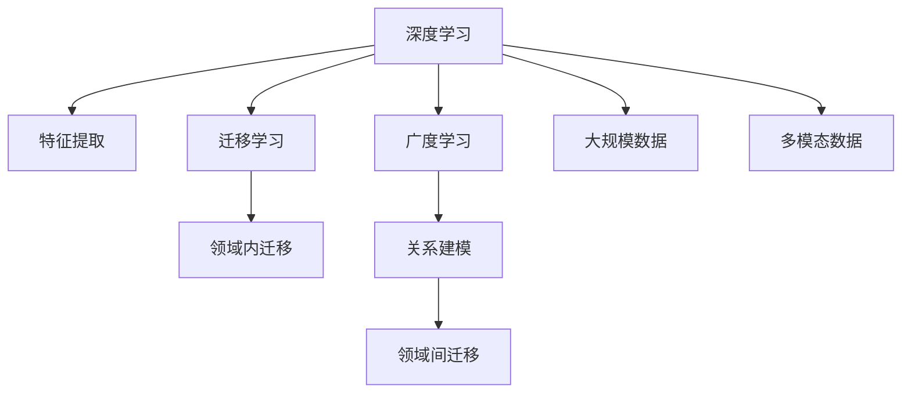

                 

# 深度学习vs广度学习：知识积累的策略

深度学习和广度学习是人工智能中两种重要的知识积累策略，分别代表了知识积累的深度和广度。深度学习注重在特定领域进行深入研究，以获得更精准、更高效的知识表示；而广度学习则强调在多个领域广泛涉猎，以构建更全面的知识网络。本文将深入探讨深度学习和广度学习的原理与联系，并通过具体的算法步骤和应用场景分析，揭示两种学习策略的优势与局限，帮助读者在实际应用中做出明智的选择。

## 1. 背景介绍

### 1.1 问题由来

在人工智能领域，深度学习和广度学习两种策略的应用非常广泛。深度学习注重在特定领域进行深入研究，以构建复杂、精确的模型，适用于图像识别、语音识别、自然语言处理等任务。而广度学习则强调在多个领域广泛涉猎，以构建全面的知识网络，适用于推荐系统、搜索引擎、知识图谱等任务。

然而，这两种学习策略各自有其优缺点，且在实际应用中常常被混淆。因此，本文旨在通过对深度学习和广度学习的深入分析，帮助读者理解二者的区别与联系，从而在实际应用中做出更明智的选择。

### 1.2 问题核心关键点

深度学习和广度学习在知识积累的策略上存在显著差异，核心关键点包括：

- 深度学习的核心在于构建深度神经网络，通过多层非线性映射来捕捉输入数据中的复杂结构，适用于小样本、高维数据等场景。
- 广度学习的核心在于建立大规模的知识图谱，通过图结构来表示实体间的复杂关系，适用于大规模数据、多模态数据的场景。

这两种策略在模型构建、数据处理、应用场景等方面都有所不同。因此，本文将系统分析深度学习和广度学习的原理与联系，并通过具体的算法步骤和应用场景分析，揭示二者的优势与局限。

## 2. 核心概念与联系

### 2.1 核心概念概述

深度学习和广度学习是两种重要的知识积累策略，其核心概念包括：

- 深度学习：通过多层神经网络进行复杂特征的提取和表示，适用于小样本、高维数据等场景。
- 广度学习：通过大规模的知识图谱进行实体间关系的表示，适用于大规模数据、多模态数据的场景。

深度学习和广度学习在知识表示、模型构建、数据处理等方面都有显著差异，但其联系也非常紧密，具体体现在以下几个方面：

- 深度学习与广度学习都是通过机器学习的方式进行知识积累，但深度学习强调特征提取，而广度学习强调关系建模。
- 深度学习与广度学习都依赖于大量的数据进行训练，但深度学习侧重于特定领域的数据，而广度学习侧重于全局数据。
- 深度学习与广度学习都可以通过迁移学习的方式进行知识迁移，但深度学习更适用于领域内迁移，而广度学习更适用于领域间迁移。

这些概念之间的逻辑关系可以通过以下Mermaid流程图来展示：



这个流程图展示深度学习和广度学习的核心概念及其之间的关系：

1. 深度学习通过多层神经网络进行特征提取，构建局部知识表示。
2. 广度学习通过大规模知识图谱进行关系建模，构建全局知识网络。
3. 深度学习和广度学习都可以通过迁移学习进行领域内和领域间的知识迁移。
4. 深度学习更适合处理小样本、高维数据，广度学习更适合处理大规模、多模态数据。

这些概念共同构成了深度学习和广度学习的学习框架，使得它们能够在各自的应用场景中发挥最大的潜力。

## 3. 核心算法原理 & 具体操作步骤

### 3.1 算法原理概述

深度学习和广度学习在算法原理上有显著差异，但二者都遵循机器学习的基本原理：通过数据训练模型，然后利用模型进行预测或决策。

深度学习的核心在于构建深度神经网络，通过多层非线性映射来捕捉输入数据中的复杂结构。常用的深度学习算法包括卷积神经网络(CNN)、循环神经网络(RNN)、Transformer等，适用于图像识别、语音识别、自然语言处理等任务。

广度学习的核心在于建立大规模的知识图谱，通过图结构来表示实体间的复杂关系。常用的广度学习算法包括关系图神经网络(RGNN)、图注意力网络(GAT)、图卷积网络(GCN)等，适用于推荐系统、搜索引擎、知识图谱等任务。

### 3.2 算法步骤详解

深度学习的算法步骤通常包括以下几个关键步骤：

1. 数据预处理：将原始数据转化为模型所需的标准格式，如图像数据的归一化、文本数据的分词、标签的编码等。
2. 模型构建：根据任务类型选择合适的深度学习模型，并进行参数初始化。
3. 模型训练：将预处理后的数据输入模型进行训练，优化模型参数以最小化损失函数。
4. 模型评估：使用验证集对训练好的模型进行评估，选择性能最优的模型进行测试。
5. 模型部署：将训练好的模型部署到生产环境中，进行实际应用。

广度学习的算法步骤也大致相同，但不同之处在于：

1. 数据预处理：需要构建大规模的知识图谱，并将实体间的关系进行编码。
2. 模型构建：选择合适的图神经网络模型，并进行参数初始化。
3. 模型训练：将图谱数据输入模型进行训练，优化模型参数以最小化图谱上的损失函数。
4. 模型评估：使用验证集对训练好的模型进行评估，选择性能最优的模型进行测试。
5. 模型部署：将训练好的模型部署到生产环境中，进行实际应用。

### 3.3 算法优缺点

深度学习和广度学习各有优缺点，具体如下：

深度学习的优点包括：
1. 适用于小样本、高维数据，能够捕捉数据中的复杂结构。
2. 模型复杂度可控，可以构建多层次的特征表示。
3. 能够处理非结构化数据，如文本、图像、语音等。

深度学习的缺点包括：
1. 需要大量数据进行训练，否则容易出现过拟合。
2. 模型训练时间长，计算资源需求高。
3. 可解释性较差，难以理解模型的内部机制。

广度学习的优点包括：
1. 适用于大规模数据、多模态数据，能够捕捉实体间的复杂关系。
2. 能够处理结构化数据，如关系图谱、知识图谱等。
3. 模型可解释性较强，能够直观表示实体间的关联关系。

广度学习的缺点包括：
1. 数据构建复杂，需要构建大规模的图谱结构。
2. 模型训练时间长，计算资源需求高。
3. 处理非结构化数据时，需要进行额外的编码处理。

### 3.4 算法应用领域

深度学习和广度学习在各个领域都有广泛的应用，具体如下：

- 深度学习在图像识别、语音识别、自然语言处理等任务上表现优异，广泛应用于医疗影像分析、智能音箱、自动驾驶等场景。
- 广度学习在推荐系统、搜索引擎、知识图谱等任务上表现优异，广泛应用于电商推荐、社交网络、百科知识库等场景。

此外，深度学习和广度学习还可以结合使用，形成混合学习模型，以发挥各自的优势。例如，在自然语言处理任务中，可以使用深度学习提取文本特征，再通过广度学习构建知识图谱，进行关系推理，以提升任务性能。

## 4. 数学模型和公式 & 详细讲解  
### 4.1 数学模型构建

深度学习和广度学习的数学模型构建方式有所不同，但都可以使用机器学习的基本框架进行建模。

深度学习的数学模型通常包括以下几个部分：
- 输入数据：$x \in \mathbb{R}^n$，表示输入数据的特征向量。
- 模型参数：$\theta \in \mathbb{R}^m$，表示模型中的可训练参数。
- 损失函数：$L(\theta, x, y)$，表示模型预测与真实标签之间的差异。
- 优化目标：$\min_{\theta} L(\theta, x, y)$，表示最小化损失函数，优化模型参数。

常用的深度学习算法，如卷积神经网络、循环神经网络、Transformer等，都可以通过类似的方式进行建模。

广度学习的数学模型通常包括以下几个部分：
- 输入数据：$G \in \mathbb{R}^V$，表示图谱中的节点特征向量。
- 模型参数：$\theta \in \mathbb{R}^E$，表示图谱中的边特征向量。
- 损失函数：$L(G, \theta, X)$，表示图谱上的损失函数。
- 优化目标：$\min_{G, \theta} L(G, \theta, X)$，表示最小化图谱上的损失函数，优化图谱结构和边特征向量。

常用的广度学习算法，如关系图神经网络、图注意力网络、图卷积网络等，都可以通过类似的方式进行建模。

### 4.2 公式推导过程

以深度学习中的卷积神经网络为例，推导其前向传播和反向传播过程。

**前向传播：**

卷积神经网络的前向传播过程包括卷积层、池化层、全连接层等。以卷积层为例，输入数据 $x \in \mathbb{R}^{n \times h \times w}$，卷积核 $w \in \mathbb{R}^{d \times h \times w}$，卷积操作后的输出 $y \in \mathbb{R}^{n' \times h' \times w'}$。

推导公式如下：
$$
y_{i,j,k} = \sum_{x_{i',j',k'} \in \Omega} x_{i',j',k'} * w_{i,j,k'}
$$
其中，$\Omega$ 表示卷积核覆盖的局部区域，$i'$、$j'$、$k'$ 表示局部区域的坐标，$i$、$j$、$k$ 表示输出区域的坐标。

**反向传播：**

卷积神经网络的反向传播过程包括前向传播的梯度反向传播。以卷积层为例，输出误差 $e \in \mathbb{R}^{n' \times h' \times w'}$，梯度 $dL/dy$ 和 $dy/dx$ 已知，求梯度 $dL/dw$。

推导公式如下：
$$
dL/dw = \sum_{i,j,k} (dL/dy_{i,j,k}) * \sum_{i',j',k'} (y_{i',j',k'} * dL/dx_{i',j',k'})
$$
其中，$w$ 表示卷积核参数，$y$ 表示卷积层输出，$e$ 表示误差。

### 4.3 案例分析与讲解

以广度学习中的关系图神经网络为例，推导其前向传播和反向传播过程。

**前向传播：**

关系图神经网络的前向传播过程包括节点特征更新和边特征更新。以节点特征更新为例，输入节点特征 $g_i \in \mathbb{R}^d$，邻居节点特征 $g_j \in \mathbb{R}^d$，节点特征更新函数 $f_{i,j}$，更新后的节点特征 $g'_i \in \mathbb{R}^d$。

推导公式如下：
$$
g'_i = f_{i,j}(g_i, g_j)
$$
其中，$g$ 表示节点特征向量，$g'$ 表示更新后的节点特征向量，$f$ 表示节点特征更新函数。

**反向传播：**

关系图神经网络的反向传播过程包括边特征的梯度反向传播。以边特征更新为例，输出误差 $e \in \mathbb{R}^E$，梯度 $dL/dg'_i$ 和 $dg'_i/dg_i$ 已知，求梯度 $dL/dg_i$。

推导公式如下：
$$
dL/dg_i = \sum_{j \in \mathcal{N}_i} (dL/dg'_i) * (dg'_i/dg_i)
$$
其中，$g$ 表示节点特征向量，$g'$ 表示更新后的节点特征向量，$dL$ 表示误差，$\mathcal{N}_i$ 表示节点 $i$ 的邻居节点集合。

## 5. 项目实践：代码实例和详细解释说明
### 5.1 开发环境搭建

在进行深度学习和广度学习实践前，我们需要准备好开发环境。以下是使用Python进行TensorFlow和PyTorch开发的环境配置流程：

1. 安装Anaconda：从官网下载并安装Anaconda，用于创建独立的Python环境。

2. 创建并激活虚拟环境：
```bash
conda create -n tf-env python=3.8 
conda activate tf-env
```

3. 安装TensorFlow和PyTorch：根据CUDA版本，从官网获取对应的安装命令。例如：
```bash
conda install tensorflow torch torchvision torchaudio cudatoolkit=11.1 -c pytorch -c conda-forge
```

4. 安装各类工具包：
```bash
pip install numpy pandas scikit-learn matplotlib tqdm jupyter notebook ipython
```

完成上述步骤后，即可在`tf-env`环境中开始深度学习和广度学习的实践。

### 5.2 源代码详细实现

这里我们以图像识别任务为例，给出使用TensorFlow和PyTorch进行深度学习的代码实现。

使用TensorFlow：

```python
import tensorflow as tf
from tensorflow.keras import layers

# 定义模型
model = tf.keras.Sequential([
    layers.Conv2D(32, (3,3), activation='relu', input_shape=(32, 32, 3)),
    layers.MaxPooling2D((2,2)),
    layers.Conv2D(64, (3,3), activation='relu'),
    layers.MaxPooling2D((2,2)),
    layers.Conv2D(64, (3,3), activation='relu'),
    layers.Flatten(),
    layers.Dense(64, activation='relu'),
    layers.Dense(10, activation='softmax')
])

# 编译模型
model.compile(optimizer='adam', loss='sparse_categorical_crossentropy', metrics=['accuracy'])

# 训练模型
model.fit(x_train, y_train, epochs=10, validation_data=(x_test, y_test))

# 评估模型
model.evaluate(x_test, y_test)
```

使用PyTorch：

```python
import torch
import torch.nn as nn
import torch.optim as optim

# 定义模型
class CNNModel(nn.Module):
    def __init__(self):
        super(CNNModel, self).__init__()
        self.conv1 = nn.Conv2d(3, 32, kernel_size=3, stride=1, padding=1)
        self.pool = nn.MaxPool2d(kernel_size=2, stride=2)
        self.conv2 = nn.Conv2d(32, 64, kernel_size=3, stride=1, padding=1)
        self.fc1 = nn.Linear(64 * 8 * 8, 64)
        self.fc2 = nn.Linear(64, 10)

    def forward(self, x):
        x = self.pool(torch.relu(self.conv1(x)))
        x = self.pool(torch.relu(self.conv2(x)))
        x = x.view(-1, 64 * 8 * 8)
        x = torch.relu(self.fc1(x))
        x = self.fc2(x)
        return x

# 初始化模型
model = CNNModel()

# 定义损失函数和优化器
criterion = nn.CrossEntropyLoss()
optimizer = optim.Adam(model.parameters())

# 训练模型
for epoch in range(10):
    running_loss = 0.0
    for i, data in enumerate(train_loader, 0):
        inputs, labels = data
        optimizer.zero_grad()
        outputs = model(inputs)
        loss = criterion(outputs, labels)
        loss.backward()
        optimizer.step()
        running_loss += loss.item()

# 评估模型
test_loss = 0
correct = 0
total = 0
with torch.no_grad():
    for data in test_loader:
        inputs, labels = data
        outputs = model(inputs)
        loss = criterion(outputs, labels)
        test_loss += loss.item()
        _, predicted = torch.max(outputs.data, 1)
        total += labels.size(0)
        correct += (predicted == labels).sum().item()
accuracy = 100 * correct / total
```

### 5.3 代码解读与分析

让我们再详细解读一下关键代码的实现细节：

**TensorFlow代码解读：**

**定义模型**：
```python
model = tf.keras.Sequential([
    layers.Conv2D(32, (3,3), activation='relu', input_shape=(32, 32, 3)),
    layers.MaxPooling2D((2,2)),
    layers.Conv2D(64, (3,3), activation='relu'),
    layers.MaxPooling2D((2,2)),
    layers.Conv2D(64, (3,3), activation='relu'),
    layers.Flatten(),
    layers.Dense(64, activation='relu'),
    layers.Dense(10, activation='softmax')
])
```

**编译模型**：
```python
model.compile(optimizer='adam', loss='sparse_categorical_crossentropy', metrics=['accuracy'])
```

**训练模型**：
```python
model.fit(x_train, y_train, epochs=10, validation_data=(x_test, y_test))
```

**评估模型**：
```python
model.evaluate(x_test, y_test)
```

**PyTorch代码解读：**

**定义模型**：
```python
class CNNModel(nn.Module):
    def __init__(self):
        super(CNNModel, self).__init__()
        self.conv1 = nn.Conv2d(3, 32, kernel_size=3, stride=1, padding=1)
        self.pool = nn.MaxPool2d(kernel_size=2, stride=2)
        self.conv2 = nn.Conv2d(32, 64, kernel_size=3, stride=1, padding=1)
        self.fc1 = nn.Linear(64 * 8 * 8, 64)
        self.fc2 = nn.Linear(64, 10)

    def forward(self, x):
        x = self.pool(torch.relu(self.conv1(x)))
        x = self.pool(torch.relu(self.conv2(x)))
        x = x.view(-1, 64 * 8 * 8)
        x = torch.relu(self.fc1(x))
        x = self.fc2(x)
        return x
```

**初始化模型**：
```python
model = CNNModel()
```

**定义损失函数和优化器**：
```python
criterion = nn.CrossEntropyLoss()
optimizer = optim.Adam(model.parameters())
```

**训练模型**：
```python
for epoch in range(10):
    running_loss = 0.0
    for i, data in enumerate(train_loader, 0):
        inputs, labels = data
        optimizer.zero_grad()
        outputs = model(inputs)
        loss = criterion(outputs, labels)
        loss.backward()
        optimizer.step()
        running_loss += loss.item()
```

**评估模型**：
```python
test_loss = 0
correct = 0
total = 0
with torch.no_grad():
    for data in test_loader:
        inputs, labels = data
        outputs = model(inputs)
        loss = criterion(outputs, labels)
        test_loss += loss.item()
        _, predicted = torch.max(outputs.data, 1)
        total += labels.size(0)
        correct += (predicted == labels).sum().item()
accuracy = 100 * correct / total
```

可以看到，TensorFlow和PyTorch在深度学习的代码实现上都有各自的优势。TensorFlow提供了更高级的API，方便模型构建和训练，而PyTorch则提供了更灵活的动态图机制，便于模型调试和优化。

## 6. 实际应用场景
### 6.1 智能推荐系统

深度学习和广度学习在智能推荐系统中均有广泛应用。智能推荐系统通过分析用户的历史行为和偏好，推荐符合用户兴趣的商品、内容等，使用户能够更快地发现感兴趣的信息。

在推荐系统中，深度学习通常用于构建用户和物品的表示向量，通过计算向量之间的相似度来推荐物品。常用的深度学习算法包括CNN、RNN、Transformer等。例如，在电商推荐系统中，可以使用卷积神经网络对用户行为数据进行特征提取，并构建用户和商品的表示向量，通过向量余弦相似度计算推荐结果。

广度学习则用于构建用户兴趣和物品之间的复杂关系。常用的广度学习算法包括图神经网络、知识图谱等。例如，在社交网络推荐系统中，可以使用关系图神经网络对用户和物品之间的关系进行建模，通过图卷积网络提取关系特征，构建推荐模型。

### 6.2 自然语言处理

自然语言处理是深度学习的重要应用领域之一，深度学习在文本分类、情感分析、机器翻译等任务上表现优异。深度学习通过多层神经网络进行特征提取和表示，能够捕捉文本中的复杂语义信息。

在自然语言处理中，深度学习通常用于构建词向量、句向量等文本表示。常用的深度学习算法包括Word2Vec、GloVe、BERT等。例如，在情感分析任务中，可以使用预训练的BERT模型进行特征提取，并构建分类器进行情感分类。

广度学习则用于构建文本之间的复杂关系。常用的广度学习算法包括知识图谱、关系图神经网络等。例如，在问答系统中，可以使用知识图谱构建问题-答案映射关系，通过关系图神经网络提取关系特征，构建问答模型。

### 6.3 计算机视觉

计算机视觉是深度学习的重要应用领域之一，深度学习在图像识别、目标检测、图像生成等任务上表现优异。深度学习通过多层卷积神经网络进行特征提取和表示，能够捕捉图像中的复杂结构。

在计算机视觉中，深度学习通常用于构建图像分类器、目标检测器、图像生成器等。常用的深度学习算法包括CNN、RNN、Transformer等。例如，在图像识别任务中，可以使用卷积神经网络对图像进行特征提取，并构建分类器进行图像分类。

广度学习则用于构建图像之间的复杂关系。常用的广度学习算法包括知识图谱、关系图神经网络等。例如，在图像检索任务中，可以使用关系图神经网络对图像之间的关系进行建模，通过图卷积网络提取关系特征，构建检索模型。

## 7. 工具和资源推荐
### 7.1 学习资源推荐

为了帮助开发者系统掌握深度学习和广度学习的理论基础和实践技巧，这里推荐一些优质的学习资源：

1. 《深度学习》（Ian Goodfellow、Yoshua Bengio、Aaron Courville著）：这是一本经典的深度学习教材，系统介绍了深度学习的基本原理和常用算法。

2. 《TensorFlow官方文档》：TensorFlow提供了详细的API文档和案例示例，方便开发者上手使用。

3. 《PyTorch官方文档》：PyTorch提供了详细的API文档和案例示例，方便开发者上手使用。

4. 《机器学习实战》（Peter Harrington著）：这是一本实战性较强的机器学习教材，涵盖深度学习、广度学习的经典算法和应用。

5. 《深度学习入门》（斋藤康毅著）：这是一本适合初学者的深度学习教材，介绍了深度学习的基本原理和常用算法。

通过对这些资源的学习实践，相信你一定能够快速掌握深度学习和广度学习的精髓，并用于解决实际的机器学习问题。

### 7.2 开发工具推荐

高效的开发离不开优秀的工具支持。以下是几款用于深度学习和广度学习开发的常用工具：

1. TensorFlow：由Google主导开发的开源深度学习框架，生产部署方便，适合大规模工程应用。

2. PyTorch：由Facebook主导开发的开源深度学习框架，灵活动态的计算图，适合快速迭代研究。

3. Jupyter Notebook：开源的交互式编程环境，方便开发者进行模型构建和调试。

4. Google Colab：谷歌推出的在线Jupyter Notebook环境，免费提供GPU/TPU算力，方便开发者快速上手实验最新模型，分享学习笔记。

合理利用这些工具，可以显著提升深度学习和广度学习的开发效率，加快创新迭代的步伐。

### 7.3 相关论文推荐

深度学习和广度学习的发展源于学界的持续研究。以下是几篇奠基性的相关论文，推荐阅读：

1. AlexNet：ImageNet大挑战冠军模型，引入了卷积神经网络结构，开启了深度学习时代。

2. LeNet-5：手写数字识别模型，引入了多层感知机结构，奠定了深度学习基础。

3. Word2Vec：首次引入词向量概念，将单词转化为向量表示，推动了自然语言处理的发展。

4. BERT：大规模预训练语言模型，在多个NLP任务上刷新了SOTA，推动了深度学习的进步。

5. GraphSAGE：关系图神经网络，将图结构引入深度学习，推动了广度学习的发展。

这些论文代表了大深度学习和广度学习的理论进展，通过学习这些前沿成果，可以帮助研究者把握学科前进方向，激发更多的创新灵感。

## 8. 总结：未来发展趋势与挑战

### 8.1 总结

本文对深度学习和广度学习的原理与联系进行了系统分析，并通过具体的算法步骤和应用场景分析，揭示了两种学习策略的优势与局限。深度学习和广度学习在知识积累的策略上有显著差异，但二者的联系也非常紧密。深度学习强调特征提取，适用于小样本、高维数据等场景；广度学习强调关系建模，适用于大规模数据、多模态数据的场景。

通过本文的系统梳理，可以看到，深度学习和广度学习在各自的领域中均取得了显著的成就，推动了人工智能技术的发展。在未来，深度学习和广度学习将会在更多领域得到应用，为人工智能技术的进步做出更大的贡献。

### 8.2 未来发展趋势

展望未来，深度学习和广度学习将呈现以下几个发展趋势：

1. 深度学习与广度学习结合：未来深度学习和广度学习将更加紧密地结合，通过混合学习模型，利用各自的优势，提升模型性能。

2. 模型规模和计算资源提升：深度学习和广度学习将依赖于更强大的计算资源和更复杂的模型结构，以应对更大规模的数据和更复杂的关系。

3. 模型解释性与可控性增强：未来深度学习和广度学习将更加注重模型的可解释性和可控性，通过引入因果推理、逻辑规则等方法，增强模型的透明度和稳定性。

4. 多模态数据的融合：未来深度学习和广度学习将更加注重多模态数据的融合，利用视觉、语音、文本等多种信息，构建更加全面、准确的模型。

5. 自监督学习和迁移学习的应用：未来深度学习和广度学习将更多地利用自监督学习和迁移学习的方法，减少对标注数据的依赖，提高模型泛化能力。

这些趋势表明，深度学习和广度学习将会在多个领域得到应用，为人工智能技术的进步做出更大的贡献。

### 8.3 面临的挑战

尽管深度学习和广度学习在人工智能中取得了显著成就，但在迈向更加智能化、普适化应用的过程中，仍面临诸多挑战：

1. 数据获取和标注成本高昂：深度学习和广度学习需要大量的数据进行训练，而数据获取和标注成本较高。如何降低成本，提高数据质量，是未来的一个重要挑战。

2. 计算资源需求高：深度学习和广度学习对计算资源的需求较高，超大规模模型的训练和推理需要高性能硬件支持。如何提高计算效率，降低资源消耗，是未来的一个重要挑战。

3. 模型复杂性增加：未来深度学习和广度学习的模型结构将更加复杂，难以理解和调试。如何提高模型的可解释性和可控性，是未来的一个重要挑战。

4. 模型泛化能力不足：深度学习和广度学习在特定领域的数据上表现优异，但在跨领域数据上泛化能力较差。如何提高模型的泛化能力，适应多样化的数据分布，是未来的一个重要挑战。

5. 数据隐私和安全问题：深度学习和广度学习需要处理大量的敏感数据，如何保障数据隐私和安全，避免模型泄露敏感信息，是未来的一个重要挑战。

这些挑战表明，深度学习和广度学习在迈向更加智能化、普适化应用的过程中，仍需要不断进行技术创新和优化。

### 8.4 研究展望

面对深度学习和广度学习所面临的挑战，未来的研究需要在以下几个方面寻求新的突破：

1. 数据高效获取和标注技术：未来需要探索更多高效的数据获取和标注技术，如数据合成、自动标注等，减少对人类标注的依赖。

2. 高效计算资源和模型压缩技术：未来需要探索更多高效计算资源和模型压缩技术，如GPU/TPU优化、模型量化加速等，提高计算效率和资源利用率。

3. 可解释性和可控性技术：未来需要探索更多可解释性和可控性技术，如因果推理、逻辑规则等，增强模型的透明度和稳定性。

4. 跨领域泛化能力提升：未来需要探索更多跨领域泛化能力提升技术，如迁移学习、多模态学习等，提高模型的泛化能力。

5. 数据隐私和安全保护技术：未来需要探索更多数据隐私和安全保护技术，如差分隐私、联邦学习等，保障数据隐私和安全。

这些研究方向表明，深度学习和广度学习在迈向更加智能化、普适化应用的过程中，仍需要不断进行技术创新和优化，以应对未来的挑战。

## 9. 附录：常见问题与解答

**Q1：深度学习和广度学习有什么区别？**

A: 深度学习强调特征提取，通过多层神经网络进行复杂特征的提取和表示，适用于小样本、高维数据等场景。广度学习强调关系建模，通过大规模知识图谱进行实体间关系的表示，适用于大规模数据、多模态数据的场景。

**Q2：深度学习和广度学习在实际应用中如何选择？**

A: 在实际应用中，可以根据任务特点选择深度学习和广度学习：
1. 对于需要高精度、低复杂度的任务，如文本分类、图像识别等，可以选择深度学习。
2. 对于需要全局视角、多模态关系的任务，如推荐系统、知识图谱等，可以选择广度学习。

**Q3：深度学习和广度学习是否可以结合使用？**

A: 深度学习和广度学习可以结合使用，形成混合学习模型，利用各自的优势，提升模型性能。例如，在自然语言处理任务中，可以使用深度学习提取文本特征，再通过广度学习构建知识图谱，进行关系推理，以提升任务性能。

**Q4：深度学习和广度学习有哪些应用场景？**

A: 深度学习和广度学习在各个领域都有广泛的应用：
1. 深度学习在图像识别、语音识别、自然语言处理等任务上表现优异，广泛应用于医疗影像分析、智能音箱、自动驾驶等场景。
2. 广度学习在推荐系统、搜索引擎、知识图谱等任务上表现优异，广泛应用于电商推荐、社交网络、百科知识库等场景。

通过对这些资源的学习实践，相信你一定能够快速掌握深度学习和广度学习的精髓，并用于解决实际的机器学习问题。

