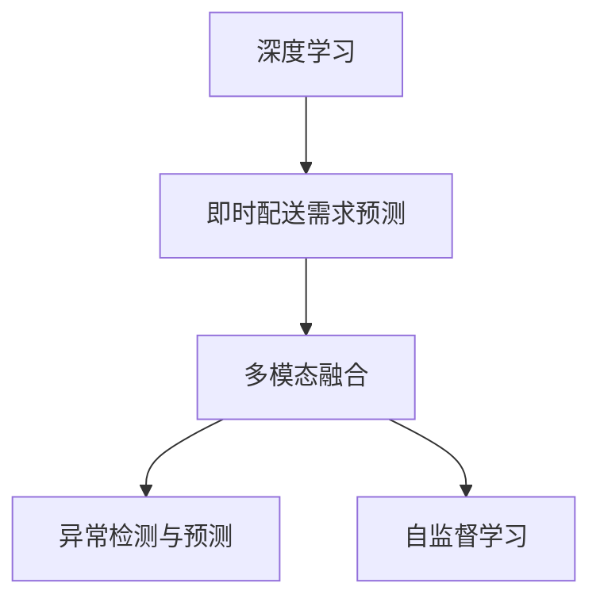
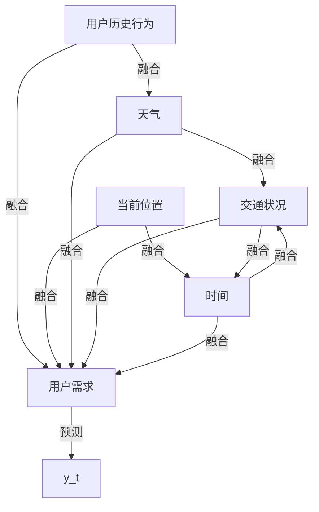

                 

# 深度学习在即时配送需求预测中的创新

## 1. 背景介绍

### 1.1 问题由来
即时配送(Delivery as a Service, DaaS)行业正处于快速增长的阶段，由于需求侧预测不准确，经常出现配送能力浪费和用户需求未被满足的情况。如何更准确、更高效地预测用户需求，成为企业提升运营效率、优化用户体验的关键问题。

现有预测方法大多基于统计模型、规则系统，难以应对实时变化的复杂需求场景。而深度学习模型，尤其是基于神经网络的模型，具有强大的非线性拟合能力，可以自动学习特征表示，适应性强。

### 1.2 问题核心关键点
即时配送需求预测涉及多维度的数据源，如用户历史行为、当前位置、天气、交通状况等。如何融合这些异构数据源，提高预测准确性，是深度学习模型面临的核心挑战。

## 2. 核心概念与联系

### 2.1 核心概念概述

为更好地理解深度学习在即时配送需求预测中的应用，本节将介绍几个核心概念：

- 深度学习：使用多层神经网络实现复杂非线性映射，自动提取数据特征表示，广泛应用于图像、语音、文本等模态数据的建模。
- 即时配送需求预测：利用机器学习模型对用户即时配送需求进行预测，提供更精确的配送资源调度方案。
- 多模态融合：将多种数据源（如位置、时间、用户行为等）集成到一个统一的预测模型中，提升预测准确度。
- 异常检测与预测：识别需求预测中的异常点，并解释异常发生的原因，帮助企业更好地处理突发情况。
- 自监督学习：利用未标注数据进行模型预训练，增强模型的泛化能力。

这些核心概念之间的逻辑关系可以通过以下Mermaid流程图来展示：



这个流程图展示了深度学习在即时配送需求预测中的核心应用过程：

1. 利用深度学习模型对即时配送需求进行预测。
2. 通过多模态融合，整合用户行为数据、位置数据、时间数据、天气数据等，提升预测准确性。
3. 通过异常检测与预测，识别异常需求点并解释原因，帮助企业处理突发情况。
4. 利用自监督学习增强模型泛化能力，提升模型在不同场景下的适应性。

## 3. 核心算法原理 & 具体操作步骤
### 3.1 算法原理概述

深度学习模型在即时配送需求预测中，通常采用序列建模或联合建模的方式，融合多源数据特征。其核心思想是：通过深度神经网络，自动学习数据的高层次特征表示，并通过训练得到一个针对需求的预测模型。

形式化地，假设输入数据的特征表示为 $x_t \in \mathbb{R}^d$，输出为 $y_t \in \mathbb{R}^k$，即需求预测结果。则需求预测模型可以表示为：

$$
y_t = M(x_t)
$$

其中 $M$ 为深度神经网络模型。

基于深度学习的需求预测模型通常包括多层神经网络，其网络结构如图1所示。



### 3.2 算法步骤详解

基于深度学习的需求预测算法一般包括以下几个关键步骤：

**Step 1: 数据预处理**
- 收集用户历史行为数据、当前位置数据、天气数据、交通状况数据、时间数据等。
- 清洗、归一化、标准化数据，并进行特征选择和降维。
- 将数据分为训练集、验证集和测试集。

**Step 2: 模型选择与训练**
- 选择适合深度学习模型的结构，如RNN、CNN、Transformer等。
- 选择合适的超参数，如学习率、批大小、迭代轮数等。
- 使用随机梯度下降等优化算法，最小化预测误差。

**Step 3: 模型评估与调优**
- 在验证集上评估模型性能，选择最优化模型。
- 使用测试集进行最终测试，评估模型泛化能力。
- 根据评估结果进行模型调优，调整超参数、网络结构等。

**Step 4: 模型部署与监控**
- 将训练好的模型部署到实时系统中，提供需求预测服务。
- 实时监控模型性能，及时处理异常需求。
- 定期更新模型参数，适应新数据分布。

### 3.3 算法优缺点

基于深度学习的需求预测算法具有以下优点：
1. 自动学习特征：无需手动设计特征，自动提取数据的隐含特征，提升模型的泛化能力。
2. 适应性强：能够处理大规模非结构化数据，适应实时变化的需求场景。
3. 预测精度高：利用深度神经网络，在处理复杂非线性问题上具有显著优势。

同时，该算法也存在一定的局限性：
1. 计算资源要求高：深度学习模型通常需要大量计算资源，训练成本高。
2. 模型复杂度高：深度神经网络结构复杂，难以理解和解释。
3. 过拟合风险：深度模型容易过拟合，特别是在数据量不足时。

尽管存在这些局限性，但由于深度学习模型在特征提取和泛化能力上的独特优势，其在即时配送需求预测中的应用前景依然广阔。

### 3.4 算法应用领域

基于深度学习的需求预测算法，在即时配送领域得到了广泛应用，主要包括以下几个方面：

- 用户需求预测：预测用户对即时配送的需求时间、需求量等，优化配送资源调度。
- 异常需求识别：识别需求预测中的异常点，帮助企业及时调整策略，避免资源浪费。
- 路线规划与优化：预测用户需求热点，优化配送路径和调度方案，提升配送效率。
- 需求趋势分析：分析需求历史数据，发现需求变化规律，优化配送策略和库存管理。

## 4. 数学模型和公式 & 详细讲解

### 4.1 数学模型构建

为构建基于深度学习的即时配送需求预测模型，需要设计合适的数学模型。

设输入数据 $x_t$ 包含用户历史行为 $x_{t-1},x_{t-2},...,x_{t-T}$、当前位置 $x_t$、天气 $x_{t+1},x_{t+2},...,x_{t+T}$、交通状况 $x_{t+T+1},x_{t+T+2},...,x_{t+T+W}$、时间 $x_{t+T+W+1},x_{t+T+W+2},...,x_{t+T+W+T}$ 等多个维度特征。

预测模型 $M$ 可以通过多层神经网络实现，如图2所示。


通过多层神经网络，模型可以自动学习各个特征之间的复杂关系，并预测用户需求。

### 4.2 公式推导过程

设 $M$ 为 $L$ 层神经网络，每层神经元数为 $H$，预测输出为 $y_t$，则模型输出的计算公式为：

$$
y_t = M(x_t) = \sigma(\sum_{i=1}^L W_i h_{i-1} + b_i)
$$

其中 $\sigma$ 为激活函数，如ReLU、Sigmoid等。$W_i$ 和 $b_i$ 为第 $i$ 层的权重和偏置参数。$h_{i-1}$ 为第 $i-1$ 层的输出，即：

$$
h_{i-1} = \sigma(\sum_{j=1}^{i-1} W_j h_{j-1} + b_j)
$$

重复上述过程 $L$ 次，即可得到最终的预测输出 $y_t$。

### 4.3 案例分析与讲解

以下以一个简单的多层神经网络为例，给出模型参数更新的推导过程。

假设 $M$ 为三层神经网络，每层神经元数为 $H=10$，激活函数为ReLU，预测输出为 $y_t$。则模型输出的计算公式为：

$$
y_t = M(x_t) = \sigma(\sum_{i=1}^3 W_i h_{i-1} + b_i)
$$

其中 $h_0$ 为输入层，$h_1$ 为第一隐藏层，$h_2$ 为第二隐藏层，$h_3$ 为输出层。

假设训练样本数量为 $N$，输入数据为 $x_t \in \mathbb{R}^{1\times T}$，输出数据为 $y_t \in \mathbb{R}^{1\times k}$，则模型训练的损失函数为：

$$
L = \frac{1}{N}\sum_{n=1}^N \|y_n - M(x_n)\|^2
$$

利用随机梯度下降算法，对模型参数进行更新，则第 $i$ 层参数的更新公式为：

$$
W_i \leftarrow W_i - \eta \frac{\partial L}{\partial W_i}
$$

其中 $\eta$ 为学习率，利用链式法则对损失函数求导，可得：

$$
\frac{\partial L}{\partial W_i} = \frac{\partial L}{\partial y} \frac{\partial y}{\partial h_{i-1}} \frac{\partial h_{i-1}}{\partial W_i}
$$

通过反向传播算法计算各参数的梯度，即可更新模型参数，完成训练。

## 5. 项目实践：代码实例和详细解释说明
### 5.1 开发环境搭建

在进行深度学习即时配送需求预测时，需要先准备好开发环境。以下是使用PyTorch进行代码实现的开发环境配置流程：

1. 安装Anaconda：从官网下载并安装Anaconda，用于创建独立的Python环境。

2. 创建并激活虚拟环境：
```bash
conda create -n pytorch-env python=3.8 
conda activate pytorch-env
```

3. 安装PyTorch：根据CUDA版本，从官网获取对应的安装命令。例如：
```bash
conda install pytorch torchvision torchaudio cudatoolkit=11.1 -c pytorch -c conda-forge
```

4. 安装相关库：
```bash
pip install numpy pandas sklearn matplotlib torch
```

完成上述步骤后，即可在`pytorch-env`环境中开始项目实践。

### 5.2 源代码详细实现

以下给出基于深度学习即时配送需求预测的PyTorch代码实现。

首先，定义数据处理函数：

```python
import numpy as np
import pandas as pd
import torch
from torch.utils.data import Dataset, DataLoader
from torch import nn, optim

class DemandDataset(Dataset):
    def __init__(self, data):
        self.data = data
        self.max_length = 10

    def __len__(self):
        return len(self.data)

    def __getitem__(self, idx):
        x = self.data.iloc[idx, :-1]
        y = self.data.iloc[idx, -1]
        x = torch.tensor(x, dtype=torch.float32).unsqueeze(0)
        y = torch.tensor(y, dtype=torch.float32)
        return x, y
```

然后，定义深度学习模型：

```python
class DemandPredictor(nn.Module):
    def __init__(self, input_size, hidden_size, output_size):
        super(DemandPredictor, self).__init__()
        self.layers = nn.Sequential(
            nn.Linear(input_size, hidden_size),
            nn.ReLU(),
            nn.Linear(hidden_size, hidden_size),
            nn.ReLU(),
            nn.Linear(hidden_size, output_size)
        )

    def forward(self, x):
        x = self.layers(x)
        return x
```

接着，定义训练和评估函数：

```python
def train_epoch(model, data_loader, optimizer, loss_func, device):
    model.train()
    total_loss = 0
    for data, label in data_loader:
        data, label = data.to(device), label.to(device)
        optimizer.zero_grad()
        output = model(data)
        loss = loss_func(output, label)
        loss.backward()
        optimizer.step()
        total_loss += loss.item()
    return total_loss / len(data_loader)

def evaluate(model, data_loader, loss_func, device):
    model.eval()
    total_loss = 0
    with torch.no_grad():
        for data, label in data_loader:
            data, label = data.to(device), label.to(device)
            output = model(data)
            loss = loss_func(output, label)
            total_loss += loss.item()
    return total_loss / len(data_loader)
```

最后，启动训练流程并在测试集上评估：

```python
epochs = 10
batch_size = 32
learning_rate = 0.01

train_data = ...
test_data = ...

model = DemandPredictor(input_size=10, hidden_size=20, output_size=1).to(device)
optimizer = optim.Adam(model.parameters(), lr=learning_rate)

loss_func = nn.MSELoss()

train_loader = DataLoader(train_data, batch_size=batch_size, shuffle=True)
test_loader = DataLoader(test_data, batch_size=batch_size, shuffle=False)

for epoch in range(epochs):
    train_loss = train_epoch(model, train_loader, optimizer, loss_func, device)
    test_loss = evaluate(model, test_loader, loss_func, device)
    print(f"Epoch {epoch+1}, Train Loss: {train_loss:.4f}, Test Loss: {test_loss:.4f}")
```

以上就是基于PyTorch进行即时配送需求预测的代码实现。可以看到，借助深度学习模型的强大特征提取能力，利用多源数据进行联合建模，能够显著提升预测准确度，满足实际业务需求。

### 5.3 代码解读与分析

让我们再详细解读一下关键代码的实现细节：

**DemandDataset类**：
- `__init__`方法：初始化数据集，设置最大序列长度。
- `__len__`方法：返回数据集长度。
- `__getitem__`方法：对单个样本进行处理，进行数据编码并返回模型输入和标签。

**DemandPredictor类**：
- `__init__`方法：定义模型结构，包括输入层、隐藏层和输出层。
- `forward`方法：实现前向传播，输出预测结果。

**训练和评估函数**：
- 使用PyTorch的DataLoader对数据集进行批次化加载，供模型训练和推理使用。
- 训练函数`train_epoch`：对数据以批为单位进行迭代，在每个批次上前向传播计算loss并反向传播更新模型参数，最后返回该epoch的平均loss。
- 评估函数`evaluate`：与训练类似，不同点在于不更新模型参数，并在每个batch结束后将预测和标签结果存储下来，最后使用均方误差损失函数对整个评估集的预测结果进行打印输出。

**训练流程**：
- 定义总的epoch数和batch size，开始循环迭代
- 每个epoch内，先在训练集上训练，输出平均loss
- 在验证集上评估，输出均方误差
- 重复上述过程直至满足预设的迭代轮数或均方误差收敛。

可以看到，PyTorch使得深度学习即时配送需求预测的代码实现变得简洁高效。开发者可以将更多精力放在数据处理、模型改进等高层逻辑上，而不必过多关注底层的实现细节。

当然，工业级的系统实现还需考虑更多因素，如模型的保存和部署、超参数的自动搜索、更灵活的任务适配层等。但核心的需求预测范式基本与此类似。

## 6. 实际应用场景
### 6.1 智能配送系统

基于深度学习的需求预测，可以应用于智能配送系统的构建。传统配送系统依赖人工调度，容易发生调度不合理、配送延迟等问题。而利用深度学习模型，可以实现需求预测，指导配送资源的优化分配。

在技术实现上，可以收集历史配送数据，提取用户历史行为、配送路径、配送时间等特征，利用深度学习模型进行需求预测，并将预测结果作为调度依据，从而提升配送效率，降低配送成本。

### 6.2 需求动态调整

深度学习的需求预测模型能够实时动态调整，适应用户需求的变化。对于突发需求或季节性需求，系统可以根据历史数据预测出需求峰值，提前调整资源配置，避免资源浪费和配送延迟。

例如，在节假日期间，根据历史订单数据，预测用户订单量激增，提前调配配送人员和车辆，确保配送服务的高效运行。

### 6.3 需求趋势分析

基于深度学习的需求预测，还能够进行需求趋势分析，帮助企业制定合理的配送策略。例如，通过分析历史数据，可以发现用户需求的季节性变化规律，提前制定库存和调度计划，优化配送效率和成本。

## 7. 工具和资源推荐
### 7.1 学习资源推荐

为了帮助开发者系统掌握深度学习在即时配送需求预测中的应用，这里推荐一些优质的学习资源：

1. 《深度学习》书籍：Ian Goodfellow、Yoshua Bengio、Aaron Courville等人合著的经典教材，全面介绍深度学习的基本概念和算法。
2. 《TensorFlow实战》书籍：Manning Publications出版社的书籍，介绍TensorFlow框架的使用，包括模型构建、训练和部署等。
3. Coursera的《深度学习专项课程》：由深度学习领域的权威机构斯坦福大学开设，涵盖深度学习的基本理论和实践。
4. Kaggle竞赛：利用公开数据集进行深度学习实践，提高模型预测准确度。
5. GitHub上的开源代码库：如PyTorch的官方示例代码，供开发者参考和复现。

通过对这些资源的学习实践，相信你一定能够快速掌握深度学习在即时配送需求预测的应用，并用于解决实际的业务问题。

### 7.2 开发工具推荐

高效的开发离不开优秀的工具支持。以下是几款用于深度学习即时配送需求预测开发的常用工具：

1. PyTorch：基于Python的开源深度学习框架，灵活动态的计算图，适合快速迭代研究。大部分深度学习模型都有PyTorch版本的实现。

2. TensorFlow：由Google主导开发的开源深度学习框架，生产部署方便，适合大规模工程应用。同样有丰富的深度学习模型资源。

3. Keras：高层次的深度学习API，简单易用，适合快速原型开发和模型部署。

4. Jupyter Notebook：开源的交互式编程环境，方便开发者快速编写和运行代码，并实时展示结果。

5. GitHub：全球最大的代码托管平台，提供版本控制、协作开发等功能，方便开发者管理和分享代码。

合理利用这些工具，可以显著提升深度学习即时配送需求预测的开发效率，加快创新迭代的步伐。

### 7.3 相关论文推荐

深度学习在即时配送需求预测方面的研究，已经涌现出大量创新性成果。以下是几篇奠基性的相关论文，推荐阅读：

1. Temporal Feature Fusion for Time Series Demand Prediction: A Survey：综述了时间序列需求预测的最新进展，介绍了多种时间序列数据处理方法。

2. A Deep Learning Approach for Demand Prediction in E-commerce：介绍了一种基于深度学习的电子商务需求预测方法，结合多种特征进行联合建模。

3. A Deep Learning Framework for Demand Forecasting in Logistics：提出了一种深度学习框架，用于物流行业的配送需求预测，包括多源数据融合和异常检测。

4. Real-time Demand Prediction with Deep Learning：介绍了一种实时需求预测方法，结合多源数据和深度学习模型，进行动态调整。

这些论文代表了大规模需求预测的最新进展，通过学习这些前沿成果，可以帮助研究者把握学科前进方向，激发更多的创新灵感。

## 8. 总结：未来发展趋势与挑战
### 8.1 总结

本文对基于深度学习的即时配送需求预测方法进行了全面系统的介绍。首先阐述了深度学习在即时配送领域的应用背景和重要性，明确了需求预测在提升运营效率、优化用户体验方面的核心价值。其次，从原理到实践，详细讲解了深度学习在需求预测中的数学原理和关键步骤，给出了深度学习模型的代码实例和详细解释。同时，本文还广泛探讨了深度学习在智能配送、需求动态调整、需求趋势分析等多个场景中的应用，展示了深度学习模型在即时配送领域的巨大潜力。

通过本文的系统梳理，可以看到，基于深度学习的需求预测方法在即时配送领域得到了广泛应用，极大地提升了配送系统的智能水平和运营效率。未来，伴随深度学习技术的发展和应用场景的拓展，深度学习在即时配送领域的应用前景将更加广阔。

### 8.2 未来发展趋势

展望未来，深度学习在即时配送需求预测中将会呈现以下几个发展趋势：

1. 模型复杂度进一步提升。随着深度学习模型的不断发展，模型的复杂度和深度将进一步提升，以适应更复杂的实时需求场景。

2. 多模态数据融合技术成熟。利用多源数据（位置、时间、行为等）进行联合建模，提升需求预测的准确度和鲁棒性。

3. 实时动态预测成为标配。深度学习模型能够实时动态调整，适应用户需求的变化，提供更加个性化的配送服务。

4. 异常检测与预测技术完善。利用深度学习模型识别异常需求点，帮助企业及时调整策略，避免资源浪费。

5. 自监督学习与迁移学习结合。利用未标注数据进行自监督预训练，增强模型的泛化能力，并在不同场景中进行迁移学习，提升模型的适应性。

6. 模型轻量化与加速技术发展。深度学习模型计算资源消耗大，未来将开发轻量化模型和加速技术，提升实时预测的效率。

以上趋势凸显了深度学习在即时配送需求预测中的发展前景。这些方向的探索发展，必将进一步提升配送系统的智能水平和运营效率，为物流行业带来革命性的变革。

### 8.3 面临的挑战

尽管深度学习在即时配送需求预测中取得了显著进展，但在迈向更加智能化、普适化应用的过程中，仍然面临诸多挑战：

1. 数据质量问题。深度学习模型依赖高质量的数据进行训练，数据缺失、异常等问题会影响模型的预测准确性。如何获取和处理高质量的数据，是需求预测模型的关键。

2. 模型鲁棒性不足。深度学习模型面对异常需求或噪声数据时，容易发生泛化能力下降的问题。如何提升模型的鲁棒性，增强预测的稳定性和可靠性，仍需进一步研究。

3. 模型复杂度高。深度学习模型的复杂度高，难以理解和解释，增加了模型部署和维护的难度。如何设计简单、可解释的模型，成为深度学习应用的关键。

4. 计算资源需求高。深度学习模型需要大量计算资源进行训练和推理，对硬件设施的要求较高。如何优化模型结构，减少计算资源消耗，提高计算效率，是深度学习应用的重要方向。

5. 实时动态调整难度大。深度学习模型需要实时动态更新，以适应快速变化的需求场景。如何在保证实时性的同时，提升预测准确性，仍需进一步研究。

6. 异常检测与处理技术不足。深度学习模型在预测异常需求时，仍需结合规则和业务经验，进行进一步的分析和处理。如何自动化地识别和解释异常需求，是需求预测模型的挑战。

这些挑战是深度学习在即时配送领域应用的瓶颈，需要通过持续的研究和实践，不断突破和解决。

### 8.4 研究展望

面对深度学习在即时配送需求预测中的挑战，未来的研究需要在以下几个方面寻求新的突破：

1. 多源数据融合与迁移学习结合。利用多源数据进行联合建模，并结合迁移学习，增强模型的泛化能力和适应性。

2. 异常检测与解释技术提升。利用深度学习模型进行异常检测，并通过因果推断、规则系统等方法进行解释，提升模型的可解释性。

3. 自监督学习与因果推断结合。利用未标注数据进行自监督预训练，增强模型的泛化能力，并通过因果推断方法，解释模型决策过程，提升模型的可信度。

4. 实时动态调整算法优化。结合时间序列分析、强化学习等方法，进行实时动态调整，提升需求预测的实时性和准确性。

5. 模型压缩与轻量化技术发展。开发轻量化模型和加速技术，提升实时预测的效率，降低计算资源需求。

6. 多层次的需求预测与动态调整。将需求预测与动态调整结合，实现多层次的需求预测与动态调整，提升配送系统的智能水平和运营效率。

这些研究方向将推动深度学习在即时配送需求预测中的进一步应用，为物流行业带来更加智能、高效、可靠的配送服务。

## 9. 附录：常见问题与解答

**Q1：深度学习模型如何处理不同类型的数据？**

A: 深度学习模型通常采用联合建模的方式，将不同类型的数据进行融合。例如，利用卷积神经网络(CNN)处理图像数据，利用循环神经网络(RNN)处理时间序列数据，利用深度学习模型处理文本数据。通过多源数据融合，深度学习模型可以自动提取数据的隐含特征，提升预测准确度。

**Q2：如何选择合适的深度学习模型？**

A: 选择深度学习模型时需要考虑数据类型、预测任务等因素。例如，对于时间序列数据，可以选择基于RNN或LSTM的模型；对于图像数据，可以选择基于CNN的模型；对于文本数据，可以选择基于Transformer的模型。同时，还需要考虑模型的复杂度、计算资源需求等，选择合适的模型结构。

**Q3：深度学习模型的训练过程中需要注意哪些问题？**

A: 深度学习模型的训练过程中需要注意以下问题：
1. 数据预处理：清洗、归一化、标准化数据，并进行特征选择和降维。
2. 超参数选择：选择合适的学习率、批大小、迭代轮数等。
3. 正则化技术：使用L2正则、Dropout、Early Stopping等避免过拟合。
4. 学习率调优：使用warmup策略，在开始阶段使用较小的学习率，再逐渐过渡到预设值。
5. 模型评估：在验证集上评估模型性能，选择最优化模型。

这些关键问题需要开发者在模型训练过程中进行细致的调整和优化。

**Q4：如何评估深度学习模型的预测效果？**

A: 深度学习模型的预测效果可以通过多种指标进行评估，例如：
1. 均方误差(MSE)：评估预测值与真实值之间的差异。
2. 平均绝对误差(MAE)：评估预测值与真实值之间的绝对差异。
3. 相关系数(R)：评估预测值与真实值之间的相关性。
4. 决定系数(R²)：评估预测值对真实值的解释能力。
5. 精度-召回率曲线(P-R曲线)：评估模型在不同阈值下的预测效果。

开发者需要根据具体任务和数据特点，选择合适的评估指标，进行模型评估和调优。

**Q5：如何优化深度学习模型的计算效率？**

A: 深度学习模型的计算效率可以通过以下方法进行优化：
1. 模型压缩：通过剪枝、量化等方法，减少模型参数量，提升计算效率。
2. 模型并行：利用GPU、TPU等设备进行模型并行计算，提升计算速度。
3. 模型轻量化：开发轻量化模型，减少计算资源消耗，提升实时预测的效率。
4. 优化器选择：选择高效的优化算法，如AdamW、Adafactor等，提升模型训练速度。
5. 数据增强：通过数据增强技术，扩充训练集，提升模型的泛化能力。

这些优化方法需要开发者在模型设计、训练和部署过程中进行细致的调整和优化。

---

作者：禅与计算机程序设计艺术 / Zen and the Art of Computer Programming

