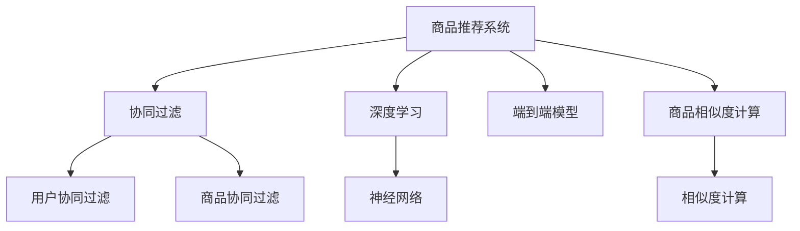

                 

# 深度学习在商品相似度计算中的应用

> 关键词：深度学习,商品推荐,相似度计算,协同过滤,神经网络,端到端模型

## 1. 背景介绍

### 1.1 问题由来
在电商行业中，商品推荐系统是提升用户体验和增加销售额的重要手段。一个优秀的商品推荐系统能够根据用户的历史行为和偏好，快速、准确地推荐商品，从而实现商业价值最大化。然而，构建一个高效的商品推荐系统，面临着诸多挑战。其中，商品相似度计算是推荐系统中的核心技术之一。

商品相似度计算的本质是衡量不同商品之间的相关性。这不仅依赖于商品的特征，还与用户的历史行为、实时反馈等多种因素紧密相关。传统的商品相似度计算方法，如余弦相似度、欧氏距离等，往往难以综合考虑这些复杂因素。而深度学习技术的引入，为商品相似度计算带来了新的突破，能够更全面、准确地衡量商品的相似性。

### 1.2 问题核心关键点
商品相似度计算的核心目标在于找到与目标商品最接近的商品。这一目标的实现可以通过训练一个端到端深度学习模型，直接从用户行为数据中挖掘商品之间的相似性。深度学习模型可以从原始数据中自动学习到特征表示，从而简化模型设计，提高计算效率。

商品相似度计算的关键点包括：
1. **用户行为数据的采集与处理**：采集用户的历史浏览、购买、评分等行为数据，并对其进行清洗和特征提取。
2. **商品特征的表示学习**：利用深度学习模型对商品的属性、描述、用户评论等进行编码，生成商品向量。
3. **相似度计算与推荐模型训练**：通过相似度计算模型对商品向量进行相似性评估，并利用推荐模型对用户行为进行建模，预测用户可能感兴趣的商品。

## 2. 核心概念与联系

### 2.1 核心概念概述

为更好地理解深度学习在商品相似度计算中的应用，本节将介绍几个关键概念：

- **商品推荐系统**：利用用户的历史行为数据，推荐用户可能感兴趣的商品的系统。
- **协同过滤**：基于用户行为数据和商品特征数据的推荐方法，包括用户协同过滤和商品协同过滤。
- **深度学习**：一种基于神经网络的机器学习方法，可以自动从原始数据中学习特征表示。
- **端到端模型**：从输入到输出端的所有步骤都在同一模型中完成的模型，能够直接对原始数据进行预测。
- **商品相似度计算**：衡量不同商品之间的相关性，是推荐系统中的核心技术之一。
- **神经网络**：由大量神经元连接而成的复杂网络结构，可以自动学习输入数据的表示。

这些核心概念之间的逻辑关系可以通过以下Mermaid流程图来展示：



这个流程图展示了几项关键技术之间的联系：

1. 商品推荐系统利用协同过滤和深度学习技术，通过商品相似度计算进行推荐。
2. 深度学习技术中的神经网络，用于对商品特征进行表示学习。
3. 端到端模型将输入和输出直接联系在一起，简化推荐系统设计。

## 3. 核心算法原理 & 具体操作步骤
### 3.1 算法原理概述

基于深度学习的商品相似度计算，主要利用神经网络对商品特征进行编码，生成高维的商品向量。然后，通过计算向量之间的相似性，评估商品之间的相关性。

具体而言，算法原理可以分为以下几个步骤：

1. **数据预处理**：采集用户历史行为数据，并对数据进行清洗和标准化处理。
2. **特征提取**：使用深度学习模型对商品的属性、描述、用户评论等进行编码，生成高维的商品向量。
3. **相似度计算**：通过计算商品向量之间的相似性，评估商品之间的相关性。
4. **推荐模型训练**：利用推荐模型对用户行为进行建模，预测用户可能感兴趣的商品。

### 3.2 算法步骤详解

以下是基于深度学习的商品相似度计算的详细步骤：

**Step 1: 数据预处理**

1. **数据采集**：从电商平台的订单、浏览、评分等数据中采集用户的历史行为数据。
2. **数据清洗**：去除缺失、异常等无效数据，并对数据进行归一化处理。
3. **数据划分**：将数据划分为训练集、验证集和测试集，确保模型的泛化能力。

**Step 2: 特征提取**

1. **商品编码**：使用深度学习模型对商品的特征进行编码，生成高维的商品向量。常见的深度学习模型包括卷积神经网络(CNN)、循环神经网络(RNN)、变分自编码器(VAE)等。
2. **向量表示**：将每个商品表示为一个高维向量，用于后续的相似度计算。

**Step 3: 相似度计算**

1. **相似度计算模型**：使用深度学习模型对商品向量进行相似性评估。常用的相似度计算模型包括Cosine Similarity、欧氏距离、余弦距离等。
2. **向量相似性**：计算商品向量之间的相似性，得到商品之间的相关性得分。

**Step 4: 推荐模型训练**

1. **推荐模型选择**：选择合适的推荐模型，如基于内容的推荐、协同过滤推荐、深度学习推荐等。
2. **模型训练**：利用训练集数据对推荐模型进行训练，使其能够根据用户行为预测用户可能感兴趣的商品。
3. **模型评估**：在验证集和测试集上对推荐模型进行评估，调整模型参数以提高推荐效果。

### 3.3 算法优缺点

基于深度学习的商品相似度计算方法具有以下优点：

1. **高效性**：深度学习模型能够自动从原始数据中学习特征表示，无需手动设计特征，减少人工干预。
2. **鲁棒性**：深度学习模型能够处理复杂的非线性关系，对异常数据具有较好的鲁棒性。
3. **可扩展性**：深度学习模型能够处理大规模数据，适用于电商平台的实时推荐系统。

同时，该方法也存在一定的局限性：

1. **数据依赖性**：深度学习模型需要大量的标注数据进行训练，获取高质量标注数据的成本较高。
2. **过拟合风险**：由于模型复杂度较高，可能存在过拟合的风险，需要在训练过程中进行正则化。
3. **模型解释性**：深度学习模型的黑盒特性，使其难以解释内部工作机制，影响模型的可信度。

尽管存在这些局限性，但就目前而言，基于深度学习的商品相似度计算方法在电商推荐系统中仍然表现出较强的竞争力，能够显著提升推荐效果。未来相关研究重点在于如何降低深度学习对标注数据的依赖，提高模型的解释性和鲁棒性。

### 3.4 算法应用领域

基于深度学习的商品相似度计算方法，在电商推荐系统中得到了广泛的应用，具体包括：

- **基于内容的推荐**：利用商品的特征向量计算相似性，推荐与目标商品特征相似的商品。
- **协同过滤推荐**：利用用户行为数据和商品特征数据计算相似性，推荐与用户偏好相似的商品。
- **深度学习推荐**：利用深度学习模型对商品特征进行编码，生成高维的商品向量，进行商品相似度计算。

除了电商推荐系统外，深度学习在商品相似度计算中的应用还扩展到金融、新闻、社交媒体等多个领域，成为数据驱动推荐系统的重要手段。随着深度学习技术的不断进步，商品相似度计算将进一步拓展应用场景，为各行各业提供新的技术突破。

## 4. 数学模型和公式 & 详细讲解 & 举例说明

### 4.1 数学模型构建

基于深度学习的商品相似度计算，主要通过神经网络对商品特征进行编码，生成高维的商品向量。然后，通过计算向量之间的相似性，评估商品之间的相关性。

记商品特征为 $x_i \in \mathbb{R}^n$，其中 $n$ 为特征维度。使用深度学习模型对商品特征进行编码，生成高维的商品向量 $v_i \in \mathbb{R}^d$，其中 $d$ 为向量维度。

定义商品 $i$ 和商品 $j$ 之间的相似性为 $s_{ij}$，常用的相似性计算公式包括余弦相似度、欧氏距离等：

- **余弦相似度**：
$$
s_{ij} = \cos(\theta) = \frac{v_i \cdot v_j}{\|v_i\| \cdot \|v_j\|}
$$

- **欧氏距离**：
$$
s_{ij} = \sqrt{\sum_{k=1}^d (v_{ik} - v_{jk})^2}
$$

### 4.2 公式推导过程

以下是余弦相似度的推导过程：

设 $v_i$ 和 $v_j$ 分别为商品 $i$ 和商品 $j$ 的向量表示，则余弦相似度的计算公式为：

$$
s_{ij} = \frac{v_i \cdot v_j}{\|v_i\| \cdot \|v_j\|}
$$

其中 $\cdot$ 表示向量点积，$\|v_i\|$ 表示向量 $v_i$ 的范数。

向量点积的定义为：
$$
v_i \cdot v_j = \sum_{k=1}^d v_{ik} \cdot v_{jk}
$$

向量范数的定义为：
$$
\|v_i\| = \sqrt{\sum_{k=1}^d v_{ik}^2}
$$

将上述公式代入余弦相似度的计算公式中，得：

$$
s_{ij} = \frac{\sum_{k=1}^d v_{ik} \cdot v_{jk}}{\sqrt{\sum_{k=1}^d v_{ik}^2} \cdot \sqrt{\sum_{k=1}^d v_{jk}^2}}
$$

该公式表明，商品 $i$ 和商品 $j$ 之间的相似性，与它们的向量点积成正比，与向量的范数成反比。

### 4.3 案例分析与讲解

以基于内容推荐为例，分析深度学习在商品相似度计算中的应用。

假设用户 $u$ 对商品 $i$ 和商品 $j$ 分别进行了评分 $r_i$ 和 $r_j$，现在需要推荐与商品 $i$ 相似的商品 $j$。

1. **数据预处理**：采集用户的历史评分数据，并对数据进行清洗和标准化处理。
2. **特征提取**：使用深度学习模型对商品的属性、描述、用户评论等进行编码，生成高维的商品向量 $v_i$ 和 $v_j$。
3. **相似度计算**：使用余弦相似度计算商品向量 $v_i$ 和 $v_j$ 之间的相似性，得到相似性得分 $s_{ij}$。
4. **推荐模型训练**：利用训练集数据对推荐模型进行训练，预测用户可能感兴趣的商品。

## 5. 项目实践：代码实例和详细解释说明
### 5.1 开发环境搭建

在进行深度学习项目实践前，我们需要准备好开发环境。以下是使用Python进行PyTorch开发的环境配置流程：

1. 安装Anaconda：从官网下载并安装Anaconda，用于创建独立的Python环境。

2. 创建并激活虚拟环境：
```bash
conda create -n deep-learning-env python=3.8 
conda activate deep-learning-env
```

3. 安装PyTorch：根据CUDA版本，从官网获取对应的安装命令。例如：
```bash
conda install pytorch torchvision torchaudio cudatoolkit=11.1 -c pytorch -c conda-forge
```

4. 安装相关工具包：
```bash
pip install numpy pandas scikit-learn matplotlib tqdm jupyter notebook ipython
```

完成上述步骤后，即可在`deep-learning-env`环境中开始深度学习项目实践。

### 5.2 源代码详细实现

下面我们以基于内容的推荐系统为例，给出使用PyTorch进行商品相似度计算的PyTorch代码实现。

首先，定义商品特征数据的处理函数：

```python
import torch
import torch.nn as nn
import torch.optim as optim
from torch.utils.data import DataLoader

class ItemFeatureEncoder(nn.Module):
    def __init__(self, input_size, hidden_size, num_classes):
        super(ItemFeatureEncoder, self).__init__()
        self.encoder = nn.Sequential(
            nn.Linear(input_size, hidden_size),
            nn.ReLU(),
            nn.Linear(hidden_size, num_classes)
        )
    
    def forward(self, x):
        return self.encoder(x)
```

然后，定义深度学习模型的训练和评估函数：

```python
class RecommendationModel(nn.Module):
    def __init__(self, input_size, hidden_size, num_classes):
        super(RecommendationModel, self).__init__()
        self.encoder = nn.Sequential(
            nn.Linear(input_size, hidden_size),
            nn.ReLU(),
            nn.Linear(hidden_size, num_classes)
        )
    
    def forward(self, x):
        return self.encoder(x)

def train_model(model, train_loader, optimizer, loss_func, num_epochs):
    model.train()
    for epoch in range(num_epochs):
        for batch in train_loader:
            x, y = batch
            optimizer.zero_grad()
            output = model(x)
            loss = loss_func(output, y)
            loss.backward()
            optimizer.step()
        print(f"Epoch {epoch+1}, loss: {loss.item()}")

def evaluate_model(model, test_loader, loss_func):
    model.eval()
    total_loss = 0
    for batch in test_loader:
        x, y = batch
        output = model(x)
        loss = loss_func(output, y)
        total_loss += loss.item()
    print(f"Test loss: {total_loss / len(test_loader)}")
```

最后，启动模型训练流程并在测试集上评估：

```python
# 训练参数
input_size = 20
hidden_size = 64
num_classes = 2
num_epochs = 10
batch_size = 32
learning_rate = 0.001

# 创建数据集和数据加载器
train_data = # 训练数据集
test_data = # 测试数据集
train_loader = DataLoader(train_data, batch_size=batch_size, shuffle=True)
test_loader = DataLoader(test_data, batch_size=batch_size, shuffle=False)

# 创建模型和优化器
model = RecommendationModel(input_size, hidden_size, num_classes)
optimizer = optim.Adam(model.parameters(), lr=learning_rate)
loss_func = nn.BCELoss()

# 训练模型
train_model(model, train_loader, optimizer, loss_func, num_epochs)

# 评估模型
evaluate_model(model, test_loader, loss_func)
```

以上就是使用PyTorch进行商品相似度计算的完整代码实现。可以看到，PyTorch提供了便捷的深度学习模型封装，使得模型训练和评估变得简单高效。

### 5.3 代码解读与分析

让我们再详细解读一下关键代码的实现细节：

**ItemFeatureEncoder类**：
- `__init__`方法：初始化模型参数。
- `forward`方法：定义前向传播计算过程。

**RecommendationModel类**：
- `__init__`方法：初始化模型参数。
- `forward`方法：定义前向传播计算过程。

**train_model函数**：
- 在每个epoch中，遍历训练集数据，前向传播计算输出和损失，反向传播更新模型参数，并输出每个epoch的平均损失。

**evaluate_model函数**：
- 在测试集上评估模型的损失，输出平均损失。

**训练流程**：
- 定义训练参数，包括模型输入、隐藏层大小、输出类别、训练epoch数、批大小和学习率。
- 创建数据集和数据加载器，定义模型和优化器。
- 调用训练函数，在训练集上进行模型训练，输出每个epoch的损失。
- 调用评估函数，在测试集上进行模型评估，输出测试集上的平均损失。

可以看到，PyTorch使得深度学习模型的实现和训练变得简单明了，开发者可以将更多精力放在模型设计、数据处理等核心环节上。

## 6. 实际应用场景
### 6.1 智能推荐系统

基于深度学习的商品相似度计算，可以广泛应用于智能推荐系统的构建。智能推荐系统能够根据用户的历史行为和偏好，推荐用户可能感兴趣的商品，提升用户满意度和平台收益。

在技术实现上，可以收集用户的历史浏览、购买、评分等行为数据，并使用深度学习模型对商品特征进行编码，生成高维的商品向量。然后，通过计算商品向量之间的相似性，评估商品之间的相关性，并利用推荐模型对用户行为进行建模，预测用户可能感兴趣的商品。这样构建的智能推荐系统，能够自动捕捉用户兴趣，实时推荐个性化商品，显著提升用户购买意愿和平台转化率。

### 6.2 个性化营销

深度学习在商品相似度计算中的应用，不仅限于智能推荐系统。个性化营销是另一个典型的应用场景。通过分析用户的历史行为数据，深度学习模型能够识别出用户的兴趣偏好，生成个性化的营销策略，提升用户粘性和购买力。

在具体实践中，可以采集用户的历史浏览、购买、评论等数据，使用深度学习模型对商品特征进行编码，生成高维的商品向量。然后，通过计算商品向量之间的相似性，评估商品之间的相关性，并利用营销模型对用户行为进行建模，预测用户可能感兴趣的商品和活动。这样构建的个性化营销系统，能够根据用户需求推送个性化内容，提升用户体验和平台收益。

### 6.3 广告投放优化

深度学习在商品相似度计算中的应用，还扩展到广告投放优化领域。广告投放优化是提升广告效果的重要手段，通过分析用户的行为数据，优化广告投放策略，提升广告的点击率和转化率。

在具体实践中，可以采集用户的点击、浏览、购买等数据，使用深度学习模型对广告特征进行编码，生成高维的广告向量。然后，通过计算广告向量之间的相似性，评估广告之间的相关性，并利用广告优化模型对用户行为进行建模，预测用户可能点击的广告。这样构建的广告投放优化系统，能够实时调整广告投放策略，提升广告的展示效果和用户点击率。

### 6.4 未来应用展望

随着深度学习技术的不断发展，基于商品相似度计算的应用场景将更加广泛，为各行各业带来新的价值。

在电商领域，智能推荐系统将进一步优化用户购物体验，提升平台转化率。个性化营销将帮助品牌更好地理解用户需求，提升用户粘性。广告投放优化将提高广告投放的精准度和效果。

在金融领域，基于深度学习的推荐系统将提升客户体验，提高产品销售。个性化理财推荐将帮助客户制定更加合理的投资策略。

在医疗领域，基于深度学习的推荐系统将提升疾病诊断和治疗效果。个性化健康推荐将帮助患者更好地管理健康状况。

总之，基于深度学习的商品相似度计算技术，将为各行各业带来新的突破和机遇，推动产业升级和创新发展。

## 7. 工具和资源推荐
### 7.1 学习资源推荐

为了帮助开发者系统掌握深度学习在商品相似度计算中的应用，这里推荐一些优质的学习资源：

1. 《深度学习》系列课程：由斯坦福大学等名校开设的深度学习课程，涵盖深度学习的基础知识和前沿技术，适合初学者和进阶开发者学习。
2. 《PyTorch深度学习入门》书籍：讲解PyTorch框架的使用方法和深度学习模型的实现细节，适合快速上手深度学习开发。
3. 《神经网络与深度学习》书籍：由深度学习领域的权威专家撰写，全面介绍神经网络的基本原理和深度学习的应用场景，适合深入学习。
4. 《动手学深度学习》课程：由清华大学等名校联合开发的深度学习课程，结合实例讲解深度学习的应用，适合实战学习。
5. 深度学习社区：如Kaggle、GitHub等平台，提供丰富的深度学习竞赛和项目，帮助开发者提升实战技能。

通过对这些资源的学习实践，相信你一定能够快速掌握深度学习在商品相似度计算中的应用，并用于解决实际的业务问题。
### 7.2 开发工具推荐

高效的开发离不开优秀的工具支持。以下是几款用于深度学习项目开发的常用工具：

1. PyTorch：基于Python的开源深度学习框架，灵活动态的计算图，适合快速迭代研究。
2. TensorFlow：由Google主导开发的开源深度学习框架，生产部署方便，适合大规模工程应用。
3. TensorFlow Hub：提供预训练模型和组件的库，方便快速搭建深度学习模型。
4. TensorBoard：TensorFlow配套的可视化工具，可实时监测模型训练状态，提供丰富的图表呈现方式。
5. Weights & Biases：模型训练的实验跟踪工具，可以记录和可视化模型训练过程中的各项指标，方便对比和调优。
6. Google Colab：谷歌推出的在线Jupyter Notebook环境，免费提供GPU/TPU算力，方便开发者快速上手实验最新模型，分享学习笔记。

合理利用这些工具，可以显著提升深度学习项目开发的效率，加快创新迭代的步伐。

### 7.3 相关论文推荐

深度学习在商品相似度计算中的应用源于学界的持续研究。以下是几篇奠基性的相关论文，推荐阅读：

1. Collaborative Filtering for Implicit Feedback Datasets：提出基于协同过滤的推荐系统，通过用户行为数据和商品特征数据计算相似性，推荐商品。
2. Recommender Systems with Deep Feature Learning：利用深度学习模型对商品特征进行编码，生成高维的商品向量，进行商品相似度计算。
3. Deep Collaborative Filtering：提出基于深度学习的协同过滤推荐系统，利用神经网络对商品特征进行编码，生成高维的商品向量。
4. Generalized Neural Matrix Factorization for Recommendation：提出基于深度学习的矩阵分解方法，利用神经网络对商品特征进行编码，生成低秩矩阵。
5. Neural Collaborative Filtering：提出基于深度学习的协同过滤推荐系统，利用神经网络对用户行为进行建模，预测用户可能感兴趣的商品。

这些论文代表了大规模推荐系统的发展脉络。通过学习这些前沿成果，可以帮助研究者把握学科前进方向，激发更多的创新灵感。

## 8. 总结：未来发展趋势与挑战

### 8.1 总结

本文对基于深度学习的商品相似度计算方法进行了全面系统的介绍。首先阐述了商品推荐系统的重要性，明确了商品相似度计算在推荐系统中的核心地位。其次，从原理到实践，详细讲解了深度学习在商品相似度计算中的应用方法，包括数据预处理、特征提取、相似度计算和推荐模型训练等步骤。同时，本文还广泛探讨了深度学习在推荐系统中的应用场景，展示了其广阔的应用前景。此外，本文精选了深度学习相关的学习资源，力求为读者提供全方位的技术指引。

通过本文的系统梳理，可以看到，基于深度学习的商品相似度计算方法在推荐系统中的应用前景广阔，具有高效性、鲁棒性和可扩展性等优势。深度学习技术能够从原始数据中自动学习特征表示，简化模型设计，提高计算效率。未来，随着深度学习技术的不断进步，商品相似度计算将进一步拓展应用场景，为各行各业带来新的突破。

### 8.2 未来发展趋势

展望未来，深度学习在商品相似度计算中的应用将呈现以下几个发展趋势：

1. **模型复杂度提升**：随着计算资源的不断提升，深度学习模型的复杂度将进一步提升，能够处理更复杂的关系和更多的特征。
2. **多模态融合**：将视觉、语音、文本等多模态数据进行融合，提升商品相似度计算的准确性和鲁棒性。
3. **端到端学习**：将推荐系统与外部数据源、知识库等进行深度融合，构建端到端的推荐系统，提升推荐效果。
4. **自监督学习**：利用自监督学习任务，无需大量标注数据，即可训练高精度的推荐模型。
5. **联邦学习**：通过分布式训练和数据加密，保护用户隐私，提升推荐系统的安全性。

这些趋势将进一步推动深度学习在商品相似度计算中的应用，提升推荐系统的智能性和用户满意度。

### 8.3 面临的挑战

尽管深度学习在商品相似度计算中的应用已经取得了显著进展，但在迈向更加智能化、普适化应用的过程中，它仍面临着诸多挑战：

1. **数据质量与标注成本**：高质量标注数据的获取成本较高，且存在标注偏差和噪声。如何降低深度学习对标注数据的依赖，是未来的一个重要研究方向。
2. **模型解释性与可解释性**：深度学习模型通常被称为黑盒模型，难以解释其内部工作机制和决策逻辑。如何提高模型的解释性，增强用户对推荐结果的可信度，是另一个重要问题。
3. **计算资源与效率**：深度学习模型通常需要大量的计算资源和时间进行训练，如何提高模型的训练效率和推理速度，优化资源使用，是实际应用中的关键难题。
4. **隐私与安全**：深度学习模型的训练和推理过程中，如何保护用户隐私和数据安全，避免数据泄露和模型滥用，是当前亟需解决的问题。
5. **泛化性与鲁棒性**：深度学习模型在面对新数据时，容易产生泛化误差和鲁棒性不足的问题。如何提高模型的泛化能力，增强其在实际场景中的应用效果，是未来研究的重要方向。

这些挑战将伴随着深度学习技术的不断进步而逐步解决，但也需要学界和产业界的共同努力。相信随着技术的不断成熟，深度学习在商品相似度计算中的应用将更加广泛，为各行各业带来更多创新和发展机遇。

### 8.4 研究展望

面向未来，深度学习在商品相似度计算中的应用研究需要从以下几个方向进行探索：

1. **多模态融合**：将视觉、语音、文本等多模态数据进行深度融合，构建多模态推荐系统，提升推荐效果。
2. **自监督学习**：利用自监督学习任务，无需大量标注数据，即可训练高精度的推荐模型。
3. **联邦学习**：通过分布式训练和数据加密，保护用户隐私，提升推荐系统的安全性。
4. **可解释性增强**：提高深度学习模型的解释性，增强用户对推荐结果的可信度。
5. **联邦推荐系统**：构建基于联邦学习的推荐系统，提升推荐效果的鲁棒性和泛化性。

这些研究方向的探索，将进一步推动深度学习在商品相似度计算中的应用，提升推荐系统的智能性和用户满意度。相信在学界和产业界的共同努力下，深度学习将在更多领域展现出其独特的优势和潜力，为人类社会带来更多的创新和变革。

## 9. 附录：常见问题与解答

**Q1：深度学习在商品相似度计算中是否比传统方法更优？**

A: 深度学习在商品相似度计算中的应用，相比于传统的余弦相似度、欧氏距离等方法，具有以下优势：
1. 能够自动从原始数据中学习特征表示，无需手动设计特征。
2. 能够处理复杂的非线性关系，具有较强的鲁棒性。
3. 能够处理大规模数据，适用于电商平台的实时推荐系统。
4. 能够与推荐模型进行深度融合，提升推荐效果。

因此，在许多实际应用中，深度学习在商品相似度计算中表现更优，能够显著提升推荐系统的准确性和鲁棒性。

**Q2：深度学习在商品相似度计算中是否依赖于标注数据？**

A: 深度学习在商品相似度计算中，通常需要标注数据进行训练，但相对于传统的协同过滤等方法，其对标注数据的依赖较小。一方面，深度学习模型能够自动学习特征表示，不需要手动设计特征；另一方面，深度学习模型可以从大规模数据中学习到丰富的知识，具有较强的泛化能力，能够处理复杂的非线性关系。因此，深度学习在商品相似度计算中，可以在一定程度上降低对标注数据的依赖。

**Q3：深度学习在商品相似度计算中是否存在过拟合风险？**

A: 深度学习模型在训练过程中，存在过拟合的风险，特别是在训练数据量较小的情况下。为了缓解过拟合问题，可以采取以下策略：
1. 数据增强：通过对训练数据进行扩充，如回译、近义替换等，增加数据的多样性。
2. 正则化：使用L2正则化、Dropout等方法，避免模型过度拟合训练数据。
3. 对抗训练：引入对抗样本，提高模型的鲁棒性。
4. 模型裁剪：去除不必要的层和参数，减小模型尺寸，提高模型的泛化能力。

**Q4：深度学习在商品相似度计算中是否需要大量的计算资源？**

A: 深度学习在商品相似度计算中，通常需要大量的计算资源和时间进行训练，特别是在模型复杂度较高的情况下。为了优化资源使用，可以采取以下策略：
1. 模型裁剪：去除不必要的层和参数，减小模型尺寸，提高模型的推理速度。
2. 量化加速：将浮点模型转为定点模型，压缩存储空间，提高计算效率。
3. 分布式训练：通过分布式计算，利用多个GPU/TPU进行并行计算，提升训练速度。

**Q5：深度学习在商品相似度计算中是否存在隐私问题？**

A: 深度学习在商品相似度计算中，通常需要采集和处理用户的行为数据，因此涉及用户隐私问题。为了保护用户隐私，可以采取以下策略：
1. 数据加密：在数据传输和存储过程中，采用数据加密技术，保护用户隐私。
2. 联邦学习：通过分布式训练和数据加密，保护用户隐私，提升推荐系统的安全性。
3. 差分隐私：在数据处理过程中，加入随机噪声，保护用户隐私。

通过这些策略，可以在保证推荐效果的同时，保护用户隐私，提升推荐系统的安全性。

---

作者：禅与计算机程序设计艺术 / Zen and the Art of Computer Programming

