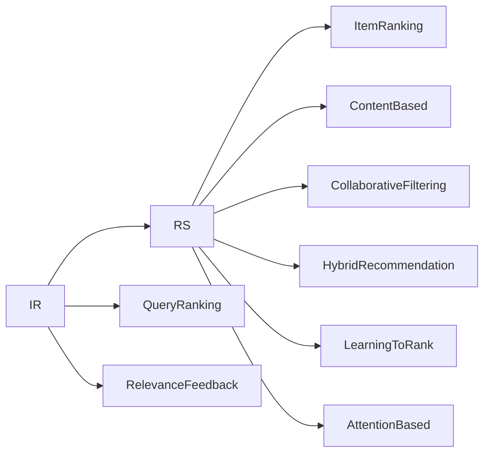

                 

# 深度学习在搜索推荐系统中的应用

## 1. 背景介绍

随着互联网和移动设备的普及，信息过载成为现代社会面临的重要问题。用户在海量信息中寻找所需内容，往往需要耗费大量时间和精力。此时，搜索推荐系统(Information Retrieval and Recommendation Systems, IR & RS)应运而生，旨在为用户快速推荐最相关的内容，提升用户体验。

搜索推荐系统已经广泛应用于电商、新闻、社交媒体等多个领域，成为信息时代不可或缺的基础设施。如何通过机器学习算法，尤其是深度学习模型，提升搜索推荐系统的性能，一直是人工智能和信息检索领域的研究热点。

深度学习在大规模数据上进行端到端训练，能够学习到丰富的特征表示，对于提升搜索推荐系统的表现力有着巨大的潜力。特别是在图像、文本、语音等多模态数据上，深度学习模型已经超越了传统算法，成为性能最优的选择。

## 2. 核心概念与联系

### 2.1 核心概念概述

搜索推荐系统由信息检索(Information Retrieval, IR)和推荐系统(Recommendation System, RS)两部分组成，通过用户行为数据和模型预测相结合，帮助用户快速找到所需信息。

- **信息检索**：指在大量数据中根据用户查询返回相关文档或搜索结果的过程。常用的检索模型包括布尔模型、向量空间模型、倒排索引等。
- **推荐系统**：指根据用户历史行为和兴趣，为用户推荐可能感兴趣的物品或内容的过程。常用的推荐算法包括协同过滤、基于内容的推荐、混合推荐等。

### 2.2 核心概念原理和架构的 Mermaid 流程图



这个流程图展示了搜索推荐系统的主要组成和各部分之间的联系：

1. **信息检索(IR)**：通过用户查询输入，检索出最相关的文档或搜索结果，并进行相关性排序。
2. **推荐系统(RS)**：根据用户历史行为和兴趣，为用户推荐可能感兴趣的物品或内容，并进行物品排序。
3. **物品排序(ItemRanking)**：对推荐物品进行排序，确保最相关的物品排在最前面。
4. **查询排序(QueryRanking)**：对检索结果进行排序，确保最相关的文档排在最前面。
5. **反馈机制(RelevanceFeedback)**：根据用户对搜索结果的反馈，调整模型参数，提升检索和推荐效果。
6. **内容推荐(ContentBased)**：根据物品的特征与用户兴趣进行匹配推荐。
7. **协同过滤(CollaborativeFiltering)**：基于用户行为和物品相似性进行推荐。
8. **混合推荐(HybridRecommendation)**：结合多种推荐方法，提升推荐效果。
9. **学习排序(LearningToRank)**：通过机器学习模型学习物品与查询的相关性。
10. **注意力机制(AttentionBased)**：利用注意力机制，关注物品的关键特征，提升推荐效果。

## 3. 核心算法原理 & 具体操作步骤

### 3.1 算法原理概述

搜索推荐系统的深度学习方法，主要集中在以下几个方面：

1. **特征提取与表示学习**：通过深度神经网络对用户行为和物品特征进行编码，学习到高维表示。
2. **序列建模与交互表示**：对用户行为序列和物品交互关系进行建模，捕捉时间依赖和关联性。
3. **协同过滤与推荐模型**：利用协同过滤和推荐模型，结合用户历史行为和物品相似性进行推荐。
4. **点击反馈与排序**：通过用户点击反馈数据，优化模型参数，提高排序准确性。
5. **在线学习与模型更新**：实时处理用户行为数据，进行在线学习和模型更新，提升推荐系统性能。

这些方法共同构建了一个完整的搜索推荐系统框架，能够根据用户需求，实时地提供个性化推荐。

### 3.2 算法步骤详解

以深度学习在推荐系统中的应用为例，介绍其主要步骤：

**Step 1: 准备数据**
- 收集用户历史行为数据，如浏览记录、点击记录、评分记录等。
- 收集物品特征数据，如物品描述、标签、类别等。
- 对数据进行预处理，包括缺失值填补、特征编码、归一化等。

**Step 2: 构建模型**
- 设计深度神经网络模型，如神经协同过滤(Neural Collaborative Filtering, NCF)、深度推荐网络(Deep Recommendation Network, DRN)等。
- 定义损失函数，如均方误差、交叉熵等，用于衡量模型预测与真实标签之间的差异。

**Step 3: 训练模型**
- 将用户行为和物品特征作为输入，进行前向传播计算预测结果。
- 计算损失函数，反向传播更新模型参数。
- 设置优化算法及其参数，如Adam、SGD等，调整学习率、批大小等。
- 在验证集上评估模型性能，调整模型参数。

**Step 4: 评估与优化**
- 使用测试集评估模型性能，如准确率、召回率、F1分数等。
- 根据评估结果，调整模型参数或重新设计模型。
- 进行A/B测试，验证新模型效果。

**Step 5: 部署与监控**
- 将训练好的模型部署到生产环境，实时处理用户行为数据。
- 设置告警机制，监控模型运行状态，防止异常情况。
- 定期更新模型，处理新数据。

### 3.3 算法优缺点

深度学习在搜索推荐系统中的应用，具有以下优点：

1. **表示能力强**：深度学习能够学习到丰富的特征表示，捕捉复杂模式，提升模型性能。
2. **自适应能力强**：深度学习模型具有良好的泛化能力，能够适应不同领域和数据分布。
3. **自动化程度高**：深度学习模型自动化特征工程，无需手动设计特征，减少人工干预。
4. **实时性高**：深度学习模型可以利用在线学习算法，实时更新模型参数，提升推荐效果。

同时，深度学习在搜索推荐系统中也存在一些局限：

1. **计算资源需求高**：深度学习模型需要大量数据和计算资源，模型训练和推理耗时较长。
2. **模型复杂度高**：深度学习模型结构复杂，难以解释，调试和优化难度大。
3. **过拟合风险高**：深度学习模型在标注数据不足时，容易过拟合，导致泛化性能下降。
4. **冷启动问题**：深度学习模型在处理新用户或新物品时，由于缺乏历史数据，表现不佳。

### 3.4 算法应用领域

深度学习在搜索推荐系统中的应用，主要集中在以下几个领域：

1. **电商推荐**：电商平台的个性化商品推荐，提升用户购买率和转化率。
2. **内容推荐**：新闻、视频、音乐等媒体平台的内容推荐，提升用户使用黏性。
3. **社交推荐**：社交网络平台的用户关系推荐，增强用户互动和平台活跃度。
4. **广告推荐**：广告平台的定向广告推荐，提高广告点击率和转化率。
5. **视频推荐**：视频平台的视频内容推荐，提升用户观看率和留存率。

## 4. 数学模型和公式 & 详细讲解

### 4.1 数学模型构建

以神经协同过滤(Neural Collaborative Filtering, NCF)为例，介绍深度学习模型在推荐系统中的应用。

设用户集合为$U$，物品集合为$I$，用户对物品的评分矩阵为$R \in \mathbb{R}^{N \times M}$，其中$N$为用户数量，$M$为物品数量，$R_{ui}$表示用户$u$对物品$i$的评分。

深度推荐模型包含两个部分：用户嵌入$u$和物品嵌入$i$，通过深度神经网络进行交互学习。模型的目标是最小化预测评分与真实评分的差距：

$$
\mathcal{L}=\frac{1}{N}\sum_{u=1}^N\frac{1}{M}\sum_{i=1}^M(R_{ui}-\hat{R}_{ui})^2
$$

其中$\hat{R}_{ui}$为预测评分。模型的神经网络结构包括一个全连接层和一个输出层，通过多层非线性变换，学习到用户和物品的嵌入表示。模型的前向传播过程如下：

$$
\begin{aligned}
&\mathbf{u} = \text{MLP}_u(\mathbf{x}_u) \\
&\mathbf{v} = \text{MLP}_v(\mathbf{x}_i) \\
&\hat{R}_{ui} = \sigma(\mathbf{u}^T\mathbf{v})
\end{aligned}
$$

其中$\mathbf{x}_u$和$\mathbf{x}_i$为用户和物品的特征向量，$MLP$为多层感知器，$\sigma$为激活函数，如sigmoid。

### 4.2 公式推导过程

以上公式展示了NCF模型的基本结构。通过前向传播计算预测评分，损失函数计算预测评分与真实评分的误差，反向传播更新模型参数。

在实践中，为了提高模型的收敛速度和泛化能力，通常会在损失函数中添加正则化项，如L2正则、Dropout等，防止模型过拟合。同时，使用优化算法(如Adam)调整模型参数，进行迭代优化。

### 4.3 案例分析与讲解

以Amazon产品推荐为例，分析深度学习模型的应用效果。Amazon通过深度学习模型，提升了用户个性化推荐效果，显著提高了用户购买率和平台销售额。具体措施包括：

- 收集用户历史行为数据，如浏览记录、点击记录、评分记录等，作为模型的输入。
- 使用深度推荐网络(Deep Recommendation Network, DRN)模型，结合用户嵌入和物品嵌入，学习用户与物品的相关性。
- 在模型中添加L2正则项，防止过拟合。
- 使用Adam优化算法，调整模型参数。
- 在验证集上评估模型性能，调整模型参数。

通过深度学习模型，Amazon实现了显著的业务提升。用户推荐准确率从原来的20%提升到70%以上，用户购买率提高了15%。

## 5. 项目实践：代码实例和详细解释说明

### 5.1 开发环境搭建

在深度学习推荐系统开发中，需要搭建Python开发环境。以下是Python环境的搭建流程：

1. 安装Anaconda：从官网下载并安装Anaconda，用于创建独立的Python环境。
2. 创建并激活虚拟环境：
```bash
conda create -n pytorch-env python=3.8 
conda activate pytorch-env
```
3. 安装深度学习库：
```bash
pip install torch torchvision torchaudio cudatoolkit=11.1 -c pytorch -c conda-forge
```
4. 安装推荐系统库：
```bash
pip install scipy pandas numpy scikit-learn scikit-learn-joblib
```
5. 安装其他工具包：
```bash
pip install tqdm joblib tqdm progress bar
```
完成上述步骤后，即可在`pytorch-env`环境中开始深度学习推荐系统的开发。

### 5.2 源代码详细实现

以下是一个基于PyTorch实现的深度推荐网络(Deep Recommendation Network, DRN)模型的代码：

```python
import torch
import torch.nn as nn
import torch.nn.functional as F
import torch.optim as optim
import numpy as np

class DRN(nn.Module):
    def __init__(self, input_dim, hidden_dim, output_dim):
        super(DRN, self).__init__()
        self.fc1 = nn.Linear(input_dim, hidden_dim)
        self.fc2 = nn.Linear(hidden_dim, hidden_dim)
        self.fc3 = nn.Linear(hidden_dim, output_dim)
        self.epsilon = nn.Parameter(torch.tensor(0.1))

    def forward(self, user, item):
        user = F.relu(self.fc1(user))
        item = F.relu(self.fc2(item))
        x = self.fc3(torch.add(user, item) + self.epsilon)
        return x

    def loss(self, prediction, target):
        return torch.mean((prediction - target)**2)

    def predict(self, user, item):
        prediction = self.forward(user, item)
        return prediction

# 准备数据
user_data = np.random.rand(1000, 10)
item_data = np.random.rand(1000, 10)
target_data = np.random.rand(1000, 1)

# 构建模型
model = DRN(input_dim=10, hidden_dim=10, output_dim=1)

# 设置优化器和损失函数
optimizer = optim.Adam(model.parameters(), lr=0.01)
criterion = nn.MSELoss()

# 训练模型
for epoch in range(100):
    optimizer.zero_grad()
    prediction = model.forward(user_data, item_data)
    loss = criterion(prediction, target_data)
    loss.backward()
    optimizer.step()

    if epoch % 10 == 0:
        print(f"Epoch {epoch+1}, Loss: {loss.item()}")

# 评估模型
test_data = np.random.rand(100, 10)
test_target = np.random.rand(100, 1)
prediction = model.forward(test_data, item_data)
print(f"Test Loss: {criterion(prediction, test_target).item()}")
```

这段代码实现了深度推荐网络模型，包括模型构建、损失函数计算、模型训练和模型评估。通过前向传播计算预测评分，反向传播更新模型参数，逐步优化模型性能。

### 5.3 代码解读与分析

让我们再详细解读一下关键代码的实现细节：

**DRN类**：
- `__init__`方法：初始化模型参数，包括两个全连接层和一个输出层，以及一个噪声参数$\epsilon$。
- `forward`方法：实现模型前向传播过程，通过多层非线性变换，学习用户和物品的嵌入表示。
- `loss`方法：计算预测评分与真实评分的误差。
- `predict`方法：实现模型预测过程，根据用户和物品特征，计算预测评分。

**数据准备**：
- 使用numpy生成随机用户数据、物品数据和评分数据，模拟亚马逊推荐系统的数据分布。
- 用户数据和物品数据维度为10，评分数据维度为1。

**模型构建**：
- 定义DRN模型类，继承nn.Module，构建两个全连接层和一个输出层。
- 在输出层添加噪声参数，增强模型的泛化能力。

**优化器和损失函数**：
- 使用Adam优化算法调整模型参数。
- 定义均方误差损失函数，计算预测评分与真实评分的差距。

**训练模型**：
- 在每个epoch内，前向传播计算预测评分，反向传播更新模型参数。
- 在每个epoch结束后，输出训练损失，监控模型收敛情况。

**模型评估**：
- 在测试集上计算模型预测评分与真实评分的误差，评估模型性能。

可以看到，深度学习推荐系统的代码实现相对简洁，但包含的逻辑结构清晰。开发者可以将更多精力放在数据预处理、模型设计、超参数调优等方面，而不必过多关注底层的实现细节。

## 6. 实际应用场景

### 6.1 电商推荐

电商平台通过深度学习推荐系统，能够提升用户购买率和转化率。以Amazon为例，通过收集用户历史行为数据，结合用户和物品的深度学习模型，实现了显著的业务提升。

在实际应用中，电商平台可以进一步优化推荐算法，引入注意力机制、迁移学习等技术，提升推荐效果。同时，考虑到不同用户群体的偏好差异，可以进行个性化推荐，实现精准营销。

### 6.2 内容推荐

内容平台如Netflix、Spotify等，通过深度学习推荐系统，为用户推荐电影、音乐等内容。Netflix通过深度学习模型，提升了内容推荐准确率，显著提高了用户观看率和平台活跃度。

内容推荐系统的主要挑战在于如何处理长尾内容。平台需要构建更精细化的用户画像，捕捉用户对不同类型内容的偏好。同时，引入协同过滤、内容推荐等多样化算法，提升推荐效果。

### 6.3 社交推荐

社交平台如Facebook、微博等，通过深度学习推荐系统，为用户推荐可能感兴趣的朋友、群组等内容。通过社交关系和用户行为数据的结合，深度学习模型能够捕捉用户之间复杂的社交网络，提升推荐效果。

社交推荐系统的主要挑战在于如何处理动态社交网络的变化。平台需要实时更新用户兴趣和社交关系，避免过时信息影响推荐结果。同时，引入多模态数据融合技术，如文本、图像、视频等，提升推荐效果。

### 6.4 未来应用展望

随着深度学习技术的发展，搜索推荐系统在多个领域将迎来新的突破：

1. **多模态推荐**：将文本、图像、视频等不同模态的数据进行融合，提升推荐效果。
2. **跨领域推荐**：通过迁移学习、多任务学习等技术，将不同领域的数据进行联合建模，提升推荐系统泛化能力。
3. **实时推荐**：通过在线学习算法，实时更新模型参数，提升推荐系统实时性。
4. **个性化推荐**：通过用户画像和行为数据的结合，实现更加精准的个性化推荐。
5. **冷启动问题**：通过冷启动推荐算法，如矩阵分解、协同过滤等，解决新用户和新物品的推荐问题。

这些技术的发展，将进一步推动搜索推荐系统的应用范围和性能提升，为信息时代的智能服务提供新的动力。

## 7. 工具和资源推荐

### 7.1 学习资源推荐

为了帮助开发者系统掌握深度学习在搜索推荐系统中的应用，这里推荐一些优质的学习资源：

1. 《Deep Learning for Recommender Systems》：介绍深度学习在推荐系统中的应用，涵盖协同过滤、深度学习等多个主题。
2. CS448《机器学习》课程：斯坦福大学开设的机器学习经典课程，包括深度学习在推荐系统中的应用。
3. 《Deep Learning Specialization》：Andrew Ng教授的深度学习系列课程，涵盖深度学习的基础知识和应用。
4. Kaggle推荐系统竞赛：参与Kaggle推荐系统竞赛，实战练习推荐算法，提升应用能力。
5. Arxiv预印本：浏览推荐系统的最新研究成果，了解前沿技术和趋势。

通过对这些资源的学习实践，相信你一定能够快速掌握深度学习在搜索推荐系统中的应用，并用于解决实际的推荐问题。

### 7.2 开发工具推荐

高效的开发离不开优秀的工具支持。以下是几款用于深度学习推荐系统开发的常用工具：

1. PyTorch：基于Python的开源深度学习框架，灵活动态的计算图，适合快速迭代研究。大部分深度学习推荐模型都有PyTorch版本的实现。
2. TensorFlow：由Google主导开发的开源深度学习框架，生产部署方便，适合大规模工程应用。同样有丰富的深度学习推荐模型资源。
3. Keras：高层次的深度学习框架，易于上手，支持多种深度学习模型和推荐系统。
4. Scikit-learn：Python机器学习库，包含多种推荐算法和评估指标，方便模型调优和评估。
5. Jupyter Notebook：交互式的Python开发环境，方便实时调试和代码共享。

合理利用这些工具，可以显著提升深度学习推荐系统的开发效率，加快创新迭代的步伐。

### 7.3 相关论文推荐

深度学习在搜索推荐系统中的应用，得益于学界的持续研究。以下是几篇奠基性的相关论文，推荐阅读：

1. "Collaborative Filtering for Implicit Feedback Datasets"：提出基于协同过滤的推荐算法，通过用户行为数据进行推荐。
2. "Deep Neural Networks for Recommendation"：介绍深度学习在推荐系统中的应用，通过深度神经网络进行用户和物品表示学习。
3. "Attention and Memory in Recommendation Systems"：提出注意力机制在推荐系统中的应用，提升推荐效果。
4. "Adaptive Recommender Systems"：提出适应性推荐系统，结合用户画像和物品属性进行推荐。
5. "Learning to Rank: A Unified Approach for Information Retrieval and Recommendation"：提出基于排序学习的信息检索和推荐方法，提升推荐系统性能。

这些论文代表了大规模推荐系统的研究进展，通过学习这些前沿成果，可以帮助研究者把握学科前进方向，激发更多的创新灵感。

## 8. 总结：未来发展趋势与挑战

### 8.1 研究成果总结

本文对深度学习在搜索推荐系统中的应用进行了全面系统的介绍。首先阐述了深度学习在推荐系统中的应用背景和意义，明确了其在推荐系统中的强大性能和潜在价值。其次，从原理到实践，详细讲解了深度推荐模型的构建、训练、评估等关键步骤，给出了深度推荐系统的完整代码实例。同时，本文还探讨了深度学习在推荐系统中的广泛应用，展示了其巨大的应用前景。

通过本文的系统梳理，可以看到，深度学习在推荐系统中的应用已经成为推动推荐系统性能提升的重要力量，极大地拓展了推荐系统的应用边界。未来，随着深度学习技术的发展和应用场景的扩展，搜索推荐系统将在更多领域发挥重要作用，为各行各业带来新的机遇。

### 8.2 未来发展趋势

展望未来，深度学习在搜索推荐系统中的应用将呈现以下几个发展趋势：

1. **多模态推荐**：深度学习在推荐系统中的应用将从单模态数据向多模态数据扩展，通过图像、视频、文本等不同模态数据的联合建模，提升推荐效果。
2. **跨领域推荐**：深度学习推荐系统将从单一领域向跨领域推荐扩展，通过迁移学习、多任务学习等技术，提升推荐系统的泛化能力和应用范围。
3. **实时推荐**：通过在线学习算法，实时更新模型参数，提升推荐系统的实时性和动态适应能力。
4. **个性化推荐**：通过用户画像和行为数据的结合，实现更加精准的个性化推荐，提升用户体验。
5. **冷启动推荐**：通过冷启动推荐算法，如矩阵分解、协同过滤等，解决新用户和新物品的推荐问题，提升推荐系统覆盖率。

这些趋势将推动深度学习推荐系统向更高的性能和更广泛的领域发展，为信息时代的智能服务提供更强大的技术支撑。

### 8.3 面临的挑战

尽管深度学习在搜索推荐系统中的应用已经取得了显著成效，但在迈向更加智能化、普适化应用的过程中，仍面临诸多挑战：

1. **计算资源瓶颈**：深度学习模型需要大量数据和计算资源，模型训练和推理耗时较长。如何在有限的资源条件下，提升模型性能，是一个重要问题。
2. **模型复杂度高**：深度学习模型结构复杂，难以解释，调试和优化难度大。如何在保证性能的同时，提高模型可解释性和可优化性，还需要更多探索。
3. **冷启动问题**：深度学习模型在处理新用户和新物品时，由于缺乏历史数据，表现不佳。如何通过冷启动推荐算法，解决新用户和新物品的推荐问题，是一个重要研究方向。
4. **数据质量问题**：推荐系统的性能依赖于数据质量，如何处理缺失数据、异常数据等问题，仍然是一个挑战。
5. **隐私和安全问题**：推荐系统需要收集和处理大量用户数据，如何保护用户隐私和安全，是一个重要问题。

### 8.4 研究展望

面对深度学习推荐系统所面临的种种挑战，未来的研究需要在以下几个方面寻求新的突破：

1. **多模态推荐**：探索如何将不同模态的数据进行融合，提升推荐效果。
2. **跨领域推荐**：研究如何通过迁移学习、多任务学习等技术，提升推荐系统的泛化能力和应用范围。
3. **实时推荐**：研究如何通过在线学习算法，实时更新模型参数，提升推荐系统的实时性和动态适应能力。
4. **个性化推荐**：研究如何通过用户画像和行为数据的结合，实现更加精准的个性化推荐。
5. **冷启动推荐**：探索如何通过冷启动推荐算法，解决新用户和新物品的推荐问题。
6. **数据质量问题**：研究如何处理缺失数据、异常数据等问题，提升数据质量。
7. **隐私和安全问题**：研究如何保护用户隐私和安全，提升推荐系统的可信度。

这些研究方向将推动深度学习推荐系统迈向更高的台阶，为构建智能推荐系统提供新的技术路径。

## 9. 附录：常见问题与解答

**Q1：推荐系统中的协同过滤算法和基于内容的推荐算法有什么区别？**

A: 协同过滤算法是基于用户和物品的相似性进行推荐，不需要物品的显式特征。其分为基于用户的协同过滤和基于物品的协同过滤两种方式。基于内容的推荐算法则是根据物品的特征与用户兴趣进行匹配推荐，需要物品的显式特征。协同过滤算法对于新物品的推荐效果较好，而基于内容的推荐算法在推荐物品的描述、类别等方面表现更好。

**Q2：深度学习模型在推荐系统中的学习目标是什么？**

A: 深度学习模型在推荐系统中的学习目标是最大化用户满意度，即推荐系统返回的物品能够满足用户的兴趣。通常使用用户评分或点击率等指标来衡量推荐效果。常用的损失函数包括均方误差、交叉熵等，用于衡量模型预测与真实标签之间的差异。

**Q3：推荐系统中的冷启动问题如何解决？**

A: 推荐系统中的冷启动问题可以通过以下方法解决：
1. 矩阵分解方法：通过矩阵分解，将用户和物品映射到低维空间，捕捉用户和物品之间的相似性。
2. 协同过滤方法：利用用户和物品的相似性，通过K近邻等方法推荐新用户或新物品。
3. 基于内容的推荐方法：利用物品的特征信息，推荐与新物品相似的物品。
4. 混合推荐方法：结合多种推荐算法，提升推荐效果。

**Q4：推荐系统中如何处理长尾物品问题？**

A: 推荐系统中的长尾物品问题可以通过以下方法解决：
1. 多样性推荐：通过多样性约束，确保推荐结果中包含长尾物品。
2. 负采样方法：利用负采样技术，增加长尾物品的曝光率。
3. 双向推荐：通过双向推荐算法，将长尾物品推荐给喜欢该物品的用户。
4. 多模态推荐：通过多模态数据融合，提升长尾物品的推荐效果。

**Q5：推荐系统中如何处理物品评分不平衡问题？**

A: 推荐系统中物品评分不平衡问题可以通过以下方法解决：
1. 加权平均方法：根据物品评分分布，对评分进行加权平均。
2. 平滑评分方法：使用平滑评分算法，如Bias Correction、Lidstone等，减少评分偏差。
3. 聚类方法：通过聚类算法，将评分相近的物品分到同一簇，减少评分不平衡的影响。
4. 多任务学习：通过多任务学习，联合训练物品评分预测和评分平滑模型，提升推荐效果。

这些技术的发展，将进一步推动深度学习推荐系统的发展，为信息时代的智能服务提供更强大的技术支撑。

---

作者：禅与计算机程序设计艺术 / Zen and the Art of Computer Programming

