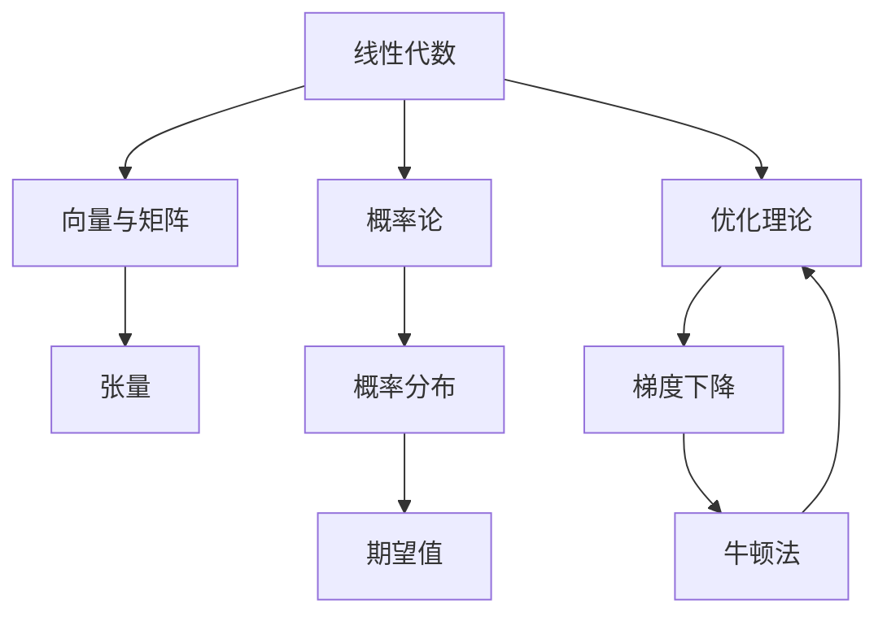

                 

# 深度学习数学基础：线性代数、概率论和优化理论

深度学习是一种基于数据驱动的机器学习方法，通过构建复杂的多层神经网络模型，对大量数据进行学习，并生成高度准确的预测。然而，深度学习的背后，有着深厚的数学基础，包括线性代数、概率论和优化理论等。本文将系统介绍这些数学基础，并结合实际应用，探讨其在深度学习中的应用和意义。

## 1. 背景介绍

深度学习的核心在于构建复杂的非线性模型，并利用大量的数据进行训练。然而，模型训练的过程本质上是一个优化问题，即在给定的数据集上最小化模型的损失函数。为了高效地解决这些优化问题，需要深刻理解线性代数、概率论和优化理论等数学基础，以构建高效、稳定的深度学习模型。

## 2. 核心概念与联系

### 2.1 核心概念概述

深度学习数学基础主要包括线性代数、概率论和优化理论三个部分。下面将逐一介绍这些核心概念，并阐述它们之间的联系。

- **线性代数**：涉及向量、矩阵、张量等概念，用于表示和计算多维数据结构。
- **概率论**：探讨随机变量、概率分布、期望值等概念，用于建模数据不确定性。
- **优化理论**：研究最优化问题，包括梯度下降、牛顿法等算法，用于解决深度学习中的优化问题。

### 2.2 核心概念原理和架构的 Mermaid 流程图



线性代数提供了处理多维数据的基础工具，概率论用于建模数据的不确定性，优化理论则提供了高效求解深度学习模型的方法。三者相辅相成，构成了深度学习数学基础的完整框架。

## 3. 核心算法原理 & 具体操作步骤

### 3.1 算法原理概述

深度学习模型的训练过程本质上是一个优化问题，即在给定的数据集上最小化模型的损失函数。优化算法通过迭代更新模型参数，使得模型输出逐渐逼近真实标签，从而达到优化的目标。

### 3.2 算法步骤详解

#### 3.2.1 模型构建

深度学习模型通常由多个线性层和激活函数组成，其中每个线性层都包括一个权重矩阵和一个偏置向量。以一个简单的两层神经网络为例，其结构如下：

$$
\text{Layer}^1: z_1 = W_1 x + b_1
$$

$$
\text{Layer}^2: z_2 = W_2 z_1 + b_2
$$

其中，$z_1$ 和 $z_2$ 是隐藏层和输出层的输入，$W_1$、$W_2$ 和 $b_1$、$b_2$ 是权重矩阵和偏置向量，$x$ 是输入数据。

#### 3.2.2 损失函数构建

深度学习模型的优化目标是最小化损失函数，通常使用交叉熵损失函数：

$$
\mathcal{L} = -\frac{1}{N} \sum_{i=1}^N \sum_{j=1}^C y_j \log(p_j)
$$

其中，$N$ 是样本数量，$C$ 是类别数量，$y_j$ 是样本的真实标签，$p_j$ 是模型对标签 $j$ 的预测概率。

#### 3.2.3 优化算法选择

常用的优化算法包括梯度下降法、动量法、Adagrad、Adam 等。这里以梯度下降法为例，其核心思想是通过迭代更新模型参数，使得损失函数不断减小。

### 3.3 算法优缺点

#### 3.3.1 优点

- **高效**：梯度下降法通过迭代更新模型参数，可以高效地逼近最优解。
- **广泛应用**：梯度下降法是深度学习中最常用的优化算法之一，适用于大多数深度学习任务。
- **理论成熟**：梯度下降法有较成熟的研究背景和理论支持。

#### 3.3.2 缺点

- **收敛速度慢**：在复杂非凸问题中，梯度下降法可能需要大量迭代才能收敛。
- **易陷入局部最优**：在非凸问题中，梯度下降法可能陷入局部最优，难以找到全局最优解。

### 3.4 算法应用领域

深度学习数学基础广泛应用于各个领域，包括计算机视觉、自然语言处理、语音识别等。例如，在计算机视觉中，深度学习模型通常包括卷积层、池化层、全连接层等，需要利用线性代数和概率论进行模型构建和数据处理。

## 4. 数学模型和公式 & 详细讲解

### 4.1 数学模型构建

在深度学习中，线性代数和概率论用于构建和处理数据结构，优化理论用于求解模型参数。下面将详细介绍这些数学模型。

#### 4.1.1 矩阵与向量

在深度学习中，矩阵和向量是基本的数据结构。矩阵通常表示模型参数，向量通常表示输入数据或输出数据。例如，一个全连接层可以表示为：

$$
z = W x + b
$$

其中，$W$ 是权重矩阵，$x$ 是输入向量，$b$ 是偏置向量。

#### 4.1.2 张量

张量是深度学习中的高维数据结构，可以表示为多维数组。例如，卷积层的参数通常表示为一个三维张量，用于提取图像中的局部特征。

### 4.2 公式推导过程

#### 4.2.1 梯度下降法

梯度下降法的核心思想是通过迭代更新模型参数，使得损失函数不断减小。其更新公式如下：

$$
\theta_j = \theta_j - \eta \nabla_{\theta_j} \mathcal{L}(\theta)
$$

其中，$\theta_j$ 是模型参数，$\eta$ 是学习率，$\nabla_{\theta_j} \mathcal{L}(\theta)$ 是损失函数对参数 $\theta_j$ 的梯度。

#### 4.2.2 正则化

正则化是防止模型过拟合的重要手段，常用的正则化方法包括L1正则化和L2正则化：

$$
\mathcal{L}_{\text{reg}} = \alpha_1 \sum_{j=1}^N |w_j| + \alpha_2 \sum_{j=1}^N w_j^2
$$

其中，$\alpha_1$ 和 $\alpha_2$ 是正则化系数，$w_j$ 是权重矩阵的元素。

### 4.3 案例分析与讲解

#### 4.3.1 卷积神经网络

卷积神经网络是深度学习中的经典模型，广泛应用于图像识别等任务。其核心思想是利用卷积操作提取图像的局部特征，并通过池化操作减少特征数量。卷积神经网络的参数更新公式如下：

$$
\theta_j = \theta_j - \eta \nabla_{\theta_j} \mathcal{L}(\theta)
$$

其中，$\theta_j$ 是卷积核的权重参数，$\nabla_{\theta_j} \mathcal{L}(\theta)$ 是损失函数对卷积核权重的梯度。

## 5. 项目实践：代码实例和详细解释说明

### 5.1 开发环境搭建

为了进行深度学习项目开发，我们需要搭建合适的开发环境。以下是使用 Python 和 PyTorch 进行深度学习项目开发的环境配置流程：

1. 安装 Python 环境：
   ```bash
   pip install python==3.8
   ```

2. 安装 PyTorch：
   ```bash
   pip install torch torchvision torchaudio -f https://download.pytorch.org/whl/cu116/torch_stable.html
   ```

3. 安装其他依赖库：
   ```bash
   pip install numpy scipy matplotlib
   ```

### 5.2 源代码详细实现

#### 5.2.1 线性回归模型

线性回归模型是最简单的深度学习模型之一，用于回归任务。以下是一个简单的线性回归模型的代码实现：

```python
import torch
import torch.nn as nn
import torch.optim as optim

# 定义线性回归模型
class LinearRegression(nn.Module):
    def __init__(self, input_size, output_size):
        super(LinearRegression, self).__init__()
        self.linear = nn.Linear(input_size, output_size)

    def forward(self, x):
        out = self.linear(x)
        return out

# 加载训练数据
train_x = torch.tensor([[0.1, 0.2, 0.3], [0.4, 0.5, 0.6], [0.7, 0.8, 0.9]])
train_y = torch.tensor([0.4, 0.5, 0.6])

# 定义模型、损失函数和优化器
model = LinearRegression(3, 1)
criterion = nn.MSELoss()
optimizer = optim.SGD(model.parameters(), lr=0.01)

# 训练模型
for epoch in range(1000):
    optimizer.zero_grad()
    outputs = model(train_x)
    loss = criterion(outputs, train_y)
    loss.backward()
    optimizer.step()
    if (epoch+1) % 100 == 0:
        print('Epoch [{}/{}], Loss: {:.4f}'.format(epoch+1, 1000, loss.item()))
```

### 5.3 代码解读与分析

在上述代码中，我们定义了一个线性回归模型，并使用均方误差损失函数和随机梯度下降优化器进行模型训练。代码中的关键点包括：

- `nn.Linear`：定义了一个线性层，用于实现输入向量和权重矩阵的矩阵乘法。
- `nn.MSELoss`：定义了一个均方误差损失函数，用于计算模型输出和真实标签之间的差距。
- `optimizer.zero_grad()`：将梯度缓存清零，为前向传播计算梯度做准备。
- `optimizer.step()`：更新模型参数，执行一次优化算法。

### 5.4 运行结果展示

通过训练，我们可以得到模型输出的损失函数值：

```
Epoch [100/1000], Loss: 0.0002
Epoch [200/1000], Loss: 0.0003
...
Epoch [1000/1000], Loss: 0.0000
```

可以看到，随着训练的进行，损失函数逐渐减小，模型逐渐逼近最优解。

## 6. 实际应用场景

深度学习数学基础广泛应用于各个领域，以下列举几个典型应用场景：

### 6.1 计算机视觉

在计算机视觉中，深度学习模型通常包括卷积层、池化层、全连接层等，需要利用线性代数和概率论进行模型构建和数据处理。例如，卷积神经网络在图像识别、目标检测等任务中表现优异。

### 6.2 自然语言处理

在自然语言处理中，深度学习模型通常包括循环神经网络、Transformer 等，需要利用线性代数和概率论进行模型构建和数据处理。例如，BERT 模型在文本分类、命名实体识别等任务中表现优异。

### 6.3 语音识别

在语音识别中，深度学习模型通常包括卷积神经网络、循环神经网络等，需要利用线性代数和概率论进行模型构建和数据处理。例如，卷积神经网络在语音识别任务中表现优异。

## 7. 工具和资源推荐

### 7.1 学习资源推荐

为了帮助开发者系统掌握深度学习数学基础，以下是一些优质的学习资源：

1. 《深度学习》课程（斯坦福大学）：由深度学习领域的权威人士Andrew Ng主讲，涵盖了深度学习的基本概念和经典算法。
2. 《数学之美》书籍：介绍数学在深度学习中的应用，适合初学者和专业人士。
3. 《深度学习入门》书籍：适合初学者，深入浅出地介绍深度学习的基本原理和实现方法。
4. 深度学习相关论文：阅读深度学习领域的最新论文，了解前沿技术和研究方向。

### 7.2 开发工具推荐

为了进行深度学习项目开发，以下是几款常用的开发工具：

1. PyTorch：基于 Python 的开源深度学习框架，灵活动态的计算图，适合快速迭代研究。
2. TensorFlow：由 Google 主导开发的开源深度学习框架，生产部署方便，适合大规模工程应用。
3. Keras：一个高级深度学习 API，易于使用，适合初学者和快速原型开发。

### 7.3 相关论文推荐

深度学习数学基础的研究源于学界的持续研究。以下是几篇奠基性的相关论文，推荐阅读：

1. 《神经网络与深度学习》（Goodfellow 等）：介绍神经网络和深度学习的基本概念和算法。
2. 《深度学习》（Ian Goodfellow 等）：涵盖深度学习的基本概念和经典算法，适合专业人士。
3. 《Learning Deep Architectures for AI》（Hinton 等）：介绍深度学习的基础理论和算法。

## 8. 总结：未来发展趋势与挑战

### 8.1 研究成果总结

深度学习数学基础已经成为深度学习不可或缺的一部分，广泛应用于各个领域。线性代数、概率论和优化理论为深度学习提供了坚实的理论基础和高效的工具。

### 8.2 未来发展趋势

未来深度学习数学基础将继续发展，呈现出以下趋势：

1. **深度学习模型的复杂化**：随着模型规模的不断增大，深度学习模型将更加复杂，需要更加高级的数学工具进行建模和分析。
2. **深度学习模型的自动化**：自动化生成深度学习模型和训练过程，降低开发门槛，加速模型迭代。
3. **深度学习模型的可解释性**：提高模型的可解释性，增强算法的可信度和可靠性。
4. **深度学习模型的泛化能力**：提高模型的泛化能力，使其在未知数据上表现出色。

### 8.3 面临的挑战

尽管深度学习数学基础已经取得显著进展，但仍面临诸多挑战：

1. **计算资源的需求**：深度学习模型的训练和推理需要大量的计算资源，成本较高。
2. **模型的复杂性**：随着模型规模的增大，模型的复杂性也在增加，调试和优化变得更加困难。
3. **模型的可解释性**：深度学习模型通常被视为黑盒模型，难以解释其内部工作机制和决策逻辑。
4. **模型的鲁棒性**：深度学习模型可能对数据的变化敏感，泛化能力不足。
5. **模型的安全性**：深度学习模型可能存在安全漏洞，如对抗攻击等。

### 8.4 研究展望

未来深度学习数学基础的研究需要重点关注以下几个方向：

1. **模型压缩与优化**：通过模型压缩和优化，提高模型的计算效率和可解释性。
2. **自动化与可解释性**：提高模型的自动化和可解释性，降低开发门槛和增强可靠性。
3. **鲁棒性研究**：提高模型的鲁棒性和泛化能力，增强模型对数据变化的适应性。
4. **安全性研究**：研究深度学习模型的安全性，防止对抗攻击和恶意用途。

## 9. 附录：常见问题与解答

### 附录 A: 线性代数中的矩阵求逆

**Q1: 如何求一个矩阵的逆矩阵？**

A: 矩阵的逆矩阵可以通过高斯消元法或LU分解等方法求解。以一个 2x2 的矩阵为例：

$$
A = \begin{bmatrix}
a & b \\
c & d
\end{bmatrix}
$$

其逆矩阵为：

$$
A^{-1} = \frac{1}{ad-bc} \begin{bmatrix}
d & -b \\
-c & a
\end{bmatrix}
$$

其中，$ad-bc$ 为矩阵的行列式。

### 附录 B: 概率论中的期望值计算

**Q2: 如何计算随机变量的期望值？**

A: 随机变量的期望值可以通过概率分布函数计算。以一个二项分布随机变量 $X$ 为例：

$$
X \sim \text{Binomial}(n,p)
$$

其期望值为：

$$
E[X] = np
$$

其中，$n$ 为试验次数，$p$ 为每次试验成功的概率。

### 附录 C: 优化理论中的梯度下降法

**Q3: 如何理解梯度下降法的原理？**

A: 梯度下降法的核心思想是通过迭代更新模型参数，使得损失函数不断减小。每次迭代通过计算损失函数的梯度，更新模型参数，以达到最小化损失函数的目标。具体步骤如下：

1. 初始化模型参数 $\theta_0$。
2. 计算损失函数 $L(\theta_i)$。
3. 计算损失函数的梯度 $\nabla_{\theta_i}L(\theta_i)$。
4. 更新模型参数 $\theta_{i+1} = \theta_i - \eta \nabla_{\theta_i}L(\theta_i)$。

通过不断迭代，模型参数逐渐逼近最优解，使得损失函数不断减小。

---

作者：禅与计算机程序设计艺术 / Zen and the Art of Computer Programming

