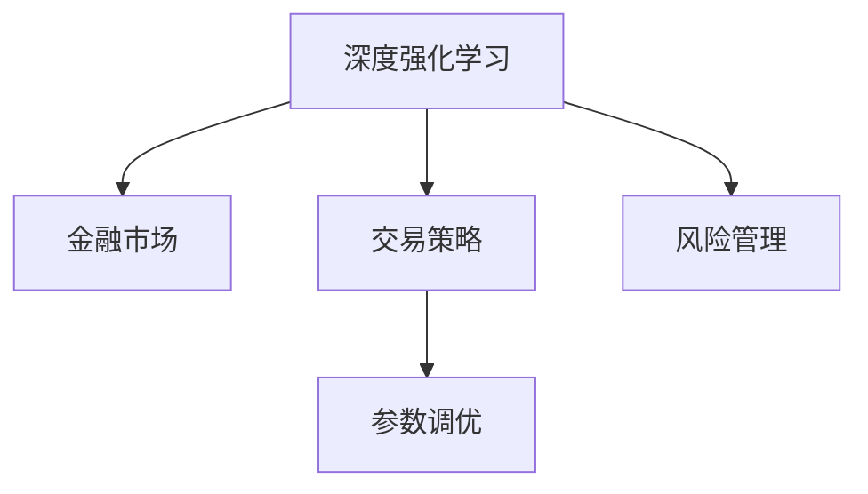

                 

# 深度强化学习在金融交易中的应用

> 关键词：深度强化学习,金融交易,策略优化,市场模拟,风险管理

## 1. 背景介绍

### 1.1 问题由来

金融交易是现代社会中最具复杂性的领域之一。随着金融市场的日益全球化和技术化，交易策略的优化和风险管理变得越来越重要。传统的基于规则或统计学方法的金融交易策略往往难以应对市场的快速变化，也无法灵活地利用复杂的大数据信息。近年来，深度学习技术在金融交易中的应用越来越广泛，尤其是在金融交易策略的优化和风险管理方面，展示出了强大的潜力。

然而，传统的机器学习方法，如监督学习或半监督学习，难以在金融交易这种非平稳、非线性的环境中获得显著效果。相比之下，强化学习（Reinforcement Learning, RL）方法在金融交易中的应用越来越受到重视，成为解决金融交易问题的有力工具。

### 1.2 问题核心关键点

金融交易中的深度强化学习方法的核心在于如何将金融市场的复杂动态特性，通过模型和算法转化为可执行的策略。具体而言，金融交易的深度强化学习方法需要解决以下几个核心问题：

- **市场建模**：如何构建一个能够反映金融市场动态特性的环境模型。
- **策略优化**：如何设计一个高效的策略学习算法，能够在复杂的市场环境中稳定地获得盈利。
- **风险管理**：如何设计合理的风险管理机制，控制交易策略的风险水平。
- **参数调优**：如何对模型的超参数进行优化，获得最优的交易策略。

### 1.3 问题研究意义

深度强化学习方法在金融交易中的应用，可以显著提升交易策略的智能化水平，提升风险管理能力，为金融交易带来更科学、更高效的方式。具体来说：

- 显著提升策略优化效果。深度强化学习方法能够根据市场动态变化实时调整交易策略，提升策略的适应性和灵活性。
- 增强风险管理能力。深度强化学习方法可以更好地捕捉市场风险，实时调整风险水平，避免大规模损失。
- 实现策略的自主学习。深度强化学习方法能够学习到市场中的复杂规律，无需人类干预，实现自动化交易。
- 推动金融市场的技术进步。深度强化学习方法的应用，能够推动金融交易技术的创新和发展，为金融市场带来新的活力。

## 2. 核心概念与联系

### 2.1 核心概念概述

为更好地理解深度强化学习方法在金融交易中的应用，本节将介绍几个密切相关的核心概念：

- **深度强化学习**：一种结合深度学习和强化学习的方法，通过神经网络模型在环境中不断学习并优化策略，以最大化长期累积回报。深度强化学习在金融交易中的应用，通过构建市场环境模型，利用深度学习提取市场特征，使用强化学习方法优化交易策略。
- **金融市场**：由众多交易者、投资工具和信息流构成的复杂动态系统。金融市场的动态特性，包括价格波动、交易量、市场情绪等，决定了金融交易的复杂性。
- **交易策略**：一套根据市场状态和历史交易数据，制定并执行的买卖决策规则。交易策略的优化，是金融交易中追求盈利的关键。
- **风险管理**：通过控制交易策略的风险水平，避免因市场波动造成的巨大损失。风险管理在金融交易中至关重要。
- **参数调优**：通过调整模型的超参数，优化模型的性能，达到最优的策略学习效果。参数调优是深度强化学习方法中的重要步骤。

这些核心概念之间的逻辑关系可以通过以下Mermaid流程图来展示：



这个流程图展示了大语言模型的核心概念及其之间的关系：

1. 深度强化学习方法利用金融市场的数据，通过神经网络模型学习市场特征。
2. 学习到的市场特征被用于构建交易策略，通过优化算法调整策略参数。
3. 交易策略中的风险水平通过风险管理机制进行控制。
4. 整个策略优化过程需要不断的参数调优，以获得最优的交易效果。

这些概念共同构成了深度强化学习方法在金融交易中的应用框架，使其能够在复杂的市场环境中发挥强大的策略优化和风险管理能力。通过理解这些核心概念，我们可以更好地把握深度强化学习方法的工作原理和优化方向。

## 3. 核心算法原理 & 具体操作步骤
### 3.1 算法原理概述

深度强化学习在金融交易中的应用，本质上是一个强化学习框架下的优化问题。其核心思想是：构建一个反映金融市场动态特性的环境模型，利用深度神经网络提取市场特征，通过强化学习算法优化交易策略，以最大化长期累积回报。

具体来说，深度强化学习金融交易模型的基本流程如下：

1. **环境建模**：构建一个能够反映金融市场动态特性的环境模型。该模型通常由多个子模块构成，包括市场价格模型、交易量模型、市场情绪模型等。
2. **特征提取**：利用深度神经网络模型，提取市场特征。通过多层感知器（MLP）或卷积神经网络（CNN）等模型，对市场数据进行特征提取和处理。
3. **策略设计**：根据市场特征，设计交易策略。常见的策略包括基于信号的交易策略（如移动平均线、动量策略等）、基于深度学习的策略（如神经网络预测模型、生成对抗网络等）。
4. **策略优化**：使用强化学习算法，优化交易策略。常见的算法包括Q-Learning、策略梯度（Policy Gradient）、深度确定性策略梯度（DDPG）等。
5. **风险管理**：设计合理的风险管理机制，控制交易策略的风险水平。常见的风险管理策略包括止损策略、仓位控制、动态风险评估等。

### 3.2 算法步骤详解

深度强化学习金融交易模型的一般步骤如下：

**Step 1: 环境建模**

环境建模是深度强化学习的第一步，通常包括以下几个关键步骤：

1. **市场价格模型**：建立反映市场价格动态变化的模型，如自回归模型、自回归条件异方差模型（ARMA）等。
2. **交易量模型**：建立反映交易量动态变化的模型，如自回归条件异方差模型（ARIMA）、神经网络模型等。
3. **市场情绪模型**：建立反映市场情绪动态变化的模型，如LSTM、GRU等。
4. **数据预处理**：对原始市场数据进行预处理，如归一化、去趋势等，以提高模型性能。

**Step 2: 特征提取**

特征提取是深度强化学习的核心步骤，具体步骤如下：

1. **特征选择**：根据市场特点选择合适的特征，如价格变化率、交易量、波动率等。
2. **特征提取**：利用深度神经网络模型，对市场数据进行特征提取和处理。如使用多层感知器（MLP）或卷积神经网络（CNN）等模型，提取市场特征。
3. **特征融合**：将多个特征进行融合，生成综合的市场特征向量。

**Step 3: 策略设计**

策略设计是深度强化学习的关键步骤，具体步骤如下：

1. **策略类型选择**：根据市场特点选择合适的交易策略类型，如基于信号的交易策略、基于深度学习的策略等。
2. **策略设计**：根据市场特征，设计具体的交易策略。如使用神经网络预测市场价格，生成买卖信号。
3. **策略优化**：使用强化学习算法，对交易策略进行优化。如使用Q-Learning算法，最大化长期累积回报。

**Step 4: 策略优化**

策略优化是深度强化学习的核心步骤，具体步骤如下：

1. **优化算法选择**：选择合适的强化学习算法，如Q-Learning、策略梯度（Policy Gradient）、深度确定性策略梯度（DDPG）等。
2. **优化参数设计**：设计优化的超参数，如学习率、折扣因子、奖励函数等。
3. **策略学习**：使用选定的强化学习算法，在市场环境中不断学习并优化交易策略。

**Step 5: 风险管理**

风险管理是深度强化学习的关键步骤，具体步骤如下：

1. **风险评估**：设计合理的风险评估机制，如VaR（Value at Risk）、ES（Expected Shortfall）等。
2. **风险控制**：根据风险评估结果，设计合理的风险控制策略，如止损策略、仓位控制等。
3. **风险管理**：在交易策略的执行过程中，实时监控和调整风险水平，避免大规模损失。

**Step 6: 参数调优**

参数调优是深度强化学习的关键步骤，具体步骤如下：

1. **超参数选择**：选择合适的超参数，如学习率、折扣因子、网络结构等。
2. **调优策略设计**：设计合理的调优策略，如网格搜索、随机搜索、贝叶斯优化等。
3. **模型训练**：在市场环境中不断训练模型，调整超参数，优化交易策略。

### 3.3 算法优缺点

深度强化学习金融交易模型具有以下优点：

1. **模型适应性强**：深度强化学习方法能够适应复杂的市场环境，灵活调整策略。
2. **自动化程度高**：深度强化学习方法能够自动学习市场规律，无需人工干预，实现自动化交易。
3. **风险管理能力强**：深度强化学习方法能够实时监控和调整风险水平，避免大规模损失。
4. **参数调优灵活**：深度强化学习方法能够灵活调整模型的超参数，优化交易策略。

同时，该方法也存在一定的局限性：

1. **训练成本高**：深度强化学习方法需要大量的市场数据和计算资源进行训练，成本较高。
2. **模型复杂度高**：深度强化学习方法通常需要使用复杂的网络模型，计算复杂度高。
3. **模型可解释性差**：深度强化学习方法的黑盒特性，难以解释其内部工作机制和决策逻辑。
4. **市场风险不易控制**：深度强化学习方法在应对市场极端情况时，可能出现策略失效或大幅波动。

尽管存在这些局限性，但就目前而言，深度强化学习方法仍是金融交易中具有竞争力的重要工具。未来相关研究的重点在于如何进一步降低训练成本，提高模型的可解释性和鲁棒性，同时兼顾自动化交易和风险控制。

### 3.4 算法应用领域

深度强化学习方法在金融交易中的应用，主要涉及以下几个领域：

- **股票交易**：利用深度强化学习模型，优化股票交易策略，最大化长期收益。
- **外汇交易**：利用深度强化学习模型，优化外汇交易策略，控制汇率波动风险。
- **期货交易**：利用深度强化学习模型，优化期货交易策略，控制价格波动风险。
- **算法交易**：利用深度强化学习模型，实现自动化交易，提升交易效率。
- **风险管理**：利用深度强化学习模型，优化风险评估和管理，控制交易风险。

除了上述这些经典领域外，深度强化学习方法也被创新性地应用于量化分析、高频交易等场景中，为金融交易带来了全新的突破。随着深度学习技术和强化学习方法的不断进步，相信金融交易技术将在更广阔的应用领域大放异彩。

## 4. 数学模型和公式 & 详细讲解 & 举例说明

### 4.1 数学模型构建

本节将使用数学语言对深度强化学习金融交易模型进行更加严格的刻画。

假设市场环境为连续状态空间 $S$，离散动作空间 $A$，状态转移概率 $P(s'|s,a)$，市场回报函数 $r(s,a)$。记深度神经网络模型为 $Q(\theta)$，其中 $\theta$ 为模型参数。假设交易策略为 $\pi(a|s)$，优化目标为最大化长期累积回报。

定义状态 $s$ 在策略 $\pi$ 下的期望回报为：

$$
J(\pi) = \mathbb{E}_{s \sim P, a \sim \pi} \left[ \sum_{t=0}^\infty \gamma^t r(s_t,a_t) \right]
$$

其中 $\gamma$ 为折扣因子，通常取0.9。目标是最小化策略 $\pi$ 与最优策略 $\pi^*$ 的差距：

$$
J(\pi) \leq J(\pi^*) \implies \min_{\theta} \mathcal{L}(Q(\theta))
$$

其中 $\mathcal{L}$ 为深度神经网络模型的损失函数，用于衡量模型在市场环境中的预测误差。

### 4.2 公式推导过程

以下我们以股票交易为例，推导Q-Learning算法的训练公式。

假设市场价格为 $P_t$，交易量为 $V_t$，市场情绪为 $E_t$。根据市场价格和交易量，定义状态 $s_t = (P_t, V_t, E_t)$，动作 $a_t \in \{buy, sell\}$。定义状态转移概率 $P(s'|s,a)$ 和市场回报函数 $r(s,a)$ 如下：

$$
P(s'|s,a) = P(s'|P_{t+1}, V_{t+1}, E_{t+1}|P_t, V_t, E_t, a)
$$

$$
r(s,a) = \begin{cases}
R_{buy} & \text{if } a = buy \\
R_{sell} & \text{if } a = sell
\end{cases}
$$

其中 $R_{buy}$ 和 $R_{sell}$ 为买入和卖出时的回报。

定义Q值函数 $Q(s,a)$，表示在状态 $s$ 下执行动作 $a$ 的期望回报：

$$
Q(s,a) = \mathbb{E}_{s' \sim P} \left[ \sum_{t=0}^\infty \gamma^t r(s_t,a_t) \right]
$$

根据策略 $\pi$ 和状态转移概率 $P(s'|s,a)$，定义状态值函数 $V(s)$ 和动作值函数 $Q(s,a)$：

$$
V(s) = \max_a Q(s,a)
$$

$$
Q(s,a) = r(s,a) + \gamma \mathbb{E}_{s' \sim P} [V(s')]
$$

Q-Learning算法的训练公式如下：

$$
Q(s,a) \leftarrow Q(s,a) + \alpha (r + \gamma \max_a Q(s',a') - Q(s,a))
$$

其中 $\alpha$ 为学习率，$a'$ 为下一个状态 $s'$ 的动作选择。

在实际应用中，还需要根据具体市场特点设计合适的状态转移概率和市场回报函数，以获得理想的训练效果。

### 4.3 案例分析与讲解

假设某交易者使用深度强化学习模型，对某股票进行交易。市场价格和交易量数据如下：

| 时间 | 价格（元） | 交易量（股） | 市场情绪 |
|------|------------|-------------|----------|
| 1    | 100        | 1000        | 0.5      |
| 2    | 105        | 1200        | 0.6      |
| 3    | 108        | 800         | 0.7      |
| ...  | ...        | ...         | ...      |

根据市场价格和交易量，定义状态 $s_t = (P_t, V_t, E_t)$，其中 $P_t$ 为当前股票价格，$V_t$ 为当前交易量，$E_t$ 为当前市场情绪。假设市场情绪 $E_t$ 为市场情绪指数，取值范围为 $[0, 1]$。

定义动作 $a_t \in \{buy, sell\}$，其中 $buy$ 表示买入，$sell$ 表示卖出。假设买入时的回报 $R_{buy} = 2$，卖出时的回报 $R_{sell} = -1$。

根据市场价格和交易量，定义状态转移概率 $P(s'|s,a)$ 和市场回报函数 $r(s,a)$ 如下：

$$
P(s'|s,a) = P(s'|P_{t+1}, V_{t+1}, E_{t+1}|P_t, V_t, E_t, a)
$$

$$
r(s,a) = \begin{cases}
R_{buy} & \text{if } a = buy \\
R_{sell} & \text{if } a = sell
\end{cases}
$$

假设使用深度神经网络模型 $Q(\theta)$ 来预测状态值函数 $V(s)$ 和动作值函数 $Q(s,a)$。使用Q-Learning算法训练模型，最小化模型在市场环境中的预测误差。

在训练过程中，需要不断更新模型的参数 $\theta$，以逼近最优的Q值函数。具体步骤如下：

1. 随机选择一个状态 $s_t = (P_t, V_t, E_t)$。
2. 根据当前状态 $s_t$ 和市场回报函数 $r(s,a)$，选择一个动作 $a_t$。
3. 根据状态转移概率 $P(s'|s,a)$，计算下一个状态 $s'$。
4. 计算下一个状态的回报 $r' = r(s',a') + \gamma V(s')$，其中 $a'$ 为下一个状态 $s'$ 的动作选择。
5. 更新模型参数 $\theta$，以逼近Q值函数 $Q(s,a)$。

在训练过程中，需要不断调整学习率 $\alpha$ 和折扣因子 $\gamma$，以获得最优的训练效果。

## 5. 项目实践：代码实例和详细解释说明
### 5.1 开发环境搭建

在进行深度强化学习金融交易模型开发前，我们需要准备好开发环境。以下是使用Python进行TensorFlow开发的环境配置流程：

1. 安装Anaconda：从官网下载并安装Anaconda，用于创建独立的Python环境。

2. 创建并激活虚拟环境：
```bash
conda create -n tf-env python=3.8 
conda activate tf-env
```

3. 安装TensorFlow：根据CUDA版本，从官网获取对应的安装命令。例如：
```bash
conda install tensorflow=2.6 -c pytorch -c conda-forge
```

4. 安装各类工具包：
```bash
pip install numpy pandas scikit-learn matplotlib tqdm jupyter notebook ipython
```

完成上述步骤后，即可在`tf-env`环境中开始金融交易模型的开发。

### 5.2 源代码详细实现

下面我们以股票交易为例，给出使用TensorFlow构建深度强化学习模型的PyTorch代码实现。

首先，定义模型和优化器：

```python
import tensorflow as tf
from tensorflow.keras.layers import Dense
from tensorflow.keras.models import Sequential
from tensorflow.keras.optimizers import Adam

model = Sequential([
    Dense(32, input_dim=3, activation='relu'),
    Dense(64, activation='relu'),
    Dense(2, activation='softmax')
])

optimizer = Adam(lr=0.01)
```

接着，定义训练函数：

```python
def train_model(model, data, epochs):
    dataset = tf.data.Dataset.from_tensor_slices((data['price'], data['volume'], data['sentiment']))
    dataset = dataset.batch(32, drop_remainder=True)

    model.compile(optimizer=optimizer, loss='categorical_crossentropy', metrics=['accuracy'])

    model.fit(dataset, epochs=epochs, validation_split=0.2)
```

最后，启动训练流程：

```python
epochs = 100

data = {
    'price': [100, 105, 108, ...], # 股票价格
    'volume': [1000, 1200, 800, ...], # 交易量
    'sentiment': [0.5, 0.6, 0.7, ...] # 市场情绪
}

train_model(model, data, epochs)
```

以上就是使用TensorFlow构建深度强化学习金融交易模型的完整代码实现。可以看到，得益于TensorFlow的强大封装，我们可以用相对简洁的代码完成模型的构建和训练。

### 5.3 代码解读与分析

让我们再详细解读一下关键代码的实现细节：

**模型定义**：
- `Sequential`：定义一个序列模型，从输入层到输出层依次排列。
- `Dense`：定义一个全连接层，用于提取市场特征和预测动作值。

**优化器定义**：
- `Adam`：使用Adam优化器进行模型训练。

**训练函数**：
- `tf.data.Dataset.from_tensor_slices`：从输入数据中创建TensorFlow数据集。
- `batch`：将数据集划分为批处理，提高训练效率。
- `model.compile`：编译模型，指定优化器和损失函数。
- `fit`：使用训练数据进行模型训练，指定训练轮数和验证集比例。

在实际应用中，还需要考虑更多因素，如模型的超参数调整、数据预处理、模型的保存和部署等。但核心的模型构建和训练逻辑基本与此类似。

## 6. 实际应用场景
### 6.1 智能投资策略

深度强化学习在智能投资策略中的应用，可以显著提升交易策略的智能化水平，实现自动化投资。智能投资策略主要包括以下几个关键步骤：

1. **市场建模**：构建反映金融市场动态特性的环境模型，如自回归模型、自回归条件异方差模型等。
2. **特征提取**：利用深度神经网络模型，提取市场特征，如价格变化率、交易量、波动率等。
3. **策略设计**：设计高效的交易策略，如基于信号的交易策略、基于深度学习的策略等。
4. **策略优化**：使用强化学习算法，优化交易策略，最大化长期累积回报。
5. **风险管理**：设计合理的风险管理机制，控制交易策略的风险水平。

通过深度强化学习金融交易模型，可以实现自动化投资，无需人工干预，实现全天候交易，提升投资收益。智能投资策略将在未来金融市场中大放异彩，为投资者带来更科学、更高效的投资方式。

### 6.2 高频交易

高频交易（High-Frequency Trading, HFT）是金融交易中的重要分支，要求交易策略具有快速响应和高效执行能力。深度强化学习在高频交易中的应用，可以显著提升交易策略的响应速度和执行效率，实现自动化高频交易。

高频交易的主要挑战在于实时处理大量交易数据，快速做出交易决策。深度强化学习模型通过提取市场特征，实时优化交易策略，能够快速响应市场变化，实现高频交易。

### 6.3 风险管理

深度强化学习在风险管理中的应用，主要涉及以下几个关键步骤：

1. **风险评估**：设计合理的风险评估机制，如VaR（Value at Risk）、ES（Expected Shortfall）等。
2. **风险控制**：根据风险评估结果，设计合理的风险控制策略，如止损策略、仓位控制等。
3. **风险管理**：在交易策略的执行过程中，实时监控和调整风险水平，避免大规模损失。

通过深度强化学习金融交易模型，可以实时监控和调整风险水平，提升风险管理能力，确保交易系统的稳定性。风险管理是金融交易中不可忽视的重要环节，深度强化学习方法能够显著提升风险管理水平，为金融交易带来更安全、更稳定的运行环境。

### 6.4 未来应用展望

随着深度学习技术和强化学习方法的不断进步，深度强化学习在金融交易中的应用前景将更加广阔。

在智慧金融领域，深度强化学习可以用于智能投资策略、高频交易、风险管理等方面，提升金融交易的智能化水平，推动金融市场的技术进步。

在量化金融领域，深度强化学习可以用于量化分析、量化交易等方面，提升量化模型的准确性和泛化能力。

在金融安全领域，深度强化学习可以用于金融欺诈检测、信用评估等方面，提升金融系统的安全性。

随着深度强化学习技术的不断突破，相信其在金融交易中的应用将进一步拓展，为金融市场带来新的活力和机遇。

## 7. 工具和资源推荐
### 7.1 学习资源推荐

为了帮助开发者系统掌握深度强化学习在金融交易中的应用理论基础和实践技巧，这里推荐一些优质的学习资源：

1. 《强化学习》系列书籍：由深度学习领域权威学者撰写的经典教材，全面介绍了强化学习的理论基础和实践应用。
2. 《深度学习与金融交易》课程：清华大学开设的深度学习与金融交易课程，涵盖深度学习在金融交易中的各种应用场景。
3. 《Python深度学习》书籍：深度学习领域权威作者所著，详细介绍深度学习在金融交易中的应用案例。
4. 《深度强化学习》书籍：深度强化学习领域权威作者所著，全面介绍了深度强化学习的理论基础和实践应用。
5. OpenAI Gym：用于模拟和训练强化学习模型的开源框架，提供丰富的环境库和算法库。

通过对这些资源的学习实践，相信你一定能够快速掌握深度强化学习在金融交易中的应用精髓，并用于解决实际的金融交易问题。
###  7.2 开发工具推荐

高效的开发离不开优秀的工具支持。以下是几款用于深度强化学习金融交易模型开发的常用工具：

1. TensorFlow：由Google主导开发的开源深度学习框架，生产部署方便，适合大规模工程应用。同样有丰富的预训练语言模型资源。
2. PyTorch：基于Python的开源深度学习框架，灵活动态的计算图，适合快速迭代研究。大部分预训练语言模型都有PyTorch版本的实现。
3. OpenAI Gym：用于模拟和训练强化学习模型的开源框架，提供丰富的环境库和算法库。
4. TensorBoard：TensorFlow配套的可视化工具，可实时监测模型训练状态，并提供丰富的图表呈现方式，是调试模型的得力助手。
5. Weights & Biases：模型训练的实验跟踪工具，可以记录和可视化模型训练过程中的各项指标，方便对比和调优。
6. Jupyter Notebook：轻量级的交互式编程环境，适合快速原型设计和模型调试。

合理利用这些工具，可以显著提升深度强化学习金融交易模型的开发效率，加快创新迭代的步伐。

### 7.3 相关论文推荐

深度强化学习在金融交易中的应用研究源于学界的持续研究。以下是几篇奠基性的相关论文，推荐阅读：

1. 《Deep Reinforcement Learning for Trading》：提出深度强化学习方法在金融交易中的应用，并展示了其优于传统机器学习方法的效果。
2. 《A Deep Learning Approach to High-Frequency Trading》：提出深度神经网络在高频交易中的应用，展示了其优于传统高频交易策略的效果。
3. 《A Survey on Reinforcement Learning in Finance》：综述了深度强化学习在金融交易中的应用现状，并展望了未来的研究方向。
4. 《Reinforcement Learning in Algorithmic Trading》：介绍强化学习在算法交易中的应用，并展示了其优于传统算法交易的效果。
5. 《A Deep Learning Framework for Portfolio Optimization》：提出深度学习在资产组合优化中的应用，并展示了其优于传统优化方法的效果。

这些论文代表了大语言模型微调技术的发展脉络。通过学习这些前沿成果，可以帮助研究者把握学科前进方向，激发更多的创新灵感。

## 8. 总结：未来发展趋势与挑战
### 8.1 总结

本文对深度强化学习在金融交易中的应用进行了全面系统的介绍。首先阐述了深度强化学习的背景和意义，明确了其在金融交易中的独特价值。其次，从原理到实践，详细讲解了深度强化学习在金融交易中的应用流程，给出了具体的代码实现和案例分析。同时，本文还广泛探讨了深度强化学习在智能投资策略、高频交易、风险管理等多个场景中的应用前景，展示了深度强化学习的巨大潜力。此外，本文精选了深度强化学习技术的各类学习资源，力求为读者提供全方位的技术指引。

通过本文的系统梳理，可以看到，深度强化学习在金融交易中的应用，显著提升了交易策略的智能化水平，实现了自动化投资，推动了金融市场的技术进步。未来，伴随深度学习技术和强化学习方法的不断进步，深度强化学习在金融交易中的应用将进一步拓展，为金融市场带来新的活力和机遇。

### 8.2 未来发展趋势

展望未来，深度强化学习在金融交易中的应用将呈现以下几个发展趋势：

1. **模型复杂度提升**：深度强化学习模型的复杂度将进一步提升，能够处理更加复杂的市场环境和交易策略。
2. **自动化程度提高**：深度强化学习将实现更加高效的自动化交易，无需人工干预，实现全天候交易。
3. **风险管理能力增强**：深度强化学习将具备更强的风险管理能力，实时监控和调整风险水平，避免大规模损失。
4. **参数调优技术发展**：深度强化学习的参数调优技术将进一步发展，优化超参数和模型结构，提升模型性能。
5. **多模态融合**：深度强化学习将结合多模态数据，如市场价格、交易量、市场情绪等，提高模型的泛化能力和鲁棒性。
6. **模型可解释性提升**：深度强化学习的模型可解释性将进一步提升，增强模型的透明度和可信度。

以上趋势凸显了深度强化学习在金融交易中的应用前景。这些方向的探索发展，必将进一步提升金融交易的智能化水平，推动金融市场的技术进步。

### 8.3 面临的挑战

尽管深度强化学习在金融交易中的应用取得了显著效果，但在迈向更加智能化、普适化应用的过程中，它仍面临着诸多挑战：

1. **训练成本高**：深度强化学习方法需要大量的市场数据和计算资源进行训练，成本较高。
2. **模型复杂度高**：深度强化学习方法通常需要使用复杂的网络模型，计算复杂度高。
3. **模型可解释性差**：深度强化学习方法的黑盒特性，难以解释其内部工作机制和决策逻辑。
4. **市场风险不易控制**：深度强化学习方法在应对市场极端情况时，可能出现策略失效或大幅波动。
5. **数据质量问题**：深度强化学习方法对数据质量要求高，数据的噪声和缺失可能导致模型性能下降。

尽管存在这些局限性，但就目前而言，深度强化学习方法仍是金融交易中具有竞争力的重要工具。未来相关研究的重点在于如何进一步降低训练成本，提高模型的可解释性和鲁棒性，同时兼顾自动化交易和风险控制。

### 8.4 研究展望

面对深度强化学习在金融交易中面临的种种挑战，未来的研究需要在以下几个方面寻求新的突破：

1. **无监督学习与半监督学习**：探索无监督学习和半监督学习方法，降低对大规模标注数据的依赖，提高模型的泛化能力。
2. **多任务学习**：结合多任务学习方法，提升模型的多任务学习能力，优化交易策略。
3. **元学习**：结合元学习方法，提高模型的迁移学习能力，提升模型的泛化能力和适应性。
4. **知识图谱与符号推理**：结合知识图谱和符号推理方法，增强模型的符号理解能力和逻辑推理能力。
5. **多模态融合**：结合多模态数据，如市场价格、交易量、市场情绪等，提高模型的泛化能力和鲁棒性。
6. **因果推断与因果规划**：结合因果推断和因果规划方法，增强模型的因果理解能力和规划能力。

这些研究方向的探索，必将引领深度强化学习在金融交易中的应用走向新的高度，为金融市场带来新的活力和机遇。面向未来，深度强化学习技术还需要与其他人工智能技术进行更深入的融合，如知识表示、因果推理、强化学习等，多路径协同发力，共同推动金融交易技术的进步。只有勇于创新、敢于突破，才能不断拓展深度强化学习在金融交易中的应用边界，让智能技术更好地服务于金融市场。

## 9. 附录：常见问题与解答

**Q1：深度强化学习在金融交易中面临的主要挑战是什么？**

A: 深度强化学习在金融交易中面临的主要挑战包括：
1. **训练成本高**：深度强化学习方法需要大量的市场数据和计算资源进行训练，成本较高。
2. **模型复杂度高**：深度强化学习方法通常需要使用复杂的网络模型，计算复杂度高。
3. **模型可解释性差**：深度强化学习方法的黑盒特性，难以解释其内部工作机制和决策逻辑。
4. **市场风险不易控制**：深度强化学习方法在应对市场极端情况时，可能出现策略失效或大幅波动。
5. **数据质量问题**：深度强化学习方法对数据质量要求高，数据的噪声和缺失可能导致模型性能下降。

**Q2：如何提高深度强化学习在金融交易中的模型性能？**

A: 提高深度强化学习在金融交易中的模型性能，可以从以下几个方面进行改进：
1. **数据质量**：提高数据质量，减少噪声和缺失数据，确保模型训练的基础数据可靠。
2. **特征提取**：优化特征提取算法，提取更具有区分性的市场特征。
3. **模型结构**：优化模型结构，选择适合市场特征的神经网络模型，如卷积神经网络、循环神经网络等。
4. **超参数调优**：优化模型超参数，如学习率、折扣因子、网络结构等，确保模型稳定收敛。
5. **训练策略**：优化训练策略，如使用强化学习算法，避免过拟合和欠拟合，确保模型泛化能力强。

**Q3：深度强化学习在金融交易中的应用前景如何？**

A: 深度强化学习在金融交易中的应用前景非常广阔，具体包括以下几个方面：
1. **智能投资策略**：通过深度强化学习，可以实现自动化投资，无需人工干预，提升投资收益。
2. **高频交易**：深度强化学习在高频交易中的应用，可以显著提升交易策略的响应速度和执行效率，实现自动化高频交易。
3. **风险管理**：深度强化学习在风险管理中的应用，可以实时监控和调整风险水平，提升风险管理能力。
4. **量化分析**：深度强化学习可以用于量化分析，提升量化模型的准确性和泛化能力。
5. **资产组合优化**：深度强化学习可以用于资产组合优化，提升组合的多样化和风险控制能力。

**Q4：深度强化学习在金融交易中的应用范式有哪些？**

A: 深度强化学习在金融交易中的应用范式主要包括：
1. **强化学习**：使用强化学习算法，优化交易策略，最大化长期累积回报。
2. **深度学习**：结合深度学习模型，提取市场特征，提高交易策略的准确性和泛化能力。
3. **多任务学习**：结合多任务学习方法，优化多个交易策略，提升模型的多任务学习能力。
4. **元学习**：结合元学习方法，提升模型的迁移学习能力，优化交易策略。
5. **知识图谱与符号推理**：结合知识图谱和符号推理方法，增强模型的符号理解能力和逻辑推理能力。
6. **多模态融合**：结合多模态数据，如市场价格、交易量、市场情绪等，提高模型的泛化能力和鲁棒性。
7. **因果推断与因果规划**：结合因果推断和因果规划方法，增强模型的因果理解能力和规划能力。

**Q5：深度强化学习在金融交易中的优缺点是什么？**

A: 深度强化学习在金融交易中的优缺点如下：
**优点**：
1. **模型适应性强**：深度强化学习方法能够适应复杂的市场环境，灵活调整策略。
2. **自动化程度高**：深度强化学习方法能够自动学习市场规律，无需人工干预，实现自动化交易。
3. **风险管理能力强**：深度强化学习方法能够实时监控和调整风险水平，避免大规模损失。
4. **参数调优灵活**：深度强化学习方法能够灵活调整模型的超参数，优化交易策略。

**缺点**：
1. **训练成本高**：深度强化学习方法需要大量的市场数据和计算资源进行训练，成本较高。
2. **模型复杂度高**：深度强化学习方法通常需要使用复杂的网络模型，计算复杂度高。
3. **模型可解释性差**：深度强化学习方法的黑盒特性，难以解释其内部工作机制和决策逻辑。
4. **市场风险不易控制**：深度强化学习方法在应对市场极端情况时，可能出现策略失效或大幅波动。

**Q6：如何选择合适的深度强化学习算法？**

A: 选择合适的深度强化学习算法需要考虑以下因素：
1. **市场特点**：根据市场特点选择合适的算法，如自回归模型、自回归条件异方差模型等。
2. **模型复杂度**：根据模型复杂度选择合适的算法，如基于深度神经网络的算法、基于强化学习算法的算法等。
3. **数据规模**：根据数据规模选择合适的算法，如适用于小数据集的算法、适用于大数据集的算法等。
4. **训练效率**：根据训练效率选择合适的算法，如训练速度快的算法、训练速度慢的算法等。
5. **模型性能**：根据模型性能选择合适的算法，如预测精度高、泛化能力强的算法等。

---

作者：禅与计算机程序设计艺术 / Zen and the Art of Computer Programming

