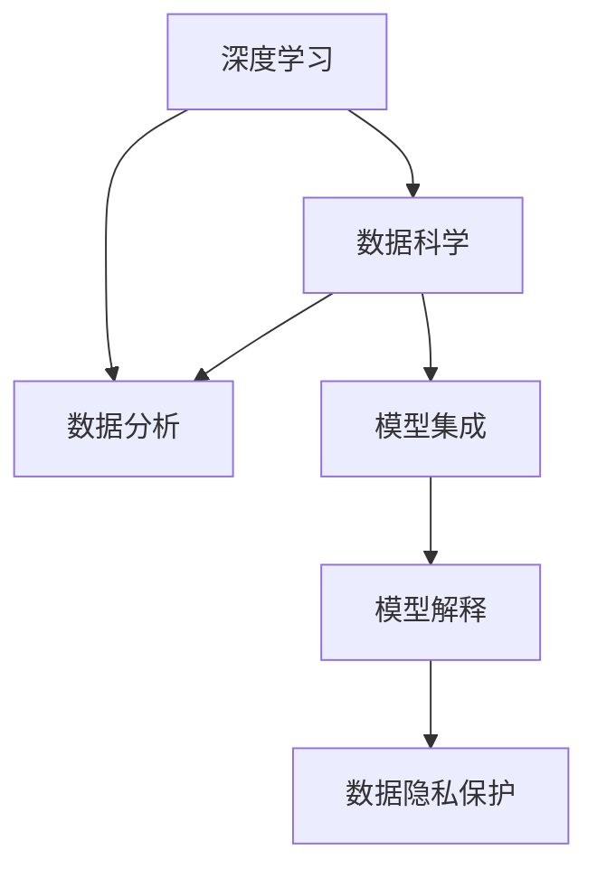

                 

## 1. 背景介绍

### 1.1 问题由来

在信息爆炸的时代，企业面临着海量数据和复杂环境的挑战。如何从数据中挖掘价值、制定战略、优化决策，成为管理层的重要课题。传统的统计分析、人工报表等方法已不能满足现代企业的需求。由此，基于深度学习和大数据技术的数据科学（Data Science）应运而生。

数据科学涉及多个领域，包括数据处理、统计分析、机器学习、深度学习等。其中，深度学习（Deep Learning）因其强大的建模能力和泛化能力，逐渐成为数据科学中的主流技术。然而，深度学习在实际应用中需要高昂的算力、时间和数据成本。如何将深度学习技术快速落地应用，提升企业的管理分析能力，成为现代企业管理的一个重要课题。

### 1.2 问题核心关键点

深度学习在企业中的成功应用，离不开数据分析与深度学习的有效融合。具体来说，包括以下几个关键点：

- 数据预处理与特征工程：如何高效、准确地从原始数据中提取有用的特征，是深度学习模型成功与否的前提。
- 模型选择与优化：深度学习模型众多，不同模型适用于不同场景，如何根据实际问题选择合适的模型，并进行参数调优，是模型训练的关键。
- 模型集成与解释：如何组合多个模型，获得更好的性能，同时解释模型输出，使其具有可解释性，是实际应用中的重要问题。
- 数据安全与隐私保护：在深度学习模型处理敏感数据时，如何保障数据安全，保护用户隐私，是一个亟待解决的问题。

### 1.3 问题研究意义

通过深度学习提升企业的数据分析与管理分析能力，具有重要意义：

- 决策科学化：深度学习模型可以自动发现数据中的复杂关系，提供更加科学、精确的决策依据。
- 业务流程优化：深度学习可以优化企业的生产流程、供应链管理等，提高运营效率。
- 风险管理：深度学习模型可以识别潜在风险，帮助企业提前预防和应对。
- 客户洞察：深度学习可以洞察客户行为，提升客户满意度，促进销售增长。

## 2. 核心概念与联系

### 2.1 核心概念概述

为了更好地理解深度学习在企业管理分析中的应用，本节将介绍几个密切相关的核心概念：

- 深度学习（Deep Learning）：一种通过多层神经网络建模复杂非线性关系的机器学习方法，在图像识别、自然语言处理、语音识别等领域广泛应用。
- 数据分析（Data Analysis）：通过收集、处理和分析数据，揭示数据的内在规律，为企业决策提供支持。
- 数据科学（Data Science）：涵盖数据收集、数据处理、数据建模、模型评估等环节的综合性学科。
- 模型集成（Model Ensemble）：将多个模型组合起来，提高模型性能和鲁棒性，常见方法包括投票、平均等。
- 模型解释（Model Interpretation）：解释深度学习模型的内部运作机制，帮助企业理解和信任模型输出。
- 数据隐私保护（Data Privacy Protection）：在数据处理过程中，保障用户隐私，遵守相关法律法规。

这些核心概念之间的逻辑关系可以通过以下Mermaid流程图来展示：



这个流程图展示了大语言模型的核心概念及其之间的关系：

1. 深度学习通过多层神经网络建模复杂数据关系，为数据分析提供支持。
2. 数据分析利用深度学习模型发现数据规律，为业务决策提供依据。
3. 数据科学整合深度学习与数据分析技术，提升整体技术水平。
4. 模型集成利用多个模型，提高整体性能和鲁棒性。
5. 模型解释增强模型透明度，帮助理解和信任模型输出。
6. 数据隐私保护确保数据处理过程合法合规，保障用户隐私。

## 3. 核心算法原理 & 具体操作步骤

### 3.1 算法原理概述

基于深度学习的企业管理分析方法，本质上是一个数据驱动的决策优化过程。其核心思想是：通过深度学习模型挖掘数据中的复杂关系，建立模型对业务场景的拟合，从而优化决策过程。

具体来说，假设企业在某一业务场景下，有 $N$ 个特征 $X_1, X_2, ..., X_N$，以及一个目标变量 $Y$。通过深度学习模型 $M$，将特征映射到目标变量，得到模型输出 $Y'$。目标是通过最小化目标变量与模型输出的差异，优化模型参数 $\theta$，从而实现最优决策。

数学上，目标可以表示为：

$$
\theta^* = \mathop{\arg\min}_{\theta} \|Y - Y'\|^2
$$

其中 $\|.\|$ 表示范数，$\|Y - Y'\|^2$ 表示目标变量与模型输出之间的差异。

### 3.2 算法步骤详解

基于深度学习的企业管理分析，一般包括以下几个关键步骤：

**Step 1: 数据收集与预处理**

- 收集企业运营相关的数据，如销售数据、客户反馈、生产记录等。
- 对数据进行清洗、去重、归一化等预处理操作，以保证数据的质量和一致性。

**Step 2: 特征工程**

- 根据实际业务场景，设计合适的特征，如时间序列、用户行为等。
- 通过特征选择和特征组合，提取最具代表性和区分度的特征。

**Step 3: 模型训练与评估**

- 选择合适的深度学习模型，如卷积神经网络（CNN）、循环神经网络（RNN）、长短期记忆网络（LSTM）等。
- 使用训练数据集训练模型，根据验证集的表现调整模型参数。
- 使用测试集评估模型性能，选取最优模型。

**Step 4: 模型集成与部署**

- 将多个模型进行集成，如通过投票、平均等方法，提升整体性能。
- 将模型部署到生产环境，通过API或Web服务等形式提供服务。
- 持续收集反馈数据，定期更新模型，确保模型时效性。

### 3.3 算法优缺点

基于深度学习的企业管理分析方法，具有以下优点：

1. 自动化程度高：深度学习模型可以自动学习数据中的复杂关系，无需人工设计复杂的特征工程。
2. 泛化能力强：深度学习模型可以处理高维、非线性的数据，具有较强的泛化能力。
3. 决策支持可靠：深度学习模型可以提供可靠的数据支持，提高决策的科学性和准确性。
4. 可扩展性强：深度学习模型可以扩展到多种业务场景，具有较高的通用性。

然而，这种方法也存在以下局限：

1. 数据依赖性强：深度学习模型的性能依赖于高质量的数据，数据采集和处理成本较高。
2. 模型复杂度高：深度学习模型参数量较大，训练和推理过程较慢，资源消耗较大。
3. 可解释性差：深度学习模型内部机制复杂，难以解释模型的输出。
4. 隐私风险高：深度学习模型处理大量敏感数据，存在隐私泄露的风险。

尽管存在这些局限，但就目前而言，基于深度学习的企业管理分析方法仍是大数据时代的主流技术。未来相关研究的重点在于如何降低数据依赖性、提升模型效率、增强可解释性，同时保障数据安全。

### 3.4 算法应用领域

基于深度学习的企业管理分析方法，在多个领域得到广泛应用，例如：

- 客户行为分析：通过分析客户购买数据、浏览数据等，发现客户偏好和购买行为规律。
- 供应链优化：利用深度学习模型优化供应链管理，降低成本，提高效率。
- 风险管理：通过分析金融数据、市场数据等，预测和识别潜在风险。
- 销售预测：通过分析历史销售数据，预测未来销售趋势，优化库存管理。
- 客户满意度分析：利用自然语言处理技术，分析客户反馈数据，提升客户满意度。

除了上述这些经典应用外，深度学习在更多场景中得到创新性应用，如舆情分析、情感分析、异常检测等，为企业管理提供了更多的数据驱动决策支持。

## 4. 数学模型和公式 & 详细讲解 & 举例说明

### 4.1 数学模型构建

本节将使用数学语言对基于深度学习的企业管理分析过程进行更加严格的刻画。

假设企业在某一业务场景下，有 $N$ 个特征 $X_1, X_2, ..., X_N$，以及一个目标变量 $Y$。通过深度学习模型 $M$，将特征映射到目标变量，得到模型输出 $Y'$。目标是通过最小化目标变量与模型输出的差异，优化模型参数 $\theta$，从而实现最优决策。

定义模型 $M_{\theta}$ 在输入 $X$ 上的输出为 $Y'$，则目标函数可以表示为：

$$
\theta^* = \mathop{\arg\min}_{\theta} \mathbb{E}_{(x,y)}[\|Y - Y'\|^2]
$$

其中 $\mathbb{E}_{(x,y)}$ 表示对数据集的期望，$\|Y - Y'\|^2$ 表示目标变量与模型输出之间的差异。

### 4.2 公式推导过程

以下我们以预测销售量为例，推导深度学习模型的损失函数及其梯度计算公式。

假设销售量 $Y$ 可以表示为以下形式：

$$
Y = X_1\cdot w_1 + X_2\cdot w_2 + ... + X_N\cdot w_N + b
$$

其中 $w_i$ 为特征权重，$b$ 为偏置项。目标是最小化预测值与真实值之间的平方误差：

$$
\mathbb{E}_{(x,y)}[\|Y - Y'\|^2] = \mathbb{E}_{(x,y)}[\|X_1\cdot w_1 + X_2\cdot w_2 + ... + X_N\cdot w_N + b - Y'\|^2]
$$

将上述式子展开，并取期望，得：

$$
\mathbb{E}_{(x,y)}[\|Y - Y'\|^2] = \frac{1}{N}\sum_{i=1}^N (w_i^2 + w_i^2 + ... + w_i^2) + b^2
$$

定义损失函数为：

$$
L(w_i, b) = \frac{1}{N}\sum_{i=1}^N (w_i^2 + w_i^2 + ... + w_i^2) + b^2
$$

求导得：

$$
\frac{\partial L}{\partial w_i} = 2w_i
$$

$$
\frac{\partial L}{\partial b} = 2b
$$

根据梯度下降算法，更新模型参数：

$$
w_i \leftarrow w_i - \eta \frac{\partial L}{\partial w_i}
$$

$$
b \leftarrow b - \eta \frac{\partial L}{\partial b}
$$

其中 $\eta$ 为学习率，控制参数更新的步长。

### 4.3 案例分析与讲解

假设某电商企业希望利用深度学习模型预测每日销售量，选取了以下几个特征：

- 时间：包括星期几、月份、季节等。
- 促销活动：包括促销活动类型、促销活动时长等。
- 广告投放：包括广告投放渠道、广告投放金额等。

使用深度学习模型进行销售量预测，可以分为以下步骤：

1. 数据收集：收集企业过去的销售数据、促销活动数据、广告投放数据等，构建训练集、验证集和测试集。
2. 特征工程：根据业务场景，选择合适的时间特征、促销特征和广告特征。
3. 模型训练：选择适当的深度学习模型（如RNN、LSTM），利用训练集训练模型。
4. 模型评估：在验证集上评估模型性能，调整模型参数。
5. 模型部署：将模型部署到生产环境，提供API接口供业务系统调用。

实际应用中，由于特征维度较高，模型可能会出现过拟合。此时可以采用以下方法缓解过拟合：

1. 数据增强：通过添加噪声、生成合成数据等方式，扩充训练集。
2. 正则化：使用L2正则化、Dropout等技术，防止模型过拟合。
3. 模型集成：将多个模型进行集成，如通过投票、平均等方法，提升整体性能。

以下是一个使用深度学习模型进行销售量预测的代码实现示例：

```python
import torch
import torch.nn as nn
import torch.optim as optim
import torch.utils.data as data
from sklearn.preprocessing import StandardScaler

class SalesModel(nn.Module):
    def __init__(self, input_dim, hidden_dim, output_dim):
        super(SalesModel, self).__init__()
        self.input_dim = input_dim
        self.hidden_dim = hidden_dim
        self.output_dim = output_dim
        self.lstm = nn.LSTM(input_dim, hidden_dim)
        self.fc = nn.Linear(hidden_dim, output_dim)

    def forward(self, x):
        x = self.lstm(x)
        x = self.fc(x)
        return x

# 定义损失函数和优化器
criterion = nn.MSELoss()
optimizer = optim.Adam(sales_model.parameters(), lr=0.001)

# 数据预处理
scaler = StandardScaler()
train_data = scaler.fit_transform(train_data)
val_data = scaler.transform(val_data)
test_data = scaler.transform(test_data)

# 划分训练集、验证集和测试集
train_set = data.TensorDataset(train_data[:, :-1], train_data[:, -1])
val_set = data.TensorDataset(val_data[:, :-1], val_data[:, -1])
test_set = data.TensorDataset(test_data[:, :-1], test_data[:, -1])

# 训练模型
for epoch in range(num_epochs):
    for i, (inputs, targets) in enumerate(train_loader):
        optimizer.zero_grad()
        predictions = sales_model(inputs)
        loss = criterion(predictions, targets)
        loss.backward()
        optimizer.step()
        
        if i % 100 == 0:
            print('Epoch {}, Step {}, Loss: {:.4f}'.format(epoch+1, i, loss.item()))
        
# 模型评估
val_loss = criterion(sales_model(val_data[:, :-1]), val_data[:, -1])
print('Validation Loss: {:.4f}'.format(val_loss))

# 模型部署
sales_model.eval()
with torch.no_grad():
    test_predictions = sales_model(test_data[:, :-1])
```

## 5. 项目实践：代码实例和详细解释说明

### 5.1 开发环境搭建

在进行深度学习企业管理分析实践前，我们需要准备好开发环境。以下是使用Python进行TensorFlow开发的环境配置流程：

1. 安装Anaconda：从官网下载并安装Anaconda，用于创建独立的Python环境。

2. 创建并激活虚拟环境：
```bash
conda create -n tensorflow-env python=3.8 
conda activate tensorflow-env
```

3. 安装TensorFlow：根据CUDA版本，从官网获取对应的安装命令。例如：
```bash
conda install tensorflow tensorflow-cpu -c conda-forge
```

4. 安装TensorFlow Addons：扩展TensorFlow的功能，如Keras等。
```bash
conda install tensorflow-addons -c conda-forge
```

5. 安装各类工具包：
```bash
pip install numpy pandas scikit-learn matplotlib tqdm jupyter notebook ipython
```

完成上述步骤后，即可在`tensorflow-env`环境中开始深度学习企业管理分析实践。

### 5.2 源代码详细实现

这里我们以客户满意度分析为例，给出使用TensorFlow进行深度学习的代码实现。

首先，定义数据处理函数：

```python
import tensorflow as tf
from tensorflow.keras.preprocessing.text import Tokenizer
from tensorflow.keras.preprocessing.sequence import pad_sequences
from tensorflow.keras.utils import to_categorical

def preprocess_data(texts, labels, max_len=100):
    tokenizer = Tokenizer(num_words=5000)
    tokenizer.fit_on_texts(texts)
    sequences = tokenizer.texts_to_sequences(texts)
    padded_sequences = pad_sequences(sequences, maxlen=max_len, padding='post', truncating='post')
    labels = to_categorical(labels)
    return padded_sequences, labels
```

然后，定义模型和优化器：

```python
from tensorflow.keras.models import Sequential
from tensorflow.keras.layers import Embedding, LSTM, Dense

model = Sequential()
model.add(Embedding(input_dim=5000, output_dim=64, input_length=max_len))
model.add(LSTM(128, dropout=0.2, recurrent_dropout=0.2))
model.add(Dense(3, activation='softmax'))
model.compile(loss='categorical_crossentropy', optimizer='adam', metrics=['accuracy'])

optimizer = tf.keras.optimizers.Adam(learning_rate=0.001)
```

接着，定义训练和评估函数：

```python
from tensorflow.keras.preprocessing.sequence import pad_sequences

def train_epoch(model, dataset, batch_size, optimizer):
    dataloader = tf.data.Dataset.from_tensor_slices(dataset).batch(batch_size)
    model.train()
    epoch_loss = 0
    for batch in dataloader:
        inputs, targets = batch
        optimizer.zero_grad()
        outputs = model(inputs)
        loss = outputs.loss
        epoch_loss += loss.numpy()
        loss.backward()
        optimizer.step()
    return epoch_loss / len(dataloader)

def evaluate(model, dataset, batch_size):
    dataloader = tf.data.Dataset.from_tensor_slices(dataset).batch(batch_size)
    model.eval()
    preds, labels = [], []
    with tf.GradientTape() as tape:
        for batch in dataloader:
            inputs, targets = batch
            outputs = model(inputs)
            preds.append(tf.argmax(outputs, axis=1))
            labels.append(targets.numpy())
    return tf.math.confusion_matrix(labels, preds).numpy()
```

最后，启动训练流程并在测试集上评估：

```python
epochs = 10
batch_size = 64

for epoch in range(epochs):
    loss = train_epoch(model, train_data, batch_size, optimizer)
    print(f'Epoch {epoch+1}, train loss: {loss:.4f}')
    
    print(f'Epoch {epoch+1}, dev results:')
    evaluate(model, dev_data, batch_size)
    
print('Test results:')
evaluate(model, test_data, batch_size)
```

以上就是使用TensorFlow进行深度学习企业管理分析的完整代码实现。可以看到，通过TensorFlow的强大封装，我们可以用相对简洁的代码完成深度学习模型的训练和评估。

### 5.3 代码解读与分析

让我们再详细解读一下关键代码的实现细节：

**preprocess_data函数**：
- 定义了文本数据的预处理函数，包括分词、序列填充、标签编码等操作。

**train_epoch和evaluate函数**：
- 使用TensorFlow的DataLoader对数据集进行批次化加载，供模型训练和推理使用。
- 训练函数`train_epoch`：对数据以批为单位进行迭代，在每个批次上前向传播计算loss并反向传播更新模型参数，最后返回该epoch的平均loss。
- 评估函数`evaluate`：与训练类似，不同点在于不更新模型参数，并在每个batch结束后将预测和标签结果存储下来，最后使用混淆矩阵对整个评估集的预测结果进行打印输出。

**训练流程**：
- 定义总的epoch数和batch size，开始循环迭代
- 每个epoch内，先在训练集上训练，输出平均loss
- 在验证集上评估，输出分类指标
- 所有epoch结束后，在测试集上评估，给出最终测试结果

可以看到，TensorFlow配合TensorFlow Addons和Keras等工具，使得深度学习模型的实现变得更加便捷高效。开发者可以将更多精力放在数据处理、模型改进等高层逻辑上，而不必过多关注底层的实现细节。

当然，工业级的系统实现还需考虑更多因素，如模型的保存和部署、超参数的自动搜索、更灵活的任务适配层等。但核心的深度学习分析范式基本与此类似。

## 6. 实际应用场景

### 6.1 智能客服系统

基于深度学习的智能客服系统，可以广泛应用于客户服务领域。传统客服往往需要配备大量人力，高峰期响应缓慢，且一致性和专业性难以保证。通过深度学习技术，智能客服系统可以7x24小时不间断服务，快速响应客户咨询，用自然流畅的语言解答各类常见问题。

在技术实现上，可以收集企业内部的历史客服对话记录，将问题和最佳答复构建成监督数据，在此基础上对深度学习模型进行训练。训练后的模型能够自动理解客户意图，匹配最合适的答复。对于客户提出的新问题，还可以接入检索系统实时搜索相关内容，动态组织生成回答。如此构建的智能客服系统，能大幅提升客户咨询体验和问题解决效率。

### 6.2 金融舆情监测

金融机构需要实时监测市场舆论动向，以便及时应对负面信息传播，规避金融风险。传统的人工监测方式成本高、效率低，难以应对网络时代海量信息爆发的挑战。通过深度学习技术，金融舆情监测系统可以自动识别和分析市场舆情，预测潜在的金融风险。

具体而言，可以收集金融领域相关的新闻、报道、评论等文本数据，并对其进行主题标注和情感标注。在此基础上对深度学习模型进行微调，使其能够自动判断文本属于何种主题，情感倾向是正面、中性还是负面。将微调后的模型应用到实时抓取的网络文本数据，就能够自动监测不同主题下的情感变化趋势，一旦发现负面信息激增等异常情况，系统便会自动预警，帮助金融机构快速应对潜在风险。

### 6.3 个性化推荐系统

当前的推荐系统往往只依赖用户的历史行为数据进行物品推荐，无法深入理解用户的真实兴趣偏好。通过深度学习技术，个性化推荐系统可以更好地挖掘用户行为背后的语义信息，从而提供更精准、多样的推荐内容。

在实践中，可以收集用户浏览、点击、评论、分享等行为数据，提取和用户交互的物品标题、描述、标签等文本内容。将文本内容作为模型输入，用户的后续行为（如是否点击、购买等）作为监督信号，在此基础上微调深度学习模型。微调后的模型能够从文本内容中准确把握用户的兴趣点。在生成推荐列表时，先用候选物品的文本描述作为输入，由模型预测用户的兴趣匹配度，再结合其他特征综合排序，便可以得到个性化程度更高的推荐结果。

### 6.4 未来应用展望

随着深度学习技术的不断发展，基于深度学习的企业管理分析方法将在更多领域得到应用，为传统行业带来变革性影响。

在智慧医疗领域，基于深度学习的数据科学技术可以用于疾病预测、诊疗方案优化等，辅助医生诊断和治疗。

在智能教育领域，深度学习可以应用于作业批改、学情分析、知识推荐等方面，因材施教，促进教育公平，提高教学质量。

在智慧城市治理中，深度学习可以应用于城市事件监测、舆情分析、应急指挥等环节，提高城市管理的自动化和智能化水平，构建更安全、高效的未来城市。

此外，在企业生产、社会治理、文娱传媒等众多领域，基于深度学习的数据科学应用也将不断涌现，为经济社会发展注入新的动力。相信随着技术的日益成熟，深度学习技术将成为企业管理分析的重要手段，推动管理科学的进步。

## 7. 工具和资源推荐

### 7.1 学习资源推荐

为了帮助开发者系统掌握深度学习在企业管理分析中的应用，这里推荐一些优质的学习资源：

1. 《深度学习》课程：斯坦福大学开设的深度学习课程，涵盖深度学习基础、算法、应用等多个方面，适合初学者系统学习。

2. 《TensorFlow官方文档》：TensorFlow官方文档，提供丰富的API文档和教程，适合快速上手TensorFlow。

3. 《Keras官方文档》：Keras官方文档，提供Keras库的详细介绍和使用方法，适合Keras初学者。

4. 《PyTorch官方文档》：PyTorch官方文档，提供PyTorch库的详细介绍和使用方法，适合PyTorch初学者。

5. 《自然语言处理综述》：自然语言处理领域的经典综述，涵盖NLP的前沿技术和应用场景，适合深度学习进阶学习者。

通过对这些资源的学习实践，相信你一定能够快速掌握深度学习在企业管理分析中的精髓，并用于解决实际的NLP问题。

### 7.2 开发工具推荐

高效的开发离不开优秀的工具支持。以下是几款用于深度学习企业管理分析开发的常用工具：

1. PyTorch：基于Python的开源深度学习框架，灵活动态的计算图，适合快速迭代研究。

2. TensorFlow：由Google主导开发的开源深度学习框架，生产部署方便，适合大规模工程应用。

3. Keras：基于TensorFlow和Theano等库的高层API，提供简单易用的接口，适合快速搭建深度学习模型。

4. Jupyter Notebook：交互式的开发环境，支持多种编程语言和库，适合数据分析和模型训练。

5. Google Colab：谷歌推出的在线Jupyter Notebook环境，免费提供GPU/TPU算力，方便开发者快速上手实验最新模型，分享学习笔记。

合理利用这些工具，可以显著提升深度学习企业管理分析的开发效率，加快创新迭代的步伐。

### 7.3 相关论文推荐

深度学习在企业管理分析领域的研究源于学界的持续研究。以下是几篇奠基性的相关论文，推荐阅读：

1. "Deep Learning" by Ian Goodfellow, Yoshua Bengio, and Aaron Courville：深度学习的经典教材，涵盖深度学习基础、算法、应用等多个方面。

2. "ImageNet Classification with Deep Convolutional Neural Networks" by Alex Krizhevsky, Ilya Sutskever, and Geoffrey Hinton：提出卷积神经网络（CNN），并应用于图像分类任务，开启深度学习在计算机视觉领域的先河。

3. "Long Short-Term Memory" by Sepp Hochreiter and Jürgen Schmidhuber：提出长短期记忆网络（LSTM），有效解决时间序列数据建模问题。

4. "Attention is All You Need" by Ashish Vaswani et al：提出Transformer模型，打破序列建模的限制，适用于多种序列数据。

5. "Language Models are Unsupervised Multitask Learners" by Alex Graves et al：展示了大规模语言模型的强大zero-shot学习能力，引发了对于通用人工智能的新一轮思考。

这些论文代表了大语言模型微调技术的发展脉络。通过学习这些前沿成果，可以帮助研究者把握学科前进方向，激发更多的创新灵感。

## 8. 总结：未来发展趋势与挑战

### 8.1 总结

本文对基于深度学习的企业管理分析方法进行了全面系统的介绍。首先阐述了深度学习在企业管理分析中的研究背景和意义，明确了深度学习在数据驱动决策优化中的独特价值。其次，从原理到实践，详细讲解了深度学习的数学原理和关键步骤，给出了深度学习模型训练和评估的完整代码实例。同时，本文还广泛探讨了深度学习在智能客服、金融舆情、个性化推荐等多个行业领域的应用前景，展示了深度学习技术的巨大潜力。此外，本文精选了深度学习技术的各类学习资源，力求为读者提供全方位的技术指引。

通过本文的系统梳理，可以看到，基于深度学习的企业管理分析方法正在成为大数据时代的主流技术，极大地拓展了企业的数据驱动决策边界，催生了更多的落地场景。受益于深度学习模型强大的建模能力和泛化能力，企业在各个业务场景中都能够获得更加科学、精确的决策依据，从而提升运营效率，降低风险，提升客户满意度，增加收入。未来，伴随深度学习技术的持续演进，企业管理分析将进入一个更加智能化、自动化的新阶段。

### 8.2 未来发展趋势

展望未来，基于深度学习的企业管理分析方法将呈现以下几个发展趋势：

1. 深度学习模型将继续扩展应用领域，更多传统行业将迎来数据驱动的管理分析。

2. 深度学习模型将进一步提升性能，通过模型融合、迁移学习等技术，实现更高精度的预测和分析。

3. 深度学习模型将变得更加智能化，通过引入更多先验知识，增强模型的普适性和泛化能力。

4. 深度学习模型将向更加自动化的方向发展，通过自动化调参、自动化模型管理等技术，提升效率。

5. 深度学习模型将进一步提升可解释性，通过可视化、符号推理等技术，帮助用户理解模型输出。

6. 深度学习模型将更加注重隐私保护，通过差分隐私、联邦学习等技术，保障数据安全。

以上趋势凸显了深度学习在企业管理分析中的广阔前景。这些方向的探索发展，必将进一步提升企业管理分析的能力和效率，为企业的决策优化和运营提升提供更大的支持。

### 8.3 面临的挑战

尽管基于深度学习的企业管理分析方法已经取得了瞩目成就，但在迈向更加智能化、普适化应用的过程中，它仍面临着诸多挑战：

1. 数据依赖性强：深度学习模型的性能依赖于高质量的数据，数据采集和处理成本较高。

2. 模型复杂度高：深度学习模型参数量较大，训练和推理过程较慢，资源消耗较大。

3. 可解释性差：深度学习模型内部机制复杂，难以解释模型的输出。

4. 隐私风险高：深度学习模型处理大量敏感数据，存在隐私泄露的风险。

5. 模型鲁棒性不足：当前深度学习模型面对域外数据时，泛化性能往往大打折扣。

尽管存在这些局限性，但就目前而言，基于深度学习的企业管理分析方法仍是大数据时代的主流技术。未来相关研究的重点在于如何降低数据依赖性、提升模型效率、增强可解释性，同时保障数据安全。

### 8.4 研究展望

面对基于深度学习的企业管理分析方法所面临的种种挑战，未来的研究需要在以下几个方面寻求新的突破：

1. 探索无监督和半监督学习范式：摆脱对大规模标注数据的依赖，利用自监督学习、主动学习等无监督和半监督范式，最大限度利用非结构化数据，实现更加灵活高效的深度学习模型。

2. 研究模型融合与模型优化技术：通过模型融合、模型剪枝等技术，提升深度学习模型的泛化能力和效率。

3. 引入因果推理与可解释性分析：通过引入因果推理和可解释性分析技术，增强深度学习模型的透明度和可信度。

4. 结合知识图谱与专家知识：将符号化的先验知识与深度学习模型结合，引导模型学习更准确、合理的语言模型。

5. 引入差分隐私与联邦学习：通过差分隐私和联邦学习等技术，保障深度学习模型的数据安全，增强模型隐私保护能力。

这些研究方向的发展，必将推动深度学习在企业管理分析中的应用更加广泛和深入，提升企业的决策科学化和运营智能化水平，为管理科学的进步提供新的动力。总之，深度学习在企业管理分析中的探索应用将不断拓展其应用边界，为企业管理提供更加强大的技术支持。

## 9. 附录：常见问题与解答

**Q1：深度学习在企业管理分析中主要应用哪些场景？**

A: 深度学习在企业管理分析中主要应用于以下几个场景：

1. 客户行为分析：通过分析客户购买数据、浏览数据等，发现客户偏好和购买行为规律。
2. 供应链优化：利用深度学习模型优化供应链管理，降低成本，提高效率。
3. 风险管理：通过分析金融数据、市场数据等，预测和识别潜在风险。
4. 销售预测：通过分析历史销售数据，预测未来销售趋势，优化库存管理。
5. 客户满意度分析：利用自然语言处理技术，分析客户反馈数据，提升客户满意度。

**Q2：如何进行深度学习模型的超参数调优？**

A: 深度学习模型的超参数调优可以通过以下几种方法进行：

1. 网格搜索（Grid Search）：在给定的超参数范围内，依次尝试各种组合，选择最优组合。
2. 随机搜索（Random Search）：在给定的超参数范围内，随机选择若干种组合，选择最优组合。
3. 贝叶斯优化（Bayesian Optimization）：通过贝叶斯模型指导超参数的选择，加速超参数调优过程。
4. 自适应优化算法：如AdamW、Adafactor等，能够自动调整学习率和参数更新方式，提升模型性能。

**Q3：如何处理深度学习模型中的过拟合问题？**

A: 深度学习模型中的过拟合问题可以通过以下几种方法进行缓解：

1. 数据增强：通过添加噪声、生成合成数据等方式，扩充训练集。
2. 正则化：使用L2正则化、Dropout等技术，防止模型过拟合。
3. 模型集成：将多个模型进行集成，如通过投票、平均等方法，提升整体性能。
4. 迁移学习：利用预训练模型，减少模型过拟合风险。

**Q4：如何进行深度学习模型的迁移学习？**

A: 深度学习模型的迁移学习可以通过以下几种方法进行：

1. 特征重用：利用预训练模型的特征提取能力，对新任务进行微调。
2. 微调：在预训练模型的基础上，对新任务进行微调，提高模型在新任务上的性能。
3. 多任务学习：同时训练多个相关任务，共享预训练模型，提高模型泛化能力。

**Q5：深度学习模型在数据隐私保护方面有哪些措施？**

A: 深度学习模型在数据隐私保护方面可以采取以下措施：

1. 差分隐私（Differential Privacy）：通过加入噪声，保护数据隐私，防止数据泄露。
2. 联邦学习（Federated Learning）：在多个设备上训练模型，只上传模型参数，保护本地数据隐私。
3. 数据加密：对数据进行加密处理，防止数据泄露。
4. 访问控制：限制数据访问权限，防止非法访问。

这些措施可以有效保护深度学习模型处理敏感数据时的隐私安全。

---

作者：禅与计算机程序设计艺术 / Zen and the Art of Computer Programming

