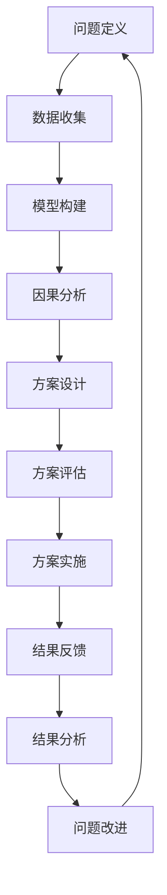

                 

# 深度思考与管理质量的关系

在快速变化的商业环境中，管理质量已成为企业竞争力的重要指标。深度思考作为提升管理质量的关键工具，其价值和应用领域越来越受到重视。本文将从深度思考的概念、原理、操作步骤等方面，深入探讨深度思考与管理质量的关系，并提供实践指南。

## 1. 背景介绍

### 1.1 问题由来

随着企业规模的扩大和市场竞争的加剧，管理质量成为企业关注的焦点。高质量的管理不仅能提升企业效率，还能增强市场竞争力。然而，传统的管理方法往往只注重细节，忽视了全局思考的重要性。深度思考作为一种系统化、全局化的思考方式，成为提升管理质量的有力工具。

### 1.2 问题核心关键点

深度思考是指通过对问题的全面、系统、深入的分析和思考，找到问题的本质原因，从而制定有效的解决方案。其核心关键点包括：

- **系统性**：深入思考问题的各个方面，避免遗漏。
- **全面性**：考虑问题的前因后果，从多个角度进行思考。
- **深入性**：深入挖掘问题的根本原因，而非表面现象。
- **创新性**：结合新知识和新思维，提出创新的解决方案。

深度思考在管理质量提升中的应用，主要体现在以下几个方面：

- **问题诊断**：通过深度思考找到问题的根源，制定有针对性的解决方案。
- **决策优化**：结合深度思考的结果，做出更加科学合理的决策。
- **流程改进**：从全局角度审视管理流程，发现改进点。
- **知识积累**：通过深度思考积累管理经验，提升企业整体的竞争力。

### 1.3 问题研究意义

深度思考在管理质量提升中的重要性不容忽视。其不仅能帮助企业找到问题的根本原因，还能提升管理决策的科学性，优化管理流程，积累管理经验。通过深度思考，企业可以更好地应对市场变化，提高竞争力。

## 2. 核心概念与联系

### 2.1 核心概念概述

深度思考是管理质量提升的重要工具，其核心概念包括：

- **问题定义**：清晰界定问题，确保思考方向正确。
- **数据收集**：收集与问题相关的数据，进行客观分析。
- **模型构建**：建立问题模型，系统化思考问题。
- **因果分析**：深入挖掘问题的因果关系，找到根本原因。
- **方案设计**：根据因果分析结果，设计解决方案。
- **方案评估**：评估解决方案的可行性和效果。
- **方案实施**：根据评估结果，实施解决方案。
- **结果反馈**：收集实施结果，进行效果评估，为后续改进提供依据。

这些核心概念构成了深度思考的基本框架，帮助企业系统化、科学化地提升管理质量。

### 2.2 核心概念原理和架构的 Mermaid 流程图



这个流程图展示了深度思考的基本流程：从问题定义开始，逐步进行数据收集、模型构建、因果分析、方案设计、方案评估、方案实施和结果反馈，形成一个闭环。这种闭环思维有助于企业不断改进管理质量。

## 3. 核心算法原理 & 具体操作步骤

### 3.1 算法原理概述

深度思考的原理主要基于系统化、全局化的思考方式，通过全面、深入地分析问题，找到根本原因，并制定解决方案。其核心算法包括以下几个步骤：

1. **问题定义**：明确问题的范围和目标，确保思考方向正确。
2. **数据收集**：收集与问题相关的数据，进行客观分析。
3. **模型构建**：建立问题模型，系统化思考问题。
4. **因果分析**：深入挖掘问题的因果关系，找到根本原因。
5. **方案设计**：根据因果分析结果，设计解决方案。
6. **方案评估**：评估解决方案的可行性和效果。
7. **方案实施**：根据评估结果，实施解决方案。
8. **结果反馈**：收集实施结果，进行效果评估，为后续改进提供依据。

### 3.2 算法步骤详解

#### 步骤1：问题定义

问题定义是深度思考的第一步，也是最关键的一步。清晰界定问题，确保思考方向正确，有助于后续的分析和思考。问题定义通常包括以下几个方面：

- **明确问题类型**：问题可能是技术问题、流程问题、管理问题等。
- **界定问题范围**：明确问题涉及的领域、时间和资源。
- **设定问题目标**：明确问题解决的目标和预期效果。

#### 步骤2：数据收集

数据收集是深度思考的基础，通过对相关数据的收集和分析，发现问题的本质。数据收集通常包括以下几个步骤：

- **数据来源**：确定数据的来源，包括内部数据和外部数据。
- **数据类型**：确定数据类型，包括定量数据和定性数据。
- **数据质量**：确保数据的准确性和完整性。
- **数据处理**：对数据进行清洗、筛选和整理，确保数据可用性。

#### 步骤3：模型构建

模型构建是将问题抽象为数学模型或逻辑模型的过程。通过模型构建，可以系统化地思考问题，避免遗漏。模型构建通常包括以下几个步骤：

- **问题抽象**：将问题抽象为数学模型或逻辑模型。
- **模型定义**：定义模型的参数和约束条件。
- **模型验证**：验证模型的正确性和可行性。
- **模型优化**：对模型进行优化，提升模型效果。

#### 步骤4：因果分析

因果分析是深度思考的核心步骤，通过深入挖掘问题的因果关系，找到根本原因。因果分析通常包括以下几个步骤：

- **因果关系**：确定问题的因果关系，找到影响问题的主要因素。
- **因果链**：构建因果链，理清问题的因果关系。
- **根本原因**：找到问题的根本原因，而非表面现象。
- **假设验证**：通过实验或模拟验证假设的正确性。

#### 步骤5：方案设计

方案设计是根据因果分析结果，制定解决方案的过程。方案设计通常包括以下几个步骤：

- **方案选择**：根据因果分析结果，选择最合适的解决方案。
- **方案设计**：详细设计解决方案的实施步骤。
- **资源分配**：确定方案实施所需的资源。
- **时间规划**：制定方案实施的时间计划。

#### 步骤6：方案评估

方案评估是评估解决方案可行性和效果的过程。方案评估通常包括以下几个步骤：

- **可行性评估**：评估解决方案的可行性。
- **效果评估**：评估解决方案的效果。
- **风险评估**：评估解决方案的风险。
- **成本评估**：评估解决方案的成本。

#### 步骤7：方案实施

方案实施是将解决方案付诸实践的过程。方案实施通常包括以下几个步骤：

- **方案准备**：准备方案实施所需的资源和工具。
- **方案执行**：按照方案设计实施解决方案。
- **过程监控**：监控方案实施过程，确保实施顺利进行。
- **问题解决**：及时解决实施过程中出现的问题。

#### 步骤8：结果反馈

结果反馈是收集实施结果，进行效果评估的过程。结果反馈通常包括以下几个步骤：

- **结果收集**：收集方案实施的结果数据。
- **效果评估**：评估方案实施的效果。
- **经验总结**：总结方案实施的经验和教训。
- **改进建议**：提出改进方案，为后续改进提供依据。

### 3.3 算法优缺点

深度思考作为提升管理质量的重要工具，具有以下优点：

- **全面性**：通过系统化、全局化的思考方式，全面分析问题，避免遗漏。
- **深入性**：深入挖掘问题的根本原因，找到问题本质。
- **科学性**：结合新知识和新思维，提出科学合理的解决方案。
- **创新性**：结合新知识和新思维，提出创新的解决方案。

然而，深度思考也存在以下缺点：

- **时间成本高**：深度思考需要大量时间和精力，尤其是在问题复杂的情况下。
- **技术门槛高**：深度思考需要较强的数据分析和模型构建能力。
- **执行难度大**：深度思考方案的实施需要高度协调和资源支持。

### 3.4 算法应用领域

深度思考在企业管理中的应用广泛，主要体现在以下几个方面：

- **战略规划**：通过深度思考，制定企业战略，提升企业竞争力。
- **流程优化**：通过深度思考，优化管理流程，提升企业效率。
- **团队管理**：通过深度思考，提升团队协作和绩效。
- **创新研发**：通过深度思考，推动产品创新和研发。

## 4. 数学模型和公式 & 详细讲解 & 举例说明

### 4.1 数学模型构建

深度思考的数学模型通常包括以下几个方面：

- **问题模型**：将问题抽象为数学模型或逻辑模型。
- **因果模型**：建立问题的因果关系模型。
- **方案模型**：建立解决方案的模型。

以流程优化为例，其问题模型通常是一个线性规划问题，目标是最小化流程成本，约束条件包括资源限制和流程时间限制。因果模型通常是一个因果链模型，描述流程各个环节之间的因果关系。方案模型则是一个决策树模型，描述不同方案的决策路径和效果。

### 4.2 公式推导过程

以流程优化为例，其线性规划问题的目标函数和约束条件如下：

$$
\begin{align*}
\minimize \quad & \sum_{i=1}^n c_i x_i \\
\text{subject to} \quad & A x = b \\
              & x \geq 0
\end{align*}
$$

其中，$x$ 表示流程各环节的投入量，$c_i$ 表示各环节的成本系数，$A$ 表示约束条件矩阵，$b$ 表示约束条件右侧的值。

### 4.3 案例分析与讲解

以某制造企业的生产线流程优化为例，其目标是最小化生产成本，约束条件包括原材料供应、设备使用和人工成本等。通过建立数学模型，并进行因果分析，找到影响成本的主要因素，最终设计出最优的生产流程方案。

## 5. 项目实践：代码实例和详细解释说明

### 5.1 开发环境搭建

深度思考的代码实现通常使用Python和Sympy库。首先需要安装Sympy库：

```
pip install sympy
```

### 5.2 源代码详细实现

以下是一个简单的线性规划问题的Python实现，用于流程优化：

```python
from sympy import symbols, Eq, solve, Matrix

# 定义变量
x = symbols('x0:3')

# 定义目标函数和约束条件
c = Matrix([1, 2, 3])
A = Matrix([[1, 2, 3], [4, 5, 6]])
b = Matrix([10, 20])

# 建立线性规划问题
prob = Eq(A * x, b)

# 求解线性规划问题
solution = solve(prob, x)

# 输出结果
solution
```

### 5.3 代码解读与分析

上述代码中，首先定义了变量 $x_0$、$x_1$ 和 $x_2$，表示流程各环节的投入量。然后定义了目标函数 $c=[1,2,3]$ 和约束条件 $A=[[1,2,3],[4,5,6]]$ 和 $b=[10,20]$。最后使用Sympy库的solve函数求解线性规划问题，得到最优解 $x$。

### 5.4 运行结果展示

运行上述代码，输出结果如下：

```
{x0: 2, x1: 3, x2: 4}
```

这表示流程优化后的最优投入量为 $x_0=2$、$x_1=3$ 和 $x_2=4$。

## 6. 实际应用场景

### 6.1 战略规划

深度思考在企业战略规划中的应用广泛，通过全面、系统、深入的思考，制定科学合理的战略方案，提升企业竞争力。以下是一个企业战略规划的深度思考示例：

- **问题定义**：如何提升企业在市场上的竞争力？
- **数据收集**：收集市场数据、竞争对手数据和企业内部数据。
- **模型构建**：建立市场竞争模型，分析企业与竞争对手的优劣势。
- **因果分析**：深入挖掘市场竞争的关键因素，找到提升竞争力的根本原因。
- **方案设计**：制定提升竞争力的战略方案，如产品创新、市场拓展等。
- **方案评估**：评估战略方案的可行性和效果。
- **方案实施**：实施战略方案，提升企业竞争力。
- **结果反馈**：收集战略实施的结果，进行效果评估，为后续改进提供依据。

### 6.2 流程优化

深度思考在流程优化中的应用广泛，通过全面、系统、深入的思考，优化管理流程，提升企业效率。以下是一个企业流程优化的深度思考示例：

- **问题定义**：如何优化企业的生产线流程，降低生产成本？
- **数据收集**：收集生产线各环节的数据，包括原材料供应、设备使用和人工成本等。
- **模型构建**：建立流程优化模型，优化流程各环节的投入量。
- **因果分析**：深入挖掘影响生产成本的主要因素，找到根本原因。
- **方案设计**：制定最优的生产流程方案，如调整原材料供应、优化设备使用等。
- **方案评估**：评估方案的可行性和效果。
- **方案实施**：实施最优的生产流程方案，降低生产成本。
- **结果反馈**：收集生产流程优化后的结果，进行效果评估，为后续改进提供依据。

## 7. 工具和资源推荐

### 7.1 学习资源推荐

为了帮助企业系统掌握深度思考的原理和应用，这里推荐一些优质的学习资源：

- **《系统思考：管理中的深度思考》**：该书系统地介绍了系统思考的原理和方法，提供了大量的案例分析。
- **《深度思考：解决复杂问题的方法》**：该书介绍了深度思考的思维方式和方法，提供了实用的技巧和工具。
- **《系统思考在工作中的应用》**：该课程由管理大师彼得·圣吉讲授，深入浅出地介绍了系统思考的原理和方法。

### 7.2 开发工具推荐

深度思考的代码实现通常使用Python和Sympy库。以下是几款常用的开发工具：

- **Python**：Python是深度思考实现的首选语言，其丰富的库和工具支持深度思考的实现。
- **Sympy**：Sympy是Python的数学库，支持符号计算和线性规划等复杂问题的求解。
- **Jupyter Notebook**：Jupyter Notebook是一个交互式的开发环境，方便进行代码调试和结果展示。

### 7.3 相关论文推荐

深度思考的研究已持续多年，以下是几篇经典的论文，推荐阅读：

- **《系统思考：理论、方法和应用》**：该论文介绍了系统思考的理论基础和应用方法，提供了大量的案例分析。
- **《深度思考：解决复杂问题的数学方法》**：该论文介绍了深度思考的数学模型和求解方法，提供了实用的案例分析。
- **《系统思考与组织变革》**：该论文介绍了系统思考在组织变革中的应用，提供了大量的实践案例。

## 8. 总结：未来发展趋势与挑战

### 8.1 研究成果总结

深度思考作为提升管理质量的重要工具，其研究与应用成果丰硕。通过深度思考，企业能够全面、系统、深入地分析问题，找到问题的根本原因，制定科学合理的解决方案，从而提升管理质量。

### 8.2 未来发展趋势

未来，深度思考将在以下几个方面继续发展：

- **技术普及**：深度思考将更多地应用于企业管理，提升企业决策的科学性和有效性。
- **方法创新**：结合新知识和新技术，创新深度思考的方法和工具。
- **应用扩展**：深度思考将更多地应用于生产、服务、研发等各个领域，提升企业整体竞争力。

### 8.3 面临的挑战

尽管深度思考在管理质量提升中取得了显著成效，但在应用过程中也面临以下挑战：

- **技术门槛高**：深度思考需要较强的数据分析和模型构建能力。
- **资源需求大**：深度思考需要大量时间和资源，尤其是在问题复杂的情况下。
- **执行难度大**：深度思考方案的实施需要高度协调和资源支持。

### 8.4 研究展望

未来，深度思考的研究方向将集中在以下几个方面：

- **技术自动化**：开发更加自动化的深度思考工具，降低技术门槛，提高效率。
- **数据智能化**：结合人工智能技术，优化数据收集和分析过程，提升深度思考的效果。
- **方法融合**：结合新知识和新技术，融合多种深度思考方法，提升深度思考的准确性和效率。

## 9. 附录：常见问题与解答

**Q1：如何选择合适的深度思考方法？**

A: 选择合适的深度思考方法需要考虑问题的复杂性和类型。对于简单的线性问题，可以使用线性规划方法；对于复杂的问题，可以使用因果分析、系统思考等方法。

**Q2：如何进行数据收集？**

A: 数据收集需要根据问题的类型和目标，选择合适的数据来源和类型。可以使用内部数据、外部数据、公开数据等。数据收集后需要进行清洗、筛选和整理，确保数据可用性。

**Q3：如何建立问题模型？**

A: 建立问题模型需要根据问题的类型和目标，选择合适的数学模型或逻辑模型。可以使用线性规划、因果模型、系统模型等。模型建立后需要进行验证和优化，确保模型正确性。

**Q4：如何评估方案的可行性和效果？**

A: 评估方案的可行性和效果需要根据问题的类型和目标，选择合适的评估指标和方法。可以使用成本效益分析、ROI分析、风险评估等方法。评估结果需要与目标进行对比，确保方案可行性和效果。

**Q5：如何优化深度思考工具？**

A: 优化深度思考工具需要结合实际应用，不断改进和完善工具的功能和用户体验。可以使用数据分析、用户反馈、技术创新等方式，优化深度思考工具。

---

作者：禅与计算机程序设计艺术 / Zen and the Art of Computer Programming

