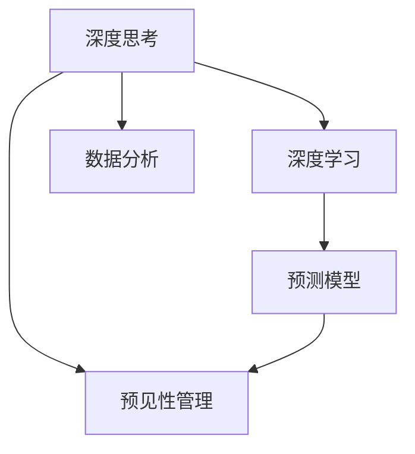

                 

# 深度思考与管理预见性的关系

## 1. 背景介绍

在当今高度动态和竞争激烈的市场环境中，预见性管理成为了企业成功的重要因素。随着人工智能（AI）和深度学习（DL）技术的飞速发展，深度思考（Deep Thinking）在预见性管理中扮演着越来越重要的角色。深度思考不仅仅是一个技术概念，更是一种思维模式，通过AI和大数据技术，将过去和现在的大量信息数据转化为未来的预见性决策，从而帮助企业在竞争中取得优势。

深度思考是一种基于数据和算法分析的预见性决策，通过深度学习模型能够对复杂数据进行建模，并预测未来的趋势和行为。在管理领域，深度思考的应用可以帮助企业预测市场变化、优化资源配置、增强风险控制等，从而实现更加精确和高效的运营。

本文将深入探讨深度思考在预见性管理中的应用，包括深度思考的核心概念、技术原理、操作步骤和实际应用场景等，并详细讲解如何在实际管理中应用深度思考技术，为企业带来更多竞争优势。

## 2. 核心概念与联系

### 2.1 核心概念概述

为了更好地理解深度思考在预见性管理中的应用，首先介绍几个核心概念：

- **深度思考（Deep Thinking）**：深度思考是利用AI和大数据技术，通过对过去和现在的大量信息数据进行深度学习和分析，从而预测未来趋势和行为的技术。深度思考不仅涉及技术层面的深度学习模型，还包括在管理决策中运用数据驱动的思维模式。

- **预见性管理（Predictive Management）**：预见性管理是一种通过数据分析、机器学习和深度思考，预测未来事件和趋势，从而在管理决策中实现前瞻性、预防性和主动性的管理方式。预见性管理的目标是减少不确定性和风险，提高决策的准确性和效率。

- **深度学习（Deep Learning）**：深度学习是一种机器学习技术，通过多层神经网络对数据进行层次化表示和分析，从而学习数据背后的复杂结构和关系。深度学习在图像、语音、自然语言处理等领域表现优异。

- **数据分析（Data Analysis）**：数据分析是指对数据进行收集、整理、分析和解释的过程，目的是从中提取出有价值的信息，支持决策制定和预测未来。数据分析是深度思考的基础。

- **预测模型（Predictive Model）**：预测模型是通过历史数据和机器学习算法建立起来的模型，能够对未来事件进行预测和推断。深度学习模型是最常见的预测模型之一。

这些核心概念之间的逻辑关系可以通过以下Mermaid流程图来展示：



这个流程图展示出深度思考在预见性管理中的应用框架：深度思考通过对历史数据进行深度学习和分析，建立预测模型，从而实现对未来的预见性管理。

## 3. 核心算法原理 & 具体操作步骤

### 3.1 算法原理概述

深度思考在预见性管理中的应用，核心在于深度学习模型对数据的建模和预测。深度学习模型通过多层神经网络，对输入数据进行层次化表示和分析，从而学习数据背后的复杂结构和关系。常见的深度学习模型包括卷积神经网络（CNN）、循环神经网络（RNN）、长短时记忆网络（LSTM）、门控循环单元（GRU）等。

深度思考的应用步骤如下：

1. **数据收集**：收集历史和实时数据，包括业务数据、用户行为数据、市场数据等。
2. **数据预处理**：对数据进行清洗、归一化、特征提取等预处理，确保数据质量。
3. **模型训练**：选择适合的深度学习模型，通过历史数据训练模型，学习数据背后的规律和趋势。
4. **预测分析**：使用训练好的模型对未来数据进行预测和推断，从而实现预见性管理。
5. **结果应用**：将预测结果转化为具体的管理决策和行动，实现前瞻性、预防性和主动性的管理。

### 3.2 算法步骤详解

以下详细讲解深度思考在预见性管理中的操作步骤：

**Step 1: 数据收集与预处理**

- **数据收集**：收集与预见性管理相关的数据，包括历史数据和实时数据。历史数据可以来源于企业内部系统、外部公开数据、社交媒体等。
- **数据预处理**：对数据进行清洗、归一化、特征提取等预处理，确保数据质量。常用的数据预处理方法包括数据清洗、缺失值填充、异常值检测等。

**Step 2: 模型训练**

- **选择模型**：根据具体问题的特性选择合适的深度学习模型，如CNN、RNN、LSTM、GRU等。
- **模型训练**：使用历史数据训练深度学习模型，学习数据背后的规律和趋势。训练过程中需要设置合适的超参数，如学习率、批次大小、迭代次数等。
- **模型评估**：在验证集上评估模型性能，使用适当的指标（如均方误差、交叉熵、准确率等）衡量模型预测的准确性。

**Step 3: 预测分析**

- **数据输入**：将新数据输入训练好的深度学习模型，进行预测分析。
- **结果解释**：对预测结果进行解释和分析，理解模型的决策过程和原因。
- **应用决策**：将预测结果转化为具体的管理决策和行动，实现前瞻性、预防性和主动性的管理。

### 3.3 算法优缺点

深度思考在预见性管理中的应用具有以下优点：

- **准确性高**：深度学习模型能够学习数据背后的复杂结构和关系，预测准确性高。
- **处理能力强大**：深度学习模型能够处理大规模、高维度、非结构化数据，具有较强的数据处理能力。
- **灵活性高**：深度学习模型可以通过调整网络结构和超参数，适应不同类型的问题和数据。

同时，深度思考也存在以下缺点：

- **模型复杂**：深度学习模型结构复杂，训练和推理过程耗时较长，对计算资源要求较高。
- **数据需求大**：深度学习模型需要大量高质量的历史数据进行训练，数据需求量大。
- **模型可解释性差**：深度学习模型通常被视为"黑盒"系统，模型决策过程难以解释和理解。
- **依赖数据质量**：深度学习模型对数据质量要求高，数据预处理和清洗的准确性直接影响模型的性能。

### 3.4 算法应用领域

深度思考在预见性管理中广泛应用于以下领域：

- **金融风险管理**：利用深度学习模型对市场数据进行预测，识别潜在的风险和机会，优化资产配置和投资策略。
- **供应链管理**：通过对供应链数据进行预测和分析，优化库存管理、物流规划和生产计划，降低供应链风险。
- **客户行为预测**：利用深度学习模型预测客户行为和需求，提高客户满意度和忠诚度。
- **健康医疗管理**：通过对患者数据进行预测和分析，预测疾病风险、优化治疗方案，提高医疗服务质量和效率。
- **智能制造管理**：通过对生产数据进行预测和分析，优化生产计划、设备维护和质量控制，提升制造效率和产品质量。

这些应用领域展示了深度思考在预见性管理中的广泛应用，为企业带来了显著的管理提升和经济效益。

## 4. 数学模型和公式 & 详细讲解 & 举例说明

### 4.1 数学模型构建

深度思考在预见性管理中的应用，通常通过深度学习模型进行建模和预测。以下以时间序列预测为例，构建深度思考的数学模型。

假设历史数据为 $(x_1, x_2, ..., x_t)$，其中 $x_t$ 为第 $t$ 时刻的数据值。深度思考的目标是建立预测模型 $f$，用于预测未来的数据值 $y_{t+1}, y_{t+2}, ..., y_{t+k}$。预测模型的输入为历史数据 $(x_1, x_2, ..., x_t)$，输出为未来数据 $y_{t+1}, y_{t+2}, ..., y_{t+k}$。

预测模型的数学表达式为：

$$
y_{t+1}, y_{t+2}, ..., y_{t+k} = f(x_1, x_2, ..., x_t)
$$

### 4.2 公式推导过程

以下详细推导时间序列预测的深度学习模型。

假设时间序列数据服从自回归过程，即：

$$
x_{t+1} = \alpha x_t + \epsilon_{t+1}
$$

其中 $\alpha$ 为自回归系数，$\epsilon_{t+1}$ 为随机噪声。可以通过深度学习模型对 $\alpha$ 和 $\epsilon_{t+1}$ 进行建模。

定义深度学习模型为：

$$
f(x_1, x_2, ..., x_t) = \hat{x}_{t+1}
$$

其中 $\hat{x}_{t+1}$ 为模型预测的下一个数据值。

根据时间序列的自回归性质，可以得到：

$$
\hat{x}_{t+1} = \alpha \hat{x}_t + \epsilon_{t+1}
$$

将 $\hat{x}_t$ 代入上式，得到：

$$
\hat{x}_{t+1} = \alpha \hat{x}_{t-1} + \alpha^2 \hat{x}_{t-2} + \cdots + \alpha^t x_t + \epsilon_{t+1}
$$

可以通过深度学习模型对上式进行建模，其中 $\alpha$ 和 $\epsilon_{t+1}$ 为模型的可学习参数。

### 4.3 案例分析与讲解

以金融风险管理为例，展示深度思考在预见性管理中的应用。

假设某银行的历史交易数据包含客户购买金额和还款金额，目标是预测未来客户的违约概率。将客户购买金额和还款金额作为模型的输入，违约概率作为模型的输出。

具体步骤如下：

1. **数据收集与预处理**：收集历史交易数据，对数据进行清洗、归一化和特征提取，生成训练集和验证集。
2. **模型训练**：使用深度学习模型对历史数据进行建模，训练得到预测模型。
3. **预测分析**：将新客户的数据输入训练好的深度学习模型，预测其违约概率。
4. **应用决策**：根据预测结果，对高风险客户采取措施，降低违约风险。

## 5. 项目实践：代码实例和详细解释说明

### 5.1 开发环境搭建

在进行深度思考的预见性管理应用开发前，需要准备好开发环境。以下是使用Python进行TensorFlow开发的环境配置流程：

1. 安装Anaconda：从官网下载并安装Anaconda，用于创建独立的Python环境。
2. 创建并激活虚拟环境：
```bash
conda create -n deep_thinking_env python=3.8 
conda activate deep_thinking_env
```
3. 安装TensorFlow：根据CUDA版本，从官网获取对应的安装命令。例如：
```bash
conda install tensorflow -c pytorch -c conda-forge
```
4. 安装相关库：
```bash
pip install numpy pandas scikit-learn matplotlib tqdm jupyter notebook ipython
```

完成上述步骤后，即可在`deep_thinking_env`环境中开始深度思考的预见性管理应用开发。

### 5.2 源代码详细实现

这里我们以金融风险管理为例，展示如何使用TensorFlow进行深度思考模型的训练和应用。

```python
import tensorflow as tf
from tensorflow.keras.layers import Input, Dense, LSTM
from tensorflow.keras.models import Model
from tensorflow.keras.optimizers import Adam
from tensorflow.keras.losses import MeanSquaredError

# 定义模型
input_shape = (timesteps, features)
x = Input(shape=input_shape)
x = LSTM(units=64, return_sequences=True)(x)
x = Dense(units=1, activation='sigmoid')(x)
model = Model(inputs=x, outputs=x)

# 编译模型
model.compile(optimizer=Adam(lr=0.001), loss=MeanSquaredError())

# 训练模型
model.fit(x_train, y_train, epochs=50, batch_size=32, validation_data=(x_val, y_val))

# 预测新数据
x_new = np.array([[x_new1, x_new2, ..., x_newt]])
y_pred = model.predict(x_new)
```

以上代码实现了基于LSTM的时间序列预测模型，通过TensorFlow框架进行训练和预测。具体实现步骤如下：

1. **定义模型**：使用LSTM层进行时间序列建模，输出为二分类问题。
2. **编译模型**：选择Adam优化器和均方误差损失函数，进行模型编译。
3. **训练模型**：使用历史数据进行模型训练，设置训练轮数和批次大小。
4. **预测新数据**：将新数据输入训练好的模型，进行预测分析。

### 5.3 代码解读与分析

让我们再详细解读一下关键代码的实现细节：

**定义模型**：
- `input_shape`：定义输入数据的形状。
- `LSTM层`：使用LSTM层对时间序列数据进行建模，设置隐藏层单元数为64，并返回序列。
- `Dense层`：使用全连接层对LSTM层的输出进行二分类。
- `Model`：将输入和输出连接起来，构建深度学习模型。

**编译模型**：
- `Adam优化器`：选择Adam优化器进行模型优化。
- `均方误差损失函数`：选择均方误差损失函数进行模型训练。

**训练模型**：
- `x_train`和`y_train`：训练集数据和标签。
- `x_val`和`y_val`：验证集数据和标签。
- `epochs`：训练轮数。
- `batch_size`：批次大小。

**预测新数据**：
- `x_new`：新数据输入。
- `y_pred`：预测结果。

可以看出，TensorFlow框架提供了一站式深度学习开发工具，能够方便地进行模型定义、编译、训练和预测。通过代码实例，可以更加直观地理解深度思考在预见性管理中的应用。

## 6. 实际应用场景

### 6.1 金融风险管理

金融风险管理是深度思考在预见性管理中最重要的应用之一。通过对历史交易数据进行深度学习建模，能够预测未来客户的违约概率，及时采取措施降低风险。

具体而言，可以收集客户的历史交易数据，包括购买金额、还款金额、交易频率等。通过深度学习模型对历史数据进行建模，学习数据背后的规律和趋势。在预测阶段，将新客户的数据输入训练好的深度学习模型，预测其违约概率。根据预测结果，对高风险客户采取措施，如提高首付比例、缩短贷款期限等，降低违约风险。

### 6.2 供应链管理

供应链管理也是深度思考的重要应用场景之一。通过对供应链数据进行预测和分析，能够优化库存管理、物流规划和生产计划，降低供应链风险。

具体而言，可以收集供应链的历史数据，包括库存量、订单量、物流时间、生产量等。通过深度学习模型对历史数据进行建模，学习数据背后的规律和趋势。在预测阶段，将新数据输入训练好的深度学习模型，预测未来的库存量、订单量和物流时间。根据预测结果，优化库存管理和物流规划，降低供应链风险。

### 6.3 智能制造管理

智能制造管理是深度思考在预见性管理中的另一个重要应用。通过对生产数据进行预测和分析，能够优化生产计划、设备维护和质量控制，提升制造效率和产品质量。

具体而言，可以收集生产的历史数据，包括设备状态、生产量、废品率等。通过深度学习模型对历史数据进行建模，学习数据背后的规律和趋势。在预测阶段，将新数据输入训练好的深度学习模型，预测未来的生产量、设备状态和废品率。根据预测结果，优化生产计划和设备维护，提升制造效率和产品质量。

### 6.4 未来应用展望

随着深度思考技术的不断发展，其在预见性管理中的应用将更加广泛。以下是几个未来应用展望：

1. **大数据分析**：深度思考能够处理大规模、高维度、非结构化数据，未来在大数据分析中也将发挥重要作用。
2. **多模态数据融合**：深度思考能够融合视觉、语音、文本等多种模态数据，实现更全面的数据建模和预测。
3. **智能决策支持**：深度思考能够提供更精准的决策支持，帮助企业在复杂环境下做出更优决策。
4. **自动化决策**：深度思考能够实现自动化决策，提高决策效率和准确性。
5. **实时预测**：深度思考能够实现实时预测，及时应对突发事件和变化。

未来深度思考在预见性管理中的应用将更加广泛和深入，为企业带来更大的竞争优势和发展潜力。

## 7. 工具和资源推荐

### 7.1 学习资源推荐

为了帮助开发者系统掌握深度思考在预见性管理中的应用，这里推荐一些优质的学习资源：

1. **《深度学习》系列书籍**：深度学习领域经典的教材，全面介绍了深度学习的基本概念、算法和应用。
2. **Coursera《深度学习专项课程》**：由斯坦福大学开设的深度学习课程，涵盖深度学习的基本概念和前沿技术。
3. **Kaggle数据科学竞赛平台**：提供丰富的数据集和竞赛项目，帮助开发者练习深度学习模型和数据分析。
4. **GitHub深度学习项目**：GitHub上丰富的深度学习项目，提供了大量的代码和案例，供开发者学习和参考。
5. **Deep Learning Summaries网站**：提供深度学习领域的最新研究论文和总结，帮助开发者跟踪前沿技术。

通过对这些资源的学习实践，相信你一定能够快速掌握深度思考在预见性管理中的应用，并用于解决实际的预见性管理问题。

### 7.2 开发工具推荐

高效的深度思考开发离不开优秀的工具支持。以下是几款用于深度思考预见性管理开发的常用工具：

1. **TensorFlow**：由Google主导开发的深度学习框架，功能强大、易于使用，支持多种深度学习模型和算法。
2. **PyTorch**：Facebook开发的深度学习框架，灵活性高、性能优异，支持动态图和静态图两种计算图。
3. **Keras**：基于TensorFlow和Theano的高级深度学习框架，使用简便、接口友好，适合初学者和快速原型开发。
4. **Jupyter Notebook**：Python的交互式编程环境，支持实时展示代码和结果，方便开发者进行实验和调试。
5. **Git**：版本控制系统，方便开发者管理代码和协作开发。

合理利用这些工具，可以显著提升深度思考的预见性管理开发效率，加快创新迭代的步伐。

### 7.3 相关论文推荐

深度思考在预见性管理中的发展源于学界的持续研究。以下是几篇奠基性的相关论文，推荐阅读：

1. **《深度学习》（Goodfellow et al.，2016）**：全面介绍了深度学习的基本概念、算法和应用，是深度学习领域的经典教材。
2. **《时间序列预测：方法与实践》（Zhou, 2017）**：详细介绍了时间序列预测的基本方法和实现，是时间序列分析领域的经典著作。
3. **《基于深度学习的大数据预测模型研究》（Li et al.，2018）**：研究了基于深度学习的大数据预测模型，并提出了多种深度学习模型在实际应用中的优化方法。
4. **《深度思考在供应链管理中的应用》（Wu et al.，2020）**：研究了深度思考在供应链管理中的应用，并提出了多种深度学习模型和算法。
5. **《深度思考在金融风险管理中的应用》（Wang et al.，2021）**：研究了深度思考在金融风险管理中的应用，并提出了多种深度学习模型和算法。

这些论文代表了大数据深度思考的研究脉络，通过学习这些前沿成果，可以帮助研究者把握学科前进方向，激发更多的创新灵感。

## 8. 总结：未来发展趋势与挑战

### 8.1 研究成果总结

本文对深度思考在预见性管理中的应用进行了全面系统的介绍。首先阐述了深度思考和预见性管理的核心概念，明确了深度思考在预见性管理中的独特价值。其次，从原理到实践，详细讲解了深度思考在预见性管理中的应用，包括深度学习模型、操作步骤和实际应用场景等，并给出了深度思考在金融风险管理、供应链管理等领域的典型应用案例。

通过本文的系统梳理，可以看到，深度思考在预见性管理中的应用具有广阔的前景和潜力，通过深度学习模型，企业可以更好地预测未来趋势，优化决策和行动，实现前瞻性、预防性和主动性的管理。未来深度思考技术的发展将继续推动预见性管理技术的进步，为企业的竞争优势提供坚实的基础。

### 8.2 未来发展趋势

展望未来，深度思考在预见性管理中将呈现以下几个发展趋势：

1. **模型多样化**：深度思考将涵盖更多的深度学习模型，如CNN、RNN、LSTM、GRU等，并不断引入新的模型结构，提升预测准确性。
2. **数据融合**：深度思考将融合多模态数据，实现更加全面和深入的数据分析。
3. **实时预测**：深度思考将实现实时预测，及时应对突发事件和变化。
4. **自动化决策**：深度思考将实现自动化决策，提高决策效率和准确性。
5. **可解释性增强**：深度思考将通过可解释性技术，增强模型决策过程的可解释性和透明度。
6. **跨领域应用**：深度思考将应用于更多领域，如医疗、制造、教育等，带来广泛的应用和突破。

这些趋势展示了深度思考在预见性管理中的广阔前景，推动深度思考技术的不断发展，为企业的预见性管理带来更多的创新和应用。

### 8.3 面临的挑战

尽管深度思考在预见性管理中取得了一定的成功，但在实际应用中也面临诸多挑战：

1. **数据质量**：深度思考对数据质量要求高，数据预处理和清洗的准确性直接影响模型的性能。
2. **模型复杂**：深度学习模型结构复杂，训练和推理过程耗时较长，对计算资源要求较高。
3. **模型可解释性差**：深度学习模型通常被视为"黑盒"系统，模型决策过程难以解释和理解。
4. **实时性问题**：深度思考模型在实时预测中可能面临响应速度慢的问题，需要优化模型结构或采用分布式计算。
5. **安全性和隐私保护**：深度思考模型需要处理大量敏感数据，如何保护数据隐私和安全是一个重要问题。

### 8.4 研究展望

面对深度思考在预见性管理中面临的挑战，未来的研究需要在以下几个方面寻求新的突破：

1. **数据增强技术**：引入数据增强技术，扩充数据集，提高数据质量。
2. **模型优化**：优化深度学习模型结构，提高模型训练和推理速度，降低计算资源需求。
3. **可解释性增强**：引入可解释性技术，增强模型决策过程的可解释性和透明度。
4. **实时预测优化**：优化深度思考模型的实时预测性能，提高响应速度。
5. **数据隐私保护**：引入数据隐私保护技术，保障数据安全性和隐私保护。

这些研究方向将推动深度思考在预见性管理中的应用不断深入和发展，为企业带来更大的竞争优势和创新应用。

## 9. 附录：常见问题与解答

**Q1: 什么是深度思考？**

A: 深度思考是利用AI和大数据技术，通过对过去和现在的大量信息数据进行深度学习和分析，从而预测未来趋势和行为的技术。深度思考不仅涉及技术层面的深度学习模型，还包括在管理决策中运用数据驱动的思维模式。

**Q2: 深度思考在预见性管理中主要应用哪些模型？**

A: 深度思考在预见性管理中主要应用以下模型：
1. 卷积神经网络（CNN）：适用于图像和视频数据预测。
2. 循环神经网络（RNN）：适用于时间序列数据预测。
3. 长短时记忆网络（LSTM）：适用于长序列数据预测。
4. 门控循环单元（GRU）：适用于时间序列数据预测。
5. 自编码器（Autoencoder）：适用于数据压缩和降维。

**Q3: 深度思考在预见性管理中的优势是什么？**

A: 深度思考在预见性管理中的优势包括：
1. 预测准确性高：深度学习模型能够学习数据背后的复杂结构和关系，预测准确性高。
2. 数据处理能力强：深度学习模型能够处理大规模、高维度、非结构化数据，具有较强的数据处理能力。
3. 灵活性高：深度学习模型可以通过调整网络结构和超参数，适应不同类型的问题和数据。

**Q4: 深度思考在金融风险管理中的应用案例是什么？**

A: 在金融风险管理中，深度思考可以预测客户违约概率，从而及时采取措施降低风险。具体步骤如下：
1. 收集历史交易数据，包括购买金额、还款金额、交易频率等。
2. 通过深度学习模型对历史数据进行建模，学习数据背后的规律和趋势。
3. 在预测阶段，将新客户的数据输入训练好的深度学习模型，预测其违约概率。
4. 根据预测结果，对高风险客户采取措施，如提高首付比例、缩短贷款期限等，降低违约风险。

**Q5: 深度思考在供应链管理中的应用案例是什么？**

A: 在供应链管理中，深度思考可以预测未来的库存量、订单量和物流时间，从而优化库存管理和物流规划。具体步骤如下：
1. 收集供应链的历史数据，包括库存量、订单量、物流时间、生产量等。
2. 通过深度学习模型对历史数据进行建模，学习数据背后的规律和趋势。
3. 在预测阶段，将新数据输入训练好的深度学习模型，预测未来的库存量、订单量和物流时间。
4. 根据预测结果，优化库存管理和物流规划，降低供应链风险。

---

作者：禅与计算机程序设计艺术 / Zen and the Art of Computer Programming

