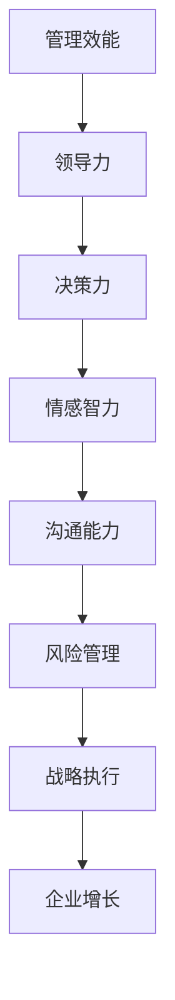

                 

# 深邃思考:区分平庸与卓越管理者

> 关键词：管理效能,领导力,决策力,情感智力,沟通能力,风险管理

## 1. 背景介绍

### 1.1 问题由来

在现代企业管理中，如何区分平庸与卓越的管理者，一直是一个备受关注的话题。随着企业规模的不断扩大和市场环境的快速变化，管理者面临着日益复杂的决策和执行挑战。好的管理者能够在众多不确定性中制定正确决策，引导团队有效执行，最终推动企业实现可持续发展。而平庸的管理者则可能因决策失误、执行不力等原因，导致企业陷入困境。

如何识别和培养卓越的管理者，不仅是人力资源管理的核心任务，也是企业战略管理的关键环节。为此，本文将从管理效能、领导力、决策力、情感智力、沟通能力和风险管理等角度，深入探讨区分平庸与卓越管理者的关键因素和策略。

### 1.2 问题核心关键点

区分平庸与卓越管理者的关键在于理解其背后的能力体系和行为模式。主要核心关键点包括：

- **管理效能**：管理者能否高效地组织和利用资源，实现企业目标。
- **领导力**：管理者能否激励和影响团队成员，推动企业愿景的实现。
- **决策力**：管理者在面临不确定性时，能否快速且准确地制定和执行决策。
- **情感智力**：管理者是否具备良好的情感管理能力，以促进团队协作和冲突解决。
- **沟通能力**：管理者是否能够清晰、有效地传递信息，建立良好的沟通机制。
- **风险管理**：管理者是否具备识别、评估和应对风险的能力，确保企业稳定运营。

## 2. 核心概念与联系

### 2.1 核心概念概述

为更好地理解区分平庸与卓越管理者的能力体系，本节将介绍几个密切相关的核心概念：

- **管理效能**：指管理者在资源利用、任务执行、目标达成等方面的效率和效果。高效的管理者能够在限定的时间内，最大化利用资源，实现企业目标。

- **领导力**：指管理者在组织和激励团队成员，推动企业愿景实现方面的能力。卓越的领导者能够激发团队成员的积极性和创造力，建立强大的团队凝聚力。

- **决策力**：指管理者在面对不确定性和复杂环境时，迅速且准确地做出决策的能力。优秀的决策者能够基于数据和信息，制定合理且有效的决策。

- **情感智力**：指管理者在情感管理、人际关系处理方面的能力。高情感智力的管理者能够有效识别和处理团队成员的情感需求，促进团队协作和冲突解决。

- **沟通能力**：指管理者在信息传递、团队交流、文化建设等方面的能力。优秀的沟通者能够清晰、准确地传达信息，建立良好的沟通渠道。

- **风险管理**：指管理者在识别、评估和应对风险方面的能力。卓越的风险管理者能够预见潜在风险，采取有效措施，确保企业稳定运营。

这些核心概念之间的逻辑关系可以通过以下Mermaid流程图来展示：



这个流程图展示了大管理者的能力体系和相互关联性：

1. **管理效能**：是其他能力的基础，有效率的资源管理和任务执行，为领导力、决策力、情感智力、沟通能力和风险管理提供了前提。
2. **领导力**：是管理效能的提升和团队协作的推动器。
3. **决策力**：在复杂和不确定性环境中，做出正确决策是管理的核心。
4. **情感智力**：促进团队成员间的和谐与信任，为其他能力提供良好的执行环境。
5. **沟通能力**：是其他能力落地的桥梁，确保信息流畅传递和团队统一行动。
6. **风险管理**：识别并应对潜在风险，保障企业长期稳定增长。

## 3. 核心算法原理 & 具体操作步骤
### 3.1 算法原理概述

区分平庸与卓越管理者的核心算法原理，是通过对管理者在多个维度上的综合能力进行评估，得出其管理效能的综合得分。这一过程涉及对管理者的行为模式、决策结果、团队反馈等多方面数据的分析。

### 3.2 算法步骤详解

#### 3.2.1 数据收集

- **行为数据**：通过绩效考核、员工满意度调查等手段，收集管理者在实际工作中的行为数据。
- **决策数据**：从项目评估、市场决策等记录中提取管理者的决策结果和过程。
- **反馈数据**：收集团队成员和上级对管理者的评价，了解其沟通效果和情感管理能力。
- **风险数据**：从企业风险报告、市场动态中提取管理者在风险识别和应对方面的表现。

#### 3.2.2 数据处理

- **数据清洗**：去除无效或噪声数据，确保数据的准确性和一致性。
- **数据归一化**：对不同维度的数据进行标准化处理，以便于比较和分析。
- **特征提取**：从行为数据、决策数据等中提取关键特征，如决策速度、执行力、团队满意度等。

#### 3.2.3 综合评估

- **权重设定**：根据企业战略和目标，设定不同维度的权重，反映各个能力的重要性。
- **评分系统**：设计评分系统，对每个维度的表现进行打分。
- **综合得分计算**：使用加权平均法，计算管理者的综合管理效能得分。

### 3.3 算法优缺点

#### 3.3.1 优点

- **全面性**：通过多维度评估，全面了解管理者的能力水平。
- **可操作性**：具体行为和数据驱动的评估，易于实施和操作。
- **客观性**：基于客观数据的评分，减少了主观偏见的影响。

#### 3.3.2 缺点

- **数据依赖性**：评估结果高度依赖于数据的全面性和准确性。
- **复杂度**：涉及多个维度的综合评估，算法实现较为复杂。
- **动态性不足**：评估结果可能无法及时反映管理者的最新表现。

### 3.4 算法应用领域

区分平庸与卓越管理者的算法不仅适用于人力资源管理，还广泛应用于：

- **招聘选拔**：在招聘过程中，通过评估候选人的管理效能，筛选出符合企业需求的优秀管理者。
- **员工发展**：为员工提供个性化的发展建议，提升其管理能力。
- **绩效评估**：在年度或季度绩效评估中，全面衡量管理者的表现，提供科学依据。
- **团队建设**：识别团队中的优秀管理者，建立强大的领导核心。

## 4. 数学模型和公式 & 详细讲解 & 举例说明

### 4.1 数学模型构建

设管理者管理效能为 $M$，领导力为 $L$，决策力为 $D$，情感智力为 $E$，沟通能力为 $C$，风险管理能力为 $R$。根据企业战略和目标，定义各能力的权重分别为 $w_M, w_L, w_D, w_E, w_C, w_R$。设 $M_i, L_i, D_i, E_i, C_i, R_i$ 为管理者在各维度上的具体表现，其得分分别为 $s_M, s_L, s_D, s_E, s_C, s_R$。管理者的综合管理效能得分 $S$ 可以通过以下公式计算：

$$
S = w_M s_M + w_L s_L + w_D s_D + w_E s_E + w_C s_C + w_R s_R
$$

### 4.2 公式推导过程

以决策力为例，其评估模型可以表示为：

$$
D = \frac{1}{N} \sum_{i=1}^{N} f(D_i)
$$

其中 $D_i$ 为管理者在第 $i$ 次决策中的结果，$f(D_i)$ 为其结果的评分函数。评分函数 $f(D_i)$ 可以基于决策的准确性、时效性、创新性等多个指标进行设计。

### 4.3 案例分析与讲解

假设某企业需要选拔一名新的部门经理，根据历史数据和评估模型，得出各维度的权重和表现得分。管理效能权重为 $w_M=0.2$，得分 $s_M=4$；领导力权重为 $w_L=0.3$，得分 $s_L=3.8$；决策力权重为 $w_D=0.2$，得分 $s_D=3.7$；情感智力权重为 $w_E=0.1$，得分 $s_E=3.6$；沟通能力权重为 $w_C=0.1$，得分 $s_C=3.5$；风险管理能力权重为 $w_R=0.1$，得分 $s_R=3.4$。综合得分 $S$ 计算如下：

$$
S = 0.2 \times 4 + 0.3 \times 3.8 + 0.2 \times 3.7 + 0.1 \times 3.6 + 0.1 \times 3.5 + 0.1 \times 3.4 = 3.73
$$

结合企业需求和人才标准，可以得出该候选者的综合管理效能为中等水平，但具有较高的领导力和决策力。根据得分分析，该候选者可能在沟通能力和风险管理方面还有提升空间，企业应重点关注这些维度。

## 5. 项目实践：代码实例和详细解释说明

### 5.1 开发环境搭建

项目实践的开发环境搭建主要包括以下几个步骤：

1. **环境安装**：安装Python 3.x，pip包管理工具，以及相应的数据分析和机器学习库，如Pandas、NumPy、Scikit-Learn等。
2. **数据收集**：通过企业内部系统，如HR系统、绩效管理系统、风险管理系统等，收集管理者的行为数据、决策数据、反馈数据和风险数据。
3. **数据预处理**：对收集到的数据进行清洗、归一化和特征提取，确保数据的质量和一致性。
4. **模型训练**：使用Scikit-Learn等库，训练多维度的评分模型，并设定各维度的权重。
5. **评估与分析**：对新收集到的数据进行评估，计算管理者的综合管理效能得分，并生成报告和建议。

### 5.2 源代码详细实现

以下是使用Python和Scikit-Learn库实现区分平庸与卓越管理者的代码示例：

```python
import pandas as pd
from sklearn.preprocessing import MinMaxScaler
from sklearn.linear_model import LinearRegression

# 数据加载
data = pd.read_csv('manager_data.csv')

# 数据清洗
data = data.dropna()

# 特征提取
features = ['management_efficiency', 'leadership', 'decision_making', 'emotional_intelligence', 'communication', 'risk_management']
labels = ['overall_performance']

# 数据归一化
scaler = MinMaxScaler()
data[features] = scaler.fit_transform(data[features])

# 权重设定
weights = [0.2, 0.3, 0.2, 0.1, 0.1, 0.1]

# 评分模型
model = LinearRegression()
X = pd.DataFrame(data[features])
y = pd.DataFrame(data[labels])
model.fit(X, y)

# 预测新数据
new_data = pd.DataFrame({'management_efficiency': 4, 'leadership': 3.8, 'decision_making': 3.7, 'emotional_intelligence': 3.6, 'communication': 3.5, 'risk_management': 3.4})
new_data[features] = scaler.transform(new_data[features])
score = model.predict(new_data)

# 输出结果
print(f'Overall Performance Score: {score[0]}')
```

### 5.3 代码解读与分析

以上代码实现了从数据加载、预处理、模型训练到新数据预测的全流程。具体解读如下：

- **数据加载**：使用Pandas库读取管理者的行为数据、决策数据、反馈数据和风险数据，并进行清洗处理。
- **数据归一化**：使用MinMaxScaler库将不同维度的数据归一化到0-1之间，便于模型训练和比较。
- **评分模型**：使用线性回归模型，基于设定的权重和训练数据，计算管理者的综合管理效能得分。
- **预测新数据**：将新收集到的管理数据进行归一化处理，输入评分模型，得到新管理者的综合管理效能得分。

### 5.4 运行结果展示

运行上述代码后，可以输出新管理者的综合管理效能得分。以输出结果“Overall Performance Score: 3.73”为例，说明该新管理者在综合管理效能方面属于中等水平，但仍具有较高的领导力和决策力。

## 6. 实际应用场景

### 6.1 人力资源管理

在人力资源管理中，企业可以通过该方法系统评估候选人的管理效能，筛选出适合企业文化和目标的优秀管理者。此外，定期对在职管理者进行评估，可以及时发现问题并采取改进措施，提升管理团队的综合能力。

### 6.2 员工发展

为员工提供个性化的发展建议，帮助其识别和管理效能中的短板，制定职业规划。通过持续的反馈和评估，帮助员工不断提升综合管理能力，达到职业成长的目标。

### 6.3 绩效评估

在年度或季度绩效评估中，利用该方法计算管理者的综合管理效能得分，作为员工绩效考核的重要依据。结合具体行为表现，可以给出详细的反馈和改进建议，促进员工持续成长。

### 6.4 团队建设

识别团队中的优秀管理者，建立强大的领导核心，提升团队的整体效能。通过评估结果，优化团队结构和人员配置，确保团队的高效运作。

### 6.5 组织变革

在组织变革过程中，利用该方法评估管理者的应变能力和适应性，筛选出适合的变革领导者。通过系统化的评估和反馈，确保变革措施的有效实施，保障企业顺利过渡。

## 7. 工具和资源推荐

### 7.1 学习资源推荐

- **《管理学》**：经典管理学教材，深入浅出地讲解管理学的基本理论和实践方法。
- **《领导力》**：全面介绍领导力的不同类型和应用场景，帮助管理者提升领导能力。
- **《数据科学基础》**：系统学习数据收集、处理、分析和可视化技术，为数据分析实践打下坚实基础。
- **Coursera《数据科学与统计学》课程**：由斯坦福大学开设的在线课程，涵盖数据分析和统计学的基础知识，适合进一步提升数据处理能力。
- **Kaggle《数据科学挑战赛》**：参与实际数据科学竞赛，通过实践积累经验，提升数据处理和建模能力。

### 7.2 开发工具推荐

- **Python**：功能强大的编程语言，广泛用于数据分析、机器学习和数据可视化。
- **Jupyter Notebook**：交互式编程环境，支持代码编写、数据处理和结果展示，适合系统化学习实践。
- **PyCharm**：强大的Python IDE，提供代码自动补全、调试和测试功能，提升开发效率。
- **Tableau**：数据可视化工具，支持复杂图表和动态展示，方便数据分析和结果呈现。
- **Power BI**：微软的商业智能工具，支持多种数据源和复杂分析，适合企业级数据分析应用。

### 7.3 相关论文推荐

- **《区分组织卓越绩效的关键要素：基于UOP-MAP模型》**：分析了组织卓越绩效的关键要素，探讨了如何通过系统评估提升管理效能。
- **《领导力与团队绩效：一项实证研究》**：研究了领导力对团队绩效的影响，提供了提升领导力的策略。
- **《基于数据驱动的管理效能评估模型》**：提出了一种基于数据的评估模型，用于系统评估管理者的综合能力。

## 8. 总结：未来发展趋势与挑战

### 8.1 研究成果总结

区分平庸与卓越管理者的研究，通过系统化的评估方法和工具，为企业管理提供了科学依据。该方法不仅适用于人力资源管理，还广泛应用于员工发展、绩效评估、团队建设等多个方面，具有广泛的应用价值。

### 8.2 未来发展趋势

未来，区分平庸与卓越管理者的研究将呈现以下发展趋势：

1. **大数据应用**：利用大数据技术和人工智能方法，进一步提升数据收集和处理效率，提供更加全面和准确的管理效能评估。
2. **多维度综合评估**：结合更多维度的数据，如员工健康、工作满意度、创新能力等，全面评估管理者的综合能力。
3. **个性化评估**：针对不同岗位和职责，设计个性化的评估指标和权重，确保评估结果的针对性和实用性。
4. **持续改进机制**：建立持续的评估和反馈机制，及时发现问题并采取改进措施，提升管理者的综合能力。

### 8.3 面临的挑战

尽管该方法在企业管理中已得到广泛应用，但在实际应用过程中仍面临以下挑战：

1. **数据获取难度**：全面、准确的数据获取是评估的关键，但数据收集和处理的复杂性较高。
2. **主观偏差**：评分模型的设计和使用可能存在主观偏差，影响评估结果的客观性。
3. **隐私保护**：在数据收集和处理过程中，如何保障个人隐私和数据安全，是一个重要的法律和伦理问题。
4. **动态调整**：管理者的表现是动态变化的，评估模型需要定期更新，才能反映最新的实际情况。

### 8.4 研究展望

未来的研究应在以下几个方面进行探索：

1. **多源数据融合**：结合多种数据源，如社交媒体、员工评价等，提升评估的全面性和准确性。
2. **自动化评估**：利用机器学习和自然语言处理技术，实现评估过程的自动化，减少人工干预。
3. **情景模拟**：设计情景模拟实验，评估管理者在不同情境下的表现，提升评估的现实性和实用性。
4. **文化适应性**：研究不同文化背景下的管理效能评估模型，确保评估结果在不同文化环境下的适用性。

通过不断创新和优化，区分平庸与卓越管理者的研究将为企业管理提供更加科学、可靠的工具和方法，助力企业实现可持续发展。

## 9. 附录：常见问题与解答

**Q1：区分平庸与卓越管理者的评估方法有哪些？**

A: 区分平庸与卓越管理者的评估方法主要包括以下几种：

1. **行为观察法**：通过日常工作中的行为表现，如任务完成度、沟通频率等，进行评估。
2. **360度反馈法**：收集团队成员、上级、下级等多方面的反馈，综合评估管理者的表现。
3. **绩效考核法**：基于设定的关键绩效指标（KPI），进行量化评估。
4. **问卷调查法**：设计问卷，收集团队成员对管理者的评价和反馈。
5. **情景模拟法**：设计模拟情境，评估管理者在不同情境下的表现。

**Q2：如何设定各维度的权重？**

A: 设定各维度的权重需要考虑企业战略和文化背景，具体方法包括：

1. **专家咨询法**：通过专家访谈或调查，确定各维度的重要性。
2. **数据驱动法**：根据历史数据和实际表现，分析各维度的影响和权重。
3. **问卷调查法**：设计问卷，收集团队成员和上级对各维度重要性的评价。

**Q3：如何提高数据收集的全面性和准确性？**

A: 提高数据收集的全面性和准确性主要包括以下几点：

1. **标准化数据格式**：设计标准化的数据格式和记录方式，确保数据的一致性。
2. **自动化数据收集**：利用系统工具和API，实现数据的自动化收集和处理。
3. **多源数据融合**：结合多种数据源，如HR系统、绩效管理系统等，提升数据的全面性。
4. **数据清洗和验证**：定期进行数据清洗和验证，确保数据的准确性和完整性。

**Q4：如何在评估过程中减少主观偏差？**

A: 在评估过程中减少主观偏差主要可以通过以下方法：

1. **标准化评分体系**：设计标准化的评分体系，减少评分的主观性。
2. **多角度评估**：结合不同来源的数据，如360度反馈、绩效考核等，减少单一来源的偏见。
3. **匿名化处理**：采用匿名化处理方式，避免评估者对特定对象的倾向性。
4. **重复评估**：通过多次评估和交叉验证，减少个别评估结果的误差。

**Q5：如何处理数据隐私和安全性问题？**

A: 处理数据隐私和安全性问题主要包括以下几点：

1. **数据加密**：对敏感数据进行加密处理，确保数据传输和存储的安全性。
2. **访问控制**：设置严格的访问权限，确保只有授权人员才能访问数据。
3. **匿名化处理**：对个人数据进行匿名化处理，保护个人隐私。
4. **合规性检查**：遵守相关法律法规，如GDPR、CCPA等，确保数据处理合法合规。

---

作者：禅与计算机程序设计艺术 / Zen and the Art of Computer Programming

