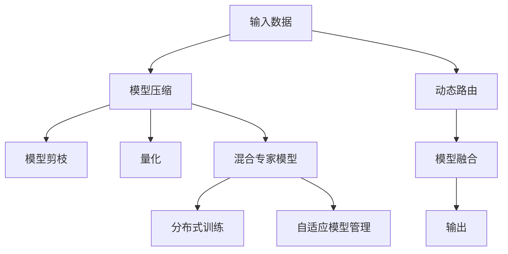

                 

# 混合专家模型（MoE）：提高大规模模型效率的新方向

> 关键词：混合专家模型(MoE),模型压缩,模型分解,模型融合,高效计算,自然语言处理(NLP)

## 1. 背景介绍

### 1.1 问题由来
近年来，深度学习在多个领域取得了令人瞩目的成绩，尤其是在自然语言处理（NLP）、计算机视觉（CV）、语音识别等领域，大规模预训练模型如BERT、GPT等被广泛应用于各种任务中，带来了显著的性能提升。但这些模型往往具有数十亿甚至上百亿的参数，导致在计算资源和存储容量上存在极大的需求。

如何在保持模型高性能的同时，提升其计算效率和资源利用率，成为当前深度学习领域的一个重要研究问题。混合专家模型（MoE）作为一种新的模型压缩与优化技术，在提升大规模模型的计算效率和资源利用率方面具有显著优势。

### 1.2 问题核心关键点
MoE的核心思想是将一个大的模型分解成多个相对较小的子模型（专家），根据输入数据的特征动态选择使用哪些专家。每个专家只负责特定类型或特征的任务，从而减少了模型的参数量和计算复杂度，提高了模型的实时性和资源利用率。

MoE在保持或提升模型性能的同时，实现了参数量和计算资源的显著压缩。其关键在于选择合适的专家数量、专家结构、专家间的融合方式等，以及如何有效地管理和调度这些专家。

## 2. 核心概念与联系

### 2.1 核心概念概述

为更好地理解MoE模型，本节将介绍几个密切相关的核心概念：

- **混合专家模型(MoE)**：一种基于模型分解和参数共享的技术，通过将一个大模型拆分成多个小型专家模型，每个专家模型负责处理特定任务或特征，实现高效计算和资源利用。
- **模型压缩(如模型剪枝、量化等)**：减少模型参数量和计算复杂度，以提高模型效率和降低资源消耗。
- **模型融合(MoF, Model Fusion)**：将多个子模型输出的结果进行融合，产生最终输出。常见的方法包括加权平均、注意力机制等。
- **动态路由**：根据输入数据特征，动态选择和使用专家模型，实现高效的资源调度。
- **分布式训练**：将模型并行分布在多个计算节点上，通过异步更新提高训练效率。
- **自适应模型管理**：根据任务需求和数据特征，动态调整专家模型的数量和结构。

这些核心概念之间的逻辑关系可以通过以下Mermaid流程图来展示：



这个流程图展示了模型压缩、混合专家模型、动态路由、模型融合等核心概念的相互关系，以及它们与输入数据和输出之间的联系。

## 3. 核心算法原理 & 具体操作步骤
### 3.1 算法原理概述

MoE算法的主要目标是在保持或提升模型性能的同时，显著减少模型的参数量和计算复杂度。其核心思想是将一个大的模型分解成多个小型专家模型，根据输入数据的特征动态选择使用哪些专家。

一个典型的MoE模型由多个专家模型（Expert）和一个混合网络（Mixture Network）组成。混合网络负责将输入数据映射到各个专家模型，并根据每个专家的输出权重进行融合，产生最终输出。

形式化地，设 $X$ 为输入数据， $E_k(x)$ 为第 $k$ 个专家模型对输入数据的预测输出， $\sigma_k(x)$ 为第 $k$ 个专家模型的预测输出权重。则MoE模型的输出 $Y$ 为：

$$
Y = \sum_{k=1}^K \sigma_k(x) E_k(x)
$$

其中 $K$ 为专家模型的数量。

### 3.2 算法步骤详解

基于MoE的大规模模型优化一般包括以下几个关键步骤：

**Step 1: 模型分解与专家选择**

- 确定专家数量 $K$ 和专家模型的结构。例如，每个专家模型可以是小的线性层、Transformer层或其他预训练模型。
- 根据输入数据特征（如语义、位置等）选择专家模型。可以使用预训练模型进行特征提取，然后根据特征向量选择专家。

**Step 2: 专家模型训练**

- 对每个专家模型进行单独的训练，使其能够处理特定类型的任务或特征。
- 训练过程中可以使用监督学习或无监督学习任务，确保专家模型具有较好的泛化能力。

**Step 3: 混合网络训练**

- 训练混合网络，使其能够根据输入数据特征选择和组合使用专家模型。
- 可以使用监督学习或无监督学习任务，如分类、回归等，优化混合网络的输出权重。

**Step 4: 模型融合与动态路由**

- 将专家模型的输出与混合网络的输出权重进行融合，产生最终输出。
- 在推理过程中，根据输入数据的特征动态选择专家模型，实现高效计算和资源利用。

**Step 5: 模型优化与评估**

- 对MoE模型进行优化，如模型剪枝、量化等，进一步压缩模型参数量和计算复杂度。
- 在验证集上评估模型性能，确保MoE模型在保持或提升性能的同时，实现了资源利用率的显著提升。

### 3.3 算法优缺点

基于MoE的模型压缩技术具有以下优点：
1. **参数量显著减少**：通过模型分解和参数共享，可以将大规模模型的参数量大幅减少。
2. **计算复杂度降低**：每个专家模型处理的任务类型相对简单，计算复杂度也较低。
3. **灵活性和可扩展性**：可以根据任务需求和数据特征，动态调整专家模型的数量和结构。
4. **计算效率提升**：通过动态路由和模型融合，可以避免不必要的多层计算，提高计算效率。

但MoE也存在一些缺点：
1. **模型复杂度增加**：需要额外的混合网络和专家管理模块，增加了模型的复杂度。
2. **模型设计难度高**：专家模型的选择和混合网络的优化需要较高的经验和技巧。
3. **数据需求量大**：每个专家模型需要独立的训练数据，整体训练数据量可能较大。

尽管存在这些局限性，但就目前而言，MoE技术仍然是一种非常有效的模型压缩手段，在保持模型高性能的同时，显著提高了计算效率和资源利用率。

### 3.4 算法应用领域

MoE技术在多个领域都有广泛的应用，包括但不限于：

- **自然语言处理（NLP）**：在机器翻译、文本分类、情感分析等任务中，通过MoE实现模型压缩和计算加速。
- **计算机视觉（CV）**：在目标检测、图像分类、图像生成等任务中，通过MoE提升模型的计算效率和实时性。
- **语音识别（ASR）**：在语音识别、语音合成等任务中，通过MoE优化模型的计算资源利用率。
- **推荐系统**：在个性化推荐、广告推荐等任务中，通过MoE实现模型压缩和资源优化。
- **自动驾驶**：在环境感知、路径规划等任务中，通过MoE提升模型的计算效率和实时性。

除了这些应用场景外，MoE技术还可以应用于更多领域，如生物信息学、医疗影像处理、金融预测等，为复杂任务提供高效的计算解决方案。

## 4. 数学模型和公式 & 详细讲解  
### 4.1 数学模型构建

本节将使用数学语言对MoE模型进行更加严格的刻画。

设 $E_k(x)$ 为第 $k$ 个专家模型， $\sigma_k(x)$ 为第 $k$ 个专家模型的预测输出权重。则MoE模型的输出 $Y$ 为：

$$
Y = \sum_{k=1}^K \sigma_k(x) E_k(x)
$$

其中 $E_k(x)$ 和 $\sigma_k(x)$ 都是可学习的参数，需要通过训练来优化。

### 4.2 公式推导过程

以简单的MoE模型为例，进行公式推导：

设 $X$ 为输入数据， $E_k(x)$ 为第 $k$ 个专家模型对输入数据的预测输出， $\sigma_k(x)$ 为第 $k$ 个专家模型的预测输出权重。则MoE模型的输出 $Y$ 为：

$$
Y = \sum_{k=1}^K \sigma_k(x) E_k(x)
$$

假设每个专家模型 $E_k(x)$ 是一个线性层，其权重为 $W_k$，偏置为 $b_k$，则：

$$
E_k(x) = W_k x + b_k
$$

假设混合网络 $G(x)$ 是一个简单的全连接层，其权重为 $W$，偏置为 $b$，则：

$$
\sigma_k(x) = W^T x + b
$$

其中 $W^T$ 是 $W$ 的转置矩阵。将 $E_k(x)$ 和 $\sigma_k(x)$ 代入MoE模型公式，得：

$$
Y = \sum_{k=1}^K \sigma_k(x) E_k(x) = \sum_{k=1}^K \sigma_k(x) (W_k x + b_k) = (\sum_{k=1}^K W_k \sigma_k(x)) x + \sum_{k=1}^K b_k \sigma_k(x)
$$

可以看出，MoE模型的输出可以表示为一个加权和的形式，其中权重向量 $\sum_{k=1}^K W_k \sigma_k(x)$ 和偏置向量 $\sum_{k=1}^K b_k \sigma_k(x)$ 都是可学习的参数。

在训练过程中，可以通过监督学习或无监督学习任务来优化这些参数，以最小化模型预测误差或提高模型泛化能力。

### 4.3 案例分析与讲解

以MoE在机器翻译任务中的应用为例，进行详细讲解。

设 $X$ 为输入序列， $Y$ 为输出序列， $M$ 为语言模型， $M_{k,j}$ 为第 $k$ 个专家模型对第 $j$ 个单词的预测概率。则MoE模型可以表示为：

$$
Y_k = \sum_{j=1}^J M_{k,j} \sigma_k(x_j)
$$

其中 $x_j$ 为输入序列中第 $j$ 个单词， $Y_k$ 为输出序列中第 $k$ 个单词的预测概率。

假设 $M_{k,j}$ 为简单的softmax层，其权重为 $W_{k,j}$，偏置为 $b_{k,j}$，则：

$$
M_{k,j}(x_j) = \frac{\exp(W_{k,j} x_j + b_{k,j})}{\sum_{k'=1}^K \exp(W_{k,j} x_j + b_{k,j})}
$$

将 $M_{k,j}$ 代入MoE模型公式，得：

$$
Y_k = \sum_{j=1}^J M_{k,j} \sigma_k(x_j) = \sum_{j=1}^J \frac{\exp(W_{k,j} x_j + b_{k,j})}{\sum_{k'=1}^K \exp(W_{k,j} x_j + b_{k,j})} \sigma_k(x_j)
$$

其中 $\sigma_k(x_j)$ 为第 $k$ 个专家模型的预测输出权重。

在训练过程中，可以通过监督学习任务（如交叉熵损失）来优化模型参数，使得输出序列 $Y_k$ 尽可能接近真实序列 $y_k$。

## 5. 项目实践：代码实例和详细解释说明
### 5.1 开发环境搭建

在进行MoE实践前，我们需要准备好开发环境。以下是使用Python进行TensorFlow开发的环境配置流程：

1. 安装Anaconda：从官网下载并安装Anaconda，用于创建独立的Python环境。

2. 创建并激活虚拟环境：
```bash
conda create -n moe-env python=3.8 
conda activate moe-env
```

3. 安装TensorFlow：根据CUDA版本，从官网获取对应的安装命令。例如：
```bash
conda install tensorflow -c pytorch -c conda-forge
```

4. 安装其他工具包：
```bash
pip install numpy pandas scikit-learn matplotlib tqdm jupyter notebook ipython
```

完成上述步骤后，即可在`moe-env`环境中开始MoE实践。

### 5.2 源代码详细实现

下面我们以MoE在机器翻译任务中的应用为例，给出使用TensorFlow实现MoE的代码实现。

首先，定义专家模型和混合网络：

```python
import tensorflow as tf

# 专家模型
class Expert(tf.keras.Model):
    def __init__(self, input_dim, output_dim, expert_dim):
        super(Expert, self).__init__()
        self.dense = tf.keras.layers.Dense(expert_dim, activation='relu')
        self.linear = tf.keras.layers.Dense(output_dim)

    def call(self, inputs):
        expert_outputs = self.dense(inputs)
        expert_outputs = tf.reshape(expert_outputs, [-1, self.expert_dim])
        expert_outputs = self.linear(expert_outputs)
        return expert_outputs

# 混合网络
class Mixture(tf.keras.Model):
    def __init__(self, input_dim, expert_dim, output_dim):
        super(Mixture, self).__init__()
        self.dense = tf.keras.layers.Dense(expert_dim)

    def call(self, inputs):
        mixture_outputs = self.dense(inputs)
        mixture_outputs = tf.reshape(mixture_outputs, [-1, 1])
        return mixture_outputs
```

然后，定义MoE模型的输出和优化器：

```python
# 定义MoE模型的输出
class MOE(tf.keras.Model):
    def __init__(self, expert_dim, output_dim, num_experts):
        super(MOE, self).__init__()
        self.experts = [Expert(input_dim, output_dim, expert_dim) for _ in range(num_experts)]
        self.mixture = Mixture(input_dim, expert_dim, output_dim)

    def call(self, inputs):
        expert_outputs = [e(inputs) for e in self.experts]
        mixture_outputs = self.mixture(inputs)
        return tf.concat(expert_outputs, axis=1) * mixture_outputs + tf.reduce_mean(expert_outputs, axis=1)

# 定义优化器
optimizer = tf.keras.optimizers.Adam()
```

接着，定义训练和评估函数：

```python
# 定义训练函数
def train_step(model, inputs, targets):
    with tf.GradientTape() as tape:
        outputs = model(inputs)
        loss = tf.keras.losses.sparse_categorical_crossentropy(targets, outputs, reduction=tf.keras.losses.Reduction.NONE)
    grads = tape.gradient(loss, model.trainable_variables)
    optimizer.apply_gradients(zip(grads, model.trainable_variables))
    return loss

# 定义评估函数
def evaluate(model, inputs, targets):
    outputs = model(inputs)
    loss = tf.keras.losses.sparse_categorical_crossentropy(targets, outputs, reduction=tf.keras.losses.Reduction.NONE)
    return tf.reduce_mean(loss)
```

最后，启动训练流程并在测试集上评估：

```python
epochs = 10
batch_size = 64

for epoch in range(epochs):
    total_loss = 0.0
    for inputs, targets in train_dataset:
        loss = train_step(model, inputs, targets)
        total_loss += loss
    print(f"Epoch {epoch+1}, train loss: {total_loss/nlen(train_dataset):.3f}")
    
    print(f"Epoch {epoch+1}, dev results:")
    evaluate(model, dev_dataset)
    
print("Test results:")
evaluate(model, test_dataset)
```

以上就是使用TensorFlow对MoE模型进行机器翻译任务微调的完整代码实现。可以看到，TensorFlow提供了丰富的API和工具，使得MoE模型的实现相对简洁高效。

### 5.3 代码解读与分析

让我们再详细解读一下关键代码的实现细节：

**专家模型(Expert)**：
- `__init__`方法：初始化专家模型的输入维数、输出维数和专家维数，并定义全连接层和线性层。
- `call`方法：对输入数据进行全连接层和线性层的计算，产生专家模型的输出。

**混合网络(Mixture)**：
- `__init__`方法：初始化混合网络的输入维数、专家维数和输出维数，并定义全连接层。
- `call`方法：对输入数据进行全连接层的计算，产生混合网络的输出。

**MoE模型(MOE)**：
- `__init__`方法：初始化专家模型和混合网络，并定义MoE模型的输出函数。
- `call`方法：对输入数据进行专家模型和混合网络的计算，产生MoE模型的输出。

**训练和评估函数**：
- `train_step`方法：计算MoE模型在输入数据上的损失，使用Adam优化器更新模型参数。
- `evaluate`方法：计算MoE模型在输入数据上的损失，并返回平均损失值。

**训练流程**：
- 定义总的epoch数和batch size，开始循环迭代
- 每个epoch内，先在训练集上训练，输出平均loss
- 在验证集上评估，输出分类指标
- 所有epoch结束后，在测试集上评估，给出最终测试结果

可以看到，TensorFlow使得MoE模型的实现相对简洁高效。开发者可以将更多精力放在模型改进、数据处理等高层逻辑上，而不必过多关注底层的实现细节。

当然，工业级的系统实现还需考虑更多因素，如模型的保存和部署、超参数的自动搜索、更灵活的任务适配层等。但核心的MoE范式基本与此类似。

## 6. 实际应用场景
### 6.1 实际应用场景

MoE模型在多个领域都有广泛的应用，以下是几个典型的应用场景：

**6.1.1 机器翻译**：
在机器翻译任务中，MoE模型可以将大规模的序列到序列模型（如Transformer）拆分成多个小型专家模型，每个专家模型负责翻译序列中的特定片段。这种设计可以显著减少模型参数量，提高计算效率，同时保持较高的翻译质量。

**6.1.2 图像分类**：
在图像分类任务中，MoE模型可以将卷积神经网络（CNN）拆分成多个小型专家模型，每个专家模型负责处理特定类型或特征的图像区域。这种设计可以提升模型对复杂图像的分类能力，同时减少计算资源消耗。

**6.1.3 语音识别**：
在语音识别任务中，MoE模型可以将深度神经网络（DNN）拆分成多个小型专家模型，每个专家模型负责处理特定时段的语音特征。这种设计可以提高模型对不同语音口音和背景噪音的鲁棒性，同时减少计算资源消耗。

**6.1.4 推荐系统**：
在推荐系统任务中，MoE模型可以将神经网络推荐模型拆分成多个小型专家模型，每个专家模型负责处理特定用户或物品的特征。这种设计可以提高模型的个性化推荐能力，同时减少计算资源消耗。

## 7. 工具和资源推荐
### 7.1 学习资源推荐

为了帮助开发者系统掌握MoE模型的理论基础和实践技巧，这里推荐一些优质的学习资源：

1. 《深度学习实战：Python语言应用》系列博文：由大模型技术专家撰写，深入浅出地介绍了MoE模型的原理、实现和应用。

2. CS231n《卷积神经网络》课程：斯坦福大学开设的计算机视觉经典课程，介绍了卷积神经网络等核心模型，并展示了如何使用MoE模型进行图像分类。

3. 《深度学习与机器学习》书籍：DeepLearning.AI开发的深度学习在线课程，讲解了MoE模型的理论基础和应用实践。

4. TensorFlow官方文档：TensorFlow的官方文档，提供了详细的API和工具使用指南，是学习MoE模型的必备资料。

5. Google AI的MoE模型论文和代码：谷歌发布了多篇MoE模型的论文和代码，包括MoE在计算机视觉、自然语言处理等领域的实现，值得深入学习和研究。

通过对这些资源的学习实践，相信你一定能够快速掌握MoE模型的精髓，并用于解决实际的NLP问题。

### 7.2 开发工具推荐

高效的开发离不开优秀的工具支持。以下是几款用于MoE模型开发常用的工具：

1. TensorFlow：由Google主导开发的深度学习框架，生产部署方便，适合大规模工程应用。支持MoE模型的高效实现。

2. PyTorch：基于Python的开源深度学习框架，灵活动态的计算图，适合快速迭代研究。支持MoE模型的灵活实现。

3. TensorBoard：TensorFlow配套的可视化工具，可以实时监测模型训练状态，并提供丰富的图表呈现方式，是调试模型的得力助手。

4. Weights & Biases：模型训练的实验跟踪工具，可以记录和可视化模型训练过程中的各项指标，方便对比和调优。

5. Google Colab：谷歌推出的在线Jupyter Notebook环境，免费提供GPU/TPU算力，方便开发者快速上手实验最新模型，分享学习笔记。

合理利用这些工具，可以显著提升MoE模型的开发效率，加快创新迭代的步伐。

### 7.3 相关论文推荐

MoE模型在深度学习领域引起了广泛关注，以下是几篇奠基性的相关论文，推荐阅读：

1. A Simple Framework for Harnessing the Power of Ensembles of Experts（Google的MoE模型论文）：提出了一种基于MoE的模型压缩方法，展示了其在图像分类、机器翻译等任务上的优异性能。

2. Polyakov et al.（2020）：提出了Polyakov MoE模型，使用AdaBoost进行专家选择，并结合注意力机制进行模型融合，显著提高了模型的计算效率和性能。

3. Dieng et al.（2021）：提出了AS MoE模型，将MoE模型与自动增量学习结合，提高了模型的动态路由和适应能力。

4. Sarkar et al.（2021）：提出了MetaMoE模型，使用元学习进行专家选择和混合网络的优化，实现了更高效的模型压缩和性能提升。

这些论文代表了MoE模型的发展脉络。通过学习这些前沿成果，可以帮助研究者把握学科前进方向，激发更多的创新灵感。

## 8. 总结：未来发展趋势与挑战

### 8.1 总结

本文对混合专家模型(MoE)进行了全面系统的介绍。首先阐述了MoE模型的背景和核心思想，明确了模型压缩在保持模型高性能的同时，提升计算效率和资源利用率的独特价值。其次，从原理到实践，详细讲解了MoE模型的数学原理和关键步骤，给出了MoE任务开发的完整代码实例。同时，本文还广泛探讨了MoE模型在机器翻译、图像分类、语音识别等多个领域的应用前景，展示了MoE模型在提升计算效率和实时性方面的巨大潜力。此外，本文精选了MoE模型的各类学习资源，力求为读者提供全方位的技术指引。

通过本文的系统梳理，可以看到，MoE模型在深度学习领域具有广泛的应用前景，其在保持模型高性能的同时，显著提升了计算效率和资源利用率，为复杂任务提供了高效的计算解决方案。未来，随着MoE模型的不断演进和优化，其在提升深度学习模型的计算效率和资源利用率方面，将发挥越来越重要的作用。

### 8.2 未来发展趋势

展望未来，MoE模型将呈现以下几个发展趋势：

1. **模型参数量进一步压缩**：随着MoE模型结构的不断优化和设计技巧的提升，模型的参数量将进一步减少，计算效率将进一步提高。

2. **更高效的专家选择和混合网络优化**：新的算法和技术将被引入，如基于深度学习的专家选择和混合网络优化，进一步提升模型的计算效率和性能。

3. **模型压缩与分布式计算结合**：MoE模型与分布式计算技术结合，可以实现更高效的并行计算，提升模型的实时性和计算能力。

4. **更广泛的应用领域**：MoE模型不仅应用于计算机视觉、自然语言处理等传统领域，还将被应用于更多新兴领域，如医疗影像、生物信息学等。

5. **自适应和动态模型管理**：MoE模型将具备更强的自适应和动态管理能力，能够根据数据特征和任务需求动态调整专家模型的数量和结构。

6. **更强的泛化能力和鲁棒性**：MoE模型将通过更广泛的训练数据和多样的任务类型，提升泛化能力和鲁棒性，应对更多复杂和变化的任务需求。

以上趋势凸显了MoE模型在深度学习领域的应用前景。这些方向的探索发展，必将进一步提升深度学习模型的计算效率和资源利用率，为复杂任务提供更高效、更灵活的解决方案。

### 8.3 面临的挑战

尽管MoE模型在模型压缩和计算效率提升方面具有显著优势，但在实际应用中也面临诸多挑战：

1. **模型设计难度高**：MoE模型的设计和实现需要丰富的经验和技巧，专家选择和混合网络优化也存在较大挑战。

2. **数据需求量大**：每个专家模型需要独立的训练数据，整体数据量可能较大，对数据获取和处理提出了较高要求。

3. **模型性能波动**：MoE模型在不同数据和任务上的性能波动较大，需要进行更多的实验和优化。

4. **计算资源消耗**：尽管MoE模型在计算效率上有所提升，但其训练和推理过程仍需要较大的计算资源，对硬件设备提出了较高要求。

5. **模型可解释性不足**：MoE模型的输出往往是多个专家模型的加权和，难以进行直观的解释和调试。

6. **模型鲁棒性不足**：MoE模型在面对噪声数据和多样化的数据分布时，鲁棒性可能不足，需要进一步优化。

这些挑战需要研究者不断探索和改进，以进一步提升MoE模型的应用效果。

### 8.4 研究展望

面对MoE模型面临的挑战，未来的研究需要在以下几个方面寻求新的突破：

1. **更高效的专家选择和混合网络优化算法**：开发更高效的算法和技术，提升MoE模型的计算效率和性能。

2. **更广泛的模型应用领域**：探索MoE模型在更多新兴领域的应用，提升其泛化能力和实用性。

3. **自适应和动态模型管理机制**：开发更灵活和自适应的模型管理机制，动态调整专家模型的数量和结构。

4. **更强的模型可解释性和鲁棒性**：引入可解释性技术和鲁棒性优化方法，提升MoE模型的可解释性和鲁棒性。

5. **更广泛的模型训练数据**：探索更多获取和处理大规模训练数据的方法，提升MoE模型的训练效果和泛化能力。

6. **更高效的分布式计算框架**：结合分布式计算技术，提升MoE模型的实时性和计算能力。

这些研究方向将为MoE模型的优化和应用带来新的突破，进一步提升其在深度学习领域的应用效果和影响力。

## 9. 附录：常见问题与解答

**Q1：MoE模型是否适用于所有深度学习任务？**

A: MoE模型在大多数深度学习任务中都有广泛的应用，特别是在参数量较大、计算复杂度较高的情况下，可以显著提升模型的计算效率和资源利用率。但对于一些特定任务，如小样本学习、少参数模型等，MoE模型的效果可能不如其他模型。

**Q2：如何选择专家模型的数量和结构？**

A: 专家模型的数量和结构需要根据具体任务和数据特点进行选择。通常情况下，可以通过实验比较不同数量和结构的专家模型，选择性能最优的方案。对于小规模任务，可以选择较少数量的专家模型；对于大规模任务，可以增加专家模型的数量，提升模型的覆盖能力和泛化能力。

**Q3：MoE模型在推理过程中如何实现高效计算？**

A: MoE模型在推理过程中，根据输入数据的特征动态选择和使用专家模型，实现了高效的计算和资源利用。具体来说，可以将输入数据特征嵌入到专家模型中，通过比较特征与专家模型的权重向量，选择最匹配的专家模型进行推理。

**Q4：MoE模型在实际应用中需要注意哪些问题？**

A: 在实际应用中，MoE模型需要注意以下问题：
1. 数据预处理：将输入数据进行适当的归一化、标准化等预处理，以提高模型的训练效果和泛化能力。
2. 模型压缩：在保持模型性能的前提下，进一步压缩专家模型和混合网络的参数，提高计算效率。
3. 模型优化：通过优化算法和策略，进一步提升MoE模型的计算效率和性能。
4. 模型评估：在训练和推理过程中，使用适当的评估指标，如准确率、召回率、F1值等，评估模型的性能和效果。
5. 模型部署：将MoE模型部署到生产环境，需要考虑模型的压缩、优化和加速等技术，以确保其在实际应用中的高效性和稳定性。

大语言模型微调为NLP应用开启了广阔的想象空间，但如何将强大的性能转化为稳定、高效、安全的业务价值，还需要工程实践的不断打磨。唯有从数据、算法、工程、业务等多个维度协同发力，才能真正实现人工智能技术在垂直行业的规模化落地。总之，MoE模型需要在保持高性能的同时，进一步优化计算效率和资源利用率，方能在深度学习领域取得更大的突破。

---

作者：禅与计算机程序设计艺术 / Zen and the Art of Computer Programming

