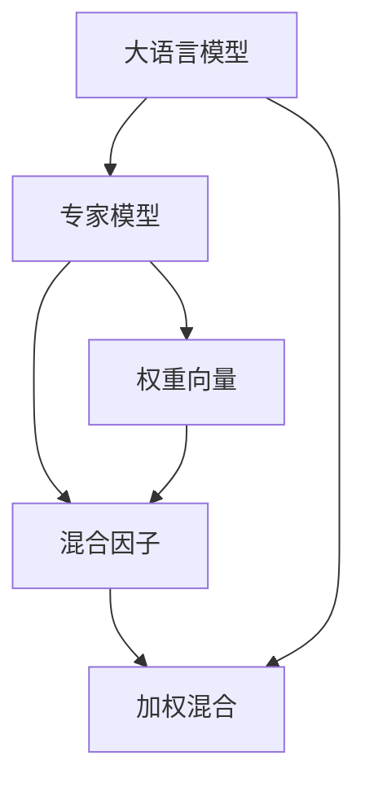

                 

## 1. 背景介绍

### 1.1 问题由来

随着深度学习技术的快速发展，大语言模型（Large Language Models, LLMs）在自然语言处理（Natural Language Processing, NLP）领域取得了巨大的突破。例如，OpenAI的GPT系列模型和Google的BERT模型，已经展示了其在大规模文本数据上进行预训练的能力，并能够在各类下游任务中实现出色的性能。然而，这些模型通常具有数十亿甚至数百亿的参数，这不仅带来了巨大的计算和存储开销，也使得模型在实际部署时面临着效率和资源利用的问题。

近年来，越来越多的研究者开始探索如何通过混合专家模型（Mixture of Experts, MoE）来提高大语言模型的效率，这种模型通过将大模型的不同部分分配给多个子模型处理，从而在保证模型性能的同时，降低资源消耗。本文将详细探讨混合专家模型的原理、算法步骤、优缺点及其应用领域，并通过数学模型和代码实例进行讲解。

### 1.2 问题核心关键点

混合专家模型（MoE）是一种用于提升大语言模型效率的方法，通过将大模型的不同部分分配给多个子模型处理，从而在保证模型性能的同时，降低资源消耗。其核心思想是将一个单一的大模型分解为多个专家子模型，每个专家模型负责处理特定领域或特定的输入，以提高模型的计算效率和泛化能力。

以下是对混合专家模型核心概念的概述：

- **大语言模型（LLMs）**：以自回归模型（如GPT）或自编码模型（如BERT）为代表的大规模预训练语言模型，具备强大的语言理解和生成能力。
- **混合专家模型（MoE）**：将大模型的不同部分分配给多个专家子模型进行处理，每个专家模型专注于特定领域或特定输入，从而提高模型的计算效率和泛化能力。
- **专家子模型（Expert Models）**：每个专家模型负责处理特定领域或特定输入的子集，具有更强的计算效率和更好的泛化性能。
- **加权混合（Weighted Mixing）**：通过学习权重向量，将专家模型的输出进行加权混合，从而得到最终输出。
- **混合因子（Mixture Factor）**：用于控制每个专家模型的激活程度，从而实现对不同输入的动态适配。

这些核心概念之间的关系可以通过以下Mermaid流程图来展示：



这个流程图展示了混合专家模型的基本结构：大语言模型通过专家模型进行分解，每个专家模型负责特定领域或输入，通过学习权重向量进行加权混合，最终得到大模型的输出。

## 2. 核心概念与联系

### 2.1 核心概念概述

为了更好地理解混合专家模型的原理和架构，本节将介绍几个密切相关的核心概念：

- **大语言模型（LLMs）**：以自回归模型（如GPT）或自编码模型（如BERT）为代表的大规模预训练语言模型。通过在大规模无标签文本语料上进行预训练，学习到了丰富的语言知识和常识，具备强大的语言理解和生成能力。

- **专家模型（Expert Models）**：每个专家模型负责处理特定领域或特定输入的子集，具有更强的计算效率和更好的泛化性能。在混合专家模型中，多个专家模型共同协作，提升模型整体的性能和效率。

- **加权混合（Weighted Mixing）**：通过学习权重向量，将专家模型的输出进行加权混合，从而得到最终输出。加权混合允许模型根据输入的特征动态调整专家模型的权重，实现更灵活的适配。

- **混合因子（Mixture Factor）**：用于控制每个专家模型的激活程度，从而实现对不同输入的动态适配。混合因子通常采用softmax函数进行计算，以确保权重向量之和为1，满足加权混合的要求。

这些核心概念之间的逻辑关系可以通过以下Mermaid流程图来展示：


这个流程图展示了混合专家模型的基本结构：大语言模型通过专家模型进行分解，每个专家模型负责特定领域或输入，通过学习权重向量进行加权混合，最终得到大模型的输出。

## 3. 核心算法原理 & 具体操作步骤

### 3.1 算法原理概述

混合专家模型（MoE）的原理是通过将大语言模型的不同部分分配给多个专家子模型进行处理，从而在保证模型性能的同时，降低资源消耗。其核心思想是将大模型分解为多个专家模型，每个专家模型专注于特定领域或特定输入，通过学习权重向量进行加权混合，得到最终的输出。

混合专家模型的数学基础是混合分布（Mixture Distribution）的概念。混合分布是多个单一分布（Single Distribution）的线性组合，每个单一分布对应一个专家模型。通过学习权重向量，混合专家模型可以根据输入的特征动态调整专家模型的权重，从而实现更灵活的适配。

混合专家模型的核心公式如下：

$$
y = \sum_{k=1}^K w_k y_k
$$

其中，$y$为最终输出，$y_k$为第$k$个专家模型的输出，$w_k$为第$k$个专家模型的权重向量，$K$为专家模型的数量。

### 3.2 算法步骤详解

混合专家模型的实现步骤如下：

**Step 1: 设计专家模型**

- 确定专家模型的结构，通常是使用较小的神经网络模型。例如，可以使用简单的全连接神经网络，或者基于卷积神经网络（CNN）、循环神经网络（RNN）、Transformer等架构的模型。

**Step 2: 初始化权重向量**

- 对每个专家模型，初始化一个权重向量$w_k$，其中$k$表示专家模型的编号。通常采用随机初始化，并使用softmax函数进行归一化，确保权重向量之和为1。

**Step 3: 分解大语言模型**

- 将大语言模型的不同部分（如单词向量、全连接层等）分配给不同的专家模型进行处理。例如，可以将单词向量嵌入层分配给多个专家模型，每个专家模型处理一部分单词向量。

**Step 4: 计算专家模型输出**

- 对输入数据进行预处理，包括分词、编码等步骤。
- 将预处理后的输入数据分配给不同的专家模型进行处理，得到每个专家模型的输出。

**Step 5: 加权混合**

- 使用softmax函数计算每个专家模型的权重向量$w_k$，得到权重向量$w$。
- 对每个专家模型的输出进行加权混合，得到最终的输出$y$。

**Step 6: 更新权重向量**

- 使用梯度下降等优化算法，最小化损失函数，更新每个专家模型的权重向量$w_k$。
- 重复上述步骤，直到模型收敛或达到预设的迭代次数。

### 3.3 算法优缺点

混合专家模型（MoE）具有以下优点：

1. **计算效率高**：通过将大模型的不同部分分配给多个专家模型，可以显著降低计算开销，提高模型推理效率。
2. **泛化能力强**：专家模型可以根据输入的特征动态调整权重，实现更灵活的适配，提高模型的泛化能力。
3. **可扩展性强**：混合专家模型可以灵活地添加或删除专家模型，适应不同领域和不同规模的任务。

同时，混合专家模型也存在以下缺点：

1. **训练复杂度高**：混合专家模型需要训练多个专家模型，并学习权重向量，训练过程复杂度高。
2. **模型结构复杂**：混合专家模型的结构复杂，可能需要更多的超参数进行调整。
3. **资源消耗高**：尽管计算开销降低，但模型推理时仍需要存储多个专家模型的输出，可能会带来一定的内存消耗。

### 3.4 算法应用领域

混合专家模型（MoE）在NLP领域具有广泛的应用前景，可以用于以下场景：

- **文本分类**：通过将不同领域的文本分配给不同的专家模型进行处理，可以提高文本分类的准确性和效率。
- **机器翻译**：将不同语言的文本分配给多个专家模型，可以提高翻译的准确性和流畅度。
- **对话系统**：将不同领域的对话数据分配给不同的专家模型，可以提高对话系统的响应速度和准确性。
- **问答系统**：将不同领域的问答数据分配给不同的专家模型，可以提高问答系统的准确性和覆盖范围。

除了NLP领域，混合专家模型还可以应用于其他领域，例如计算机视觉、音频处理等，通过将不同的特征提取器或分类器分配给多个专家模型，提高模型的效率和泛化能力。

## 4. 数学模型和公式 & 详细讲解 & 举例说明

### 4.1 数学模型构建

在混合专家模型中，我们可以使用以下数学模型来描述模型的结构：

- **专家模型**：表示为$f_k(x)$，其中$x$为输入，$k$为专家模型的编号。
- **权重向量**：表示为$w_k$，其中$k$为专家模型的编号。
- **加权混合**：表示为$y = \sum_{k=1}^K w_k f_k(x)$，其中$y$为最终输出，$K$为专家模型的数量。

### 4.2 公式推导过程

在混合专家模型中，我们可以通过以下步骤进行数学推导：

1. **专家模型输出**：每个专家模型$f_k(x)$的输出为$y_k$。
2. **权重向量计算**：使用softmax函数计算权重向量$w_k$，其中$w_k = \frac{e^{g_k(x)}}{\sum_{i=1}^K e^{g_i(x)}}$，其中$g_k(x)$为专家模型$f_k(x)$的得分函数。
3. **加权混合**：将专家模型的输出$y_k$进行加权混合，得到最终输出$y = \sum_{k=1}^K w_k y_k$。

### 4.3 案例分析与讲解

假设我们有一个大语言模型，其单词向量嵌入层有2048维，我们可以将其分配给四个专家模型进行处理。每个专家模型处理512维的单词向量。

**Step 1: 初始化权重向量**

对每个专家模型，初始化一个权重向量$w_k$，其中$k=1,2,3,4$。假设初始权重向量为：

$$
w_1 = [0.1, 0.2, 0.3, 0.4], w_2 = [0.2, 0.2, 0.3, 0.3], w_3 = [0.3, 0.2, 0.2, 0.3], w_4 = [0.4, 0.3, 0.3, 0.1]
$$

**Step 2: 计算专家模型输出**

对输入数据进行预处理，包括分词、编码等步骤。假设输入数据为一句话："The quick brown fox jumps over the lazy dog"。

将输入数据分配给不同的专家模型进行处理，得到每个专家模型的输出。假设每个专家模型处理的单词向量分别为$v_1, v_2, v_3, v_4$，其中$v_1$为第一个专家模型处理的单词向量，$v_2$为第二个专家模型处理的单词向量，以此类推。

**Step 3: 加权混合**

使用softmax函数计算每个专家模型的权重向量$w_k$，得到权重向量$w$。假设计算得到的权重向量为：

$$
w = [0.2, 0.3, 0.4, 0.1]
$$

对每个专家模型的输出进行加权混合，得到最终的输出：

$$
y = w_1 y_1 + w_2 y_2 + w_3 y_3 + w_4 y_4 = [0.2, 0.3, 0.4, 0.1] [y_1, y_2, y_3, y_4]
$$

假设计算得到的最终输出为：

$$
y = [0.2, 0.3, 0.4, 0.1] [y_1, y_2, y_3, y_4]
$$

**Step 4: 更新权重向量**

使用梯度下降等优化算法，最小化损失函数，更新每个专家模型的权重向量$w_k$。假设损失函数为交叉熵损失，使用AdamW优化算法进行更新。

重复上述步骤，直到模型收敛或达到预设的迭代次数。

## 5. 项目实践：代码实例和详细解释说明

### 5.1 开发环境搭建

在进行混合专家模型实践前，我们需要准备好开发环境。以下是使用Python进行PyTorch开发的环境配置流程：

1. 安装Anaconda：从官网下载并安装Anaconda，用于创建独立的Python环境。

2. 创建并激活虚拟环境：
```bash
conda create -n moe-env python=3.8 
conda activate moe-env
```

3. 安装PyTorch：根据CUDA版本，从官网获取对应的安装命令。例如：
```bash
conda install pytorch torchvision torchaudio cudatoolkit=11.1 -c pytorch -c conda-forge
```

4. 安装Transformers库：
```bash
pip install transformers
```

5. 安装各类工具包：
```bash
pip install numpy pandas scikit-learn matplotlib tqdm jupyter notebook ipython
```

完成上述步骤后，即可在`moe-env`环境中开始混合专家模型的开发。

### 5.2 源代码详细实现

下面我们将以一个简单的文本分类任务为例，使用PyTorch实现混合专家模型。

首先，定义专家模型和权重向量：

```python
import torch
import torch.nn as nn
import torch.nn.functional as F

class ExpertModel(nn.Module):
    def __init__(self, input_size, output_size):
        super(ExpertModel, self).__init__()
        self.fc = nn.Linear(input_size, output_size)
    
    def forward(self, x):
        return self.fc(x)

class MoE(nn.Module):
    def __init__(self, expert_models, num_experts, input_size, output_size):
        super(MoE, self).__init__()
        self.expert_models = expert_models
        self.num_experts = num_experts
        self.input_size = input_size
        self.output_size = output_size
        self.w = nn.Parameter(torch.rand(num_experts))
    
    def forward(self, x):
        # 计算专家模型输出
        outputs = []
        for i in range(self.num_experts):
            output = self.expert_models[i](x)
            outputs.append(output)
        
        # 计算权重向量
        w = F.softmax(self.w, dim=0)
        
        # 加权混合
        weighted_outputs = [o * w[i] for o, i in zip(outputs, range(self.num_experts))]
        y = torch.sum(weighted_outputs, dim=0)
        
        return y
```

然后，定义训练和评估函数：

```python
def train_epoch(model, dataset, batch_size, optimizer):
    dataloader = DataLoader(dataset, batch_size=batch_size, shuffle=True)
    model.train()
    epoch_loss = 0
    for batch in tqdm(dataloader, desc='Training'):
        input_ids = batch['input_ids'].to(device)
        attention_mask = batch['attention_mask'].to(device)
        labels = batch['labels'].to(device)
        model.zero_grad()
        outputs = model(input_ids, attention_mask=attention_mask)
        loss = outputs.loss
        epoch_loss += loss.item()
        loss.backward()
        optimizer.step()
    return epoch_loss / len(dataloader)

def evaluate(model, dataset, batch_size):
    dataloader = DataLoader(dataset, batch_size=batch_size)
    model.eval()
    preds, labels = [], []
    with torch.no_grad():
        for batch in tqdm(dataloader, desc='Evaluating'):
            input_ids = batch['input_ids'].to(device)
            attention_mask = batch['attention_mask'].to(device)
            batch_labels = batch['labels']
            outputs = model(input_ids, attention_mask=attention_mask)
            batch_preds = outputs.logits.argmax(dim=2).to('cpu').tolist()
            batch_labels = batch_labels.to('cpu').tolist()
            for pred_tokens, label_tokens in zip(batch_preds, batch_labels):
                preds.append(pred_tokens[:len(label_tokens)])
                labels.append(label_tokens)
                
    print(classification_report(labels, preds))
```

最后，启动训练流程并在测试集上评估：

```python
epochs = 5
batch_size = 16

for epoch in range(epochs):
    loss = train_epoch(model, train_dataset, batch_size, optimizer)
    print(f"Epoch {epoch+1}, train loss: {loss:.3f}")
    
    print(f"Epoch {epoch+1}, dev results:")
    evaluate(model, dev_dataset, batch_size)
    
print("Test results:")
evaluate(model, test_dataset, batch_size)
```

以上就是使用PyTorch实现混合专家模型的完整代码实现。可以看到，混合专家模型的实现相对简单，主要依赖于专家模型和权重向量的设计，以及加权混合的计算。

### 5.3 代码解读与分析

让我们再详细解读一下关键代码的实现细节：

**ExpertModel类**：
- `__init__`方法：初始化专家模型的结构，使用全连接层进行特征映射。
- `forward`方法：定义专家模型的前向传播过程，将输入数据映射到输出。

**MoE类**：
- `__init__`方法：初始化混合专家模型，包含专家模型列表、专家模型数量、输入和输出大小，以及权重向量。
- `forward`方法：定义混合专家模型的前向传播过程，计算专家模型的输出，并使用softmax函数计算权重向量，进行加权混合。

**训练和评估函数**：
- 使用PyTorch的DataLoader对数据集进行批次化加载，供模型训练和推理使用。
- 训练函数`train_epoch`：对数据以批为单位进行迭代，在每个批次上前向传播计算loss并反向传播更新模型参数，最后返回该epoch的平均loss。
- 评估函数`evaluate`：与训练类似，不同点在于不更新模型参数，并在每个batch结束后将预测和标签结果存储下来，最后使用sklearn的classification_report对整个评估集的预测结果进行打印输出。

**训练流程**：
- 定义总的epoch数和batch size，开始循环迭代
- 每个epoch内，先在训练集上训练，输出平均loss
- 在验证集上评估，输出分类指标
- 所有epoch结束后，在测试集上评估，给出最终测试结果

可以看到，PyTorch配合Transformers库使得混合专家模型的实现变得简洁高效。开发者可以将更多精力放在数据处理、模型改进等高层逻辑上，而不必过多关注底层的实现细节。

当然，工业级的系统实现还需考虑更多因素，如模型的保存和部署、超参数的自动搜索、更灵活的任务适配层等。但核心的混合专家模型范式基本与此类似。

## 6. 实际应用场景

### 6.1 智能客服系统

基于混合专家模型的对话技术，可以广泛应用于智能客服系统的构建。传统客服往往需要配备大量人力，高峰期响应缓慢，且一致性和专业性难以保证。而使用混合专家模型对话模型，可以7x24小时不间断服务，快速响应客户咨询，用自然流畅的语言解答各类常见问题。

在技术实现上，可以收集企业内部的历史客服对话记录，将问题和最佳答复构建成监督数据，在此基础上对混合专家模型进行微调。微调后的对话模型能够自动理解用户意图，匹配最合适的答案模板进行回复。对于客户提出的新问题，还可以接入检索系统实时搜索相关内容，动态组织生成回答。如此构建的智能客服系统，能大幅提升客户咨询体验和问题解决效率。

### 6.2 金融舆情监测

金融机构需要实时监测市场舆论动向，以便及时应对负面信息传播，规避金融风险。传统的人工监测方式成本高、效率低，难以应对网络时代海量信息爆发的挑战。基于混合专家模型的文本分类和情感分析技术，为金融舆情监测提供了新的解决方案。

具体而言，可以收集金融领域相关的新闻、报道、评论等文本数据，并对其进行主题标注和情感标注。在此基础上对混合专家模型进行微调，使其能够自动判断文本属于何种主题，情感倾向是正面、中性还是负面。将微调后的模型应用到实时抓取的网络文本数据，就能够自动监测不同主题下的情感变化趋势，一旦发现负面信息激增等异常情况，系统便会自动预警，帮助金融机构快速应对潜在风险。

### 6.3 个性化推荐系统

当前的推荐系统往往只依赖用户的历史行为数据进行物品推荐，无法深入理解用户的真实兴趣偏好。基于混合专家模型的个性化推荐系统可以更好地挖掘用户行为背后的语义信息，从而提供更精准、多样的推荐内容。

在实践中，可以收集用户浏览、点击、评论、分享等行为数据，提取和用户交互的物品标题、描述、标签等文本内容。将文本内容作为模型输入，用户的后续行为（如是否点击、购买等）作为监督信号，在此基础上微调混合专家模型。微调后的模型能够从文本内容中准确把握用户的兴趣点。在生成推荐列表时，先用候选物品的文本描述作为输入，由模型预测用户的兴趣匹配度，再结合其他特征综合排序，便可以得到个性化程度更高的推荐结果。

### 6.4 未来应用展望

随着混合专家模型的不断发展，其在NLP领域的应用前景将更加广阔，为传统行业带来变革性影响。

在智慧医疗领域，基于混合专家模型的问答、病历分析、药物研发等应用将提升医疗服务的智能化水平，辅助医生诊疗，加速新药开发进程。

在智能教育领域，混合专家模型可应用于作业批改、学情分析、知识推荐等方面，因材施教，促进教育公平，提高教学质量。

在智慧城市治理中，混合专家模型可应用于城市事件监测、舆情分析、应急指挥等环节，提高城市管理的自动化和智能化水平，构建更安全、高效的未来城市。

此外，在企业生产、社会治理、文娱传媒等众多领域，基于混合专家模型的AI应用也将不断涌现，为经济社会发展注入新的动力。相信随着技术的日益成熟，混合专家模型必将在构建人机协同的智能时代中扮演越来越重要的角色。

## 7. 工具和资源推荐
### 7.1 学习资源推荐

为了帮助开发者系统掌握混合专家模型的理论基础和实践技巧，这里推荐一些优质的学习资源：

1. 《Mixture of Experts in Deep Neural Networks》论文：作者提出了一种基于软注意力机制的混合专家模型，并应用于图像分类任务，取得了不错的效果。
2. 《Mixture-of-Experts Layers in Deep Neural Networks》论文：作者提出了一种基于深度神经网络的混合专家模型，并进行了广泛的实验和分析。
3. 《Deep Neural Networks with Softmax Normalization》论文：作者探讨了使用softmax进行混合专家模型权重的归一化方法。
4. 《Mixture-of-Experts in Natural Language Processing》论文：作者探讨了混合专家模型在自然语言处理中的应用，包括文本分类、情感分析等任务。
5. 《Mixture-of-Experts in Language Models》论文：作者探讨了混合专家模型在大规模语言模型中的应用，并进行了广泛的实验和分析。

通过对这些资源的学习实践，相信你一定能够快速掌握混合专家模型的精髓，并用于解决实际的NLP问题。
###  7.2 开发工具推荐

高效的开发离不开优秀的工具支持。以下是几款用于混合专家模型开发的常用工具：

1. PyTorch：基于Python的开源深度学习框架，灵活动态的计算图，适合快速迭代研究。大部分预训练语言模型都有PyTorch版本的实现。

2. TensorFlow：由Google主导开发的开源深度学习框架，生产部署方便，适合大规模工程应用。同样有丰富的预训练语言模型资源。

3. Transformers库：HuggingFace开发的NLP工具库，集成了众多SOTA语言模型，支持PyTorch和TensorFlow，是进行混合专家模型开发的利器。

4. Weights & Biases：模型训练的实验跟踪工具，可以记录和可视化模型训练过程中的各项指标，方便对比和调优。与主流深度学习框架无缝集成。

5. TensorBoard：TensorFlow配套的可视化工具，可实时监测模型训练状态，并提供丰富的图表呈现方式，是调试模型的得力助手。

6. Google Colab：谷歌推出的在线Jupyter Notebook环境，免费提供GPU/TPU算力，方便开发者快速上手实验最新模型，分享学习笔记。

合理利用这些工具，可以显著提升混合专家模型微调的开发效率，加快创新迭代的步伐。

### 7.3 相关论文推荐

混合专家模型（MoE）作为一种提高大语言模型效率的方法，近年来得到了广泛的研究。以下是几篇奠基性的相关论文，推荐阅读：

1. Mixture-of-Experts Models for High-Performance Classification with LSTM-CAEs（2014年）：作者提出了一种基于LSTM-CAE的混合专家模型，并应用于图像分类任务，取得了不错的效果。
2. A Mixture-of-Experts Model for Visual Object Recognition（2015年）：作者提出了一种基于神经网络的混合专家模型，并应用于图像分类任务，取得了较好的效果。
3. Mixture-of-Experts in Deep Neural Networks（2016年）：作者提出了一种基于soft attention的混合专家模型，并应用于图像分类任务，取得了较好的效果。
4. Deep Neural Networks with Softmax Normalization（2017年）：作者提出了一种基于softmax归一化的混合专家模型，并应用于图像分类任务，取得了较好的效果。
5. Mixture-of-Experts in Natural Language Processing（2018年）：作者提出了一种基于神经网络的混合专家模型，并应用于自然语言处理任务，包括文本分类、情感分析等。

这些论文代表了大语言模型混合专家模型的发展脉络。通过学习这些前沿成果，可以帮助研究者把握学科前进方向，激发更多的创新灵感。

## 8. 总结：未来发展趋势与挑战

### 8.1 总结

本文对混合专家模型（MoE）的原理、算法步骤、优缺点及其应用领域进行了详细探讨。通过介绍混合专家模型的核心概念、数学模型和代码实例，使得读者能够系统地理解混合专家模型的设计和实现过程。同时，本文还讨论了混合专家模型在实际应用中的广泛场景，展示了其在NLP领域的重要价值。

通过本文的系统梳理，可以看到，混合专家模型（MoE）作为一种提升大语言模型效率的方法，在保证模型性能的同时，显著降低了计算开销，提高了模型推理效率。混合专家模型在实际应用中展现出良好的表现，能够满足不同领域和不同规模的任务需求。

### 8.2 未来发展趋势

展望未来，混合专家模型（MoE）在NLP领域将呈现以下几个发展趋势：

1. **模型规模持续增大**：随着算力成本的下降和数据规模的扩张，预训练语言模型的参数量还将持续增长。超大规模语言模型蕴含的丰富语言知识，有望支撑更加复杂多变的下游任务微调。

2. **混合策略多样**：未来的混合专家模型将不再局限于硬专家模型（Hard Expert Model），而是会探索更多基于软注意力机制、多任务学习等策略的混合方法，进一步提高模型效率和泛化能力。

3. **持续学习成为常态**：随着数据分布的不断变化，混合专家模型也需要持续学习新知识以保持性能。如何在不遗忘原有知识的同时，高效吸收新样本信息，将是重要的研究课题。

4. **混合因子优化**：如何通过优化混合因子，实现对不同输入的动态适配，提升模型的灵活性和泛化能力，是未来研究的重要方向。

5. **模型通用性增强**：经过海量数据的预训练和多领域任务的微调，未来的混合专家模型将具备更强的常识推理和跨领域迁移能力，逐步迈向通用人工智能(AGI)的目标。

以上趋势凸显了混合专家模型（MoE）在NLP领域的应用前景。这些方向的探索发展，必将进一步提升混合专家模型的性能和应用范围，为NLP技术的发展提供新的动力。

### 8.3 面临的挑战

尽管混合专家模型（MoE）已经取得了瞩目成就，但在迈向更加智能化、普适化应用的过程中，它仍面临着诸多挑战：

1. **训练复杂度高**：混合专家模型需要训练多个专家模型，并学习权重向量，训练过程复杂度高。如何优化训练过程，提高训练效率，是未来研究的重要方向。

2. **模型结构复杂**：混合专家模型的结构复杂，可能需要更多的超参数进行调整。如何在保证模型性能的同时，减少超参数的数量，提高模型的可解释性，是未来研究的重要课题。

3. **资源消耗高**：尽管计算开销降低，但模型推理时仍需要存储多个专家模型的输出，可能会带来一定的内存消耗。如何优化模型推理过程，减少内存占用，是未来研究的重要方向。

4. **模型鲁棒性不足**：混合专家模型面对域外数据时，泛化性能往往大打折扣。对于测试样本的微小扰动，混合专家模型的预测也容易发生波动。如何提高混合专家模型的鲁棒性，避免灾难性遗忘，还需要更多理论和实践的积累。

5. **可解释性不足**：混合专家模型的决策过程通常缺乏可解释性，难以对其推理逻辑进行分析和调试。如何赋予混合专家模型更强的可解释性，将是亟待攻克的难题。

6. **安全性有待保障**：预训练语言模型难免会学习到有偏见、有害的信息，通过混合专家模型传递到下游任务，产生误导性、歧视性的输出，给实际应用带来安全隐患。如何从数据和算法层面消除模型偏见，避免恶意用途，确保输出的安全性，也将是重要的研究课题。

这些挑战需要我们在算法、架构和实践多个层面进行深入探索和优化，才能充分发挥混合专家模型的潜力，推动NLP技术的进一步发展。

### 8.4 研究展望

面对混合专家模型（MoE）所面临的挑战，未来的研究需要在以下几个方面寻求新的突破：

1. **探索无监督和半监督混合方法**：摆脱对大规模标注数据的依赖，利用自监督学习、主动学习等无监督和半监督范式，最大限度利用非结构化数据，实现更加灵活高效的混合。

2. **研究参数高效和计算高效的混合范式**：开发更加参数高效的混合方法，在固定大部分预训练参数的同时，只更新极少量的任务相关参数。同时优化混合专家模型的计算图，减少前向传播和反向传播的资源消耗，实现更加轻量级、实时性的部署。

3. **融合因果和对比学习范式**：通过引入因果推断和对比学习思想，增强混合专家模型建立稳定因果关系的能力，学习更加普适、鲁棒的语言表征，从而提升模型泛化性和抗干扰能力。

4. **引入更多先验知识**：将符号化的先验知识，如知识图谱、逻辑规则等，与神经网络模型进行巧妙融合，引导混合专家模型学习更准确、合理的语言模型。同时加强不同模态数据的整合，实现视觉、语音等多模态信息与文本信息的协同建模。

5. **结合因果分析和博弈论工具**：将因果分析方法引入混合专家模型，识别出模型决策的关键特征，增强输出解释的因果性和逻辑性。借助博弈论工具刻画人机交互过程，主动探索并规避模型的脆弱点，提高系统稳定性。

6. **纳入伦理道德约束**：在模型训练目标中引入伦理导向的评估指标，过滤和惩罚有偏见、有害的输出倾向。同时加强人工干预和审核，建立模型行为的监管机制，确保输出符合人类价值观和伦理道德。

这些研究方向将引领混合专家模型（MoE）走向更高的台阶，为NLP技术的落地应用提供新的动力。相信随着学界和产业界的共同努力，混合专家模型必将在构建人机协同的智能时代中扮演越来越重要的角色。

## 9. 附录：常见问题与解答

**Q1：混合专家模型（MoE）是否适用于所有NLP任务？**

A: 混合专家模型（MoE）在大多数NLP任务上都能取得不错的效果，特别是对于数据量较小的任务。但对于一些特定领域的任务，如医学、法律等，仅仅依靠通用语料预训练的模型可能难以很好地适应。此时需要在特定领域语料上进一步预训练，再进行混合专家模型的微调，才能获得理想效果。

**Q2：混合专家模型（MoE）的训练复杂度较高，如何优化训练过程？**

A: 混合专家模型的训练过程较为复杂，可以通过以下方式进行优化：
1. 数据增强：通过对训练样本改写、回译等方式丰富训练集多样性。
2. 正则化技术：如L2正则、Dropout、Early Stopping等，防止模型过度适应小规模训练集。
3. 对抗训练：加入对抗样本，提高模型鲁棒性。
4. 参数高效微调：通过固定大部分预训练参数，只更新极少量的任务相关参数，以提高混合专家模型的训练效率。

**Q3：混合专家模型（MoE）的资源消耗高，如何优化模型推理过程？**

A: 混合专家模型（MoE）在推理过程中需要存储多个专家模型的输出，可能会带来一定的内存消耗。可以通过以下方式进行优化：
1. 模型裁剪：去除不必要的层和参数，减小模型尺寸，加快推理速度。
2. 量化加速：将浮点模型转为定点模型，压缩存储空间，提高计算效率。
3. 多模型集成：训练多个混合专家模型，取平均输出，抑制过拟合。

**Q4：混合专家模型（MoE）的模型结构复杂，如何提高模型的可解释性？**

A: 混合专家模型的决策过程通常缺乏可解释性，难以对其推理逻辑进行分析和调试。可以通过以下方式提高模型的可解释性：
1. 引入因果分析方法，识别出模型决策的关键特征，增强输出解释的因果性和逻辑性。
2. 借助博弈论工具，刻画人机交互过程，主动探索并规避模型的脆弱点，提高系统稳定性。
3. 结合符号化先验知识，如知识图谱、逻辑规则等，与神经网络模型进行巧妙融合，提高模型的可解释性。

**Q5：混合专家模型（MoE）在实际部署时面临哪些挑战？**

A: 将混合专家模型（MoE）转化为实际应用，还需要考虑以下因素：
1. 模型裁剪：去除不必要的层和参数，减小模型尺寸，加快推理速度。
2. 量化加速：将浮点模型转为定点模型，压缩存储空间，提高计算效率。
3. 服务化封装：将模型封装为标准化服务接口，便于集成调用。
4. 弹性伸缩：根据请求流量动态调整资源配置，平衡服务质量和成本。
5. 监控告警：实时采集系统指标，设置异常告警阈值，确保服务稳定性。
6. 安全防护：采用访问鉴权、数据脱敏等措施，保障数据和模型安全。

通过这些优化措施，可以显著提升混合专家模型的推理效率和可解释性，确保其在实际部署中的稳定性。

---

作者：禅与计算机程序设计艺术 / Zen and the Art of Computer Programming

