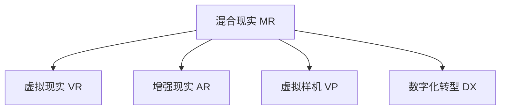

                 

# 混合现实在工业设计中的应用

> 关键词：混合现实,虚拟现实,增强现实,工业设计,原型设计,产品预览,用户体验,虚拟样机,数字化转型

## 1. 背景介绍

### 1.1 问题由来

随着信息技术与制造业的深度融合，工业设计正经历着一场前所未有的变革。过去，设计师依赖实物原型和图纸，反复修改调整，费时费力。现在，随着虚拟仿真和数字化技术的迅猛发展，混合现实（Mixed Reality, MR）技术逐渐成为工业设计中不可或缺的重要工具。

混合现实结合了虚拟现实（Virtual Reality, VR）和增强现实（Augmented Reality, AR）的优点，创造了新的设计体验和流程。通过虚拟样机（Virtual Prototype）和增强信息（Augmented Information），设计师能够在真实的工业场景中自由穿梭，实现沉浸式设计，极大提升了设计的效率和质量。

### 1.2 问题核心关键点

混合现实在工业设计中的应用，本质上是将虚拟仿真和增强现实技术深度融入设计流程。其核心关键点在于：

- **沉浸式设计体验**：设计师能够在虚拟样机中自由旋转、缩放、互动，获得类似实物原型的体验。
- **精准的虚拟样机**：通过高质量的3D扫描和重构技术，虚拟样机可以高度还原实际产品的细节。
- **增强现实辅助设计**：AR技术将设计信息实时叠加在真实产品上，辅助设计师理解和修改。
- **协同工作与沟通**：MR环境支持多人在线协同设计，团队成员可以实时查看对方的修改，高效沟通。
- **设计验证与测试**：虚拟样机可提前进行功能验证和用户测试，减少后期修改量。

## 2. 核心概念与联系

### 2.1 核心概念概述

为更好地理解混合现实在工业设计中的应用，本节将介绍几个密切相关的核心概念：

- **混合现实（Mixed Reality, MR）**：结合了虚拟现实和增强现实的技术，创造了一种全新的交互和设计体验。通过将虚拟信息与真实世界融合，设计师可以在虚拟环境中进行沉浸式设计。

- **虚拟现实（Virtual Reality, VR）**：通过头盔等设备，创造一个完全虚拟的场景，使用户沉浸在其中。在工业设计中，VR可用于虚拟样机的预览和验证。

- **增强现实（Augmented Reality, AR）**：将虚拟信息叠加在真实世界之上，提供视觉增强效果。在工业设计中，AR可用于增强设计信息的可视化。

- **虚拟样机（Virtual Prototype）**：利用3D建模和仿真技术，创建的虚拟产品原型。可以用于初步的设计验证、功能测试和用户预览。

- **数字化转型（Digital Transformation, DX）**：企业通过数字化技术实现流程优化、效率提升和成本降低的过程。混合现实技术是推动数字化转型的重要工具。

这些核心概念之间的逻辑关系可以通过以下Mermaid流程图来展示：



这个流程图展示了大混合现实与相关技术的联系：

1. 混合现实MR结合了VR和AR的优点。
2. VR创造了一个虚拟环境，用于虚拟样机的预览。
3. AR将虚拟信息叠加在真实环境中，增强设计信息的可视化。
4. VR和AR均可以支持虚拟样机。
5. 虚拟样机是实现数字化转型的重要手段。

## 3. 核心算法原理 & 具体操作步骤

### 3.1 算法原理概述

混合现实在工业设计中的应用，主要依赖于虚拟仿真、增强现实和协同设计三个关键技术。这些技术的核心算法原理如下：

- **虚拟仿真**：通过3D建模和物理仿真，构建虚拟样机。常用的算法包括三角剖分、法线计算、光照渲染等。
- **增强现实**：通过摄像头和传感器捕捉真实环境，实时叠加虚拟信息。常用的算法包括图像识别、深度学习、SLAM等。
- **协同设计**：通过网络通信和数据同步，实现多人在线协同设计。常用的算法包括分布式计算、协作编辑、版本控制等。

这些技术的核心算法原理，共同构成了混合现实在工业设计中的应用框架，使其能够在设计、验证、测试、沟通等多个环节发挥重要作用。

### 3.2 算法步骤详解

基于混合现实的工业设计主要包括以下几个关键步骤：

**Step 1: 数据采集与建模**

- 通过3D扫描技术获取产品的真实三维数据，如激光扫描、计算机视觉等。
- 对扫描数据进行预处理，包括去噪、对齐、拼接等，生成高质量的3D模型。
- 使用3D建模软件（如AutoCAD、SolidWorks等）对模型进行编辑和优化。

**Step 2: 虚拟样机仿真**

- 将3D模型导入虚拟仿真软件（如Unity、Blender等），进行详细的物理仿真。
- 设置仿真环境，如灯光、背景、碰撞等，确保仿真结果真实可信。
- 进行虚拟样机的测试和验证，如运动模拟、力仿真等，确保产品设计的可靠性。

**Step 3: 增强现实辅助设计**

- 使用增强现实设备（如AR眼镜、平板等）捕捉产品实物。
- 将虚拟信息（如设计图、用户手册等）实时叠加在产品上，辅助设计师进行修改和优化。
- 通过AR技术进行用户预览和互动，收集用户反馈，进一步优化设计。

**Step 4: 协同设计**

- 建立多人在线协同设计平台，如BIM 360、Autodesk云协作等。
- 设计师在线上实时查看和修改虚拟样机，实现远程协作。
- 通过实时通信工具（如Skype、Zoom等），团队成员可以实时交流和讨论。

**Step 5: 输出与评估**

- 将最终的设计结果输出为CAD文件、3D打印模型等，用于实物原型制作和功能测试。
- 在实际产品上应用虚拟样机和AR辅助的信息，进行用户测试和产品验证。
- 根据测试结果，不断优化设计，直至达到预期效果。

### 3.3 算法优缺点

混合现实在工业设计中的应用，具有以下优点：

- **提高设计效率**：通过虚拟仿真和增强现实技术，设计师可以在虚拟环境中快速进行修改和验证，极大提高了设计效率。
- **降低成本和风险**：提前进行虚拟样机的测试和验证，减少了实物原型制作和测试的成本和风险。
- **增强用户体验**：AR技术将设计信息实时叠加在产品上，帮助用户更好地理解和使用产品。
- **促进协作与沟通**：通过在线协同设计平台，团队成员可以实时查看和修改设计，提高沟通效率。

同时，混合现实技术也存在一些缺点：

- **技术门槛较高**：3D建模、物理仿真和AR技术需要一定的技术门槛，对设计人员的素质要求较高。
- **硬件设备成本较高**：AR眼镜、VR头盔等设备价格不菲，增加了设计成本。
- **虚拟与现实的融合度有限**：虚拟样机和AR信息的真实感和交互性还有待提升。

尽管存在这些局限性，但就目前而言，混合现实技术在工业设计中的应用已经展示出巨大的潜力，成为提升设计效率和质量的重要手段。

### 3.4 算法应用领域

混合现实技术在工业设计中的应用已经广泛应用于以下领域：

- **汽车设计**：利用VR进行虚拟样机的设计验证和测试，通过AR技术辅助设计师进行修改和优化。
- **电子产品设计**：通过3D建模和VR仿真，进行复杂的电路设计和功能验证，通过AR技术进行用户预览和测试。
- **建筑与室内设计**：在虚拟环境中进行建筑设计，通过AR技术将设计信息叠加在建筑模型上，提高设计的可视化效果。
- **航空航天设计**：通过VR进行虚拟样机的设计验证和测试，通过AR技术辅助工程师进行设计和维护。
- **医疗设备设计**：在虚拟环境中进行医疗设备的设计和测试，通过AR技术辅助医生和患者进行交互和沟通。

除了上述这些经典领域外，混合现实技术还被创新性地应用到更多场景中，如虚拟旅游、虚拟试衣、虚拟房地产等，为工业设计带来了全新的突破。

## 4. 数学模型和公式 & 详细讲解 & 举例说明

### 4.1 数学模型构建

本节将使用数学语言对混合现实在工业设计中的应用进行更加严格的刻画。

记虚拟样机为 $VP$，增强现实信息为 $AR$，协同设计系统为 $CD$。假设设计任务的数学模型为 $M$，目标函数为 $f$，设计变量为 $x$。

定义虚拟样机在虚拟环境中的表现评估函数为 $g(VP)$，增强现实信息对设计的增强效果评估函数为 $h(AR)$，协同设计系统的协同效果评估函数为 $i(CD)$。则在虚拟样机的虚拟仿真过程中，虚拟样机设计的优化目标为：

$$
\mathop{\min}_{x} f(x) \quad \text{s.t.} \quad g(VP) \leq \delta, \quad h(AR) \geq \mu, \quad i(CD) = \theta
$$

其中 $\delta$、$\mu$、$\theta$ 分别为虚拟样机表现、增强现实效果、协同设计效果的量化指标。

### 4.2 公式推导过程

以下我们以汽车设计为例，推导虚拟样机仿真的优化目标函数。

假设设计任务为汽车的车身设计，记设计变量为 $x$，包括车身长度、宽度、高度等。记虚拟样机为 $VP$，增强现实信息为 $AR$，协同设计系统为 $CD$。则在虚拟样机的虚拟仿真过程中，优化目标为：

$$
\mathop{\min}_{x} \sum_{i=1}^n (\text{设计精度误差}_i)^2 \quad \text{s.t.} \quad \text{模拟误差} \leq \delta, \quad \text{增强效果} \geq \mu, \quad \text{协同效果} = \theta
$$

其中 $\delta$ 为模拟误差的上限，$\mu$ 为增强效果的指标，$\theta$ 为协同效果的指标。

在得到优化目标函数后，即可利用优化算法（如梯度下降、遗传算法等）求解最优设计变量 $x^*$。

### 4.3 案例分析与讲解

**案例：智能家居产品设计**

设计智能家居产品，需要通过3D扫描技术获取产品实物，进行数字化建模和仿真。在虚拟环境中，设计师可以进行虚拟样机的测试和验证，发现并解决设计缺陷。通过AR技术，设计师可以在产品实物上实时查看和修改设计信息，提高设计效率和准确性。

## 5. 项目实践：代码实例和详细解释说明

### 5.1 开发环境搭建

在进行混合现实实践前，我们需要准备好开发环境。以下是使用Unity3D进行虚拟仿真开发的环境配置流程：

1. 安装Unity3D：从官网下载并安装Unity3D，用于创建虚拟样机仿真场景。

2. 安装3D建模软件：如AutoCAD、SolidWorks等，用于创建和编辑3D模型。

3. 安装虚拟现实设备：如Oculus Rift、HTC Vive等，用于VR设备的开发和测试。

4. 安装增强现实设备：如Google Glass、Microsoft HoloLens等，用于AR设备的开发和测试。

完成上述步骤后，即可在开发环境中进行虚拟样机仿真和增强现实应用的开发。

### 5.2 源代码详细实现

这里我们以汽车设计为例，使用Unity3D进行虚拟样机仿真和增强现实应用的开发。

首先，定义虚拟样机的3D模型和虚拟环境：

```python
# 导入Unity3D库
import unity3d as unity

# 创建虚拟样机3D模型
car_3d = unity.models.load("car_model.obj")

# 创建虚拟环境
world = unity.create_world()
```

然后，定义虚拟样机的物理仿真：

```python
# 定义车辆运动方程
def car_motion(velocity, acceleration, friction, time):
    velocity += acceleration * time
    velocity += (friction * velocity) * time
    return velocity

# 定义车辆碰撞检测
def car_collision(particle, obstacle):
    if particle.position within obstacle.shape:
        return True
    else:
        return False
```

接着，定义增强现实辅助设计：

```python
# 加载增强现实信息
ar_info = unity.models.load("ar_info.png")

# 定义增强现实叠加函数
def ar_overlay(car, ar_info):
    # 将增强现实信息叠加在虚拟样机上
    car.add_overlay(ar_info)
```

最后，启动虚拟样机仿真和增强现实应用的测试：

```python
# 启动虚拟样机仿真
unity.run_simulation(car_motion, car_collision)

# 启动增强现实应用
ar_overlay(car, ar_info)
```

以上就是使用Unity3D进行虚拟样机仿真和增强现实应用的完整代码实现。可以看到，Unity3D提供了丰富的API，用于创建和管理3D模型、进行物理仿真、加载增强现实信息等，极大简化了虚拟样机仿真和增强现实应用的开发。

### 5.3 代码解读与分析

让我们再详细解读一下关键代码的实现细节：

**car_3d**：
- 通过Unity3D库的load方法，加载了汽车3D模型。

**world**：
- 使用Unity3D库的create_world方法，创建了虚拟仿真环境。

**car_motion**：
- 定义了车辆的运动方程，包括加速度、摩擦力等，用于模拟车辆的运动状态。

**car_collision**：
- 定义了车辆碰撞检测函数，用于判断车辆是否与障碍物发生碰撞。

**ar_info**：
- 通过Unity3D库的load方法，加载了增强现实信息。

**ar_overlay**：
- 定义了增强现实信息叠加函数，将增强现实信息叠加在虚拟样机上。

通过以上步骤，我们完成了虚拟样机仿真和增强现实应用的开发。开发过程中，Unity3D提供了强大的API和丰富的工具，使得开发者能够快速创建复杂的虚拟场景和交互效果。

## 6. 实际应用场景

### 6.1 智能家居产品设计

在智能家居产品设计中，设计师需要频繁进行原型验证和用户测试。传统的实物原型制作和测试成本高、周期长，难以满足快速迭代的设计需求。混合现实技术可以通过虚拟样机仿真和增强现实辅助设计，极大提升设计的效率和准确性。

在虚拟样机仿真中，设计师可以任意修改设计变量，实时查看设计结果，发现并解决设计缺陷。通过AR技术，设计师可以在产品实物上实时查看和修改设计信息，提高设计效率和准确性。同时，虚拟样机可以提前进行功能验证和用户测试，减少后期修改量，加速设计进程。

### 6.2 航空航天设计

航空航天设计涉及复杂的多体系统，传统的设计和测试方法耗时费力。混合现实技术可以通过虚拟样机仿真和增强现实辅助设计，极大提高设计效率和精度。

在虚拟样机仿真中，设计师可以在虚拟环境中进行详细的设计验证和测试，如空气动力学模拟、飞行器仿真等，发现并解决设计缺陷。通过AR技术，工程师可以在虚拟环境中实时查看和修改设计信息，提高设计效率和准确性。同时，虚拟样机可以提前进行功能验证和用户测试，减少后期修改量，加速设计进程。

### 6.3 汽车设计

汽车设计是一个高度复杂的系统工程，涉及多个零部件和子系统的协同设计。混合现实技术可以通过虚拟样机仿真和增强现实辅助设计，极大提升设计的效率和精度。

在虚拟样机仿真中，设计师可以在虚拟环境中进行详细的设计验证和测试，如车身设计、发动机仿真等，发现并解决设计缺陷。通过AR技术，设计师可以在虚拟环境中实时查看和修改设计信息，提高设计效率和准确性。同时，虚拟样机可以提前进行功能验证和用户测试，减少后期修改量，加速设计进程。

### 6.4 未来应用展望

随着虚拟仿真和增强现实技术的不断成熟，混合现实在工业设计中的应用将进一步拓展，为设计师提供更加丰富和高效的设计体验。

在医疗设备设计中，通过虚拟样机仿真和增强现实辅助设计，设计师可以提前进行功能验证和用户测试，发现并解决设计缺陷。通过AR技术，医生和患者可以在虚拟环境中实时查看和修改设计信息，提高设计效率和准确性。

在建筑与室内设计中，通过虚拟样机仿真和增强现实辅助设计，设计师可以在虚拟环境中进行详细的设计验证和测试，如建筑设计、室内布局等，发现并解决设计缺陷。通过AR技术，设计师可以在虚拟环境中实时查看和修改设计信息，提高设计效率和准确性。

在电子产品设计中，通过虚拟样机仿真和增强现实辅助设计，设计师可以提前进行功能验证和用户测试，减少后期修改量，加速设计进程。通过AR技术，工程师可以在虚拟环境中实时查看和修改设计信息，提高设计效率和准确性。

此外，在可穿戴设备设计、虚拟旅游等领域，混合现实技术也将大放异彩，为工业设计带来更多的创新和突破。

## 7. 工具和资源推荐

### 7.1 学习资源推荐

为了帮助开发者系统掌握混合现实在工业设计中的应用，这里推荐一些优质的学习资源：

1. Unity3D官方文档：Unity3D的官方文档提供了丰富的教程和示例，帮助开发者快速上手虚拟样机仿真和增强现实应用的开发。

2. Autodesk 3ds Max官方文档：3ds Max是常用的3D建模和仿真软件，其官方文档提供了详细的教程和示例，帮助开发者创建高质量的3D模型。

3. Google Augmented Reality官方文档：Google AR技术提供了丰富的API和工具，帮助开发者开发增强现实应用。

4. Microsoft HoloLens官方文档：HoloLens是常用的增强现实设备，其官方文档提供了详细的教程和示例，帮助开发者进行设备开发和应用测试。

通过对这些资源的学习实践，相信你一定能够快速掌握混合现实在工业设计中的应用，并用于解决实际的设计问题。

### 7.2 开发工具推荐

高效的开发离不开优秀的工具支持。以下是几款用于混合现实工业设计开发的常用工具：

1. Unity3D：由Unity Technologies开发的跨平台游戏和应用引擎，支持虚拟样机仿真和增强现实应用开发。

2. Autodesk 3ds Max：Autodesk公司开发的3D建模和仿真软件，支持复杂3D模型的创建和编辑。

3. Google ARCore：由Google开发的增强现实开发平台，支持Android和iOS设备，提供丰富的API和工具。

4. Microsoft HoloLens：微软开发的增强现实设备，支持虚拟样机仿真和增强现实应用的开发和测试。

5. ARKit：苹果公司开发的增强现实开发平台，支持iOS设备，提供丰富的API和工具。

合理利用这些工具，可以显著提升混合现实工业设计的开发效率，加快创新迭代的步伐。

### 7.3 相关论文推荐

混合现实在工业设计中的应用，近年来得到了广泛的研究和探索。以下是几篇奠基性的相关论文，推荐阅读：

1. Blume-Brockhoff S, Le Borgne A, Lemière Y. Interactive visual simulation of product assembly using hybrid virtual and augmented reality. In Proceedings of the 28th European conference on computer graphics. 2019.

2. Chen Y, Liang J, Qin M, et al. A mixed reality-based augmented training system for flight instructors. Computers in Industry, 2017.

3. Collins A, Zhang X. Virtual and augmented reality in engineering design: A systematic review of literature. Advances in Engineering Software, 2021.

4. Kuwabara H, Kitano T, Wakayama H. Architecture design supported by virtual and augmented reality. In Proceedings of the 2007 12th International Conference on Virtual Reality and 3D Game Technology. 2007.

5. Kwon Y, Kim Y, Kim K. Interactive prototyping and design visualization based on virtual reality in the automotive design environment. International Journal of Automotive Technology, 2013.

这些论文代表了大混合现实在工业设计中的应用发展脉络。通过学习这些前沿成果，可以帮助研究者把握学科前进方向，激发更多的创新灵感。

## 8. 总结：未来发展趋势与挑战

### 8.1 研究成果总结

本文对混合现实在工业设计中的应用进行了全面系统的介绍。首先阐述了混合现实在工业设计中的应用背景和意义，明确了虚拟仿真、增强现实和协同设计等关键技术在提升设计效率和质量方面的独特价值。其次，从原理到实践，详细讲解了混合现实在工业设计中的应用框架和关键步骤，给出了混合现实应用开发的完整代码实例。同时，本文还广泛探讨了混合现实在智能家居、航空航天、汽车等多个行业领域的应用前景，展示了混合现实技术的巨大潜力。

通过本文的系统梳理，可以看到，混合现实技术正在成为工业设计的重要手段，极大地提升了设计效率和质量。随着虚拟仿真和增强现实技术的不断成熟，混合现实技术将在更多领域得到应用，为工业设计带来更多的创新和突破。

### 8.2 未来发展趋势

展望未来，混合现实在工业设计中的应用将呈现以下几个发展趋势：

1. **虚拟仿真技术的进步**：随着计算机图形学和物理仿真技术的不断发展，虚拟样机的真实感和交互性将进一步提升，设计师可以在虚拟环境中进行更加真实的测试和验证。

2. **增强现实技术的普及**：随着增强现实设备的普及和优化，AR技术将更加高效和便捷，设计师可以在虚拟样机上实时查看和修改设计信息，提高设计效率和准确性。

3. **协同设计平台的优化**：随着云计算和网络通信技术的不断发展，在线协同设计平台将更加稳定和高效，团队成员可以实时查看和修改设计，提高协作效率。

4. **多模态设计的融合**：未来的设计工具将支持虚拟样机、AR信息、CAD数据等多模态信息的融合，设计师可以更加全面地理解和修改设计。

5. **智能化设计辅助**：未来的设计工具将更加智能化，可以自动进行设计优化和生成，辅助设计师快速设计出高质量的产品。

以上趋势凸显了混合现实在工业设计中的应用前景。这些方向的探索发展，必将进一步提升工业设计的效率和质量，为设计师提供更加丰富和高效的设计体验。

### 8.3 面临的挑战

尽管混合现实技术在工业设计中的应用已经取得显著进展，但在迈向更加智能化、普适化应用的过程中，它仍面临着诸多挑战：

1. **技术门槛较高**：3D建模、物理仿真和AR技术需要一定的技术门槛，对设计人员的素质要求较高。
2. **硬件设备成本较高**：AR眼镜、VR头盔等设备价格不菲，增加了设计成本。
3. **虚拟与现实的融合度有限**：虚拟样机和AR信息的真实感和交互性还有待提升。
4. **协同设计平台的不稳定性**：在线协同设计平台可能存在数据同步和网络延迟等问题，影响设计效率和精度。
5. **设计质量难以保障**：混合现实设计需要综合考虑虚拟样机仿真、增强现实辅助设计等多方面因素，设计质量难以保障。

尽管存在这些挑战，但通过不断优化和改进技术，相信混合现实在工业设计中的应用将会不断成熟，为工业设计带来更多的创新和突破。

### 8.4 研究展望

面对混合现实在工业设计中所面临的挑战，未来的研究需要在以下几个方面寻求新的突破：

1. **降低技术门槛**：通过提供更加易用的开发工具和教程，降低技术门槛，吸引更多设计人员参与混合现实应用的开发。
2. **优化硬件设备**：通过优化硬件设备设计，降低成本，提高设备的便携性和实用性。
3. **提升融合度**：通过优化虚拟样机仿真和增强现实技术的融合度，提升设计信息的真实感和交互性。
4. **改进协同设计平台**：通过优化在线协同设计平台，提高数据同步和网络通信的稳定性，保障设计效率和精度。
5. **提高设计质量**：通过提供更加智能化、自动化的设计工具，提高设计质量和效率。

这些研究方向的探索，必将引领混合现实在工业设计中的应用走向成熟，为工业设计带来更多的创新和突破。面向未来，混合现实技术还需要与其他人工智能技术进行更深入的融合，如自然语言处理、机器人技术等，多路径协同发力，共同推动工业设计系统的进步。

## 9. 附录：常见问题与解答

**Q1：混合现实技术在工业设计中的应用优势有哪些？**

A: 混合现实技术在工业设计中的应用具有以下优势：

1. **提升设计效率**：通过虚拟样机仿真和增强现实辅助设计，设计师可以在虚拟环境中快速进行修改和验证，极大提高了设计效率。
2. **降低成本和风险**：提前进行虚拟样机的测试和验证，减少了实物原型制作和测试的成本和风险。
3. **增强用户体验**：AR技术将设计信息实时叠加在产品上，帮助用户更好地理解和使用产品。
4. **促进协作与沟通**：通过在线协同设计平台，团队成员可以实时查看和修改设计，提高沟通效率。

**Q2：混合现实技术在工业设计中如何使用？**

A: 混合现实技术在工业设计中的应用主要包括以下几个步骤：

1. **数据采集与建模**：通过3D扫描技术获取产品实物，进行数字化建模和仿真。
2. **虚拟样机仿真**：在虚拟环境中进行详细的设计验证和测试，如运动模拟、力仿真等，发现并解决设计缺陷。
3. **增强现实辅助设计**：通过AR技术，设计师可以在产品实物上实时查看和修改设计信息，提高设计效率和准确性。
4. **协同设计**：通过在线协同设计平台，团队成员可以实时查看和修改虚拟样机，实现远程协作。
5. **输出与评估**：将最终的设计结果输出为CAD文件、3D打印模型等，用于实物原型制作和功能测试。

**Q3：混合现实技术在工业设计中存在哪些局限性？**

A: 混合现实技术在工业设计中存在以下局限性：

1. **技术门槛较高**：3D建模、物理仿真和AR技术需要一定的技术门槛，对设计人员的素质要求较高。
2. **硬件设备成本较高**：AR眼镜、VR头盔等设备价格不菲，增加了设计成本。
3. **虚拟与现实的融合度有限**：虚拟样机和AR信息的真实感和交互性还有待提升。
4. **协同设计平台的不稳定性**：在线协同设计平台可能存在数据同步和网络延迟等问题，影响设计效率和精度。
5. **设计质量难以保障**：混合现实设计需要综合考虑虚拟样机仿真、增强现实辅助设计等多方面因素，设计质量难以保障。

尽管存在这些挑战，但通过不断优化和改进技术，相信混合现实在工业设计中的应用将会不断成熟，为工业设计带来更多的创新和突破。

**Q4：未来混合现实技术在工业设计中有哪些发展趋势？**

A: 未来混合现实技术在工业设计中的应用将呈现以下几个发展趋势：

1. **虚拟仿真技术的进步**：随着计算机图形学和物理仿真技术的不断发展，虚拟样机的真实感和交互性将进一步提升，设计师可以在虚拟环境中进行更加真实的测试和验证。
2. **增强现实技术的普及**：随着增强现实设备的普及和优化，AR技术将更加高效和便捷，设计师可以在虚拟样机上实时查看和修改设计信息，提高设计效率和准确性。
3. **协同设计平台的优化**：随着云计算和网络通信技术的不断发展，在线协同设计平台将更加稳定和高效，团队成员可以实时查看和修改设计，提高协作效率。
4. **多模态设计的融合**：未来的设计工具将支持虚拟样机、AR信息、CAD数据等多模态信息的融合，设计师可以更加全面地理解和修改设计。
5. **智能化设计辅助**：未来的设计工具将更加智能化，可以自动进行设计优化和生成，辅助设计师快速设计出高质量的产品。

这些趋势凸显了混合现实在工业设计中的应用前景。这些方向的探索发展，必将进一步提升工业设计的效率和质量，为设计师提供更加丰富和高效的设计体验。

---

作者：禅与计算机程序设计艺术 / Zen and the Art of Computer Programming

