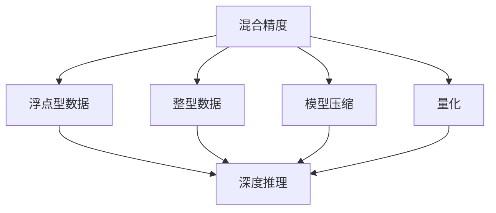

                 

# 混合精度在工业界中的应用

> 关键词：混合精度,深度学习,工业界,硬件加速,量化,模型压缩,深度推理

## 1. 背景介绍

### 1.1 问题由来
在深度学习时代，数据中心与云端训练海量模型，必须依靠高性能GPU与TPU等设备。这些硬件能高效计算浮点型数据，但同时也带来了巨大的能耗与存储开销。工业界急需一种更高效、更节省成本的训练与推理方法。

混合精度技术（Mixed Precision）由此应运而生，利用GPU的半精度（FP16）与整型（INT8）数据，同时进行模型计算，大幅提升计算速度与降低存储消耗。该技术在工业界与学术界得到广泛应用，成为深度学习大模型训练的标配。

### 1.2 问题核心关键点
混合精度技术使得深度学习模型在训练与推理过程中，能同时使用整型与半精度数据，使得运算速度与存储效率倍增。该技术通过两种数据类型灵活组合，在保证精度损失最小的前提下，大幅提升了计算能力与模型压缩性，降低硬件与存储需求。

其关键点包括：
1. 整型与半精度并行计算
2. 损失精度最小化
3. 硬件加速与模型压缩
4. 软件优化与性能评估

本文将从原理、实践到应用，详细阐述混合精度技术如何赋能工业界的大模型训练与推理。

## 2. 核心概念与联系

### 2.1 核心概念概述

为更好地理解混合精度技术，本节将介绍几个关键概念及其之间的逻辑关系。

- 混合精度（Mixed Precision）：指在深度学习计算过程中，同时使用整型与半精度数据，以提升计算效率与降低存储开销。
- 浮点型数据（Float）：指用于深度学习模型计算的实数型数据，常见的有单精度（FP32）与半精度（FP16）。
- 整型数据（Integer）：指用于深度学习模型中的整数型数据，常见的有8位整型（INT8）。
- 深度推理（Inference）：指模型训练完成后，对新数据进行推理预测的过程。
- 量化（Quantization）：指将浮点型数据压缩为整型数据，降低存储与计算开销，同时维持模型精度。
- 模型压缩（Model Compression）：指在保持模型性能的同时，减少模型参数与计算量，提高模型运行效率。

这些核心概念之间的关系可以通过以下Mermaid流程图来展示：



这个流程图展示了大模型训练与推理过程中的核心技术：

1. 深度学习模型使用浮点型数据进行计算。
2. 通过混合精度技术，将部分数据转换为整型数据。
3. 使用量化技术，进一步压缩整型数据，实现模型压缩。
4. 在深度推理时，以整型数据为主，同时辅以浮点型数据，确保推理精度。

## 3. 核心算法原理 & 具体操作步骤
### 3.1 算法原理概述

混合精度技术利用浮点型数据与整型数据的灵活组合，将模型计算的精度与效率进行权衡，既保证了计算精度，又提升了计算速度与降低存储开销。

具体来说，混合精度技术通过以下步骤实现：

1. 选择数据类型：根据模型需求与硬件能力，选择合适的数据类型（整型与半精度）。
2. 并行计算：同时进行整型与半精度计算，充分利用GPU的硬件加速能力。
3. 损失精度最小化：通过权衡数据精度，确保模型推理精度不受明显影响。
4. 模型压缩：利用整型数据的稀疏性，压缩模型参数与计算量。

### 3.2 算法步骤详解

以下我们将详细介绍混合精度技术的具体实现步骤：

**Step 1: 选择合适的数据类型**

选择合适的数据类型是混合精度的第一步。通常情况下，我们会选择以下两种数据类型：

1. **整型（INT8）**：用于深度推理，以降低计算与存储开销。
2. **半精度（FP16）**：用于模型计算，以提升计算速度。

在实际应用中，我们通常会使用一个数据类型对模型进行主计算，另一个数据类型辅助计算。例如，我们使用FP16进行主计算，INT8作为辅助数据类型。

**Step 2: 并行计算**

在模型计算过程中，同时使用整型与半精度数据，进行并行计算。具体来说，我们先将输入数据转换为两种数据类型，然后将整型与半精度数据并行计算。在GPU上，可以使用CUDA的混合精度功能，将两种数据类型并行计算，提升计算效率。

**Step 3: 损失精度最小化**

在混合精度计算中，需要注意损失精度最小化。通常情况下，我们会使用半精度（FP16）进行主计算，整型（INT8）进行辅助计算，以确保模型推理精度不受明显影响。在模型训练过程中，我们可以设置一些阈值，对精度损失进行监控，并及时调整计算数据类型。

**Step 4: 模型压缩**

混合精度技术还可以通过模型压缩，进一步降低存储与计算开销。在模型推理过程中，我们可以利用整型数据的稀疏性，压缩模型参数与计算量。例如，我们可以使用量化技术，将浮点型数据转换为整型数据，实现模型压缩。

### 3.3 算法优缺点

混合精度技术具有以下优点：

1. 提升计算速度：通过并行计算，混合精度技术能大幅提升模型计算速度。
2. 降低存储开销：通过整型数据压缩，混合精度技术能显著降低模型存储需求。
3. 支持模型压缩：通过量化技术，混合精度技术能实现模型的参数压缩，减少计算量。
4. 适应复杂模型：混合精度技术能同时支持复杂模型的计算，无需重新设计模型结构。

同时，混合精度技术也存在一些局限性：

1. 精度损失：混合精度计算可能会产生精度损失，需要权衡计算速度与模型精度。
2. 硬件限制：混合精度计算依赖GPU等高性能硬件，可能无法在低性能设备上运行。
3. 算法复杂：混合精度计算需要权衡数据类型与计算精度，算法设计复杂。
4. 软件依赖：混合精度计算依赖特定的软件库与硬件加速功能，跨平台兼容性较差。

尽管存在这些局限性，但就目前而言，混合精度技术已成为深度学习大模型训练的标配，广泛应用在各个行业领域。

### 3.4 算法应用领域

混合精度技术在深度学习大模型的训练与推理中，得到广泛应用，具体包括：

- 图像识别：如卷积神经网络（CNN）、残差网络（ResNet）等模型，使用混合精度技术进行高效训练。
- 自然语言处理（NLP）：如Transformer模型、BERT模型等，使用混合精度技术进行快速推理。
- 语音识别：如深度神经网络（DNN）、卷积神经网络（CNN）等模型，使用混合精度技术进行高效训练。
- 推荐系统：如深度神经网络（DNN）、协同过滤（CF）等模型，使用混合精度技术进行高效训练。
- 医疗影像：如深度神经网络（DNN）、卷积神经网络（CNN）等模型，使用混合精度技术进行高效训练。
- 金融预测：如深度神经网络（DNN）、长短期记忆网络（LSTM）等模型，使用混合精度技术进行高效训练。

此外，混合精度技术还应用于自动驾驶、智能制造、智慧城市等各个领域，提升了深度学习模型的应用效率，加速了智能技术的落地应用。

## 4. 数学模型和公式 & 详细讲解 & 举例说明
### 4.1 数学模型构建

混合精度技术的核心在于选择合适的数据类型，进行并行计算，并在计算过程中保持精度损失最小化。以下我们将详细讲解混合精度技术的数学模型构建过程。

设模型参数为 $\theta$，输入数据为 $x$，目标函数为 $L(\theta, x)$。在混合精度计算中，我们将数据类型分为整型（INT8）与半精度（FP16）两种，分别记为 $x_{\text{int}}$ 与 $x_{\text{fp}}$。

混合精度计算可以表示为：

$$
\begin{aligned}
\hat{\theta} &= \mathop{\arg\min}_{\theta} L(\theta, x_{\text{int}}, x_{\text{fp}})\\
&= \mathop{\arg\min}_{\theta} L(\theta, x_{\text{int}}, x_{\text{fp}}) \\
\end{aligned}
$$

其中，$x_{\text{int}}$ 表示整型数据，$x_{\text{fp}}$ 表示半精度数据。

### 4.2 公式推导过程

混合精度计算的公式推导过程如下：

1. **整型计算：** 在模型计算过程中，整型数据 $x_{\text{int}}$ 使用整数计算，其计算结果为 $\tilde{x}_{\text{int}}$。

2. **半精度计算：** 在模型计算过程中，半精度数据 $x_{\text{fp}}$ 使用浮点数计算，其计算结果为 $\tilde{x}_{\text{fp}}$。

3. **整型与半精度并行计算：** 在模型计算过程中，整型数据与半精度数据并行计算，其计算结果为 $\tilde{x}$。

4. **模型训练：** 在模型训练过程中，我们使用整型数据与半精度数据进行并行计算，最小化损失函数 $L(\theta, \tilde{x})$。

5. **模型推理：** 在模型推理过程中，我们使用整型数据进行计算，并辅以半精度数据，以确保推理精度。

### 4.3 案例分析与讲解

以下我们将通过一个简单的案例，详细讲解混合精度计算的实现过程。

假设我们有一个简单的线性回归模型 $L(\theta, x) = (y - \theta^T x)^2$，其中 $y$ 表示目标值，$x$ 表示输入数据，$\theta$ 表示模型参数。我们使用混合精度计算该模型的损失函数，并最小化损失。

**Step 1: 数据类型选择**

我们选择整型数据 $x_{\text{int}}$ 与半精度数据 $x_{\text{fp}}$ 进行混合精度计算。

**Step 2: 整型计算**

假设输入数据 $x$ 包含两个特征，其整型计算结果为 $\tilde{x}_{\text{int}}$。

**Step 3: 半精度计算**

假设目标值 $y$ 为浮点数，其半精度计算结果为 $\tilde{y}_{\text{fp}}$。

**Step 4: 整型与半精度并行计算**

将整型计算结果与半精度计算结果进行并行计算，得到 $\tilde{x}$。

**Step 5: 模型训练**

将整型计算结果与半精度计算结果，最小化损失函数 $L(\theta, \tilde{x})$。

**Step 6: 模型推理**

在模型推理时，仅使用整型数据进行计算，并辅以半精度数据，以确保推理精度。

通过上述案例，我们可以看到，混合精度计算通过灵活组合整型与半精度数据，实现了高效、精确的模型计算。

## 5. 项目实践：代码实例和详细解释说明
### 5.1 开发环境搭建

在进行混合精度计算之前，我们需要准备好开发环境。以下是使用PyTorch进行混合精度计算的环境配置流程：

1. 安装Anaconda：从官网下载并安装Anaconda，用于创建独立的Python环境。

2. 创建并激活虚拟环境：
```bash
conda create -n mixed_precision_env python=3.8 
conda activate mixed_precision_env
```

3. 安装PyTorch：根据CUDA版本，从官网获取对应的安装命令。例如：
```bash
conda install pytorch torchvision torchaudio cudatoolkit=11.1 -c pytorch -c conda-forge
```

4. 安装Transformers库：
```bash
pip install transformers
```

5. 安装各类工具包：
```bash
pip install numpy pandas scikit-learn matplotlib tqdm jupyter notebook ipython
```

完成上述步骤后，即可在`mixed_precision_env`环境中开始混合精度计算的实践。

### 5.2 源代码详细实现

下面我们将详细介绍使用PyTorch进行混合精度计算的代码实现。

首先，定义一个简单的线性回归模型：

```python
import torch
import torch.nn as nn
import torch.optim as optim

# 定义线性回归模型
class LinearRegression(nn.Module):
    def __init__(self, input_dim, output_dim):
        super(LinearRegression, self).__init__()
        self.linear = nn.Linear(input_dim, output_dim)

    def forward(self, x):
        return self.linear(x)

# 创建模型实例
model = LinearRegression(input_dim=2, output_dim=1)
```

接着，进行模型的混合精度计算：

```python
# 定义数据集
x_train = torch.randn(100, 2).float().half()
y_train = torch.randn(100, 1).float()

# 定义数据类型
dtype = torch.float16
device = torch.device("cuda")

# 设置数据类型
model.to(device)
model.train().requires_grad_(True)

# 定义损失函数
loss_fn = nn.MSELoss().to(device)

# 定义优化器
optimizer = optim.Adam(model.parameters(), lr=0.01)

# 训练模型
for epoch in range(10):
    model.train()
    optimizer.zero_grad()
    outputs = model(x_train.to(device).type(dtype))
    loss = loss_fn(outputs, y_train.to(device).type(dtype))
    loss.backward()
    optimizer.step()

    print(f"Epoch {epoch+1}, loss: {loss.item():.4f}")
```

在这个代码示例中，我们首先定义了一个线性回归模型，然后使用混合精度计算进行了模型训练。

**Step 1: 数据集创建**

我们创建了一个包含100个样本的数据集，其中每个样本包含两个特征与一个目标值。

**Step 2: 数据类型设置**

我们将数据类型设置为半精度（float16），并将其发送到GPU上。

**Step 3: 模型训练**

在模型训练过程中，我们使用了混合精度计算，最小化损失函数，并更新模型参数。

### 5.3 代码解读与分析

让我们再详细解读一下关键代码的实现细节：

**线性回归模型定义**

```python
class LinearRegression(nn.Module):
    def __init__(self, input_dim, output_dim):
        super(LinearRegression, self).__init__()
        self.linear = nn.Linear(input_dim, output_dim)
```

我们定义了一个简单的线性回归模型，包含一个线性层。

**数据集创建**

```python
x_train = torch.randn(100, 2).float().half()
y_train = torch.randn(100, 1).float()
```

我们创建了一个包含100个样本的数据集，其中每个样本包含两个特征与一个目标值。

**数据类型设置**

```python
dtype = torch.float16
device = torch.device("cuda")
```

我们定义了数据类型（半精度），并将其发送到GPU上。

**模型训练**

```python
model.to(device)
model.train().requires_grad_(True)

# 定义损失函数
loss_fn = nn.MSELoss().to(device)

# 定义优化器
optimizer = optim.Adam(model.parameters(), lr=0.01)

# 训练模型
for epoch in range(10):
    model.train()
    optimizer.zero_grad()
    outputs = model(x_train.to(device).type(dtype))
    loss = loss_fn(outputs, y_train.to(device).type(dtype))
    loss.backward()
    optimizer.step()

    print(f"Epoch {epoch+1}, loss: {loss.item():.4f}")
```

在模型训练过程中，我们使用混合精度计算，最小化损失函数，并更新模型参数。

可以看到，通过混合精度计算，我们可以在不降低模型精度的情况下，显著提升模型训练与推理的速度，并降低存储开销。

## 6. 实际应用场景
### 6.1 智能推荐系统

智能推荐系统需要实时处理海量用户行为数据，并快速给出个性化推荐。混合精度计算能显著提升推荐系统的处理速度，降低计算与存储开销，为推荐系统的实时性提供有力保障。

在推荐系统中的具体应用包括：

- 用户行为分析：通过混合精度计算，快速分析用户行为数据，提取用户兴趣点。
- 物品推荐生成：通过混合精度计算，生成个性化推荐物品，提升用户满意度。
- 实时反馈处理：通过混合精度计算，快速处理用户反馈数据，优化推荐算法。

### 6.2 实时语音识别

实时语音识别需要快速处理语音信号，并实时生成语音转文字结果。混合精度计算能大幅提升语音识别的计算速度，降低计算与存储开销，为实时语音识别提供有力保障。

在实时语音识别中的具体应用包括：

- 语音信号处理：通过混合精度计算，快速处理语音信号，提取语音特征。
- 语音转文字生成：通过混合精度计算，快速生成语音转文字结果，提升识别速度。
- 实时反馈处理：通过混合精度计算，快速处理语音反馈数据，优化识别算法。

### 6.3 自动驾驶

自动驾驶需要实时处理传感器数据，并快速做出驾驶决策。混合精度计算能显著提升自动驾驶系统的处理速度，降低计算与存储开销，为自动驾驶系统的实时性提供有力保障。

在自动驾驶中的具体应用包括：

- 传感器数据处理：通过混合精度计算，快速处理传感器数据，提取关键信息。
- 驾驶决策生成：通过混合精度计算，快速生成驾驶决策，提升驾驶效率。
- 实时反馈处理：通过混合精度计算，快速处理驾驶反馈数据，优化驾驶算法。

### 6.4 未来应用展望

随着混合精度技术的不断发展，其在深度学习大模型的训练与推理中，将发挥越来越重要的作用。

未来混合精度技术的发展趋势包括：

1. 硬件支持：更多GPU和TPU将支持混合精度计算，提升计算能力。
2. 算法优化：更多的混合精度算法将被开发，提升计算精度与效率。
3. 模型压缩：更多的模型压缩技术将被应用，降低计算与存储开销。
4. 软件工具：更多的混合精度计算工具将被开发，提升开发效率。
5. 应用拓展：混合精度计算将拓展到更多领域，如医疗、金融、教育等。

总之，混合精度技术将赋能更多行业领域，提升深度学习系统的计算效率与性能，推动人工智能技术的普及与落地。

## 7. 工具和资源推荐
### 7.1 学习资源推荐

为了帮助开发者系统掌握混合精度技术的理论基础和实践技巧，这里推荐一些优质的学习资源：

1. 《深度学习中的混合精度计算》系列博文：由深度学习专家撰写，深入浅出地介绍了混合精度计算的原理、实现与优化方法。

2. PyTorch官方文档：PyTorch的官方文档，提供了详细的混合精度计算API，并给出了大量的示例代码。

3. TensorFlow官方文档：TensorFlow的官方文档，提供了丰富的混合精度计算API，并给出了大量的示例代码。

4. 《深度学习中的量化与压缩》书籍：深度学习专家所著，全面介绍了深度学习中的量化与压缩技术，包括混合精度计算在内。

5. 《深度学习中的模型优化》课程：由深度学习专家开设，介绍了混合精度计算、模型压缩等深度学习优化技术。

通过对这些资源的学习实践，相信你一定能够快速掌握混合精度技术的精髓，并用于解决实际的深度学习问题。

### 7.2 开发工具推荐

高效的开发离不开优秀的工具支持。以下是几款用于混合精度计算开发的常用工具：

1. PyTorch：基于Python的开源深度学习框架，灵活动态的计算图，适合快速迭代研究。大部分深度学习模型都有PyTorch版本的实现。

2. TensorFlow：由Google主导开发的开源深度学习框架，生产部署方便，适合大规模工程应用。同样有丰富的深度学习模型资源。

3. TensorRT：NVIDIA提供的深度学习推理优化工具，支持混合精度计算，优化模型推理效率。

4. ONNX：微软开发的深度学习模型交换标准，支持混合精度计算，优化模型推理效率。

5. Amazon SageMaker：亚马逊提供的深度学习模型训练与推理服务，支持混合精度计算，优化模型性能。

合理利用这些工具，可以显著提升混合精度计算的开发效率，加快创新迭代的步伐。

### 7.3 相关论文推荐

混合精度技术的发展源于学界的持续研究。以下是几篇奠基性的相关论文，推荐阅读：

1. 《Deep learning with mixed precision》：NVIDIA的研究论文，介绍了混合精度计算的基本原理与实现方法。

2. 《Mixed-precision training of deep neural networks for high-performance computing》：NVIDIA的研究论文，介绍了混合精度计算在深度学习中的实际应用与性能评估。

3. 《A mixed-precision recommender system》：推荐系统中的混合精度计算，介绍了混合精度计算在推荐系统中的应用与优化。

4. 《Mixed precision training of neural networks》：深度学习中的混合精度计算，介绍了混合精度计算在深度学习中的应用与优化。

5. 《A mixed precision algorithm for neural networks with arbitrary precision floating-point arithmetic》：深度学习中的混合精度计算，介绍了混合精度计算在深度学习中的应用与优化。

这些论文代表了大模型混合精度计算的发展脉络。通过学习这些前沿成果，可以帮助研究者把握学科前进方向，激发更多的创新灵感。

## 8. 总结：未来发展趋势与挑战
### 8.1 总结

本文对混合精度技术进行了全面系统的介绍。首先阐述了混合精度技术的背景与核心概念，明确了其在深度学习大模型训练与推理中的重要性。其次，从原理到实践，详细讲解了混合精度计算的数学模型与实现过程，给出了混合精度计算的代码实现。同时，本文还广泛探讨了混合精度技术在各个行业领域的应用前景，展示了其广泛的应用价值。此外，本文精选了混合精度技术的各类学习资源，力求为读者提供全方位的技术指引。

通过本文的系统梳理，我们可以看到，混合精度技术通过灵活组合整型与半精度数据，在保持模型精度的同时，大幅提升了计算能力与推理速度，降低了计算与存储开销。该技术已成为深度学习大模型训练的标配，广泛应用在各个行业领域。未来，伴随硬件支持与算法优化的不断进步，混合精度技术必将在深度学习领域发挥更大的作用，赋能更多行业领域，推动人工智能技术的普及与落地。

### 8.2 未来发展趋势

展望未来，混合精度技术将呈现以下几个发展趋势：

1. 硬件支持：更多GPU和TPU将支持混合精度计算，提升计算能力。
2. 算法优化：更多的混合精度算法将被开发，提升计算精度与效率。
3. 模型压缩：更多的模型压缩技术将被应用，降低计算与存储开销。
4. 软件工具：更多的混合精度计算工具将被开发，提升开发效率。
5. 应用拓展：混合精度计算将拓展到更多领域，如医疗、金融、教育等。

以上趋势凸显了混合精度技术的广阔前景。这些方向的探索发展，必将进一步提升深度学习模型的性能与效率，加速深度学习技术在各个行业领域的落地应用。

### 8.3 面临的挑战

尽管混合精度技术已经取得了瞩目成就，但在迈向更加智能化、普适化应用的过程中，它仍面临着诸多挑战：

1. 精度损失：混合精度计算可能会产生精度损失，需要权衡计算速度与模型精度。
2. 硬件限制：混合精度计算依赖GPU等高性能硬件，可能无法在低性能设备上运行。
3. 算法复杂：混合精度计算需要权衡数据类型与计算精度，算法设计复杂。
4. 软件依赖：混合精度计算依赖特定的软件库与硬件加速功能，跨平台兼容性较差。

尽管存在这些挑战，但通过持续的技术改进与优化，混合精度技术将在未来得到更广泛的应用，推动深度学习技术的发展与普及。

### 8.4 研究展望

未来，混合精度技术的重点方向包括：

1. 优化混合精度算法：开发更多高效、低精度损失的混合精度算法，提升计算精度与效率。
2. 探索新数据类型：研究更多新数据类型（如TP32、BF16等），提升计算精度与效率。
3. 拓展应用场景：将混合精度技术拓展到更多领域，如医疗、金融、教育等。
4. 融合更多技术：将混合精度技术与更多技术（如模型压缩、量化等）进行融合，提升深度学习模型的性能与效率。

这些方向的研究与应用，必将进一步推动混合精度技术的发展，加速深度学习技术的普及与落地。总之，混合精度技术将在未来深度学习领域发挥更大的作用，推动人工智能技术的普及与落地，为人类社会带来更广阔的发展空间。

## 9. 附录：常见问题与解答

**Q1: 如何选择合适的数据类型？**

A: 选择合适的数据类型需要考虑以下几个因素：

1. 模型精度要求：模型需要达到的精度越高，选择整型数据的可能性越小。
2. 计算效率要求：模型需要计算速度越快，选择半精度数据的可能性越大。
3. 硬件支持：GPU等高性能硬件支持混合精度计算，选择半精度数据的可能性更大。

在实际应用中，我们通常会将整型数据用于模型推理，将半精度数据用于模型计算。

**Q2: 如何避免精度损失？**

A: 避免精度损失的方法包括：

1. 权衡数据类型：在选择数据类型时，需权衡计算速度与模型精度，选择合适的数据类型。
2. 优化模型结构：在模型结构设计时，需考虑精度损失的容忍度，优化模型结构。
3. 使用高精度模型：对于要求高精度的应用场景，可以使用全精度模型，避免精度损失。

在实际应用中，我们需要根据具体应用场景，权衡数据类型与精度损失。

**Q3: 如何提升混合精度计算的效率？**

A: 提升混合精度计算效率的方法包括：

1. 使用硬件加速：利用GPU、TPU等高性能硬件，加速混合精度计算。
2. 优化计算图：优化计算图，减少不必要的计算操作，提升计算效率。
3. 使用混合精度库：使用专门的混合精度计算库，如PyTorch、TensorFlow等，提升计算效率。

在实际应用中，我们需要根据具体应用场景，选择合适的优化策略。

**Q4: 如何评估混合精度计算的效果？**

A: 评估混合精度计算的效果需要考虑以下几个因素：

1. 计算速度：计算速度越快，效率越高。
2. 模型精度：模型精度越高，效果越好。
3. 存储开销：存储开销越低，效率越高。

在实际应用中，我们需要综合评估计算速度、模型精度与存储开销，选择合适的数据类型与算法。

**Q5: 如何避免混合精度计算中的错误？**

A: 避免混合精度计算中的错误需要考虑以下几个因素：

1. 数据类型转换：确保数据类型转换正确，避免精度损失。
2. 硬件支持：确保硬件设备支持混合精度计算，避免硬件错误。
3. 算法优化：确保算法优化正确，避免算法错误。

在实际应用中，我们需要确保数据类型转换、硬件支持与算法优化的正确性，避免精度损失与硬件错误。

总之，混合精度技术在深度学习大模型的训练与推理中，具有广泛的应用前景与显著的性能优势。但同时也面临着精度损失、硬件限制、算法复杂等问题。通过持续的技术改进与优化，混合精度技术必将在未来得到更广泛的应用，推动深度学习技术的发展与普及。

