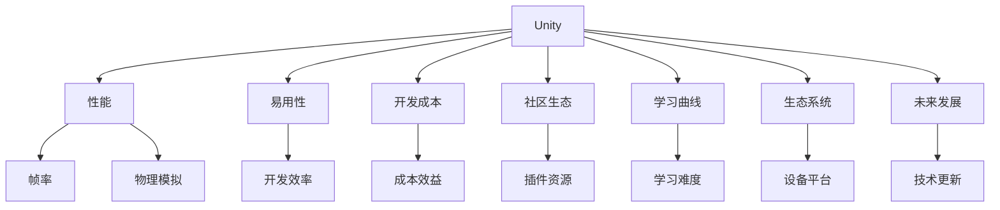

                 

# 游戏框架选择：Unity vs Unreal Engine

## 1. 背景介绍

### 1.1 问题由来
游戏开发领域中，游戏引擎的选择直接影响着项目的开发效率、质量与成本。Unity和Unreal Engine是当前两大流行的游戏引擎，各有其独特的优势和应用领域。然而，如何选择最适合自身项目的引擎，成为许多游戏开发者面临的难题。本文将详细对比Unity与Unreal Engine的核心特性，帮助开发者做出更明智的决策。

### 1.2 问题核心关键点
本文的核心目标是对比Unity和Unreal Engine，并从性能、易用性、开发成本、社区生态、学习曲线、生态系统、未来发展等方面对这两大引擎进行全面分析。这些关键点将帮助开发者评估每种引擎的适用性和局限性，进而做出最优选择。

## 2. 核心概念与联系

### 2.1 核心概念概述
- **Unity**：一款跨平台的游戏引擎，由Unity Technologies开发，支持2D和3D游戏开发，拥有强大的社区支持和丰富的插件生态。
- **Unreal Engine**：由Epic Games开发的一款高端3D游戏引擎，具有先进的渲染技术、物理模拟功能和强大的可视化编辑工具。
- **性能**：指引擎处理图形和物理计算的能力，直接影响游戏的帧率和流畅度。
- **易用性**：指引擎的操作简便程度，影响开发者的生产效率。
- **开发成本**：包括初始开发成本和长期维护成本，如开发工具、技术支持和人员培训等。
- **社区生态**：指引擎社区的活跃度、插件和资源的质量与多样性。
- **学习曲线**：指开发者从入门到精通所需的时间和学习难度。
- **生态系统**：指引擎支持的设备和平台的范围和成熟度。
- **未来发展**：指引擎的技术进步和市场趋势，影响长期应用前景。

这些核心概念通过以下Mermaid流程图展现它们之间的关系：



此图展示了Unity和Unreal Engine的多个特性及其对项目选择的影响。性能、易用性、开发成本、社区生态、学习曲线、生态系统和未来发展等因素共同决定了每种引擎的适用性和优势。

## 3. 核心算法原理 & 具体操作步骤

### 3.1 算法原理概述

**Unity**
- 基于模块化的组件化系统，通过添加或编辑组件来扩展游戏功能。
- 脚本语言支持C#，易于学习和编写。
- 跨平台支持，包括PC、移动设备、虚拟现实等。
- 强大的图形渲染和物理引擎。

**Unreal Engine**
- 基于C++的面向对象编程模型，提供深入的引擎控制能力。
- 采用可视化编辑器蓝图，使得无代码开发成为可能。
- 支持高性能的图形渲染和物理引擎。
- 广泛的跨平台支持，包括PC、控制台、移动设备、虚拟现实和增强现实。

两种引擎的核心算法原理都围绕着渲染、物理模拟和游戏逻辑展开，但实现方式和设计理念存在显著差异。

### 3.2 算法步骤详解

**Unity开发步骤**
1. 初始化项目，配置基本设置。
2. 添加所需的组件，如角色、场景、光源等。
3. 编写C#脚本实现游戏逻辑和交互。
4. 使用编辑器进行可视化设置，如动画、物理效果等。
5. 测试和迭代，优化性能和功能。
6. 导出并发布游戏。

**Unreal Engine开发步骤**
1. 初始化项目，配置蓝图和C++脚本。
2. 使用可视化编辑器创建和编辑游戏场景。
3. 编写蓝图或C++脚本实现游戏逻辑和交互。
4. 利用可视化编辑器进行动画和物理效果的调整。
5. 进行全面测试，优化性能和功能。
6. 导出并发布游戏。

尽管步骤相似，但两种引擎在开发流程和工具使用上存在显著差异。

### 3.3 算法优缺点

**Unity**
- 优点：易学易用、跨平台支持、丰富的插件生态、社区支持强大。
- 缺点：性能和物理模拟可能不如Unreal Engine，内存管理需要开发者自行优化。

**Unreal Engine**
- 优点：高性能渲染、强大的物理引擎、高度自定义的开发能力。
- 缺点：学习曲线陡峭、开发成本较高、可视化编辑器可能不够直观。

### 3.4 算法应用领域

**Unity**
- 适合中小型项目、跨平台应用、独立游戏、教育游戏、轻量级AR/VR体验。

**Unreal Engine**
- 适合大型3D项目、高端游戏开发、高性能图形渲染、大型虚拟现实应用、电影和电影级视觉效果。

## 4. 数学模型和公式 & 详细讲解 & 举例说明

### 4.1 数学模型构建

**Unity**
- 渲染：基于光线追踪技术，可实现高效的图像处理和光照计算。
- 物理引擎：基于Unity Physics，通过粒子和刚体模拟物理效果。

**Unreal Engine**
- 渲染：采用实时渲染引擎，支持实时全局光照和阴影映射。
- 物理引擎：内置PhysX，支持详细的物理模拟和碰撞检测。

### 4.2 公式推导过程

**Unity渲染公式**：
$$
\text{Render Result} = \sum_{i=1}^{N} \text{Light Intensity}_i \times \text{Light Color}_i \times \text{Attenuation}_i \times \text{Material Reflectivity}_i \times \text{Surface Normal}_i \times \text{View Vector}_i
$$

**Unreal Engine渲染公式**：
$$
\text{Render Result} = \sum_{i=1}^{N} \text{Light Intensity}_i \times \text{Light Color}_i \times \text{Attenuation}_i \times \text{Material Reflectivity}_i \times \text{Surface Normal}_i \times \text{View Vector}_i
$$

两种引擎的渲染公式本质相同，但在具体实现和细节处理上有所不同。

### 4.3 案例分析与讲解

假设我们要开发一款移动平台上的2D平台游戏。

**Unity开发案例**
- 使用Unity的2D组件，创建角色和环境。
- 编写C#脚本控制游戏逻辑，如角色移动、碰撞检测等。
- 使用可视化编辑器进行动画和特效调整。
- 导出并发布游戏，适配不同的移动平台。

**Unreal Engine开发案例**
- 创建和编辑蓝图，定义游戏场景和角色。
- 编写C++脚本或蓝图实现游戏逻辑。
- 使用可视化编辑器进行动画和物理效果的调整。
- 导出并发布游戏，适配不同的移动平台。

## 5. 项目实践：代码实例和详细解释说明

### 5.1 开发环境搭建

**Unity开发环境**
1. 安装Unity Hub，选择适合的Unity版本。
2. 下载并安装Visual Studio和Unity自带的Xcode。
3. 安装Unity Package Manager，下载所需插件。
4. 配置版本控制工具如Git，管理项目代码。

**Unreal Engine开发环境**
1. 安装Epic Games Launcher，下载并安装Unreal Engine。
2. 配置Visual Studio和CLion作为IDE。
3. 下载并安装Unreal Engine Marketplace的插件。
4. 配置版本控制工具如Git，管理项目代码。

### 5.2 源代码详细实现

**Unity代码示例**
```csharp
using UnityEngine;
using System.Collections;

public class PlayerController : MonoBehaviour
{
    public float speed = 5.0f;

    void Update()
    {
        float moveX = Input.GetAxis("Horizontal");
        float moveY = Input.GetAxis("Vertical");

        transform.Translate(moveX, 0, moveY) * speed * Time.deltaTime;
    }
}
```

**Unreal Engine代码示例**
```c++
// PlayerControllerBP.h
class UPlayerControllerBP : APlayerController
{
public:

    void BeginPlay() override
    {
        Super.BEGINPLAY();
    }

    void Tick(float DeltaTime) override
    {
        Super.TICK(DeltaTime);

        float MoveX = GetAxisValue("Horizontal");
        float MoveY = GetAxisValue("Vertical");

        AddMovementInput(MoveX, MoveY, 1.0f, false, true);
    }
}
```

### 5.3 代码解读与分析

- **Unity代码分析**：该代码实现了一个简单的玩家控制器，通过Update函数检测水平和垂直轴的输入，移动玩家角色。
- **Unreal Engine代码分析**：该代码使用蓝图和C++实现，利用BeginPlay函数初始化，并在Tick函数中根据轴值调整玩家的移动输入。

## 6. 实际应用场景

### 6.1 移动平台游戏
Unity适合开发如《Among Us》这样的移动平台游戏，支持多种平台同时开发和发布。

### 6.2 大型3D游戏
Unreal Engine适合开发如《堡垒之夜》这样的大型3D游戏，其高性能渲染和物理模拟能力使其成为首选。

### 6.3 跨平台应用
Unity支持跨平台开发，适用于开发面向不同设备的2D游戏，如《Super Mario Run》。

### 6.4 未来应用展望
两种引擎都将继续在各自领域内发展， Unity将继续强化其跨平台能力和易用性，Unreal Engine将不断提升其在大型3D和VR/AR应用中的性能和技术领先地位。

## 7. 工具和资源推荐

### 7.1 学习资源推荐

**Unity学习资源**
- Unity官方文档：全面介绍Unity的基础功能和高级特性。
- Unity Asset Store：提供丰富的插件和资源，加速开发。
- Unity Learn：提供免费的在线教程和课程，适合初学者。

**Unreal Engine学习资源**
- Unreal Engine官方文档：深入介绍引擎的架构和功能。
- Unreal Engine Marketplace：提供丰富的插件和资源，支持开发。
- Unreal Engine Learning Center：提供免费的在线课程和教程，适合初学者。

### 7.2 开发工具推荐

**Unity开发工具**
- Unity Hub：管理多个Unity项目，提供一站式开发环境。
- Unity Package Manager：下载和安装Unity插件。
- Xcode：开发iOS和macOS平台的移动应用。

**Unreal Engine开发工具**
- Epic Games Launcher：管理多个Unreal Engine项目。
- Visual Studio：开发C++代码。
- CLion：开发C++代码。

### 7.3 相关论文推荐

**Unity论文**
- "Real-Time Rendering in Unity"（Unity官方白皮书）
- "Unity's VR/AR Development Workflow"（Unity在VR/AR开发中的工作流程）

**Unreal Engine论文**
- "Real-Time Rendering in Unreal Engine"（Unreal Engine官方白皮书）
- "Unreal Engine's VR/AR Development Workflow"（Unreal Engine在VR/AR开发中的工作流程）

## 8. 总结：未来发展趋势与挑战

### 8.1 研究成果总结

通过对比分析，我们得出以下结论：
- Unity适合易用性高、跨平台需求强的小型到中型项目。
- Unreal Engine适合高性能要求高、自定义需求强的大型3D项目。

### 8.2 未来发展趋势

**Unity**
- 持续改进跨平台性能，强化移动平台支持。
- 加强可视化编辑器功能，简化开发流程。
- 增强人工智能和机器学习支持，提升游戏智能化水平。

**Unreal Engine**
- 提升渲染和物理引擎性能，适应更高端市场。
- 开发更易于上手的编辑器工具，降低学习曲线。
- 增强跨平台支持，支持更多设备和平台。

### 8.3 面临的挑战

**Unity**
- 内存管理和性能优化仍是挑战，需要开发者自行优化。
- 插件生态虽丰富，但质量参差不齐，需甄别和筛选。

**Unreal Engine**
- 学习曲线陡峭，新手入门难度大。
- 高昂的开发成本和部署成本，可能超出小型项目需求。

### 8.4 研究展望

未来，Unity和Unreal Engine都将继续在各自优势领域内发展，各自解决特定问题。Unity将不断优化跨平台性能和可视化编辑器功能，Unreal Engine将持续提升高性能渲染和物理模拟能力，满足日益增长的技术需求。开发者应根据具体项目需求，选择最合适的引擎，并充分利用各自优势，实现最佳的游戏开发效果。

## 9. 附录：常见问题与解答

**Q1：Unity和Unreal Engine在可视化编辑器上的差异有哪些？**

A: Unity的可视化编辑器更加直观和易用，适合没有编程基础的开发者。而Unreal Engine的蓝图编辑器虽然功能强大，但其学习和使用曲线较陡，更适合有一定编程基础的用户。

**Q2：Unity和Unreal Engine的性能表现如何？**

A: Unity在跨平台性能上表现较好，但在大型3D渲染和高性能物理模拟上，Unreal Engine更为出色。开发者应根据具体需求选择引擎。

**Q3：Unity和Unreal Engine的支持生态系统有何差异？**

A: Unity拥有丰富的插件和资源库，支持多种平台和开发工具。Unreal Engine拥有强大的官方社区支持，提供高质量的开发资源。

**Q4：Unity和Unreal Engine的学习曲线有何差异？**

A: Unity的学习曲线较为平缓，适合新手开发者。Unreal Engine的学习曲线较陡，需要一定的编程基础和经验。

**Q5：如何选择Unity和Unreal Engine中的引擎类型？**

A: 如果项目需求是小型跨平台游戏或2D游戏，选择Unity。如果项目需求是高性能3D游戏或VR/AR应用，选择Unreal Engine。

---

作者：禅与计算机程序设计艺术 / Zen and the Art of Computer Programming

