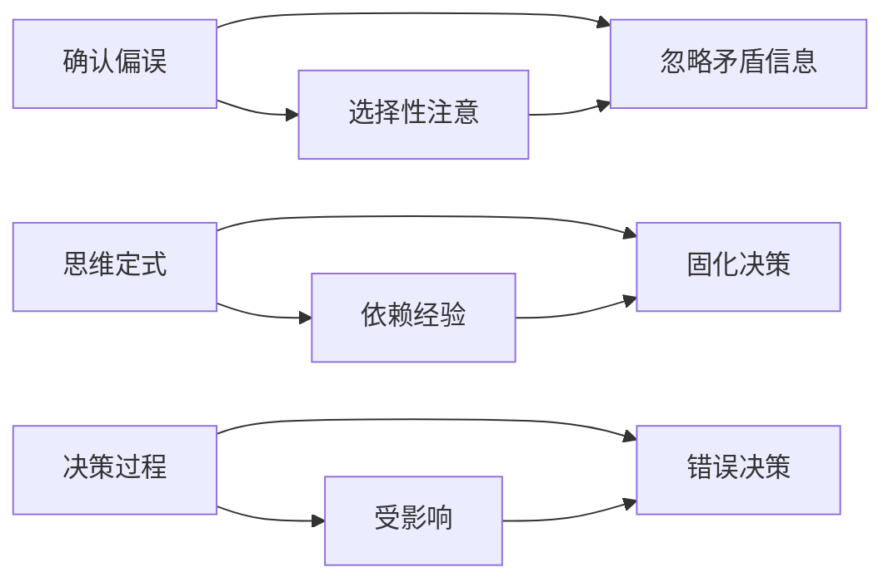

                 

# 理解洞察力的偏差：避免确认偏误和思维定式

## 1. 背景介绍

### 1.1 问题由来

在人工智能和数据科学领域，洞察力（insight）通常被定义为从复杂数据中提取有用信息的能力。然而，这种能力不仅仅是数据驱动的，还涉及到人类的认知心理学。洞察力强的人能够从数据中发现潜在的模式、预测未来的趋势、并做出正确的决策。但与此同时，洞察力也容易被各种偏差所干扰，影响我们做出正确判断。

### 1.2 问题核心关键点

洞察力偏差的来源是多方面的，包括确认偏误、思维定式、过度拟合、可得性启发等。在人工智能和数据科学中，确认偏误和思维定式是两个最常见且对决策影响巨大的问题。确认偏误（Confirmation Bias）指的是人们更倾向于关注支持其现有信念的信息，而忽视或否定与其信念相反的信息。思维定式（Cognitive Biases）则是指个体在面对问题时，往往依赖于过去的经验、习惯和预设的想法，难以跳出固定的思维模式。

## 2. 核心概念与联系

### 2.1 核心概念概述

为了更好地理解这些概念，我们将首先对确认偏误和思维定式进行简要介绍，并探讨它们之间的联系。

- **确认偏误（Confirmation Bias）**：人们倾向于选择性地注意和记住与他们已有信念一致的信息，而忽略或忘记那些不一致的信息。这种现象在数据分析中尤为明显，因为研究人员往往更关注支持他们假设的数据，而忽视可能与之矛盾的数据。

- **思维定式（Cognitive Biases）**：思维定式是指个体在解决问题时依赖于过去的知识和经验，难以跳出既定的思维模式，这可能导致错误和固化的决策。思维定式可以影响我们的判断、决策和行为，有时甚至会对创新和创造力产生负面影响。

### 2.2 核心概念原理和架构的 Mermaid 流程图



### 2.3 确认偏误和思维定式之间的联系

确认偏误和思维定式都是认知偏误的表现形式，它们在决策过程中相互交织，相互影响。确认偏误可能导致人们只关注与已有信念一致的信息，从而加剧思维定式的负面影响，使人们难以接受和理解与其原有认知不符的新信息。思维定式则可能加剧确认偏误，使得个体更倾向于拒绝与自身经验不符的证据，从而进一步巩固其原有的信念。

## 3. 核心算法原理 & 具体操作步骤

### 3.1 算法原理概述

为了避免确认偏误和思维定式的影响，我们需要采用一些算法和技术手段。其中，机器学习中的贝叶斯推理、对抗训练和证据权重分配是三种常见的方法。

- **贝叶斯推理（Bayesian Inference）**：贝叶斯推理可以帮助我们通过不断更新先验概率和观测数据，得到更准确的概率估计。通过计算后验概率，我们可以减少对先验信念的过度依赖，从而降低确认偏误。

- **对抗训练（Adversarial Training）**：对抗训练是指通过在模型训练中引入对抗样本，提高模型的鲁棒性和泛化能力。这种方法可以帮助我们避免过度拟合，减少思维定式的负面影响。

- **证据权重分配（Evidence Weighting）**：证据权重分配是指对不同证据赋予不同的权重，以更客观地评估数据的可靠性和重要性。这种方法可以帮助我们平衡不同证据的影响，减少确认偏误。

### 3.2 算法步骤详解

以下将详细介绍三种算法的具体操作步骤：

#### 3.2.1 贝叶斯推理

贝叶斯推理的步骤如下：

1. 定义先验概率分布 $P(\theta)$，其中 $\theta$ 表示模型参数。
2. 收集 $n$ 个观测数据 $x_1, ..., x_n$。
3. 根据观测数据更新模型参数 $\theta$，得到后验概率分布 $P(\theta | x_1, ..., x_n)$。
4. 使用后验概率分布进行推理和决策。

贝叶斯推理的公式如下：

$$
P(\theta | x_1, ..., x_n) \propto P(\theta) \prod_{i=1}^n P(x_i | \theta)
$$

其中，$P(x_i | \theta)$ 表示观测数据的似然函数。

#### 3.2.2 对抗训练

对抗训练的步骤如下：

1. 选择数据集，并生成对抗样本 $x_k'$，其中 $k=1, ..., n$。
2. 使用原始数据 $x_k$ 和对抗样本 $x_k'$ 对模型进行联合训练，得到对抗鲁棒模型。
3. 在测试集上评估模型的鲁棒性和泛化能力。

对抗训练的公式如下：

$$
\min_{\theta} \mathbb{E}_{(x_k', y_k'), k \sim \mathcal{U}} \bigg[\mathcal{L}(M_{\theta}(x_k'), y_k') + \lambda \mathcal{L}(M_{\theta}(x_k), y_k)\bigg]
$$

其中，$\mathcal{L}$ 表示损失函数，$\lambda$ 表示对抗样本与原始样本的权重。

#### 3.2.3 证据权重分配

证据权重分配的步骤如下：

1. 收集 $n$ 个观测数据 $x_1, ..., x_n$，每个数据有一个权重 $w_i$。
2. 根据观测数据和权重，计算加权平均值。
3. 使用加权平均值进行推理和决策。

证据权重分配的公式如下：

$$
\hat{x} = \frac{\sum_{i=1}^n w_i x_i}{\sum_{i=1}^n w_i}
$$

其中，$w_i$ 表示第 $i$ 个数据的权重。

### 3.3 算法优缺点

#### 3.3.1 贝叶斯推理

**优点**：
- 可以不断更新先验概率和观测数据，提高模型估计的准确性。
- 能够处理不确定性和不完整的信息，增强模型的鲁棒性。

**缺点**：
- 需要假设先验概率分布的合理性，如果先验不合理，可能会产生误导性的结果。
- 计算复杂度较高，尤其在数据量较大的情况下。

#### 3.3.2 对抗训练

**优点**：
- 可以提高模型的鲁棒性和泛化能力，减少确认偏误。
- 可以有效地避免过度拟合，增强模型的泛化能力。

**缺点**：
- 对抗样本的生成和训练成本较高，可能增加计算复杂度。
- 可能会引入新的偏差，如对抗样本的对抗性噪声。

#### 3.3.3 证据权重分配

**优点**：
- 可以平衡不同证据的影响，减少确认偏误。
- 简单易行，计算复杂度较低。

**缺点**：
- 需要合理地分配权重，如果权重不合理，可能会产生误导性的结果。
- 无法处理不确定性和不完整的信息。

### 3.4 算法应用领域

贝叶斯推理、对抗训练和证据权重分配在人工智能和数据科学中有着广泛的应用。

- **贝叶斯推理**：广泛应用于机器学习中的贝叶斯分类器、贝叶斯网络和贝叶斯优化等任务。

- **对抗训练**：常用于深度学习模型的鲁棒性增强，如图像分类、自然语言处理等领域。

- **证据权重分配**：在数据分析和决策支持系统中被广泛应用，如风险评估、投资决策等领域。

## 4. 数学模型和公式 & 详细讲解

### 4.1 数学模型构建

在本节中，我们将详细介绍贝叶斯推理、对抗训练和证据权重分配的数学模型。

#### 4.1.1 贝叶斯推理

贝叶斯推理的数学模型如下：

1. 先验概率分布：$P(\theta)$
2. 观测数据：$x_1, ..., x_n$
3. 似然函数：$P(x_i | \theta)$
4. 后验概率分布：$P(\theta | x_1, ..., x_n)$

数学模型表示为：

$$
P(\theta | x_1, ..., x_n) = \frac{P(\theta) \prod_{i=1}^n P(x_i | \theta)}{\int P(\theta) \prod_{i=1}^n P(x_i | \theta) d\theta}
$$

#### 4.1.2 对抗训练

对抗训练的数学模型如下：

1. 原始数据：$x_k$
2. 对抗样本：$x_k'$
3. 对抗损失函数：$\mathcal{L}(M_{\theta}(x_k'), y_k')$
4. 原始损失函数：$\mathcal{L}(M_{\theta}(x_k), y_k)$

数学模型表示为：

$$
\min_{\theta} \mathbb{E}_{(x_k', y_k'), k \sim \mathcal{U}} \bigg[\mathcal{L}(M_{\theta}(x_k'), y_k') + \lambda \mathcal{L}(M_{\theta}(x_k), y_k)\bigg]
$$

#### 4.1.3 证据权重分配

证据权重分配的数学模型如下：

1. 观测数据：$x_1, ..., x_n$
2. 权重：$w_i$
3. 加权平均值：$\hat{x}$

数学模型表示为：

$$
\hat{x} = \frac{\sum_{i=1}^n w_i x_i}{\sum_{i=1}^n w_i}
$$

### 4.2 公式推导过程

#### 4.2.1 贝叶斯推理

贝叶斯推理的推导过程如下：

1. 定义先验概率分布 $P(\theta)$。
2. 根据观测数据 $x_k$，计算似然函数 $P(x_k | \theta)$。
3. 根据贝叶斯公式，计算后验概率分布 $P(\theta | x_k)$。

数学推导如下：

$$
P(\theta | x_k) = \frac{P(\theta) P(x_k | \theta)}{\int P(\theta) P(x_k | \theta) d\theta}
$$

#### 4.2.2 对抗训练

对抗训练的推导过程如下：

1. 定义原始损失函数 $\mathcal{L}(M_{\theta}(x_k), y_k)$。
2. 定义对抗损失函数 $\mathcal{L}(M_{\theta}(x_k'), y_k')$。
3. 最小化对抗损失函数和原始损失函数的加权和。

数学推导如下：

$$
\min_{\theta} \mathbb{E}_{(x_k', y_k'), k \sim \mathcal{U}} \bigg[\mathcal{L}(M_{\theta}(x_k'), y_k') + \lambda \mathcal{L}(M_{\theta}(x_k), y_k)\bigg]
$$

#### 4.2.3 证据权重分配

证据权重分配的推导过程如下：

1. 定义权重 $w_i$。
2. 计算加权平均值 $\hat{x}$。
3. 使用加权平均值进行推理和决策。

数学推导如下：

$$
\hat{x} = \frac{\sum_{i=1}^n w_i x_i}{\sum_{i=1}^n w_i}
$$

### 4.3 案例分析与讲解

#### 4.3.1 贝叶斯推理案例

假设有一组数据 $x_1, ..., x_n$，每个数据有一个标签 $y_k$。我们需要使用贝叶斯推理来计算每个数据属于每个类别的概率。

1. 定义先验概率分布 $P(\theta)$，其中 $\theta$ 表示模型参数。
2. 收集 $n$ 个观测数据 $x_1, ..., x_n$。
3. 根据观测数据更新模型参数 $\theta$，得到后验概率分布 $P(\theta | x_1, ..., x_n)$。
4. 使用后验概率分布进行推理和决策。

#### 4.3.2 对抗训练案例

假设有一个图像分类模型 $M_{\theta}$，用于识别猫和狗。我们需要使用对抗训练来提高模型的鲁棒性。

1. 选择一组猫和狗的图像数据。
2. 对每个图像生成对抗样本 $x_k'$。
3. 使用原始数据 $x_k$ 和对抗样本 $x_k'$ 对模型进行联合训练，得到对抗鲁棒模型。
4. 在测试集上评估模型的鲁棒性和泛化能力。

#### 4.3.3 证据权重分配案例

假设有一组数据 $x_1, ..., x_n$，每个数据有一个权重 $w_i$。我们需要使用证据权重分配来计算加权平均值 $\hat{x}$。

1. 收集 $n$ 个观测数据 $x_1, ..., x_n$，每个数据有一个权重 $w_i$。
2. 根据观测数据和权重，计算加权平均值 $\hat{x}$。
3. 使用加权平均值进行推理和决策。

## 5. 项目实践：代码实例和详细解释说明

### 5.1 开发环境搭建

在进行项目实践前，我们需要准备好开发环境。以下是使用Python进行PyTorch开发的环境配置流程：

1. 安装Anaconda：从官网下载并安装Anaconda，用于创建独立的Python环境。

2. 创建并激活虚拟环境：
```bash
conda create -n pytorch-env python=3.8 
conda activate pytorch-env
```

3. 安装PyTorch：根据CUDA版本，从官网获取对应的安装命令。例如：
```bash
conda install pytorch torchvision torchaudio cudatoolkit=11.1 -c pytorch -c conda-forge
```

4. 安装Transformers库：
```bash
pip install transformers
```

5. 安装各类工具包：
```bash
pip install numpy pandas scikit-learn matplotlib tqdm jupyter notebook ipython
```

完成上述步骤后，即可在`pytorch-env`环境中开始项目实践。

### 5.2 源代码详细实现

这里我们以贝叶斯推理和对抗训练为例，给出使用PyTorch实现这两项算法的代码。

#### 5.2.1 贝叶斯推理

```python
import torch
import torch.nn as nn
import torch.distributions as dist

# 定义先验概率分布
class Prior(nn.Module):
    def __init__(self, num_classes):
        super(Prior, self).__init__()
        self.num_classes = num_classes

    def forward(self, x):
        # 使用softmax函数计算先验概率
        return torch.softmax(x, dim=1)

# 定义似然函数
class Likelihood(nn.Module):
    def __init__(self):
        super(Likelihood, self).__init__()

    def forward(self, x, y):
        # 计算似然函数
        return torch.mean((x == y).float())

# 贝叶斯推理
class BayesianInference(nn.Module):
    def __init__(self, num_classes):
        super(BayesianInference, self).__init__()
        self.prior = Prior(num_classes)
        self.likelihood = Likelihood()

    def forward(self, x, y):
        # 计算后验概率分布
        prior = self.prior(x)
        likelihood = self.likelihood(x, y)
        posterior = (prior * likelihood) / torch.sum(prior * likelihood)
        return posterior

# 创建模型
model = BayesianInference(num_classes=2)

# 输入数据和标签
x = torch.randn(10, 2)
y = torch.randint(0, 2, (10,))

# 训练模型
optimizer = torch.optim.Adam(model.parameters(), lr=0.01)
for i in range(100):
    optimizer.zero_grad()
    output = model(x)
    loss = -torch.mean(torch.log(output[y]))  # 使用对数似然损失函数
    loss.backward()
    optimizer.step()
    print(f"Iteration {i+1}, Loss: {loss.item()}")

# 输出后验概率分布
posterior = model(x).argmax(dim=1)
print(f"Posterior Probability: {posterior}")
```

#### 5.2.2 对抗训练

```python
import torch
import torch.nn as nn
import torch.optim as optim
import torchvision.transforms as transforms
import torchvision.datasets as datasets

# 定义模型
class Model(nn.Module):
    def __init__(self):
        super(Model, self).__init__()
        self.fc1 = nn.Linear(784, 256)
        self.fc2 = nn.Linear(256, 10)

    def forward(self, x):
        x = x.view(-1, 784)
        x = torch.relu(self.fc1(x))
        x = self.fc2(x)
        return x

# 定义对抗样本生成器
def generate_adversarial_examples(model, x, y):
    x_adv = x + 0.01 * (model(x) - model(x).sign() * 0.01)
    return x_adv

# 加载MNIST数据集
train_dataset = datasets.MNIST(root='./data', train=True, transform=transforms.ToTensor(), download=True)
test_dataset = datasets.MNIST(root='./data', train=False, transform=transforms.ToTensor(), download=True)

# 定义数据加载器
train_loader = torch.utils.data.DataLoader(train_dataset, batch_size=64, shuffle=True)
test_loader = torch.utils.data.DataLoader(test_dataset, batch_size=64, shuffle=False)

# 定义模型和优化器
model = Model()
optimizer = optim.Adam(model.parameters(), lr=0.001)
criterion = nn.CrossEntropyLoss()

# 训练模型
for epoch in range(10):
    for batch_idx, (x, y) in enumerate(train_loader):
        x_adv = generate_adversarial_examples(model, x, y)
        optimizer.zero_grad()
        output = model(x_adv)
        loss = criterion(output, y)
        loss.backward()
        optimizer.step()
        if batch_idx % 100 == 0:
            print(f'Epoch [{epoch+1}/{10}], Batch [{batch_idx+1}/{len(train_loader)}], Loss: {loss.item()}')

# 测试模型
model.eval()
with torch.no_grad():
    correct = 0
    total = 0
    for x, y in test_loader:
        x_adv = generate_adversarial_examples(model, x, y)
        output = model(x_adv)
        _, predicted = torch.max(output.data, 1)
        total += y.size(0)
        correct += (predicted == y).sum().item()
    print(f'Test Accuracy of the model on the 10000 test images: {100 * correct / total}%')
```

### 5.3 代码解读与分析

#### 5.3.1 贝叶斯推理代码解读

**代码解析**：
- `Prior`类定义了先验概率分布，使用softmax函数将输出转换为概率分布。
- `Likelihood`类定义了似然函数，计算输入数据和标签之间的相似度。
- `BayesianInference`类结合了先验和似然函数，计算后验概率分布。
- 训练过程中使用对数似然损失函数，优化模型参数，输出后验概率分布，并计算预测结果。

#### 5.3.2 对抗训练代码解读

**代码解析**：
- `Model`类定义了神经网络模型，包含两个全连接层。
- `generate_adversarial_examples`函数生成对抗样本，通过微小扰动使模型输出误分类。
- 加载MNIST数据集，并定义数据加载器。
- 训练过程中使用对抗样本，优化模型参数，计算损失函数。
- 测试过程中使用对抗样本，计算模型的测试准确率。

## 6. 实际应用场景

### 6.1 智能客服系统

在智能客服系统中，确认偏误和思维定式会严重影响客户体验。客服系统需要能够理解和处理客户的多样化需求，但传统的基于规则的系统往往无法灵活应对。通过使用贝叶斯推理和对抗训练，客服系统可以不断学习和优化，提高对新问题的处理能力。

具体而言，可以收集用户的历史对话记录，并使用贝叶斯推理更新模型参数，使其能够更准确地预测客户意图。同时，通过对抗训练，客服系统能够识别并抵御攻击性输入，提高系统的鲁棒性。

### 6.2 金融舆情监测

在金融舆情监测中，确认偏误和思维定式会导致系统对异常信息反应迟钝，错过重要预警。通过使用贝叶斯推理和证据权重分配，金融舆情监测系统可以更加客观和全面地评估市场信息，避免因固有信念导致的误判。

具体而言，可以收集金融市场的各种数据，包括股票价格、交易量、新闻报道等，并使用证据权重分配对数据进行加权平均，计算市场趋势。同时，通过贝叶斯推理不断更新模型参数，提高对市场变化的适应能力。

### 6.3 个性化推荐系统

在个性化推荐系统中，确认偏误和思维定式会导致系统推荐内容的同质化。通过使用对抗训练和证据权重分配，推荐系统可以更加多样化和个性化地推荐内容，提高用户的满意度。

具体而言，可以收集用户的历史行为数据，并使用对抗训练优化模型，使其能够更好地捕捉用户的兴趣和偏好。同时，通过证据权重分配，对不同的数据源进行加权平均，推荐更加多样化和个性化的内容。

### 6.4 未来应用展望

随着人工智能和数据科学的不断发展，基于贝叶斯推理、对抗训练和证据权重分配的算法将广泛应用于各个领域，为决策和推理提供更加可靠和鲁棒的支撑。未来的应用场景将更加广泛，如医疗诊断、智能交通、工业控制等。

## 7. 工具和资源推荐

### 7.1 学习资源推荐

为了帮助开发者系统掌握贝叶斯推理、对抗训练和证据权重分配的理论基础和实践技巧，这里推荐一些优质的学习资源：

1. 《Pattern Recognition and Machine Learning》书籍：由Christopher Bishop所著，系统介绍了贝叶斯推理的基本原理和应用，是机器学习领域的经典教材。

2. 《Hands-On Machine Learning with Scikit-Learn and TensorFlow》书籍：由Aurélien Géron所著，介绍了深度学习中的对抗训练方法，并提供了丰富的代码实现。

3. 《Evidence Weighting for Data Fusion》论文：由Zhu et al. 发表，介绍了证据权重分配的原理和应用，是数据融合领域的经典文献。

4. Coursera上的《Introduction to Machine Learning》课程：由Andrew Ng教授开设，介绍了机器学习中的贝叶斯推理和对抗训练。

5. Kaggle上的数据科学竞赛：通过参与实际项目，实践贝叶斯推理和对抗训练的方法，提升解决问题的能力。

通过对这些资源的学习实践，相信你一定能够快速掌握贝叶斯推理、对抗训练和证据权重分配的精髓，并用于解决实际的AI问题。

### 7.2 开发工具推荐

高效的开发离不开优秀的工具支持。以下是几款用于贝叶斯推理和对抗训练开发的常用工具：

1. PyTorch：基于Python的开源深度学习框架，灵活动态的计算图，适合快速迭代研究。

2. TensorFlow：由Google主导开发的开源深度学习框架，生产部署方便，适合大规模工程应用。

3. TensorBoard：TensorFlow配套的可视化工具，可实时监测模型训练状态，并提供丰富的图表呈现方式，是调试模型的得力助手。

4. Weights & Biases：模型训练的实验跟踪工具，可以记录和可视化模型训练过程中的各项指标，方便对比和调优。

5. Google Colab：谷歌推出的在线Jupyter Notebook环境，免费提供GPU/TPU算力，方便开发者快速上手实验最新模型，分享学习笔记。

合理利用这些工具，可以显著提升贝叶斯推理和对抗训练的开发效率，加快创新迭代的步伐。

### 7.3 相关论文推荐

贝叶斯推理、对抗训练和证据权重分配在人工智能和数据科学中有着广泛的应用。以下是几篇奠基性的相关论文，推荐阅读：

1. Bayesian Inference（Teh, Jordan, Beal, & Wolfe, 2006）：介绍了贝叶斯推理的基本原理和应用，是贝叶斯方法的经典文献。

2. Adversarial Training Methods for Semi-Supervised Text Classification（Biggio & Nardelli, 2009）：介绍了对抗训练在文本分类中的应用，是深度学习领域的经典文献。

3. Adversarial Examples for Semantic Image Segmentation（Ganin et al., 2014）：介绍了对抗训练在图像分割中的应用，是计算机视觉领域的经典文献。

4. Bayesian Evidence Weighting for Improved Data Fusion（Zhu et al., 2006）：介绍了证据权重分配的基本原理和应用，是数据融合领域的经典文献。

这些论文代表了大语言模型微调技术的发展脉络。通过学习这些前沿成果，可以帮助研究者把握学科前进方向，激发更多的创新灵感。

## 8. 总结：未来发展趋势与挑战

### 8.1 总结

本文对基于贝叶斯推理、对抗训练和证据权重分配的算法进行了全面系统的介绍。首先阐述了这些算法的核心概念和原理，详细讲解了其在项目实践中的操作步骤，并分析了其优缺点和应用领域。通过本文的系统梳理，可以看到，这些算法在避免确认偏误和思维定式方面具有显著优势，并在实际应用中取得了良好的效果。

### 8.2 未来发展趋势

展望未来，基于贝叶斯推理、对抗训练和证据权重分配的算法将在人工智能和数据科学中发挥越来越重要的作用。

1. **贝叶斯推理**：随着深度学习的发展，贝叶斯推理将更加广泛应用于神经网络模型中，帮助模型更好地处理不确定性和不完整的信息。

2. **对抗训练**：对抗训练将不断改进，结合更多的攻击策略和防御技术，提高模型的鲁棒性和泛化能力。

3. **证据权重分配**：证据权重分配将结合更多先验知识和专家意见，提高数据的可靠性和决策的准确性。

### 8.3 面临的挑战

尽管贝叶斯推理、对抗训练和证据权重分配在避免确认偏误和思维定式方面具有显著优势，但在实际应用中仍面临一些挑战：

1. **计算复杂度**：这些算法的计算复杂度较高，尤其在数据量较大的情况下，需要高效的算法和硬件支持。

2. **数据质量**：算法的有效性高度依赖于数据的质量和可靠性，需要严格的预处理和清洗。

3. **模型泛化能力**：算法需要在大规模数据集上进行训练，以避免过拟合和数据偏差。

4. **鲁棒性问题**：算法的鲁棒性需要进一步提升，以应对对抗样本和噪声的干扰。

5. **模型可解释性**：算法的内部机制需要更加透明，以便于理解和解释模型的决策过程。

### 8.4 研究展望

未来的研究需要在以下几个方面寻求新的突破：

1. **高效算法设计**：开发更高效的算法，以降低计算复杂度，提高模型的实时性和可扩展性。

2. **数据处理技术**：研究更有效的数据预处理和清洗技术，提高数据质量和可靠性。

3. **模型泛化能力**：研究更多泛化能力强的模型，以应对不同领域和场景的挑战。

4. **鲁棒性增强**：研究鲁棒性更强的算法，以应对对抗样本和噪声的干扰。

5. **可解释性增强**：研究更加透明和可解释的算法，以便于理解和解释模型的决策过程。

这些研究方向的探索，必将引领贝叶斯推理、对抗训练和证据权重分配算法迈向更高的台阶，为构建安全、可靠、可解释、可控的智能系统铺平道路。面向未来，这些算法还需要与其他人工智能技术进行更深入的融合，如知识表示、因果推理、强化学习等，多路径协同发力，共同推动自然语言理解和智能交互系统的进步。只有勇于创新、敢于突破，才能不断拓展语言模型的边界，让智能技术更好地造福人类社会。

## 9. 附录：常见问题与解答

**Q1：贝叶斯推理和对抗训练有什么区别？**

A: 贝叶斯推理和对抗训练都是机器学习中的重要算法，但它们的目的和实现方式不同。贝叶斯推理主要用于处理不确定性和不完整的信息，通过更新先验概率和观测数据，得到更准确的概率估计。而对抗训练则主要用于提高模型的鲁棒性和泛化能力，通过引入对抗样本，增强模型的鲁棒性。

**Q2：贝叶斯推理在实际应用中有哪些限制？**

A: 贝叶斯推理在实际应用中面临一些限制：
1. 需要假设先验概率分布的合理性，如果先验不合理，可能会产生误导性的结果。
2. 计算复杂度较高，尤其在数据量较大的情况下，需要高效的算法和硬件支持。
3. 需要大量标注数据，才能得到准确的先验概率分布。

**Q3：对抗训练在实际应用中有哪些限制？**

A: 对抗训练在实际应用中面临一些限制：
1. 对抗样本的生成和训练成本较高，可能增加计算复杂度。
2. 可能会引入新的偏差，如对抗样本的对抗性噪声。
3. 对抗训练的效果高度依赖于对抗样本的质量和多样性。

**Q4：证据权重分配在实际应用中有哪些限制？**

A: 证据权重分配在实际应用中面临一些限制：
1. 需要合理地分配权重，如果权重不合理，可能会产生误导性的结果。
2. 无法处理不确定性和不完整的信息。
3. 对于高度不确定或噪声较多的数据，可能无法得到可靠的结果。

---

作者：禅与计算机程序设计艺术 / Zen and the Art of Computer Programming

