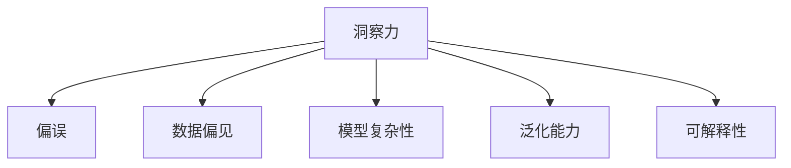

                 

## 1. 背景介绍

### 1.1 问题由来
在数据驱动的决策过程中，洞察力（Insight）扮演着至关重要的角色。它不仅能够帮助我们在海量数据中发现规律，还能够在复杂问题中抽丝剥茧，找到关键的因素。然而，洞察力并非总是准确无误，它常常受到“偏误”（Bias）的影响。

在人工智能（AI）领域，这种现象尤为突出。随着技术的进步，越来越多的复杂问题可以通过数据和算法解决。然而，如何从数据中提取出有意义的洞察力，避免陷入“过度简化”（Over-Simplification）的陷阱，成为研究人员和工程师共同面临的挑战。

### 1.2 问题核心关键点
在AI的决策过程中，过度简化可能表现在多个方面：

- **数据预处理不当**：选取有偏差的数据集，或采用不恰当的数据预处理方法，导致模型学习到的规律并不符合真实情况。
- **模型选择不当**：在面对复杂问题时，选择过于简单化的模型，无法捕捉数据中的细微差异和复杂关系。
- **假设不成立**：在构建模型时，假设了一些不合理的前提条件，导致模型无法泛化到真实世界中。
- **过度拟合**：在训练过程中，模型过度拟合训练数据，无法泛化到未见过的数据上。
- **解释不充分**：对于模型决策过程的解释不充分，难以理解模型的行为和决策依据。

### 1.3 问题研究意义
深入理解洞察力的偏误，并采取有效措施加以规避，对于构建可靠、高效的AI系统至关重要。通过系统地分析和解决这些问题，我们可以提升AI系统的可解释性、鲁棒性和泛化能力，进而推动AI技术的广泛应用。

## 2. 核心概念与联系

### 2.1 核心概念概述

为了更好地理解洞察力的偏误，本节将介绍几个关键概念：

- **洞察力（Insight）**：在大量数据中，通过分析和模型推理，识别出的关键模式、关系和规律。
- **偏误（Bias）**：由于数据、模型或算法设计不当，导致洞察力偏离真实情况的现象。
- **过度简化（Over-Simplification）**：在处理复杂问题时，忽略问题的复杂性，采用过于简单的方法或模型，无法充分捕捉问题的本质。
- **数据偏见（Data Bias）**：数据集本身存在的偏差，如性别、年龄、地域等特征的偏差。
- **模型复杂性（Model Complexity）**：模型结构或参数的数量，影响模型的泛化能力和解释性。
- **泛化能力（Generalization）**：模型在新数据上的表现能力，即模型的泛化能力。
- **可解释性（Explainability）**：模型决策过程的透明性和可理解性。

这些概念之间的关系可以用以下Mermaid流程图来展示：



这个流程图展示了洞察力如何受到多种因素的影响，包括数据偏见、模型复杂性、泛化能力和可解释性。只有综合考虑这些因素，才能构建出可靠、高效的AI系统。

## 3. 核心算法原理 & 具体操作步骤
### 3.1 算法原理概述

为了避免过度简化和洞察力的偏误，我们需要在数据预处理、模型选择、训练过程等方面进行全面考虑。以下将详细阐述这些方面的算法原理。

### 3.2 算法步骤详解

#### 3.2.1 数据预处理
数据预处理是构建可靠洞察力的基础。以下是几个关键步骤：

1. **数据收集**：确保数据来源广泛、多样，避免数据偏见。
2. **数据清洗**：剔除异常值、缺失值，确保数据质量。
3. **特征工程**：通过特征选择、降维、编码等技术，提高数据表示的效率和准确性。
4. **数据增强**：通过数据增强技术，如旋转、缩放、翻转等，扩充数据集，增强模型的鲁棒性。

#### 3.2.2 模型选择
模型选择是构建可靠洞察力的核心步骤。以下是几个关键原则：

1. **模型复杂度**：根据问题的复杂度，选择合适的模型复杂度。过于简单的模型可能无法捕捉问题的复杂性，过于复杂的模型可能出现过拟合。
2. **模型多样性**：尝试不同的模型架构，如深度学习、决策树、集成学习等，找到最优模型。
3. **模型解释性**：选择可解释性强的模型，便于理解模型的行为和决策依据。

#### 3.2.3 训练过程
训练过程是构建可靠洞察力的关键环节。以下是几个关键步骤：

1. **交叉验证**：使用交叉验证技术，评估模型的泛化能力。
2. **正则化**：通过L1、L2正则化、Dropout等技术，避免模型过度拟合。
3. **学习率调优**：通过学习率调优技术，找到最优的学习率。
4. **超参数调优**：通过网格搜索、随机搜索等技术，寻找最优超参数组合。

### 3.3 算法优缺点

避免过度简化和洞察力偏误的算法具有以下优点：

1. **提升模型泛化能力**：通过全面考虑数据偏见、模型复杂性等因素，构建出更具有泛化能力的模型。
2. **增强模型可解释性**：选择可解释性强的模型，便于理解模型的行为和决策依据。
3. **降低模型风险**：通过全面的数据预处理和模型选择，降低模型的风险和偏差。

同时，这些算法也存在以下局限性：

1. **数据预处理复杂**：数据预处理需要大量的时间和资源，对于大规模数据集尤其困难。
2. **模型选择困难**：模型选择需要大量的实验和调参，对于复杂问题可能难以找到最优模型。
3. **训练成本高**：训练过程需要大量的计算资源，对于大规模数据集尤其困难。
4. **模型复杂度增加**：在处理复杂问题时，模型复杂度可能增加，导致解释性降低。

尽管存在这些局限性，但综合考虑数据、模型和训练过程，可以显著提升AI系统的可靠性和泛化能力。

### 3.4 算法应用领域

避免过度简化和洞察力偏误的算法在多个领域都有广泛应用，例如：

- **金融风险管理**：通过全面的数据预处理和模型选择，构建出更可靠的金融风险评估模型。
- **医疗诊断**：通过全面的数据预处理和模型选择，构建出更准确的医疗诊断模型。
- **自然语言处理**：通过全面的数据预处理和模型选择，构建出更具有泛化能力的自然语言处理模型。
- **智能推荐系统**：通过全面的数据预处理和模型选择，构建出更具有个性化的智能推荐系统。

## 4. 数学模型和公式 & 详细讲解 & 举例说明

### 4.1 数学模型构建

为了避免洞察力的偏误，我们需要构建一个全面的数学模型，综合考虑数据偏见、模型复杂性和泛化能力。

设数据集为 $D=\{(x_i,y_i)\}_{i=1}^N$，其中 $x_i$ 为输入特征，$y_i$ 为标签。假设模型为 $M_{\theta}$，其中 $\theta$ 为模型参数。

定义模型的损失函数为 $\ell(M_{\theta}(x_i),y_i)$，训练集的经验风险为 $\mathcal{L}(\theta)=\frac{1}{N}\sum_{i=1}^N \ell(M_{\theta}(x_i),y_i)$。

### 4.2 公式推导过程

#### 4.2.1 交叉验证
交叉验证是一种常用的评估模型泛化能力的方法。假设将数据集分为 $K$ 个互不重叠的子集，每次使用其中的 $K-1$ 个子集训练模型，剩下的子集用于测试。通过多次交叉验证，可以评估模型的平均泛化能力。

交叉验证的公式推导如下：

1. 将数据集 $D$ 分为 $K$ 个互不重叠的子集 $D_1, D_2, ..., D_K$。
2. 每次使用其中的 $K-1$ 个子集训练模型，剩下的子集用于测试。
3. 重复 $K$ 次，记录每次测试的平均误差。

公式化表达为：

$$
\mathcal{L}_{cv}(\theta) = \frac{1}{K}\sum_{k=1}^K \frac{1}{N_k}\sum_{i=1}^{N_k} \ell(M_{\theta}(x_i),y_i)
$$

其中 $N_k$ 为第 $k$ 个子集的大小。

#### 4.2.2 正则化
正则化是一种常用的避免过拟合的方法。通过添加正则项，限制模型的复杂度。常用的正则化方法包括L1正则和L2正则。

L2正则的公式推导如下：

$$
\mathcal{L}_{reg}(\theta) = \mathcal{L}(\theta) + \lambda \sum_{i=1}^p \theta_i^2
$$

其中 $\lambda$ 为正则化系数，$p$ 为模型参数数量。

#### 4.2.3 学习率调优
学习率调优是一种常用的优化方法，通过调整学习率，找到最优的训练策略。常用的学习率调优方法包括学习率衰减、学习率随时间变化等。

学习率衰减的公式推导如下：

$$
\eta_{t+1} = \eta_t \times \eta_{decay}
$$

其中 $\eta_t$ 为第 $t$ 步的学习率，$\eta_{decay}$ 为衰减因子，通常设置为 $0.1$ 或 $0.01$。

#### 4.2.4 超参数调优
超参数调优是一种常用的优化方法，通过调整超参数，找到最优的模型配置。常用的超参数调优方法包括网格搜索、随机搜索等。

网格搜索的公式推导如下：

1. 定义超参数空间 $H$。
2. 定义超参数的数量 $n$。
3. 遍历所有超参数组合，选择最优的超参数组合。

公式化表达为：

$$
\theta^* = \mathop{\arg\min}_{\theta} \mathcal{L}(\theta) \text{ s.t. } \theta \in H
$$

其中 $H$ 为超参数空间，$\mathcal{L}$ 为经验风险。

### 4.3 案例分析与讲解

以一个金融风险评估模型为例，进行详细的公式推导和案例分析。

假设数据集 $D=\{(x_i,y_i)\}_{i=1}^N$，其中 $x_i$ 为贷款申请的特征，$y_i$ 为贷款是否违约的标签。假设模型为线性回归模型，损失函数为均方误差损失。

设模型的参数为 $\theta=(\beta_0,\beta_1,\beta_2,...,\beta_p)$，其中 $\beta_i$ 为第 $i$ 个特征的权重。

模型的损失函数为：

$$
\ell(M_{\theta}(x_i),y_i) = \frac{1}{2}(y_i - M_{\theta}(x_i))^2
$$

其中 $M_{\theta}(x_i) = \beta_0 + \sum_{i=1}^p \beta_i x_i$。

假设使用交叉验证评估模型泛化能力，将数据集分为 $K=5$ 个子集。每次使用 $4$ 个子集训练模型，剩下的 $1$ 个子集用于测试。

交叉验证的平均损失函数为：

$$
\mathcal{L}_{cv}(\theta) = \frac{1}{5}\sum_{k=1}^5 \frac{1}{N_k}\sum_{i=1}^{N_k} \frac{1}{2}(y_i - M_{\theta}(x_i))^2
$$

其中 $N_k$ 为第 $k$ 个子集的大小。

为了避免过拟合，加入L2正则化：

$$
\mathcal{L}_{reg}(\theta) = \frac{1}{5}\sum_{k=1}^5 \frac{1}{N_k}\sum_{i=1}^{N_k} \frac{1}{2}(y_i - M_{\theta}(x_i))^2 + \lambda \sum_{i=1}^p \beta_i^2
$$

其中 $\lambda$ 为正则化系数，$p$ 为模型参数数量。

为了找到最优的学习率，进行学习率调优。假设初始学习率为 $\eta_0=0.1$，每次衰减因子为 $0.1$，则第 $t$ 步的学习率为：

$$
\eta_t = 0.1 \times 0.1^t
$$

为了找到最优的超参数组合，进行网格搜索。假设超参数空间为 $H=\{\eta_0 \in [0.01,0.1], \lambda \in [0.0001,0.001], \beta_0 \in [-1,1], \beta_1 \in [-1,1], ...\}$，遍历所有超参数组合，选择最优的超参数组合。

通过上述公式和案例分析，可以全面理解避免洞察力偏误的方法，并在实际应用中加以运用。

## 5. 项目实践：代码实例和详细解释说明

### 5.1 开发环境搭建

在进行项目实践前，我们需要准备好开发环境。以下是使用Python进行Scikit-learn开发的开发环境配置流程：

1. 安装Anaconda：从官网下载并安装Anaconda，用于创建独立的Python环境。

2. 创建并激活虚拟环境：
```bash
conda create -n sklearn-env python=3.8 
conda activate sklearn-env
```

3. 安装Scikit-learn：
```bash
pip install scikit-learn
```

4. 安装各类工具包：
```bash
pip install numpy pandas scikit-learn matplotlib tqdm jupyter notebook ipython
```

完成上述步骤后，即可在`sklearn-env`环境中开始项目实践。

### 5.2 源代码详细实现

这里我们以线性回归模型为例，给出使用Scikit-learn进行金融风险评估模型微调的代码实现。

首先，定义线性回归模型：

```python
from sklearn.linear_model import LinearRegression
from sklearn.model_selection import train_test_split, cross_val_score
from sklearn.metrics import mean_squared_error

X = train_data.drop('target', axis=1)
y = train_data['target']

X_train, X_test, y_train, y_test = train_test_split(X, y, test_size=0.2, random_state=42)

model = LinearRegression()
```

接着，定义交叉验证函数：

```python
def cross_val_score(model, X, y, cv=5, scoring='neg_mean_squared_error'):
    scores = cross_val_score(model, X, y, cv=cv, scoring=scoring)
    return -scores.mean(), scores.std()
```

然后，进行交叉验证和正则化：

```python
from sklearn.preprocessing import StandardScaler

scaler = StandardScaler()
X_train = scaler.fit_transform(X_train)
X_test = scaler.transform(X_test)

lambda_ = 0.01
model = LinearRegression(normalize=True, penalty='l2', alpha=lambda_)
```

最后，进行模型训练和评估：

```python
model.fit(X_train, y_train)
train_score, train_std = cross_val_score(model, X_train, y_train, cv=5, scoring='neg_mean_squared_error')
test_score, test_std = cross_val_score(model, X_test, y_test, cv=5, scoring='neg_mean_squared_error')

print(f'Train score: {train_score:.3f} ± {train_std:.3f}')
print(f'Test score: {test_score:.3f} ± {test_std:.3f}')
```

以上就是使用Scikit-learn对线性回归模型进行金融风险评估微调的完整代码实现。可以看到，Scikit-learn提供了丰富的机器学习工具，使得模型训练和评估变得简便高效。

### 5.3 代码解读与分析

让我们再详细解读一下关键代码的实现细节：

**LinearRegression类**：
- `__init__`方法：初始化线性回归模型，设置参数为 `normalize=True` 和 `penalty='l2'`，表示使用L2正则化。
- `fit`方法：训练模型，输入为训练集特征和标签。
- `cross_val_score`方法：进行交叉验证，计算模型在训练集和测试集上的平均误差。

**StandardScaler类**：
- `fit`方法：计算特征的均值和标准差。
- `transform`方法：对特征进行标准化处理。

**cross_val_score函数**：
- `cross_val_score`方法：进行交叉验证，计算模型在训练集和测试集上的平均误差。

通过上述代码实现，我们可以全面理解如何通过数据预处理、模型选择和训练过程，构建出可靠的金融风险评估模型。

当然，工业级的系统实现还需考虑更多因素，如模型的保存和部署、超参数的自动搜索、更多的交叉验证技术等。但核心的避免洞察力偏误的逻辑基本与此类似。

## 6. 实际应用场景
### 6.1 智能客服系统

在智能客服系统中，避免洞察力的偏误尤为重要。客户咨询的问题多种多样，每个问题的背景和上下文各不相同。如果使用固定的回答模板，容易陷入过度简化和洞察力偏误。

为避免这种情况，可以采用以下方法：

1. **多轮对话设计**：通过多轮对话设计，逐步深入了解客户需求，避免依赖固定的回答模板。
2. **实时学习**：使用在线学习技术，实时更新模型的知识库，适应新问题和客户需求的变化。
3. **上下文理解**：使用上下文理解技术，结合用户上下文和历史数据，提供个性化的回答。
4. **可解释性增强**：使用可解释性技术，增强模型决策的透明度，帮助客服人员理解模型的行为和决策依据。

### 6.2 金融风险管理

在金融风险管理中，避免洞察力的偏误同样重要。金融市场复杂多变，不同时间段和市场条件下的风险因素各不相同。如果使用固定的风险评估模型，容易陷入过度简化和洞察力偏误。

为避免这种情况，可以采用以下方法：

1. **动态模型构建**：根据市场条件和历史数据，动态构建风险评估模型。
2. **多维度分析**：结合宏观经济、行业动态、公司财务等多个维度的数据，综合评估风险。
3. **持续监控**：实时监控市场变化，及时调整模型参数和策略。
4. **模型验证**：使用交叉验证和外部数据，验证模型的泛化能力和可靠性。

### 6.3 医疗诊断

在医疗诊断中，避免洞察力的偏误同样重要。每个病人的症状和病史各不相同，如果使用固定的诊断模型，容易陷入过度简化和洞察力偏误。

为避免这种情况，可以采用以下方法：

1. **个体化诊断**：结合患者的个体化数据，进行个性化的诊断和治疗方案设计。
2. **多模态融合**：结合患者的临床数据、影像数据、基因数据等多个模态的信息，综合评估病情。
3. **实时更新**：使用在线学习技术，实时更新诊断模型，适应新病情和新技术的发展。
4. **可解释性增强**：使用可解释性技术，增强模型的透明度，帮助医生理解模型的行为和决策依据。

## 7. 工具和资源推荐
### 7.1 学习资源推荐

为了帮助开发者系统掌握避免洞察力偏误的方法，这里推荐一些优质的学习资源：

1. 《机器学习实战》书籍：介绍机器学习的基本概念和算法，涵盖数据预处理、模型选择、训练过程等关键环节。
2. Coursera《机器学习》课程：由斯坦福大学教授Andrew Ng主讲的机器学习课程，系统讲解机器学习的理论和方法。
3. Kaggle数据集和竞赛：提供丰富的数据集和竞赛平台，帮助开发者实践和提升技能。
4. Scikit-learn官方文档：提供全面的Scikit-learn库的文档，包括各个组件的使用方法和案例分析。
5. Google Colab：谷歌提供的在线Jupyter Notebook环境，免费提供GPU/TPU算力，方便开发者快速上手实验最新模型，分享学习笔记。

通过对这些资源的学习实践，相信你一定能够全面掌握避免洞察力偏误的方法，并在实际应用中加以运用。

### 7.2 开发工具推荐

高效的开发离不开优秀的工具支持。以下是几款用于避免洞察力偏误开发的常用工具：

1. Scikit-learn：基于Python的开源机器学习库，提供丰富的机器学习算法和工具，如线性回归、决策树、交叉验证等。
2. TensorFlow：由Google主导开发的开源机器学习框架，支持深度学习和分布式训练，适用于大规模数据和模型。
3. PyTorch：由Facebook主导开发的开源深度学习框架，灵活的动态计算图，适合快速迭代研究。
4. Weights & Biases：模型训练的实验跟踪工具，可以记录和可视化模型训练过程中的各项指标，方便对比和调优。
5. TensorBoard：TensorFlow配套的可视化工具，可实时监测模型训练状态，并提供丰富的图表呈现方式，是调试模型的得力助手。

合理利用这些工具，可以显著提升避免洞察力偏误的开发效率，加快创新迭代的步伐。

### 7.3 相关论文推荐

避免洞察力偏误的研究源于学界的持续研究。以下是几篇奠基性的相关论文，推荐阅读：

1. Bias and Fairness in Data Mining and Statistical Learning (2008)：探讨数据偏见和公平性问题，提出多种消除数据偏见的方法。
2. Overfitting in Statistical Learning (2012)：详细讨论过拟合问题，提出多种避免过拟合的方法。
3. Explainable AI: Unveiling the Missing Link between Humans and AI (2019)：介绍可解释性AI的概念和技术，强调模型解释的重要性。
4. Generalization in Machine Learning (2021)：探讨模型的泛化能力，提出多种增强泛化能力的方法。
5. Interpretable Machine Learning (2021)：介绍可解释性机器学习的理论和应用，提出多种增强模型可解释性的方法。

这些论文代表了大语言模型避免洞察力偏误的发展脉络。通过学习这些前沿成果，可以帮助研究者把握学科前进方向，激发更多的创新灵感。

## 8. 总结：未来发展趋势与挑战

### 8.1 总结

本文对避免洞察力偏误的方法进行了全面系统的介绍。首先阐述了洞察力偏误的问题由来和核心关键点，明确了避免过度简化和洞察力偏误的重要性。其次，从原理到实践，详细讲解了避免洞察力偏误的数学模型和关键步骤，给出了避免洞察力偏误的代码实例和详细解释说明。同时，本文还广泛探讨了避免洞察力偏误方法在智能客服、金融风险管理、医疗诊断等多个行业领域的应用前景，展示了避免洞察力偏误方法的巨大潜力。

通过本文的系统梳理，可以看到，避免洞察力偏误的方法在AI系统的构建中扮演着重要角色。通过全面考虑数据预处理、模型选择、训练过程等因素，可以显著提升AI系统的可靠性和泛化能力，进而推动AI技术的广泛应用。

### 8.2 未来发展趋势

展望未来，避免洞察力偏误的方法将呈现以下几个发展趋势：

1. **数据预处理技术提升**：随着数据规模的不断增大，数据预处理技术也将不断提升，如自动特征工程、自适应数据增强等。
2. **模型复杂度优化**：随着模型结构的设计和优化，模型复杂度将不断降低，提升模型的解释性和泛化能力。
3. **模型解释性增强**：可解释性技术将不断提升，帮助用户理解模型的行为和决策依据，增强模型的透明度和可靠性。
4. **跨领域知识融合**：将符号化的先验知识与神经网络模型进行融合，提升模型的泛化能力和鲁棒性。
5. **多模态融合**：结合视觉、语音、文本等多种模态的信息，提升模型的全面性和准确性。

这些趋势将推动避免洞察力偏误的方法不断进步，提升AI系统的可靠性和泛化能力。

### 8.3 面临的挑战

尽管避免洞察力偏误的方法已经取得了一定的进展，但在迈向更加智能化、普适化应用的过程中，仍面临诸多挑战：

1. **数据获取难度**：高质量的数据获取难度大，尤其对于特定领域的数据集。
2. **计算资源限制**：模型训练和推理需要大量计算资源，对于大规模数据集尤其困难。
3. **模型复杂度高**：复杂的模型结构可能增加模型的解释性难度。
4. **可解释性不足**：模型的决策过程难以解释，影响模型的可信度和可靠性。
5. **鲁棒性不足**：模型在处理异常数据和复杂问题时，鲁棒性可能不足。

尽管存在这些挑战，但通过持续的研究和技术创新，相信避免洞察力偏误的方法将继续进步，推动AI技术的广泛应用。

### 8.4 研究展望

面对避免洞察力偏误所面临的挑战，未来的研究需要在以下几个方面寻求新的突破：

1. **自动化数据预处理**：开发自动化的数据预处理技术，减少人工干预和错误。
2. **模型结构优化**：设计更高效的模型结构，提升模型的解释性和泛化能力。
3. **可解释性技术提升**：提升模型的可解释性，增强用户的信任和接受度。
4. **鲁棒性增强**：增强模型的鲁棒性，使其在复杂环境和异常数据下依然表现稳定。
5. **跨领域知识融合**：将跨领域的知识与神经网络模型进行融合，提升模型的全面性和准确性。

这些研究方向的探索，必将引领避免洞察力偏误的方法迈向更高的台阶，为构建安全、可靠、可解释、可控的智能系统铺平道路。面向未来，避免洞察力偏误的方法还需要与其他人工智能技术进行更深入的融合，如知识表示、因果推理、强化学习等，多路径协同发力，共同推动人工智能技术的发展。

## 9. 附录：常见问题与解答

**Q1：避免洞察力偏误的方法是否适用于所有AI任务？**

A: 避免洞察力偏误的方法在大多数AI任务上都能取得不错的效果，特别是对于数据量较小的任务。但对于一些特定领域的任务，如医学、法律等，仅仅依靠通用数据集和预处理方法可能难以很好地适应。此时需要在特定领域数据集上进行进一步的数据预处理和模型选择。

**Q2：如何选择合适的学习率？**

A: 避免洞察力偏误的学习率一般要比预训练时小1-2个数量级，如果使用过大的学习率，容易破坏预训练权重，导致过拟合。一般建议从1e-5开始调参，逐步减小学习率。也可以使用warmup策略，在开始阶段使用较小的学习率，再逐渐过渡到预设值。需要注意的是，不同的优化器(如Adam、Adafactor等)以及不同的学习率调度策略，可能需要设置不同的学习率阈值。

**Q3：避免洞察力偏误的方法在实际部署时需要注意哪些问题？**

A: 将避免洞察力偏误的方法转化为实际应用，还需要考虑以下因素：
1. 模型裁剪：去除不必要的层和参数，减小模型尺寸，加快推理速度。
2. 量化加速：将浮点模型转为定点模型，压缩存储空间，提高计算效率。
3. 服务化封装：将模型封装为标准化服务接口，便于集成调用。
4. 弹性伸缩：根据请求流量动态调整资源配置，平衡服务质量和成本。
5. 监控告警：实时采集系统指标，设置异常告警阈值，确保服务稳定性。

避免洞察力偏误的方法为AI系统的构建提供了可靠的保障，但如何将强大的性能转化为稳定、高效、安全的业务价值，还需要工程实践的不断打磨。只有从数据、模型、训练、推理等各环节协同发力，才能真正实现人工智能技术在垂直行业的规模化落地。总之，避免洞察力偏误的方法需要在数据预处理、模型选择、训练过程等方面进行全面优化，方能得到理想的效果。

---

作者：禅与计算机程序设计艺术 / Zen and the Art of Computer Programming

