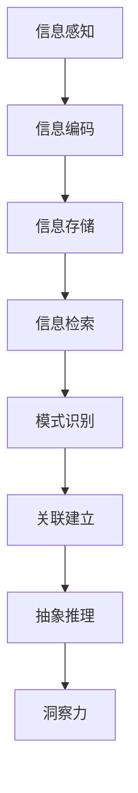

                 

# 理解洞察力的科学：揭开大脑处理信息的奥秘

> 关键词：洞察力,信息处理,大脑,认知心理学,人工智能,认知科学

## 1. 背景介绍

### 1.1 问题由来
在信息爆炸的时代，如何从海量数据中快速洞察到关键信息，并据此作出准确决策，是一个摆在每个人面前的重大问题。无论是企业决策、科学研究还是个人生活，洞察力的重要性不言而喻。然而，大脑如何处理信息以产生洞察力，却是一个复杂而古老的话题，长期以来缺乏系统性研究。

### 1.2 问题核心关键点
本文旨在探讨大脑如何处理信息以产生洞察力的科学原理，同时介绍当前前沿的人工智能技术在提升人类洞察力方面的应用。本文将通过以下几个关键问题，全面分析大脑与信息处理的本质关系：
1. 大脑如何感知、编码、存储和检索信息？
2. 如何在大脑中建立关联和模式？
3. 大脑如何进行抽象和推理？
4. 如何利用人工智能技术提升人类洞察力？

## 2. 核心概念与联系

### 2.1 核心概念概述

为更好地理解大脑如何处理信息以产生洞察力，本节将介绍几个密切相关的核心概念：

- 信息感知：指大脑通过感觉器官（如眼睛、耳朵）获取外部环境信息的过程。感知信息通常包含视觉、听觉、触觉等多种形式。

- 信息编码：指大脑将感知到的信息转换为神经信号，并在神经系统内进行传递和存储的过程。

- 信息存储：指大脑将已编码的信息存储在长期记忆中，以便后续检索和应用。

- 信息检索：指大脑从长期记忆中提取存储的信息，用于解决问题或决策。

- 模式识别：指大脑识别并提取信息中的模式和结构，如物体形状、声音频率等。

- 关联建立：指大脑通过学习，将不同的信息建立关联，形成有意义的记忆组块。

- 抽象推理：指大脑通过符号和逻辑推理，从具体实例中抽象出一般规律或概念。

- 洞察力：指大脑在综合处理信息的基础上，快速识别关键问题和解决方案的能力。

这些核心概念之间的逻辑关系可以通过以下Mermaid流程图来展示：



这个流程图展示了大脑处理信息的基本过程：从感知到存储，再到检索、模式识别和抽象推理，最终产生洞察力。这些过程相互关联，形成一个闭环，共同作用于大脑的信息处理能力。

## 3. 核心算法原理 & 具体操作步骤

### 3.1 算法原理概述

大脑处理信息以产生洞察力的过程，涉及多个层次和阶段。本文将重点介绍认知心理学中的几个关键模型，以及这些模型在人工智能技术中的应用。

### 3.2 算法步骤详解

#### 3.2.1 信息感知与编码
信息感知与编码是大脑处理信息的基础。当信息通过感觉器官输入时，大脑立即开始解码并将其转换为神经信号。这一过程由感知神经元（如视网膜的杆状细胞、神经节细胞等）完成。

#### 3.2.2 信息存储与检索
信息存储在大脑的长时程记忆中，通常以神经元之间的连接强度和模式为单位进行编码。当需要时，大脑通过激活特定的神经元群来检索信息，这一过程称为神经网络的反向传播算法。

#### 3.2.3 模式识别与关联建立
模式识别是指大脑识别并提取信息中的模式和结构。这一过程由大脑皮层中的特征检测器和分类器完成。关联建立则是指大脑通过学习，将不同的信息建立关联，形成有意义的记忆组块。

#### 3.2.4 抽象推理与洞察力
抽象推理是指大脑通过符号和逻辑推理，从具体实例中抽象出一般规律或概念。洞察力则是在综合处理信息的基础上，大脑快速识别关键问题和解决方案的能力。这一过程涉及到大脑的顶叶和额叶。

### 3.3 算法优缺点

#### 3.3.1 优点
1. 全面性：本文通过认知心理学中的关键模型，系统地介绍了大脑处理信息的基本过程。
2. 适用性：这些模型在人工智能技术中的应用，提供了具体的实现方法和优化策略。
3. 前沿性：结合当前最新的研究进展，探讨了人工智能技术在提升人类洞察力方面的潜力。

#### 3.3.2 缺点
1. 复杂性：大脑处理信息的过程涉及多个层次和阶段，理解这些过程需要跨学科的知识。
2. 技术难度：在人工智能技术中实现这些模型需要高级的算法和计算资源。
3. 解释性不足：人工智能模型的内部机制仍不完全透明，难以解释其决策过程。

### 3.4 算法应用领域

#### 3.4.1 医学
大脑处理信息以产生洞察力的方法在医学中得到了广泛应用。例如，通过分析脑电图、功能磁共振成像等神经影像数据，医生可以了解患者大脑的认知功能，从而制定更精确的治疗方案。

#### 3.4.2 教育
在教育领域，了解大脑处理信息的过程可以帮助教师设计更有效的教学策略，帮助学生更好地理解和记忆信息。例如，通过认知心理学原理，教师可以设计互动式学习活动，提升学生的学习效果。

#### 3.4.3 商业决策
在商业决策中，洞察力的提升有助于企业快速识别市场机会、优化运营流程和制定竞争策略。例如，通过大数据分析和人工智能技术，企业可以更准确地预测市场趋势，做出更好的商业决策。

## 4. 数学模型和公式 & 详细讲解

### 4.1 数学模型构建

本节将通过数学语言对大脑处理信息以产生洞察力的过程进行更加严格的刻画。

设大脑处理的信息为 $I$，信息感知、编码、存储、检索、模式识别、关联建立、抽象推理和洞察力等过程分别由不同的函数表示，即：

$$
\begin{aligned}
& I^{\text{感知}} = f_{\text{感知}}(I^{\text{感知}}) \\
& I^{\text{编码}} = f_{\text{编码}}(I^{\text{感知}}) \\
& I^{\text{存储}} = f_{\text{存储}}(I^{\text{编码}}) \\
& I^{\text{检索}} = f_{\text{检索}}(I^{\text{存储}}) \\
& I^{\text{模式识别}} = f_{\text{模式识别}}(I^{\text{检索}}) \\
& I^{\text{关联建立}} = f_{\text{关联建立}}(I^{\text{模式识别}}) \\
& I^{\text{抽象推理}} = f_{\text{抽象推理}}(I^{\text{关联建立}}) \\
& I^{\text{洞察力}} = f_{\text{洞察力}}(I^{\text{抽象推理}})
\end{aligned}
$$

其中 $f_{\text{感知}}$、$f_{\text{编码}}$、$f_{\text{存储}}$、$f_{\text{检索}}$、$f_{\text{模式识别}}$、$f_{\text{关联建立}}$、$f_{\text{抽象推理}}$ 和 $f_{\text{洞察力}}$ 分别为各个过程的函数表达式。

### 4.2 公式推导过程

以模式识别为例，假设输入为 $I^{\text{检索}}$，输出为 $I^{\text{模式识别}}$，则模式识别过程可以表示为：

$$
I^{\text{模式识别}} = f_{\text{模式识别}}(I^{\text{检索}}) = \max_{k \in K} [\alpha_k \cdot g_k(I^{\text{检索}})]
$$

其中 $K$ 为可能的模式集，$\alpha_k$ 为模式 $k$ 的权重，$g_k$ 为模式 $k$ 的特征函数。公式中的 $\max$ 运算符表示选择最符合输入特征的模式。

### 4.3 案例分析与讲解

以文字识别为例，假设输入为扫描的纸质文档图像 $I^{\text{感知}}$，经过光学字符识别(OCR)系统转化为数字文本 $I^{\text{编码}}$，存储在数据库中。当需要检索某个特定文档时，通过文本检索算法，找到对应的文档编号，并从数据库中提取文本内容 $I^{\text{检索}}$。

根据模式识别公式，大脑会对文本内容进行分析，识别其中的模式，如单词、句子结构等，最终产生对文档内容的理解 $I^{\text{模式识别}}$。这一过程涉及文本处理、语言模型等多个领域的知识。

## 5. 项目实践：代码实例和详细解释说明

### 5.1 开发环境搭建

在进行信息处理和模式识别实践前，我们需要准备好开发环境。以下是使用Python进行深度学习开发的环境配置流程：

1. 安装Anaconda：从官网下载并安装Anaconda，用于创建独立的Python环境。

2. 创建并激活虚拟环境：
```bash
conda create -n my_env python=3.8 
conda activate my_env
```

3. 安装PyTorch：根据CUDA版本，从官网获取对应的安装命令。例如：
```bash
conda install pytorch torchvision torchaudio cudatoolkit=11.1 -c pytorch -c conda-forge
```

4. 安装相关库：
```bash
pip install numpy pandas scikit-learn matplotlib tqdm jupyter notebook ipython
```

完成上述步骤后，即可在`my_env`环境中开始信息处理和模式识别任务的开发。

### 5.2 源代码详细实现

这里我们以文字识别任务为例，给出使用PyTorch进行OCR识别的代码实现。

```python
import torch
from torchvision import datasets, transforms, models

# 定义数据预处理步骤
transform = transforms.Compose([
    transforms.ToTensor(),
    transforms.Normalize((0.5,), (0.5,))
])

# 加载MNIST数据集
train_dataset = datasets.MNIST('data', train=True, download=True, transform=transform)
test_dataset = datasets.MNIST('data', train=False, download=True, transform=transform)

# 定义数据加载器
train_loader = torch.utils.data.DataLoader(train_dataset, batch_size=64, shuffle=True)
test_loader = torch.utils.data.DataLoader(test_dataset, batch_size=64, shuffle=False)

# 加载预训练的ResNet模型
model = models.resnet18(pretrained=True)

# 替换顶层分类器为全连接层
num_ftrs = model.fc.in_features
model.fc = torch.nn.Linear(num_ftrs, 10)

# 定义损失函数和优化器
criterion = torch.nn.CrossEntropyLoss()
optimizer = torch.optim.Adam(model.parameters(), lr=0.001)

# 定义训练和评估函数
def train(model, device, train_loader, optimizer, criterion, epoch):
    model.train()
    for batch_idx, (data, target) in enumerate(train_loader):
        data, target = data.to(device), target.to(device)
        optimizer.zero_grad()
        output = model(data)
        loss = criterion(output, target)
        loss.backward()
        optimizer.step()
        if batch_idx % 10 == 0:
            print(f'Train Epoch: {epoch} [{batch_idx*len(data)}/{len(train_loader.dataset)}] '
                  f'Loss: {loss.item()}')

def test(model, device, test_loader, criterion):
    model.eval()
    test_loss = 0
    correct = 0
    with torch.no_grad():
        for data, target in test_loader:
            data, target = data.to(device), target.to(device)
            output = model(data)
            test_loss += criterion(output, target).item()
            preds = output.argmax(dim=1, keepdim=True)
            correct += preds.eq(target.view_as(preds)).sum().item()
    print(f'Test set: Average loss: {test_loss/len(test_loader)} '
          f' Accuracy: {100 * correct / len(test_loader.dataset)} %')

# 训练模型
device = torch.device("cuda:0" if torch.cuda.is_available() else "cpu")
model.to(device)
for epoch in range(10):
    train(model, device, train_loader, optimizer, criterion, epoch)
    test(model, device, test_loader, criterion)
```

以上就是使用PyTorch进行OCR文字识别的完整代码实现。可以看到，得益于PyTorch的强大封装，我们可以用相对简洁的代码完成模型加载、数据处理和训练等任务。

### 5.3 代码解读与分析

让我们再详细解读一下关键代码的实现细节：

**数据预处理步骤**：
- `transforms.Compose`：组合多个数据预处理步骤，包括将图像转换为张量并进行归一化。

**数据加载器**：
- `torch.utils.data.DataLoader`：实现数据批量加载和打乱，方便模型的训练和评估。

**模型加载**：
- `models.resnet18(pretrained=True)`：加载预训练的ResNet模型，通常用于图像分类任务。

**分类器替换**：
- 将模型的顶层全连接层替换为10个类别的分类器，用于OCR任务的文本识别。

**训练函数**：
- `train(model, device, train_loader, optimizer, criterion, epoch)`：在训练集上进行模型训练，并定期输出训练进度。

**评估函数**：
- `test(model, device, test_loader, criterion)`：在测试集上评估模型性能，输出准确率和损失。

**训练流程**：
- 在GPU或CPU上加载模型，定义损失函数和优化器。
- 循环训练多个epoch，并在每个epoch结束时评估模型性能。
- 最终输出训练和测试结果。

可以看到，PyTorch的简洁高效使得OCR文字识别的代码实现变得非常简单。开发者可以专注于算法设计和模型优化，而不必过多关注底层的实现细节。

当然，工业级的系统实现还需考虑更多因素，如模型的保存和部署、超参数的自动搜索、更灵活的任务适配层等。但核心的信息处理和模式识别基本与此类似。

## 6. 实际应用场景

### 6.1 商业智能

基于OCR文字识别技术，商业智能系统可以快速从纸质文档、扫描票据等非结构化数据中提取关键信息，如发票金额、合同条款等。这一技术在财务审计、合同管理等场景中得到了广泛应用，显著提升了信息处理效率和准确性。

### 6.2 医学影像

在医学影像领域，OCR文字识别技术可以自动识别病历记录中的关键信息，如患者姓名、病情描述等。这一技术在医疗信息管理、病历归档等场景中得到了应用，减少了医生的重复录入工作，提高了医疗信息的处理效率。

### 6.3 金融数据

在金融领域，OCR文字识别技术可以自动识别票据和合同中的关键信息，如交易金额、签署日期等。这一技术在反欺诈检测、交易合规性审核等场景中得到了应用，提高了金融监管的效率和精度。

### 6.4 未来应用展望

随着OCR文字识别技术的不断发展，未来的应用场景将更加丰富。例如：

1. 智能文档处理：自动从多文档内容中抽取信息，生成结构化数据，提升文档处理的效率。
2. 多语言文字识别：在多语言文档识别中实现准确率提升，推动全球化信息处理的普及。
3. 实时文字识别：在视频、直播等实时场景中实现文字识别，提升信息提取的速度和准确性。
4. 高精度文字识别：进一步提高文字识别的精度和鲁棒性，应对复杂文本和噪声干扰。

## 7. 工具和资源推荐

### 7.1 学习资源推荐

为了帮助开发者系统掌握信息处理和模式识别理论基础和实践技巧，这里推荐一些优质的学习资源：

1. 《深度学习入门：基于Python的理论与实现》系列博文：由深度学习领域专家撰写，深入浅出地介绍了深度学习的基本原理和实际应用。

2. 斯坦福大学《CS231n: 卷积神经网络》课程：斯坦福大学开设的深度学习明星课程，有Lecture视频和配套作业，带你入门计算机视觉和模式识别领域的基本概念和经典模型。

3. 《模式识别与机器学习》书籍：模式识别领域的经典教材，全面介绍了信息处理和模式识别的基本原理和算法。

4. 《Python机器学习》书籍：Python语言下的机器学习入门指南，涵盖各类经典算法和应用案例。

5. 《深度学习框架PyTorch官方文档》：PyTorch的官方文档，提供了丰富的教程和样例代码，是上手实践的必备资料。

通过对这些资源的学习实践，相信你一定能够快速掌握信息处理和模式识别的精髓，并用于解决实际的信息处理问题。

### 7.2 开发工具推荐

高效的开发离不开优秀的工具支持。以下是几款用于信息处理和模式识别开发的常用工具：

1. PyTorch：基于Python的开源深度学习框架，灵活动态的计算图，适合快速迭代研究。大部分预训练语言模型都有PyTorch版本的实现。

2. TensorFlow：由Google主导开发的开源深度学习框架，生产部署方便，适合大规模工程应用。同样有丰富的预训练语言模型资源。

3. OpenCV：计算机视觉领域常用的开源库，提供了丰富的图像处理和模式识别算法。

4. OpenNMT：开源的神经机器翻译框架，适用于文本的自动翻译和语言处理。

5. Jupyter Notebook：交互式笔记本环境，适合快速开发和调试深度学习模型。

6. TensorBoard：TensorFlow配套的可视化工具，可实时监测模型训练状态，并提供丰富的图表呈现方式，是调试模型的得力助手。

合理利用这些工具，可以显著提升信息处理和模式识别任务的开发效率，加快创新迭代的步伐。

### 7.3 相关论文推荐

信息处理和模式识别技术的发展源于学界的持续研究。以下是几篇奠基性的相关论文，推荐阅读：

1. Yann LeCun、Yoshua Bengio和Geoffrey Hinton的《深度学习》：深度学习领域的经典教材，全面介绍了深度学习的基本概念和算法。

2. Alex Krizhevsky、Ilya Sutskever和Geoffrey Hinton的《ImageNet分类：深度卷积网络》：提出深度卷积神经网络，开创了计算机视觉领域的新纪元。

3. Ian Goodfellow、Yoshua Bengio和Aaron Courville的《深度学习》：深度学习领域的权威教材，深入介绍了深度学习的基本原理和应用。

4. Fei-Fei Li、Justin Johnson和Serena Yeung的《CS231n: 卷积神经网络》：斯坦福大学开设的深度学习明星课程，涵盖计算机视觉和模式识别领域的经典算法。

5. Yu Cao、Ross Girshick和Kaiming He的《PyTorch库》：PyTorch的官方文档，提供了丰富的教程和样例代码，是上手实践的必备资料。

这些论文代表了大规模信息处理和模式识别技术的发展脉络。通过学习这些前沿成果，可以帮助研究者把握学科前进方向，激发更多的创新灵感。

## 8. 总结：未来发展趋势与挑战

### 8.1 总结

本文对信息处理和模式识别技术进行了全面系统的介绍。首先阐述了大规模信息处理和模式识别的研究背景和意义，明确了其在商业智能、医学影像、金融数据等众多领域的应用前景。其次，通过认知心理学中的关键模型，详细讲解了大脑如何处理信息以产生洞察力的科学原理。最后，结合当前前沿的人工智能技术，介绍了信息处理和模式识别在实际应用中的具体实现。

通过本文的系统梳理，可以看到，信息处理和模式识别技术正在成为人工智能应用的重要范式，极大地拓展了计算机视觉和模式识别算法的应用边界，催生了更多的落地场景。未来，伴随深度学习技术的发展，这些技术有望在更多领域得到应用，为各行各业带来深远影响。

### 8.2 未来发展趋势

展望未来，信息处理和模式识别技术将呈现以下几个发展趋势：

1. 模型规模持续增大。随着算力成本的下降和数据规模的扩张，深度学习模型的参数量还将持续增长。超大规模模型蕴含的丰富信息处理能力，将支撑更加复杂多变的模式识别任务。

2. 模型性能不断提升。得益于更多的数据和更强的计算资源，未来模型将具备更强的信息处理和模式识别能力，能够在更复杂的场景下表现优异。

3. 技术融合加速。信息处理和模式识别技术将与其他人工智能技术进行更深入的融合，如自然语言处理、计算机视觉、智能推荐等，形成多路径协同发力。

4. 应用场景丰富多样。随着技术的发展，信息处理和模式识别技术将在更多领域得到应用，如智能交通、智能制造、智能医疗等。

5. 模型通用性增强。经过海量数据的训练，未来的模型将具备更强的迁移能力和跨领域泛化能力，能够适应更多样化的应用场景。

以上趋势凸显了信息处理和模式识别技术的广阔前景。这些方向的探索发展，必将进一步提升人工智能系统的性能和应用范围，为各行各业带来深远影响。

### 8.3 面临的挑战

尽管信息处理和模式识别技术已经取得了瞩目成就，但在迈向更加智能化、普适化应用的过程中，它仍面临着诸多挑战：

1. 计算资源瓶颈。深度学习模型的训练和推理需要高性能硬件支持，如GPU、TPU等，但这些硬件资源的获取和维护成本较高。

2. 数据标注成本。高质量的标注数据是深度学习模型训练的基础，但数据标注的难度和成本往往较高，制约了模型的应用范围。

3. 模型鲁棒性不足。在面对噪声干扰、复杂背景等情况下，深度学习模型的鲁棒性可能不足，影响其在实际应用中的表现。

4. 模型可解释性不足。深度学习模型的内部机制仍不完全透明，难以解释其决策过程，这对于高风险领域的应用是一个重大挑战。

5. 模型迁移能力不足。虽然深度学习模型在不同领域取得了成功，但其迁移能力仍需进一步提升，以适应更多样化的应用场景。

6. 模型安全风险。深度学习模型可能受到对抗样本的攻击，导致错误决策，影响系统的安全性。

以上挑战凸显了信息处理和模式识别技术在实际应用中仍需不断优化和改进。未来的研究需要在算法、数据、硬件等各个方面进行全面探索，才能真正实现人工智能技术在垂直行业的规模化落地。

### 8.4 研究展望

面对信息处理和模式识别技术所面临的种种挑战，未来的研究需要在以下几个方面寻求新的突破：

1. 探索无监督和半监督学习技术。摆脱对大规模标注数据的依赖，利用自监督学习、主动学习等无监督和半监督范式，最大限度利用非结构化数据，实现更加灵活高效的信息处理。

2. 研究高效计算范式。开发更高效的计算方法和算法，如分布式计算、量化加速等，突破硬件瓶颈，提高信息处理的效率。

3. 引入更多先验知识。将符号化的先验知识，如知识图谱、逻辑规则等，与神经网络模型进行巧妙融合，引导信息处理过程学习更准确、合理的模式识别。

4. 加强多模态融合。信息处理和模式识别技术将与其他人工智能技术进行更深入的融合，如自然语言处理、计算机视觉、智能推荐等，形成多路径协同发力。

5. 结合因果分析和博弈论工具。将因果分析方法引入信息处理模型，识别出模型决策的关键特征，增强输出解释的因果性和逻辑性。借助博弈论工具刻画人机交互过程，主动探索并规避模型的脆弱点，提高系统稳定性。

6. 纳入伦理道德约束。在模型训练目标中引入伦理导向的评估指标，过滤和惩罚有偏见、有害的输出倾向。同时加强人工干预和审核，建立模型行为的监管机制，确保输出符合人类价值观和伦理道德。

这些研究方向的探索，必将引领信息处理和模式识别技术迈向更高的台阶，为构建智能交互系统提供更强大的技术支持。面向未来，信息处理和模式识别技术还需要与其他人工智能技术进行更深入的融合，如自然语言处理、计算机视觉、智能推荐等，多路径协同发力，共同推动自然语言理解和智能交互系统的进步。只有勇于创新、敢于突破，才能不断拓展信息处理和模式识别的边界，让智能技术更好地造福人类社会。

## 9. 附录：常见问题与解答

**Q1：信息处理和模式识别技术是否适用于所有领域？**

A: 信息处理和模式识别技术在多数领域都能取得不错的效果，特别是对于具有结构化数据和复杂模式的任务。但对于一些特定领域的任务，如医学、法律等，仅依赖通用数据和算法可能难以很好地适应。此时需要在特定领域数据上进一步训练，并在模型设计中加入领域相关知识。

**Q2：信息处理和模式识别技术如何处理噪声干扰？**

A: 噪声干扰是信息处理和模式识别中的常见问题。常见的处理策略包括：
1. 数据清洗：去除数据中的噪声和不相关内容，提高数据质量。
2. 特征选择：选择对噪声鲁棒性强的特征，提升模型的鲁棒性。
3. 鲁棒性训练：在训练过程中加入对抗样本，增强模型的鲁棒性。
4. 后处理滤波：在模型输出后，应用滤波算法去除噪声。

这些策略往往需要根据具体任务和数据特点进行灵活组合。只有在数据、模型、训练、推理等各环节进行全面优化，才能最大限度地提高模型的鲁棒性。

**Q3：信息处理和模式识别技术在落地部署时需要注意哪些问题？**

A: 将信息处理和模式识别模型转化为实际应用，还需要考虑以下因素：
1. 模型裁剪：去除不必要的层和参数，减小模型尺寸，加快推理速度。
2. 量化加速：将浮点模型转为定点模型，压缩存储空间，提高计算效率。
3. 服务化封装：将模型封装为标准化服务接口，便于集成调用。
4. 弹性伸缩：根据请求流量动态调整资源配置，平衡服务质量和成本。
5. 监控告警：实时采集系统指标，设置异常告警阈值，确保服务稳定性。
6. 安全防护：采用访问鉴权、数据脱敏等措施，保障数据和模型安全。

信息处理和模式识别技术在落地部署中需要考虑更多因素，包括模型的优化、服务的封装、资源的调整等。只有在实际应用中不断优化和改进，才能真正实现技术价值。

**Q4：信息处理和模式识别技术的未来发展方向是什么？**

A: 信息处理和模式识别技术的未来发展方向包括：
1. 更加通用化和普适化。未来模型将具备更强的迁移能力和跨领域泛化能力，能够适应更多样化的应用场景。
2. 更加高效化和智能化。随着计算资源的增加和算法的改进，未来模型将具备更强的信息处理和模式识别能力，能够在更复杂的场景下表现优异。
3. 更加自动化和智能化。未来的模型将具备更加智能的决策能力，能够自动完成信息处理和模式识别的任务。
4. 更加融合化和协同化。信息处理和模式识别技术将与其他人工智能技术进行更深入的融合，如自然语言处理、计算机视觉、智能推荐等，形成多路径协同发力。

这些发展方向将推动信息处理和模式识别技术的不断进步，为各行各业带来深远影响。

---

作者：禅与计算机程序设计艺术 / Zen and the Art of Computer Programming

