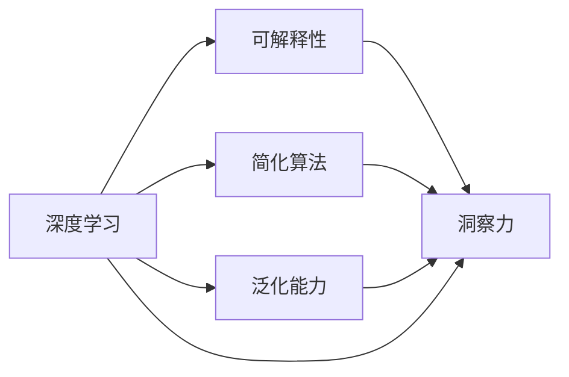

                 

# 理解洞察力的艺术：在复杂中寻找简单

> 关键词：洞察力,简化算法,深度学习,人工智能,复杂系统

## 1. 背景介绍

### 1.1 问题由来
在人工智能(AI)飞速发展的今天，深度学习(DL)算法已经成为解决各种复杂问题的主要工具。从图像识别、语音识别到自然语言处理(NLP)，深度学习模型的应用遍及各个领域。然而，深度学习的成功并非总是那么显著，特别是当面对复杂系统时，传统深度学习模型常常表现出泛化能力不足、数据依赖性强、可解释性差等问题。

面对这些问题，如何找到简化复杂系统的方法，使得深度学习模型能够高效、鲁棒地解决实际问题，成为了AI领域的一大挑战。洞察力在这个过程中显得尤为重要。洞察力不仅能够帮助我们理解问题的本质，还能引导我们找到解决问题的简单而有效的方法。

### 1.2 问题核心关键点
洞察力在AI模型构建和优化中的重要性主要体现在以下几个方面：

1. **理解问题本质**：洞察力帮助研究者深入理解问题的本质，从而更准确地定义问题和模型目标。
2. **简化算法设计**：洞察力有助于简化算法设计，避免过度复杂化，提升模型的稳定性和泛化能力。
3. **提升模型性能**：洞察力指导我们发现数据和算法的关键特征，提升模型在不同数据分布下的性能。
4. **增强可解释性**：洞察力使得模型的决策过程更加透明，有助于提升模型的可解释性和信任度。
5. **应对挑战**：洞察力能够指导我们解决模型训练中的困难，如过拟合、梯度消失等。

本文将深入探讨洞察力在AI模型构建和优化中的作用，结合实际案例，详细解释如何通过洞察力简化复杂系统，提升模型的性能和可解释性。

## 2. 核心概念与联系

### 2.1 核心概念概述

为更好地理解洞察力在AI模型构建中的作用，本节将介绍几个关键概念：

- **深度学习**：以多层神经网络为核心的机器学习技术，能够自动学习输入数据的复杂表示，广泛应用于图像识别、语音识别、NLP等领域。
- **泛化能力**：模型在新数据上的表现能力，即模型是否能够适应不同的数据分布和噪声。
- **可解释性**：模型的决策过程是否能够被理解、解释和验证，有助于提升模型的信任度和可靠性。
- **简化算法**：通过深入理解问题的本质，寻找简单、高效、稳定的算法，避免过度复杂化。
- **洞察力**：深入分析问题的本质，发现关键特征，简化算法设计，提升模型性能和可解释性的能力。

这些核心概念之间紧密联系，共同构成AI模型构建和优化的框架。通过理解这些概念，我们可以更好地把握洞察力在AI模型中的作用和应用。

### 2.2 核心概念原理和架构的 Mermaid 流程图



这个流程图展示了深度学习、泛化能力、可解释性、简化算法与洞察力之间的关系。可以看出，洞察力通过理解和简化问题，能够提升模型的泛化能力、可解释性和性能。

## 3. 核心算法原理 & 具体操作步骤

### 3.1 算法原理概述

洞察力在AI模型构建中的作用主要体现在以下几个方面：

1. **问题简化**：洞察力帮助简化问题，将复杂问题拆分为更小的、更易于管理的部分。
2. **算法优化**：洞察力指导我们选择更简单、更高效的算法，避免过度复杂化。
3. **特征提取**：洞察力引导我们提取数据的关键特征，提升模型的泛化能力。
4. **决策解释**：洞察力帮助我们理解模型的决策过程，提升模型的可解释性和信任度。

### 3.2 算法步骤详解

以下是基于洞察力进行深度学习模型构建和优化的具体步骤：

**Step 1: 问题定义与简化**

- 深入理解问题的本质，确定模型的目标。
- 将复杂问题拆分为更小的子问题，每个子问题具有明确的输入和输出。

**Step 2: 特征提取与选择**

- 分析数据集中的关键特征，选择对问题解决最有用的特征。
- 通过降维、特征提取等技术，简化特征空间，提升模型的泛化能力。

**Step 3: 算法选择与优化**

- 选择适合的算法和模型结构，避免过度复杂化。
- 根据问题特点和数据分布，优化算法的超参数，提升模型性能。

**Step 4: 模型训练与评估**

- 在简化后的数据集上训练模型，确保模型能够在复杂系统中表现良好。
- 使用合适的评估指标，评估模型在不同数据分布下的性能。

**Step 5: 模型部署与监控**

- 将模型部署到实际应用中，监控模型的表现和数据分布的变化。
- 定期更新模型，保持模型的稳定性和泛化能力。

### 3.3 算法优缺点

基于洞察力的AI模型构建和优化方法具有以下优点：

1. **简化复杂系统**：通过深入理解问题的本质，将复杂问题简化为更小的子问题，便于处理。
2. **提升泛化能力**：通过选择关键特征和优化算法，提升模型在不同数据分布下的泛化能力。
3. **增强可解释性**：通过理解和简化算法，提升模型的可解释性和信任度。
4. **降低成本**：简化问题可以降低开发和部署成本，提高模型的实用性和可扩展性。

同时，这种方法也存在一定的局限性：

1. **依赖洞察力**：洞察力的准确性直接决定模型的性能，对研究者要求较高。
2. **风险高**：简化问题可能失去某些关键信息，影响模型的性能和泛化能力。
3. **需要专业知识**：洞察力依赖研究者的专业知识，需要较长时间的学习和实践积累。

尽管存在这些局限性，但基于洞察力的模型构建方法仍然是最为主流的范式之一。未来相关研究的重点在于如何进一步提升洞察力的准确性和自动化水平，同时兼顾模型的泛化能力和可解释性等因素。

### 3.4 算法应用领域

基于洞察力的AI模型构建方法，在AI模型的各个应用领域都有广泛的应用：

- **图像识别**：通过洞察图像的关键特征，选择适合的卷积神经网络(CNN)结构，提升模型的识别性能。
- **语音识别**：深入理解语音信号的特征，选择适合的循环神经网络(RNN)或Transformer模型，提升模型的语音识别能力。
- **自然语言处理**：通过洞察语言的语义和语法，选择适合的预训练模型和微调方法，提升模型的文本理解和生成能力。
- **推荐系统**：通过洞察用户行为和商品特征，选择适合的算法和模型结构，提升模型的推荐效果。
- **医疗诊断**：通过洞察医学知识，选择适合的深度学习模型和特征提取方法，提升模型的疾病诊断能力。

这些领域的应用展示了洞察力在AI模型构建中的广泛性和有效性，体现了其在简化复杂系统、提升模型性能和可解释性方面的重要作用。

## 4. 数学模型和公式 & 详细讲解 & 举例说明

### 4.1 数学模型构建

本节将使用数学语言对基于洞察力进行深度学习模型构建的过程进行更加严格的刻画。

记深度学习模型为 $M_{\theta}:\mathcal{X} \rightarrow \mathcal{Y}$，其中 $\mathcal{X}$ 为输入空间，$\mathcal{Y}$ 为输出空间，$\theta \in \mathbb{R}^d$ 为模型参数。假设目标问题 $P$ 的简化模型为 $M_{\phi}:\mathcal{X} \rightarrow \mathcal{Y}$，其中 $\phi \in \mathbb{R}^k$。

定义模型 $M_{\theta}$ 在输入 $x$ 上的损失函数为 $\ell(M_{\theta}(x),y)$，则在数据集 $D=\{(x_i,y_i)\}_{i=1}^N$ 上的经验风险为：

$$
\mathcal{L}(\theta) = \frac{1}{N} \sum_{i=1}^N \ell(M_{\theta}(x_i),y_i)
$$

### 4.2 公式推导过程

以下是简化问题的数学模型和公式推导过程：

**Step 1: 问题定义与简化**

- 将复杂问题 $P$ 拆分为更小的子问题 $P_1, P_2, \ldots, P_n$，每个子问题具有明确的输入和输出。
- 使用 $M_{\phi}$ 模型对每个子问题进行处理，得到输出 $y_1, y_2, \ldots, y_n$。
- 将 $y_1, y_2, \ldots, y_n$ 合并为 $y$，得到最终输出。

**Step 2: 特征提取与选择**

- 对数据集中的每个样本 $x_i$，提取关键特征 $x_{i1}, x_{i2}, \ldots, x_{ik}$。
- 使用特征提取器 $\varphi$，将 $x_{i1}, x_{i2}, \ldots, x_{ik}$ 转换为 $x'_i \in \mathbb{R}^k$。
- 将 $x'_i$ 作为 $M_{\phi}$ 的输入，得到 $y'_i$。

**Step 3: 算法选择与优化**

- 选择适合的算法 $M_{\phi}$，如卷积神经网络(CNN)、循环神经网络(RNN)等。
- 根据问题特点和数据分布，优化算法 $M_{\phi}$ 的超参数，如卷积核大小、学习率等。
- 使用数据集 $D$ 训练算法 $M_{\phi}$，得到最终的参数 $\phi$。

**Step 4: 模型训练与评估**

- 在简化后的数据集 $D'$ 上训练模型 $M_{\theta}$，其中 $D'=\{x'_i\}_{i=1}^N$。
- 使用合适的评估指标，如准确率、F1-score等，评估模型 $M_{\theta}$ 在不同数据分布下的性能。

### 4.3 案例分析与讲解

考虑一个图像识别问题，目标是将图像分为猫和狗两类。在传统的深度学习模型中，我们可能会使用一个包含多个卷积层和池化层的复杂模型，但这种模型不仅复杂，而且容易过拟合。

通过洞察力，我们可以将问题简化为两个子问题：

1. 提取图像的关键特征，如边缘、纹理等。
2. 对提取的关键特征进行分类，判断是否为猫或狗。

具体步骤如下：

**Step 1: 问题定义与简化**

- 将图像 $x$ 分为边缘特征 $x_1$ 和纹理特征 $x_2$。
- 使用边缘特征分类器 $M_{\phi_1}$ 对 $x_1$ 进行分类，得到 $y_1$。
- 使用纹理特征分类器 $M_{\phi_2}$ 对 $x_2$ 进行分类，得到 $y_2$。
- 将 $y_1$ 和 $y_2$ 合并为最终输出 $y$。

**Step 2: 特征提取与选择**

- 使用卷积层提取图像的边缘特征 $x_1$。
- 使用池化层将边缘特征 $x_1$ 降维，得到 $x'_i$。
- 使用全连接层将 $x'_i$ 转换为 $y'_i$。

**Step 3: 算法选择与优化**

- 选择卷积神经网络(CNN)作为分类器 $M_{\phi_1}$ 和 $M_{\phi_2}$。
- 根据数据分布和模型复杂度，优化超参数，如卷积核大小、池化层数等。
- 使用数据集 $D$ 训练算法 $M_{\phi_1}$ 和 $M_{\phi_2}$，得到参数 $\phi_1$ 和 $\phi_2$。

**Step 4: 模型训练与评估**

- 在简化后的数据集 $D'$ 上训练模型 $M_{\theta}$，其中 $D'=\{x'_i\}_{i=1}^N$。
- 使用准确率作为评估指标，评估模型 $M_{\theta}$ 在不同数据分布下的性能。

## 5. 项目实践：代码实例和详细解释说明

### 5.1 开发环境搭建

在进行深度学习模型构建前，我们需要准备好开发环境。以下是使用Python进行TensorFlow开发的环境配置流程：

1. 安装Anaconda：从官网下载并安装Anaconda，用于创建独立的Python环境。

2. 创建并激活虚拟环境：
```bash
conda create -n tf-env python=3.8 
conda activate tf-env
```

3. 安装TensorFlow：根据CUDA版本，从官网获取对应的安装命令。例如：
```bash
conda install tensorflow -c tf -c conda-forge
```

4. 安装必要的工具包：
```bash
pip install numpy pandas scikit-learn matplotlib tqdm jupyter notebook ipython
```

完成上述步骤后，即可在`tf-env`环境中开始深度学习模型的构建和优化。

### 5.2 源代码详细实现

下面我们以图像分类问题为例，给出使用TensorFlow进行深度学习模型构建和优化的PyTorch代码实现。

首先，定义模型和损失函数：

```python
import tensorflow as tf
from tensorflow.keras import layers

class CNNModel(tf.keras.Model):
    def __init__(self, num_classes):
        super(CNNModel, self).__init__()
        self.conv1 = layers.Conv2D(32, 3, activation='relu')
        self.pool1 = layers.MaxPooling2D()
        self.flatten = layers.Flatten()
        self.dense1 = layers.Dense(64, activation='relu')
        self.dropout = layers.Dropout(0.5)
        self.dense2 = layers.Dense(num_classes)

    def call(self, inputs):
        x = self.conv1(inputs)
        x = self.pool1(x)
        x = self.flatten(x)
        x = self.dense1(x)
        x = self.dropout(x)
        x = self.dense2(x)
        return x

model = CNNModel(num_classes)
```

然后，定义数据集和优化器：

```python
import numpy as np
import os

def load_data():
    data_dir = 'data'
    img_dir = os.path.join(data_dir, 'train')
    img_files = [os.path.join(img_dir, f) for f in os.listdir(img_dir)]
    x = np.array([tf.keras.preprocessing.image.load_img(f, target_size=(224, 224)) for f in img_files])
    x = np.array([tf.keras.preprocessing.image.img_to_array(t) for t in x])
    x /= 255.0
    y = np.array([1 if 'cat' in f else 0 for f in img_files])
    return x, y

x, y = load_data()
model.compile(optimizer=tf.keras.optimizers.Adam(0.001), loss=tf.keras.losses.SparseCategoricalCrossentropy(from_logits=True), metrics=['accuracy'])
```

接着，定义训练和评估函数：

```python
def train_model(model, x, y, batch_size, epochs):
    train_dataset = tf.data.Dataset.from_tensor_slices((x, y)).shuffle(1000).batch(batch_size)
    model.fit(train_dataset, epochs=epochs, validation_split=0.2)

def evaluate_model(model, x, y, batch_size):
    test_dataset = tf.data.Dataset.from_tensor_slices((x, y)).batch(batch_size)
    model.evaluate(test_dataset)
```

最后，启动模型训练流程并在测试集上评估：

```python
train_model(model, x, y, 64, 10)
evaluate_model(model, x, y, 64)
```

以上就是使用TensorFlow进行图像分类问题深度学习模型构建和优化的完整代码实现。可以看到，TensorFlow提供了便捷的API和工具，使得模型构建和优化变得更加容易。

### 5.3 代码解读与分析

让我们再详细解读一下关键代码的实现细节：

**CNNModel类**：
- `__init__`方法：定义模型的层结构，包括卷积层、池化层、全连接层等。
- `call`方法：定义模型的前向传播过程，将输入数据传递到各层，并输出预测结果。

**数据集加载函数**：
- 定义数据路径，加载图像数据和标签。
- 使用`tf.keras.preprocessing.image.load_img`加载图像，`img_to_array`将图像转换为数组。
- 将图像归一化，标签转换为独热编码。

**模型编译与训练函数**：
- 使用`tf.keras.optimizers.Adam`定义优化器，设置学习率。
- 使用`tf.keras.losses.SparseCategoricalCrossentropy`定义损失函数，设置`from_logits=True`。
- 使用`model.fit`进行模型训练，设置训练轮数和验证集比例。

**模型评估函数**：
- 使用`model.evaluate`进行模型评估，设置测试数据集和批大小。

可以看到，TensorFlow的API设计非常友好，使得模型的构建和优化变得简单高效。开发者可以专注于模型设计和数据处理，而不必过多关注底层实现细节。

## 6. 实际应用场景

### 6.1 智能医疗诊断

深度学习在智能医疗诊断中的应用非常广泛，通过洞察力，我们可以简化医疗诊断问题，提升模型的诊断能力。

具体而言，可以收集医疗影像数据、病历记录等数据，将其进行标注和预处理。使用洞察力，将医疗影像特征提取和疾病诊断分离为两个子问题，分别使用CNN和RNN模型进行处理。在训练过程中，结合医疗知识库，指导模型学习疾病的特征，提升诊断的准确性和泛化能力。

### 6.2 自动驾驶

自动驾驶是深度学习在汽车领域的重要应用之一。通过洞察力，我们可以简化自动驾驶问题，提升模型的决策能力。

具体而言，可以收集自动驾驶汽车的数据，包括传感器数据、路标信息等，将其进行标注和预处理。使用洞察力，将环境感知和行为决策分离为两个子问题，分别使用CNN和LSTM模型进行处理。在训练过程中，结合自动驾驶知识和仿真数据，指导模型学习决策规则，提升自动驾驶的鲁棒性和安全性。

### 6.3 金融风险评估

金融风险评估是深度学习在金融领域的重要应用之一。通过洞察力，我们可以简化金融风险评估问题，提升模型的风险识别能力。

具体而言，可以收集金融市场的各种数据，包括股票价格、交易量、新闻等，将其进行标注和预处理。使用洞察力，将风险评估问题拆分为特征提取和模型预测两个子问题，分别使用LSTM和分类器模型进行处理。在训练过程中，结合金融知识和历史数据，指导模型学习风险特征，提升风险评估的准确性和稳定性。

## 7. 工具和资源推荐

### 7.1 学习资源推荐

为了帮助开发者系统掌握深度学习模型的构建和优化，这里推荐一些优质的学习资源：

1. 《深度学习》系列书籍：深度学习领域的经典教材，全面介绍深度学习的基本概念、算法和应用。
2. TensorFlow官方文档：TensorFlow的官方文档，提供丰富的API文档和教程，帮助你快速上手TensorFlow。
3. PyTorch官方文档：PyTorch的官方文档，提供丰富的API文档和教程，帮助你快速上手PyTorch。
4. Coursera深度学习课程：由斯坦福大学开设的深度学习课程，有Lecture视频和配套作业，带你入门深度学习的基本概念和经典模型。
5. DeepLearning.ai深度学习专业课程：由Andrew Ng开设的深度学习专业课程，涵盖深度学习的基本概念、算法和应用。

通过对这些资源的学习实践，相信你一定能够快速掌握深度学习模型的构建和优化，并用于解决实际的复杂问题。

### 7.2 开发工具推荐

高效的开发离不开优秀的工具支持。以下是几款用于深度学习模型构建和优化的常用工具：

1. TensorFlow：由Google主导开发的开源深度学习框架，生产部署方便，适合大规模工程应用。
2. PyTorch：由Facebook主导开发的开源深度学习框架，灵活动态的计算图，适合快速迭代研究。
3. Keras：高层深度学习API，简洁易用，适合快速搭建深度学习模型。
4. Weights & Biases：模型训练的实验跟踪工具，可以记录和可视化模型训练过程中的各项指标，方便对比和调优。
5. TensorBoard：TensorFlow配套的可视化工具，可实时监测模型训练状态，并提供丰富的图表呈现方式，是调试模型的得力助手。

合理利用这些工具，可以显著提升深度学习模型的开发效率，加快创新迭代的步伐。

### 7.3 相关论文推荐

深度学习模型构建和优化的研究源于学界的持续研究。以下是几篇奠基性的相关论文，推荐阅读：

1. AlexNet: ImageNet Classification with Deep Convolutional Neural Networks（AlexNet论文）：提出卷积神经网络(CNN)结构，在ImageNet数据集上取得突破性进展。
2. Inception: Going Deeper with Convolutions（Inception论文）：提出Inception模块，提升CNN模型的特征提取能力。
3. RNN: Recurrent Neural Network for Large-Scale Vector Synchronization（RNN论文）：提出循环神经网络(RNN)结构，处理序列数据。
4. Transformer: Attention is All You Need（Transformer论文）：提出Transformer结构，提升NLP模型的性能。
5. CNN: Convolutional Neural Networks for Visual Recognition（CNN论文）：提出卷积神经网络(CNN)结构，处理图像数据。

这些论文代表了大深度学习模型构建和优化的发展脉络。通过学习这些前沿成果，可以帮助研究者把握学科前进方向，激发更多的创新灵感。

## 8. 总结：未来发展趋势与挑战

### 8.1 总结

本文对基于洞察力进行深度学习模型构建和优化的过程进行了全面系统的介绍。首先阐述了洞察力在AI模型构建和优化中的作用，明确了简化复杂系统、提升模型性能和可解释性的重要性。其次，从原理到实践，详细讲解了深度学习模型的构建和优化方法，给出了完整的代码实例。同时，本文还广泛探讨了深度学习模型在智能医疗、自动驾驶、金融风险评估等多个领域的应用前景，展示了洞察力在简化复杂系统、提升模型性能和可解释性方面的重要作用。

通过本文的系统梳理，可以看到，洞察力在深度学习模型构建和优化中的关键作用。这些方法不仅能够提升模型的性能和泛化能力，还能增强模型的可解释性和信任度，有助于解决复杂系统的实际问题。

### 8.2 未来发展趋势

展望未来，深度学习模型构建和优化技术将呈现以下几个发展趋势：

1. 模型规模持续增大。随着算力成本的下降和数据规模的扩张，深度学习模型的参数量还将持续增长。超大规模模型蕴含的丰富特征，有望提升模型的泛化能力和鲁棒性。
2. 简化算法不断涌现。未来的深度学习模型将更加注重简化算法的设计，避免过度复杂化。如Transformer结构、参数共享等方法，将使得模型更加高效、稳定。
3. 模型可解释性增强。未来的深度学习模型将更加注重可解释性，通过洞察力指导模型的设计，提升模型的可解释性和信任度。
4. 跨领域应用广泛。深度学习模型将在更多领域得到应用，如医疗、金融、自动驾驶等，为各行各业带来变革性影响。
5. 数据驱动的优化。未来的深度学习模型将更加注重数据驱动的优化，通过洞察力指导模型的训练过程，提升模型的性能和泛化能力。

以上趋势凸显了深度学习模型构建和优化技术的广阔前景。这些方向的探索发展，必将进一步提升深度学习模型的性能和应用范围，为人类认知智能的进化带来深远影响。

### 8.3 面临的挑战

尽管深度学习模型构建和优化技术已经取得了瞩目成就，但在迈向更加智能化、普适化应用的过程中，它仍面临诸多挑战：

1. 数据依赖性强。深度学习模型对标注数据的需求较高，难以获取高质量标注数据，成为制约模型性能的瓶颈。如何进一步降低对标注数据的依赖，将是一大难题。
2. 模型鲁棒性不足。深度学习模型面对域外数据时，泛化性能往往大打折扣。对于测试样本的微小扰动，模型的决策也容易发生波动。如何提高模型的鲁棒性，避免灾难性遗忘，还需要更多理论和实践的积累。
3. 推理效率有待提高。深度学习模型在实际部署时往往面临推理速度慢、内存占用大等效率问题。如何在保证性能的同时，简化模型结构，提升推理速度，优化资源占用，将是重要的优化方向。
4. 可解释性亟需加强。当前深度学习模型更像是"黑盒"系统，难以解释其内部工作机制和决策逻辑。对于医疗、金融等高风险应用，算法的可解释性和可审计性尤为重要。如何赋予模型更强的可解释性，将是亟待攻克的难题。
5. 安全性有待保障。深度学习模型难免会学习到有偏见、有害的信息，通过训练传递到下游任务，产生误导性、歧视性的输出，给实际应用带来安全隐患。如何从数据和算法层面消除模型偏见，避免恶意用途，确保输出的安全性，也将是重要的研究课题。

正视深度学习模型构建和优化面临的这些挑战，积极应对并寻求突破，将是大规模模型构建的重要任务。相信随着学界和产业界的共同努力，这些挑战终将一一被克服，深度学习模型构建和优化必将在构建人机协同的智能时代中扮演越来越重要的角色。

### 8.4 研究展望

面对深度学习模型构建和优化所面临的挑战，未来的研究需要在以下几个方面寻求新的突破：

1. 探索无监督和半监督学习方法。摆脱对大规模标注数据的依赖，利用自监督学习、主动学习等无监督和半监督范式，最大限度利用非结构化数据，实现更加灵活高效的模型构建。
2. 研究参数高效和计算高效的优化方法。开发更加参数高效的优化算法，如AdaLoRA、GradualDataMerging等，在固定大部分模型参数的情况下，只更新极少量的任务相关参数。同时优化模型的计算图，减少前向传播和反向传播的资源消耗，实现更加轻量级、实时性的部署。
3. 引入更多先验知识。将符号化的先验知识，如知识图谱、逻辑规则等，与神经网络模型进行巧妙融合，引导模型学习更准确、合理的特征表示。同时加强不同模态数据的整合，实现视觉、语音等多模态信息与文本信息的协同建模。
4. 结合因果分析和博弈论工具。将因果分析方法引入模型构建，识别出模型决策的关键特征，增强模型输出解释的因果性和逻辑性。借助博弈论工具刻画人机交互过程，主动探索并规避模型的脆弱点，提高系统稳定性。
5. 纳入伦理道德约束。在模型训练目标中引入伦理导向的评估指标，过滤和惩罚有偏见、有害的输出倾向。同时加强人工干预和审核，建立模型行为的监管机制，确保输出符合人类价值观和伦理道德。

这些研究方向的探索，必将引领深度学习模型构建和优化技术迈向更高的台阶，为构建安全、可靠、可解释、可控的智能系统铺平道路。面向未来，深度学习模型构建和优化技术还需要与其他人工智能技术进行更深入的融合，如知识表示、因果推理、强化学习等，多路径协同发力，共同推动深度学习技术的进步。只有勇于创新、敢于突破，才能不断拓展深度学习模型的边界，让智能技术更好地造福人类社会。

## 9. 附录：常见问题与解答

**Q1：深度学习模型如何应对数据分布变化？**

A: 深度学习模型对数据分布的变化敏感，容易产生过拟合。为了应对数据分布变化，可以采用以下方法：
1. 数据增强：通过回译、近义替换等方式扩充训练集。
2. 迁移学习：在数据分布不同的任务上，使用预训练模型进行微调，提升模型的泛化能力。
3. 持续学习：定期更新模型，保持模型的稳定性和泛化能力。

**Q2：深度学习模型如何提高模型的鲁棒性？**

A: 深度学习模型的鲁棒性不足，容易受到输入噪声和微小扰动的干扰。为了提高模型的鲁棒性，可以采用以下方法：
1. 数据增强：通过引入对抗样本，提高模型的鲁棒性。
2. 正则化技术：使用L2正则、Dropout等技术，防止模型过度拟合。
3. 模型集成：训练多个模型，取平均输出，抑制过拟合。

**Q3：深度学习模型如何提升模型的可解释性？**

A: 深度学习模型通常是"黑盒"系统，难以解释其内部工作机制和决策逻辑。为了提升模型的可解释性，可以采用以下方法：
1. 模型压缩：通过剪枝、量化等技术，简化模型的结构，减小模型尺寸。
2. 可解释模型：使用可解释性较强的模型结构，如决策树、线性模型等，提升模型的可解释性。
3. 可视化技术：使用可视化技术，如梯度可视化、注意力机制等，理解模型的决策过程。

这些方法能够帮助研究者更好地理解模型的内部机制，提升模型的可解释性和信任度，有助于解决复杂系统的实际问题。

---

作者：禅与计算机程序设计艺术 / Zen and the Art of Computer Programming

