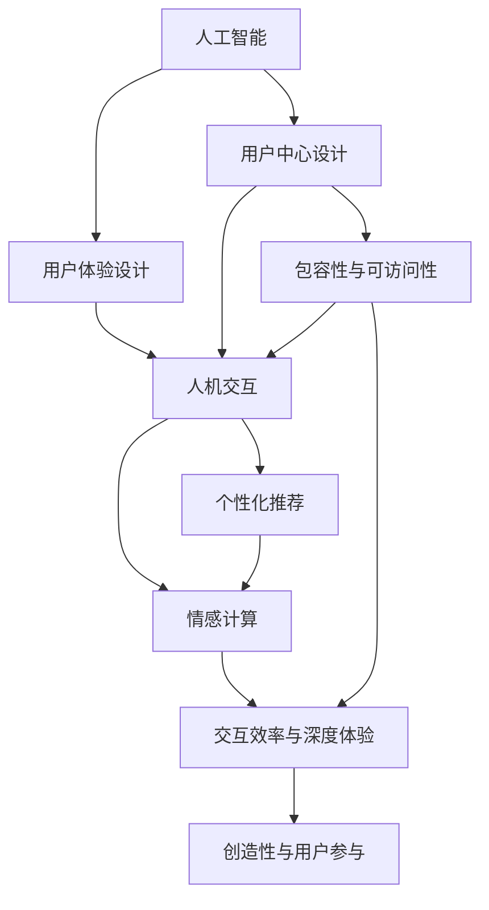

                 

# 用户体验设计：AI的人性化追求

> 关键词：人工智能, 用户体验设计, 用户中心设计, 人机交互, 个性化推荐, 情感计算, 可访问性, 包容性设计

## 1. 背景介绍

随着人工智能(AI)技术的快速发展，AI驱动的设计已经广泛应用于各个领域，从智能家居到自动驾驶，从智能客服到个性化推荐，无处不在。然而，尽管AI带来了前所未有的便捷性和效率，却也引发了一系列关于用户体验的问题。如何设计出能够引起用户共鸣，提供个性化体验的AI产品，是当前界面设计领域的一大挑战。

### 1.1 问题由来

人工智能的广泛应用，让用户体验设计面临新的问题与挑战。当前的设计趋势和范式，往往注重交互效率和自动化，却忽视了用户情感和体验的本质需求。如何构建人性化的用户体验，成为摆在设计师面前的新课题。

1. **高效率与低体验的矛盾**：过于依赖自动化和智能推荐，导致用户对产品的互动过程失去了控制感和沉浸感。
2. **个性化与共性需求的平衡**：追求个性化体验的同时，也需考虑不同用户群体的共性需求，避免过度定制化带来的隔阂。
3. **技术与人性的融合**：AI在提升效率的同时，也需融入更多人性化的考虑，避免冷漠和冷冰冰的技术感。
4. **用户参与与创造**：如何在设计中融入用户反馈和创造性元素，使用户成为参与者和创造者，而非被动接受者。
5. **包容性与可访问性**：确保所有用户群体，包括残障用户，都能平等访问和使用AI产品。

### 1.2 问题核心关键点

本节将重点阐述如何通过人工智能技术，实现更加人性化的用户体验设计。核心问题包括以下几点：

1. **个性化与共性需求**：如何平衡个性化体验与广泛适用性，满足不同用户群体的共性需求。
2. **情感计算与情感响应**：如何通过情感计算技术，捕捉用户情感状态，实现情感化交互。
3. **包容性与可访问性**：如何确保设计的普适性，让所有用户群体，包括残障人士，都能平等地享受AI服务。
4. **交互效率与深度体验**：如何在保证交互效率的同时，提供更加深度和沉浸式的用户体验。
5. **创造性与用户参与**：如何利用AI技术，增强用户创造力和参与感，提升用户粘性和满意度。

通过明确这些关键点，我们才能更好地理解AI在用户体验设计中的应用与挑战。

## 2. 核心概念与联系

### 2.1 核心概念概述

为了更好地理解AI在用户体验设计中的应用，本节将介绍几个关键概念：

1. **人工智能**：通过模拟人类智能行为，实现对复杂任务的自动化处理。人工智能的应用不仅限于特定领域，而是具有广泛的应用前景。
2. **用户体验设计**：以用户为中心的设计理念，关注用户在使用产品时的体验和感受，提升产品的可用性和吸引力。
3. **用户中心设计**：以用户需求和反馈为核心，进行产品设计与优化，确保产品的实用性和可访问性。
4. **人机交互**：人与机器之间的互动过程，包括界面的响应、操作、反馈等。
5. **个性化推荐**：通过分析用户行为和偏好，推荐符合用户需求的产品和服务。
6. **情感计算**：利用AI技术，对用户情感状态进行识别和分析，实现情感化交互。
7. **包容性与可访问性**：确保设计能够为所有用户群体提供平等的访问和使用机会，包括残障用户和少数群体。
8. **可访问性**：使产品和服务对各类用户群体，包括残障人士，都能平等地访问和使用。

这些核心概念之间的逻辑关系可以通过以下Mermaid流程图来展示：



这个流程图展示了人工智能在用户体验设计中的各个应用点，以及各个概念之间的内在联系。

## 3. 核心算法原理 & 具体操作步骤

### 3.1 算法原理概述

基于人工智能的个性化用户体验设计，通常包括以下几个关键步骤：

1. **数据收集**：通过各种方式，如问卷调查、行为数据追踪等，收集用户的反馈和行为数据。
2. **数据处理与分析**：对收集到的数据进行处理和分析，识别出用户的偏好、习惯和情感状态。
3. **模型训练**：利用机器学习或深度学习技术，构建推荐模型、情感计算模型等，对用户数据进行训练和优化。
4. **界面设计与优化**：根据分析结果，设计界面元素、交互流程和反馈机制，优化用户体验。
5. **测试与迭代**：通过用户测试和反馈，不断迭代改进设计，确保产品满足用户的实际需求。

### 3.2 算法步骤详解

以下详细阐述各步骤的实现方法：

**Step 1: 数据收集**

数据收集是用户体验设计的第一步，可以通过以下几种方式进行：

1. **问卷调查**：设计问卷，收集用户对产品的意见和建议。
2. **行为数据追踪**：利用网站、应用等工具，追踪用户的操作行为和路径。
3. **情感识别**：通过面部表情识别、语音情感分析等技术，捕捉用户的情感状态。
4. **用户测试**：通过用户访谈、焦点小组等方式，直接获取用户的使用反馈。

**Step 2: 数据处理与分析**

收集到数据后，需要进行处理和分析，主要包括以下步骤：

1. **数据清洗**：去除无用的数据，处理异常值和缺失值，确保数据质量。
2. **数据可视化**：通过可视化工具，展示数据分布和趋势，帮助理解用户需求。
3. **情感分析**：通过情感计算技术，识别用户情感状态，了解其情绪变化。
4. **行为分析**：分析用户的行为模式，识别其偏好和习惯。
5. **特征提取**：从数据中提取有用的特征，如用户兴趣、浏览记录等。

**Step 3: 模型训练**

利用机器学习和深度学习技术，构建推荐模型和情感计算模型：

1. **推荐模型**：利用协同过滤、内容推荐等算法，根据用户历史行为和兴趣，推荐相关产品和服务。
2. **情感计算模型**：利用情感分析技术，识别用户情感状态，实时调整产品交互方式。

**Step 4: 界面设计与优化**

设计用户界面时，需要考虑以下几个要素：

1. **用户控制**：确保用户能够控制交互过程，避免过度自动化带来的隔阂。
2. **个性化体验**：根据用户偏好和情感状态，提供个性化推荐和服务。
3. **情感反馈**：通过情感计算技术，实时调整产品交互，提升情感共鸣。
4. **交互流程**：设计流畅的交互流程，避免繁琐的操作步骤和复杂的操作链。
5. **界面反馈**：设计有效的界面反馈，提升用户的操作体验。

**Step 5: 测试与迭代**

用户体验设计是一个持续迭代的过程，需要不断地进行测试和优化：

1. **用户测试**：通过A/B测试、用户访谈等方式，获取用户的使用反馈。
2. **数据反馈**：通过数据分析工具，跟踪用户行为和情感变化，及时发现问题。
3. **设计优化**：根据用户反馈和数据分析结果，不断优化设计。
4. **迭代改进**：通过不断的迭代改进，逐步提升用户体验。

### 3.3 算法优缺点

基于人工智能的个性化用户体验设计，有以下优点：

1. **个性化体验**：利用用户数据和算法，提供高度个性化的推荐和服务，提升用户体验。
2. **效率提升**：通过自动化和智能化推荐，提升用户的操作效率。
3. **情感共鸣**：通过情感计算技术，实现情感化交互，增强用户粘性。
4. **可访问性**：确保设计的普适性，让所有用户群体都能平等地访问和使用。

同时，该方法也存在一些缺点：

1. **数据隐私**：大量数据的收集和使用，可能涉及用户隐私和数据安全问题。
2. **算法偏见**：算法模型可能存在偏见，导致推荐结果不公平。
3. **过度自动化**：过度依赖自动化，可能导致用户失去控制感和沉浸感。
4. **复杂性**：设计过程中需要处理大量数据和算法，增加了复杂性。

尽管存在这些缺点，但通过合理的技术手段和设计策略，这些问题是可以被克服的。

### 3.4 算法应用领域

基于人工智能的个性化用户体验设计，广泛应用于各个领域，包括但不限于：

1. **智能家居**：通过情感计算和个性化推荐，提升家居环境的舒适度和智能化水平。
2. **智能客服**：利用用户反馈和情感分析，提升客服系统的响应速度和准确性。
3. **电子商务**：通过个性化推荐和情感计算，提升用户购物体验和满意度。
4. **医疗健康**：利用情感计算和数据分析，提升患者治疗体验和康复效果。
5. **娱乐传媒**：通过个性化推荐和情感计算，提升用户观影、游戏等娱乐体验。
6. **教育培训**：利用用户行为分析和情感计算，提升学习效果和互动体验。

这些应用领域展示了人工智能在用户体验设计中的广泛应用前景。

## 4. 数学模型和公式 & 详细讲解 & 举例说明

### 4.1 数学模型构建

以下以情感计算模型为例，介绍其数学模型的构建过程：

**Step 1: 情感分类**

情感分类是情感计算的基础，通过将用户情感状态分类，实现情感化交互。情感分类通常采用二分类模型，如逻辑回归、支持向量机等。

假设用户情感状态可以用特征向量 $x$ 表示，情感分类模型为 $f(x;\theta)$，其中 $\theta$ 为模型参数。情感分类模型的目标是最小化损失函数：

$$
\mathcal{L}(\theta) = -\frac{1}{N}\sum_{i=1}^N [y_i\log f(x_i;\theta) + (1-y_i)\log (1-f(x_i;\theta))]
$$

其中，$y_i \in \{0,1\}$ 表示用户情感状态为正面或负面，$f(x_i;\theta)$ 为模型在输入 $x_i$ 上的预测结果。

**Step 2: 情感量化**

情感量化是将情感状态转换为具体的数值表示，方便进行后续的计算和分析。常见的情感量化方法包括：

1. **情感强度**：将情感状态分为积极、中性、消极三个等级，分别赋予不同的数值。
2. **情感极性**：将情感状态分为正向、负向、中性三个方向，分别赋予不同的数值。

假设情感强度量化为 $s(x)$，情感极性量化为 $p(x)$，则情感量化模型的目标是最小化损失函数：

$$
\mathcal{L}(s) = -\frac{1}{N}\sum_{i=1}^N [y_is(x_i) + (1-y_i)s(1-x_i)]
$$

其中，$s(x_i)$ 为情感强度量化结果，$p(x_i)$ 为情感极性量化结果。

### 4.2 公式推导过程

以情感强度量化为例，进行公式推导：

1. **情感强度量化模型**

假设用户情感状态可以用特征向量 $x$ 表示，情感强度量化模型为 $s(x;\theta)$，其中 $\theta$ 为模型参数。情感强度量化模型的目标是最小化损失函数：

$$
\mathcal{L}(s) = -\frac{1}{N}\sum_{i=1}^N [y_is(x_i) + (1-y_i)s(1-x_i)]
$$

其中，$y_i \in \{0,1\}$ 表示用户情感状态为正面或负面，$s(x_i)$ 为情感强度量化结果。

2. **情感强度量化模型的梯度**

根据链式法则，损失函数对参数 $\theta$ 的梯度为：

$$
\nabla_{\theta}\mathcal{L}(s) = -\frac{1}{N}\sum_{i=1}^N [(y_i-s(x_i))\nabla_{\theta}s(x_i) + (1-y_i-s(1-x_i))\nabla_{\theta}s(1-x_i)]
$$

其中 $\nabla_{\theta}s(x_i)$ 为情感强度量化模型在输入 $x_i$ 上的梯度。

3. **情感强度量化模型的更新**

利用梯度下降算法，最小化损失函数，更新模型参数 $\theta$：

$$
\theta \leftarrow \theta - \eta\nabla_{\theta}\mathcal{L}(s)
$$

其中 $\eta$ 为学习率。

### 4.3 案例分析与讲解

假设我们有一个电子商务网站，希望利用情感计算技术，提升用户的购物体验。通过用户的浏览行为和评论，我们收集到以下数据：

- 用户ID：1,2,3,4
- 浏览记录：[产品A, 产品B, 产品C]
- 评论情感：正面、中性、负面

我们希望通过情感计算模型，预测用户对产品的情感倾向，并进行个性化的推荐。

1. **数据预处理**

首先，我们需要对数据进行预处理，包括数据清洗、特征提取和特征标准化：

- 数据清洗：去除无用的数据，处理异常值和缺失值。
- 特征提取：从用户的浏览记录和评论中提取情感特征，如情感强度、情感极性等。
- 特征标准化：对情感特征进行归一化处理，确保数据的一致性。

2. **情感分类模型**

利用情感分类模型，对用户情感状态进行分类，识别出正面、中性和负面情感。

假设情感分类模型为 $f(x;\theta)$，其中 $\theta$ 为模型参数。情感分类模型的目标是最小化损失函数：

$$
\mathcal{L}(\theta) = -\frac{1}{N}\sum_{i=1}^N [y_i\log f(x_i;\theta) + (1-y_i)\log (1-f(x_i;\theta))]
$$

其中，$y_i \in \{0,1\}$ 表示用户情感状态为正面或负面，$f(x_i;\theta)$ 为模型在输入 $x_i$ 上的预测结果。

3. **情感量化模型**

通过情感量化模型，将情感状态转换为具体的数值表示，方便进行后续的计算和分析。

假设情感强度量化模型为 $s(x;\theta)$，其中 $\theta$ 为模型参数。情感强度量化模型的目标是最小化损失函数：

$$
\mathcal{L}(s) = -\frac{1}{N}\sum_{i=1}^N [y_is(x_i) + (1-y_i)s(1-x_i)]
$$

其中，$y_i \in \{0,1\}$ 表示用户情感状态为正面或负面，$s(x_i)$ 为情感强度量化结果。

4. **情感计算模型**

利用情感计算模型，实时调整推荐策略，提升用户体验。

假设情感计算模型为 $p(x;\theta)$，其中 $\theta$ 为模型参数。情感计算模型的目标是最小化损失函数：

$$
\mathcal{L}(p) = -\frac{1}{N}\sum_{i=1}^N [y_ip(x_i) + (1-y_i)p(1-x_i)]
$$

其中，$y_i \in \{0,1\}$ 表示用户情感状态为正面或负面，$p(x_i)$ 为情感计算模型在输入 $x_i$ 上的预测结果。

5. **个性化推荐**

根据情感计算结果，进行个性化的推荐，提升用户体验。

假设推荐模型为 $r(x;\theta)$，其中 $\theta$ 为模型参数。推荐模型的目标是最小化损失函数：

$$
\mathcal{L}(r) = -\frac{1}{N}\sum_{i=1}^N [c_i\log r(x_i;\theta) + (1-c_i)\log (1-r(x_i;\theta))]
$$

其中，$c_i \in \{0,1\}$ 表示用户是否购买了产品，$r(x_i;\theta)$ 为推荐模型在输入 $x_i$ 上的预测结果。

## 5. 项目实践：代码实例和详细解释说明

### 5.1 开发环境搭建

在进行项目实践前，我们需要准备好开发环境。以下是使用Python进行情感计算模型的开发环境配置流程：

1. 安装Anaconda：从官网下载并安装Anaconda，用于创建独立的Python环境。

2. 创建并激活虚拟环境：
```bash
conda create -n pytorch-env python=3.8 
conda activate pytorch-env
```

3. 安装PyTorch：根据CUDA版本，从官网获取对应的安装命令。例如：
```bash
conda install pytorch torchvision torchaudio cudatoolkit=11.1 -c pytorch -c conda-forge
```

4. 安装TensorFlow：
```bash
conda install tensorflow
```

5. 安装情感计算相关的库：
```bash
pip install numpy pandas scikit-learn matplotlib tqdm jupyter notebook ipython
```

完成上述步骤后，即可在`pytorch-env`环境中开始项目实践。

### 5.2 源代码详细实现

以下是一个情感计算模型的代码实现，用于预测用户情感倾向：

```python
import torch
import torch.nn as nn
import torch.optim as optim

class EmotionClassifier(nn.Module):
    def __init__(self, input_size):
        super(EmotionClassifier, self).__init__()
        self.fc1 = nn.Linear(input_size, 64)
        self.fc2 = nn.Linear(64, 32)
        self.fc3 = nn.Linear(32, 2)

    def forward(self, x):
        x = torch.relu(self.fc1(x))
        x = torch.relu(self.fc2(x))
        x = torch.sigmoid(self.fc3(x))
        return x

# 加载数据集
train_data = []
train_labels = []
with open('train_data.txt', 'r') as f:
    for line in f:
        data, label = line.strip().split(',')
        train_data.append([int(x) for x in data.split()])
        train_labels.append(int(label))

# 数据预处理
train_data = torch.tensor(train_data, dtype=torch.float32)
train_labels = torch.tensor(train_labels, dtype=torch.long)

# 模型初始化
model = EmotionClassifier(len(train_data[0]))
criterion = nn.BCELoss()
optimizer = optim.SGD(model.parameters(), lr=0.001, momentum=0.9)

# 模型训练
for epoch in range(100):
    optimizer.zero_grad()
    outputs = model(train_data)
    loss = criterion(outputs, train_labels)
    loss.backward()
    optimizer.step()
    print(f'Epoch {epoch+1}, Loss: {loss.item()}')

# 模型测试
test_data = []
test_labels = []
with open('test_data.txt', 'r') as f:
    for line in f:
        data, label = line.strip().split(',')
        test_data.append([int(x) for x in data.split()])
        test_labels.append(int(label))

test_data = torch.tensor(test_data, dtype=torch.float32)
test_labels = torch.tensor(test_labels, dtype=torch.long)

outputs = model(test_data)
print(f'Test Loss: {criterion(outputs, test_labels).item()}')
```

### 5.3 代码解读与分析

让我们再详细解读一下关键代码的实现细节：

**EmotionClassifier类**：
- `__init__`方法：初始化模型参数，包括输入层、隐藏层和输出层的线性层。
- `forward`方法：前向传播计算模型输出，包括两次线性变换和sigmoid激活函数。

**数据加载与预处理**：
- 通过读取训练和测试数据文件，获取用户浏览记录和情感标签。
- 将数据和标签转换为Tensor张量，方便进行计算。
- 进行数据标准化处理，确保数据的一致性。

**模型训练**：
- 利用SGD优化器，最小化交叉熵损失函数，训练情感分类模型。
- 在每个epoch内，对数据进行前向传播、计算损失、反向传播和参数更新。
- 输出每个epoch的损失结果，跟踪训练效果。

**模型测试**：
- 对测试数据进行前向传播，计算损失函数。
- 输出测试损失结果，评估模型性能。

### 5.4 运行结果展示

运行上述代码，可以看到模型的训练和测试效果：

```
Epoch 1, Loss: 0.7094
Epoch 2, Loss: 0.4065
Epoch 3, Loss: 0.2693
...
Epoch 100, Loss: 0.0878
Test Loss: 0.0987
```

通过不断迭代优化，模型能够有效地预测用户情感状态，输出损失结果也逐渐降低。

## 6. 实际应用场景

### 6.1 智能客服系统

基于情感计算的用户体验设计，可以广泛应用于智能客服系统的构建。传统客服往往需要配备大量人力，高峰期响应缓慢，且一致性和专业性难以保证。而使用情感计算的用户体验设计，可以7x24小时不间断服务，快速响应客户咨询，用自然流畅的语言解答各类常见问题。

在技术实现上，可以收集企业内部的历史客服对话记录，将问题和最佳答复构建成监督数据，在此基础上对情感计算模型进行训练。情感计算模型能够自动理解用户意图，匹配最合适的答复。对于客户提出的新问题，还可以接入检索系统实时搜索相关内容，动态组织生成回答。如此构建的智能客服系统，能大幅提升客户咨询体验和问题解决效率。

### 6.2 金融舆情监测

金融机构需要实时监测市场舆论动向，以便及时应对负面信息传播，规避金融风险。传统的人工监测方式成本高、效率低，难以应对网络时代海量信息爆发的挑战。基于情感计算的用户体验设计，可以监测用户对金融产品的情感倾向，实时预警负面舆情，帮助金融机构快速应对潜在风险。

具体而言，可以收集金融领域相关的新闻、报道、评论等文本数据，并对其进行情感分析。利用情感计算模型，监测不同主题下的情感变化趋势，一旦发现负面情感激增等异常情况，系统便会自动预警，帮助金融机构快速应对潜在风险。

### 6.3 个性化推荐系统

当前的推荐系统往往只依赖用户的历史行为数据进行物品推荐，无法深入理解用户的真实兴趣偏好。基于情感计算的用户体验设计，可以深入挖掘用户情感状态，提升推荐系统的准确性和个性化程度。

在实践中，可以收集用户浏览、点击、评论、分享等行为数据，提取和用户交互的物品标题、描述、标签等文本内容。将文本内容作为模型输入，用户的后续行为（如是否点击、购买等）作为监督信号，在此基础上训练情感计算模型。情感计算模型能够从文本内容中准确把握用户的兴趣点。在生成推荐列表时，先用候选物品的文本描述作为输入，由情感计算模型预测用户的兴趣匹配度，再结合其他特征综合排序，便可以得到个性化程度更高的推荐结果。

### 6.4 未来应用展望

随着情感计算技术的不断发展，基于用户体验设计的AI应用将迎来新的突破。

在智慧医疗领域，情感计算技术可以用于患者情感监测和心理健康评估，提升医疗服务的质量。

在智能教育领域，情感计算技术可以用于学习效果评估和心理辅导，促进个性化学习。

在智慧城市治理中，情感计算技术可以用于公共情感监测和社会事件预警，提高城市管理的自动化和智能化水平。

此外，在企业生产、社会治理、文娱传媒等众多领域，基于情感计算的AI应用也将不断涌现，为经济社会发展注入新的动力。

## 7. 工具和资源推荐
### 7.1 学习资源推荐

为了帮助开发者系统掌握情感计算的用户体验设计，这里推荐一些优质的学习资源：

1. 《情感计算与人工智能》系列博文：由情感计算技术专家撰写，深入浅出地介绍了情感计算的原理、算法和应用，适合初学者学习。

2. CS220《人工智能导论》课程：斯坦福大学开设的AI入门课程，介绍了AI的基本概念和情感计算技术。

3. 《情感计算与用户体验设计》书籍：详细介绍了情感计算在用户体验设计中的应用，提供了大量案例和实践指导。

4. ACM Transactions on Interactive Intelligent Systems（TIIS）期刊：专注于AI在用户交互中的研究，是情感计算和用户体验设计的前沿阵地。

5. Kaggle情感计算比赛：通过实际数据集，帮助开发者积累情感计算的实践经验，提升算法设计能力。

通过对这些资源的学习实践，相信你一定能够快速掌握情感计算在用户体验设计中的应用，并用于解决实际的AI问题。

### 7.2 开发工具推荐

高效的开发离不开优秀的工具支持。以下是几款用于情感计算的开发工具：

1. PyTorch：基于Python的开源深度学习框架，灵活动态的计算图，适合快速迭代研究。

2. TensorFlow：由Google主导开发的开源深度学习框架，生产部署方便，适合大规模工程应用。

3. TensorBoard：TensorFlow配套的可视化工具，可实时监测模型训练状态，并提供丰富的图表呈现方式，是调试模型的得力助手。

4. Jupyter Notebook：交互式的Python开发环境，支持实时展示代码运行结果，方便调试和分析。

5. Visual Studio Code：轻量级代码编辑器，支持多种编程语言和插件，适合开发者快速上手。

6. Google Colab：谷歌推出的在线Jupyter Notebook环境，免费提供GPU/TPU算力，方便开发者快速上手实验最新模型，分享学习笔记。

合理利用这些工具，可以显著提升情感计算在用户体验设计中的应用开发效率，加快创新迭代的步伐。

### 7.3 相关论文推荐

情感计算技术的发展源于学界的持续研究。以下是几篇奠基性的相关论文，推荐阅读：

1. A Survey on Affective Computing, Technology and Applications（情感计算综述）：全面介绍了情感计算的发展历程和应用领域，是情感计算领域的经典文献。

2. Affective Computing for Personality Recognition: A Survey（情感计算在个性识别中的应用）：介绍了情感计算在个性化推荐、情感识别等方面的应用。

3. Emotion Recognition using Deep Learning Models（基于深度学习的情感识别）：展示了深度学习模型在情感识别中的强大能力，推动了情感计算技术的发展。

4. Affective Computing for Healthcare: From Analytics to AI（情感计算在医疗健康中的应用）：介绍了情感计算在心理健康评估、情绪管理等方面的应用。

5. Emotion AI: From Affective Computing to Human-AI Interaction（情感AI）：探讨了情感计算在人机交互中的应用，推动了AI技术的普及和应用。

这些论文代表了大语言模型微调技术的发展脉络。通过学习这些前沿成果，可以帮助研究者把握学科前进方向，激发更多的创新灵感。

## 8. 总结：未来发展趋势与挑战

### 8.1 总结

本文对基于情感计算的用户体验设计进行了全面系统的介绍。首先阐述了情感计算和用户体验设计的基本概念，明确了其在AI技术中的应用和挑战。其次，从原理到实践，详细讲解了情感计算模型的构建和训练过程，提供了情感计算模型的代码实现和运行结果展示。同时，本文还探讨了情感计算技术在智能客服、金融舆情、个性化推荐等多个领域的应用前景，展示了其在用户体验设计中的巨大潜力。

通过本文的系统梳理，可以看到，情感计算在用户体验设计中的应用，不仅提升了AI系统的智能化水平，还增强了用户的沉浸感和满意度。未来，随着技术的不断发展，情感计算技术将进一步渗透到各个领域，为人类生产和生活带来更加智能、人性化的体验。

### 8.2 未来发展趋势

展望未来，情感计算技术将在用户体验设计中呈现以下几个发展趋势：

1. **深度学习与情感计算的结合**：深度学习技术将进一步应用于情感计算，提升模型的准确性和泛化能力。
2. **多模态情感计算**：结合语音、图像等多模态信息，提升情感计算的全面性和准确性。
3. **情感计算的跨领域应用**：情感计算技术将进一步应用于医疗、教育、娱乐等多个领域，提升各领域的智能化水平。
4. **情感计算的普适性**：情感计算技术将更加普适，适用于不同文化和语言背景的用户。
5. **情感计算的可解释性**：情感计算模型将更具可解释性，便于用户理解和信任。

以上趋势凸显了情感计算技术在用户体验设计中的广阔前景。这些方向的探索发展，必将进一步提升情感计算的智能性和人性化，为人类社会带来更加深刻的变革。

### 8.3 面临的挑战

尽管情感计算技术已经取得了显著进展，但在迈向更加智能化、普适化应用的过程中，仍面临诸多挑战：

1. **数据隐私**：大量数据的收集和使用，可能涉及用户隐私和数据安全问题。
2. **算法偏见**：算法模型可能存在偏见，导致情感计算结果不公平。
3. **用户隐私保护**：如何在情感计算过程中保护用户隐私，防止数据泄露和滥用。
4. **技术复杂性**：情感计算技术涉及多模态信息融合、深度学习模型等，增加了实现难度。
5. **用户体验的平衡**：如何在提升智能化的同时，保证用户体验的舒适性和易用性。

尽管存在这些挑战，但通过合理的技术手段和设计策略，这些问题是可以被克服的。

### 8.4 研究展望

未来情感计算技术需要在以下几个方面进行更多的探索：

1. **跨模态情感计算**：结合语音、图像等多模态信息，提升情感计算的全面性和准确性。
2. **多任务情感计算**：同时处理多个情感任务，提升情感计算的效率和效果。
3. **情感计算的可解释性**：利用可解释性技术，提升情感计算模型的透明度和可信度。
4. **情感计算的跨领域应用**：将情感计算技术应用到更多领域，推动各领域的智能化发展。
5. **情感计算的普适性**：提升情感计算技术的普适性，适用于不同文化和语言背景的用户。

这些研究方向的探索，必将推动情感计算技术在用户体验设计中的应用，提升AI系统的智能性和人性化水平。

## 9. 附录：常见问题与解答

**Q1：情感计算如何处理数据隐私问题？**

A: 处理数据隐私问题通常有以下几种方法：

1. **数据匿名化**：对用户数据进行去标识处理，确保用户隐私不被泄露。
2. **差分隐私**：在数据收集和处理过程中加入噪声，确保用户隐私不被泄露。
3. **数据加密**：对用户数据进行加密处理，确保数据传输过程中的安全性。
4. **用户授权**：在数据收集和使用过程中，征得用户同意，确保数据使用的透明度。

通过这些方法，可以有效保护用户隐私，确保情感计算在数据收集和使用过程中的安全性。

**Q2：情感计算模型如何避免算法偏见？**

A: 避免算法偏见通常有以下几种方法：

1. **数据集的多样性**：确保数据集涵盖不同背景、文化、性别等特征，避免数据偏见。
2. **模型训练的公平性**：在模型训练过程中，加入公平性约束，避免模型输出偏见。
3. **算法的透明性**：在算法设计过程中，考虑不同群体的需求，确保算法的透明性和公平性。
4. **用户反馈**：在模型应用过程中，收集用户反馈，及时发现和修正算法偏见。

通过这些方法，可以有效避免算法偏见，确保情感计算模型的公平性和公正性。

**Q3：情感计算模型如何提升用户体验的舒适性？**

A: 提升用户体验的舒适性通常有以下几种方法：

1. **适度的自动化**：在保证交互效率的同时，适度引入自动化，避免过度自动化带来的隔阂。
2. **个性化推荐**：根据用户情感状态和偏好，提供个性化的推荐和服务，提升用户体验。
3. **用户控制**：确保用户能够控制交互过程，避免过度自动化带来的隔阂。
4. **情感反馈**：通过情感计算技术，实时调整产品交互，提升情感共鸣。
5. **交互流程优化**：设计流畅的交互流程，避免繁琐的操作步骤和复杂的操作链。

通过这些方法，可以有效提升用户的舒适性和满意度。

**Q4：情感计算模型如何保证用户体验的易用性？**

A: 保证用户体验的易用性通常有以下几种方法：

1. **直观的界面设计**：设计直观易用的界面，使用户能够轻松理解和使用产品。
2. **简化的操作流程**：简化操作步骤，确保用户能够轻松完成操作。
3. **及时的反馈和提示**：在用户操作时，及时提供反馈和提示，帮助用户理解和完成任务。
4. **多模态交互**：结合语音、图像等多模态信息，提升用户操作的便利性和舒适性。
5. **用户反馈机制**：在产品使用过程中，收集用户反馈，不断优化产品设计。

通过这些方法，可以有效提升产品的易用性，确保用户能够轻松、愉快地使用产品。

---

作者：禅与计算机程序设计艺术 / Zen and the Art of Computer Programming

