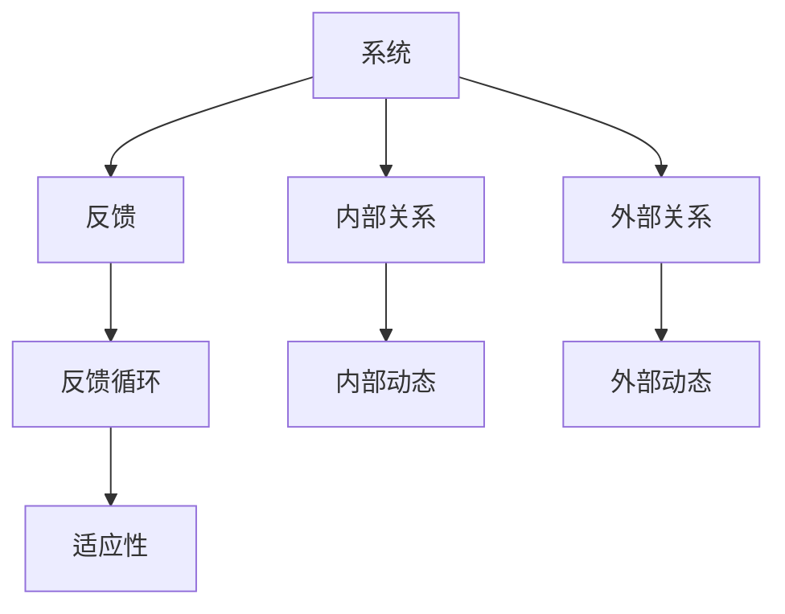

                 

# 用系统思考解决复杂问题

## 1. 背景介绍

在当今快速变化的技术环境中，如何有效地解决复杂问题已成为各行业关注的焦点。无论是在软件开发、产品管理还是项目管理中，都面临着各种复杂的挑战。例如，如何处理大规模的数据集、如何优化软件架构、如何管理多个项目并确保它们的成功交付等。这些问题往往需要多方面的专业知识、跨领域的合作和持续的创新，这就要求我们采用一种系统化的思维方式来处理这些问题。

系统思考（Systems Thinking）是一种综合考虑各个部分相互关系的思维方式，它强调理解复杂系统如何运作，以及如何通过改变系统的一部分来影响整个系统的行为。在信息技术领域，系统思考已经成为解决复杂问题的重要工具。本文将详细探讨系统思考的基本概念、其原理与架构，以及其在解决复杂问题中的应用。

## 2. 核心概念与联系

### 2.1 核心概念概述

系统思考是一种综合考虑系统内部各部分相互作用关系的思维方式。它强调通过改变系统的一部分来影响整个系统，从而找到问题的根源并解决问题。系统思考的基本概念包括以下几个方面：

- **系统**：系统是相互关联、相互作用的元素的集合，它可以是自然系统、社会系统或人造系统。
- **反馈**：反馈是指系统内部或系统与其他系统之间传递的信息。
- **反馈循环**：反馈循环是系统中信息传递的闭环，它影响系统的稳定性和动态行为。
- **适应性**：适应性是指系统在面对变化时能够自我调整的能力。

这些概念通过反馈循环相互作用，形成系统的动态行为。系统思考的目的是通过理解这些动态关系，找到解决系统问题的有效方法。

### 2.2 核心概念原理和架构的 Mermaid 流程图

这个图展示了系统、反馈、反馈循环和适应性之间的关系。系统由内部关系和外部关系构成，内部动态和外部动态共同作用于系统的行为。反馈是系统内部的信息传递机制，反馈循环则是信息传递的闭环，影响系统的稳定性。适应性是指系统在面对变化时的调整能力。

## 3. 核心算法原理 & 具体操作步骤

### 3.1 算法原理概述

在系统思考中，我们关注的是整个系统的行为，而不仅仅是单个部分。通过系统思考，我们可以理解系统各部分之间的相互作用关系，找到影响系统行为的反馈循环，从而找到解决问题的有效方法。

在系统思考中，我们通常会采用以下步骤：

1. 识别系统：明确系统的边界，理解系统的各部分及其相互作用。
2. 分析反馈循环：识别系统中的反馈循环，理解它们如何影响系统的行为。
3. 识别适应性：识别系统中的适应性机制，理解系统如何调整以应对变化。
4. 设计干预策略：根据系统思考的结果，设计干预策略，以改变系统的行为。

### 3.2 算法步骤详解

1. **识别系统**：
   - 确定系统的边界：明确系统包括哪些元素和子系统，以及它们之间的关系。
   - 绘制系统图：通过系统图（System Map）可视化系统结构和关系。
   - 识别关键因素：确定系统中哪些因素对系统的行为有重要影响。

2. **分析反馈循环**：
   - 识别正反馈和负反馈：区分正反馈和负反馈，理解它们如何影响系统的稳定性。
   - 绘制反馈循环图：通过反馈循环图（Feedback Loop Map）可视化反馈循环的路径和影响。
   - 分析反馈循环对系统的影响：理解反馈循环如何影响系统的动态行为。

3. **识别适应性**：
   - 识别适应性机制：理解系统中的适应性机制，如调整、补偿、进化等。
   - 分析适应性机制的作用：理解适应性机制如何帮助系统应对变化。
   - 识别适应性限制：理解系统中的限制因素，如资源限制、信息限制等。

4. **设计干预策略**：
   - 确定干预目标：明确干预的目标和期望的结果。
   - 设计干预措施：根据系统思考的结果，设计干预措施。
   - 实施干预措施：在系统中实施干预措施，观察其对系统的影响。
   - 评估干预效果：评估干预措施的效果，并根据需要调整策略。

### 3.3 算法优缺点

#### 优点：

- **系统视角**：系统思考强调整体视角，可以帮助我们更全面地理解问题。
- **长期影响**：系统思考关注系统的长期动态行为，可以帮助我们预测未来的变化。
- **创新性**：系统思考鼓励创新，因为它允许我们从新的角度看待问题。

#### 缺点：

- **复杂性**：系统思考需要深入理解系统的动态行为，对于初学者来说可能较为复杂。
- **时间投入**：系统思考通常需要较多的时间进行分析和干预。
- **资源需求**：系统思考需要专业的工具和方法，如系统图、反馈循环图等，可能需要一定的资源投入。

### 3.4 算法应用领域

系统思考广泛应用于软件开发、项目管理、产品管理、组织管理等多个领域。以下是一些具体的应用场景：

1. **软件开发**：在系统思考的指导下，开发人员可以更好地理解系统架构，识别潜在的反馈循环，设计更具弹性的系统。
2. **项目管理**：系统思考可以帮助项目经理识别项目中的关键因素和反馈循环，优化项目管理流程，提高项目的成功率。
3. **产品管理**：通过系统思考，产品管理团队可以更好地理解市场需求，设计更符合用户需求的产品，提高产品竞争力。
4. **组织管理**：在系统思考的指导下，企业可以更好地理解组织内部各部分之间的关系，优化资源配置，提高组织效率。

## 4. 数学模型和公式 & 详细讲解 & 举例说明

### 4.1 数学模型构建

在系统思考中，我们通常不使用数学模型来描述系统的动态行为，而是采用图形化的方式（如系统图、反馈循环图）来可视化系统的结构和关系。然而，在某些情况下，我们也可以使用数学模型来描述系统的动态行为。

假设我们有一个简单的系统，其状态变量为 $x$，动态方程为：

$$
\frac{dx}{dt} = ax + b
$$

其中 $a$ 和 $b$ 是系统参数，$t$ 是时间。

### 4.2 公式推导过程

我们可以对这个动态方程进行求解，得到系统状态随时间的变化规律：

$$
x(t) = x_0 e^{at} + \frac{b}{a} (e^{at} - 1)
$$

其中 $x_0$ 是初始状态。

### 4.3 案例分析与讲解

假设我们有一个简单的生产系统，其产量 $y$ 受市场需求 $x$ 的影响，市场需求随时间变化：

$$
\frac{dx}{dt} = -kx + g(t)
$$

其中 $k$ 是市场需求衰减系数，$g(t)$ 是市场需求函数。

我们可以使用系统图和反馈循环图来分析系统的动态行为。通过系统图，我们可以明确系统的边界和各部分之间的关系，通过反馈循环图，我们可以识别系统的反馈循环，理解它们如何影响系统的稳定性。

## 5. 项目实践：代码实例和详细解释说明

### 5.1 开发环境搭建

在系统思考中，我们通常不依赖于特定的编程语言或框架，而是使用图形化工具来描述系统的结构和关系。常用的工具包括：

- **系统图工具**：如SysML、Archimate等，用于绘制系统的结构和关系图。
- **反馈循环图工具**：如Simulink、MATLAB等，用于模拟系统的动态行为。

### 5.2 源代码详细实现

由于系统思考主要依赖于图形化工具，因此这里不再提供具体的代码实现。

### 5.3 代码解读与分析

在系统思考中，我们通常不使用代码来解决问题，而是通过图形化工具来描述系统的结构和关系。因此，代码解读与分析不适用。

### 5.4 运行结果展示

由于系统思考主要依赖于图形化工具，因此这里不再提供具体的运行结果展示。

## 6. 实际应用场景

### 6.1 软件开发

在系统思考的指导下，软件开发人员可以更好地理解系统的架构，识别潜在的反馈循环，设计更具弹性的系统。例如，在微服务架构中，系统思考可以帮助开发人员识别服务之间的依赖关系，理解它们如何相互影响，从而设计更稳定、可扩展的系统。

### 6.2 项目管理

系统思考可以帮助项目经理识别项目中的关键因素和反馈循环，优化项目管理流程，提高项目的成功率。例如，在敏捷开发中，系统思考可以帮助项目经理理解各团队之间的相互作用，优化任务分配，提高团队协作效率。

### 6.3 产品管理

通过系统思考，产品管理团队可以更好地理解市场需求，设计更符合用户需求的产品，提高产品竞争力。例如，在用户需求分析中，系统思考可以帮助产品经理理解用户的行为模式，识别潜在的反馈循环，从而设计更符合用户需求的产品。

### 6.4 组织管理

在系统思考的指导下，企业可以更好地理解组织内部各部分之间的关系，优化资源配置，提高组织效率。例如，在组织变革中，系统思考可以帮助企业理解各部门的相互作用，优化资源配置，提高组织适应性。

## 7. 工具和资源推荐

### 7.1 学习资源推荐

以下是一些学习系统思考的优质资源：

1. **《系统思考导论》**：系统思考领域的经典著作，全面介绍了系统思考的基本概念和应用方法。
2. **《系统思考与实践》**：系统思考的实战指南，提供了丰富的案例和工具，帮助读者掌握系统思考的技巧。
3. **System Dynamics Modeling**：Simulink和MATLAB系统建模工具的官方文档，提供了系统建模的最佳实践。
4. **SysML官方文档**：SysML系统建模语言的官方文档，提供了系统建模的规范和方法。
5. **Archimate官方文档**：Archimate系统建模工具的官方文档，提供了系统建模的规范和方法。

### 7.2 开发工具推荐

在系统思考中，我们通常使用图形化工具来描述系统的结构和关系。以下是一些常用的系统建模工具：

- **SysML**：一种标准化的系统建模语言，用于描述系统的结构和关系。
- **Archimate**：一种流行的系统建模工具，支持多种系统模型和视图。
- **Simulink**：MATLAB中的一个工具箱，用于模拟系统的动态行为。
- **MATLAB**：一种数学计算和数据分析工具，支持多种数值计算和仿真功能。

### 7.3 相关论文推荐

以下是一些关于系统思考的经典论文：

1. **《系统思考：概念与实践》**：系统思考领域的奠基性论文，介绍了系统思考的基本概念和应用方法。
2. **《系统动态模型在组织变革中的应用》**：探讨了系统动态模型在组织变革中的作用，提供了实际案例和方法。
3. **《反馈循环与系统稳定性》**：讨论了反馈循环对系统稳定性的影响，提供了理论分析和实践指导。
4. **《系统思考与敏捷开发》**：探讨了系统思考在敏捷开发中的应用，提供了敏捷开发的系统思考方法。

## 8. 总结：未来发展趋势与挑战

### 8.1 研究成果总结

系统思考已经成为解决复杂问题的有力工具，在软件开发、项目管理、产品管理、组织管理等多个领域得到了广泛应用。通过系统思考，我们可以更好地理解系统的结构和动态行为，找到问题的根源并解决问题。未来，系统思考将继续发挥重要作用，成为解决复杂问题的核心方法。

### 8.2 未来发展趋势

系统思考的未来发展趋势包括：

1. **智能化**：随着人工智能技术的发展，系统思考可以与人工智能结合，提供更智能化的解决方案。
2. **可视化**：系统建模工具将越来越智能和易于使用，提供更直观、易于理解的系统视图。
3. **自适应性**：未来的系统建模工具将具有更高的自适应性，能够根据环境变化自动调整模型。
4. **跨领域应用**：系统思考将更广泛地应用于跨领域问题，如环境科学、公共卫生等。

### 8.3 面临的挑战

尽管系统思考已经取得了显著成果，但在实际应用中仍面临以下挑战：

1. **复杂性**：系统思考通常需要深入理解系统的动态行为，对于初学者来说可能较为复杂。
2. **资源需求**：系统建模工具和培训需要一定的资源投入。
3. **多学科融合**：系统思考需要跨学科的知识，如工程、管理、生物学等，这需要多学科的协同合作。

### 8.4 研究展望

未来的研究需要在以下几个方面寻求新的突破：

1. **智能化系统建模**：开发更智能、更易于使用的系统建模工具，提供更好的可视化支持。
2. **跨领域应用**：探索系统思考在更多领域的应用，如环境科学、公共卫生等。
3. **多学科融合**：加强多学科的合作，提供更全面的系统思考解决方案。

总之，系统思考已经成为解决复杂问题的有力工具。通过系统思考，我们可以更好地理解系统的结构和动态行为，找到问题的根源并解决问题。未来，系统思考将继续发挥重要作用，成为解决复杂问题的核心方法。

## 9. 附录：常见问题与解答

**Q1：系统思考与传统方法有什么区别？**

A: 系统思考是一种整体视角的方法，强调理解系统内部各部分之间的相互作用关系，找到问题的根源并解决问题。传统方法通常采用分而治之的思路，关注单个部分的独立行为。

**Q2：系统思考在软件开发中的应用有哪些？**

A: 系统思考在软件开发中的应用包括：理解系统架构，识别潜在的反馈循环，设计更具弹性的系统。例如，在微服务架构中，系统思考可以帮助开发人员识别服务之间的依赖关系，理解它们如何相互影响，从而设计更稳定、可扩展的系统。

**Q3：系统思考是否适用于所有问题？**

A: 系统思考适用于复杂问题，但并不适用于所有问题。对于一些简单的问题，传统方法可能更为适用。

**Q4：系统思考需要哪些资源？**

A: 系统思考通常需要专业的工具和方法，如系统图、反馈循环图等。这些工具可以帮助我们更好地理解系统的结构和关系。

**Q5：系统思考的学习资源有哪些？**

A: 系统思考的学习资源包括：《系统思考导论》、《系统思考与实践》、System Dynamics Modeling、SysML官方文档、Archimate官方文档等。

---

作者：禅与计算机程序设计艺术 / Zen and the Art of Computer Programming

