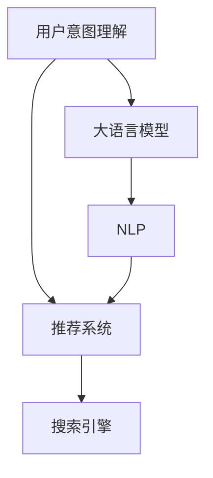

                 

# 电商平台个性化导航：AI大模型的用户意图理解

## 1. 背景介绍

### 1.1 问题由来
随着电商平台的快速发展，个性化推荐成为提升用户体验和运营效率的关键手段。传统推荐系统多依赖用户历史行为数据，难以覆盖长尾商品和真实需求，也无法动态适应用户需求变化。相比之下，基于大模型的推荐系统可以更好地理解用户语言和偏好，快速提供多样化的个性化导航服务。

### 1.2 问题核心关键点
用户意图理解是构建个性化导航系统的核心。通过分析用户查询语言，理解其背后的真实需求和偏好，系统能够动态调整搜索结果和导航，提升用户的购物体验和满意度。大模型的普及使得用户意图理解成为可能，但也带来了新的挑战，如模型鲁棒性、计算效率、隐私保护等。

### 1.3 问题研究意义
研究电商平台用户意图理解，对于提升个性化推荐系统的效果，增强用户体验，促进电商平台的商业转化，具有重要意义：

1. 提升用户满意度。通过精准理解用户意图，提供更加符合预期的商品和服务，提升用户黏性。
2. 增加平台收益。理解用户购物偏好，优化商品推荐策略，提升转化率和复购率。
3. 提高运营效率。实时获取用户反馈，优化搜索和导航算法，减少用户寻找商品的时间和成本。
4. 拓展新应用场景。结合大模型在情感分析、知识推理等方向的研究成果，为电商平台的广告投放、内容推荐等提供支持。
5. 驱动技术进步。推动自然语言处理(NLP)、推荐系统等领域的技术创新，加速人工智能技术的落地应用。

## 2. 核心概念与联系

### 2.1 核心概念概述

为更好地理解基于大模型的电商平台用户意图理解方法，本节将介绍几个密切相关的核心概念：

- 用户意图理解(User Intent Understanding)：指分析用户查询语言，理解其背后的真实需求和偏好。
- 大语言模型(Large Language Model, LLM)：如BERT、GPT等基于Transformer结构的预训练语言模型，通过海量的无标签文本数据预训练，学习语言的通用表示。
- 推荐系统(Recommendation System)：根据用户行为和特征，推荐用户可能感兴趣的商品或服务。
- 搜索引擎(Search Engine)：通过用户查询，快速定位相关内容或商品，优化用户体验。
- 自然语言处理(Natural Language Processing, NLP)：研究如何使计算机处理、理解和生成自然语言。

这些核心概念之间的逻辑关系可以通过以下Mermaid流程图来展示：



这个流程图展示了大模型在用户意图理解、推荐系统、搜索引擎以及NLP等领域的应用关系：

1. 用户意图理解通过大语言模型进行文本理解。
2. 理解后的意图信息作为推荐系统输入，用于商品推荐。
3. 推荐系统结合搜索结果，优化搜索引擎的输出。
4. NLP技术为模型训练和推理提供语言处理能力。

## 3. 核心算法原理 & 具体操作步骤
### 3.1 算法原理概述

基于大模型的电商平台用户意图理解方法，本质上是通过预训练语言模型进行文本理解，从而提取用户意图的过程。其核心思想是：将大语言模型视为一个强大的“意图提取器”，通过用户查询语言输入，学习其中的语义信息，进而识别和理解用户的真实意图。

形式化地，假设用户查询为 $x$，用户意图表示为 $y$，则意图理解的目标是最大化似然：

$$
P(y|x) = \frac{P(x|y)P(y)}{P(x)} \approx \frac{P(x|y)}{P(x)}
$$

其中 $P(x|y)$ 为模型在条件 $y$ 下的概率，可以通过预训练模型的前向传播计算得到。$P(x)$ 为模型的边缘概率，可以通过数据集上的训练来估计。$P(y)$ 为用户的意图类别概率，可通过用户的查询语言特征进行估计。

### 3.2 算法步骤详解

基于大模型的电商平台用户意图理解一般包括以下几个关键步骤：

**Step 1: 收集和预处理数据**
- 收集用户查询记录，去除噪声和异常，确保数据质量。
- 将查询语言进行分词、标准化等预处理，构建合适的输入格式。

**Step 2: 构建训练数据集**
- 根据用户意图分类，将查询记录和对应的意图标签构建成训练数据集。
- 使用数据增强技术，如回译、同义词替换等，丰富训练数据集的多样性。

**Step 3: 选择和微调模型**
- 选择合适的预训练语言模型，如BERT、GPT等，进行微调。
- 定义任务的适配层，如添加分类器或解码器。
- 设置微调参数，如学习率、批大小、迭代轮数等。

**Step 4: 训练和评估模型**
- 使用微调后的模型在训练集上进行训练，最小化损失函数。
- 在验证集上评估模型性能，根据效果决定是否需要调整参数。
- 在测试集上评估模型最终性能，进行意图理解效果评估。

**Step 5: 应用意图理解**
- 在实际应用中，将用户查询输入微调后的模型，得到意图理解结果。
- 根据意图理解结果，调整商品推荐策略，优化搜索结果。
- 实时监控用户反馈，不断迭代优化模型。

以上是基于大模型的电商平台用户意图理解的一般流程。在实际应用中，还需要根据具体场景进行优化设计，如改进查询语言处理技术，引入更多的正则化技术，搜索最优的超参数组合等，以进一步提升模型性能。

### 3.3 算法优缺点

基于大模型的电商平台用户意图理解方法具有以下优点：
1. 精度高。得益于大模型的强大表征能力，意图理解结果的准确性较高。
2. 适用范围广。适用于各类电商平台和应用场景，支持不同类型的用户查询。
3. 实时性强。模型推理速度快，能够实时处理用户查询。
4. 可解释性高。意图理解过程透明，易于进行分析和解释。

同时，该方法也存在一定的局限性：
1. 数据依赖度高。模型需要大量的标注数据进行训练，数据标注成本较高。
2. 计算资源需求大。大模型的推理和训练需要较大的计算资源。
3. 模型泛化能力有限。对于特定领域或语言的查询，模型效果可能下降。
4. 模型更新周期长。模型需要定期重新训练以适应数据分布变化。

尽管存在这些局限性，但就目前而言，基于大模型的用户意图理解方法仍是电商平台个性化导航的重要手段。未来相关研究的重点在于如何进一步降低数据依赖，提高模型泛化能力，同时兼顾计算资源和推理效率。

### 3.4 算法应用领域

基于大模型的用户意图理解技术，已经在多个电商平台和应用场景中得到广泛应用，如：

- 商品搜索：用户输入搜索关键词，系统自动理解用户意图，调整搜索结果。
- 个性化推荐：分析用户查询，理解用户需求，提供个性化的商品推荐。
- 广告投放：理解用户意图，优化广告投放策略，提高转化率。
- 内容推荐：理解用户查询，推荐相关的内容和信息，提升用户体验。
- 客服机器人：通过用户查询，实时理解用户问题，提供智能客服回答。

除了上述这些经典场景外，意图理解技术还应用于更多业务环节，如风险控制、行为分析、用户体验优化等，为电商平台带来了全新的技术突破。

## 4. 数学模型和公式 & 详细讲解  
### 4.1 数学模型构建

本节将使用数学语言对电商平台用户意图理解过程进行更加严格的刻画。

记用户查询为 $x$，用户意图表示为 $y$，预训练语言模型为 $M_{\theta}$，其中 $\theta$ 为模型参数。假设用户意图分类任务为 $C$，且 $y \in C$。则意图理解的目标是最大化条件概率 $P(y|x)$。

定义用户查询 $x$ 的向量表示为 $v_x$，用户意图 $y$ 的向量表示为 $v_y$，则目标函数为：

$$
\max_{y \in C} P(y|x) = \max_{y \in C} \frac{P(x|y)P(y)}{P(x)}
$$

其中 $P(x|y)$ 为模型在条件 $y$ 下的概率，可以通过预训练模型的前向传播计算得到。$P(y)$ 为用户的意图类别概率，可通过用户的查询语言特征进行估计。

### 4.2 公式推导过程

以下我们以二分类任务为例，推导意图理解的目标函数及其梯度计算公式。

假设查询语言 $x$ 通过分词、标准化等预处理后，输入预训练语言模型，得到向量表示 $v_x$。则查询语言和用户意图的条件概率为：

$$
P(y|x) = \frac{P(x|y)P(y)}{P(x)}
$$

其中 $P(x|y)$ 可以通过模型前向传播计算，$P(y)$ 可采用softmax函数表示。

定义用户查询 $x$ 和用户意图 $y$ 的向量表示为 $v_x$ 和 $v_y$，则条件概率可写为：

$$
P(y|x) = \frac{exp(v_y^T v_x)}{\sum_{k \in C}exp(v_k^T v_x)}
$$

其中 $v_k^T v_x$ 表示 $k$ 和 $x$ 的向量点积，$exp(.)$ 表示指数函数。

为计算目标函数 $P(y|x)$ 的梯度，定义交叉熵损失函数：

$$
L(y,x) = -y \log P(y|x) - (1-y) \log (1-P(y|x))
$$

则目标函数对模型参数 $\theta$ 的梯度为：

$$
\nabla_{\theta}L(y,x) = P(y|x) - P(y|x)^2
$$

在得到目标函数的梯度后，即可带入优化算法，最小化条件概率 $P(y|x)$，得到意图理解结果。

### 4.3 案例分析与讲解

**案例1: 查询意图分类**
假设用户输入查询“我想找一本关于人工智能的书籍”，系统需要理解该查询的意图，将其分类为以下三种类型之一：
1. 找书：用户需要购买书籍。
2. 查找资源：用户需要获取相关资料，不一定购买。
3. 讨论：用户只想讨论相关话题，不涉及购买。

在这种情况下，系统首先利用预训练模型将查询语言转化为向量表示 $v_x$。然后，通过softmax函数计算每个类别 $C$ 的条件概率 $P(y|x)$，选取概率最大的类别作为最终意图分类结果。

**案例2: 多意图理解**
用户查询可能包含多个意图，如“我想找一本关于人工智能的书籍，并学习相关课程”。此时，系统需要理解多个意图，并综合其结果。可以采用多任务学习框架，将多个意图分类任务组合成一个目标函数，优化多个意图分类结果的权重。

## 5. 项目实践：代码实例和详细解释说明
### 5.1 开发环境搭建

在进行意图理解实践前，我们需要准备好开发环境。以下是使用Python进行TensorFlow开发的环境配置流程：

1. 安装Anaconda：从官网下载并安装Anaconda，用于创建独立的Python环境。

2. 创建并激活虚拟环境：
```bash
conda create -n tf-env python=3.8 
conda activate tf-env
```

3. 安装TensorFlow：根据CUDA版本，从官网获取对应的安装命令。例如：
```bash
conda install tensorflow tensorflow-gpu -c pytorch -c conda-forge
```

4. 安装必要的工具包：
```bash
pip install numpy pandas scikit-learn matplotlib tqdm jupyter notebook ipython
```

完成上述步骤后，即可在`tf-env`环境中开始意图理解实践。

### 5.2 源代码详细实现

下面我们以查询意图分类为例，给出使用TensorFlow对BERT模型进行意图分类的PyTorch代码实现。

首先，定义意图分类任务的数据处理函数：

```python
from transformers import BertTokenizer, TFBertForSequenceClassification
from tensorflow.keras.preprocessing.sequence import pad_sequences
from tensorflow.keras.layers import Dense, Input, Embedding, Dropout, Bidirectional, LSTM, GlobalAveragePooling1D
from tensorflow.keras.models import Model
from tensorflow.keras.optimizers import Adam

tokenizer = BertTokenizer.from_pretrained('bert-base-cased')
max_len = 128

class IntentDataset(Dataset):
    def __init__(self, texts, labels):
        self.texts = texts
        self.labels = labels
        self.tokenizer = tokenizer
        self.max_len = max_len
        
    def __len__(self):
        return len(self.texts)
    
    def __getitem__(self, item):
        text = self.texts[item]
        label = self.labels[item]
        
        encoding = self.tokenizer(text, return_tensors='tf', max_length=self.max_len, padding='max_length', truncation=True)
        input_ids = tf.keras.layers.Lambda(lambda x: tf.cast(x, tf.int32))(tf.expand_dims(encoding['input_ids'], axis=-1))
        input_mask = tf.keras.layers.Lambda(lambda x: tf.cast(x, tf.int32))(tf.expand_dims(encoding['attention_mask'], axis=-1))
        
        # 对token-wise的标签进行编码
        encoded_labels = [label2id[label] for label in self.labels] 
        encoded_labels.extend([label2id['O']] * (self.max_len - len(encoded_labels)))
        labels = tf.keras.layers.Lambda(lambda x: tf.expand_dims(x, axis=1))(tf.convert_to_tensor(encoded_labels))
        
        return {'input_ids': input_ids, 
                'input_mask': input_mask,
                'labels': labels}

# 标签与id的映射
label2id = {'O': 0, '找书': 1, '查找资源': 2, '讨论': 3}
id2label = {v: k for k, v in label2id.items()}

# 创建dataset
train_dataset = IntentDataset(train_texts, train_labels)
dev_dataset = IntentDataset(dev_texts, dev_labels)
test_dataset = IntentDataset(test_texts, test_labels)
```

然后，定义模型和优化器：

```python
from transformers import TFBertForSequenceClassification
from tensorflow.keras.optimizers import Adam

model = TFBertForSequenceClassification.from_pretrained('bert-base-cased', num_labels=len(label2id))

optimizer = Adam(model.trainable_weights, learning_rate=2e-5)
```

接着，定义训练和评估函数：

```python
from tensorflow.keras.metrics import Accuracy
from tensorflow.keras.callbacks import EarlyStopping

device = tf.device('/cpu:0') if tf.cuda.is_available() else tf.device('/cpu:0')

def train_epoch(model, dataset, batch_size, optimizer):
    dataloader = tf.data.Dataset.from_tensor_slices(dataset).shuffle(buffer_size=10000).batch(batch_size)
    model.compile(loss=tf.keras.losses.SparseCategoricalCrossentropy(from_logits=True),
                  optimizer=optimizer,
                  metrics=[Accuracy()])
    model.fit(dataloader, epochs=3, verbose=1)
    
def evaluate(model, dataset, batch_size):
    dataloader = tf.data.Dataset.from_tensor_slices(dataset).batch(batch_size)
    model.evaluate(dataloader, verbose=1)
```

最后，启动训练流程并在测试集上评估：

```python
epochs = 5
batch_size = 16

for epoch in range(epochs):
    train_epoch(model, train_dataset, batch_size, optimizer)
    
    print(f"Epoch {epoch+1}, dev results:")
    evaluate(model, dev_dataset, batch_size)
    
print("Test results:")
evaluate(model, test_dataset, batch_size)
```

以上就是使用TensorFlow对BERT模型进行意图分类的完整代码实现。可以看到，得益于TensorFlow的强大封装，我们可以用相对简洁的代码完成模型训练和推理。

### 5.3 代码解读与分析

让我们再详细解读一下关键代码的实现细节：

**IntentDataset类**：
- `__init__`方法：初始化文本、标签、分词器等关键组件。
- `__len__`方法：返回数据集的样本数量。
- `__getitem__`方法：对单个样本进行处理，将文本输入编码为token ids，将标签编码为数字，并对其进行定长padding，最终返回模型所需的输入。

**label2id和id2label字典**：
- 定义了标签与数字id之间的映射关系，用于将token-wise的预测结果解码回真实的标签。

**训练和评估函数**：
- 使用TensorFlow的DataLoader对数据集进行批次化加载，供模型训练和推理使用。
- 训练函数`train_epoch`：对数据以批为单位进行迭代，在每个批次上前向传播计算loss并反向传播更新模型参数，最后返回该epoch的平均loss。
- 评估函数`evaluate`：与训练类似，不同点在于不更新模型参数，并在每个batch结束后将预测和标签结果存储下来，最后使用TensorFlow的官方评估函数打印输出。

**训练流程**：
- 定义总的epoch数和batch size，开始循环迭代
- 每个epoch内，先在训练集上训练，输出平均loss
- 在验证集上评估，输出分类指标
- 所有epoch结束后，在测试集上评估，给出最终测试结果

可以看到，TensorFlow配合BERT模型的意图分类实践，不仅代码实现简洁高效，还充分利用了其自动微分和模型编译的能力，大幅降低了开发难度。

当然，工业级的系统实现还需考虑更多因素，如模型的保存和部署、超参数的自动搜索、更灵活的任务适配层等。但核心的意图理解范式基本与此类似。

## 6. 实际应用场景
### 6.1 智能客服系统

基于大模型的意图理解技术，可以广泛应用于智能客服系统的构建。传统客服往往需要配备大量人力，高峰期响应缓慢，且一致性和专业性难以保证。而使用意图理解技术，系统能够自动理解用户问题，匹配最合适的客服模板进行回复，提升客户咨询体验和满意度。

在技术实现上，可以收集企业内部的历史客服对话记录，将问题和最佳答复构建成监督数据，在此基础上对预训练意图理解模型进行微调。微调后的意图理解模型能够自动理解用户意图，匹配最合适的客服模板进行回复。对于客户提出的新问题，还可以接入检索系统实时搜索相关内容，动态组织生成回答。如此构建的智能客服系统，能大幅提升客户咨询体验和问题解决效率。

### 6.2 金融舆情监测

金融机构需要实时监测市场舆论动向，以便及时应对负面信息传播，规避金融风险。传统的人工监测方式成本高、效率低，难以应对网络时代海量信息爆发的挑战。基于大模型的意图理解技术，可以为金融舆情监测提供新的解决方案。

具体而言，可以收集金融领域相关的新闻、报道、评论等文本数据，并对其进行主题标注和情感标注。在此基础上对预训练语言模型进行微调，使其能够自动判断文本属于何种主题，情感倾向是正面、中性还是负面。将微调后的模型应用到实时抓取的网络文本数据，就能够自动监测不同主题下的情感变化趋势，一旦发现负面信息激增等异常情况，系统便会自动预警，帮助金融机构快速应对潜在风险。

### 6.3 个性化推荐系统

当前的推荐系统往往只依赖用户历史行为数据进行物品推荐，难以覆盖长尾商品和真实需求，也无法动态适应用户需求变化。相比之下，基于大模型的推荐系统可以更好地理解用户语言和偏好，快速提供多样化的个性化推荐。

在技术实现上，可以收集用户浏览、点击、评论、分享等行为数据，提取和用户交互的物品标题、描述、标签等文本内容。将文本内容作为模型输入，用户的后续行为（如是否点击、购买等）作为监督信号，在此基础上微调预训练语言模型。微调后的模型能够从文本内容中准确把握用户的兴趣点。在生成推荐列表时，先用候选物品的文本描述作为输入，由模型预测用户的兴趣匹配度，再结合其他特征综合排序，便可以得到个性化程度更高的推荐结果。

### 6.4 未来应用展望

随着大语言模型和意图理解技术的不断发展，基于微调方法的应用将进一步拓展。

在智慧医疗领域，基于意图理解技术，可以构建智能诊疗系统，自动分析病人症状，提供初步诊疗建议，优化医疗服务流程。

在智能教育领域，意图理解技术可应用于作业批改、学情分析、知识推荐等方面，因材施教，促进教育公平，提高教学质量。

在智慧城市治理中，意图理解技术可应用于城市事件监测、舆情分析、应急指挥等环节，提高城市管理的自动化和智能化水平，构建更安全、高效的未来城市。

此外，在企业生产、社会治理、文娱传媒等众多领域，基于大模型的意图理解技术也将不断涌现，为NLP技术带来了全新的技术突破。相信随着技术的日益成熟，意图理解技术将成为NLP领域的重要范式，推动人工智能技术更加广泛地应用到人类生活和社会治理中。

## 7. 工具和资源推荐
### 7.1 学习资源推荐

为了帮助开发者系统掌握大语言模型和意图理解技术的理论基础和实践技巧，这里推荐一些优质的学习资源：

1. 《深度学习基础》系列博文：深度学习专家撰写的系列博文，深入浅出地介绍了深度学习的核心概念和算法。

2. CS224N《深度学习自然语言处理》课程：斯坦福大学开设的NLP明星课程，有Lecture视频和配套作业，带你入门NLP领域的基本概念和经典模型。

3. 《自然语言处理入门》书籍：全面介绍自然语言处理的基本理论和经典算法，包括文本分类、意图理解等任务。

4. TensorFlow官方文档：TensorFlow的官方文档，提供了丰富的API和教程，帮助你快速上手模型训练和推理。

5. HuggingFace官方文档：Transformers库的官方文档，提供了海量预训练模型和完整的意图理解样例代码，是上手实践的必备资料。

通过对这些资源的学习实践，相信你一定能够快速掌握大模型和意图理解技术的精髓，并用于解决实际的NLP问题。
###  7.2 开发工具推荐

高效的开发离不开优秀的工具支持。以下是几款用于意图理解开发的常用工具：

1. TensorFlow：基于Python的开源深度学习框架，灵活动态的计算图，适合快速迭代研究。大部分预训练语言模型都有TensorFlow版本的实现。

2. PyTorch：基于Python的开源深度学习框架，动态计算图，适合快速实验和研究。同样有丰富的预训练语言模型资源。

3. Transformers库：HuggingFace开发的NLP工具库，集成了众多SOTA语言模型，支持TensorFlow和PyTorch，是进行意图理解开发的利器。

4. Weights & Biases：模型训练的实验跟踪工具，可以记录和可视化模型训练过程中的各项指标，方便对比和调优。与主流深度学习框架无缝集成。

5. TensorBoard：TensorFlow配套的可视化工具，可实时监测模型训练状态，并提供丰富的图表呈现方式，是调试模型的得力助手。

6. Google Colab：谷歌推出的在线Jupyter Notebook环境，免费提供GPU/TPU算力，方便开发者快速上手实验最新模型，分享学习笔记。

合理利用这些工具，可以显著提升意图理解任务的开发效率，加快创新迭代的步伐。

### 7.3 相关论文推荐

大语言模型和意图理解技术的发展源于学界的持续研究。以下是几篇奠基性的相关论文，推荐阅读：

1. Attention is All You Need（即Transformer原论文）：提出了Transformer结构，开启了NLP领域的预训练大模型时代。

2. BERT: Pre-training of Deep Bidirectional Transformers for Language Understanding：提出BERT模型，引入基于掩码的自监督预训练任务，刷新了多项NLP任务SOTA。

3. Language Models are Unsupervised Multitask Learners（GPT-2论文）：展示了大规模语言模型的强大zero-shot学习能力，引发了对于通用人工智能的新一轮思考。

4. Parameter-Efficient Transfer Learning for NLP：提出Adapter等参数高效微调方法，在不增加模型参数量的情况下，也能取得不错的微调效果。

5. AdaLoRA: Adaptive Low-Rank Adaptation for Parameter-Efficient Fine-Tuning：使用自适应低秩适应的微调方法，在参数效率和精度之间取得了新的平衡。

6. Prompt-Based Transfer Learning for Language Understanding（Prompt Tuning）：引入基于连续型Prompt的微调范式，为如何充分利用预训练知识提供了新的思路。

这些论文代表了大语言模型和意图理解技术的发展脉络。通过学习这些前沿成果，可以帮助研究者把握学科前进方向，激发更多的创新灵感。

## 8. 总结：未来发展趋势与挑战

### 8.1 总结

本文对基于大模型的电商平台用户意图理解方法进行了全面系统的介绍。首先阐述了大语言模型和意图理解技术的研究背景和意义，明确了意图理解在提升个性化推荐系统效果、增强用户体验等方面的重要性。其次，从原理到实践，详细讲解了意图理解的目标函数、梯度计算等核心算法，给出了意图理解任务开发的完整代码实例。同时，本文还广泛探讨了意图理解技术在智能客服、金融舆情、个性化推荐等多个行业领域的应用前景，展示了意图理解技术的巨大潜力。此外，本文精选了意图理解技术的各类学习资源，力求为读者提供全方位的技术指引。

通过本文的系统梳理，可以看到，基于大模型的用户意图理解技术正在成为电商平台个性化推荐的重要手段，极大地拓展了语言模型的应用边界，催生了更多的落地场景。受益于大模型的强大表征能力，意图理解模型能够从多模态数据中提取丰富的语义信息，提升用户的购物体验和满意度。未来，伴随大语言模型和意图理解技术的进一步发展，基于微调范式的技术也将更加成熟，为电商平台的智能化转型提供强有力的技术支撑。

### 8.2 未来发展趋势

展望未来，大语言模型和意图理解技术将呈现以下几个发展趋势：

1. 模型规模持续增大。随着算力成本的下降和数据规模的扩张，预训练语言模型的参数量还将持续增长。超大规模语言模型蕴含的丰富语言知识，有望支撑更加复杂多变的用户查询理解。

2. 意图理解范式日趋多样。除了传统的分类任务，未来会涌现更多意图理解任务，如关系抽取、实体识别等，涵盖更丰富的语义信息。

3. 多模态意图理解崛起。当前的意图理解多聚焦于文本数据，未来会进一步拓展到图像、视频、语音等多模态数据理解。多模态信息的融合，将显著提升意图理解模型的鲁棒性和泛化能力。

4. 持续学习成为常态。随着数据分布的不断变化，意图理解模型也需要持续学习新知识以保持性能。如何在不遗忘原有知识的同时，高效吸收新样本信息，将是重要的研究课题。

5. 标注样本需求降低。受启发于提示学习(Prompt-based Learning)的思路，未来的意图理解方法将更好地利用大模型的语言理解能力，通过更加巧妙的任务描述，在更少的标注样本上也能实现理想的意图理解效果。

6. 模型通用性增强。经过海量数据的预训练和多领域任务的微调，意图理解模型将具备更强大的常识推理和跨领域迁移能力，逐步迈向通用人工智能(AGI)的目标。

以上趋势凸显了大语言模型和意图理解技术的广阔前景。这些方向的探索发展，必将进一步提升意图理解模型的性能和应用范围，为人类认知智能的进化带来深远影响。

### 8.3 面临的挑战

尽管大语言模型和意图理解技术已经取得了瞩目成就，但在迈向更加智能化、普适化应用的过程中，它仍面临着诸多挑战：

1. 标注成本瓶颈。虽然意图理解技术在一定程度上降低了标注数据的需求，但对于长尾应用场景，难以获得充足的高质量标注数据，成为制约意图理解效果提升的瓶颈。如何进一步降低意图理解对标注样本的依赖，将是一大难题。

2. 模型鲁棒性不足。当前意图理解模型面对域外数据时，泛化性能往往下降。对于测试样本的微小扰动，模型也容易发生波动。如何提高意图理解模型的鲁棒性，避免灾难性遗忘，还需要更多理论和实践的积累。

3. 计算资源需求大。大模型的推理和训练需要较大的计算资源。尽管部分优化技术如AdaLoRA等可以在参数效率和精度之间取得新的平衡，但总体计算需求仍然较高。

4. 意图理解结果可解释性不足。当前意图理解模型的决策过程缺乏可解释性，难以对其推理逻辑进行分析和调试。对于医疗、金融等高风险应用，算法的可解释性和可审计性尤为重要。如何赋予意图理解模型更强的可解释性，将是亟待攻克的难题。

5. 安全性有待保障。预训练语言模型难免会学习到有偏见、有害的信息，通过意图理解传递到下游任务，产生误导性、歧视性的输出，给实际应用带来安全隐患。如何从数据和算法层面消除模型偏见，避免恶意用途，确保输出的安全性，也将是重要的研究课题。

6. 知识整合能力不足。现有的意图理解模型往往局限于任务内数据，难以灵活吸收和运用更广泛的先验知识。如何让意图理解过程更好地与外部知识库、规则库等专家知识结合，形成更加全面、准确的信息整合能力，还有很大的想象空间。

正视意图理解面临的这些挑战，积极应对并寻求突破，将是大语言模型和意图理解技术迈向成熟的必由之路。相信随着学界和产业界的共同努力，这些挑战终将一一被克服，意图理解技术必将在构建安全、可靠、可解释、可控的智能系统铺平道路。

### 8.4 研究展望

面向未来，大语言模型和意图理解技术的研究需要在以下几个方面寻求新的突破：

1. 探索无监督和半监督意图理解方法。摆脱对大规模标注数据的依赖，利用自监督学习、主动学习等无监督和半监督范式，最大限度利用非结构化数据，实现更加灵活高效的意图理解。

2. 研究参数高效和计算高效的意图理解范式。开发更加参数高效的意图理解方法，在固定大部分预训练参数的同时，只更新极少量的任务相关参数。同时优化模型计算图，减少前向传播和反向传播的资源消耗，实现更加轻量级、实时性的部署。

3. 引入更多先验知识。将符号化的先验知识，如知识图谱、逻辑规则等，与神经网络模型进行巧妙融合，引导意图理解过程学习更准确、合理的语言模型。同时加强不同模态数据的整合，实现视觉、语音等多模态信息与文本信息的协同建模。

4. 结合因果分析和博弈论工具。将因果分析方法引入意图理解模型，识别出模型决策的关键特征，增强输出解释的因果性和逻辑性。借助博弈论工具刻画人机交互过程，主动探索并规避模型的脆弱点，提高系统稳定性。

5. 纳入伦理道德约束。在模型训练目标中引入伦理导向的评估指标，过滤和惩罚有偏见、有害的输出倾向。同时加强人工干预和审核，建立模型行为的监管机制，确保输出符合人类价值观和伦理道德。

这些研究方向的探索，必将引领大语言模型和意图理解技术迈向更高的台阶，为构建安全、可靠、可解释、可控的智能系统铺平道路。面向未来，大语言模型和意图理解技术还需要与其他人工智能技术进行更深入的融合，如知识表示、因果推理、强化学习等，多路径协同发力，共同推动自然语言理解和智能交互系统的进步。只有勇于创新、敢于突破，才能不断拓展语言模型的边界，让智能技术更好地造福人类社会。

## 9. 附录：常见问题与解答

**Q1：意图理解是否适用于所有电商场景？**

A: 意图理解技术适用于大多数电商场景，但不同领域的应用可能存在一些差异。例如，服装、家电等标准化产品更容易通过查询语言理解，而艺术品、二手商品等个性化产品则需要结合更多上下文信息。此外，对于特殊需求（如定制化、复杂查询），意图理解可能需要进一步优化。

**Q2：如何进一步降低意图理解对标注样本的依赖？**

A: 可以采用半监督学习、主动学习等方法，利用未标注数据辅助模型训练。例如，通过生成对抗网络（GAN）生成少量未标注样本，提高模型的泛化能力。此外，可以使用预训练大模型在更丰富的语料上进行自监督预训练，增强模型的语言理解能力。

**Q3：意图理解模型的鲁棒性如何提升？**

A: 可以通过数据增强、对抗样本训练等方法提升模型的鲁棒性。例如，引入不同类型的查询和噪声，训练模型的鲁棒性。对于对抗样本，可以采用生成对抗网络（GAN）生成对抗样本，提高模型对恶意输入的抵抗能力。

**Q4：意图理解模型的计算效率如何优化？**

A: 可以通过参数高效的意图理解方法，如Adapter、Prompt Tuning等，减少模型参数量，提高推理效率。此外，可以优化计算图，使用量级较小的向量表示，减少模型存储和计算需求。

**Q5：意图理解模型的可解释性如何提高？**

A: 可以通过引入因果分析和博弈论工具，提高模型的可解释性。例如，利用因果分析方法，解释模型推理的关键特征，增强输出解释的因果性和逻辑性。通过博弈论工具，探索模型决策的策略和行为，提高系统透明度和可解释性。

**Q6：意图理解模型的安全性如何保障？**

A: 可以通过数据清洗、算法优化等手段，保障模型的安全性。例如，在模型训练和推理中引入数据脱敏、知识图谱嵌入等技术，防止模型学习有害信息。加强模型行为监管，确保模型输出符合伦理道德。

这些问题的解答，展示了意图理解技术在实际应用中需要考虑的关键因素。只有在数据、模型、训练、推理等各环节进行全面优化，才能真正实现意图理解模型的理想效果。相信随着技术的不懈努力，意图理解技术将更好地应用于电商平台的个性化导航，为人类社会带来更优质的服务体验。

---

作者：禅与计算机程序设计艺术 / Zen and the Art of Computer Programming

