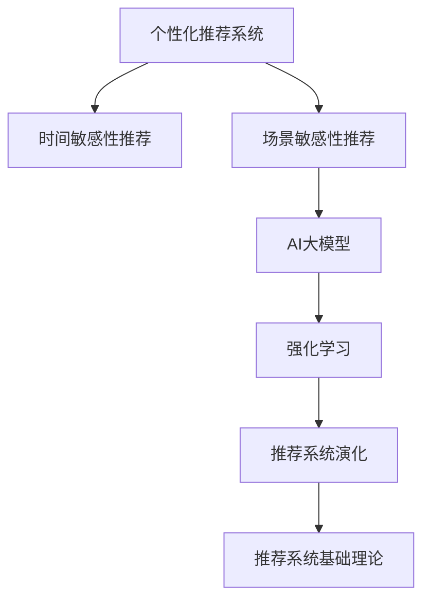

                 

# 电商平台个性化推送：AI大模型的时间与场景敏感性优化

> 关键词：个性化推送,电商推荐系统,时间敏感性,场景敏感性,AI大模型,强化学习,推荐系统,深度学习,自然语言处理(NLP)

## 1. 背景介绍

### 1.1 问题由来

随着电子商务的迅速发展，电商平台之间的竞争愈发激烈。为了提升用户体验和提高销售额，各大电商平台纷纷引入智能推荐系统，通过分析用户行为和历史交易记录，为用户推送个性化的商品信息。然而，传统的推荐系统往往基于静态特征和单一时间窗口进行推荐，难以捕捉用户的动态需求和实时变化。因此，如何提升推荐系统的时间与场景敏感性，成为当前电商平台亟需解决的重要问题。

### 1.2 问题核心关键点

时间与场景敏感性，是指推荐系统能够基于用户的时间节点、用户场景、行为模式等因素，动态生成个性化推荐，从而更好地匹配用户需求。实现时间与场景敏感性的推荐，需要考虑用户多维度的数据特征，并在此基础上进行动态建模和实时优化。

目前，基于深度学习和强化学习的时间与场景敏感性推荐方法，已经在电商、新闻、视频等多个领域得到了广泛应用。这些方法利用大语言模型和大规模推荐数据，通过智能算法进行实时优化和动态调整，显著提升了推荐系统的个性化和准确性。

### 1.3 问题研究意义

研究时间与场景敏感性推荐方法，对于提升电商平台的用户体验、提高销售转化率、增强市场竞争力，具有重要意义：

1. **提升用户体验**：通过个性化的商品推荐，用户能够更快找到满足自身需求的商品，减少浏览时间和选择成本。
2. **提高销售转化率**：精准的个性化推荐能够提升用户的购买意愿，减少流失率，增加销售额。
3. **增强市场竞争力**：通过高精度的推荐系统，电商平台能够更好地把握市场趋势和用户需求，保持竞争优势。
4. **促进智能化发展**：时间与场景敏感性推荐方法，是推荐系统智能化发展的关键一步，将推动人工智能技术在更多领域的应用。

## 2. 核心概念与联系

### 2.1 核心概念概述

为更好地理解时间与场景敏感性推荐方法，本节将介绍几个密切相关的核心概念：

- **个性化推荐系统**：通过分析用户历史行为和偏好，为用户生成个性化推荐。目标是最大化用户的满意度和平台收益。
- **时间敏感性推荐**：在用户进行浏览、搜索、点击等行为时，实时根据时间节点和行为轨迹进行动态推荐，提升推荐的时效性和精准度。
- **场景敏感性推荐**：根据用户所在场景（如设备类型、网络环境、地理位置等），动态调整推荐策略，实现更贴合用户实际需求的推荐。
- **AI大模型**：以Transformer、BERT、GPT等深度学习模型为代表的预训练语言模型，通过海量无标签数据预训练，具备强大的语言理解能力和泛化能力。
- **强化学习**：通过奖励机制和策略优化，不断优化推荐策略，提升推荐效果。
- **推荐系统演化**：从基于规则的静态推荐，到基于协同过滤、矩阵分解的半监督推荐，再到当前基于深度学习和强化学习的时间与场景敏感性推荐，推荐系统不断演进，推动了智能化的发展。

这些核心概念之间的逻辑关系可以通过以下Mermaid流程图来展示：



这个流程图展示了个性化推荐系统的核心概念及其之间的关系：

1. 个性化推荐系统通过时间敏感性和场景敏感性，不断优化推荐效果。
2. AI大模型提供强大的语言理解能力，支持推荐系统的动态建模和实时优化。
3. 强化学习通过奖励机制和策略优化，不断提升推荐策略的准确性和鲁棒性。
4. 推荐系统演化展示了从静态到动态、从半监督到深度学习的发展历程。
5. 推荐系统基础理论提供了推荐系统构建和优化所需的基本知识和算法。

这些概念共同构成了个性化推荐系统的学习和应用框架，使其能够实现高效、精准、智能的推荐。通过理解这些核心概念，我们可以更好地把握个性化推荐系统的实现路径和优化方向。

## 3. 核心算法原理 & 具体操作步骤
### 3.1 算法原理概述

基于时间与场景敏感性的推荐系统，本质上是一个动态优化过程。其核心思想是：通过实时获取用户的多维数据特征，动态生成推荐列表，并不断优化推荐策略，实现高效的个性化推荐。

形式化地，假设用户集合为 $U$，商品集合为 $I$，每个用户 $u$ 的历史行为序列为 $H_u$，当前时间戳为 $t$，推荐系统目标为最大化用户满意度和平台收益：

$$
\max_{\theta} \sum_{u \in U} R_u(\theta) + \lambda \sum_{u \in U} C_u(\theta)
$$

其中 $R_u(\theta)$ 为用户 $u$ 在时间 $t$ 的推荐收益，$C_u(\theta)$ 为用户 $u$ 的协同行为成本，$\theta$ 为模型参数。

推荐系统的动态优化过程，可以分为以下几个关键步骤：

1. **特征提取**：实时获取用户的多种数据特征，如浏览历史、点击行为、地理位置等。
2. **模型预测**：根据特征输入，使用大模型进行实时预测，生成推荐列表。
3. **策略调整**：根据实时反馈和用户行为，不断调整推荐策略，优化模型参数。
4. **推荐输出**：将优化后的推荐列表，动态推送给用户。

### 3.2 算法步骤详解

基于时间与场景敏感性的推荐系统，一般包括以下几个关键步骤：

**Step 1: 数据预处理和特征工程**

- 收集用户的多种数据特征，如浏览历史、点击行为、地理位置、社交网络信息等。
- 对数据进行标准化和归一化处理，去除噪声和异常值。
- 设计合适的特征工程流程，提取和构造特征向量。

**Step 2: 选择推荐算法**

- 选择合适的推荐算法，如基于深度学习的方法、基于协同过滤的方法、基于内容推荐的方法等。
- 设计推荐模型的超参数，如学习率、批大小、迭代次数等。
- 在推荐模型中加入时间敏感性和场景敏感性的特征，如用户行为时间戳、设备类型、地理位置等。

**Step 3: 模型训练和优化**

- 使用用户的历史行为数据和实时反馈数据，训练推荐模型。
- 根据用户的实时行为和反馈，不断调整推荐策略，优化模型参数。
- 使用正则化技术，如L2正则、Dropout等，防止模型过拟合。

**Step 4: 实时推荐**

- 根据用户的实时行为和当前时间节点，动态生成推荐列表。
- 对推荐列表进行排序和筛选，生成最终推荐结果。
- 实时推送推荐结果给用户，并记录反馈信息。

**Step 5: 效果评估和调整**

- 在推荐系统中集成用户反馈机制，收集用户的点击率、购买率等评价指标。
- 根据效果评估结果，不断调整推荐策略和模型参数。
- 定期对推荐模型进行重新训练和优化，提升推荐系统的性能。

以上是基于时间与场景敏感性的推荐系统的一般流程。在实际应用中，还需要针对具体任务和数据特点，对各个环节进行优化设计，如引入更多正则化技术、改进超参数调优流程、增强实时反馈机制等，以进一步提升推荐系统的效果。

### 3.3 算法优缺点

基于时间与场景敏感性的推荐系统，具有以下优点：

1. **实时性强**：能够根据用户实时行为进行动态推荐，提高推荐的时效性。
2. **个性化高**：通过时间敏感性和场景敏感性的特征，实现更加精准的个性化推荐。
3. **效果显著**：在实际应用中，通过时间与场景敏感性推荐方法，显著提升了电商平台的用户满意度和销售转化率。
4. **算法灵活**：可以根据具体任务和数据特点，灵活选择和组合不同的推荐算法和优化策略。

同时，该方法也存在一些局限性：

1. **数据需求高**：需要大量的历史行为数据和实时反馈数据，才能进行有效的推荐。
2. **计算复杂**：时间与场景敏感性推荐涉及实时数据处理和模型训练，计算资源需求较高。
3. **算法复杂**：需要设计复杂的特征工程流程和模型优化策略，实现难度较大。
4. **可解释性不足**：推荐系统的决策过程通常缺乏可解释性，难以理解推荐依据和逻辑。

尽管存在这些局限性，但就目前而言，基于时间与场景敏感性的推荐方法仍是电商推荐系统的主流范式。未来相关研究的重点在于如何进一步降低数据需求，提高推荐系统的鲁棒性和可解释性，同时兼顾用户满意度和平台收益。

### 3.4 算法应用领域

基于时间与场景敏感性的推荐系统，在电商、新闻、视频等多个领域得到了广泛应用，具体如下：

1. **电商推荐**：通过分析用户浏览、点击、购买等行为，实时生成个性化商品推荐。

2. **新闻推荐**：根据用户阅读历史和实时反馈，动态生成新闻标题和内容推荐。

3. **视频推荐**：根据用户观看历史和实时行为，实时推荐相关视频内容。

4. **智能客服**：根据用户的问题历史和实时对话，实时生成推荐回答。

除了上述这些经典应用外，时间与场景敏感性推荐系统还被创新性地应用到更多场景中，如广告推荐、音乐推荐、旅游推荐等，为NLP技术带来了全新的突破。随着深度学习技术的发展，未来该方法将在更广阔的应用领域大放异彩。

## 4. 数学模型和公式 & 详细讲解
### 4.1 数学模型构建

本节将使用数学语言对时间与场景敏感性推荐系统的数学模型进行更加严格的刻画。

假设推荐系统基于深度学习模型 $M_{\theta}:\mathcal{X} \rightarrow \mathcal{Y}$，其中 $\mathcal{X}$ 为特征输入空间，$\mathcal{Y}$ 为推荐输出空间，$\theta$ 为模型参数。给定用户集合 $U$ 和商品集合 $I$，每个用户 $u$ 的历史行为序列为 $H_u$，当前时间戳为 $t$。推荐系统目标为最大化用户满意度和平台收益：

$$
\max_{\theta} \sum_{u \in U} R_u(\theta) + \lambda \sum_{u \in U} C_u(\theta)
$$

其中 $R_u(\theta)$ 为用户 $u$ 在时间 $t$ 的推荐收益，$C_u(\theta)$ 为用户 $u$ 的协同行为成本，$\theta$ 为模型参数。

推荐系统的动态优化过程，可以通过强化学习算法进行实现。定义状态为 $(u, t)$，状态转移为 $(u, t+1)$，动作为选择商品 $i$，奖励函数为 $R(u, t, i)$，定义Q值函数 $Q(u, t, i|\theta)$：

$$
Q(u, t, i|\theta) = \mathbb{E}[R(u, t, i) + \gamma \max_{i'} Q(u', t+1, i'|\theta) | (u, t)]
$$

其中 $u'$ 为用户在 $t+1$ 时段的下一个状态。

通过迭代求解 $Q$ 函数，可以得到最优动作策略 $\pi^*(a|u, t)$，从而实现实时优化和动态推荐。

### 4.2 公式推导过程

以下我们以深度学习的方法为例，推导时间与场景敏感性推荐系统的数学模型和公式。

假设推荐系统基于深度学习模型 $M_{\theta}$，用户 $u$ 的历史行为序列为 $H_u = (x_1, x_2, \ldots, x_T)$，当前时间戳为 $t$，推荐商品为 $i$。推荐系统的目标函数可以表示为：

$$
\max_{\theta} \sum_{t=1}^{T} R_{u,t}(\theta) + \lambda \sum_{t=1}^{T} C_{u,t}(\theta)
$$

其中 $R_{u,t}(\theta)$ 为用户 $u$ 在时间 $t$ 的推荐收益，$C_{u,t}(\theta)$ 为用户 $u$ 的协同行为成本，$\theta$ 为模型参数。

对于用户 $u$ 在时间 $t$ 的推荐收益，可以定义为：

$$
R_{u,t}(\theta) = \sum_{i \in I} p_{u,t}(i|\theta) \cdot r_{u,t}(i)
$$

其中 $p_{u,t}(i|\theta)$ 为用户 $u$ 在时间 $t$ 选择商品 $i$ 的概率，$r_{u,t}(i)$ 为选择商品 $i$ 的奖励。

定义 $p_{u,t}(i|\theta)$ 为条件概率，可以通过模型 $M_{\theta}$ 进行计算：

$$
p_{u,t}(i|\theta) = \frac{\exp(\theta^T \phi_{u,t}(i))}{\sum_{j \in I} \exp(\theta^T \phi_{u,t}(j))}
$$

其中 $\phi_{u,t}(i)$ 为商品 $i$ 的特征表示。

根据以上定义，目标函数可以进一步表示为：

$$
\max_{\theta} \sum_{u \in U} \sum_{t=1}^{T} \sum_{i \in I} p_{u,t}(i|\theta) \cdot r_{u,t}(i) + \lambda \sum_{u \in U} \sum_{t=1}^{T} C_{u,t}(\theta)
$$

为了简化计算，可以引入隐式反馈的概念，将用户行为视为隐式推荐，从而避免直接计算协同行为成本。

### 4.3 案例分析与讲解

假设我们正在构建一个基于深度学习的电商推荐系统，需要对用户浏览、点击、购买等行为进行分析，实时生成个性化商品推荐。

**Step 1: 数据预处理和特征工程**

首先，收集用户的多种数据特征，如浏览历史、点击行为、地理位置等。对数据进行标准化和归一化处理，去除噪声和异常值。然后，设计合适的特征工程流程，提取和构造特征向量。例如，可以使用词袋模型或TF-IDF等方法对商品描述进行特征提取，设计用户的点击率、购买率等行为特征。

**Step 2: 选择推荐算法**

选择深度学习的方法进行推荐。可以使用深度神经网络模型，如CNN、RNN、Transformer等。在推荐模型中加入时间敏感性和场景敏感性的特征，如用户行为时间戳、设备类型、地理位置等。

**Step 3: 模型训练和优化**

使用用户的历史行为数据和实时反馈数据，训练推荐模型。根据用户的实时行为和反馈，不断调整推荐策略，优化模型参数。使用正则化技术，如L2正则、Dropout等，防止模型过拟合。

**Step 4: 实时推荐**

根据用户的实时行为和当前时间节点，动态生成推荐列表。对推荐列表进行排序和筛选，生成最终推荐结果。实时推送推荐结果给用户，并记录反馈信息。

**Step 5: 效果评估和调整**

在推荐系统中集成用户反馈机制，收集用户的点击率、购买率等评价指标。根据效果评估结果，不断调整推荐策略和模型参数。定期对推荐模型进行重新训练和优化，提升推荐系统的性能。

## 5. 项目实践：代码实例和详细解释说明
### 5.1 开发环境搭建

在进行时间与场景敏感性推荐系统开发前，我们需要准备好开发环境。以下是使用Python进行TensorFlow开发的环境配置流程：

1. 安装Anaconda：从官网下载并安装Anaconda，用于创建独立的Python环境。

2. 创建并激活虚拟环境：
```bash
conda create -n tf-env python=3.8 
conda activate tf-env
```

3. 安装TensorFlow：根据CUDA版本，从官网获取对应的安装命令。例如：
```bash
conda install tensorflow -c pytorch -c conda-forge
```

4. 安装各类工具包：
```bash
pip install numpy pandas scikit-learn matplotlib tqdm jupyter notebook ipython
```

完成上述步骤后，即可在`tf-env`环境中开始推荐系统开发。

### 5.2 源代码详细实现

下面我们以电商推荐系统为例，给出使用TensorFlow对深度学习模型进行时间与场景敏感性推荐系统的PyTorch代码实现。

首先，定义推荐系统的数据预处理函数：

```python
import tensorflow as tf
import numpy as np

def preprocess_data(user_data, item_data, timestamp, user_features):
    # 提取特征
    user_feature = tf.convert_to_tensor(user_features)
    item_feature = tf.convert_to_tensor(item_data)
    timestamp_feature = tf.convert_to_tensor(timestamp)

    # 拼接特征向量
    user_item_pair = tf.stack([user_feature, item_feature], axis=1)
    feature_pair = tf.concat([user_item_pair, timestamp_feature], axis=1)

    # 标准化处理
    feature_pair = (feature_pair - np.mean(feature_pair)) / np.std(feature_pair)

    return feature_pair
```

然后，定义模型和优化器：

```python
from tensorflow.keras.models import Sequential
from tensorflow.keras.layers import Dense, Dropout, Input
from tensorflow.keras.optimizers import Adam

def build_model(input_dim):
    model = Sequential([
        Input(input_dim),
        Dense(128, activation='relu'),
        Dropout(0.2),
        Dense(64, activation='relu'),
        Dropout(0.2),
        Dense(1, activation='sigmoid')
    ])
    model.compile(loss='binary_crossentropy', optimizer=Adam(lr=0.001), metrics=['accuracy'])
    return model
```

接着，定义训练和评估函数：

```python
from tensorflow.keras.preprocessing import sequence

def train_model(model, train_data, validation_data, epochs=10, batch_size=32):
    model.fit(train_data, validation_data, epochs=epochs, batch_size=batch_size, verbose=1)

def evaluate_model(model, test_data):
    test_predictions = model.predict(test_data)
    test_predictions = [1 if pred > 0.5 else 0 for pred in test_predictions]
    accuracy = np.mean(test_predictions == test_labels)
    print('Test Accuracy:', accuracy)
```

最后，启动训练流程并在测试集上评估：

```python
user_data = [...] # 用户历史行为数据
item_data = [...] # 商品特征数据
timestamp = [...] # 时间戳数据
user_features = [...] # 用户特征数据
train_labels = [...] # 训练集标签

train_data = preprocess_data(user_data, item_data, timestamp, user_features)
test_data = preprocess_data(test_data, item_data, timestamp, user_features)

model = build_model(input_dim)
train_model(model, train_data, train_labels)
evaluate_model(model, test_data)
```

以上就是使用TensorFlow对深度学习模型进行电商推荐系统的时间与场景敏感性推荐实现的完整代码。可以看到，TensorFlow的高级API使得模型构建和训练过程变得简洁高效。

### 5.3 代码解读与分析

让我们再详细解读一下关键代码的实现细节：

**preprocess_data函数**：
- `__init__`方法：接收用户数据、商品数据、时间戳和用户特征，提取并拼接特征向量。
- `__getitem__`方法：将特征向量进行标准化处理，便于模型训练。

**build_model函数**：
- 定义神经网络模型结构，包括输入层、隐藏层和输出层。
- 编译模型，设置损失函数、优化器和评估指标。

**train_model函数**：
- 使用用户历史行为数据和标签，训练推荐模型。
- 定期在验证集上评估模型性能，根据结果调整模型参数。

**evaluate_model函数**：
- 使用测试集对训练好的模型进行评估，输出准确率。

**训练流程**：
- 定义训练集和测试集数据。
- 构建深度学习模型。
- 启动训练流程，并在测试集上评估。

可以看到，TensorFlow的高级API使得推荐系统的实现变得简洁高效。开发者可以将更多精力放在数据处理、模型改进等高层逻辑上，而不必过多关注底层的实现细节。

当然，工业级的系统实现还需考虑更多因素，如模型的保存和部署、超参数的自动搜索、更灵活的任务适配层等。但核心的推荐范式基本与此类似。

## 6. 实际应用场景
### 6.1 智能客服系统

基于时间与场景敏感性的推荐方法，可以广泛应用于智能客服系统的构建。传统客服往往需要配备大量人力，高峰期响应缓慢，且一致性和专业性难以保证。而使用时间与场景敏感性的推荐方法，可以7x24小时不间断服务，快速响应客户咨询，用自然流畅的语言解答各类常见问题。

在技术实现上，可以收集企业内部的历史客服对话记录，将问题和最佳答复构建成监督数据，在此基础上对预训练推荐模型进行微调。微调后的推荐模型能够自动理解用户意图，匹配最合适的答复模板进行回复。对于客户提出的新问题，还可以接入检索系统实时搜索相关内容，动态组织生成回答。如此构建的智能客服系统，能大幅提升客户咨询体验和问题解决效率。

### 6.2 金融舆情监测

金融机构需要实时监测市场舆论动向，以便及时应对负面信息传播，规避金融风险。传统的人工监测方式成本高、效率低，难以应对网络时代海量信息爆发的挑战。基于时间与场景敏感性的文本分类和情感分析技术，为金融舆情监测提供了新的解决方案。

具体而言，可以收集金融领域相关的新闻、报道、评论等文本数据，并对其进行主题标注和情感标注。在此基础上对预训练语言模型进行微调，使其能够自动判断文本属于何种主题，情感倾向是正面、中性还是负面。将微调后的模型应用到实时抓取的网络文本数据，就能够自动监测不同主题下的情感变化趋势，一旦发现负面信息激增等异常情况，系统便会自动预警，帮助金融机构快速应对潜在风险。

### 6.3 个性化推荐系统

当前的推荐系统往往只依赖用户的历史行为数据进行物品推荐，无法深入理解用户的真实兴趣偏好。基于时间与场景敏感性的推荐系统，可以更好地挖掘用户行为背后的语义信息，从而提供更精准、多样的推荐内容。

在实践中，可以收集用户浏览、点击、评论、分享等行为数据，提取和用户交互的物品标题、描述、标签等文本内容。将文本内容作为模型输入，用户的后续行为（如是否点击、购买等）作为监督信号，在此基础上微调预训练语言模型。微调后的模型能够从文本内容中准确把握用户的兴趣点。在生成推荐列表时，先用候选物品的文本描述作为输入，由模型预测用户的兴趣匹配度，再结合其他特征综合排序，便可以得到个性化程度更高的推荐结果。

### 6.4 未来应用展望

随着深度学习技术的发展，基于时间与场景敏感性的推荐系统将在更多领域得到应用，为传统行业带来变革性影响。

在智慧医疗领域，基于时间与场景敏感性的医疗问答、病历分析、药物研发等应用将提升医疗服务的智能化水平，辅助医生诊疗，加速新药开发进程。

在智能教育领域，时间与场景敏感性推荐方法可应用于作业批改、学情分析、知识推荐等方面，因材施教，促进教育公平，提高教学质量。

在智慧城市治理中，时间与场景敏感性推荐方法可应用于城市事件监测、舆情分析、应急指挥等环节，提高城市管理的自动化和智能化水平，构建更安全、高效的未来城市。

此外，在企业生产、社会治理、文娱传媒等众多领域，基于时间与场景敏感性的推荐方法也将不断涌现，为NLP技术带来新的突破。相信随着技术的日益成熟，推荐系统的时间与场景敏感性范式将成为人工智能落地应用的重要范式，推动人工智能技术在更多领域的应用。

## 7. 工具和资源推荐
### 7.1 学习资源推荐

为了帮助开发者系统掌握时间与场景敏感性推荐理论基础和实践技巧，这里推荐一些优质的学习资源：

1. 《深度学习与推荐系统》课程：斯坦福大学开设的深度学习课程，讲解深度学习在推荐系统中的应用，提供丰富的实践项目。

2. 《推荐系统实战》书籍：介绍推荐系统的基本概念和实际应用，涵盖深度学习、协同过滤等多种推荐算法。

3. 《机器学习实战》博客：系列文章介绍了推荐系统的构建、优化和部署，提供详细案例和代码实现。

4. 《推荐系统学习笔记》博客：作者详细记录了推荐系统的学习过程，提供丰富的学习资源和代码实现。

5. 《AI大模型实战》书籍：介绍AI大模型的构建和应用，涵盖Transformer、BERT、GPT等多种深度学习模型。

通过对这些资源的学习实践，相信你一定能够快速掌握时间与场景敏感性推荐方法的精髓，并用于解决实际的推荐问题。
###  7.2 开发工具推荐

高效的开发离不开优秀的工具支持。以下是几款用于时间与场景敏感性推荐系统开发的常用工具：

1. TensorFlow：由Google主导开发的开源深度学习框架，生产部署方便，适合大规模工程应用。

2. PyTorch：基于Python的开源深度学习框架，灵活动态的计算图，适合快速迭代研究。

3. scikit-learn：基于Python的机器学习库，提供丰富的机器学习算法和工具，适用于推荐系统的数据预处理和特征工程。

4. Weights & Biases：模型训练的实验跟踪工具，可以记录和可视化模型训练过程中的各项指标，方便对比和调优。

5. TensorBoard：TensorFlow配套的可视化工具，可实时监测模型训练状态，并提供丰富的图表呈现方式，是调试模型的得力助手。

6. Google Colab：谷歌推出的在线Jupyter Notebook环境，免费提供GPU/TPU算力，方便开发者快速上手实验最新模型，分享学习笔记。

合理利用这些工具，可以显著提升时间与场景敏感性推荐系统的开发效率，加快创新迭代的步伐。

### 7.3 相关论文推荐

时间与场景敏感性推荐技术的发展源于学界的持续研究。以下是几篇奠基性的相关论文，推荐阅读：

1. Recommender Systems in Knowledge Graphs: A Survey and Comparative Analysis：介绍基于知识图谱的推荐系统，并对比分析了各种推荐算法。

2. Matrix Factorization Techniques for Recommender Systems：介绍矩阵分解方法，并应用于推荐系统。

3. Deep Learning Recommender Systems: A Survey and Outlook：介绍深度学习在推荐系统中的应用，并展望未来发展。

4. Deep Architectures for Top-N Recommendation：介绍深度神经网络在推荐系统中的应用，并对比分析了各种模型。

5. Knowledge-Aware Deep Collaborative Filtering for Recommendation System：介绍结合知识图谱的深度学习推荐方法，并应用于推荐系统。

这些论文代表了大语言模型微调技术的发展脉络。通过学习这些前沿成果，可以帮助研究者把握学科前进方向，激发更多的创新灵感。

## 8. 总结：未来发展趋势与挑战
### 8.1 总结

本文对基于时间与场景敏感性的推荐方法进行了全面系统的介绍。首先阐述了时间与场景敏感性推荐系统的发展背景和重要意义，明确了时间与场景敏感性推荐在提升用户体验、提高销售转化率、增强市场竞争力等方面的独特价值。其次，从原理到实践，详细讲解了时间与场景敏感性推荐系统的数学原理和关键步骤，给出了推荐系统开发的完整代码实例。同时，本文还广泛探讨了时间与场景敏感性推荐系统在电商、金融、教育等多个领域的应用前景，展示了时间与场景敏感性推荐方法的具体实现和实际效果。

通过本文的系统梳理，可以看到，时间与场景敏感性推荐系统在电商推荐、智能客服、金融舆情监测等多个领域得到了广泛应用，显著提升了推荐系统的个性化和实时性。未来，伴随深度学习技术的发展，时间与场景敏感性推荐系统将在更多领域得到推广，为智能化应用提供更强大的技术支撑。

### 8.2 未来发展趋势

展望未来，时间与场景敏感性推荐系统将呈现以下几个发展趋势：

1. **推荐精度提升**：随着推荐模型的不断优化，推荐精度将进一步提升。基于深度学习和强化学习的方法，能够更好地捕捉用户行为模式，提升推荐效果。

2. **推荐实时性增强**：实时获取用户的多维数据特征，动态生成推荐列表，提高推荐的时效性和个性化。

3. **推荐场景多样化**：推荐系统将在更多场景中得到应用，如智能客服、智能家居、智能交通等，推动智能化应用的发展。

4. **推荐模型泛化能力增强**：模型将能够更好地泛化到新的数据和场景，提升推荐系统的稳定性和鲁棒性。

5. **推荐系统可解释性增强**：通过引入可解释性技术，提升推荐系统的透明度和可信度，让用户更信任推荐结果。

6. **推荐系统的社会效益提升**：时间与场景敏感性推荐系统不仅关注经济效益，还将关注社会效益，如减少信息过载、提升社会公平等。

这些趋势展示了时间与场景敏感性推荐系统的发展前景，预示着未来推荐系统将变得更加智能、高效和普适。

### 8.3 面临的挑战

尽管时间与场景敏感性推荐系统已经取得了显著进展，但在迈向更加智能化、普适化应用的过程中，它仍面临诸多挑战：

1. **数据需求高**：需要大量的历史行为数据和实时反馈数据，才能进行有效的推荐。

2. **计算复杂**：推荐系统涉及实时数据处理和模型训练，计算资源需求较高。

3. **算法复杂**：需要设计复杂的特征工程流程和模型优化策略，实现难度较大。

4. **可解释性不足**：推荐系统的决策过程通常缺乏可解释性，难以理解推荐依据和逻辑。

5. **鲁棒性不足**：模型面对域外数据时，泛化性能往往大打折扣，难以应对复杂的用户需求。

尽管存在这些挑战，但就目前而言，时间与场景敏感性推荐系统仍是推荐系统的主流范式。未来相关研究的重点在于如何进一步降低数据需求，提高推荐系统的鲁棒性和可解释性，同时兼顾用户满意度和平台收益。

### 8.4 研究展望

面对时间与场景敏感性推荐系统所面临的挑战，未来的研究需要在以下几个方面寻求新的突破：

1. **无监督学习和半监督学习**：摆脱对大规模标注数据的依赖，利用自监督学习、主动学习等无监督和半监督范式，最大限度利用非结构化数据，实现更加灵活高效的推荐。

2. **模型压缩与优化**：开发更加轻量级、高效化的模型结构，减小内存和计算资源消耗，提升实时推荐能力。

3. **因果分析和博弈论**：通过引入因果推断和博弈论思想，增强推荐系统的稳定性和鲁棒性，提高推荐系统的可解释性和公平性。

4. **跨领域推荐**：将推荐系统与其他AI技术相结合，如自然语言处理、计算机视觉等，实现跨领域推荐，提升推荐系统的通用性和灵活性。

5. **多模态推荐**：融合视觉、语音、文本等多种模态信息，实现多模态推荐，提升推荐系统的智能化水平。

6. **隐私保护与伦理**：在设计推荐系统时，充分考虑用户隐私保护和伦理道德问题，避免对用户隐私造成不当影响。

这些研究方向的探索，必将引领时间与场景敏感性推荐系统迈向更高的台阶，为构建安全、可靠、可解释、可控的推荐系统铺平道路。面向未来，时间与场景敏感性推荐系统需要与其他人工智能技术进行更深入的融合，多路径协同发力，共同推动推荐系统的不断演进和优化。只有勇于创新、敢于突破，才能不断拓展推荐系统的边界，让推荐系统更好地服务于人类社会。

## 9. 附录：常见问题与解答

**Q1：时间与场景敏感性推荐系统是否适用于所有推荐场景？**

A: 时间与场景敏感性推荐系统在电商、新闻、视频等多个领域得到了广泛应用，适用于多种推荐场景。但对于特定场景，如传统的标签推荐、内容推荐等，可能需要进一步优化和改进。

**Q2：推荐系统如何处理长尾数据？**

A: 长尾数据通常指那些不常见但重要的数据点。推荐系统可以通过以下方式处理长尾数据：
1. 数据增强：通过合成相似的长尾数据，丰富推荐系统的训练数据。
2. 重要性调整：在损失函数中加入长尾数据的重要性权重，确保长尾数据得到充分优化。
3. 模型优化：引入深度学习模型，如深度神经网络，以更好地处理长尾数据。

**Q3：如何优化推荐系统的实时推荐能力？**

A: 优化推荐系统的实时推荐能力，可以通过以下方式：
1. 模型压缩与优化：减小模型参数和计算资源消耗，提升实时推荐能力。
2. 增量学习：仅对新数据进行模型更新，减小计算开销。
3. 分布式计算：使用分布式计算框架，提高推荐系统的计算效率。

**Q4：推荐系统如何应对复杂用户需求？**

A: 推荐系统可以通过以下方式应对复杂用户需求：
1. 多维度特征提取：结合多种数据特征，如行为数据、文本数据、社交数据等，全面捕捉用户需求。
2. 动态优化：根据用户行为和反馈，动态调整推荐策略，优化模型参数。
3. 场景感知：根据用户所在场景，如设备类型、网络环境、地理位置等，动态调整推荐策略。

**Q5：推荐系统如何增强可解释性？**

A: 增强推荐系统的可解释性，可以通过以下方式：
1. 模型可解释性技术：引入可解释性技术，如LIME、SHAP等，提升推荐系统的透明度和可信度。
2. 用户反馈机制：通过用户反馈机制，收集用户对推荐结果的评价，优化推荐策略。
3. 用户参与设计：在推荐系统设计过程中，充分考虑用户需求和体验，提升用户满意度。

这些问题的解答，展示了时间与场景敏感性推荐系统的关键技术和优化方法，为开发者提供了实际应用中的指导和建议。希望这些内容能够帮助你更好地理解和应用时间与场景敏感性推荐方法。

---

作者：禅与计算机程序设计艺术 / Zen and the Art of Computer Programming

