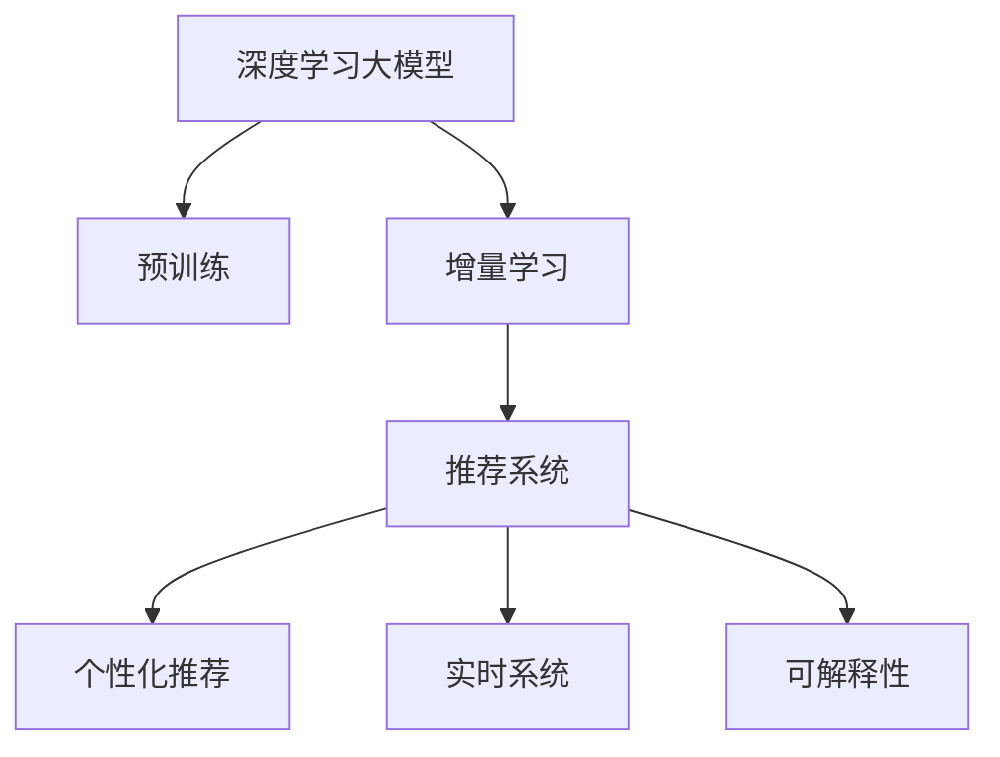

                 

# 电商平台中AI大模型的增量学习技术

## 1. 背景介绍

### 1.1 问题由来
随着电商平台的快速发展，在线交易的规模越来越大，用户行为的多样性和复杂性日益凸显。如何高效、准确地处理和理解海量交易数据，实时预测用户行为，优化推荐系统，提升用户体验，是电商平台面临的一项重要挑战。传统的机器学习方法往往依赖于离线训练和批量数据，无法实时响应数据的变化，导致推荐系统的效果和响应速度难以满足实际需求。

为了解决这个问题，人工智能大模型技术应运而生。基于深度学习的大模型通过在海量数据上预训练，学习到了丰富的语言知识和特征，具备强大的数据分析和预测能力。然而，在电商平台中，用户行为数据是动态变化的，预训练模型难以捕捉到最新的用户偏好和市场趋势。因此，如何利用大模型的强大能力，进行增量学习和实时更新，成为电商平台优化推荐系统的重要研究方向。

### 1.2 问题核心关键点
增量学习(Incremental Learning)是指模型在新的数据到来时，只更新部分模型参数，避免重新从头训练，以适应新数据分布的变化。在电商平台中，增量学习可以有效应对用户行为数据的快速变化，实时优化推荐策略，提升推荐效果和用户体验。

具体来说，增量学习在电商平台中的应用包括以下几个关键点：
1. **实时响应**：在用户行为数据发生改变时，能够实时更新模型参数，快速响应市场变化。
2. **参数效率**：通过只更新部分参数，减小模型更新和推理的开销，提升系统性能。
3. **用户体验**：根据最新的用户行为数据进行预测，提供更加个性化和精准的推荐结果。
4. **可扩展性**：能够高效处理海量数据，支持高并发和实时分析。

### 1.3 问题研究意义
电商平台中引入增量学习技术，对于提升推荐系统的效果和用户体验，推动电商平台数字化转型，具有重要意义：
1. **提升推荐效果**：通过实时增量学习，模型能够快速适应新数据分布，预测更加精准，提升推荐系统的效果。
2. **优化用户体验**：根据用户最新的行为数据进行预测，提供个性化的推荐结果，提升用户体验。
3. **降低成本**：通过实时更新模型，避免了对全部数据进行重新训练的成本和时间开销。
4. **加速业务发展**：实时分析和预测，能够帮助电商平台快速响应市场变化，抓住市场机会，加速业务发展。
5. **增强竞争力**：通过提高推荐系统的精准度，提升电商平台的竞争力和用户粘性。

## 2. 核心概念与联系

### 2.1 核心概念概述

为更好地理解电商平台中增量学习的方法，本节将介绍几个密切相关的核心概念：

- **深度学习大模型**：以自回归(如GPT)或自编码(如BERT)模型为代表的大规模预训练语言模型。通过在海量数据上预训练，学习到丰富的语言知识和特征，具备强大的数据分析和预测能力。

- **增量学习**：模型在新的数据到来时，只更新部分模型参数，避免重新从头训练，以适应新数据分布的变化。

- **推荐系统**：根据用户的历史行为数据和属性信息，推荐出用户可能感兴趣的商品。推荐系统是电商平台中重要的一环，提升推荐效果对于平台发展至关重要。

- **个性化推荐**：根据用户的具体需求和兴趣，提供个性化的推荐结果。个性化推荐能够提升用户体验，增加用户粘性，是电商平台的核心竞争力之一。

- **实时系统**：能够快速响应数据变化，实时更新模型参数，支持高并发和高吞吐量的系统。实时系统是电商平台中不可或缺的一部分，保证系统性能和用户体验。

- **可解释性**：推荐系统需要具备一定的可解释性，帮助用户理解推荐结果的依据，增强信任和满意度。

这些核心概念之间的逻辑关系可以通过以下Mermaid流程图来展示：



这个流程图展示了大模型在电商平台中的应用流程：

1. 大模型通过预训练获得基础能力。
2. 在增量学习框架下，模型实时更新，适应新数据分布。
3. 推荐系统利用更新后的模型，进行实时推荐。
4. 个性化推荐根据用户具体需求，提供定制化服务。
5. 实时系统保证推荐系统的高性能和高可用性。
6. 可解释性帮助用户理解推荐逻辑，增强信任和满意度。

## 3. 核心算法原理 & 具体操作步骤
### 3.1 算法原理概述

电商平台中增量学习的大模型推荐系统，本质上是一个基于深度学习的增量学习框架。其核心思想是：通过在线数据流不断更新预训练模型的参数，使得模型能够实时捕捉到用户行为的变化，优化推荐策略。

形式化地，假设预训练模型为 $M_{\theta}$，其中 $\theta$ 为预训练得到的模型参数。给定电商平台中的用户行为数据流 $\{(x_t, y_t)\}_{t=1}^T$，其中 $x_t$ 为用户在时间 $t$ 的行为数据，$y_t$ 为用户在时间 $t$ 的点击行为（如购买、浏览、收藏等）。增量学习的目标是在新的数据到来时，最小化损失函数 $L(\theta)$，使得模型预测的点击概率逼近真实标签 $y_t$。

增量学习通常采用小批量随机梯度下降(Small-Batch Stochastic Gradient Descent, SBSGD)算法，在每次更新时，选取一部分样本进行前向传播和反向传播，计算梯度并更新模型参数。公式化表达如下：

$$
\theta \leftarrow \theta - \eta \nabla_{\theta} \mathcal{L}(M_{\theta}, \{(x_t, y_t)\}_{t=1}^T)
$$

其中 $\eta$ 为学习率，$\nabla_{\theta} \mathcal{L}(M_{\theta}, \{(x_t, y_t)\}_{t=1}^T)$ 为损失函数对模型参数 $\theta$ 的梯度，可通过反向传播算法高效计算。

### 3.2 算法步骤详解

基于深度学习的增量学习框架，电商平台的推荐系统通常包括以下几个关键步骤：

**Step 1: 准备预训练模型和数据流**
- 选择合适的深度学习大模型 $M_{\theta}$ 作为初始化参数，如 BERT、GPT 等。
- 收集电商平台中的用户行为数据流 $\{(x_t, y_t)\}_{t=1}^T$，其中 $x_t$ 为用户的购买、浏览、收藏等行为数据，$y_t$ 为用户的点击行为。

**Step 2: 设置增量学习参数**
- 选择合适的优化算法及其参数，如 SBSGD、AdamW 等，设置学习率、批大小、迭代轮数等。
- 设置正则化技术及强度，包括权重衰减、Dropout、Early Stopping 等。
- 确定冻结预训练参数的策略，如仅微调顶层，或全部参数都参与增量更新。

**Step 3: 执行增量训练**
- 将用户行为数据流 $\{(x_t, y_t)\}_{t=1}^T$ 分批次输入模型，前向传播计算损失函数。
- 反向传播计算参数梯度，根据设定的优化算法和学习率更新模型参数。
- 周期性在验证集上评估模型性能，根据性能指标决定是否触发 Early Stopping。
- 重复上述步骤直到满足预设的迭代轮数或 Early Stopping 条件。

**Step 4: 实时推荐**
- 将新到达的客户行为数据 $x_t$ 输入更新后的模型 $M_{\hat{\theta}}$。
- 使用模型输出作为推荐系统的输入，结合其他特征综合排序，生成推荐列表。
- 将推荐结果推送给用户，获取用户反馈，更新模型。

以上是基于深度学习的增量学习框架在电商平台中的应用流程。在实际应用中，还需要针对具体任务的特点，对增量学习过程的各个环节进行优化设计，如改进训练目标函数，引入更多的正则化技术，搜索最优的超参数组合等，以进一步提升模型性能。

### 3.3 算法优缺点

基于深度学习的增量学习框架具有以下优点：
1. 实时响应。在用户行为数据流到达时，能够实时更新模型参数，快速响应市场变化。
2. 参数效率。通过只更新部分参数，减小模型更新和推理的开销，提升系统性能。
3. 个性化推荐。根据用户最新的行为数据进行预测，提供更加个性化和精准的推荐结果。
4. 降低成本。通过实时更新模型，避免了对全部数据进行重新训练的成本和时间开销。
5. 加速业务发展。实时分析和预测，能够帮助电商平台快速响应市场变化，抓住市场机会，加速业务发展。

同时，该方法也存在一定的局限性：
1. 数据流的不稳定性。电商平台的用户行为数据流存在一定的波动性，可能会影响模型的稳定性和性能。
2. 模型的鲁棒性。在面对异常数据或噪声数据时，模型可能会产生错误的预测结果。
3. 数据隐私问题。电商平台的用户行为数据涉及用户隐私，需要采取合适的隐私保护措施。
4. 模型复杂度。大规模的深度学习模型可能会带来较大的计算和存储开销，需要优化模型结构。
5. 模型的可解释性。深度学习模型通常被认为是“黑盒”，难以解释其内部工作机制和决策逻辑。

尽管存在这些局限性，但就目前而言，基于深度学习的增量学习框架是电商平台优化推荐系统的重要研究方向。未来相关研究的重点在于如何进一步降低数据流对模型性能的影响，提高模型的鲁棒性和可解释性，同时兼顾成本和隐私保护等因素。

### 3.4 算法应用领域

基于深度学习的增量学习框架在电商平台的推荐系统中，已经被广泛应用于以下领域：

- **个性化推荐**：根据用户的历史行为数据和属性信息，实时更新推荐策略，提升推荐系统的效果和个性化程度。
- **实时广告推荐**：实时分析用户的点击行为数据，推荐广告内容，提高广告的点击率和转化率。
- **价格优化**：实时监控市场价格变化，动态调整商品价格，优化库存管理。
- **库存管理**：实时预测商品需求，动态调整库存水平，优化供应链管理。
- **客户服务**：实时分析用户反馈和咨询记录，优化客服策略，提升客户满意度。

除了上述这些经典应用外，增量学习框架还被创新性地应用到更多场景中，如商品推荐、购物车管理、个性化搜索等，为电商平台的数字化转型提供了新的技术路径。随着深度学习模型和增量学习方法的不断进步，相信电商平台中的增量学习框架将带来更多的创新应用，提升电商平台的运营效率和用户体验。

## 4. 数学模型和公式 & 详细讲解 & 举例说明

### 4.1 数学模型构建

本节将使用数学语言对电商平台中增量学习的大模型推荐系统进行更加严格的刻画。

记预训练语言模型为 $M_{\theta}$，其中 $\theta$ 为预训练得到的模型参数。假设电商平台中的用户行为数据流为 $\{(x_t, y_t)\}_{t=1}^T$，其中 $x_t$ 为用户在时间 $t$ 的行为数据，$y_t$ 为用户在时间 $t$ 的点击行为。

定义模型 $M_{\theta}$ 在数据样本 $(x,y)$ 上的损失函数为 $\ell(M_{\theta}(x),y)$，则在数据流 $\{(x_t, y_t)\}_{t=1}^T$ 上的经验风险为：

$$
\mathcal{L}(\theta) = \frac{1}{T}\sum_{t=1}^T \ell(M_{\theta}(x_t),y_t)
$$

增量学习的优化目标是最小化经验风险，即找到最优参数：

$$
\theta^* = \mathop{\arg\min}_{\theta} \mathcal{L}(\theta)
$$

在实践中，我们通常使用基于梯度的优化算法（如SGD、Adam等）来近似求解上述最优化问题。设 $\eta$ 为学习率，$\lambda$ 为正则化系数，则参数的更新公式为：

$$
\theta \leftarrow \theta - \eta \nabla_{\theta}\mathcal{L}(\theta) - \eta\lambda\theta
$$

其中 $\nabla_{\theta}\mathcal{L}(\theta)$ 为损失函数对参数 $\theta$ 的梯度，可通过反向传播算法高效计算。

### 4.2 公式推导过程

以下我们以点击率预测任务为例，推导二元交叉熵损失函数及其梯度的计算公式。

假设模型 $M_{\theta}$ 在输入 $x_t$ 上的输出为 $\hat{y}_t=M_{\theta}(x_t) \in [0,1]$，表示用户点击的概率。真实标签 $y_t \in \{0,1\}$。则二元交叉熵损失函数定义为：

$$
\ell(M_{\theta}(x_t),y_t) = -[y_t\log \hat{y}_t + (1-y_t)\log (1-\hat{y}_t)]
$$

将其代入经验风险公式，得：

$$
\mathcal{L}(\theta) = -\frac{1}{T}\sum_{t=1}^T [y_t\log M_{\theta}(x_t)+(1-y_t)\log(1-M_{\theta}(x_t))]
$$

根据链式法则，损失函数对参数 $\theta_k$ 的梯度为：

$$
\frac{\partial \mathcal{L}(\theta)}{\partial \theta_k} = -\frac{1}{T}\sum_{t=1}^T (\frac{y_t}{M_{\theta}(x_t)}-\frac{1-y_t}{1-M_{\theta}(x_t)}) \frac{\partial M_{\theta}(x_t)}{\partial \theta_k}
$$

其中 $\frac{\partial M_{\theta}(x_t)}{\partial \theta_k}$ 可进一步递归展开，利用自动微分技术完成计算。

在得到损失函数的梯度后，即可带入参数更新公式，完成模型的迭代优化。重复上述过程直至收敛，最终得到适应电商平台用户行为分布的最优模型参数 $\theta^*$。

## 5. 项目实践：代码实例和详细解释说明
### 5.1 开发环境搭建

在进行增量学习实践前，我们需要准备好开发环境。以下是使用Python进行PyTorch开发的环境配置流程：

1. 安装Anaconda：从官网下载并安装Anaconda，用于创建独立的Python环境。

2. 创建并激活虚拟环境：
```bash
conda create -n pytorch-env python=3.8 
conda activate pytorch-env
```

3. 安装PyTorch：根据CUDA版本，从官网获取对应的安装命令。例如：
```bash
conda install pytorch torchvision torchaudio cudatoolkit=11.1 -c pytorch -c conda-forge
```

4. 安装TensorFlow：
```bash
pip install tensorflow
```

5. 安装各类工具包：
```bash
pip install numpy pandas scikit-learn matplotlib tqdm jupyter notebook ipython
```

完成上述步骤后，即可在`pytorch-env`环境中开始增量学习实践。

### 5.2 源代码详细实现

这里我们以点击率预测任务为例，给出使用TensorFlow进行增量学习的PyTorch代码实现。

首先，定义点击率预测任务的数据处理函数：

```python
import tensorflow as tf
from tensorflow.keras import layers, models

class ClickRateModel(tf.keras.Model):
    def __init__(self, embedding_dim, num_classes):
        super(ClickRateModel, self).__init__()
        self.dense1 = layers.Dense(64, activation='relu')
        self.dense2 = layers.Dense(32, activation='relu')
        self.dense3 = layers.Dense(1, activation='sigmoid')
        self.dropout = layers.Dropout(0.5)
        
    def call(self, inputs):
        x = self.dense1(inputs)
        x = self.dropout(x)
        x = self.dense2(x)
        x = self.dropout(x)
        x = self.dense3(x)
        return x

# 定义损失函数
def binary_crossentropy_loss(y_true, y_pred):
    return tf.keras.losses.binary_crossentropy(y_true, y_pred)

# 定义优化器
optimizer = tf.keras.optimizers.Adam(learning_rate=0.001)

# 加载预训练模型
pretrained_model = ClickRateModel(128, 2)
pretrained_model.load_weights('pretrained_weights.h5')

# 添加增量学习层
incremental_layer = tf.keras.layers.Dense(32, activation='relu')
incremental_model = ClickRateModel(32, 2)
incremental_model.load_weights('pretrained_weights.h5')
incremental_model.add(incremental_layer)

# 定义增量学习过程
@tf.function
def incremental_train_step(optimizer, model, batch):
    with tf.GradientTape() as tape:
        y_pred = model(batch['x'])
        loss = binary_crossentropy_loss(batch['y'], y_pred)
    grads = tape.gradient(loss, model.trainable_variables)
    optimizer.apply_gradients(zip(grads, model.trainable_variables))
    return loss

# 定义增量学习评估过程
def incremental_evaluate(model, test_dataset):
    y_true = []
    y_pred = []
    for batch in test_dataset:
        y_pred.append(model(batch['x']))
    y_pred = tf.concat(y_pred, axis=0)
    y_true = tf.concat([batch['y'] for batch in test_dataset], axis=0)
    return tf.keras.metrics.AUC(y_true, y_pred).numpy()
```

然后，定义训练和评估函数：

```python
epochs = 5
batch_size = 32

for epoch in range(epochs):
    loss = 0.0
    for batch in train_dataset:
        loss += incremental_train_step(optimizer, incremental_model, batch)
    loss /= len(train_dataset)
    print(f'Epoch {epoch+1}, loss: {loss:.4f}')
    
    acc = incremental_evaluate(incremental_model, test_dataset)
    print(f'Epoch {epoch+1}, test acc: {acc:.4f}')
    
print(f'Final test acc: {incremental_evaluate(incremental_model, test_dataset):.4f}')
```

以上就是使用TensorFlow对增量学习进行点击率预测任务的完整代码实现。可以看到，通过在预训练模型的顶层添加增量学习层，我们实现了对预训练模型的参数更新。

### 5.3 代码解读与分析

让我们再详细解读一下关键代码的实现细节：

**ClickRateModel类**：
- `__init__`方法：初始化模型结构，包含多个全连接层和Dropout层。
- `call`方法：定义模型的前向传播过程。

**binary_crossentropy_loss函数**：
- 定义二元交叉熵损失函数，用于计算预测值和真实值之间的差异。

**optimizer变量**：
- 定义优化器，这里使用Adam优化器。

**incremental_layer和incremental_model变量**：
- 定义增量学习层和增量学习模型，分别用于更新模型参数和进行增量预测。

**incremental_train_step函数**：
- 定义增量训练过程，使用tf.GradientTape记录梯度，使用optimizer优化模型参数。

**incremental_evaluate函数**：
- 定义增量评估过程，计算模型在测试集上的AUC值。

**训练和评估流程**：
- 在每个epoch内，循环遍历训练集，计算增量训练损失，并打印出当前epoch的损失值。
- 在每个epoch结束时，计算增量模型在测试集上的AUC值，并打印出当前epoch的AUC值。
- 在所有epoch结束后，计算增量模型在测试集上的AUC值，输出最终的测试AUC值。

可以看到，TensorFlow结合Keras提供了简单易用的高层次API，使得增量学习模型的开发变得便捷高效。开发者可以更加专注于模型的设计和调参，而不必过多关注底层实现细节。

当然，工业级的系统实现还需考虑更多因素，如模型的保存和部署、超参数的自动搜索、增量学习机制的优化等。但核心的增量学习范式基本与此类似。

## 6. 实际应用场景
### 6.1 智能客服系统

基于增量学习的大模型推荐技术，可以广泛应用于智能客服系统的构建。传统客服往往需要配备大量人力，高峰期响应缓慢，且一致性和专业性难以保证。而使用增量学习的大模型推荐系统，可以7x24小时不间断服务，快速响应客户咨询，用自然流畅的语言解答各类常见问题。

在技术实现上，可以收集企业内部的历史客服对话记录，将问题和最佳答复构建成监督数据，在此基础上对预训练大模型进行增量学习。增量学习后的推荐系统能够自动理解用户意图，匹配最合适的答案模板进行回复。对于客户提出的新问题，还可以接入检索系统实时搜索相关内容，动态组织生成回答。如此构建的智能客服系统，能大幅提升客户咨询体验和问题解决效率。

### 6.2 金融舆情监测

金融机构需要实时监测市场舆论动向，以便及时应对负面信息传播，规避金融风险。传统的人工监测方式成本高、效率低，难以应对网络时代海量信息爆发的挑战。基于增量学习的大语言模型微调技术，为金融舆情监测提供了新的解决方案。

具体而言，可以收集金融领域相关的新闻、报道、评论等文本数据，并对其进行主题标注和情感标注。在此基础上对预训练语言模型进行增量学习，使其能够自动判断文本属于何种主题，情感倾向是正面、中性还是负面。将增量学习后的模型应用到实时抓取的网络文本数据，就能够自动监测不同主题下的情感变化趋势，一旦发现负面信息激增等异常情况，系统便会自动预警，帮助金融机构快速应对潜在风险。

### 6.3 个性化推荐系统

当前的推荐系统往往只依赖用户的历史行为数据进行物品推荐，无法深入理解用户的真实兴趣偏好。基于增量学习的大模型推荐系统可以更好地挖掘用户行为背后的语义信息，从而提供更精准、多样的推荐内容。

在实践中，可以收集用户浏览、点击、评论、分享等行为数据，提取和用户交互的物品标题、描述、标签等文本内容。将文本内容作为模型输入，用户的后续行为（如是否点击、购买等）作为监督信号，在此基础上增量学习预训练语言模型。增量学习后的模型能够从文本内容中准确把握用户的兴趣点。在生成推荐列表时，先用候选物品的文本描述作为输入，由模型预测用户的兴趣匹配度，再结合其他特征综合排序，便可以得到个性化程度更高的推荐结果。

### 6.4 未来应用展望

随着增量学习方法的不断发展，基于大模型推荐系统在更多领域得到应用，为传统行业带来变革性影响。

在智慧医疗领域，基于增量学习的大语言模型推荐系统可以实时预测患者病情，辅助医生诊疗，加速新药开发进程。

在智能教育领域，增量学习技术可应用于作业批改、学情分析、知识推荐等方面，因材施教，促进教育公平，提高教学质量。

在智慧城市治理中，增量学习模型可应用于城市事件监测、舆情分析、应急指挥等环节，提高城市管理的自动化和智能化水平，构建更安全、高效的未来城市。

此外，在企业生产、社会治理、文娱传媒等众多领域，基于增量学习的大模型推荐系统也将不断涌现，为经济社会发展注入新的动力。相信随着技术的日益成熟，增量学习方法将成为推荐系统的重要范式，推动人工智能技术在垂直行业的规模化落地。

## 7. 工具和资源推荐
### 7.1 学习资源推荐

为了帮助开发者系统掌握增量学习技术，这里推荐一些优质的学习资源：

1. 《深度学习入门：基于Python的理论与实现》系列博文：由深度学习专家撰写，全面介绍了深度学习理论和TensorFlow实践。

2. CS231n《卷积神经网络与视觉识别》课程：斯坦福大学开设的视觉识别课程，有Lecture视频和配套作业，涵盖视觉领域的基本概念和经典模型。

3. 《TensorFlow实战Google深度学习框架》书籍：TensorFlow的官方文档，全面介绍了TensorFlow的使用方法和实践技巧。

4. Weights & Biases：模型训练的实验跟踪工具，可以记录和可视化模型训练过程中的各项指标，方便对比和调优。

5. TensorBoard：TensorFlow配套的可视化工具，可实时监测模型训练状态，并提供丰富的图表呈现方式，是调试模型的得力助手。

通过对这些资源的学习实践，相信你一定能够快速掌握增量学习技术的精髓，并用于解决实际的推荐系统问题。
### 7.2 开发工具推荐

高效的开发离不开优秀的工具支持。以下是几款用于增量学习开发的常用工具：

1. PyTorch：基于Python的开源深度学习框架，灵活动态的计算图，适合快速迭代研究。大部分深度学习模型都有PyTorch版本的实现。

2. TensorFlow：由Google主导开发的开源深度学习框架，生产部署方便，适合大规模工程应用。同样有丰富的深度学习模型资源。

3. TensorFlow Serving：基于TensorFlow的模型服务框架，支持高并发和高吞吐量的模型部署。

4. TensorFlow Lite：将深度学习模型转换为轻量级的移动端模型，支持iOS和Android平台。

5. Keras：基于TensorFlow和Theano的高层次API，提供简单易用的模型构建和训练功能，适合初学者和快速原型开发。

合理利用这些工具，可以显著提升增量学习模型的开发效率，加快创新迭代的步伐。

### 7.3 相关论文推荐

增量学习技术的发展源于学界的持续研究。以下是几篇奠基性的相关论文，推荐阅读：

1. Incremental Learning: A Survey（增量学习综述）：从理论和实践角度全面回顾了增量学习的原理和应用。

2. Incremental Training of Deep Neural Networks: An Overview of Approaches, Algorithms, and Techniques（深度神经网络的增量训练综述）：详细介绍了增量训练的各种方法和技术。

3. Distributed Incremental Learning: An Empirical Evaluation for Deep Neural Networks（分布式增量学习的经验评估）：研究了分布式增量学习在深度神经网络中的性能表现。

4. Online Learning and Incremental Training in Deep Neural Networks: A Review（深度神经网络的在线学习和增量训练综述）：介绍了在线学习和增量训练在深度神经网络中的应用。

5. Incremental Learning in Big Data and Real-World Applications（大数据和实际应用中的增量学习）：讨论了增量学习在大数据和实际应用中的实现和挑战。

这些论文代表了大规模增量学习技术的发展脉络。通过学习这些前沿成果，可以帮助研究者把握学科前进方向，激发更多的创新灵感。

## 8. 总结：未来发展趋势与挑战
### 8.1 总结

本文对基于深度学习的增量学习技术在电商平台中的应用进行了全面系统的介绍。首先阐述了增量学习在电商平台中的研究背景和意义，明确了增量学习在实时响应、参数效率、个性化推荐等方面的独特价值。其次，从原理到实践，详细讲解了增量学习的数学原理和关键步骤，给出了增量学习任务开发的完整代码实例。同时，本文还广泛探讨了增量学习技术在智能客服、金融舆情、个性化推荐等多个领域的应用前景，展示了增量学习技术的广阔潜力。此外，本文精选了增量学习技术的各类学习资源，力求为读者提供全方位的技术指引。

通过本文的系统梳理，可以看到，基于增量学习技术的电商平台推荐系统能够实时捕捉用户行为的变化，动态优化推荐策略，提升推荐效果和用户体验。增量学习技术通过只更新部分模型参数，减小了计算和存储开销，提升了系统的性能和可扩展性。未来，伴随增量学习方法的不断进步，基于大模型的推荐系统将带来更多的创新应用，提升电商平台的运营效率和用户体验。

### 8.2 未来发展趋势

展望未来，增量学习技术将呈现以下几个发展趋势：

1. 实时处理能力提升。随着硬件性能和算法的不断优化，增量学习模型的实时处理能力将进一步提升，能够实时响应大规模数据流。

2. 多模态融合。增量学习技术将结合视觉、语音、文本等多模态数据，提供更加全面和准确的推荐结果。

3. 自适应学习机制。增量学习模型将学习到更强的自适应能力，能够根据数据流的特点自动调整学习策略。

4. 知识图谱结合。增量学习模型将更好地融合知识图谱中的结构化信息，提升推荐系统的泛化能力和鲁棒性。

5. 联邦学习应用。增量学习模型将在联邦学习框架下，实现跨设备、跨领域的数据融合和模型共享，提升数据的隐私和安全。

6. 边缘计算集成。增量学习模型将在边缘计算环境中运行，实现近场数据处理和实时决策，提升系统的响应速度和可靠性。

以上趋势凸显了增量学习技术的广阔前景。这些方向的探索发展，必将进一步提升推荐系统的性能和用户体验，为电商平台带来更大的价值。

### 8.3 面临的挑战

尽管增量学习技术已经取得了显著成果，但在迈向更加智能化、普适化应用的过程中，仍面临诸多挑战：

1. 数据流的不稳定性。电商平台的用户行为数据流存在一定的波动性，可能会影响模型的稳定性和性能。

2. 模型的鲁棒性。在面对异常数据或噪声数据时，模型可能会产生错误的预测结果。

3. 数据隐私问题。电商平台的用户行为数据涉及用户隐私，需要采取合适的隐私保护措施。

4. 模型复杂度。大规模的深度学习模型可能会带来较大的计算和存储开销，需要优化模型结构。

5. 模型的可解释性。增量学习模型通常被认为是“黑盒”，难以解释其内部工作机制和决策逻辑。

尽管存在这些挑战，但就目前而言，基于深度学习的增量学习技术仍是电商平台优化推荐系统的重要研究方向。未来相关研究的重点在于如何进一步降低数据流对模型性能的影响，提高模型的鲁棒性和可解释性，同时兼顾成本和隐私保护等因素。

### 8.4 研究展望

面对增量学习技术所面临的种种挑战，未来的研究需要在以下几个方面寻求新的突破：

1. 探索无监督和半监督增量学习方法。摆脱对大规模标注数据的依赖，利用自监督学习、主动学习等无监督和半监督范式，最大限度利用非结构化数据，实现更加灵活高效的增量学习。

2. 研究自适应增量学习范式。开发更加自适应的增量学习算法，使得模型能够根据数据流的特点自动调整学习策略，提高模型的鲁棒性和泛化能力。

3. 引入更多先验知识。将符号化的先验知识，如知识图谱、逻辑规则等，与神经网络模型进行巧妙融合，引导增量学习过程学习更准确、合理的语言模型。同时加强不同模态数据的整合，实现视觉、语音等多模态信息与文本信息的协同建模。

4. 结合因果分析和博弈论工具。将因果分析方法引入增量学习模型，识别出模型决策的关键特征，增强输出解释的因果性和逻辑性。借助博弈论工具刻画人机交互过程，主动探索并规避模型的脆弱点，提高系统稳定性。

5. 纳入伦理道德约束。在增量学习模型的训练目标中引入伦理导向的评估指标，过滤和惩罚有偏见、有害的输出倾向。同时加强人工干预和审核，建立模型行为的监管机制，确保输出符合人类价值观和伦理道德。

这些研究方向的探索，必将引领增量学习技术迈向更高的台阶，为构建安全、可靠、可解释、可控的智能系统铺平道路。面向未来，增量学习技术还需要与其他人工智能技术进行更深入的融合，如知识表示、因果推理、强化学习等，多路径协同发力，共同推动智能系统的发展进步。只有勇于创新、敢于突破，才能不断拓展增量学习技术的边界，让智能技术更好地造福人类社会。

## 9. 附录：常见问题与解答

**Q1：增量学习是否适用于所有推荐系统？**

A: 增量学习在推荐系统中的应用非常广泛，尤其适用于数据动态变化且实时性要求高的场景，如电商平台、广告推荐、智能客服等。但对于一些静态或半静态推荐系统，如书籍推荐、音乐推荐等，增量学习的优势可能不那么明显。

**Q2：增量学习如何处理数据流中的噪声和异常值？**

A: 增量学习通常采用平滑策略来处理数据流中的噪声和异常值。例如，可以使用移动平均法来平滑数据流，或使用异常值检测技术（如基于统计学的检测方法）来识别和过滤异常值。同时，也可以通过引入正则化技术（如L2正则、Dropout等），增强模型的鲁棒性和泛化能力。

**Q3：增量学习是否需要全量数据的重训练？**

A: 增量学习的一个重要特性是不需要全量数据的重训练。通过增量学习，模型只需要更新新数据带来的部分参数，保留了大部分预训练权重，从而降低了计算和存储开销，提升了系统的实时性和可扩展性。

**Q4：增量学习的计算效率如何？**

A: 增量学习的计算效率通常高于全量训练，尤其是对于大规模数据流和复杂模型，增量学习能够快速响应数据变化，实时更新模型参数，显著降低计算开销。但是，增量学习也可能受到数据流波动性的影响，需要精心设计学习策略和参数设置，以确保模型的稳定性和性能。

**Q5：增量学习是否需要复杂的优化算法？**

A: 增量学习的优化算法相对简单，通常使用小批量随机梯度下降（SBSGD）等基于梯度的优化算法。这些算法能够高效地更新模型参数，而不需要复杂的数据分布假设和求解过程。但是，增量学习的效果也受到优化算法的选择和参数设置的影响，需要根据具体任务和数据特点进行调整。

总之，增量学习技术为电商平台的推荐系统提供了高效、灵活、个性化的解决方案，是推动电商平台数字化转型和智能升级的重要手段。伴随技术的不断进步，增量学习技术将在更多领域得到应用，为各行各业带来新的机遇和挑战。通过持续探索和创新，我们相信增量学习技术必将在构建人机协同的智能时代中扮演越来越重要的角色。

