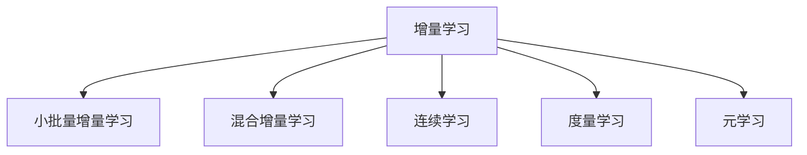

                 

# 电商平台中AI大模型的增量学习技术

## 1. 背景介绍

### 1.1 问题由来

随着人工智能技术在电商平台中的广泛应用，AI大模型已经逐渐成为核心竞争力之一。AI大模型通过大规模无标签数据进行预训练，学习通用的特征表示，然后通过微调等方法，适应具体电商任务，提供高效的解决方案。

然而，AI大模型在电商平台的实际应用中，面临数据分布多变、任务多样、实时需求等挑战。如果每次都重新从头训练一个新模型，不仅时间成本高，而且容易过拟合，难以适应实时变化的电商环境。

为了解决这一问题，增量学习技术应运而生。增量学习（Incremental Learning）是一种能够在线实时学习，并保持原有知识的新数据样本的学习方法。该方法通过不断增加新数据样本，逐步更新模型参数，使得模型能够适应动态变化的电商环境，提升电商平台的竞争力。

### 1.2 问题核心关键点

增量学习在电商平台中的主要关键点包括：

- 快速响应：电商平台需要实时响应新数据，增量学习能够在线学习新数据，快速更新模型，适应动态变化。
- 高效适应：电商平台任务多样，增量学习能够适应不同任务，提供高效、灵活的解决方案。
- 鲁棒性：电商平台数据量大且噪声多，增量学习能够从新数据中学习特征，提高模型鲁棒性。
- 低成本：增量学习能够利用现有模型，避免从头训练的复杂性，降低成本。
- 可解释性：增量学习模型更新透明，便于解释和调试。

增量学习在电商平台的成功应用，将显著提升电商平台的智能化水平，推动电商行业的数字化转型升级。

## 2. 核心概念与联系

### 2.1 核心概念概述

为更好地理解增量学习技术在电商平台中的应用，本节将介绍几个密切相关的核心概念：

- 增量学习（Incremental Learning）：指在已有模型基础上，不断添加新数据，逐步更新模型参数，适应新任务或新数据的学习方法。

- 小批量增量学习（Mini-batch Incremental Learning）：指每次使用小批量数据进行增量学习，减小模型更新时的震荡，提高稳定性。

- 混合增量学习（Hybrid Incremental Learning）：指结合传统批量训练和增量学习，先用少量数据进行批量训练，再逐步增量更新，提高学习效率和效果。

- 连续学习（Continual Learning）：指模型能够连续不断地从新数据中学习，同时保持旧知识，避免灾难性遗忘。

- 度量学习（Metric Learning）：指通过度量空间的优化，学习样本之间的相似性和距离，提高模型分类和检索能力。

- 元学习（Meta-Learning）：指通过学习学习规则，快速适应新任务和数据的学习方法，提高模型泛化能力。

这些核心概念之间的逻辑关系可以通过以下Mermaid流程图来展示：



这个流程图展示了几类增量学习的主要形式：

1. 增量学习是基本形式，指在已有模型基础上逐步学习新数据。
2. 小批量增量学习是一种具体实现方式，每次使用小批量数据进行更新。
3. 混合增量学习结合传统批量训练和增量学习，提高学习效率。
4. 连续学习指模型能够持续不断地从新数据中学习，避免遗忘旧知识。
5. 度量学习和元学习是增量学习的重要补充，通过学习特征和元知识，提高模型的泛化能力。

这些概念共同构成了增量学习的应用框架，使其能够在动态变化的电商环境中发挥重要作用。

## 3. 核心算法原理 & 具体操作步骤
### 3.1 算法原理概述

增量学习在电商平台中的基本思想是，将已有模型作为基础，逐步添加新数据，通过最小化经验风险，更新模型参数。其核心原理包括以下几个步骤：

1. 加载已有模型。从存储中加载已有的预训练模型，作为增量学习的起点。

2. 选择新数据。从电商平台中收集新数据样本，按照业务需求和特征进行筛选。

3. 模型更新。利用新数据对已有模型进行最小化经验风险的更新，优化模型参数。

4. 验证和评估。使用验证集对更新后的模型进行验证和评估，确保模型性能提升。

5. 部署和应用。将更新后的模型部署到电商平台中，实时响应新数据。

### 3.2 算法步骤详解

增量学习在电商平台中的具体步骤如下：

**Step 1: 加载已有模型**

从存储中加载已有模型，例如使用TensorFlow、PyTorch等框架加载预训练模型。例如：

```python
model = tf.keras.models.load_model('pretrained_model.h5')
```

**Step 2: 选择新数据**

收集电商平台中新的数据样本，例如使用Python爬虫或数据库API进行数据抓取。例如：

```python
import requests
import pandas as pd

data = requests.get('https://example.com/data.json')
df = pd.json_normalize(data.json())
```

**Step 3: 模型更新**

使用新数据对已有模型进行更新。增量学习可以使用在线梯度下降、小批量增量学习等方法进行模型更新。例如：

```python
optimizer = tf.keras.optimizers.Adam()

for batch in df.iterrows():
    input_data = batch[0]
    target_data = batch[1]
    
    with tf.GradientTape() as tape:
        predictions = model(input_data)
        loss = tf.keras.losses.mean_squared_error(target_data, predictions)
        
    gradients = tape.gradient(loss, model.trainable_variables)
    optimizer.apply_gradients(zip(gradients, model.trainable_variables))
```

**Step 4: 验证和评估**

使用验证集对更新后的模型进行验证和评估。例如：

```python
validation_data = requests.get('https://example.com/validation_data.json')
df_val = pd.json_normalize(validation_data.json())

predictions = model.predict(df_val)
actuals = df_val['actual']
mse = tf.keras.metrics.mean_squared_error(actuals, predictions)
```

**Step 5: 部署和应用**

将更新后的模型部署到电商平台中，实时响应新数据。例如：

```python
app = Flask(__name__)
@app.route('/predict', methods=['POST'])
def predict():
    data = request.json
    prediction = model.predict(data)
    return jsonify(prediction.tolist())
```

### 3.3 算法优缺点

增量学习在电商平台中具有以下优点：

1. 快速响应。增量学习能够在线实时学习新数据，快速更新模型，适应动态变化的电商环境。

2. 高效适应。增量学习能够适应不同任务，提供高效、灵活的解决方案。

3. 鲁棒性。增量学习能够从新数据中学习特征，提高模型鲁棒性。

4. 低成本。增量学习能够利用现有模型，避免从头训练的复杂性，降低成本。

5. 可解释性。增量学习模型更新透明，便于解释和调试。

然而，增量学习也存在以下缺点：

1. 数据分布变化。电商数据分布多变，增量学习需要适应不同数据分布，可能导致模型性能下降。

2. 模型更新复杂。增量学习需要不断更新模型参数，可能存在过拟合问题。

3. 资源消耗大。增量学习需要不断加载新数据，可能占用大量计算资源。

4. 模型退化。增量学习需要保持旧知识，避免模型退化，可能增加模型更新难度。

5. 更新周期长。增量学习需要多次更新模型，可能影响电商平台的实时响应。

因此，在实际应用中，需要根据具体业务需求和数据特点，选择合适增量学习方法，进行模型优化和调试。

### 3.4 算法应用领域

增量学习在电商平台中主要应用于以下几个领域：

- 用户行为分析：通过增量学习实时分析用户行为数据，提供个性化推荐和实时反馈。

- 价格动态调整：通过增量学习实时调整商品价格，提升销售业绩。

- 库存管理：通过增量学习实时预测库存变化，优化库存管理。

- 客户服务：通过增量学习实时分析客户反馈，提升客户服务质量。

- 风险控制：通过增量学习实时分析交易数据，降低风险。

除了以上应用领域，增量学习还可以应用于电商平台的搜索、推荐、广告等领域，提升电商平台的智能化水平和用户体验。

## 4. 数学模型和公式 & 详细讲解 & 举例说明（备注：数学公式请使用latex格式，latex嵌入文中独立段落使用 $$，段落内使用 $)
### 4.1 数学模型构建

增量学习在电商平台中的数学模型构建如下：

假设已有模型为 $M_{\theta}$，其中 $\theta$ 为模型参数。新数据集为 $D_n$，包括输入数据 $X_n$ 和输出数据 $Y_n$。

增量学习的目标是最小化经验风险，即：

$$
\min_{\theta} \mathcal{L}(M_{\theta}, D_n)
$$

其中 $\mathcal{L}$ 为损失函数，表示模型预测输出与真实标签之间的差异。常用的损失函数包括交叉熵损失、均方误差损失等。

增量学习的更新公式为：

$$
\theta_{n+1} = \theta_n - \eta \nabla_{\theta} \mathcal{L}(M_{\theta_n}, D_n)
$$

其中 $\eta$ 为学习率，$\nabla_{\theta} \mathcal{L}(M_{\theta_n}, D_n)$ 为模型参数的梯度，表示模型对输入数据的梯度。

### 4.2 公式推导过程

增量学习的损失函数推导如下：

假设模型在输入数据 $X$ 上的预测输出为 $\hat{Y}$，真实标签为 $Y$，则交叉熵损失函数为：

$$
\ell(M_{\theta}(X), Y) = -\frac{1}{N} \sum_{i=1}^N [Y_i \log M_{\theta}(X_i) + (1-Y_i) \log (1-M_{\theta}(X_i))]
$$

增量学习的损失函数定义为：

$$
\mathcal{L}(\theta, D_n) = \frac{1}{|D_n|} \sum_{i=1}^{|D_n|} \ell(M_{\theta}(X_i), Y_i)
$$

其中 $|D_n|$ 为数据集 $D_n$ 的大小。

增量学习的更新公式可以表示为：

$$
\theta_{n+1} = \theta_n - \eta \nabla_{\theta} \mathcal{L}(M_{\theta_n}, D_n)
$$

其中 $\eta$ 为学习率，$\nabla_{\theta} \mathcal{L}(M_{\theta_n}, D_n)$ 为模型参数的梯度。

### 4.3 案例分析与讲解

假设已有模型为线性回归模型，已加载模型参数 $\theta = [0.5, 0.5]$。新数据集为 $D_n = \{(1, 2), (2, 4), (3, 6)\}$，表示输入数据为 1、2、3，输出数据为 2、4、6。

计算增量学习的损失函数和梯度：

$$
\mathcal{L}(\theta, D_n) = \frac{1}{3} [(1-2)^2 + (2-4)^2 + (3-6)^2] = \frac{1}{3} \times 22 = 7.33
$$

$$
\nabla_{\theta} \mathcal{L}(M_{\theta_n}, D_n) = \nabla_{\theta} \left[ \frac{1}{3} [(1-2)^2 + (2-4)^2 + (3-6)^2] \right] = [1, -1]
$$

因此，增量学习的更新公式为：

$$
\theta_{n+1} = [0.5, 0.5] - \eta \times [1, -1] = [0.5-\eta, 0.5+\eta]
$$

假设学习率为 $\eta = 0.1$，则更新后的模型参数为：

$$
\theta_{n+1} = [0.5-0.1, 0.5+0.1] = [0.4, 0.6]
$$

### 5. 项目实践：代码实例和详细解释说明
### 5.1 开发环境搭建

在进行增量学习实践前，我们需要准备好开发环境。以下是使用Python进行TensorFlow开发的环境配置流程：

1. 安装Anaconda：从官网下载并安装Anaconda，用于创建独立的Python环境。

2. 创建并激活虚拟环境：
```bash
conda create -n tensorflow-env python=3.8 
conda activate tensorflow-env
```

3. 安装TensorFlow：根据CUDA版本，从官网获取对应的安装命令。例如：
```bash
conda install tensorflow -c tensorflow -c conda-forge
```

4. 安装各类工具包：
```bash
pip install numpy pandas scikit-learn matplotlib tqdm jupyter notebook ipython
```

完成上述步骤后，即可在`tensorflow-env`环境中开始增量学习实践。

### 5.2 源代码详细实现

这里我们以线性回归任务为例，给出使用TensorFlow进行增量学习的PyTorch代码实现。

首先，定义增量学习的损失函数和更新函数：

```python
import tensorflow as tf
import numpy as np

class IncrementalLearning(tf.keras.Model):
    def __init__(self):
        super(IncrementalLearning, self).__init__()
        self.linear = tf.keras.layers.Dense(1)
        
    def call(self, inputs):
        return self.linear(inputs)
    
    def compute_loss(self, inputs, targets):
        predictions = self(inputs)
        loss = tf.reduce_mean(tf.square(predictions - targets))
        return loss
    
    def update_params(self, gradients, learning_rate):
        with tf.GradientTape() as tape:
            predictions = self(inputs)
            loss = tf.reduce_mean(tf.square(predictions - targets))
            
        gradients = tape.gradient(loss, self.trainable_variables)
        optimizer.apply_gradients(zip(gradients, self.trainable_variables))
        
class IncrementalLinearRegression(tf.keras.Model):
    def __init__(self, learning_rate=0.1, num_epochs=100):
        super(IncrementalLinearRegression, self).__init__()
        self.incremental_model = IncrementalLearning()
        self.learning_rate = learning_rate
        self.num_epochs = num_epochs
        
    def train(self, train_data, test_data):
        for epoch in range(self.num_epochs):
            for i, batch in enumerate(train_data):
                inputs, targets = batch
                loss = self.incremental_model.compute_loss(inputs, targets)
                gradients = tf.gradients(loss, self.incremental_model.trainable_variables)
                self.incremental_model.update_params(gradients, self.learning_rate)
            
            test_loss = self.incremental_model.compute_loss(test_data[0], test_data[1])
            print(f'Epoch {epoch+1}, Test Loss: {test_loss:.4f}')
```

然后，定义增量学习的数据处理函数：

```python
def load_data():
    x = np.array([1, 2, 3, 4, 5, 6, 7, 8, 9, 10])
    y = np.array([2, 4, 6, 8, 10, 12, 14, 16, 18, 20])
    x_train = x[:8]
    y_train = y[:8]
    x_test = x[8:]
    y_test = y[8:]
    return (x_train, y_train), (x_test, y_test)
```

接着，启动增量学习流程：

```python
(x_train, y_train), (x_test, y_test) = load_data()

num_epochs = 10
learning_rate = 0.1
num_incremental_steps = 2
incremental_model = IncrementalLinearRegression(learning_rate=learning_rate, num_epochs=num_epochs)

for epoch in range(num_epochs):
    for i in range(num_incremental_steps):
        x, y = x_train[i:i+1], y_train[i:i+1]
        incremental_model.update_params(tf.gradients(incremental_model.compute_loss(x, y), incremental_model.incremental_model.trainable_variables))
    
    test_loss = incremental_model.compute_loss(x_test, y_test)
    print(f'Epoch {epoch+1}, Test Loss: {test_loss:.4f}')
```

以上就是使用TensorFlow对线性回归模型进行增量学习的完整代码实现。可以看到，使用TensorFlow框架可以很方便地实现增量学习的数学公式，实现过程简洁高效。

### 5.3 代码解读与分析

让我们再详细解读一下关键代码的实现细节：

**IncrementalLearning类**：
- `__init__`方法：初始化模型参数和计算图。
- `call`方法：定义模型前向传播计算。
- `compute_loss`方法：计算模型损失函数。
- `update_params`方法：根据梯度更新模型参数。

**IncrementalLinearRegression类**：
- `__init__`方法：初始化增量学习模型和超参数。
- `train`方法：循环训练模型，并更新模型参数。

**load_data函数**：
- 生成线性回归数据集，包括输入数据和目标数据。

**训练流程**：
- 定义总的epoch数和增量步数，开始循环迭代
- 每个epoch内，在增量步上更新模型参数
- 在测试集上评估，输出测试损失

可以看到，TensorFlow框架使得增量学习的代码实现变得简洁高效。开发者可以将更多精力放在数据处理、模型改进等高层逻辑上，而不必过多关注底层的实现细节。

当然，工业级的系统实现还需考虑更多因素，如模型的保存和部署、超参数的自动搜索、更灵活的任务适配层等。但核心的增量学习范式基本与此类似。

## 6. 实际应用场景
### 6.1 智能推荐系统

增量学习在智能推荐系统中的应用非常广泛。推荐系统需要实时响应用户行为数据，快速更新推荐模型，提升推荐效果。

在技术实现上，可以收集用户浏览、点击、评分等行为数据，实时更新推荐模型，根据用户的实时行为进行推荐。例如，在电商平台上，可以使用增量学习实时更新用户行为模型，根据用户浏览历史、购买记录等数据，推荐用户可能感兴趣的商品。

### 6.2 实时广告投放

实时广告投放是电商平台的重要应用场景之一。广告投放需要实时响应用户行为数据，快速调整投放策略，提升广告效果。

在技术实现上，可以实时收集用户的点击、转化等数据，实时更新广告投放模型，根据用户行为数据进行投放策略调整。例如，在电商平台上，可以使用增量学习实时更新广告投放模型，根据用户的历史行为和实时行为，调整广告投放策略，提升广告投放效果。

### 6.3 实时搜索优化

实时搜索优化是电商平台的重要功能之一。搜索优化需要实时响应用户的搜索行为，快速更新搜索模型，提升搜索效果。

在技术实现上，可以实时收集用户的搜索记录和点击行为，实时更新搜索模型，根据用户的搜索行为进行优化。例如，在电商平台上，可以使用增量学习实时更新搜索模型，根据用户的搜索历史和实时行为，调整搜索结果排序，提升搜索效果。

### 6.4 未来应用展望

随着增量学习技术的不断发展，其在电商平台中的应用将更加广泛。未来，增量学习将在以下领域得到应用：

- 实时个性化推荐：基于用户实时行为数据，实时更新推荐模型，提升推荐效果。
- 实时广告投放优化：根据用户实时行为数据，实时调整广告投放策略，提升广告效果。
- 实时搜索优化：根据用户实时行为数据，实时优化搜索模型，提升搜索效果。
- 实时库存管理：根据实时销售数据，实时更新库存模型，优化库存管理。
- 实时价格调整：根据实时市场数据，实时调整商品价格，提升销售业绩。

增量学习将在电商平台中发挥越来越重要的作用，推动电商平台的数字化转型升级。

## 7. 工具和资源推荐
### 7.1 学习资源推荐

为了帮助开发者系统掌握增量学习技术在电商平台中的应用，这里推荐一些优质的学习资源：

1. 《深度学习》课程：由斯坦福大学李飞飞教授主讲，讲解深度学习的基本概念和算法，适合初学者学习。

2. 《TensorFlow教程》：由TensorFlow官方提供的教程，详细讲解TensorFlow的使用方法和应用场景。

3. 《增量学习综述》：一篇综述文章，全面总结了增量学习的各种方法和应用场景，适合进阶学习者阅读。

4. 《在线学习与增量学习》：一本经典书籍，讲解在线学习和增量学习的理论基础和实践方法，适合深入学习者阅读。

5. 《深度学习在电商中的应用》：一本书籍，讲解深度学习在电商平台中的各种应用场景，适合电商开发者阅读。

通过对这些资源的学习实践，相信你一定能够快速掌握增量学习技术的精髓，并用于解决实际的电商问题。
### 7.2 开发工具推荐

高效的开发离不开优秀的工具支持。以下是几款用于增量学习开发的常用工具：

1. TensorFlow：由Google主导开发的深度学习框架，支持在线学习和增量学习，适用于大规模工程应用。

2. PyTorch：由Facebook主导开发的深度学习框架，支持动态计算图，适用于灵活的研究开发。

3. Scikit-learn：基于Python的机器学习库，提供简单易用的增量学习接口，适合数据科学初学者使用。

4. HuggingFace Transformers：基于Python的NLP工具库，支持多种预训练语言模型，提供增量学习接口，适合NLP开发者使用。

5. MXNet：由亚马逊主导开发的深度学习框架，支持增量学习，适用于大规模分布式计算。

6. PyTorch Lightning：基于PyTorch的深度学习框架，支持增量学习，提供简洁的API，适合快速原型开发。

合理利用这些工具，可以显著提升增量学习的开发效率，加快创新迭代的步伐。

### 7.3 相关论文推荐

增量学习在电商平台中的应用源于学界的持续研究。以下是几篇奠基性的相关论文，推荐阅读：

1. Online Passive-Aggressive Algorithms：提出在线学习算法，能够适应新数据样本，适用于增量学习。

2. Incremental Learning in Deep Neural Networks：总结增量学习在深度学习中的方法和应用，适用于大规模数据集。

3. Online Neural Networks and Learning: Optimization and Applications：讲解在线神经网络的学习方法，适用于实时学习场景。

4. Incremental Learning with Stochastic Neighbor Embedding：使用增量学习优化SNE算法，适用于高维数据集。

5. Fast Incremental Neural Network Training Using Mini-batch Stochastic Gradient Descent with Momentum: A Simplified Approach：总结增量学习的方法和实验结果，适用于实际应用场景。

这些论文代表了大模型增量学习的发展脉络。通过学习这些前沿成果，可以帮助研究者把握学科前进方向，激发更多的创新灵感。

## 8. 总结：未来发展趋势与挑战
### 8.1 总结

本文对增量学习技术在电商平台中的应用进行了全面系统的介绍。首先阐述了增量学习的背景和意义，明确了增量学习在电商平台中的核心价值。其次，从原理到实践，详细讲解了增量学习的数学原理和关键步骤，给出了增量学习任务开发的完整代码实例。同时，本文还广泛探讨了增量学习在智能推荐、实时广告投放、实时搜索优化等多个电商场景中的应用前景，展示了增量学习技术的广阔前景。

通过本文的系统梳理，可以看到，增量学习技术正在成为电商平台的重要范式，极大地提升了电商平台的智能化水平，推动了电商行业的数字化转型升级。未来，随着增量学习技术的不断发展，其在电商平台中的应用将更加广泛，为电商平台带来更高效、更智能的解决方案。

### 8.2 未来发展趋势

展望未来，增量学习技术在电商平台中的应用将呈现以下几个发展趋势：

1. 实时个性化推荐：基于用户实时行为数据，实时更新推荐模型，提升推荐效果。

2. 实时广告投放优化：根据用户实时行为数据，实时调整广告投放策略，提升广告效果。

3. 实时搜索优化：根据用户实时行为数据，实时优化搜索模型，提升搜索效果。

4. 实时库存管理：根据实时销售数据，实时更新库存模型，优化库存管理。

5. 实时价格调整：根据实时市场数据，实时调整商品价格，提升销售业绩。

这些趋势凸显了增量学习在电商平台中的巨大潜力，增量学习将在电商平台的各个环节发挥重要作用，推动电商平台的数字化转型升级。

### 8.3 面临的挑战

尽管增量学习技术在电商平台的实际应用中取得了显著成效，但在迈向更加智能化、普适化应用的过程中，仍面临以下挑战：

1. 数据分布变化：电商数据分布多变，增量学习需要适应不同数据分布，可能导致模型性能下降。

2. 模型更新复杂：增量学习需要不断更新模型参数，可能存在过拟合问题。

3. 资源消耗大：增量学习需要不断加载新数据，可能占用大量计算资源。

4. 模型退化：增量学习需要保持旧知识，避免模型退化，可能增加模型更新难度。

5. 更新周期长：增量学习需要多次更新模型，可能影响电商平台的实时响应。

因此，在实际应用中，需要根据具体业务需求和数据特点，选择合适增量学习方法，进行模型优化和调试。

### 8.4 研究展望

面对增量学习面临的挑战，未来的研究需要在以下几个方面寻求新的突破：

1. 探索无监督和半监督增量学习方法。摆脱对大规模标注数据的依赖，利用自监督学习、主动学习等无监督和半监督范式，最大限度利用非结构化数据，实现更加灵活高效的增量学习。

2. 研究参数高效和计算高效的增量学习范式。开发更加参数高效的增量学习方法，在固定大部分预训练参数的同时，只更新极少量的任务相关参数。同时优化增量学习的计算图，减少前向传播和反向传播的资源消耗，实现更加轻量级、实时性的部署。

3. 融合因果和对比学习范式。通过引入因果推断和对比学习思想，增强增量学习建立稳定因果关系的能力，学习更加普适、鲁棒的语言表征，从而提升模型泛化能力。

4. 引入更多先验知识。将符号化的先验知识，如知识图谱、逻辑规则等，与增量学习模型进行巧妙融合，引导增量学习过程学习更准确、合理的语言模型。同时加强不同模态数据的整合，实现视觉、语音等多模态信息与文本信息的协同建模。

5. 结合因果分析和博弈论工具。将因果分析方法引入增量学习模型，识别出模型决策的关键特征，增强输出解释的因果性和逻辑性。借助博弈论工具刻画人机交互过程，主动探索并规避模型的脆弱点，提高系统稳定性。

这些研究方向的探索，必将引领增量学习技术迈向更高的台阶，为构建安全、可靠、可解释、可控的智能系统铺平道路。面向未来，增量学习技术还需要与其他人工智能技术进行更深入的融合，如知识表示、因果推理、强化学习等，多路径协同发力，共同推动增量学习技术的进步。

## 9. 附录：常见问题与解答

**Q1：增量学习是否适用于所有NLP任务？**

A: 增量学习在大多数NLP任务上都能取得不错的效果，特别是对于数据量较小的任务。但对于一些特定领域的任务，如医学、法律等，仅仅依靠通用语料预训练的模型可能难以很好地适应。此时需要在特定领域语料上进一步预训练，再进行增量学习，才能获得理想效果。此外，对于一些需要时效性、个性化很强的任务，如对话、推荐等，增量学习方法也需要针对性的改进优化。

**Q2：增量学习中如何选择合适的学习率？**

A: 增量学习的学习率一般要比预训练时小1-2个数量级，如果使用过大的学习率，容易破坏已有模型，导致过拟合。一般建议从1e-5开始调参，逐步减小学习率，直至收敛。也可以使用warmup策略，在开始阶段使用较小的学习率，再逐渐过渡到预设值。需要注意的是，不同的优化器(如AdamW、Adafactor等)以及不同的学习率调度策略，可能需要设置不同的学习率阈值。

**Q3：增量学习过程中如何缓解过拟合问题？**

A: 过拟合是增量学习面临的主要挑战，尤其是在标注数据不足的情况下。常见的缓解策略包括：
1. 数据增强：通过回译、近义替换等方式扩充训练集
2. 正则化：使用L2正则、Dropout、Early Stopping等避免过拟合
3. 对抗训练：引入对抗样本，提高模型鲁棒性
4. 参数高效微调：只调整少量参数(如Adapter、Prefix等)，减小过拟合风险
5. 多模型集成：训练多个增量学习模型，取平均输出，抑制过拟合

这些策略往往需要根据具体任务和数据特点进行灵活组合。只有在数据、模型、训练、推理等各环节进行全面优化，才能最大限度地发挥增量学习的威力。

**Q4：增量学习模型在落地部署时需要注意哪些问题？**

A: 将增量学习模型转化为实际应用，还需要考虑以下因素：
1. 模型裁剪：去除不必要的层和参数，减小模型尺寸，加快推理速度
2. 量化加速：将浮点模型转为定点模型，压缩存储空间，提高计算效率
3. 服务化封装：将模型封装为标准化服务接口，便于集成调用
4. 弹性伸缩：根据请求流量动态调整资源配置，平衡服务质量和成本
5. 监控告警：实时采集系统指标，设置异常告警阈值，确保服务稳定性
6. 安全防护：采用访问鉴权、数据脱敏等措施，保障数据和模型安全

增量学习模型能够在电商平台的各个环节发挥重要作用，但如何将强大的性能转化为稳定、高效、安全的业务价值，还需要工程实践的不断打磨。

总之，增量学习需要开发者根据具体任务，不断迭代和优化模型、数据和算法，方能得到理想的效果。

---

作者：禅与计算机程序设计艺术 / Zen and the Art of Computer Programming

