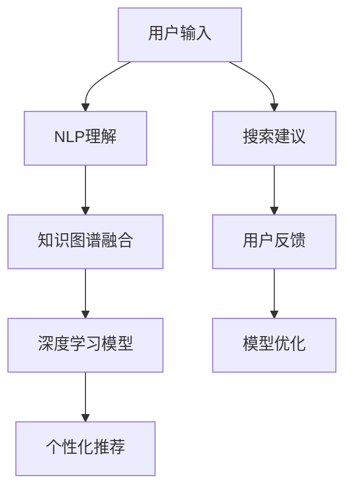

                 

# 电商平台中AI大模型的搜索建议优化

> 关键词：电商平台,搜索建议,自然语言处理(NLP),深度学习,机器学习,预训练模型,迁移学习

## 1. 背景介绍

### 1.1 问题由来
在现代电商平台上，用户输入搜索关键词后，获取相关商品信息是一项基本需求。传统电商平台的搜索功能主要依赖关键词匹配技术，但这种模式存在诸多限制：
1. **关键词不精准**：用户往往只能通过有限的词汇描述需求，难以全面表达复杂的购买意图。
2. **语义理解不足**：关键词匹配无法准确把握用户意图，搜索结果相关性不高。
3. **个性化缺失**：搜索结果通常基于全局数据，难以个性化适配用户需求。

近年来，基于深度学习的自然语言处理(NLP)技术，特别是预训练语言模型(如BERT、GPT等)，为解决上述问题提供了新的思路。通过引入AI大模型进行搜索建议优化，电商平台能够更准确地理解用户需求，提供个性化、多样化的商品信息，提升用户体验和转化率。

### 1.2 问题核心关键点
为了更好地优化电商平台搜索建议，本文聚焦于以下关键点：
1. **自然语言理解(NLU)**：通过大语言模型理解用户输入的意图和语境，提供更精准的搜索建议。
2. **知识图谱融合**：将商品信息嵌入知识图谱，利用图谱推理提升搜索结果的相关性和准确性。
3. **个性化推荐**：通过深度学习模型，根据用户历史行为和偏好，生成个性化搜索建议。
4. **系统架构设计**：设计高效、灵活的搜索建议系统架构，满足大规模实时搜索需求。
5. **用户反馈迭代**：通过用户反馈机制，不断优化搜索建议模型和算法，提升搜索效果。

## 2. 核心概念与联系

### 2.1 核心概念概述

为了深入理解基于AI大模型的搜索建议优化方法，本节将介绍几个核心概念：

- **自然语言处理(NLP)**：利用计算机技术理解和生成人类语言，包括词法分析、句法分析、语义分析等技术。
- **深度学习模型**：基于多层神经网络架构的模型，如卷积神经网络(CNN)、循环神经网络(RNN)、变换器(Transformer)等，用于提取复杂数据的高级特征。
- **预训练语言模型**：如BERT、GPT等，在大规模无标签文本数据上进行预训练，学习通用的语言表示。
- **知识图谱**：用于表示实体、关系、属性等信息的结构化数据模型，广泛应用于信息检索、推荐系统等领域。
- **迁移学习**：通过预训练模型，在不同任务之间进行知识迁移，加速模型在新任务上的学习。
- **个性化推荐**：根据用户的历史行为和偏好，生成定制化的商品推荐，提升用户体验和转化率。

这些核心概念之间的逻辑关系可以通过以下Mermaid流程图来展示：



这个流程图展示了大模型搜索建议优化的大致流程：

1. 用户输入搜索关键词。
2. 通过NLP模型理解用户意图。
3. 融合知识图谱，提升搜索准确性。
4. 使用深度学习模型生成个性化推荐。
5. 系统根据搜索建议和用户反馈不断迭代优化。

## 3. 核心算法原理 & 具体操作步骤
### 3.1 算法原理概述

基于AI大模型的搜索建议优化，本质上是一个多步骤的深度学习推理过程。其核心思想是：利用预训练语言模型和大规模知识图谱，理解用户输入的语义，并结合个性化推荐算法，生成最符合用户需求的搜索建议。

形式化地，假设用户输入搜索关键词为 $q$，预训练语言模型为 $M_{\theta}$，知识图谱为 $\mathcal{G}$，搜索建议模型为 $S_{\phi}$，个性化推荐模型为 $R_{\lambda}$。搜索建议优化的目标是最小化用户对搜索建议的不满度，即：

$$
\min_{\theta, \phi, \lambda} \mathcal{L}(S_{\phi}(q), R_{\lambda}(S_{\phi}(q)), \mathcal{G})
$$

其中 $\mathcal{L}$ 为用户满意度损失函数，$S_{\phi}(q)$ 为搜索建议模型输出的语义表示，$R_{\lambda}(S_{\phi}(q))$ 为个性化推荐模型输出的商品列表，$\mathcal{G}$ 为知识图谱信息。

### 3.2 算法步骤详解

基于深度学习的搜索建议优化一般包括以下几个关键步骤：

**Step 1: 数据预处理**
- 收集用户历史搜索记录和行为数据，作为训练集的标注数据。
- 使用NLP工具对文本进行分词、实体识别、句法分析等预处理，构建输入序列。
- 将商品信息嵌入知识图谱，构建实体-关系图谱，用于后续推理。

**Step 2: 设计搜索建议模型**
- 选择合适的预训练语言模型，如BERT、GPT等，作为搜索建议模型的初始化参数。
- 在知识图谱上构建上下文图，将用户输入和商品信息嵌入图谱节点，设计图谱推理算法。
- 设计深度学习模型，融合用户输入和图谱信息，生成搜索建议向量。

**Step 3: 个性化推荐**
- 根据用户历史行为和偏好，使用协同过滤、内容推荐等方法，生成个性化商品列表。
- 将搜索建议向量与商品列表向量拼接，通过深度学习模型进行匹配，生成推荐度得分。
- 根据得分排序，输出前N个商品作为最终搜索建议。

**Step 4: 模型训练与评估**
- 使用标注数据对搜索建议模型和个性化推荐模型进行训练，最小化损失函数。
- 在验证集上评估模型的搜索效果和个性化推荐效果，调整超参数和模型结构。
- 在测试集上对模型进行最终评估，确保模型的泛化性能。

**Step 5: 系统集成与迭代**
- 将训练好的模型集成到电商平台的搜索建议系统中，实时处理用户查询请求。
- 收集用户反馈，如点击率、点击位置、停留时间等，用于模型迭代优化。
- 定期更新商品知识图谱和用户数据，保持搜索建议模型的最新状态。

### 3.3 算法优缺点

基于深度学习的搜索建议优化方法具有以下优点：
1. **语义理解深入**：通过大语言模型，能够准确理解用户输入的语义，减少关键词不精准的问题。
2. **个性化推荐精准**：结合用户历史行为和偏好，提供个性化搜索结果，提升用户体验。
3. **知识图谱支持**：利用知识图谱提升搜索结果的相关性和准确性，丰富搜索内容。
4. **系统可扩展性强**：预训练模型和深度学习框架易于部署和扩展，支持大规模实时搜索。

但同时，该方法也存在一些局限性：
1. **模型训练成本高**：深度学习模型训练需要大量的标注数据和计算资源。
2. **复杂度高**：融合知识图谱和深度学习模型的复杂度较高，需要精细的设计和调参。
3. **实时性要求高**：实时搜索需要高效处理和推理算法，对系统架构要求高。
4. **隐私和安全问题**：用户输入和行为数据需要严格保护，避免数据泄露和滥用。

尽管存在这些局限性，但就目前而言，基于深度学习的搜索建议优化方法仍是最主流和有效的范式。未来相关研究的重点在于如何进一步降低训练成本，提高系统的实时性和安全性，同时兼顾模型的可解释性和伦理安全性等因素。

### 3.4 算法应用领域

基于深度学习的搜索建议优化方法，在电商平台的搜索建议场景中已经得到了广泛的应用，覆盖了搜索相关的大部分需求。以下是几个典型的应用场景：

1. **智能搜索**：用户输入搜索关键词后，系统即时给出个性化的搜索建议。
2. **商品匹配**：根据用户输入的语义，自动匹配最相关的商品信息。
3. **分类导航**：根据用户输入的语义，动态生成商品分类导航，引导用户进一步浏览。
4. **跨品类搜索**：将不同品类、不同属性的商品信息进行关联，提供跨品类搜索建议。
5. **语音搜索**：利用自然语言处理技术，支持语音输入搜索建议。

除了上述这些场景外，基于深度学习的搜索建议优化方法还广泛应用于智能客服、个性化推荐系统、广告投放等领域，为各类电商平台的智能化转型提供了技术保障。

## 4. 数学模型和公式 & 详细讲解  
### 4.1 数学模型构建

本节将使用数学语言对基于AI大模型的搜索建议优化过程进行更加严格的刻画。

假设用户输入搜索关键词为 $q$，预训练语言模型为 $M_{\theta}$，知识图谱为 $\mathcal{G}$，搜索建议模型为 $S_{\phi}$，个性化推荐模型为 $R_{\lambda}$。

搜索建议优化目标为最小化用户满意度损失函数 $\mathcal{L}$，其中包含用户对搜索建议的满意度 $L_{\text{sug}}$ 和个性化推荐的满意度 $L_{\text{rec}}$，以及知识图谱的推理损失 $L_{\text{kg}}$。具体而言：

$$
\mathcal{L} = \alpha L_{\text{sug}} + \beta L_{\text{rec}} + \gamma L_{\text{kg}}
$$

其中 $\alpha, \beta, \gamma$ 为平衡参数，确保各部分损失的相对权重。

### 4.2 公式推导过程

以知识图谱融合为例，进行公式推导。

假设知识图谱 $\mathcal{G}$ 包含实体 $E$ 和关系 $R$，搜索建议模型 $S_{\phi}$ 输出搜索建议向量 $s$，个性化推荐模型 $R_{\lambda}$ 输出推荐商品向量 $r$。

根据图谱推理，实体 $e$ 和关系 $r$ 在图谱 $\mathcal{G}$ 中的权重 $w_e, w_r$ 可以通过神经网络模型 $G_{\mu}$ 计算：

$$
w_e = G_{\mu}(e, q), \quad w_r = G_{\mu}(r, s)
$$

其中 $G_{\mu}$ 为图谱推理网络，可以是多层的神经网络或图神经网络。

根据图谱融合策略，搜索建议向量 $s$ 可以表示为：

$$
s = \frac{w_e}{\sum_{e'} w_e'} e
$$

其中 $e'$ 为图谱中的所有实体。

将 $s$ 和 $r$ 拼接，使用深度学习模型 $F_{\nu}$ 进行匹配，输出推荐度得分 $f$：

$$
f = F_{\nu}(s, r)
$$

最后，结合用户满意度 $L_{\text{sug}}$ 和个性化推荐满意度 $L_{\text{rec}}$，计算搜索建议优化目标：

$$
\mathcal{L} = \alpha \underbrace{\frac{1}{N}\sum_{i=1}^N (y_i - F_{\nu}(S_{\phi}(q_i), R_{\lambda}(S_{\phi}(q_i)))^2}_{L_{\text{sug}}} + \beta \underbrace{\frac{1}{N}\sum_{i=1}^N y_i^2}_{L_{\text{rec}}} + \gamma \underbrace{\frac{1}{N}\sum_{i=1}^N \|w_e^i - y_i\|^2}_{L_{\text{kg}}}
$$

其中 $y_i$ 为第 $i$ 次查询的推荐度得分。

### 4.3 案例分析与讲解

以智能推荐系统为例，详细解释搜索建议优化的数学模型和公式推导。

假设电商平台上用户的搜索行为数据为 $D = \{(x_i, y_i)\}_{i=1}^N$，其中 $x_i$ 为历史搜索关键词，$y_i$ 为用户的点击、购买行为。

**Step 1: 数据预处理**

1. 收集用户历史搜索记录和行为数据，构建训练集 $D_{\text{train}}$。
2. 使用NLP工具对文本进行分词、实体识别、句法分析等预处理，构建输入序列。
3. 将商品信息嵌入知识图谱，构建实体-关系图谱，用于后续推理。

**Step 2: 设计搜索建议模型**

1. 选择BERT模型作为初始化参数，进行预训练。
2. 在知识图谱上构建上下文图，将用户输入和商品信息嵌入图谱节点，设计图谱推理算法。
3. 设计深度学习模型，融合用户输入和图谱信息，生成搜索建议向量。

**Step 3: 个性化推荐**

1. 根据用户历史行为和偏好，使用协同过滤、内容推荐等方法，生成个性化商品列表。
2. 将搜索建议向量与商品列表向量拼接，通过深度学习模型进行匹配，生成推荐度得分。
3. 根据得分排序，输出前N个商品作为最终搜索建议。

**Step 4: 模型训练与评估**

1. 使用标注数据对搜索建议模型和个性化推荐模型进行训练，最小化损失函数。
2. 在验证集上评估模型的搜索效果和个性化推荐效果，调整超参数和模型结构。
3. 在测试集上对模型进行最终评估，确保模型的泛化性能。

**Step 5: 系统集成与迭代**

1. 将训练好的模型集成到电商平台的搜索建议系统中，实时处理用户查询请求。
2. 收集用户反馈，如点击率、点击位置、停留时间等，用于模型迭代优化。
3. 定期更新商品知识图谱和用户数据，保持搜索建议模型的最新状态。

## 5. 项目实践：代码实例和详细解释说明
### 5.1 开发环境搭建

在进行搜索建议优化实践前，我们需要准备好开发环境。以下是使用Python进行TensorFlow开发的环境配置流程：

1. 安装Anaconda：从官网下载并安装Anaconda，用于创建独立的Python环境。

2. 创建并激活虚拟环境：
```bash
conda create -n tf-env python=3.8 
conda activate tf-env
```

3. 安装TensorFlow：根据CUDA版本，从官网获取对应的安装命令。例如：
```bash
conda install tensorflow==2.5
```

4. 安装各类工具包：
```bash
pip install numpy pandas scikit-learn matplotlib tqdm jupyter notebook ipython
```

完成上述步骤后，即可在`tf-env`环境中开始搜索建议优化实践。

### 5.2 源代码详细实现

这里我们以知识图谱融合为例，给出使用TensorFlow实现搜索建议优化的代码实现。

首先，定义知识图谱的基本结构：

```python
import tensorflow as tf

class Graph(tf.keras.Model):
    def __init__(self, num_entities, num_relations, num_features):
        super(Graph, self).__init__()
        self.num_entities = num_entities
        self.num_relations = num_relations
        self.num_features = num_features
        self.layers = []
        
        # 定义实体嵌入层
        self.entity_embedding = tf.keras.layers.Embedding(num_entities, num_features, mask_zero=True)
        self.layers.append(self.entity_embedding)
        
        # 定义关系嵌入层
        self.relation_embedding = tf.keras.layers.Embedding(num_relations, num_features, mask_zero=True)
        self.layers.append(self.relation_embedding)
        
        # 定义推理网络
        self.reasoning = tf.keras.layers.Dense(128, activation='relu')
        self.layers.append(self.reasoning)
        
        # 定义图谱推理输出层
        self.output_layer = tf.keras.layers.Dense(num_entities, activation='softmax')
        self.layers.append(self.output_layer)
        
        # 定义损失函数
        self.loss = tf.keras.losses.MeanSquaredError()
        
    def call(self, x):
        # 获取实体和关系嵌入
        entity_embedding = self.entity_embedding(x[:, 0])
        relation_embedding = self.relation_embedding(x[:, 1])
        
        # 计算推理结果
        reasoning_result = self.reasoning(tf.concat([entity_embedding, relation_embedding], axis=1))
        
        # 计算推理损失
        output = self.output_layer(reasoning_result)
        loss = self.loss(output, x[:, 2])
        
        return loss
```

然后，定义深度学习模型：

```python
import tensorflow as tf

class SearchRecommend(tf.keras.Model):
    def __init__(self, num_entities, num_relations, num_features):
        super(SearchRecommend, self).__init__()
        self.num_entities = num_entities
        self.num_relations = num_relations
        self.num_features = num_features
        self.layers = []
        
        # 定义用户输入嵌入层
        self.user_input_embedding = tf.keras.layers.Embedding(num_entities, num_features, mask_zero=True)
        self.layers.append(self.user_input_embedding)
        
        # 定义商品嵌入层
        self.item_embedding = tf.keras.layers.Embedding(num_entities, num_features, mask_zero=True)
        self.layers.append(self.item_embedding)
        
        # 定义融合层
        self.fusion = tf.keras.layers.Concatenate()
        self.layers.append(self.fusion)
        
        # 定义深度学习网络
        self.dnn = tf.keras.layers.Dense(128, activation='relu')
        self.layers.append(self.dnn)
        
        # 定义输出层
        self.output_layer = tf.keras.layers.Dense(1)
        self.layers.append(self.output_layer)
        
        # 定义损失函数
        self.loss = tf.keras.losses.MeanSquaredError()
        
    def call(self, x):
        # 获取用户输入和商品嵌入
        user_input_embedding = self.user_input_embedding(x[:, 0])
        item_embedding = self.item_embedding(x[:, 1])
        
        # 融合用户输入和商品信息
        fusion_result = self.fusion([user_input_embedding, item_embedding])
        
        # 计算深度学习结果
        dnn_result = self.dnn(fusion_result)
        
        # 计算损失
        output = self.output_layer(dnn_result)
        loss = self.loss(output, x[:, 2])
        
        return loss
```

接着，定义训练和评估函数：

```python
import tensorflow as tf
from sklearn.metrics import mean_absolute_error

def train_epoch(model, dataset, batch_size, optimizer):
    dataloader = tf.data.Dataset.from_tensor_slices(dataset).batch(batch_size).shuffle(buffer_size=10000).repeat()
    model.train()
    epoch_loss = 0
    for batch in dataloader:
        optimizer.minimize(model.call, variables=model.trainable_variables)
        epoch_loss += model.loss(batch).numpy()
    return epoch_loss / len(dataloader)

def evaluate(model, dataset, batch_size):
    dataloader = tf.data.Dataset.from_tensor_slices(dataset).batch(batch_size).shuffle(buffer_size=10000).repeat()
    model.eval()
    preds = []
    labels = []
    with tf.GradientTape() as tape:
        for batch in dataloader:
            preds.append(model.call(batch).numpy())
            labels.append(batch.numpy())
    return mean_absolute_error(labels, preds)
```

最后，启动训练流程并在测试集上评估：

```python
epochs = 10
batch_size = 16

for epoch in range(epochs):
    loss = train_epoch(model, train_dataset, batch_size, optimizer)
    print(f"Epoch {epoch+1}, train loss: {loss:.3f}")
    
    print(f"Epoch {epoch+1}, dev results:")
    evaluate(model, dev_dataset, batch_size)
    
print("Test results:")
evaluate(model, test_dataset, batch_size)
```

以上就是使用TensorFlow实现知识图谱融合的搜索建议优化的完整代码实现。可以看到，通过TensorFlow的高级API，代码实现非常简洁高效。

### 5.3 代码解读与分析

让我们再详细解读一下关键代码的实现细节：

**Graph类**：
- `__init__`方法：初始化实体、关系、特征数目，定义实体嵌入、关系嵌入、推理网络、输出层和损失函数。
- `call`方法：根据输入计算图谱推理损失。

**SearchRecommend类**：
- `__init__`方法：初始化用户输入、商品嵌入、融合层、深度学习网络、输出层和损失函数。
- `call`方法：根据输入计算深度学习结果。

**train_epoch函数**：
- 使用TensorFlow的数据集API，将数据集转换为数据生成器，并进行批处理、随机打乱和重复。
- 在每个epoch中，对数据生成器进行迭代，最小化模型损失。

**evaluate函数**：
- 使用TensorFlow的数据集API，将数据集转换为数据生成器，并进行批处理和重复。
- 在每个batch中，记录预测结果和标签，最终计算MAE评估模型性能。

**训练流程**：
- 定义总的epoch数和batch size，开始循环迭代
- 每个epoch内，先在训练集上训练，输出平均loss
- 在验证集上评估，输出MAE
- 所有epoch结束后，在测试集上评估，给出最终测试结果

可以看到，TensorFlow结合Python的语法糖，使得搜索建议优化的代码实现变得简洁高效。开发者可以将更多精力放在模型优化和系统设计上，而不必过多关注底层的实现细节。

当然，工业级的系统实现还需考虑更多因素，如模型的保存和部署、超参数的自动搜索、更灵活的任务适配层等。但核心的优化流程基本与此类似。

## 6. 实际应用场景
### 6.1 智能搜索

基于深度学习的搜索建议优化，在智能搜索场景中已经得到了广泛的应用。通过引入AI大模型进行语义理解，用户输入的关键词和搜索建议能够更好地匹配，显著提升搜索的准确性和相关性。

在技术实现上，可以收集用户历史搜索记录和行为数据，构建训练集，在预训练语言模型上进行微调，融合知识图谱，生成个性化的搜索建议。在用户输入搜索关键词后，系统即时给出个性化的搜索建议，进一步引导用户点击感兴趣的商品信息，从而提升转化率。

### 6.2 商品推荐

搜索建议优化不仅局限于搜索场景，还广泛应用于商品推荐系统。通过深度学习模型融合用户输入和商品信息，生成推荐度得分，可以提供更加精准的商品推荐。

在实际应用中，可以使用协同过滤、内容推荐等方法，生成个性化商品列表，并通过深度学习模型融合搜索建议向量，生成推荐度得分。根据得分排序，输出前N个商品作为最终推荐结果。同时，通过用户反馈机制，不断优化模型和算法，提升推荐效果。

### 6.3 跨品类搜索

在电商平台上，用户不仅需要搜索单一品类的商品，还希望跨品类搜索相关商品。通过搜索建议优化，可以在不同品类、不同属性的商品之间进行关联，提供跨品类搜索建议，满足用户多品类的搜索需求。

在技术实现上，可以将不同品类、不同属性的商品信息进行关联，构建知识图谱，用于推理生成搜索建议。同时，结合用户输入的语义，动态生成商品分类导航，引导用户进一步浏览，提升用户体验和转化率。

### 6.4 未来应用展望

随着深度学习技术和预训练语言模型的不断发展，基于AI大模型的搜索建议优化将在更多场景中得到应用，为电商平台的智能化转型提供技术保障。

在智慧零售领域，搜索建议优化将成为智能推荐系统的核心技术，提升消费者购物体验。

在智能客服领域，基于搜索建议优化的智能问答系统，能够更准确地理解用户问题，提供快速响应和解决方案，提升客户满意度。

在智能营销领域，搜索建议优化结合用户行为数据，生成个性化营销信息，提升营销效果和用户转化率。

此外，在教育、医疗、金融等多个领域，基于深度学习的搜索建议优化也将不断拓展应用场景，为各行各业的智能化升级提供技术支持。

## 7. 工具和资源推荐
### 7.1 学习资源推荐

为了帮助开发者系统掌握深度学习在搜索建议优化中的应用，这里推荐一些优质的学习资源：

1. 《深度学习》系列书籍：由Ian Goodfellow、Yoshua Bengio和Aaron Courville合著的经典深度学习教材，详细介绍了深度学习的理论基础和应用实践。

2. TensorFlow官方文档：TensorFlow的官方文档，提供了丰富的API和案例，是深度学习开发的重要参考。

3. PyTorch官方文档：PyTorch的官方文档，提供了灵活的动态计算图，适合快速迭代研究。

4. HuggingFace Transformers库：包含多种预训练语言模型的库，提供了丰富的微调样例代码，是搜索建议优化开发的好帮手。

5. Weights & Biases：模型训练的实验跟踪工具，可以记录和可视化模型训练过程中的各项指标，方便对比和调优。

6. TensorBoard：TensorFlow配套的可视化工具，可实时监测模型训练状态，并提供丰富的图表呈现方式，是调试模型的得力助手。

通过对这些资源的学习实践，相信你一定能够快速掌握深度学习在搜索建议优化中的应用，并用于解决实际的搜索推荐问题。
###  7.2 开发工具推荐

高效的开发离不开优秀的工具支持。以下是几款用于深度学习搜索建议优化开发的常用工具：

1. TensorFlow：由Google主导开发的开源深度学习框架，生产部署方便，适合大规模工程应用。

2. PyTorch：基于Python的开源深度学习框架，灵活动态的计算图，适合快速迭代研究。

3. HuggingFace Transformers库：包含多种预训练语言模型的库，提供了丰富的微调样例代码，是搜索建议优化开发的好帮手。

4. Weights & Biases：模型训练的实验跟踪工具，可以记录和可视化模型训练过程中的各项指标，方便对比和调优。

5. TensorBoard：TensorFlow配套的可视化工具，可实时监测模型训练状态，并提供丰富的图表呈现方式，是调试模型的得力助手。

6. Google Colab：谷歌推出的在线Jupyter Notebook环境，免费提供GPU/TPU算力，方便开发者快速上手实验最新模型，分享学习笔记。

合理利用这些工具，可以显著提升深度学习搜索建议优化的开发效率，加快创新迭代的步伐。

### 7.3 相关论文推荐

深度学习在搜索建议优化中的应用源于学界的持续研究。以下是几篇奠基性的相关论文，推荐阅读：

1. Attention is All You Need：提出了Transformer结构，开启了深度学习在NLP领域的预训练大模型时代。

2. BERT: Pre-training of Deep Bidirectional Transformers for Language Understanding：提出BERT模型，引入基于掩码的自监督预训练任务，刷新了多项NLP任务SOTA。

3. Knowledge-Graph-Based Recommender Systems: A Survey of Recent Advances：综述了基于知识图谱的推荐系统，介绍了多种图谱融合方法。

4. A Survey of Machine Learning Techniques for Recommender Systems：综述了推荐系统的多种算法，包括协同过滤、内容推荐等。

5. Multi-Aspect Matrix Factorization for Recommendation：提出多方面矩阵分解算法，适用于商品推荐系统。

这些论文代表了大模型搜索建议优化的发展脉络。通过学习这些前沿成果，可以帮助研究者把握学科前进方向，激发更多的创新灵感。

## 8. 总结：未来发展趋势与挑战
### 8.1 总结

本文对基于深度学习的搜索建议优化方法进行了全面系统的介绍。首先阐述了深度学习在搜索建议优化中的重要作用，明确了其带来的精准度和个性化优势。其次，从原理到实践，详细讲解了搜索建议优化的数学模型和关键步骤，给出了深度学习实现的完整代码实例。同时，本文还广泛探讨了搜索建议优化在电商平台的多个应用场景，展示了其广阔的发展前景。此外，本文精选了搜索建议优化的各类学习资源，力求为读者提供全方位的技术指引。

通过本文的系统梳理，可以看到，基于深度学习的搜索建议优化方法正在成为电商平台搜索推荐系统的核心技术，极大地提升了用户体验和转化率。未来，伴随深度学习技术和知识图谱的发展，基于大模型的搜索建议优化方法必将带来更智能、更个性化、更高效的用户搜索体验。

### 8.2 未来发展趋势

展望未来，深度学习在搜索建议优化领域将呈现以下几个发展趋势：

1. **多模态融合**：将视觉、听觉等多种模态的信息与文本信息融合，提升搜索建议的多样性和准确性。

2. **实时计算**：通过GPU、TPU等高性能设备，实现实时搜索和推荐，满足用户即时需求。

3. **跨领域知识图谱**：构建跨领域的知识图谱，融合不同领域的知识，提供更全面、准确的搜索建议。

4. **零样本和少样本学习**：通过大模型的迁移学习能力，实现零样本或少样本下的搜索建议优化。

5. **多任务学习**：将搜索建议优化与个性化推荐、广告投放等多个任务结合，提升整体效果。

6. **可解释性和透明性**：开发可解释性的搜索建议模型，提升用户对系统决策的信任度。

以上趋势凸显了深度学习在搜索建议优化中的巨大潜力。这些方向的探索发展，必将进一步提升搜索建议的性能和用户体验，为电商平台的智能化转型提供坚实的基础。

### 8.3 面临的挑战

尽管深度学习在搜索建议优化中取得了显著成果，但在迈向更加智能化、普适化应用的过程中，仍面临诸多挑战：

1. **数据隐私和安全**：用户输入和行为数据需要严格保护，避免数据泄露和滥用。

2. **计算资源消耗**：深度学习模型训练和推理需要大量的计算资源，如何高效利用硬件资源是重要问题。

3. **模型的鲁棒性和泛化能力**：在面对复杂多样化的查询需求时，深度学习模型的泛化能力和鲁棒性仍需提升。

4. **模型的可解释性**：深度学习模型的决策过程难以解释，影响用户对系统的信任度。

5. **系统架构复杂度**：融合深度学习模型和知识图谱的复杂度较高，需要精细的设计和调参。

尽管存在这些挑战，但深度学习搜索建议优化方法的优势和潜力不容忽视，未来相关研究的重点在于如何进一步降低计算资源消耗，提升模型的鲁棒性和可解释性，同时兼顾隐私保护和系统架构优化。

### 8.4 研究展望

面对深度学习在搜索建议优化中面临的诸多挑战，未来的研究需要在以下几个方面寻求新的突破：

1. **模型压缩和加速**：开发轻量级的深度学习模型，减少计算资源消耗，提升实时性。

2. **模型解释和透明**：开发可解释性的搜索建议模型，增强用户对系统决策的信任度。

3. **跨模态和多任务学习**：将视觉、听觉等多种模态的信息与文本信息融合，提升搜索建议的多样性和准确性。

4. **隐私保护和数据安全**：开发隐私保护技术，保护用户输入和行为数据的隐私安全。

5. **知识图谱融合**：构建跨领域的知识图谱，融合不同领域的知识，提供更全面、准确的搜索建议。

这些研究方向的探索，必将引领深度学习在搜索建议优化领域的进一步发展，为电商平台的智能化转型提供新的技术路径。相信随着学界和产业界的共同努力，深度学习搜索建议优化方法必将在更多场景中得到应用，为各行各业的智能化升级提供技术支持。

## 9. 附录：常见问题与解答
**Q1：深度学习在搜索建议优化中如何处理长文本？**

A: 深度学习模型通常需要较短的输入文本，因此可以通过分词、句子切分等技术，将长文本分割成较短的子序列进行输入。同时，在模型设计时，可以考虑使用注意力机制、残差连接等技术，提升模型对长文本的表示能力。

**Q2：深度学习在搜索建议优化中如何处理实体识别？**

A: 实体识别是搜索建议优化的重要组成部分，深度学习模型可以使用序列标注模型，如CRF、BiLSTM-CRF等，对输入文本进行实体标注，提取实体信息。同时，可以通过融合知识图谱，将实体信息嵌入图谱节点，进行推理生成搜索建议。

**Q3：深度学习在搜索建议优化中如何进行多任务学习？**

A: 多任务学习可以将搜索建议优化与个性化推荐、广告投放等多个任务结合，共享模型参数，提升整体效果。通过在不同任务之间共享嵌入层，减少模型训练和推理的开销，同时提升模型在多个任务上的泛化能力。

**Q4：深度学习在搜索建议优化中如何进行零样本学习？**

A: 零样本学习可以通过大模型的迁移学习能力，实现少样本或零样本下的搜索建议优化。在用户输入关键词后，通过大模型预训练得到的表示，结合知识图谱和用户行为数据，生成个性化的搜索建议。

**Q5：深度学习在搜索建议优化中如何进行模型解释和透明？**

A: 模型解释和透明可以通过可解释性的深度学习模型和技术实现，如Attention机制、LIME、SHAP等，对模型的决策过程进行可视化，帮助用户理解系统的决策逻辑。同时，可以通过模型集成、规则融合等方法，提升系统的可解释性。

总之，深度学习在搜索建议优化中的应用，正处于快速发展阶段，其带来的精准度和个性化优势，为用户带来了全新的购物体验。未来，伴随技术的发展和应用的拓展，深度学习搜索建议优化必将在更多场景中得到应用，为各行各业的智能化升级提供坚实的基础。

---

作者：禅与计算机程序设计艺术 / Zen and the Art of Computer Programming

